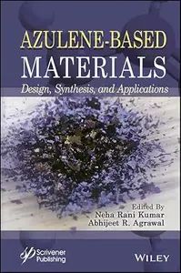
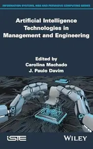
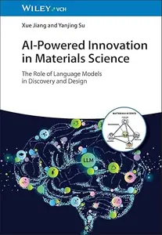
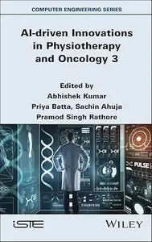

# Zavat feed - 2026-05-01

---

**Time:** 12:23:48 (Asia/Tehran)  
**Blog:** yoyoloit  

**Title:** Exceptional Me: How Donald Trump Exploited the Discourse of American Exceptionalism, Second Edition  

**Details:** English | 2026 | ISBN: 1350557420 | 249 pages | True PDF EPUB | 8.72 MB  

**Link:** http://zavat.pw/ebooks/1350557420.html  

---

**Time:** 12:23:48 (Asia/Tehran)  
**Blog:** yoyoloit  

**Title:** Victory through Influence: Origins of Psychological Operations in the US Army  

**Details:** English | 2026 | ISBN: 1648430341 | 290 pages | True PDF | 12.68 MB  

**Link:** http://zavat.pw/ebooks/1648430341.html  

---

**Time:** 12:23:48 (Asia/Tehran)  
**Blog:** yoyoloit  

**Title:** The Rise and Fall of Putinism and the Stakes of a Global War  

**Details:** English | 2026 | ISBN: 9798887198354 | 219 pages | True PDF | 5.88 MB  

**Link:** http://zavat.pw/ebooks/9798887198354.html  

---

**Time:** 12:23:48 (Asia/Tehran)  
**Blog:** yoyoloit  

**Title:** Incorruptible: Why Good Companies Go Bad... and How Great Companies Stay Great  

**Details:** English | 2026 | ISBN: 9798893311860 | 432 pages | True EPUB | 2.58 MB  

**Link:** http://zavat.pw/ebooks/9798893311860.html  

---

**Time:** 12:23:48 (Asia/Tehran)  
**Blog:** yoyoloit  

**Title:** Solar Eclipses (Kosmos)  

**Details:** English | 2026 | ISBN: 1836391692 | 254 pages | True PDF | 22.82 MB  

**Link:** http://zavat.pw/ebooks/1836391692.html  

---

**Time:** 12:23:48 (Asia/Tehran)  
**Blog:** yoyoloit  

**Title:** Law in the Era of AI: Clients, Firms, and the Future of the Legal Industry  

**Details:** English | 2026 | ISBN: 1394375719 | 352 pages | True EPUB | 2.65 MB  

**Link:** http://zavat.pw/ebooks/1394375719a.html  

---

**Time:** 12:23:48 (Asia/Tehran)  
**Blog:** yoyoloit  

**Title:** Cleft Lip and Palate: Advances in Diagnosis and Interdisciplinary Care  

**Details:** English | 2026 | ISBN: 9786555723588 | 1201 pages | True EPUB | 117.48 MB  

**Link:** http://zavat.pw/ebooks/9786555723588.html  

---

**Time:** 12:23:48 (Asia/Tehran)  
**Blog:** yoyoloit  

**Title:** Build Better Brains! : A Leader’s Guide to the World of Neuroscience, 2nd Edition  

**Details:** English | 2026 | ISBN: 163742325X , 9781606495896 | 188 pages | True PDF EPUB | 6.44 MB  

**Link:** http://zavat.pw/ebooks/9781606495896.html  

---

**Time:** 12:23:48 (Asia/Tehran)  
**Blog:** yoyoloit  

**Title:** ISO/IEC 27701:2025 : Comprehensive Guide to Privacy Information Management and ISO/IEC 27701 Standards  

**Details:** English | 2026 | ISBN: 9781808089787 | 80 pages | True EPUB | 392.6 KB  

**Link:** http://zavat.pw/ebooks/9781808089787.html  

---

**Time:** 12:23:48 (Asia/Tehran)  
**Blog:** yoyoloit  

**Title:** Seattle Field Guide: Explore Nature in the City  

**Details:** English | 2026 | ISBN: 1680517635 | 304 pages | True EPUB | 111.66 MB  

**Link:** http://zavat.pw/ebooks/1680517635.html  

---

**Time:** 12:23:48 (Asia/Tehran)  
**Blog:** yoyoloit  

**Title:** Fodor's Essential Greek Islands: with the Best of Athens, 3rd Edition  

**Details:** English | 2026 | ISBN: 1640978690 | 576 pages | True EPUB | 134.98 MB  

**Link:** http://zavat.pw/ebooks/1640978690.html  

---

**Time:** 12:23:48 (Asia/Tehran)  
**Blog:** yoyoloit  

**Title:** Teach to Sell: Why Top Salespeople Never Sell―and What They Do Instead  

**Details:** English | 2026 | ISBN: 9798895653067 | 320 pages | True EPUB | 2.03 MB  

**Link:** http://zavat.pw/ebooks/9798895653067.html  

---

**Time:** 12:23:48 (Asia/Tehran)  
**Blog:** yoyoloit  

**Title:** Fluid Universe: The Way of Structured Water and its Mathematical Foundations  

**Details:** English | 2026 | ISBN: 9815352156 | 451 pages | True PDF EPUB | 44.22 MB  

**Link:** http://zavat.pw/ebooks/9815352156.html  

---

**Time:** 12:23:48 (Asia/Tehran)  
**Blog:** yoyoloit  

**Title:** Corporate Sustainability and Business Management: An Integrative Approach  

**Details:** English | 2026 | ISBN: 1998511545 | 368 pages | True PDF EPUB | 13.93 MB  

**Link:** http://zavat.pw/ebooks/1998511545.html  

---

**Time:** 12:23:48 (Asia/Tehran)  
**Blog:** yoyoloit  

**Title:** AI in Healthcare : A Transparent Approach to Informatics  

**Details:** English | 2026 | ISBN: 1041036876 | 223 pages | True PDF EPUB | 10.8 MB  

**Link:** http://zavat.pw/ebooks/1041036876.html  

---

**Time:** 12:23:48 (Asia/Tehran)  
**Blog:** IrGens  

**Title:** Race for the Reichstag: The 1945 Battle for Berlin  

**Details:** English | August 19, 2010 | ISBN: 1848842309 | True EPUB | 288 pages | 20.6 MB  

**Link:** http://zavat.pw/ebooks/1848842309-epub.html  

---

**Time:** 12:23:48 (Asia/Tehran)  
**Blog:** IrGens  

**Title:** Panzers on the Vistula: Retreat and Rout in East Prussia 1945  

**Details:** English | November 2, 2018 | ISBN: 1526734311 | True EPUB | 160 pages | 8.4 MB  

**Link:** http://zavat.pw/ebooks/1526734311.html  

---

**Time:** 12:23:48 (Asia/Tehran)  
**Blog:** IrGens  

**Title:** USMC Tracked Amphibious Vehicles: T46E1/M76 Otter, M116 Husky, LVTP5, and LVTP7/AAV7A1  

**Details:** English | December 15, 2023 | ISBN: 0764367846 | True PDF | 144 pages | 149 MB  

**Link:** http://zavat.pw/ebooks/0764367846.html  

---

**Time:** 12:23:48 (Asia/Tehran)  
**Blog:** IrGens  

**Title:** M42 Duster: Self-Propelled Anti-Aircraft Vehicle  

**Details:** English | December 15, 2023 | ISBN: 076436782X | True PDF | 144 pages | 156 MB  

**Link:** http://zavat.pw/ebooks/076436782X.html  

---

**Time:** 12:23:48 (Asia/Tehran)  
**Blog:** IrGens  

**Title:** Equity Valuation Made Simple  

**Details:** .MP4, AVC, 1920x1080, 30 fps | English, AAC, 2 Ch | 1h 31m | 1.07 GB  

**Link:** http://zavat.pw/ebooks/equity-valuation-made-simple.html  

---

**Time:** 12:23:48 (Asia/Tehran)  
**Blog:** IrGens  

**Title:** As I Was Saying (Dalkey Archive Scholarly)  

**Details:** English | December 16, 2025 | ISBN: 1628974583 | True EPUB | 238 pages | 1.9 MB  

**Link:** http://zavat.pw/ebooks/1628974583.html  

---

**Time:** 12:23:48 (Asia/Tehran)  
**Blog:** IrGens  

**Title:** Oppositions: Selected Essays  

**Details:** English | November 11, 2021 | ISBN: 1788168151, 178816816X | True EPUB | 224 pages | 0.3 MB  

**Link:** http://zavat.pw/ebooks/1788168151.html  

---

**Time:** 12:23:48 (Asia/Tehran)  
**Blog:** IrGens  

**Title:** Distilling Knowledge: Alchemy, Chemistry, and the Scientific Revolution  

**Details:** English | January 30, 2005 | ISBN: 0674014952, 0674022491 | True EPUB | 224 pages | 1.7 MB  

**Link:** http://zavat.pw/ebooks/0674014952-epub.html  

---

**Time:** 12:23:48 (Asia/Tehran)  
**Blog:** IrGens  

**Title:** Dionysos: Archetypal Image of Indestructible Life  

**Details:** English | April 14, 2026 | ISBN: 0691281785, 0691281793 | True EPUB | 520 pages | 119 MB  

**Link:** http://zavat.pw/ebooks/0691281785.html  

---

**Time:** 12:23:48 (Asia/Tehran)  
**Blog:** IrGens  

**Title:** Once upon a Time There Was Truth: or, Why We Need Fairy Tales  

**Details:** English | April 21, 2026 | ISBN: 0300282389 | True EPUB | 200 pages | 9.5 MB  

**Link:** http://zavat.pw/ebooks/0300282389.html  

---

**Time:** 12:23:48 (Asia/Tehran)  
**Blog:** IrGens  

**Title:** Middlemen: Literary Agents and the Making of American Fiction  

**Details:** English | April 28, 2026 | ISBN: 0691256160 | True EPUB | 296 pages | 12.6 MB  

**Link:** http://zavat.pw/ebooks/0691256160.html  

---

**Time:** 12:23:48 (Asia/Tehran)  
**Blog:** IrGens  

**Title:** Modernism: The Basics  

**Details:** English | March 14, 2017 | ISBN: 0415713692, 0415713706 | True EPUB | 204 pages | 0.9 MB  

**Link:** http://zavat.pw/ebooks/0415713692.html  

---

**Time:** 12:23:48 (Asia/Tehran)  
**Blog:** IrGens  

**Title:** Cozy Little Landscapes in Watercolor: Super-Easy, Mini Painting Projects for Whimsical Forests, Charming Villages, and More  

**Details:** English | April 28, 2026 | ISBN: 9798890034298, 9798890034304 | True EPUB | 160 pages | 294 MB  

**Link:** http://zavat.pw/ebooks/9798890034298.html  

---

**Time:** 12:23:48 (Asia/Tehran)  
**Blog:** IrGens  

**Title:** From Life Itself: Turkey, Istanbul, and a Neighborhood in the Age of Erdoğan  

**Details:** English | April 28, 2026 | ISBN: 0374298432 | True EPUB | 368 pages | 2.7 MB  

**Link:** http://zavat.pw/ebooks/0374298432.html  

---

**Time:** 12:23:48 (Asia/Tehran)  
**Blog:** IrGens  

**Title:** Dopamine Kids  

**Details:** English | March 3, 2026 | ISBN: 166804983X | True EPUB | 384 pages | 14.2 MB  

**Link:** http://zavat.pw/ebooks/166804983X.html  

---

**Time:** 12:23:48 (Asia/Tehran)  
**Blog:** AvaxGenius  

**Title:** Encyclopedia of Big Data Technologies (Repost)  

**Details:** English | EPUB | 2019 | 1853 Pages | ISBN : 3319775243 | 109.8 MB  

**Link:** http://zavat.pw/ebooks/363197752443.html  

---

**Time:** 12:23:48 (Asia/Tehran)  
**Blog:** AvaxGenius  

**Title:** Geoforming Mars: How could nature have made Mars more like Earth? (Repost)  

**Details:** English | EPUB | 2021 | 437 Pages | ISBN : 3030588750 | 98.5 MB  

**Link:** http://zavat.pw/ebooks/303055887530.html  

---

**Time:** 12:23:48 (Asia/Tehran)  
**Blog:** AvaxGenius  

**Title:** First and Mid Trimester Ultrasound Diagnosis of Orofacial Clefts: An Atlas and Guide (Repost)  

**Details:** English | PDF EPUB (True) | 2021 | 186 Pages | ISBN : 9811646120 | 110.7 MB  

**Link:** http://zavat.pw/ebooks/298116461240.html  

---

**Time:** 12:23:48 (Asia/Tehran)  
**Blog:** AvaxGenius  

**Title:** Applications of Nanomaterials in Proteomics (Repost)  

**Details:** English | PDF,EPUB | 2021 | 431 Pages | ISBN : 9811658153 | 199.1 MB  

**Link:** http://zavat.pw/ebooks/982116581534.html  

---

**Time:** 12:23:48 (Asia/Tehran)  
**Blog:** AvaxGenius  

**Title:** Contrast-Enhanced Ultrasound in Pediatric Imaging (Repost)  

**Details:** English | EPUB | 2021 | 292 Pages | ISBN : 3030496902 | 120.6 MB  

**Link:** http://zavat.pw/ebooks/303104964902.html  

---

**Time:** 12:23:48 (Asia/Tehran)  
**Blog:** AvaxGenius  

**Title:** CyberKnife NeuroRadiosurgery: A practical Guide (Repost)  

**Details:** English | EPUB | 2020 | 604 Pages | ISBN : 3030506673 | 114.9 MB  

**Link:** http://zavat.pw/ebooks/303050266743.html  

---

**Time:** 12:23:48 (Asia/Tehran)  
**Blog:** AvaxGenius  

**Title:** Geology of Afar (East Africa) (Repost)  

**Details:** English | PDF,EPUB | 2017 (2018 Edition) | 345 Pages | ISBN : 3319608630 | 130.29 MB  

**Link:** http://zavat.pw/ebooks/3319640864430.html  

---

**Time:** 12:23:48 (Asia/Tehran)  
**Blog:** AvaxGenius  

**Title:** Design Computing and Cognition’20 (Repost)  

**Details:** English | EPUB | 2022 | 679 Pages | ISBN : 3030906248 | 97.1 MB  

**Link:** http://zavat.pw/ebooks/303209062484.html  

---

**Time:** 12:23:48 (Asia/Tehran)  
**Blog:** AvaxGenius  

**Title:** Basic Radiation Oncology (Repost)  

**Details:** English | EPUB | 2022 | 541 Pages | ISBN : 3030873072 | 199.2 MB  

**Link:** http://zavat.pw/ebooks/303104873072.html  

---

**Time:** 12:23:48 (Asia/Tehran)  
**Blog:** AvaxGenius  

**Title:** Prostate Biopsy Interpretation: An Illustrated Guide (Repost)  

**Details:** English | EPUB | 2019 | 212 Pages | ISBN : 3030136000 | 548.3 MB  

**Link:** http://zavat.pw/ebooks/303013246000.html  

---

**Time:** 12:23:48 (Asia/Tehran)  
**Blog:** AvaxGenius  

**Title:** Computer Vision – ECCV 2020 (Repost)  

**Details:** English | PDF | 2020 | 830 Pages | ISBN : 3030585794 | 197.5 MB  

**Link:** http://zavat.pw/ebooks/3030458574494.html  

---

**Time:** 12:23:48 (Asia/Tehran)  
**Blog:** AvaxGenius  

**Title:** Shoulderology: Searching for "Whys" Related to the Shoulder (Repost)  

**Details:** English | PDF,EPUB | 2023 | 257 Pages | ISBN : 9819903440 | 119.7 MB  

**Link:** http://zavat.pw/ebooks/9812990443440.html  

---

**Time:** 12:23:48 (Asia/Tehran)  
**Blog:** AvaxGenius  

**Title:** Collage: A Process in Architectural Design (Repost)  

**Details:** English | EPUB | 2021 | 196 Pages | ISBN : 3030637948 | 226.6 MB  

**Link:** http://zavat.pw/ebooks/3030263794448.html  

---

**Time:** 12:23:48 (Asia/Tehran)  
**Blog:** AvaxGenius  

**Title:** Life Support Systems for Humans in Space (Repost)  

**Details:** English | EPUB | 2020 | 323 Pages | ISBN : 3030528588 | 116.5 MB  

**Link:** http://zavat.pw/ebooks/301305248588.html  

---

**Time:** 12:23:48 (Asia/Tehran)  
**Blog:** AvaxGenius  

**Title:** Networking, Intelligent Systems and Security: Proceedings of NISS 2021 (Repost)  

**Details:** English | EPUB | 2022 | 885 Pages | ISBN : 9811636362 | 143.6 MB  

**Link:** http://zavat.pw/ebooks/981146363262.html  

---

**Time:** 12:23:48 (Asia/Tehran)  
**Blog:** hill0  

**Title:** Drug Discovery Targeting Metalloenzymes: Strategies and Applications  

**Details:** English | 2026 | ISBN: 3527354247 | 935 Pages | EPUB (True) | 95 MB  

**Link:** http://zavat.pw/ebooks/3527354247e.html  

---

**Time:** 12:23:48 (Asia/Tehran)  
**Blog:** hill0  

**Title:** Confronting Mental Health Stigma with AI and Machine Learning  

**Details:** English | 2026 | ISBN: 139434726X | 456 Pages | PDF (True) | 6 MB  

**Link:** http://zavat.pw/ebooks/139434726X.html  

---

**Time:** 12:23:48 (Asia/Tehran)  
**Blog:** hill0  

**Title:** Azulene-Based Materials: Design, Synthesis, and Applications  

**Details:** English | 2026 | ISBN: 1394159153 | 478 Pages | EPUB (True) | 31 MB  

**Link:** http://zavat.pw/ebooks/1394159153E.html  

---

**Time:** 12:23:48 (Asia/Tehran)  
**Blog:** hill0  

**Title:** Artificial Intelligence Technologies in Management and Engineering  

**Details:** English | 2026 | ISBN: 1836690525 | 337 Pages | EPUB (True) | 15 MB  

**Link:** http://zavat.pw/ebooks/1836690525e.html  

---

**Time:** 12:23:48 (Asia/Tehran)  
**Blog:** hill0  

**Title:** Applied Math with Python  

**Details:** English | 2026 | ISBN: 139437075X | 414 Pages | EPUB (True) | 9 MB  

**Link:** http://zavat.pw/ebooks/139437075Xe.html  

---

**Time:** 12:23:48 (Asia/Tehran)  
**Blog:** hill0  

**Title:** AI-Powered Innovation in Materials Science  

**Details:** English | 2026 | ISBN: 3527356355 | 825 Pages | EPUB (True) | 52 MB  

**Link:** http://zavat.pw/ebooks/3527356355.html  

---

**Time:** 12:23:48 (Asia/Tehran)  
**Blog:** hill0  

**Title:** AI-driven Innovations in Physiotherapy and Oncology 3  

**Details:** English | 2026 | ISBN: 1836690886 | 452 Pages | EPUB (True) | 0.8 MB  

**Link:** http://zavat.pw/ebooks/1836690886.html  

---

**Time:** 12:23:48 (Asia/Tehran)  
**Blog:** hill0  

**Title:** Achieving Total Value in the Built Environment  

**Details:** English | 2026 | ISBN: 1394258550 | 227 Pages | PDF (True) | 3 MB  

**Link:** http://zavat.pw/ebooks/1394258550.html  

---

**Time:** 12:23:48 (Asia/Tehran)  
**Blog:** hill0  

**Title:** A Companion to the Second World War, 2 Volume Set  

**Details:** English | 2026 | ISBN: 1394208693 | 1713 Pages | EPUB (True) | 2 MB  

**Link:** http://zavat.pw/ebooks/1394208693e.html  

---

**Time:** 12:23:48 (Asia/Tehran)  
**Blog:** hill0  

**Title:** Adapt to Win: A Framework to Overcome Strategy Decay Using OKRs and Lean Portfolio Management  

**Details:** English | 2026 | ISBN: 139437755X | 319 Pages | EPUB | 8 MB  

**Link:** http://zavat.pw/ebooks/139437755X.html  

---

**Time:** 12:23:48 (Asia/Tehran)  
**Blog:** hill0  

**Title:** Inspire with Impact: Engage People, Encourage Decisions, Enable Success  

**Details:** English | 2026 | ISBN: 3658503483 | 265 Pages | PDF EPUB (True) | 45 MB  

**Link:** http://zavat.pw/ebooks/3658503483.html  

---

**Time:** 12:23:48 (Asia/Tehran)  
**Blog:** hill0  

**Title:** Day Hiking Southeast Alaska  

**Details:** English | 2026 | ISBN: 1680517406 | 417 Pages | EPUB (True) | 138 MB  

**Link:** http://zavat.pw/ebooks/1680517406.html  

---

**Time:** 12:23:48 (Asia/Tehran)  
**Blog:** hill0  

**Title:** Le Temps - 1 Mai 2026  

**Details:** Français | 20 pages | True PDF | 8 MB  

**Link:** http://zavat.pw/newspapers/le-temps-20260501.html  

---

**Time:** 12:23:48 (Asia/Tehran)  
**Blog:** hill0  

**Title:** New Guinea 1943–44: The Allies assume the offensive  

**Details:** English | 2026 | ISBN: 1472870352 | 97 Pages | PDF EPUB (True) | 104 MB  

**Link:** http://zavat.pw/ebooks/1472870352.html  

---

**Time:** 12:23:48 (Asia/Tehran)  
**Blog:** hill0  

**Title:** 3GE Collection on Environmental Science: Volcanology  

**Details:** English | 2023 | ISBN: 1984681028 | 284 Pages | PDF (True) | 17 MB  

**Link:** http://zavat.pw/ebooks/1984681028.html  

