# Zavat feed - 2026-05-01

---

**Time:** 17:53:19 (Asia/Tehran)  
**Blog:** yoyoloit  

**Title:** Exceptional Me: How Donald Trump Exploited the Discourse of American Exceptionalism, Second Edition  

**Details:** English | 2026 | ISBN: 1350557420 | 249 pages | True PDF EPUB | 8.72 MB  

**Link:** http://zavat.pw/ebooks/1350557420.html  

---

**Time:** 17:53:19 (Asia/Tehran)  
**Blog:** yoyoloit  

**Title:** Victory through Influence: Origins of Psychological Operations in the US Army  

**Details:** English | 2026 | ISBN: 1648430341 | 290 pages | True PDF | 12.68 MB  

**Link:** http://zavat.pw/ebooks/1648430341.html  

---

**Time:** 17:53:19 (Asia/Tehran)  
**Blog:** yoyoloit  

**Title:** The Rise and Fall of Putinism and the Stakes of a Global War  

**Details:** English | 2026 | ISBN: 9798887198354 | 219 pages | True PDF | 5.88 MB  

**Link:** http://zavat.pw/ebooks/9798887198354.html  

---

**Time:** 17:53:19 (Asia/Tehran)  
**Blog:** yoyoloit  

**Title:** Incorruptible: Why Good Companies Go Bad... and How Great Companies Stay Great  

**Details:** English | 2026 | ISBN: 9798893311860 | 432 pages | True EPUB | 2.58 MB  

**Link:** http://zavat.pw/ebooks/9798893311860.html  

---

**Time:** 17:53:19 (Asia/Tehran)  
**Blog:** yoyoloit  

**Title:** Solar Eclipses (Kosmos)  

**Details:** English | 2026 | ISBN: 1836391692 | 254 pages | True PDF | 22.82 MB  

**Link:** http://zavat.pw/ebooks/1836391692.html  

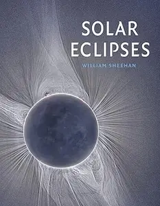

---

**Time:** 17:53:19 (Asia/Tehran)  
**Blog:** yoyoloit  

**Title:** Law in the Era of AI: Clients, Firms, and the Future of the Legal Industry  

**Details:** English | 2026 | ISBN: 1394375719 | 352 pages | True EPUB | 2.65 MB  

**Link:** http://zavat.pw/ebooks/1394375719a.html  

---

**Time:** 17:53:19 (Asia/Tehran)  
**Blog:** yoyoloit  

**Title:** Cleft Lip and Palate: Advances in Diagnosis and Interdisciplinary Care  

**Details:** English | 2026 | ISBN: 9786555723588 | 1201 pages | True EPUB | 117.48 MB  

**Link:** http://zavat.pw/ebooks/9786555723588.html  

---

**Time:** 17:53:19 (Asia/Tehran)  
**Blog:** yoyoloit  

**Title:** Build Better Brains! : A Leader’s Guide to the World of Neuroscience, 2nd Edition  

**Details:** English | 2026 | ISBN: 163742325X , 9781606495896 | 188 pages | True PDF EPUB | 6.44 MB  

**Link:** http://zavat.pw/ebooks/9781606495896.html  

---

**Time:** 17:53:19 (Asia/Tehran)  
**Blog:** yoyoloit  

**Title:** ISO/IEC 27701:2025 : Comprehensive Guide to Privacy Information Management and ISO/IEC 27701 Standards  

**Details:** English | 2026 | ISBN: 9781808089787 | 80 pages | True EPUB | 392.6 KB  

**Link:** http://zavat.pw/ebooks/9781808089787.html  

---

**Time:** 17:53:19 (Asia/Tehran)  
**Blog:** yoyoloit  

**Title:** Seattle Field Guide: Explore Nature in the City  

**Details:** English | 2026 | ISBN: 1680517635 | 304 pages | True EPUB | 111.66 MB  

**Link:** http://zavat.pw/ebooks/1680517635.html  

---

**Time:** 17:53:19 (Asia/Tehran)  
**Blog:** yoyoloit  

**Title:** Fodor's Essential Greek Islands: with the Best of Athens, 3rd Edition  

**Details:** English | 2026 | ISBN: 1640978690 | 576 pages | True EPUB | 134.98 MB  

**Link:** http://zavat.pw/ebooks/1640978690.html  

---

**Time:** 17:53:19 (Asia/Tehran)  
**Blog:** yoyoloit  

**Title:** Teach to Sell: Why Top Salespeople Never Sell―and What They Do Instead  

**Details:** English | 2026 | ISBN: 9798895653067 | 320 pages | True EPUB | 2.03 MB  

**Link:** http://zavat.pw/ebooks/9798895653067.html  

---

**Time:** 17:53:19 (Asia/Tehran)  
**Blog:** yoyoloit  

**Title:** Fluid Universe: The Way of Structured Water and its Mathematical Foundations  

**Details:** English | 2026 | ISBN: 9815352156 | 451 pages | True PDF EPUB | 44.22 MB  

**Link:** http://zavat.pw/ebooks/9815352156.html  

---

**Time:** 17:53:19 (Asia/Tehran)  
**Blog:** yoyoloit  

**Title:** Corporate Sustainability and Business Management: An Integrative Approach  

**Details:** English | 2026 | ISBN: 1998511545 | 368 pages | True PDF EPUB | 13.93 MB  

**Link:** http://zavat.pw/ebooks/1998511545.html  

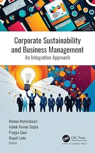

---

**Time:** 17:53:19 (Asia/Tehran)  
**Blog:** yoyoloit  

**Title:** AI in Healthcare : A Transparent Approach to Informatics  

**Details:** English | 2026 | ISBN: 1041036876 | 223 pages | True PDF EPUB | 10.8 MB  

**Link:** http://zavat.pw/ebooks/1041036876.html  

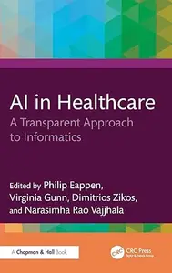

---

**Time:** 17:53:19 (Asia/Tehran)  
**Blog:** IrGens  

**Title:** Claude Code für Vibe-Coding  

**Details:** .MP4, AVC, 1280x720, 30 fps | Deutsch, AAC, 2 Ch | 4 Std. 53 Min. | 862 MB  

**Link:** http://zavat.pw/ebooks/claude-code-fur-vibe-coding.html  

---

**Time:** 17:53:19 (Asia/Tehran)  
**Blog:** IrGens  

**Title:** NotebookLM Grundkurs  

**Details:** .MP4, AVC, 1280x720, 30 fps | Deutsch, AAC, 2 Ch | 1 Std. 1 Min. | 193 MB  

**Link:** http://zavat.pw/ebooks/notebooklm-grundkurs.html  

---

**Time:** 17:53:19 (Asia/Tehran)  
**Blog:** IrGens  

**Title:** Excel für Finanzanalyse: Modellierung, Dashboards und Copilot  

**Details:** .MP4, AVC, 1280x720, 30 fps | Deutsch, AAC, 2 Ch | 32 Min. | 81.1 MB  

**Link:** http://zavat.pw/ebooks/excel-fur-finanzanalyse-modellierung-dashboards-und-copilot.html  

---

**Time:** 17:53:19 (Asia/Tehran)  
**Blog:** IrGens  

**Title:** Wenn KI programmiert: Was Sie trotzdem verstehen müssen  

**Details:** .MP4, AVC, 1280x720, 30 fps | Deutsch, AAC, 2 Ch | 1 Std. 42 Min. | 208 MB  

**Link:** http://zavat.pw/ebooks/wenn-ki-programmiert-was-sie-trotzdem-verstehen-mussen.html  

---

**Time:** 17:53:19 (Asia/Tehran)  
**Blog:** IrGens  

**Title:** Kubernetes for Software Development: Deploying Your Code  

**Details:** .MP4, AVC, 1920x1080, 30 fps | English, AAC, 2 Ch | 1h 48m | 300 MB  

**Link:** http://zavat.pw/ebooks/kubernetes-software-development-deploying-code.html  

---

**Time:** 17:53:19 (Asia/Tehran)  
**Blog:** IrGens  

**Title:** Datadog Proactive Reliability  

**Details:** .MP4, AVC, 1920x1080, 30 fps | English, AAC, 2 Ch | 1h 16m | 259 MB  

**Link:** http://zavat.pw/ebooks/datadog-proactive-reliability.html  

---

**Time:** 17:53:19 (Asia/Tehran)  
**Blog:** IrGens  

**Title:** Sure, I'll Join Your Cult: A Memoir of Mental Illness and the Quest to Belong Anywhere  

**Details:** English | September 5, 2023 | ISBN: 1982168560 | True EPUB | 288 pages | 14.7 MB  

**Link:** http://zavat.pw/ebooks/1982168560.html  

---

**Time:** 17:53:19 (Asia/Tehran)  
**Blog:** IrGens  

**Title:** Drained: Reduce Your Mental Load to Do Less and Be More  

**Details:** English | April 21, 2026 | ISBN: 0593850904 | True EPUB | 304 pages | 1.3 MB  

**Link:** http://zavat.pw/ebooks/0593850904-epub.html  

---

**Time:** 17:53:19 (Asia/Tehran)  
**Blog:** IrGens  

**Title:** The Revenge of Reason  

**Details:** English | January 13, 2026 | ISBN: 1913029875 | True EPUB | 440 pages | 1.1 MB  

**Link:** http://zavat.pw/ebooks/1913029875-epub.html  

---

**Time:** 17:53:19 (Asia/Tehran)  
**Blog:** IrGens  

**Title:** Trans-Am Challengers: The Cars That Rivalled Mustang and Camaro Supremacy 1966-1972  

**Details:** English | September 30, 2025 | ISBN: 1836440340 | True EPUB | 192 pages | 360 MB  

**Link:** http://zavat.pw/ebooks/1836440340.html  

---

**Time:** 17:53:19 (Asia/Tehran)  
**Blog:** IrGens  

**Title:** Race for the Reichstag: The 1945 Battle for Berlin  

**Details:** English | August 19, 2010 | ISBN: 1848842309 | True EPUB | 288 pages | 20.6 MB  

**Link:** http://zavat.pw/ebooks/1848842309-epub.html  

---

**Time:** 17:53:19 (Asia/Tehran)  
**Blog:** IrGens  

**Title:** Panzers on the Vistula: Retreat and Rout in East Prussia 1945  

**Details:** English | November 2, 2018 | ISBN: 1526734311 | True EPUB | 160 pages | 8.4 MB  

**Link:** http://zavat.pw/ebooks/1526734311.html  

---

**Time:** 17:53:19 (Asia/Tehran)  
**Blog:** IrGens  

**Title:** USMC Tracked Amphibious Vehicles: T46E1/M76 Otter, M116 Husky, LVTP5, and LVTP7/AAV7A1  

**Details:** English | December 15, 2023 | ISBN: 0764367846 | True PDF | 144 pages | 149 MB  

**Link:** http://zavat.pw/ebooks/0764367846.html  

---

**Time:** 17:53:19 (Asia/Tehran)  
**Blog:** IrGens  

**Title:** M42 Duster: Self-Propelled Anti-Aircraft Vehicle  

**Details:** English | December 15, 2023 | ISBN: 076436782X | True PDF | 144 pages | 156 MB  

**Link:** http://zavat.pw/ebooks/076436782X.html  

---

**Time:** 17:53:19 (Asia/Tehran)  
**Blog:** IrGens  

**Title:** Equity Valuation Made Simple  

**Details:** .MP4, AVC, 1920x1080, 30 fps | English, AAC, 2 Ch | 1h 31m | 1.07 GB  

**Link:** http://zavat.pw/ebooks/equity-valuation-made-simple.html  

---

**Time:** 17:53:19 (Asia/Tehran)  
**Blog:** AvaxGenius  

**Title:** More Math Into LaTeX, 5th Edition  

**Details:** English | EPUB (True) | 2016 | 621 Pages | ISBN : 3319237950 | 4.9 MB  

**Link:** http://zavat.pw/ebooks/33192379502Et.html  

---

**Time:** 17:53:19 (Asia/Tehran)  
**Blog:** AvaxGenius  

**Title:** Current Research in Thermal Conductivity  

**Details:** English | PDF (True) | 2025 | 102 Pages | ISBN : 9781837697571 | 2.3 MB  

**Link:** http://zavat.pw/ebooks/9781837697571.html  

---

**Time:** 17:53:19 (Asia/Tehran)  
**Blog:** AvaxGenius  

**Title:** Whole-brain modelling: Cartography of the Dynamics of Mind  

**Details:** English | PDF (True) | 2025 | 248 Pages | ISBN : 0198991258 | 48.6 MB  

**Link:** http://zavat.pw/ebooks/0198991258.html  

---

**Time:** 17:53:19 (Asia/Tehran)  
**Blog:** AvaxGenius  

**Title:** Pulsed Discharge Plasmas: Characteristics and Applications  

**Details:** English | EPUB (True) | 2023 | 1028 Pages | ISBN : 9819911400 | 291 MB  

**Link:** http://zavat.pw/ebooks/981949114020.html  

---

**Time:** 17:53:19 (Asia/Tehran)  
**Blog:** AvaxGenius  

**Title:** Robotics, Vision and Control: Fundamental Algorithms in MATLAB (Repost)  

**Details:** English | PDF (True) | 2011 (Corrected 2013) | 572 Pages | ISBN : 3642201431 | 153.2 MB  

**Link:** http://zavat.pw/ebooks/362422014341.html  

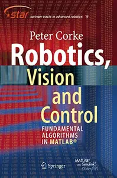

---

**Time:** 17:53:19 (Asia/Tehran)  
**Blog:** AvaxGenius  

**Title:** Encyclopedia of Big Data Technologies (Repost)  

**Details:** English | EPUB | 2019 | 1853 Pages | ISBN : 3319775243 | 109.8 MB  

**Link:** http://zavat.pw/ebooks/363197752443.html  

---

**Time:** 17:53:19 (Asia/Tehran)  
**Blog:** AvaxGenius  

**Title:** Geoforming Mars: How could nature have made Mars more like Earth? (Repost)  

**Details:** English | EPUB | 2021 | 437 Pages | ISBN : 3030588750 | 98.5 MB  

**Link:** http://zavat.pw/ebooks/303055887530.html  

---

**Time:** 17:53:19 (Asia/Tehran)  
**Blog:** AvaxGenius  

**Title:** First and Mid Trimester Ultrasound Diagnosis of Orofacial Clefts: An Atlas and Guide (Repost)  

**Details:** English | PDF EPUB (True) | 2021 | 186 Pages | ISBN : 9811646120 | 110.7 MB  

**Link:** http://zavat.pw/ebooks/298116461240.html  

---

**Time:** 17:53:19 (Asia/Tehran)  
**Blog:** AvaxGenius  

**Title:** Applications of Nanomaterials in Proteomics (Repost)  

**Details:** English | PDF,EPUB | 2021 | 431 Pages | ISBN : 9811658153 | 199.1 MB  

**Link:** http://zavat.pw/ebooks/982116581534.html  

---

**Time:** 17:53:19 (Asia/Tehran)  
**Blog:** AvaxGenius  

**Title:** Contrast-Enhanced Ultrasound in Pediatric Imaging (Repost)  

**Details:** English | EPUB | 2021 | 292 Pages | ISBN : 3030496902 | 120.6 MB  

**Link:** http://zavat.pw/ebooks/303104964902.html  

---

**Time:** 17:53:19 (Asia/Tehran)  
**Blog:** AvaxGenius  

**Title:** CyberKnife NeuroRadiosurgery: A practical Guide (Repost)  

**Details:** English | EPUB | 2020 | 604 Pages | ISBN : 3030506673 | 114.9 MB  

**Link:** http://zavat.pw/ebooks/303050266743.html  

---

**Time:** 17:53:19 (Asia/Tehran)  
**Blog:** AvaxGenius  

**Title:** Geology of Afar (East Africa) (Repost)  

**Details:** English | PDF,EPUB | 2017 (2018 Edition) | 345 Pages | ISBN : 3319608630 | 130.29 MB  

**Link:** http://zavat.pw/ebooks/3319640864430.html  

---

**Time:** 17:53:19 (Asia/Tehran)  
**Blog:** AvaxGenius  

**Title:** Design Computing and Cognition’20 (Repost)  

**Details:** English | EPUB | 2022 | 679 Pages | ISBN : 3030906248 | 97.1 MB  

**Link:** http://zavat.pw/ebooks/303209062484.html  

---

**Time:** 17:53:19 (Asia/Tehran)  
**Blog:** AvaxGenius  

**Title:** Basic Radiation Oncology (Repost)  

**Details:** English | EPUB | 2022 | 541 Pages | ISBN : 3030873072 | 199.2 MB  

**Link:** http://zavat.pw/ebooks/303104873072.html  

---

**Time:** 17:53:19 (Asia/Tehran)  
**Blog:** AvaxGenius  

**Title:** Prostate Biopsy Interpretation: An Illustrated Guide (Repost)  

**Details:** English | EPUB | 2019 | 212 Pages | ISBN : 3030136000 | 548.3 MB  

**Link:** http://zavat.pw/ebooks/303013246000.html  

---

**Time:** 17:53:19 (Asia/Tehran)  
**Blog:** hill0  

**Title:** Environmental Toxicology and Human Health  

**Details:** English | 2026 | ISBN: 1394399820 | 546 Pages | EPUB (True) | 17 MB  

**Link:** http://zavat.pw/ebooks/1394399820E.html  

---

**Time:** 17:53:19 (Asia/Tehran)  
**Blog:** hill0  

**Title:** Enhancing Life Cycle Reliability with Robust Engineering and Predictive Health Management  

**Details:** English | 2026 | ISBN: 1394182384 | 303 Pages | EPUB (True) | 20 MB  

**Link:** http://zavat.pw/ebooks/1394182384e.html  

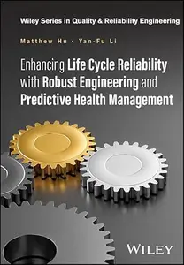

---

**Time:** 17:53:19 (Asia/Tehran)  
**Blog:** hill0  

**Title:** 3GE Collection on Engineering: Electric Power Conversion and Micro-Grids  

**Details:** English | 2023 | ISBN: 1984681036 | 286 Pages | PDF (True) | 14 MB  

**Link:** http://zavat.pw/ebooks/1984681036.html  

---

**Time:** 17:53:19 (Asia/Tehran)  
**Blog:** hill0  

**Title:** 3GE Collection on Engineering: Hydroacoustics  

**Details:** English | 2026 | ISBN: 1984681052 | 280 Pages | PDF (True) | 10 MB  

**Link:** http://zavat.pw/ebooks/1984681052.html  

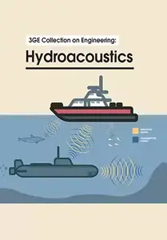

---

**Time:** 17:53:19 (Asia/Tehran)  
**Blog:** hill0  

**Title:** Building the Next Generation of AI Infrastructure  

**Details:** English | 2026 | ISBN: 0642572289942 | 36 Pages | EPUB | 3 MB  

**Link:** http://zavat.pw/ebooks/0642572289942f.html  

---

**Time:** 17:53:19 (Asia/Tehran)  
**Blog:** hill0  

**Title:** Smart Grids: Sustainable Energy Systems  

**Details:** English | 2026 | ISBN: 1032774940 | 429 Pages | PDF (True) | 291 MB  

**Link:** http://zavat.pw/ebooks/1032774940p.html  

---

**Time:** 17:53:19 (Asia/Tehran)  
**Blog:** hill0  

**Title:** Radiology in Global Health (3rd Edition)  

**Details:** English | 2025 | ISBN: 3031864840 | 354 Pages | EPUB (True) | 53 MB  

**Link:** http://zavat.pw/ebooks/3031864840e.html  

---

**Time:** 17:53:19 (Asia/Tehran)  
**Blog:** hill0  

**Title:** Structural and Functional Relationships in Prokaryotes (2nd Edition)  

**Details:** English | 2025 | ISBN: 3031913191 | 573 Pages | EPUB (True) | 111 MB  

**Link:** http://zavat.pw/ebooks/3031913191e.html  

---

**Time:** 17:53:19 (Asia/Tehran)  
**Blog:** hill0  

**Title:** After Hype: The Business of Taming the Digital Economy  

**Details:** English | 2026 | ISBN: 1009644068 | 350 Pages | PDF (True) | 2.4 MB  

**Link:** http://zavat.pw/ebooks/1009644068.html  

---

**Time:** 17:53:19 (Asia/Tehran)  
**Blog:** hill0  

**Title:** China's ‘Everything Online' Company  

**Details:** English | 2026 | ISBN: 100973895X | 286 Pages | PDF | 2 MB  

**Link:** http://zavat.pw/ebooks/100973895X.html  

---

**Time:** 17:53:19 (Asia/Tehran)  
**Blog:** hill0  

**Title:** Gute Gründe für Klimaoptimismus  

**Details:** Deutsch | 2026 | ISBN: 3658506881 | 63 Pages | PDF (True) | 2 MB  

**Link:** http://zavat.pw/ebooks/3658506881.html  

---

**Time:** 17:53:19 (Asia/Tehran)  
**Blog:** hill0  

**Title:** Handball – Das Praxisbuch für Studium, Training und Freizeitsport  

**Details:** Deutsch | 2026 | ISBN: 366272359X | 274 Pages | PDF (True) | 22 MB  

**Link:** http://zavat.pw/ebooks/366272359X.html  

---

**Time:** 17:53:19 (Asia/Tehran)  
**Blog:** hill0  

**Title:** Einführung in die Medienwirtschaftslehre, 4.Auflage  

**Details:** Deutsch | 2026 | ISBN: 3658503939 | 297 Pages | PDF (True) | 21 MB  

**Link:** http://zavat.pw/ebooks/3658503939.html  

---

**Time:** 17:53:19 (Asia/Tehran)  
**Blog:** hill0  

**Title:** B2B-Beziehungsmanagement: Bindungen zu Kunden und Kooperationspartnern stärken  

**Details:** Deutsch | 2026 | ISBN: 3662730391 | 179 Pages | PDF (True) | 5 MB  

**Link:** http://zavat.pw/ebooks/3662730391.html  

---

**Time:** 17:53:19 (Asia/Tehran)  
**Blog:** hill0  

**Title:** Salutogene Kommunikation für Gesundheitsberufe  

**Details:** Deutsch | 2026 | ISBN: 3662731738 | 65 Pages | PDF (True) | 2 MB  

**Link:** http://zavat.pw/ebooks/3662731738.html  

---

**Time:** 18:14:36 (Asia/Tehran)  
**Blog:** hill0  

**Title:** Channel Coding  

**Details:** English | 2026 | ISBN: 3032082358 | 450 Pages | PDF EPUB (True) | 49 MB  

**Link:** http://zavat.pw/ebooks/3032082358.html  

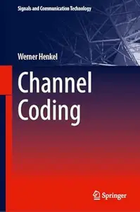

---

**Time:** 18:14:36 (Asia/Tehran)  
**Blog:** hill0  

**Title:** Artificial Intelligence in Medical Software  

**Details:** English | 2026 | ISBN: 3032108071 | 462 Pages | PDF EPUB (True) | 61 MB  

**Link:** http://zavat.pw/ebooks/3032108071.html  

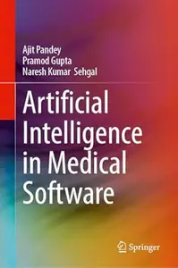

---

**Time:** 18:14:36 (Asia/Tehran)  
**Blog:** hill0  

**Title:** Mathematical Modeling in Life Sciences  

**Details:** English | 2026 | ISBN: 3032174856 | 216 Pages | PDF EPUB (True) | 33 MB  

**Link:** http://zavat.pw/ebooks/3032174856.html  

---

**Time:** 20:12:14 (Asia/Tehran)  
**Blog:** hill0  

**Title:** Coronary Thermodilution  

**Details:** English | 2026 | ISBN: 3032107334 | 382 Pages | PDF (True) | 18 MB  

**Link:** http://zavat.pw/ebooks/3032107334p.html  

---

**Time:** 20:12:14 (Asia/Tehran)  
**Blog:** hill0  

**Title:** Mastering Pediatric Spinal Deformity  

**Details:** English | 2026 | ISBN: 3032134889 | 395 Pages | PDF EPUB (True) | 155 MB  

**Link:** http://zavat.pw/ebooks/3032134889.html  

---

**Time:** 20:12:14 (Asia/Tehran)  
**Blog:** hill0  

**Title:** A Future Spacefaring Society  

**Details:** English | 2026 | ISBN: 3032114659 | 350 Pages | PDF EPUB (True) | 38 MB  

**Link:** http://zavat.pw/ebooks/3032114659.html  

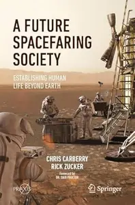

---

**Time:** 20:12:14 (Asia/Tehran)  
**Blog:** hill0  

**Title:** Integrated Process Design and Operational Optimization via Multi-parametric Programming (2nd Edition)  

**Details:** English | 2026 | ISBN: 3032101808 | 233 Pages | PDF EPUB (True) | 20 MB  

**Link:** http://zavat.pw/ebooks/3032101808.html  

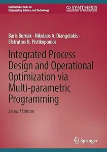

---

**Time:** 20:12:14 (Asia/Tehran)  
**Blog:** hill0  

**Title:** Advanced Computational and Mathematical Techniques for Wave Energy Converter Systems  

**Details:** English | 2026 | ISBN: 3032108039 | 406 Pages | PDF EPUB (True) | 67 MB  

**Link:** http://zavat.pw/ebooks/3032108039.html  

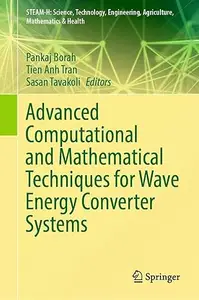

---

**Time:** 20:12:14 (Asia/Tehran)  
**Blog:** hill0  

**Title:** Aircraft Maintenance Programs (2nd Edition)  

**Details:** English | 2026 | ISBN: 3032115558 | 432 Pages | PDF EPUB (True) | 30 MB  

**Link:** http://zavat.pw/ebooks/3032115558.html  

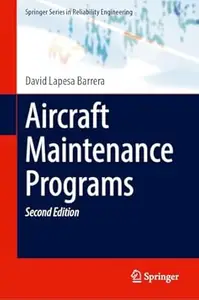

---

**Time:** 20:12:14 (Asia/Tehran)  
**Blog:** hill0  

**Title:** AI-driven Sustainable Innovation and Sustained Competitive Advantage  

**Details:** English | 2026 | ASIN: B0G3G62J7M | 1602 Pages | PDF EPUB (True) | 30 MB  

**Link:** http://zavat.pw/ebooks/B0G3G62J7M.html  

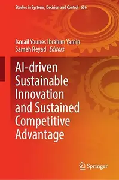

---

**Time:** 20:12:14 (Asia/Tehran)  
**Blog:** hill0  

**Title:** Workbook for Microeconomics Made Simple  

**Details:** English | 2026 | ISBN: 3032063566 | 203 Pages | PDF EPUB (True) | 35 MB  

**Link:** http://zavat.pw/ebooks/3032063566.html  

---

**Time:** 20:12:14 (Asia/Tehran)  
**Blog:** hill0  

**Title:** Ordinary Differential Equations: Concepts, Methods, and Models  

**Details:** English | 2026 | ISBN: 303215149X | 858 Pages | PDF EPUB (True) | 51 MB  

**Link:** http://zavat.pw/ebooks/303215149X.html  

---

**Time:** 20:12:14 (Asia/Tehran)  
**Blog:** hill0  

**Title:** Direction Finding Algorithms for Practicing Engineers: With C and MATLAB Code  

**Details:** English | 2026 | ISBN: 3032069963 | 209 Pages | PDF EPUB (True) | 59 MB  

**Link:** http://zavat.pw/ebooks/3032069963.html  

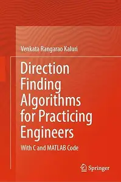

---

**Time:** 20:12:14 (Asia/Tehran)  
**Blog:** hill0  

**Title:** Essentials of Engineering Dynamics  

**Details:** English | 2026 | ISBN: 3032070120 | 291 Pages | PDF EPUB (True) | 38 MB  

**Link:** http://zavat.pw/ebooks/3032070120.html  

---

**Time:** 20:12:14 (Asia/Tehran)  
**Blog:** hill0  

**Title:** Crucibles of Creation  

**Details:** English | 2026 | ISBN: 3032172578 | 216 Pages | PDF EPUB (True) | 156 MB  

**Link:** http://zavat.pw/ebooks/3032172578.html  

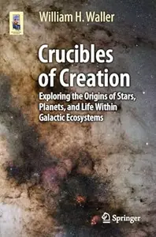

---

**Time:** 20:12:14 (Asia/Tehran)  
**Blog:** hill0  

**Title:** Value Engineering Plus  

**Details:** English | 2026 | ISBN: 303217998X | 107 Pages | PDF EPUB (True) | 38 MB  

**Link:** http://zavat.pw/ebooks/303217998X.html  

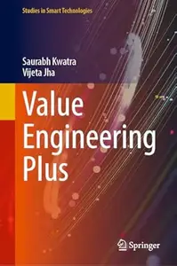

---

**Time:** 20:12:14 (Asia/Tehran)  
**Blog:** hill0  

**Title:** Computational Thinking: Rethinking How We Think  

**Details:** English | 2026 | ISBN: 9819559618 | 90 Pages | PDF EPUB (True) | 14 MB  

**Link:** http://zavat.pw/ebooks/9819559618.html  

---

**Time:** 20:12:14 (Asia/Tehran)  
**Blog:** hill0  

**Title:** The Renaissance of Astronomy  

**Details:** English | 2026 | ISBN: 3031847598 | 1103 Pages | PDF EPUB (True) | 56 MB  

**Link:** http://zavat.pw/ebooks/3031847598.html  

---

**Time:** 22:23:20 (Asia/Tehran)  
**Blog:** hill0  

**Title:** The LogoLounge Guide to Iconic Branding  

**Details:** English | 2026 | ISBN: 0760398100 | 629 Pages | EPUB | 21 MB  

**Link:** http://zavat.pw/ebooks/0760398100.html  

---

**Time:** 22:23:20 (Asia/Tehran)  
**Blog:** hill0  

**Title:** American Economic History, Vol.2: 1914 to Financial Crisis  

**Details:** English | 2026 | ISBN: 3032204429 | 405 Pages | PDF EPUB (True) | 6 MB  

**Link:** http://zavat.pw/ebooks/3032204429.html  

---

**Time:** 22:23:20 (Asia/Tehran)  
**Blog:** hill0  

**Title:** Global Shocks: An Investment Guide for Turbulent Markets (2nd Edition)  

**Details:** English | 2026 | ISBN: 3032131111 | 249 Pages | PDF EPUB (True) | 22 MB  

**Link:** http://zavat.pw/ebooks/3032131111.html  

---

**Time:** 22:23:20 (Asia/Tehran)  
**Blog:** hill0  

**Title:** Design Principles for Integrated Haptic Systems  

**Details:** English | 2026 | ISBN: 3032169852 | 169 Pages | PDF EPUB (True) | 13 MB  

**Link:** http://zavat.pw/ebooks/3032169852.html  

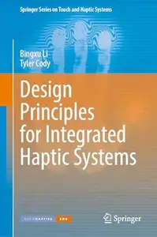

