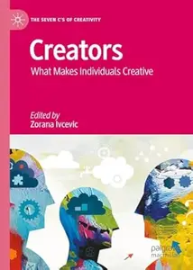
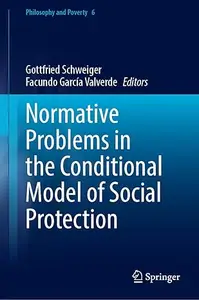

# Zavat feed - 2026-05-04

---

**Time:** 02:04:04 (Asia/Tehran)  
**Blog:** hill0  

**Title:** Creators: What Makes Individuals Creative  

**Details:** English | 2026 | ISBN: 3032091748 | 218 Pages | PDF EPUB (True) | 3 MB  

**Link:** http://zavat.pw/ebooks/3032091748.html  

---

**Time:** 02:04:04 (Asia/Tehran)  
**Blog:** hill0  

**Title:** Biofuels from Algae (2nd Edition)  

**Details:** English | 2026 | ISBN: 1071650300 | 356 Pages | PDF (True) | 27 MB  

**Link:** http://zavat.pw/ebooks/1071650300.html  

---

**Time:** 02:04:04 (Asia/Tehran)  
**Blog:** hill0  

**Title:** Mandalas of Multialignment  

**Details:** English | 2026 | ISBN: 981957529X | 317 Pages | PDF EPUB (True) | 5 MB  

**Link:** http://zavat.pw/ebooks/981957529X.html  

---

**Time:** 02:04:04 (Asia/Tehran)  
**Blog:** hill0  

**Title:** Normative Problems in the Conditional Model of Social Protection  

**Details:** English | 2026 | ISBN: 3032152542 | 260 Pages | PDF EPUB (True) | 3 MB  

**Link:** http://zavat.pw/ebooks/3032152542.html  

