# Zavat feed - 2026-05-10

---

**Time:** 23:26:12 (Asia/Tehran)  
**Blog:** hill0  

**Title:** Additive Manufacturing Technologies - Volume 1  

**Details:** English | 2026 | ISBN: 3032218640 | 413 Pages | PDF (True) | 54 MB  

**Link:** http://zavat.pw/ebooks/3032218640.html  

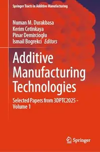

---

**Time:** 23:26:12 (Asia/Tehran)  
**Blog:** hill0  

**Title:** Identifying and Overcoming Student’s Misconceptions in Chemistry  

**Details:** English | 2026 | ISBN: 3658510315 | 110 Pages | PDF EPUB (True) | 4 MB  

**Link:** http://zavat.pw/ebooks/3658510315.html  

---

**Time:** 23:26:12 (Asia/Tehran)  
**Blog:** hill0  

**Title:** Trademark Without a Lawyer  

**Details:** English | 2026 | ISBN: 3662731266 | 188 Pages | PDF EPUB (True) | 44 MB  

**Link:** http://zavat.pw/ebooks/3662731266.html  

---

**Time:** 23:26:12 (Asia/Tehran)  
**Blog:** hill0  

**Title:** HBR's 10 Must Reads on Artificial Intelligence, Updated and Expanded  

**Details:** English | 2026 | ASIN: B0FHVBTQDH | 167 Pages | PDF | 3.3 MB  

**Link:** http://zavat.pw/ebooks/B0FHVBTQDHP.html  

---

**Time:** 22:22:58 (Asia/Tehran)  
**Blog:** yoyoloit  

**Title:** China's War on Faith  

**Details:** English | 2026 | ISBN: 1645721132 | 256 pages | True EPUB | 2.05 MB  

**Link:** http://zavat.pw/ebooks/1645721132.html  

---

**Time:** 22:22:58 (Asia/Tehran)  
**Blog:** yoyoloit  

**Title:** The Spatial Edge: The Strategic Advantage of GIS Skills Across Higher Education  

**Details:** English | 2026 | ISBN: 1589488962 | 200 pages | True EPUB | 15.02 MB  

**Link:** http://zavat.pw/ebooks/1589488962.html  

---

**Time:** 22:22:58 (Asia/Tehran)  
**Blog:** yoyoloit  

**Title:** Irregular Army: How the US Military Recruited Neo-Nazis, Gang Members, and Criminals, Expanded and Revised Edition  

**Details:** English | 2026 | ISBN: 1682194639 | 328 pages | True EPUB | 6.3 MB  

**Link:** http://zavat.pw/ebooks/1682194639.html  

---

**Time:** 22:22:58 (Asia/Tehran)  
**Blog:** yoyoloit  

**Title:** Cosmic Goodness: Surrendering the Shadows to Live in the Light  

**Details:** English | 2026 | ISBN: 9798895655078 | 352 pages | True EPUB | 3.1 MB  

**Link:** http://zavat.pw/ebooks/9798895655078.html  

---

**Time:** 22:22:58 (Asia/Tehran)  
**Blog:** yoyoloit  

**Title:** Lost Horizons: A Foreign Correspondent's Extraordinary Life Story  

**Details:** English | 2026 | ISBN: 0804858594 | 304 pages | True EPUB | 14.96 MB  

**Link:** http://zavat.pw/ebooks/0804858594.html  

---

**Time:** 22:22:58 (Asia/Tehran)  
**Blog:** yoyoloit  

**Title:** Radicals: The Working Classes and the Making of Modern Britain  

**Details:** English | 2026 | ISBN: 0300265891 | 313 pages | True PDF EPUB | 15.3 MB  

**Link:** http://zavat.pw/ebooks/0300265891.html  

---

**Time:** 21:15:25 (Asia/Tehran)  
**Blog:** yoyoloit  

**Title:** Field Guide to Illinois Mammals  

**Details:** English | 2026 | ISBN: 0252089413 | 394 pages | True PDF | 21.61 MB  

**Link:** http://zavat.pw/ebooks/0252089413.html  

---

**Time:** 21:15:25 (Asia/Tehran)  
**Blog:** yoyoloit  

**Title:** Sanctioned Bigotry: A Documentary History of Antisemitism in the United States  

**Details:** English | 2026 | ISBN: 0300282540 | 624 pages | True EPUB | 8.66 MB  

**Link:** http://zavat.pw/ebooks/0300282540.html  

---

**Time:** 20:16:06 (Asia/Tehran)  
**Blog:** hill0  

**Title:** Frankfurter Allgemeine Zeitung - 11 Mai 2026  

**Details:** Deutsch | 38 pages | True PDF | 65 MB  

**Link:** http://zavat.pw/newspapers/FAZ-110526.html  

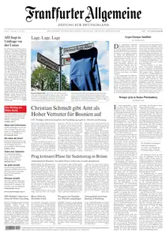

---

**Time:** 19:16:20 (Asia/Tehran)  
**Blog:** AvaxGenius  

**Title:** Design Solutions UK - April 2026  

**Details:** English | True PDF | 52 Pages | 12.6 MB  

**Link:** http://zavat.pw/magazines/DesignSolutionsUKApril2026.html  

---

**Time:** 19:16:20 (Asia/Tehran)  
**Blog:** AvaxGenius  

**Title:** BKU Magazine - May 2026  

**Details:** English | True PDF | 60 Pages | 18 MB  

**Link:** http://zavat.pw/magazines/BKUMagazineMay2026.html  

---

**Time:** 19:16:20 (Asia/Tehran)  
**Blog:** AvaxGenius  

**Title:** Public Sector Building - March 2026  

**Details:** English | True PDF | 44 Pages | 7.8 MB  

**Link:** http://zavat.pw/magazines/PublicSectorBuildingMarch2026.html  

---

**Time:** 19:16:20 (Asia/Tehran)  
**Blog:** AvaxGenius  

**Title:** Converter Magazine - April 2026  

**Details:** English | True PDF | 40 Pages | 9.2 MB  

**Link:** http://zavat.pw/magazines/ConverterMagazineApril2026.html  

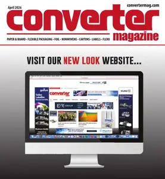

---

**Time:** 19:16:20 (Asia/Tehran)  
**Blog:** AvaxGenius  

**Title:** Design Solutions UK - March 2026  

**Details:** English | True PDF | 52 Pages | 14.1 MB  

**Link:** http://zavat.pw/magazines/DesignSolutionsUKMarch2026.html  

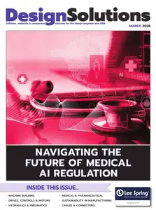

---

**Time:** 19:16:20 (Asia/Tehran)  
**Blog:** AvaxGenius  

**Title:** Compounding World - April 2026  

**Details:** English | True PDF | 42 Pages | 16.5 MB  

**Link:** http://zavat.pw/magazines/CompoundingWorldApril2026.html  

---

**Time:** 19:16:20 (Asia/Tehran)  
**Blog:** AvaxGenius  

**Title:** Electronics For Engineers - April 2026  

**Details:** English | True PDF | 48 Pages | 9.8 MB  

**Link:** http://zavat.pw/magazines/ElectronicsForEngineersApril2026.html  

---

**Time:** 19:16:20 (Asia/Tehran)  
**Blog:** hill0  

**Title:** Applied Math with Python  

**Details:** English | 2026 | ISBN: 139437075X | 439 Pages | MOBI | 12 MB  

**Link:** http://zavat.pw/ebooks/139437075XM.html  

---

**Time:** 19:16:20 (Asia/Tehran)  
**Blog:** hill0  

**Title:** Economic Competitiveness: A Literature Review of Clusters, Innovation and Networks  

**Details:** English | 2026 | ISBN: 3032203589 | 79 Pages | PDF EPUB (True) | 1.3 MB  

**Link:** http://zavat.pw/ebooks/3032203589.html  

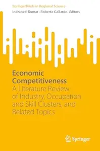

---

**Time:** 19:16:20 (Asia/Tehran)  
**Blog:** hill0  

**Title:** Shakespeare and Early Modern Madness  

**Details:** English | 2026 | ISBN: 3032088968 | 276 Pages | PDF EPUB (True) | 9 MB  

**Link:** http://zavat.pw/ebooks/3032088968.html  

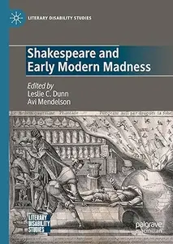

---

**Time:** 19:16:20 (Asia/Tehran)  
**Blog:** hill0  

**Title:** Walter Carnielli on Reasoning, Paraconsistency, and Probability  

**Details:** English | 2026 | ISBN: 3032110262 | 600 Pages | PDF EPUB (True) | 29 MB  

**Link:** http://zavat.pw/ebooks/3032110262.html  

---

**Time:** 19:16:20 (Asia/Tehran)  
**Blog:** hill0  

**Title:** Games of Contingency  

**Details:** English | 2026 | ISBN: 3032116694 | 292 Pages | PDF EPUB (True) | 2 MB  

**Link:** http://zavat.pw/ebooks/3032116694.html  

---

**Time:** 19:16:20 (Asia/Tehran)  
**Blog:** hill0  

**Title:** Falsche Vorbilder  

**Details:** Deutsch | 2022 | ISBN: 3969051967 | 224 Pages | EPUB | 2 MB  

**Link:** http://zavat.pw/ebooks/3969051967.html  

---

**Time:** 19:16:20 (Asia/Tehran)  
**Blog:** hill0  

**Title:** Die Nord-Stream-Sprengung  

**Details:** Deutsch | 2026 | ISBN: 3365011544 | 338 Pages | EPUB | 0.5 MB  

**Link:** http://zavat.pw/ebooks/3365011544.html  

---

**Time:** 19:16:20 (Asia/Tehran)  
**Blog:** hill0  

**Title:** Das neue Führen  

**Details:** Deutsch | 2023 | ISBN: 3424202851 | 175 Pages | EPUB | 0.6 MB  

**Link:** http://zavat.pw/ebooks/3424202851.html  

---

**Time:** 19:16:20 (Asia/Tehran)  
**Blog:** hill0  

**Title:** Amazonian Mangrove Blue Carbon Dynamics  

**Details:** English | 2026 | ASIN: B0GGPCWXQ8 | 252 Pages | PDF (True) | 22 MB  

**Link:** http://zavat.pw/ebooks/B0GGPCWXQ8.html  

---

**Time:** 19:16:20 (Asia/Tehran)  
**Blog:** hill0  

**Title:** Expert Applications and Security, Volume 2  

**Details:** English | 2026 | ISBN: 3032201136 | 506 Pages | PDF (True) | 64 MB  

**Link:** http://zavat.pw/ebooks/3032201136.html  

---

**Time:** 19:16:20 (Asia/Tehran)  
**Blog:** hill0  

**Title:** AI for Knowledge Synthesis and Predictions, Volume 5  

**Details:** English | 2026 | ISBN: 3032201209 | 575 Pages | PDF (True) | 66 MB  

**Link:** http://zavat.pw/ebooks/3032201209.html  

---

**Time:** 18:05:55 (Asia/Tehran)  
**Blog:** yoyoloit  

**Title:** A Practical Guide to Teaching Neurodivergent College Students  

**Details:** English | 2026 | ISBN: 9798895570784 | 246 pages | True EPUB | 19.72 MB  

**Link:** http://zavat.pw/ebooks/9798895570784.html  

---

**Time:** 18:05:55 (Asia/Tehran)  
**Blog:** yoyoloit  

**Title:** Animation and the Ancient World  

**Details:** English | 2026 | ISBN: 0197800629 | 352 pages | True PDF EPUB | 45.83 MB  

**Link:** http://zavat.pw/ebooks/0197800629.html  

---

**Time:** 18:05:55 (Asia/Tehran)  
**Blog:** yoyoloit  

**Title:** Yuppies: The Bankers, Lawyers, Joggers, and Gourmands Who Conquered New York  

**Details:** English | 2026 | ISBN: 067424897X | 353 pages | True PDF EPUB | 63.52 MB  

**Link:** http://zavat.pw/ebooks/067424897X.html  

---

**Time:** 18:05:55 (Asia/Tehran)  
**Blog:** IrGens  

**Title:** Children of Abraham: The Story of Jewish-Muslim Relations  

**Details:** English | April 2, 2026 | ISBN: 1805223615, 9781805223634 | True EPUB | 496 pages | 8.7 MB  

**Link:** http://zavat.pw/ebooks/1805223615.html  

---

**Time:** 18:05:55 (Asia/Tehran)  
**Blog:** IrGens  

**Title:** Boko Haram: The Past of the Present Upheaval  

**Details:** English | February 3, 2026 | ISBN: 0520417682, 0520417690 | True EPUB | 288 pages | 1 MB  

**Link:** http://zavat.pw/ebooks/0520417682.html  

---

**Time:** 18:05:55 (Asia/Tehran)  
**Blog:** IrGens  

**Title:** Sevastopol Tales (Pushkin Press Classics)  

**Details:** English | April 28, 2026 | ISBN: 1805332600 | True EPUB | 208 pages | 0.4 MB  

**Link:** http://zavat.pw/ebooks/1805332600.html  

---

**Time:** 18:05:55 (Asia/Tehran)  
**Blog:** IrGens  

**Title:** The Great Fear: Stalin's Terror of the 1930s  

**Details:** English | April 25, 2016 | ISBN: 0199695768, 0198797869 | True EPUB | 224 pages | 0.8 MB  

**Link:** http://zavat.pw/ebooks/0199695768-epub.html  

---

**Time:** 18:05:55 (Asia/Tehran)  
**Blog:** IrGens  

**Title:** How Queer Bookshops Changed the World  

**Details:** English | May 7, 2026 | ISBN: 1836431694, 9781836431701 | True EPUB | 336 pages | 1.3 MB  

**Link:** http://zavat.pw/ebooks/1836431694.html  

---

**Time:** 18:05:55 (Asia/Tehran)  
**Blog:** IrGens  

**Title:** Ghost Stories: A Memoir  

**Details:** English | May 5, 2026 | ISBN: 1668218941 | True EPUB | 320 pages | 7.1 MB  

**Link:** http://zavat.pw/ebooks/1668218941.html  

---

**Time:** 18:05:55 (Asia/Tehran)  
**Blog:** AvaxGenius  

**Title:** Maple V Programming Guide  

**Details:** English | PDF (True) | 1998 | 391 Pages | ISBN : 0387984003 | 26.7 MB  

**Link:** http://zavat.pw/ebooks/03879584003.html  

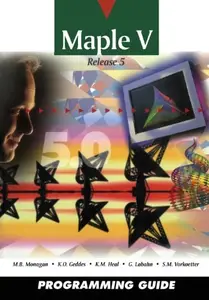

---

**Time:** 18:05:55 (Asia/Tehran)  
**Blog:** AvaxGenius  

**Title:** Introduction to Maple, Second  Edition  

**Details:** English | PDF (True) | 1996 | 706 Pages | ISBN : 1468404865 | 60.6 MB  

**Link:** http://zavat.pw/ebooks/1468404865.html  

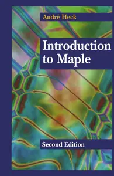

---

**Time:** 18:05:55 (Asia/Tehran)  
**Blog:** AvaxGenius  

**Title:** The Maple® O.D.E. Lab Book  

**Details:** English | PDF | 1996 | 167 Pages | ISBN : 0387947337 | 8.9 MB  

**Link:** http://zavat.pw/ebooks/03879547337.html  

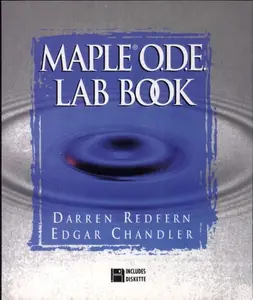

---

**Time:** 18:05:55 (Asia/Tehran)  
**Blog:** AvaxGenius  

**Title:** Experiments In Mathematics Using Maple  

**Details:** English | PDF (True) | 1995 | 476 Pages | ISBN : 3540592849 | 19 MB  

**Link:** http://zavat.pw/ebooks/35405942849.html  

---

**Time:** 18:05:55 (Asia/Tehran)  
**Blog:** AvaxGenius  

**Title:** Solving Problems in Scientific Computing Using Maple and MATLAB®  

**Details:** English | PDF | 1995 | 317 Pages | ISBN : 35405874622 | 26.3 MB  

**Link:** http://zavat.pw/ebooks/354055874622.html  

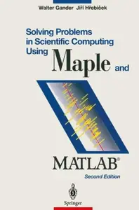

---

**Time:** 18:05:55 (Asia/Tehran)  
**Blog:** AvaxGenius  

**Title:** Maple V Library Reference Manual  

**Details:** English | PDF | 1991 | 722 Pages | ISBN : 0387941606 | 45.7 MB  

**Link:** http://zavat.pw/ebooks/03879451606.html  

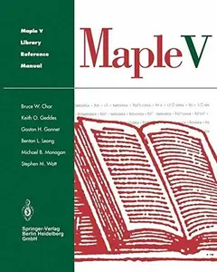

---

**Time:** 18:05:55 (Asia/Tehran)  
**Blog:** AvaxGenius  

**Title:** Mathematical Methods in Robust Control of Linear Stochastic Systems  

**Details:** English | PDF | 2006 | 320 Pages | ISBN : 1441921435 | 10 MB  

**Link:** http://zavat.pw/ebooks/14419621435.html  

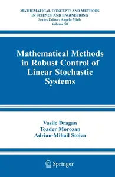

---

**Time:** 18:05:55 (Asia/Tehran)  
**Blog:** AvaxGenius  

**Title:** Elements for Physics: Quantities, Qualities, and Intrinsic Theories (Repost)  

**Details:** English | PDF | 2006 | 272 Pages | ISBN : 3540253025 | 3.9 MB  

**Link:** http://zavat.pw/ebooks/35402530255.html  

---

**Time:** 18:05:55 (Asia/Tehran)  
**Blog:** hill0  

**Title:** Intelligence of Things: Technologies and Applications, Volume 2  

**Details:** English | 2026 | ISBN: 3032132533 | 353 Pages | PDF (True) | 14 MB  

**Link:** http://zavat.pw/ebooks/3032132533.html  

---

**Time:** 18:05:55 (Asia/Tehran)  
**Blog:** hill0  

**Title:** Produktmanagement – Innovation – Digitalisierung  

**Details:** Deutsch | 2026 | ISBN: 3111557499 | 1144 Pages | EPUB | 18 MB  

**Link:** http://zavat.pw/ebooks/3111557499.html  

---

**Time:** 18:05:55 (Asia/Tehran)  
**Blog:** hill0  

**Title:** De Gruyter Handbook of Eastern European Politics, Society and Culture  

**Details:** English | 2026 | ISBN: 3111319903 | 707 Pages | EPUB | 3 MB  

**Link:** http://zavat.pw/ebooks/3111319903.html  

---

**Time:** 18:05:55 (Asia/Tehran)  
**Blog:** hill0  

**Title:** Building Intelligent Boards: A New Perspective on Corporate Governance  

**Details:** English | 2026 | ISBN: 3112231333 | 270 Pages | EPUB | 3 MB  

**Link:** http://zavat.pw/ebooks/3112231333.html  

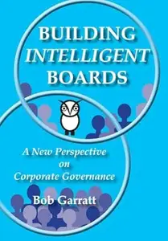

---

**Time:** 18:05:55 (Asia/Tehran)  
**Blog:** hill0  

**Title:** Learn to Trade like a Professional  

**Details:** English | 2026 | ISBN: 3032201241 | 409 Pages | PDF EPUB (True) | 6 MB  

**Link:** http://zavat.pw/ebooks/3032201241.html  

---

**Time:** 18:05:55 (Asia/Tehran)  
**Blog:** hill0  

**Title:** Rediscovering Flavor  

**Details:** English | 2026 | ISBN: 303208055X | 197 Pages | PDF EPUB (True) | 30 MB  

**Link:** http://zavat.pw/ebooks/303208055X.html  

---

**Time:** 16:33:48 (Asia/Tehran)  
**Blog:** yoyoloit  

**Title:** Follow the Signs  Searching for Linda Goodman, America’s Forgotten Astrology Queen  

**Details:** English | 2026 | ISBN: 1685970656 | 270 pages | True PDF EPUB | 3.84 MB  

**Link:** http://zavat.pw/ebooks/1685970656.html  

---

**Time:** 16:33:48 (Asia/Tehran)  
**Blog:** yoyoloit  

**Title:** Dance Today: Studies-Notes-Portraits  

**Details:** English | 2026 | ISBN: 0300243847 | 600 pages | True EPUB | 11.56 MB  

**Link:** http://zavat.pw/ebooks/0300243847.html  

---

**Time:** 16:33:48 (Asia/Tehran)  
**Blog:** yoyoloit  

**Title:** Reframing Anxiety: A Counselor's Guide to Finding Peace Through Curiosity  

**Details:** English | 2026 | ISBN: 0736991972 | 240 pages | True EPUB | 1.91 MB  

**Link:** http://zavat.pw/ebooks/0736991972.html  

---

**Time:** 16:33:48 (Asia/Tehran)  
**Blog:** IrGens  

**Title:** Soccernomics (2026 World Cup Edition): Why European Men and American Women Usually Win—and American Men Don't (Yet)  

**Details:** English | May 5, 2026 | ISBN: 1645030776, 9781645030812 | True EPUB | 496 pages | 3.5 MB  

**Link:** http://zavat.pw/ebooks/1645030776.html  

---

**Time:** 14:27:52 (Asia/Tehran)  
**Blog:** AvaxGenius  

**Title:** Metrology for Inclusive Growth of India (Repost)  

**Details:** English | EPUB | 2020 | 1084 Pages | ISBN : 9811588716 | 243.8 MB  

**Link:** http://zavat.pw/ebooks/981715887176.html  

---

**Time:** 14:27:52 (Asia/Tehran)  
**Blog:** AvaxGenius  

**Title:** Advances in Natural Hazards and Volcanic Risks: Shaping a Sustainable Future (Repost)  

**Details:** English | EPUB (True) | 2023 | 226 Pages | ISBN : 3031250419 | 167.8 MB  

**Link:** http://zavat.pw/ebooks/303172504719.html  

---

**Time:** 14:27:52 (Asia/Tehran)  
**Blog:** AvaxGenius  

**Title:** Cities’ Vocabularies and the Sustainable Development of the Silkroads (Repost)  

**Details:** English | EPUB (True) | 2023 | 961 Pages | ISBN : 3031310268 | 236.8 MB  

**Link:** http://zavat.pw/ebooks/303613160268.html  

---

**Time:** 14:27:52 (Asia/Tehran)  
**Blog:** AvaxGenius  

**Title:** Advances in Critical Flow Dynamics Involving Moving/Deformable Structures with Design Applications (Repost)  

**Details:** English | EPUB | 2021 | 579 Pages | ISBN : 3030555933 | 159.8 MB  

**Link:** http://zavat.pw/ebooks/303705559633.html  

---

**Time:** 14:27:52 (Asia/Tehran)  
**Blog:** AvaxGenius  

**Title:** Ubiquitous Computing and Ambient Intelligence (Repost)  

**Details:** English | PDF | 2017 | 874 Pages | ISBN : 3319675842 | 97.6 MB  

**Link:** http://zavat.pw/ebooks/363196758462.html  

---

**Time:** 14:27:52 (Asia/Tehran)  
**Blog:** AvaxGenius  

**Title:** China’s e-Science Blue Book 2020 (Repost)  

**Details:** English | EPUB | 2021 | 513 Pages | ISBN : 9811583412 | 105.5 MB  

**Link:** http://zavat.pw/ebooks/698115834162.html  

---

**Time:** 14:27:52 (Asia/Tehran)  
**Blog:** AvaxGenius  

**Title:** Tools for Landscape-Scale Geobotany and Conservation (Repost)  

**Details:** English | EPUB | 2021 | 451 Pages | ISBN : 3030749495 | 218.6 MB  

**Link:** http://zavat.pw/ebooks/303607494965.html  

---

**Time:** 14:27:52 (Asia/Tehran)  
**Blog:** AvaxGenius  

**Title:** Sustainable Communication Networks and Application: Proceedings of ICSCN 2020 (Repost)  

**Details:** English | EPUB | 2021 | 681 Pages | ISBN : 9811586764 | 114.6 MB  

**Link:** http://zavat.pw/ebooks/987115867664.html  

---

**Time:** 14:27:52 (Asia/Tehran)  
**Blog:** AvaxGenius  

**Title:** Advances in Nonlinear Dynamics, Volume III (Repost)  

**Details:** English | EPUB (True) | 2024 | 649 Pages | ISBN : 3031506340 | 120 MB  

**Link:** http://zavat.pw/ebooks/303515063450.html  

---

**Time:** 14:27:52 (Asia/Tehran)  
**Blog:** AvaxGenius  

**Title:** Design and Development of Aerospace Vehicles and Propulsion Systems: Proceedings of SAROD 2018 (Repost)  

**Details:** English | EPUB | 2021 | 529 Pages | ISBN : 981159600X | 194.2 MB  

**Link:** http://zavat.pw/ebooks/69811596600X.html  

---

**Time:** 14:27:52 (Asia/Tehran)  
**Blog:** AvaxGenius  

**Title:** Thermodynamic Mechanism of MQL Grinding with Nano Bio-lubricant (Repost)  

**Details:** English | EPUB (True) | 2023 | 412 Pages | ISBN : 9819962641 | 108.7 MB  

**Link:** http://zavat.pw/ebooks/698199626641.html  

---

**Time:** 14:27:52 (Asia/Tehran)  
**Blog:** AvaxGenius  

**Title:** Lithofacies Paleogeography and Geological Survey of Shale Gas (Repost)  

**Details:** English | EPUB(True) | 2023 |268 Pages | ISBN : 9811988609 | 187.3 MB  

**Link:** http://zavat.pw/ebooks/981169688609.html  

---

**Time:** 14:27:52 (Asia/Tehran)  
**Blog:** AvaxGenius  

**Title:** The Cost of Corrosion in China (Repost)  

**Details:** English | EPUB (True) | 2019 | 950 Pages | ISBN : 9813293535 | 257.5 MB  

**Link:** http://zavat.pw/ebooks/986132935635.html  

---

**Time:** 14:27:52 (Asia/Tehran)  
**Blog:** AvaxGenius  

**Title:** Plants and People in the African Past: Progress in African Archaeobotany (Repost)  

**Details:** English | PDF,EPUB | 2018 | 577 Pages | ISBN : 3319898388 | 129.99 MB  

**Link:** http://zavat.pw/ebooks/331948983488.html  

---

**Time:** 14:27:52 (Asia/Tehran)  
**Blog:** crazy-slim  

**Title:** The Philadelphia Inquirer - May 10, 2026  

**Details:** English | 68 pages | True PDF | 130.6 MB  

**Link:** http://zavat.pw/newspapers/ThePhiladelphiaInquirerMay102026-27674.html  

---

**Time:** 14:27:52 (Asia/Tehran)  
**Blog:** crazy-slim  

**Title:** Portland Press Herald - 10 May 2026  

**Details:** English | 86 pages | True PDF | 113.7 MB  

**Link:** http://zavat.pw/newspapers/PortlandPressHerald10May2026-38270.html  

---

**Time:** 14:27:52 (Asia/Tehran)  
**Blog:** crazy-slim  

**Title:** The Baltimore Sun - 10 May 2026  

**Details:** English | 92 pages | True PDF | 95.0 MB  

**Link:** http://zavat.pw/newspapers/TheBaltimoreSun10May2026-78513.html  

---

**Time:** 14:27:52 (Asia/Tehran)  
**Blog:** crazy-slim  

**Title:** The Morning Call Morning Edition - 10 May 2026  

**Details:** English | 58 pages | True PDF | 48.3 MB  

**Link:** http://zavat.pw/newspapers/TheMorningCallMorningEdition10May2026-24698.html  

---

**Time:** 14:27:52 (Asia/Tehran)  
**Blog:** crazy-slim  

**Title:** The Dallas Morning News - May 10, 2026  

**Details:** English | 86 pages | True PDF | 52.6 MB  

**Link:** http://zavat.pw/newspapers/TheDallasMorningNewsMay102026-07386.html  

---

**Time:** 14:27:52 (Asia/Tehran)  
**Blog:** crazy-slim  

**Title:** The Boston Globe - 10 May 2026  

**Details:** English | 120 pages | True PDF | 38.1 MB  

**Link:** http://zavat.pw/newspapers/TheBostonGlobe10May2026-80224.html  

---

**Time:** 14:27:52 (Asia/Tehran)  
**Blog:** crazy-slim  

**Title:** Sun Journal - 10 May 2026  

**Details:** English | 101 pages | True PDF | 133.1 MB  

**Link:** http://zavat.pw/newspapers/SunJournal10May2026-15809.html  

---

**Time:** 14:27:52 (Asia/Tehran)  
**Blog:** crazy-slim  

**Title:** USA Today - May 10, 2026  

**Details:** English | 16 pages | True PDF | 5.4 MB  

**Link:** http://zavat.pw/newspapers/USATodayMay102026-66261.html  

---

**Time:** 14:27:52 (Asia/Tehran)  
**Blog:** crazy-slim  

**Title:** Sun Sentinel - 10 May 2026  

**Details:** English | 144 pages | True PDF | 69.5 MB  

**Link:** http://zavat.pw/newspapers/SunSentinel10May2026-98255.html  

---

**Time:** 14:27:52 (Asia/Tehran)  
**Blog:** crazy-slim  

**Title:** Chicago Sun-Times - 10 May 2026  

**Details:** English | 80 pages | True PDF | 85.7 MB  

**Link:** http://zavat.pw/newspapers/ChicagoSunTimes10May2026-55803.html  

---

**Time:** 14:27:52 (Asia/Tehran)  
**Blog:** crazy-slim  

**Title:** The Courier-News - 10 May 2026  

**Details:** English | 24 pages | True PDF | 20.6 MB  

**Link:** http://zavat.pw/newspapers/TheCourierNews10May2026-22038.html  

---

**Time:** 14:27:52 (Asia/Tehran)  
**Blog:** crazy-slim  

**Title:** Chicago Tribune - 10 May 2026  

**Details:** English | 74 pages | True PDF | 57.5 MB  

**Link:** http://zavat.pw/newspapers/ChicagoTribune10May2026-46912.html  

---

**Time:** 14:27:52 (Asia/Tehran)  
**Blog:** crazy-slim  

**Title:** The Beacon-News - 10 May 2026  

**Details:** English | 24 pages | True PDF | 21.6 MB  

**Link:** http://zavat.pw/newspapers/TheBeaconNews10May2026-47974.html  

---

**Time:** 14:27:52 (Asia/Tehran)  
**Blog:** crazy-slim  

**Title:** Post-Tribune - 10 May 2026  

**Details:** English | 24 pages | True PDF | 22.3 MB  

**Link:** http://zavat.pw/newspapers/PostTribune10May2026-20810.html  

---

**Time:** 14:27:52 (Asia/Tehran)  
**Blog:** crazy-slim  

**Title:** Orlando Sentinel - 10 May 2026  

**Details:** English | 75 pages | True PDF | 69.4 MB  

**Link:** http://zavat.pw/newspapers/OrlandoSentinel10May2026-87233.html  

---

**Time:** 11:31:47 (Asia/Tehran)  
**Blog:** AvaxGenius  

**Title:** Writing for Digital Media  

**Details:** English | PDF EPUB (True) | 2024 | 585 Pages | ISBN : 9781956390377 | 35.3 MB  

**Link:** http://zavat.pw/ebooks/9781956390377.html  

---

**Time:** 11:31:47 (Asia/Tehran)  
**Blog:** AvaxGenius  

**Title:** Real Intelligence: Teaching in the Era of Generative AI  

**Details:** English | PDF EPUB (True) | 2025 | 168 Pages | ISBN : 1956390618 | 3.2 MB  

**Link:** http://zavat.pw/ebooks/1956390618.html  

---

**Time:** 11:31:47 (Asia/Tehran)  
**Blog:** AvaxGenius  

**Title:** An Open Guide to Data Structures and Algorithms  

**Details:** English | PDF EPUB (True) | 2023 | 350 Pages | ISBN : 1956390243 | 22 MB  

**Link:** http://zavat.pw/ebooks/1956390243.html  

---

**Time:** 11:31:47 (Asia/Tehran)  
**Blog:** hill0  

**Title:** Debt and the Future of Workers  

**Details:** English | 2026 | ISBN: 1529241901 | 182 Pages | EPUB (True) | 2 MB  

**Link:** http://zavat.pw/ebooks/1529241901.html  

---

**Time:** 11:31:47 (Asia/Tehran)  
**Blog:** hill0  

**Title:** Citizen Science – Gemeinsam forschen!  

**Details:** Deutsch | 2026 | ISBN: 3662697025 | 287 Pages | PDF EPUB (True) | 37 MB  

**Link:** http://zavat.pw/ebooks/3662697025.html  

---

**Time:** 11:31:47 (Asia/Tehran)  
**Blog:** hill0  

**Title:** Mikrocontroller, 3. Auflage  

**Details:** Deutsch | 2026 | ISBN: 3658496509 | 635 Pages | PDF (True) | 30 MB  

**Link:** http://zavat.pw/ebooks/3658496509.html  

---

**Time:** 11:31:47 (Asia/Tehran)  
**Blog:** hill0  

**Title:** Der Weg zu einem gesünderen Planeten 3  

**Details:** Deutsch | 2026 | ISBN: 303214695X | 267 Pages | PDF (True) | 31 MB  

**Link:** http://zavat.pw/ebooks/303214695X.html  

---

**Time:** 11:31:47 (Asia/Tehran)  
**Blog:** hill0  

**Title:** Die digitale Customer Journey in der Bankbranche  

**Details:** Deutsch | 2026 | ISBN: 3658499338 | 204 Pages | PDF (True) | 7 MB  

**Link:** http://zavat.pw/ebooks/3658499338.html  

---

**Time:** 11:31:47 (Asia/Tehran)  
**Blog:** hill0  

**Title:** Innere Ressourcen stärken durch selbstwirksame Raumgestaltung  

**Details:** Deutsch | 2026 | ISBN: 3658500123 | 185 Pages | PDF (True) | 11 MB  

**Link:** http://zavat.pw/ebooks/3658500123.html  

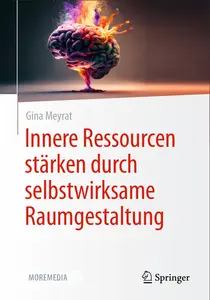

---

**Time:** 11:31:47 (Asia/Tehran)  
**Blog:** hill0  

**Title:** Palliativversorgung und Trauerbegleitung in der Neonatologie, 3. Auflage  

**Details:** Deutsch | 2026 | ISBN: 3662719819 | 246 Pages | PDF (True) | 7 MB  

**Link:** http://zavat.pw/ebooks/3662719819.html  

---

**Time:** 11:31:47 (Asia/Tehran)  
**Blog:** hill0  

**Title:** New Work, New Problems  

**Details:** Deutsch | 2026 | ISBN: 3658508132 | 115 Pages | PDF (True) | 3 MB  

**Link:** http://zavat.pw/ebooks/3658508132.html  

---

**Time:** 11:31:47 (Asia/Tehran)  
**Blog:** hill0  

**Title:** Umsetzung von KI-Projekten in KMU  

**Details:** Deutsch | 2026 | ISBN: 3658510218 | 97 Pages | PDF (True) | 2.2 MB  

**Link:** http://zavat.pw/ebooks/3658510218.html  

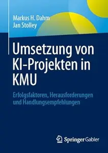

---

**Time:** 11:31:47 (Asia/Tehran)  
**Blog:** hill0  

**Title:** Automatisierte Modelloptimierung für Fahrzeuge mit Anhänger  

**Details:** Deutsch | 2026 | ISBN: 3658516216 | 155 Pages | PDF (True) | 8 MB  

**Link:** http://zavat.pw/ebooks/3658516216.html  

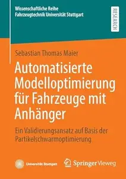

---

**Time:** 11:31:47 (Asia/Tehran)  
**Blog:** hill0  

**Title:** Sustainable and Natural Polymers  

**Details:** English | 2026 | ISBN: 9819200911 | 291 Pages | PDF EPUB (True) | 42 MB  

**Link:** http://zavat.pw/ebooks/9819200911.html  

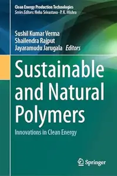

---

**Time:** 11:31:47 (Asia/Tehran)  
**Blog:** hill0  

**Title:** Next Generation Crop Protection for Agricultural Sustainability and Food Security  

**Details:** English | 2026 | ISBN: 1041004281 | 325 Pages | PDF EPUB (True) | 43 MB  

**Link:** http://zavat.pw/ebooks/1041004281.html  

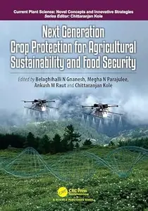

---

**Time:** 11:31:47 (Asia/Tehran)  
**Blog:** hill0  

**Title:** JCT Contract Administration Pocket Book (3rd Edition)  

**Details:** English | 2026 | ISBN: 1041034997 | 262 Pages | PDF (True) | 3 MB  

**Link:** http://zavat.pw/ebooks/1041034997p.html  

---

**Time:** 11:31:47 (Asia/Tehran)  
**Blog:** hill0  

**Title:** Landscape Economics  

**Details:** English | 2026 | ISBN: 3032252628 | 162 Pages | PDF EPUB (True) | 5 MB  

**Link:** http://zavat.pw/ebooks/3032252628.html  

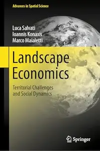

---

**Time:** 11:31:47 (Asia/Tehran)  
**Blog:** hill0  

**Title:** Public Service Media Organizations and Society  

**Details:** English | 2026 | ISBN: 3032235871 | 136 Pages | PDF EPUB (True) | 2.5 MB  

**Link:** http://zavat.pw/ebooks/3032235871.html  

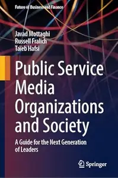

---

**Time:** 11:31:47 (Asia/Tehran)  
**Blog:** crazy-slim  

**Title:** The Washington Post - May 10, 2026  

**Details:** English | 80 pages | True PDF | 29.3 MB  

**Link:** http://zavat.pw/newspapers/TheWashingtonPostMay102026-38734.html  

---

**Time:** 11:31:47 (Asia/Tehran)  
**Blog:** crazy-slim  

**Title:** The Observer Magazine - 10 May 2026  

**Details:** English | 48 pages | True PDF | 33.1 MB  

**Link:** http://zavat.pw/magazines/TheObserverMagazine10May2026-52517.html  

---

**Time:** 11:31:47 (Asia/Tehran)  
**Blog:** crazy-slim  

**Title:** The Independent - 10 May 2026  

**Details:** English | 163 pages | True PDF | 59.4 MB  

**Link:** http://zavat.pw/newspapers/TheIndependent10May2026-39194.html  

---

**Time:** 11:31:47 (Asia/Tehran)  
**Blog:** crazy-slim  

**Title:** The Observer - 10 May 2026  

**Details:** English | 72 pages | True PDF | 49.9 MB  

**Link:** http://zavat.pw/newspapers/TheObserver10May2026-07348.html  

---

**Time:** 11:31:47 (Asia/Tehran)  
**Blog:** crazy-slim  

**Title:** Trinidad & Tobago Daily Express - 10 May 2026  

**Details:** English | 68 pages | True PDF | 44.4 MB  

**Link:** http://zavat.pw/newspapers/TrinidadTobagoDailyExpress10May2026-67187.html  

---

**Time:** 11:31:47 (Asia/Tehran)  
**Blog:** crazy-slim  

**Title:** The Observer The New Review - 10 May 2026  

**Details:** English | 48 pages | True PDF | 29.5 MB  

**Link:** http://zavat.pw/magazines/TheObserverTheNewReview10May2026-36637.html  

---

**Time:** 09:19:17 (Asia/Tehran)  
**Blog:** hill0  

**Title:** Essential Mathematics For Economics  

**Details:** English | 2026 | ISBN: 9819814103 | 220 Pages | PDF (True) | 33 MB  

**Link:** http://zavat.pw/ebooks/9819814103.html  

---

**Time:** 09:19:17 (Asia/Tehran)  
**Blog:** hill0  

**Title:** The Daily Telegraph Review - 9 May 2026  

**Details:** English | 40 pages | True PDF | 11 MB  

**Link:** http://zavat.pw/newspapers/DTR-091026.html  

---

**Time:** 09:19:17 (Asia/Tehran)  
**Blog:** hill0  

**Title:** The Sunday Telegraph Sunday - 10 May 2026  

**Details:** English | 16 pages | True PDF | 10 MB  

**Link:** http://zavat.pw/newspapers/STS-100526.html  

---

**Time:** 09:19:17 (Asia/Tehran)  
**Blog:** hill0  

**Title:** You UK - 10 May 2026  

**Details:** English | 60 pages | True PDF | 25 MB  

**Link:** http://zavat.pw/magazines/YouUK-100526.html  

---

**Time:** 09:19:17 (Asia/Tehran)  
**Blog:** crazy-slim  

**Title:** Irish Sunday People - 10 May 2026  

**Details:** English | 112 pages | PDF | 114.6 MB  

**Link:** http://zavat.pw/newspapers/IrishSundayPeople10May2026-42899.html  

---

**Time:** 09:19:17 (Asia/Tehran)  
**Blog:** crazy-slim  

**Title:** Sunday Express (Irish) - 10 May 2026  

**Details:** English | 80 pages | PDF | 90.2 MB  

**Link:** http://zavat.pw/newspapers/SundayExpressIrish10May2026-60761.html  

---

**Time:** 09:19:17 (Asia/Tehran)  
**Blog:** crazy-slim  

**Title:** Wales on Sunday - 10 May 2026  

**Details:** English | 80 pages | PDF | 87.6 MB  

**Link:** http://zavat.pw/newspapers/WalesonSunday10May2026-57851.html  

---

**Time:** 09:19:17 (Asia/Tehran)  
**Blog:** crazy-slim  

**Title:** Sunday Mercury - 10 May 2026  

**Details:** English | 80 pages | PDF | 88.7 MB  

**Link:** http://zavat.pw/newspapers/SundayMercury10May2026-22188.html  

---

**Time:** 09:19:17 (Asia/Tehran)  
**Blog:** crazy-slim  

**Title:** Record - 10 Maio 2026  

**Details:** Portuguese | 32 pages | True PDF | 18.7 MB  

**Link:** http://zavat.pw/newspapers/Record10Maio2026-58103.html  

---

**Time:** 09:19:17 (Asia/Tehran)  
**Blog:** crazy-slim  

**Title:** Aftonbladet - 10 Maj 2026  

**Details:** Svenska | 32 pages | PDF | 27.8 MB  

**Link:** http://zavat.pw/newspapers/Aftonbladet10Maj2026-25077.html  

---

**Time:** 09:19:17 (Asia/Tehran)  
**Blog:** crazy-slim  

**Title:** Sportbladet - 10 Maj 2026  

**Details:** Svenska | 12 pages | PDF | 15.0 MB  

**Link:** http://zavat.pw/newspapers/Sportbladet10Maj2026-21999.html  

---

**Time:** 09:19:17 (Asia/Tehran)  
**Blog:** crazy-slim  

**Title:** Mundo Deportivo - 10 Mayo 2026  

**Details:** Español | 48 pages | PDF | 98.5 MB  

**Link:** http://zavat.pw/newspapers/MundoDeportivo10Mayo2026-79614.html  

---

**Time:** 09:19:17 (Asia/Tehran)  
**Blog:** crazy-slim  

**Title:** AS - 10 Mayo 2026  

**Details:** Español | 40 pages | PDF | 75.5 MB  

**Link:** http://zavat.pw/newspapers/AS10Mayo2026-09743.html  

---

**Time:** 09:19:17 (Asia/Tehran)  
**Blog:** crazy-slim  

**Title:** ABC - 10 Mayo 2026  

**Details:** Español | 72 pages | PDF | 117.6 MB  

**Link:** http://zavat.pw/newspapers/ABC10Mayo2026-88575.html  

---

**Time:** 09:19:17 (Asia/Tehran)  
**Blog:** crazy-slim  

**Title:** El Día - 10 Mayo 2026  

**Details:** Español | 96 pages | PDF | 168.6 MB  

**Link:** http://zavat.pw/newspapers/ElD%C3%ADa10Mayo2026-66701.html  

---

**Time:** 09:19:17 (Asia/Tehran)  
**Blog:** crazy-slim  

**Title:** El Periódico Castellano - 10 Mayo 2026  

**Details:** Español | 56 pages | PDF | 96.6 MB  

**Link:** http://zavat.pw/newspapers/ElPeri%C3%B3dicoCastellano10Mayo2026-36092.html  

---

**Time:** 09:19:17 (Asia/Tehran)  
**Blog:** crazy-slim  

**Title:** Sport España - 10 Mayo 2026  

**Details:** Español | 36 pages | PDF | 63.2 MB  

**Link:** http://zavat.pw/newspapers/SportEspa%C3%B1a10Mayo2026-73282.html  

---

**Time:** 09:19:17 (Asia/Tehran)  
**Blog:** crazy-slim  

**Title:** California Post - May 10, 2026  

**Details:** English | 80 pages | True PDF | 33.9 MB  

**Link:** http://zavat.pw/newspapers/CaliforniaPostMay102026-98285.html  

---

**Time:** 09:19:17 (Asia/Tehran)  
**Blog:** crazy-slim  

**Title:** Euronews English Edition - 10 May 2026  

**Details:** English | 62 pages | PDF | 166.6 MB  

**Link:** http://zavat.pw/newspapers/EuronewsEnglishEdition10May2026-51620.html  

---

**Time:** 05:45:53 (Asia/Tehran)  
**Blog:** AvaxGenius  

**Title:** Endovascular Treatment of Arterial Emergencies (Repost)  

**Details:** English | EPUB | 2021 | 252 Pages | ISBN : 3030688313 | 96.4 MB  

**Link:** http://zavat.pw/ebooks/360306883163.html  

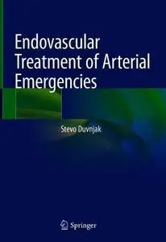

---

**Time:** 05:45:53 (Asia/Tehran)  
**Blog:** AvaxGenius  

**Title:** The Peroneal Tendons: A Clinical Guide to Evaluation and Management (Repost)  

**Details:** English | EPUB | 2020 | 445 Pages | ISBN : 3030466450 | 118.5 MB  

**Link:** http://zavat.pw/ebooks/3073046643750.html  

---

**Time:** 05:45:53 (Asia/Tehran)  
**Blog:** AvaxGenius  

**Title:** In Vitro Fertilization: A Textbook of Current and Emerging Methods and Devices, Second Edition (Repost)  

**Details:** English | EPUB | 2019 | 962 Pages | ISBN : 3319430106 | 97.6 MB  

**Link:** http://zavat.pw/ebooks/331946301406.html  

---

**Time:** 05:45:53 (Asia/Tehran)  
**Blog:** AvaxGenius  

**Title:** Shipwreck Archaeology in China Sea (Repost)  

**Details:** English | EPUB | 2022 | 290 Pages | ISBN : 9811686742 | 141.9 MB  

**Link:** http://zavat.pw/ebooks/698116867462.html  

---

**Time:** 05:45:53 (Asia/Tehran)  
**Blog:** AvaxGenius  

**Title:** Multi-Hazard Early Warning and Disaster Risks (Repost)  

**Details:** English | EPUB | 2021 | 914 Pages | ISBN : 3030730026 | 137.7 MB  

**Link:** http://zavat.pw/ebooks/303707305026.html  

---

**Time:** 05:45:53 (Asia/Tehran)  
**Blog:** AvaxGenius  

**Title:** Adult CNS Radiation Oncology: Principles and Practice (Repost)  

**Details:** English | EPUB | 2018 | 746 Pages | ISBN : 3319428772 | 150.2 MB  

**Link:** http://zavat.pw/ebooks/331964287762.html  

---

**Time:** 05:45:53 (Asia/Tehran)  
**Blog:** AvaxGenius  

**Title:** Recent Advances in Nanoparticle Catalysis (Repost)  

**Details:** English | EPUB | 2020 | 460 Pages | ISBN : 3030458229 | 101.8 MB  

**Link:** http://zavat.pw/ebooks/303604582429.html  

---

**Time:** 05:45:53 (Asia/Tehran)  
**Blog:** AvaxGenius  

**Title:** Pattern Dynamics of Marine Plankton Behavior: Nonlinear Dynamics Applications (Repost)  

**Details:** English | EPUB (True) | 2024 | 405 Pages | ISBN : 9819753686 | 130.4 MB  

**Link:** http://zavat.pw/ebooks/9281927536826.html  

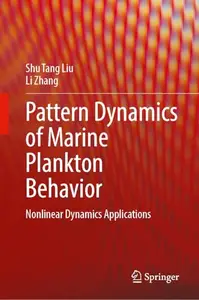

---

**Time:** 05:45:53 (Asia/Tehran)  
**Blog:** AvaxGenius  

**Title:** Handbook of Vascular Biometrics (Repost)  

**Details:** English | EPUB | 2020 | 533 Pages | ISBN : 3030277305 | 103.3 MB  

**Link:** http://zavat.pw/ebooks/3403022773025.html  

---

**Time:** 05:45:53 (Asia/Tehran)  
**Blog:** AvaxGenius  

**Title:** The Star Atlas Companion: What you need to know about the Constellations (Repost)  

**Details:** English | PDF (True) | 2012 | 497 Pages | ISBN : 1461408296 | 113.85 MB  

**Link:** http://zavat.pw/ebooks/54614082956.html  

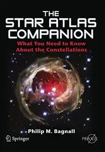

---

**Time:** 05:45:53 (Asia/Tehran)  
**Blog:** AvaxGenius  

**Title:** Proceedings of International Conference on Recent Trends in Computing: ICRTC 2022 (Repost)  

**Details:** English | EPUB (True) | 2023 | 837 Pages | ISBN : 9811988242 | 130.4 MB  

**Link:** http://zavat.pw/ebooks/9481198822422.html  

---

**Time:** 05:45:53 (Asia/Tehran)  
**Blog:** AvaxGenius  

**Title:** Geotechnics for Natural Disaster Mitigation and Management (Repost)  

**Details:** English | EPUB | 2020 | 148 Pages | ISBN : 981138827X | 95.5 MB  

**Link:** http://zavat.pw/ebooks/92811388227X4.html  

---

**Time:** 05:45:53 (Asia/Tehran)  
**Blog:** AvaxGenius  

**Title:** Artificial Intelligence in Models, Methods and Applications (Repost)  

**Details:** English | EPUB | 2023 | 694 Pages | ISBN : 3031229371 | 106.4MB  

**Link:** http://zavat.pw/ebooks/3032122293741.html  

---

**Time:** 05:45:53 (Asia/Tehran)  
**Blog:** AvaxGenius  

**Title:** Magnetic Micro and Nanorobot Swarms: From Fundamentals to Applications (Repost)  

**Details:** English | EPUB (True) | 2023 | 349 Pages | ISBN : 9819936942 | 165.5 MB  

**Link:** http://zavat.pw/ebooks/9812199369442.html  

---

**Time:** 05:45:53 (Asia/Tehran)  
**Blog:** AvaxGenius  

**Title:** Self-Supervised Learning for Visual Obstacle Avoidance: Technical report  

**Details:** English | PDF (True) | 2022 | 48 Pages | ISBN : 9463665099 | 13.3 MB  

**Link:** http://zavat.pw/ebooks/9463665099.html  

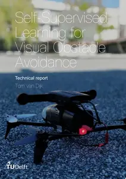

---

**Time:** 03:11:23 (Asia/Tehran)  
**Blog:** AvaxGenius  

**Title:** Engineering Education in the Rapidly Changing World: Rethinking the Vision for Higher Engineering Education  

**Details:** English | PDF (True) | 2023 | 92 Pages | ISBN : 9461866097 | 3 MB  

**Link:** http://zavat.pw/ebooks/9461866097.html  

---

**Time:** 03:11:23 (Asia/Tehran)  
**Blog:** AvaxGenius  

**Title:** Navigating the Landscape of Higher Engineering Education: Coping with decades of accelerating change ahead  

**Details:** English | PDF (True) | 2023 | 120 Pages | ISBN : 9463662421 | 6 MB  

**Link:** http://zavat.pw/ebooks/9463662421.html  

---

**Time:** 03:11:23 (Asia/Tehran)  
**Blog:** AvaxGenius  

**Title:** Engineering Signal Analysis: From Fourier to filtering: Exercises  

**Details:** English | PDF (True) | 2026 | 251 Pages | ISBN : 9789465182841 | 4.3 MB  

**Link:** http://zavat.pw/ebooks/9789465182841.html  

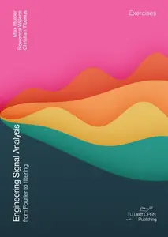

---

**Time:** 01:08:16 (Asia/Tehran)  
**Blog:** hill0  

**Title:** Wireless Edge Computing in Internet of Everything  

**Details:** English | 2026 | ISBN: 9819507871 | 614 Pages | PDF (True) | 21 MB  

**Link:** http://zavat.pw/ebooks/9819507871.html  

---

**Time:** 01:08:16 (Asia/Tehran)  
**Blog:** hill0  

**Title:** Ageing and Transnational Lives  

**Details:** English | 2026 | ISBN: 9819559022 | 311 Pages | PDF EPUB (True) | 3.2 MB  

**Link:** http://zavat.pw/ebooks/9819559022.html  

