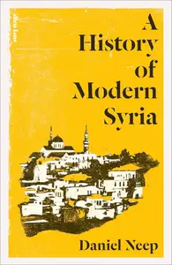
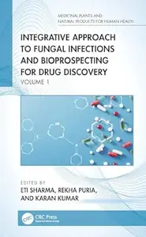
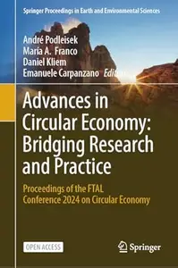
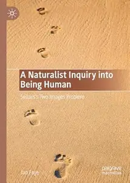

# Zavat feed - 2026-05-14

---

**Time:** 01:24:01 (Asia/Tehran)  
**Blog:** IrGens  

**Title:** Fix My Shoulder: A Guide to Preventing and Healing from Injury and Strain  

**Details:** English | October 16, 2014 | ISBN: 1442233370, 1442275855, 9781442233386 | True EPUB | 182 pages | 2 MB  

**Link:** http://zavat.pw/ebooks/1442233370.html  

---

**Time:** 01:24:01 (Asia/Tehran)  
**Blog:** IrGens  

**Title:** The Peregrine Falcon: The Epic Life and Times of the World's Fastest Creature  

**Details:** English | March 28, 2026 | ISBN: 0764371215, 9781507306796 | True EPUB | 240 pages | 7.8 MB  

**Link:** http://zavat.pw/ebooks/0764371215.html  

---

**Time:** 01:24:01 (Asia/Tehran)  
**Blog:** IrGens  

**Title:** A History of Modern Syria (UK Edition)  

**Details:** English | 29 Jan. 2026 | ISBN: 0241003296, 9780141977683 | True EPUB | 704 pages | 6 MB  

**Link:** http://zavat.pw/ebooks/0241003296.html  

---

**Time:** 01:24:01 (Asia/Tehran)  
**Blog:** IrGens  

**Title:** Not the Secret Diary of Nigel Farage Aged 61¾  

**Details:** English | 7 May 2026 | ISBN: 0008824622 | True EPUB | 192 pages | 10 MB  

**Link:** http://zavat.pw/ebooks/0008824622.html  

---

**Time:** 01:24:01 (Asia/Tehran)  
**Blog:** IrGens  

**Title:** Slaves in Paris: Hidden Lives and Fugitive Histories  

**Details:** English | June 17, 2025 | ISBN: 0674986547 | True PDF | 256 pages | 6.8 MB  

**Link:** http://zavat.pw/ebooks/0674986547.html  

---

**Time:** 01:24:01 (Asia/Tehran)  
**Blog:** IrGens  

**Title:** A Moon Will Rise from the Darkness: Reports on Israel's Genocide in Palestine  

**Details:** English | October 8, 2025 | ISBN: 0745352316 | True EPUB | 224 pages | 0.8 MB  

**Link:** http://zavat.pw/ebooks/0745352316.html  

---

**Time:** 01:24:01 (Asia/Tehran)  
**Blog:** IrGens  

**Title:** How to Sell a Genocide: The Media's Complicity in the Destruction of Gaza  

**Details:** English | April 21, 2026 | ISBN: 0745351654 | True EPUB | 256 pages | 2 MB  

**Link:** http://zavat.pw/ebooks/0745351654.html  

---

**Time:** 01:24:01 (Asia/Tehran)  
**Blog:** IrGens  

**Title:** The Decline and Fall of the American Republic  

**Details:** English | October 1, 2010 | ISBN: 0674057031, 0674725840 | True EPUB | 280 pages | 0.7 MB  

**Link:** http://zavat.pw/ebooks/0674057031-epub.html  

---

**Time:** 01:24:01 (Asia/Tehran)  
**Blog:** IrGens  

**Title:** When You Listen to This Song: On Memory, Loss, and Writing  

**Details:** English | November 18, 2025 | ISBN: 0300275889 | True EPUB | 176 pages | 0.5 MB  

**Link:** http://zavat.pw/ebooks/0300275889.html  

---

**Time:** 01:24:01 (Asia/Tehran)  
**Blog:** hill0  

**Title:** Integrative Approach to Fungal Infections and Bioprospecting for Drug Discovery: Volume 1  

**Details:** English | 2026 | ISBN: 1041061382 | 280 Pages | PDF EPUB (True) | 19 MB  

**Link:** http://zavat.pw/ebooks/1041061382.html  

---

**Time:** 01:24:01 (Asia/Tehran)  
**Blog:** hill0  

**Title:** Advances in Circular Economy  

**Details:** English | 2026 | ASIN: B0GN1NM6D4 | 242 Pages | True PDF | 15 MB  

**Link:** http://zavat.pw/ebooks/B0GN1NM6D4.html  

---

**Time:** 01:24:01 (Asia/Tehran)  
**Blog:** hill0  

**Title:** A Naturalist Inquiry into Being Human  

**Details:** English | 2026 | ISBN: 3032240840 | 247 Pages | PDF EPUB (True) | 4 MB  

**Link:** http://zavat.pw/ebooks/3032240840.html  

---

**Time:** 01:24:01 (Asia/Tehran)  
**Blog:** hill0  

**Title:** Frankfurter Allgemeine Magazin - Mai 2026  

**Details:** Deutsch | 92 pages | True PDF | 15 MB  

**Link:** http://zavat.pw/magazines/FAZ-Magazin-05-26.html  

---

**Time:** 00:00:08 (Asia/Tehran)  
**Blog:** IrGens  

**Title:** Artificial Intelligence Foundations: Getting Started with Intelligent Systems  

**Details:** .MP4, AVC, 1280x720, 30 fps | English, AAC, 2 Ch | 1h 25m | 261 MB  

**Link:** http://zavat.pw/ebooks/artificial-intelligence-foundations-getting-started-with-intelligent-systems.html  

