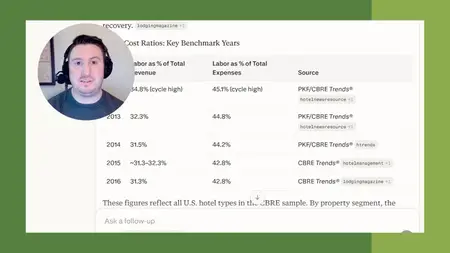
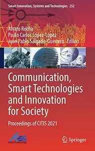
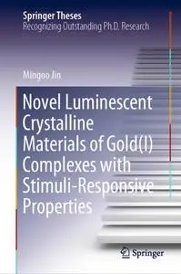
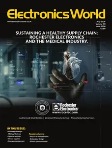
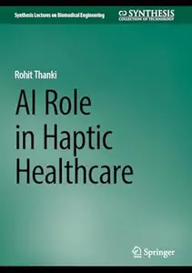
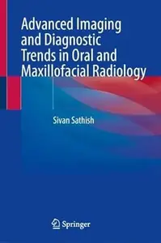
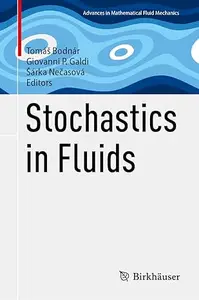
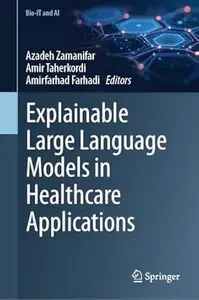
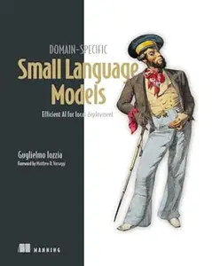
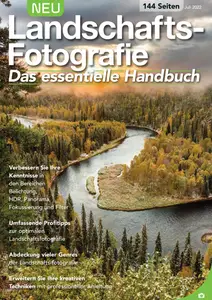

# Zavat feed - 2026-05-19

---

**Time:** 20:19:46 (Asia/Tehran)  
**Blog:** yoyoloit  

**Title:** Haunted Hikes New England: A Guide to the Spookiest Trails in the Region  

**Details:** English | 2026 | ISBN: 1493087509 | 272 pages | True EPUB | 56.08 MB  

**Link:** http://zavat.pw/ebooks/1493087509.html  

---

**Time:** 20:19:46 (Asia/Tehran)  
**Blog:** yoyoloit  

**Title:** Hiking Waterfalls New Hampshire: A Guide to the State's Best Waterfall Hikes  

**Details:** English | 2026 | ISBN: 1493088904 | 256 pages | True EPUB | 41.31 MB  

**Link:** http://zavat.pw/ebooks/1493088904.html  

---

**Time:** 20:19:46 (Asia/Tehran)  
**Blog:** yoyoloit  

**Title:** Arachnomania: Spiders and the Cultural Work They Do for Us  

**Details:** English | 2026 | ISBN: 0691281025 | 289 pages | True PDF EPUB | 48.19 MB  

**Link:** http://zavat.pw/ebooks/0691281025.html  

---

**Time:** 20:19:46 (Asia/Tehran)  
**Blog:** yoyoloit  

**Title:** Book Lovers' New England: A Guide to Literary Landmarks  

**Details:** English | 2026 | ISBN: 1493089439 | 280 pages | True EPUB | 48.37 MB  

**Link:** http://zavat.pw/ebooks/1493089439.html  

---

**Time:** 20:19:46 (Asia/Tehran)  
**Blog:** yoyoloit  

**Title:** The Cloudberry Coaching Method: Design, Build, and Launch Your Next Big Chapter  

**Details:** English | 2026 | ISBN: 9798891881853 | 234 pages | True EPUB | 1 MB  

**Link:** http://zavat.pw/ebooks/9798891881853.html  

---

**Time:** 20:19:46 (Asia/Tehran)  
**Blog:** yoyoloit  

**Title:** Out of Touch: The Elite One Percent and the Battle for America's Soul  

**Details:** English | 2026 | ISBN: 1645721167 | 208 pages | True EPUB | 2.08 MB  

**Link:** http://zavat.pw/ebooks/1645721167.html  

---

**Time:** 20:19:46 (Asia/Tehran)  
**Blog:** yoyoloit  

**Title:** Tao Te Ching: A New Translation  

**Details:** English | 2026 | ISBN: 0300284993 | 128 pages | True EPUB | 2 MB  

**Link:** http://zavat.pw/ebooks/0300284993.html  

---

**Time:** 20:19:46 (Asia/Tehran)  
**Blog:** yoyoloit  

**Title:** Unavoidably Unsafe for Children: A Physician's Guide to Vaccine Safety, Effectiveness, and Your Right to Choose  

**Details:** English | 2026 | ISBN: 9781510786691 | 439 pages | True EPUB | 2.87 MB  

**Link:** http://zavat.pw/ebooks/9781510786691.html  

---

**Time:** 20:19:46 (Asia/Tehran)  
**Blog:** yoyoloit  

**Title:** Cultivated: Plants, Hair, and the Aesthetic of Control  

**Details:** English | 2026 | ISBN: 0300272863 | 296 pages | True EPUB | 2.71 MB  

**Link:** http://zavat.pw/ebooks/0300272863.html  

---

**Time:** 20:19:46 (Asia/Tehran)  
**Blog:** yoyoloit  

**Title:** Spheres of Control: The Origins of Government in Early Rome  

**Details:** English | 2026 | ISBN: 0197789811 | 350 pages | True PDF EPUB | 22.22 MB  

**Link:** http://zavat.pw/ebooks/0197789811.html  

---

**Time:** 20:19:46 (Asia/Tehran)  
**Blog:** yoyoloit  

**Title:** Cultivate and Activate: Building Teacher Capacity for Instructional Leadership  

**Details:** English | 2026 | ISBN: 1958590533 | 121 pages | True PDF | 3.11 MB  

**Link:** http://zavat.pw/ebooks/1958590533.html  

---

**Time:** 20:19:46 (Asia/Tehran)  
**Blog:** yoyoloit  

**Title:** Page One to Done : Finish Your Novel in 30 Days with the Fast Drafting Method  

**Details:** English | 2026 | ISBN: 1401998429 | 320 pages | True EPUB | 1.68 MB  

**Link:** http://zavat.pw/ebooks/1401998429.html  

---

**Time:** 20:19:46 (Asia/Tehran)  
**Blog:** yoyoloit  

**Title:** Mayo Clinic Guide to a Healthy, Happy Heart: Simple Steps to Achieving Long-term Cardiovascular Health  

**Details:** English | 2026 | ISBN: 9798887700427 | 256 pages | True EPUB | 10.43 MB  

**Link:** http://zavat.pw/ebooks/9798887700427.html  

---

**Time:** 20:19:46 (Asia/Tehran)  
**Blog:** yoyoloit  

**Title:** Six Steps Forward  

**Details:** English | 2026 | ISBN: 1969935391 | 154 pages | True EPUB | 2.06 MB  

**Link:** http://zavat.pw/ebooks/1969935391.html  

---

**Time:** 20:19:46 (Asia/Tehran)  
**Blog:** yoyoloit  

**Title:** This Is Me: A Reckoning  

**Details:** English | 2026 | ISBN: 1538773422 | 320 pages | True EPUB | 28.42 MB  

**Link:** http://zavat.pw/ebooks/1538773422.html  

---

**Time:** 20:19:46 (Asia/Tehran)  
**Blog:** IrGens  

**Title:** Nerve Damage: A Novel  

**Details:** English | May 12, 2026 | ISBN: 0593803779 | True EPUB | 240 pages | 3.5 MB  

**Link:** http://zavat.pw/ebooks/0593803779.html  

---

**Time:** 20:19:46 (Asia/Tehran)  
**Blog:** IrGens  

**Title:** Anne Boleyn: An Illustrated Life of Henry VIII's Queen  

**Details:** English | March 3, 2023 | ISBN: 1399087576 | True PDF | 216 pages | 102 MB  

**Link:** http://zavat.pw/ebooks/1399087576-pdf.html  

---

**Time:** 20:19:46 (Asia/Tehran)  
**Blog:** IrGens  

**Title:** Versions of Academic Freedom: From Professionalism to Revolution  

**Details:** English | October 23, 2014 | ISBN: 022606431X | True EPUB | 163 pages | 0.4 MB  

**Link:** http://zavat.pw/ebooks/022606431X-epub.html  

---

**Time:** 20:19:46 (Asia/Tehran)  
**Blog:** IrGens  

**Title:** The Green Sea of Heaven: Eighty Ghazals from the Diwan of Hafiz  

**Details:** English | December 3, 2024 | ISBN: 1958972355 | True EPUB | 272 pages | 2.7 MB  

**Link:** http://zavat.pw/ebooks/1958972355.html  

---

**Time:** 20:19:46 (Asia/Tehran)  
**Blog:** IrGens  

**Title:** Walking to the Foot of the Sky  

**Details:** English | 7 May 2026 | ISBN: 1804441732 | True EPUB | 304 pages | 1.3 MB  

**Link:** http://zavat.pw/ebooks/1804441732.html  

---

**Time:** 20:19:46 (Asia/Tehran)  
**Blog:** IrGens  

**Title:** The Age of Alchemy: How Early Innovators Shaped Modern Chemistry  

**Details:** English | 30 April 2026 | ISBN: 1805221159, 9781805221173 | True EPUB | 320 pages | 1.8 MB  

**Link:** http://zavat.pw/ebooks/1805221159.html  

---

**Time:** 20:19:46 (Asia/Tehran)  
**Blog:** IrGens  

**Title:** A History of the World in 50 Pieces: The Classical Music That Shapes Us  

**Details:** English | 13 Nov. 2025 | ISBN: 1785949373, 178594987X, 9781473534070 | True EPUB | 292 pages | 1.8 MB  

**Link:** http://zavat.pw/ebooks/1785949373.html  

---

**Time:** 20:19:46 (Asia/Tehran)  
**Blog:** IrGens  

**Title:** Agentengestützte Softwareentwicklung  

**Details:** .MP4, AVC, 1280x720, 30 fps | Deutsch, AAC, 2 Ch | 6 Std. 15 Min. | 1.08 GB  

**Link:** http://zavat.pw/ebooks/agentengestutzte-softwareentwicklung.html  

---

**Time:** 20:19:46 (Asia/Tehran)  
**Blog:** IrGens  

**Title:** Kafka: Building Reliable Real-Time Event Systems  

**Details:** .MP4, AVC, 1280x720, 30 fps | English, AAC, 2 Ch | 4h 9m | 474 MB  

**Link:** http://zavat.pw/ebooks/kafka-building-reliable-real-time-event-systems.html  

---

**Time:** 20:19:46 (Asia/Tehran)  
**Blog:** IrGens  

**Title:** Golang: Hands-on Programming  

**Details:** .MP4, AVC, 1280x720, 30 fps | English, AAC, 2 Ch | 4h 3m | 351 MB  

**Link:** http://zavat.pw/ebooks/golang-hands-on-programming.html  

---

**Time:** 20:19:46 (Asia/Tehran)  
**Blog:** IrGens  

**Title:** Data-Driven Decision-Making with Perplexity  

**Details:** .MP4, AVC, 1280x720, 30 fps | English, AAC, 2 Ch | 41m | 155 MB  

**Link:** http://zavat.pw/ebooks/data-driven-decision-making-with-perplexity.html  

---

**Time:** 20:19:46 (Asia/Tehran)  
**Blog:** IrGens  

**Title:** 'That Astonishing Infantry': The History of the Royal Welch Fusiliers 1689–2006  

**Details:** English | July 15, 2008 | ISBN: 1844156532 | True EPUB/PDF | 448 pages | 25.8 MB  

**Link:** http://zavat.pw/ebooks/1844156532.html  

---

**Time:** 20:19:46 (Asia/Tehran)  
**Blog:** IrGens  

**Title:** The Waffen-SS at Arnhem  

**Details:** English | February 3, 2022 | ISBN: 1399012940 | True EPUB | 112 pages | 110 MB  

**Link:** http://zavat.pw/ebooks/1399012940-epub.html  

---

**Time:** 20:19:46 (Asia/Tehran)  
**Blog:** IrGens  

**Title:** The Battles of El Alamein: The End of the Beginning  

**Details:** English | March 11, 2022 | ISBN: 1399007629 | True EPUB | 64 pages | 103 MB  

**Link:** http://zavat.pw/ebooks/1399007629-epub.html  

---

**Time:** 20:19:46 (Asia/Tehran)  
**Blog:** IrGens  

**Title:** SS Foreign Divisions & Volunteers of Lithuania, Latvia and Estonia, 1941–1945  

**Details:** English | December 14, 2021 | ISBN: 1399012983 | True EPUB/PDF | 128 pages | 131/45.9 MB  

**Link:** http://zavat.pw/ebooks/1399012983-pdf.html  

---

**Time:** 20:19:46 (Asia/Tehran)  
**Blog:** AvaxGenius  

**Title:** Communication Software and Networks: Proceedings of INDIA 2019 (Repost)  

**Details:** English | EPUB | 2021 | 757 Pages | ISBN : 9811553963 | 120.3 MB  

**Link:** http://zavat.pw/ebooks/98118553963.html  

---

**Time:** 20:19:46 (Asia/Tehran)  
**Blog:** AvaxGenius  

**Title:** Environmental Performance and Social Inclusion in Informal Settlements (Repost)  

**Details:** English | EPUB | 2020 | 244 Pages | ISBN : 3030443515 | 159.5 MB  

**Link:** http://zavat.pw/ebooks/303704437515.html  

---

**Time:** 20:19:46 (Asia/Tehran)  
**Blog:** AvaxGenius  

**Title:** Advanced Manufacturing and Automation XIII (Repost)  

**Details:** English | EPUB (True) | 2024 | 774 Pages | ISBN : 9819706645 | 120.9 MB  

**Link:** http://zavat.pw/ebooks/98197066457.html  

---

**Time:** 20:19:46 (Asia/Tehran)  
**Blog:** AvaxGenius  

**Title:** Greenspace-Oriented Development: Reconciling Urban Density and Nature in Suburban Cities (Repost)  

**Details:** English | EPUB | 2020 | 105 Pages | ISBN : 3030296008 | 117.58 MB  

**Link:** http://zavat.pw/ebooks/303029626008.html  

---

**Time:** 20:19:46 (Asia/Tehran)  
**Blog:** AvaxGenius  

**Title:** Mapping Abiotic Stress-Tolerance Genes in Plants (Repost)  

**Details:** English | PDF | 2020 | 452 Pages | ISBN : 3039361147 | 104.9 MB  

**Link:** http://zavat.pw/ebooks/303936161147.html  

---

**Time:** 20:19:46 (Asia/Tehran)  
**Blog:** AvaxGenius  

**Title:** Toxicology at Environmentally Relevant Concentrations in Caenorhabditis elegans (Repost)  

**Details:** English | EPUB | 2022 | 371 Pages | ISBN : 9811667454 | 101.9 MB  

**Link:** http://zavat.pw/ebooks/98116767454.html  

---

**Time:** 20:19:46 (Asia/Tehran)  
**Blog:** AvaxGenius  

**Title:** Communication, Smart Technologies and Innovation for Society: Proceedings of CITIS 2021 (Repost)  

**Details:** English | EPUB | 2022 | 765 Pages | ISBN : 9811641250 | 105.3 MB  

**Link:** http://zavat.pw/ebooks/98116841250.html  

---

**Time:** 20:19:46 (Asia/Tehran)  
**Blog:** AvaxGenius  

**Title:** Novel Luminescent Crystalline Materials of Gold(I) Complexes with Stimuli-Responsive Properties (Repost)  

**Details:** English | EPUB | 2020 | 200 Pages | ISBN : 9811540624 | 100.77 MB  

**Link:** http://zavat.pw/ebooks/98115406264.html  

---

**Time:** 20:19:46 (Asia/Tehran)  
**Blog:** AvaxGenius  

**Title:** Inventive Systems and Control (Repost)  

**Details:** English | EPUB | 2022 | 855 Pages | ISBN : 9811910111 | 152.8 MB  

**Link:** http://zavat.pw/ebooks/918119101151.html  

---

**Time:** 20:19:46 (Asia/Tehran)  
**Blog:** AvaxGenius  

**Title:** A Mathematical Introduction to Data Science with Python  

**Details:** English | Source Code (.ZIP) | 2026 | ISBN : 9819536677 | 0.16 MB  

**Link:** http://zavat.pw/ebooks/9819536677_C.html  

---

**Time:** 20:19:46 (Asia/Tehran)  
**Blog:** AvaxGenius  

**Title:** Electronics World - May 2026  

**Details:** English | True PDF | 44 Pages | 7.4 MB  

**Link:** http://zavat.pw/magazines/ElectronicsWorldMay2026.html  

---

**Time:** 20:19:46 (Asia/Tehran)  
**Blog:** AvaxGenius  

**Title:** Electronics World - April 2026  

**Details:** English | True PDF | 48 Pages | 10.4 MB  

**Link:** http://zavat.pw/magazines/ElectronicsWorldApril2026.html  

---

**Time:** 20:19:46 (Asia/Tehran)  
**Blog:** AvaxGenius  

**Title:** Electronics World - March 2026  

**Details:** English | True PDF | 48 Pages | 8.6 MB  

**Link:** http://zavat.pw/magazines/ElectronicsWorldMarch2026.html  

---

**Time:** 20:19:46 (Asia/Tehran)  
**Blog:** AvaxGenius  

**Title:** Electronics World - February 2026  

**Details:** English | True PDF | 48 Pages | 7.4 MB  

**Link:** http://zavat.pw/magazines/ElectronicsWorldFebruary2026.html  

---

**Time:** 20:19:46 (Asia/Tehran)  
**Blog:** AvaxGenius  

**Title:** Electronics World - December/January 2026  

**Details:** English | True PDF | 48 Pages | 7.4 MB  

**Link:** http://zavat.pw/magazines/ElectronicsWorldDecemberJanuary2026.html  

---

**Time:** 20:19:46 (Asia/Tehran)  
**Blog:** hill0  

**Title:** Build Python Web Apps with Streamlit  

**Details:** English | 2026 | ISBN: 1633436012 | 690 Pages | EPUB | 9 MB  

**Link:** http://zavat.pw/ebooks/1633436012e.html  

---

**Time:** 20:19:46 (Asia/Tehran)  
**Blog:** hill0  

**Title:** Frankfurter Allgemeine Zeitung - 20 Mai 2026  

**Details:** Deutsch | 51 pages | True PDF | 66 MB  

**Link:** http://zavat.pw/newspapers/FAZ-200526.html  

---

**Time:** 20:19:46 (Asia/Tehran)  
**Blog:** hill0  

**Title:** Order Parameters of Quantum Materials and Electron Microscopy  

**Details:** English | 2026 | ISBN: 981953836X | 375 Pages | PDF EPUB (True) | 160 MB  

**Link:** http://zavat.pw/ebooks/981953836X.html  

---

**Time:** 20:19:46 (Asia/Tehran)  
**Blog:** hill0  

**Title:** AI Role in Haptic Healthcare  

**Details:** English | 2026 | ISBN: 3032249066 | 136 Pages | PDF EPUB (True) | 31 MB  

**Link:** http://zavat.pw/ebooks/3032249066.html  

---

**Time:** 20:19:46 (Asia/Tehran)  
**Blog:** hill0  

**Title:** Advanced Imaging and Diagnostic Trends in Oral and Maxillofacial Radiology  

**Details:** English | 2026 | ISBN: 9819204887 | 959 Pages | PDF EPUB (True) | 111 MB  

**Link:** http://zavat.pw/ebooks/9819204887.html  

---

**Time:** 20:19:46 (Asia/Tehran)  
**Blog:** hill0  

**Title:** Stochastics in Fluids (Advances in Mathematical Fluid Mechanics)  

**Details:** English | 2026 | ISBN: 3032210933 | 231 Pages | PDF EPUB (True) | 27 MB  

**Link:** http://zavat.pw/ebooks/3032210933.html  

---

**Time:** 20:19:46 (Asia/Tehran)  
**Blog:** hill0  

**Title:** MATLAB App Development  

**Details:** English | 2026 | ISBN: 9819587964 | 190 Pages | PDF EPUB (True) | 66 MB  

**Link:** http://zavat.pw/ebooks/9819587964.html  

---

**Time:** 20:19:46 (Asia/Tehran)  
**Blog:** hill0  

**Title:** Explainable Large Language Models in Healthcare Applications  

**Details:** English | 2026 | ISBN: 3032150876 | 339 Pages | PDF EPUB (True) | 19 MB  

**Link:** http://zavat.pw/ebooks/3032150876.html  

---

**Time:** 20:19:46 (Asia/Tehran)  
**Blog:** hill0  

**Title:** Physical Geodesy: Global Elastic Deformation of the Earth  

**Details:** English | 2026 | ISBN: 3032066522 | 798 Pages | PDF EPUB (True) | 46 MB  

**Link:** http://zavat.pw/ebooks/3032066522.html  

---

**Time:** 20:19:46 (Asia/Tehran)  
**Blog:** hill0  

**Title:** Unlocking Salesforce Data  

**Details:** English | 2026 | ASIN: B0FXFN54L2 | 321 Pages | PDF (True) | 9 MB  

**Link:** http://zavat.pw/ebooks/B0FXFN54L2.html  

---

**Time:** 20:19:46 (Asia/Tehran)  
**Blog:** hill0  

**Title:** Skin Cancer Detection Using Artificial Intelligence Techniques  

**Details:** English | 2026 | ISBN: 1032893109 | 139 Pages | PDF EPUB (True) | 40 MB  

**Link:** http://zavat.pw/ebooks/1032893109.html  

---

**Time:** 20:19:46 (Asia/Tehran)  
**Blog:** hill0  

**Title:** Atlas of Orthopedic Oncology Volume 2  

**Details:** English | 2026 | ISBN: 9819589614 | 325 Pages | PDF (True) | 82 MB  

**Link:** http://zavat.pw/ebooks/9819589614.html  

---

**Time:** 20:19:46 (Asia/Tehran)  
**Blog:** hill0  

**Title:** Engineering and the Humanities  

**Details:** English | 2026 | ISBN: 303220917X | 196 Pages | PDF EPUB (True) | 12 MB  

**Link:** http://zavat.pw/ebooks/303220917X.html  

---

**Time:** 20:19:46 (Asia/Tehran)  
**Blog:** hill0  

**Title:** Carnitine Deficiency and Insufficiency in Medicine  

**Details:** English | 2026 | ISBN: 9819577969 | 616 Pages | PDF EPUB (True) | 83 MB  

**Link:** http://zavat.pw/ebooks/9819577969.html  

---

**Time:** 20:19:46 (Asia/Tehran)  
**Blog:** hill0  

**Title:** Domain-Specific Small Language Models  

**Details:** English | 2026 | ISBN: 1633436705 | 500 Pages | EPUB | 11 MB  

**Link:** http://zavat.pw/ebooks/1633436705e.html  

---

**Time:** 20:19:46 (Asia/Tehran)  
**Blog:** crazy-slim  

**Title:** フィガロジャポン Madame Figaro Japon - July 2026  

**Details:** 日本語 | 140 pages | True PDF | 159.0 MB  

**Link:** http://zavat.pw/magazines/%E3%83%95%E3%82%A3%E3%82%AC%E3%83%AD%E3%82%B8%E3%83%A3%E3%83%9D%E3%83%B3MadameFigaroJaponJuly2026-34502.html  

---

**Time:** 20:19:46 (Asia/Tehran)  
**Blog:** crazy-slim  

**Title:** 東京カレンダー (ライト版) Tokyo Calendar - July 2026  

**Details:** 日本語 | 102 pages | True PDF | 165.0 MB  

**Link:** http://zavat.pw/magazines/%E6%9D%B1%E4%BA%AC%E3%82%AB%E3%83%AC%E3%83%B3%E3%83%80%E3%83%BC%E3%83%A9%E3%82%A4%E3%83%88%E7%89%88TokyoCalendarJuly2026-25100.html  

---

**Time:** 20:19:46 (Asia/Tehran)  
**Blog:** crazy-slim  

**Title:** Landschafts-Fotografie - September 2025  

**Details:** Deutsch | 146 pages | True PDF | 86.3 MB  

**Link:** http://zavat.pw/magazines/LandschaftsFotografieSeptember2025-37317.html  

---

**Time:** 20:19:46 (Asia/Tehran)  
**Blog:** crazy-slim  

**Title:** TvNotas - 19 Mayo 2026  

**Details:** Español | 100 pages | True PDF | 46.2 MB  

**Link:** http://zavat.pw/magazines/TvNotas19Mayo2026-49812.html  

---

**Time:** 20:19:46 (Asia/Tehran)  
**Blog:** crazy-slim  

**Title:** Landschafts-Fotografie - Juli 2023  

**Details:** Deutsch | 146 pages | True PDF | 114.8 MB  

**Link:** http://zavat.pw/magazines/LandschaftsFotografieJuli2023-11726.html  

---

**Time:** 20:19:46 (Asia/Tehran)  
**Blog:** crazy-slim  

**Title:** Landschafts-Fotografie - Oktober 2023  

**Details:** Deutsch | 145 pages | True PDF | 171.5 MB  

**Link:** http://zavat.pw/magazines/LandschaftsFotografieOktober2023-23019.html  

---

**Time:** 20:19:46 (Asia/Tehran)  
**Blog:** crazy-slim  

**Title:** Landschafts-Fotografie - Oktober 2024  

**Details:** Deutsch | 146 pages | True PDF | 86.6 MB  

**Link:** http://zavat.pw/magazines/LandschaftsFotografieOktober2024-60768.html  

---

**Time:** 20:19:46 (Asia/Tehran)  
**Blog:** crazy-slim  

**Title:** Landschafts-Fotografie - März 2025  

**Details:** Deutsch | 145 pages | True PDF | 85.2 MB  

**Link:** http://zavat.pw/magazines/LandschaftsFotografieM%C3%A4rz2025-21989.html  

---

**Time:** 20:19:46 (Asia/Tehran)  
**Blog:** crazy-slim  

**Title:** Landschafts-Fotografie - Juni 2025  

**Details:** Deutsch | 145 pages | True PDF | 79.0 MB  

**Link:** http://zavat.pw/magazines/LandschaftsFotografieJuni2025-59869.html  

---

**Time:** 20:19:46 (Asia/Tehran)  
**Blog:** crazy-slim  

**Title:** Landschafts-Fotografie - Juli 2024  

**Details:** Deutsch | 145 pages | True PDF | 78.7 MB  

**Link:** http://zavat.pw/magazines/LandschaftsFotografieJuli2024-17986.html  

---

**Time:** 20:19:46 (Asia/Tehran)  
**Blog:** crazy-slim  

**Title:** Landschafts-Fotografie - März 2023  

**Details:** Deutsch | 145 pages | True PDF | 78.6 MB  

**Link:** http://zavat.pw/magazines/LandschaftsFotografieM%C3%A4rz2023-28345.html  

---

**Time:** 20:19:46 (Asia/Tehran)  
**Blog:** crazy-slim  

**Title:** Landschafts-Fotografie - Februar 2024  

**Details:** Deutsch | 145 pages | True PDF | 78.3 MB  

**Link:** http://zavat.pw/magazines/LandschaftsFotografieFebruar2024-72845.html  

---

**Time:** 20:19:46 (Asia/Tehran)  
**Blog:** crazy-slim  

**Title:** Landschafts-Fotografie - Juli 2022  

**Details:** Deutsch | 145 pages | True PDF | 172.4 MB  

**Link:** http://zavat.pw/magazines/LandschaftsFotografieJuli2022-53329.html  

---

**Time:** 20:19:46 (Asia/Tehran)  
**Blog:** crazy-slim  

**Title:** Landschafts-Fotografie - April 2024  

**Details:** Deutsch | 145 pages | True PDF | 87.1 MB  

**Link:** http://zavat.pw/magazines/LandschaftsFotografieApril2024-59380.html  

---

**Time:** 20:19:46 (Asia/Tehran)  
**Blog:** crazy-slim  

**Title:** Landschafts-Fotografie - Januar 2025  

**Details:** Deutsch | 145 pages | True PDF | 79.3 MB  

**Link:** http://zavat.pw/magazines/LandschaftsFotografieJanuar2025-85230.html  

