# Zavat feed - 2026-05-20

---

**Time:** 08:16:36 (Asia/Tehran)  
**Blog:** yoyoloit  

**Title:** Aura Power: A guide to healing, energy and enhancing your outer glow  

**Details:** English | 2026 | ISBN: 1805702483 | 160 pages | True EPUB | 6.63 MB  

**Link:** http://zavat.pw/ebooks/1805702483.html  

---

**Time:** 08:16:36 (Asia/Tehran)  
**Blog:** yoyoloit  

**Title:** Silk Roads, Steppe Roads: History Unearthed from the Tombs of Medieval China  

**Details:** English | 2026 | ISBN: 0691176981 | 337 pages | True PDF | 18.87 MB  

**Link:** http://zavat.pw/ebooks/0691176981.html  

---

**Time:** 08:16:36 (Asia/Tehran)  
**Blog:** yoyoloit  

**Title:** Sea of Treasures: A Cultural History of Ancient Indian Ocean Trade  

**Details:** English | 2026 | ISBN: 0691280142 | 393 pages | True PDF EPUB | 82.2 MB  

**Link:** http://zavat.pw/ebooks/0691280142.html  

---

**Time:** 08:16:36 (Asia/Tehran)  
**Blog:** yoyoloit  

**Title:** Fungi of Temperate Europe: Keys to the Basidiomycotes  

**Details:** English | 2026 | ISBN: 0691267871 | 881 pages | True PDF | 644.69 MB  

**Link:** http://zavat.pw/ebooks/0691267871.html  

---

**Time:** 08:16:36 (Asia/Tehran)  
**Blog:** yoyoloit  

**Title:** The Shark Watcher's Manual: A Guide to Species and Where to Find Them  

**Details:** English | 2026 | ISBN: 0691273200 | 289 pages | True PDF EPUB | 156.72 MB  

**Link:** http://zavat.pw/ebooks/0691273200.html  

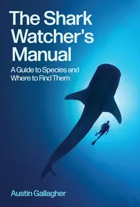

---

**Time:** 08:16:36 (Asia/Tehran)  
**Blog:** yoyoloit  

**Title:** An Armsfull of Birds: A Personal Field Guide to Love, Loss, and Commitment  

**Details:** English | 2026 | ISBN: 0757325556 | 336 pages | True EPUB | 2.16 MB  

**Link:** http://zavat.pw/ebooks/0757325556.html  

---

**Time:** 08:16:36 (Asia/Tehran)  
**Blog:** yoyoloit  

**Title:** Hanged : Execution in the Top End  

**Details:** English | 2026 | ISBN: 1763667154 | 196 pages | True EPUB | 2.39 MB  

**Link:** http://zavat.pw/ebooks/1763667154.html  

---

**Time:** 08:16:36 (Asia/Tehran)  
**Blog:** yoyoloit  

**Title:** Dishes and Beverages of the Old South  

**Details:** English | 2026 | ISBN: 1621903001 | 318 pages | True EPUB | 5.33 MB  

**Link:** http://zavat.pw/ebooks/1621903001.html  

---

**Time:** 08:16:36 (Asia/Tehran)  
**Blog:** yoyoloit  

**Title:** Win the Night to Win the Day : Sleep Well. Work Better. Live Best.  

**Details:** English | 2026 | ISBN: 1761453025 | 320 pages | True EPUB | 1.46 MB  

**Link:** http://zavat.pw/ebooks/1761453025.html  

---

**Time:** 08:16:36 (Asia/Tehran)  
**Blog:** yoyoloit  

**Title:** Methods and Designs for Outcomes Research, 2nd Edition  

**Details:** English | 2026 | ISBN: 9781585287659 | 257 pages | True PDF EPUB | 13.94 MB  

**Link:** http://zavat.pw/ebooks/9781585287659.html  

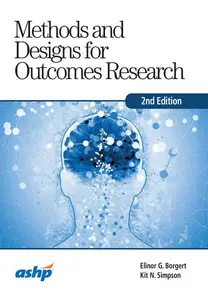

---

**Time:** 08:16:36 (Asia/Tehran)  
**Blog:** yoyoloit  

**Title:** Lead From Where You Are : Understand Leadership at Work  

**Details:** English | 2026 | ISBN: 1398626988 | 226 pages | True PDF EPUB | 8.32 MB  

**Link:** http://zavat.pw/ebooks/1398626988.html  

---

**Time:** 08:16:36 (Asia/Tehran)  
**Blog:** yoyoloit  

**Title:** Ask, Learn, Grow : Work With a Mentor  

**Details:** English | 2026 | ISBN: 1398626945 | 253 pages | True PDF EPUB | 8.44 MB  

**Link:** http://zavat.pw/ebooks/1398626945.html  

---

**Time:** 08:16:36 (Asia/Tehran)  
**Blog:** yoyoloit  

**Title:** Magnetic Influence : How to Negotiate and Persuade in a Disrupted World  

**Details:** English | 2026 | ISBN: 1398627879 | 233 pages | True PDF EPUB | 3.75 MB  

**Link:** http://zavat.pw/ebooks/1398627879.html  

---

**Time:** 08:16:36 (Asia/Tehran)  
**Blog:** yoyoloit  

**Title:** Read the Room: Empathize at Work  

**Details:** English | 2026 | ISBN: 139862652X | 238 pages | True PDF EPUB | 9.96 MB  

**Link:** http://zavat.pw/ebooks/139862652X.html  

---

**Time:** 08:16:36 (Asia/Tehran)  
**Blog:** yoyoloit  

**Title:** Sustainable Procurement: A Practical Guide to Corporate Social Responsibility in the Supply Chain, 2nd Edition  

**Details:** English | 2026 | ISBN: 1398625612 | 538 pages | True PDF EPUB | 76.66 MB  

**Link:** http://zavat.pw/ebooks/1398625612.html  

---

**Time:** 08:16:36 (Asia/Tehran)  
**Blog:** AvaxGenius  

**Title:** Processing and Characterization of Materials: Select Proceedings of CPCM 2020 (Repost)  

**Details:** English | EPUB | 2021 | 366 Pages | ISBN : 9811639361 | 96.7 MB  

**Link:** http://zavat.pw/ebooks/98116239361.html  

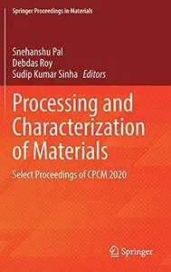

---

**Time:** 08:16:36 (Asia/Tehran)  
**Blog:** AvaxGenius  

**Title:** New Metropolitan Perspectives (Repost)  

**Details:** English | PDF | 2018 (2019 Edition) | 734 Pages | ISBN : 3319920987 | 118.1 MB  

**Link:** http://zavat.pw/ebooks/33199251987.html  

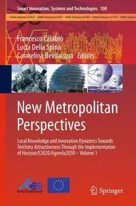

---

**Time:** 08:16:36 (Asia/Tehran)  
**Blog:** AvaxGenius  

**Title:** Comprehensive Practice of Exploration and Evaluation Techniques in Complex Reservoirs (Repost)  

**Details:** English | EPUB | 2019 | 390 Pages | ISBN : 9811364303 | 169.8 MB  

**Link:** http://zavat.pw/ebooks/96811364303.html  

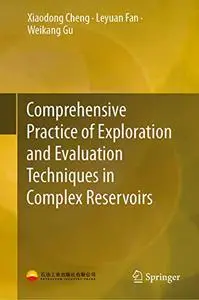

---

**Time:** 08:16:36 (Asia/Tehran)  
**Blog:** AvaxGenius  

**Title:** Nerve Blockade and Interventional Therapy (Repost)  

**Details:** English | EPUB | 2019 | 413 Pages | ISBN : 4431546596 | 134.1 MB  

**Link:** http://zavat.pw/ebooks/44315426596.html  

---

**Time:** 08:16:36 (Asia/Tehran)  
**Blog:** AvaxGenius  

**Title:** Middle Ear Diseases: Advances in Diagnosis and Management (Repost)  

**Details:** English | EPUB | 2018 | 499 Pages | ISBN : 3319729616 | 160.9 MB  

**Link:** http://zavat.pw/ebooks/33197729616.html  

---

**Time:** 08:16:36 (Asia/Tehran)  
**Blog:** AvaxGenius  

**Title:** Cognitive Internet of Things: Frameworks, Tools and Applications (Repost)  

**Details:** English | EPUB | 2020 | 504 Pages | ISBN : 3030049450 | 109.11 MB  

**Link:** http://zavat.pw/ebooks/30306049450.html  

---

**Time:** 08:16:36 (Asia/Tehran)  
**Blog:** AvaxGenius  

**Title:** Surgical and Perioperative Management of Patients with Anatomic Anomalies (Repost)  

**Details:** English | EPUB | 2021 | 522 Pages | ISBN : 3030556581 | 206.2 MB  

**Link:** http://zavat.pw/ebooks/30130556581.html  

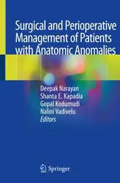

---

**Time:** 08:16:36 (Asia/Tehran)  
**Blog:** AvaxGenius  

**Title:** The Importance of Photosensitivity for Epilepsy (Repost)  

**Details:** English | EPUB | 2021 | 450 Pages | ISBN : 3319050796 | 95.5 MB  

**Link:** http://zavat.pw/ebooks/33190750796.html  

---

**Time:** 08:16:36 (Asia/Tehran)  
**Blog:** AvaxGenius  

**Title:** Design for Inclusivity (Repost)  

**Details:** English | EPUB (True) | 2023 | 799 Pages | ISBN : 3031363019 | 435.9 MB  

**Link:** http://zavat.pw/ebooks/303513635019.html  

---

**Time:** 08:16:36 (Asia/Tehran)  
**Blog:** AvaxGenius  

**Title:** Intelligent Data Engineering and Analytics Frontiers in Intelligent Computing (Repost)  

**Details:** English | EPUB | 2020 ( 2021 Edition ) | 740 Pages | ISBN : 9811556784 | 106.9 MB  

**Link:** http://zavat.pw/ebooks/98115656784.html  

---

**Time:** 08:16:36 (Asia/Tehran)  
**Blog:** AvaxGenius  

**Title:** Intelligent Robotics and Applications (Repost)  

**Details:** English | PDF | 2019 | 713 Pages | ISBN : 3030275280 | 104.4 MB  

**Link:** http://zavat.pw/ebooks/30302757280.html  

---

**Time:** 08:16:36 (Asia/Tehran)  
**Blog:** AvaxGenius  

**Title:** Pädiatrie (Repost)  

**Details:** Deutsch | PDF | 2019 | 865 Pages | ISBN : 366257294X | 122.5 MB  

**Link:** http://zavat.pw/ebooks/3662577294X.html  

---

**Time:** 08:16:36 (Asia/Tehran)  
**Blog:** AvaxGenius  

**Title:** Recent Trends and Advances in Artificial Intelligence and Internet of Things (Repost)  

**Details:** English | EPUB | 2020 | 618 Pages | ISBN : 3030326438 | 123.81 MB  

**Link:** http://zavat.pw/ebooks/30307326438.html  

---

**Time:** 08:16:36 (Asia/Tehran)  
**Blog:** AvaxGenius  

**Title:** Innovative Renewable Waste Conversion Technologies (Repost)  

**Details:** English | PDF,EPUB | 2021 | 464 Pages | ISBN : 3030814300 | 103.5 MB  

**Link:** http://zavat.pw/ebooks/30308714300.html  

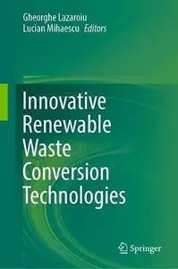

---

**Time:** 08:16:36 (Asia/Tehran)  
**Blog:** AvaxGenius  

**Title:** Bone Marrow Biopsy Pathology: A Practical Guide (Repost)  

**Details:** English | PDF | 2020 | 544 Pages | ISBN : 3662603071 | 209.03 MB  

**Link:** http://zavat.pw/ebooks/36762603071.html  

---

**Time:** 08:16:36 (Asia/Tehran)  
**Blog:** hill0  

**Title:** Bad Programming Practices 101 (2nd Edition)  

**Details:** English | 2026 | ASIN: B0GGX8DKQG | 246 Pages | PDF EPUB (True) | 6 MB  

**Link:** http://zavat.pw/ebooks/B0GGX8DKQG.html  

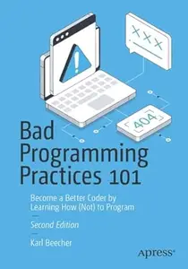

---

**Time:** 08:16:36 (Asia/Tehran)  
**Blog:** crazy-slim  

**Title:** Libero - 20 Maggio 2026  

**Details:** Italiano | 40 pages | PDF | 89.1 MB  

**Link:** http://zavat.pw/newspapers/Libero20Maggio2026-87375.html  

---

**Time:** 08:16:36 (Asia/Tehran)  
**Blog:** crazy-slim  

**Title:** TuttoSport - 20 Maggio 2026  

**Details:** Italiano | 40 pages | True PDF | 19.3 MB  

**Link:** http://zavat.pw/newspapers/TuttoSport20Maggio2026-06886.html  

---

**Time:** 08:16:36 (Asia/Tehran)  
**Blog:** crazy-slim  

**Title:** La Stampa Vercelli - 20 Maggio 2026  

**Details:** Italiano | 48 pages | True PDF | 28.7 MB  

**Link:** http://zavat.pw/newspapers/LaStampaVercelli20Maggio2026-43151.html  

---

**Time:** 08:16:36 (Asia/Tehran)  
**Blog:** crazy-slim  

**Title:** Quotidiano di Puglia Taranto - 20 Maggio 2026  

**Details:** Italiano | 28 pages | True PDF | 11.6 MB  

**Link:** http://zavat.pw/newspapers/QuotidianodiPugliaTaranto20Maggio2026-88012.html  

---

**Time:** 08:16:36 (Asia/Tehran)  
**Blog:** crazy-slim  

**Title:** Messaggero Veneto Pordenone - 20 Maggio 2026  

**Details:** Italiano | 56 pages | True PDF | 18.2 MB  

**Link:** http://zavat.pw/newspapers/MessaggeroVenetoPordenone20Maggio2026-52306.html  

---

**Time:** 08:16:36 (Asia/Tehran)  
**Blog:** crazy-slim  

**Title:** El País - 20 Mayo 2026  

**Details:** Español | 56 pages | True PDF | 5.5 MB  

**Link:** http://zavat.pw/newspapers/ElPa%C3%ADs20Mayo2026-26765.html  

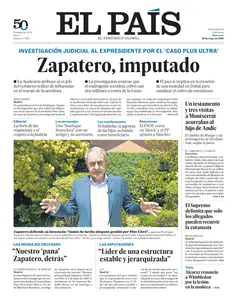

---

**Time:** 08:16:36 (Asia/Tehran)  
**Blog:** crazy-slim  

**Title:** Quotidiano di Puglia Lecce - 20 Maggio 2026  

**Details:** Italiano | 28 pages | True PDF | 10.8 MB  

**Link:** http://zavat.pw/newspapers/QuotidianodiPugliaLecce20Maggio2026-33651.html  

---

**Time:** 08:16:36 (Asia/Tehran)  
**Blog:** crazy-slim  

**Title:** Quotidiano di Puglia Bari - 20 Maggio 2026  

**Details:** Italiano | 28 pages | True PDF | 11.4 MB  

**Link:** http://zavat.pw/newspapers/QuotidianodiPugliaBari20Maggio2026-38629.html  

---

**Time:** 08:16:36 (Asia/Tehran)  
**Blog:** crazy-slim  

**Title:** La Verita - 20 Maggio 2026  

**Details:** Italiano | 24 pages | True PDF | 30.9 MB  

**Link:** http://zavat.pw/newspapers/LaVerita20Maggio2026-12861.html  

---

**Time:** 08:16:36 (Asia/Tehran)  
**Blog:** crazy-slim  

**Title:** Milano Finanza - 20 Maggio 2026  

**Details:** Italiano | 32 pages | True PDF | 5.8 MB  

**Link:** http://zavat.pw/newspapers/MilanoFinanza20Maggio2026-04884.html  

---

**Time:** 08:16:36 (Asia/Tehran)  
**Blog:** crazy-slim  

**Title:** Quotidiano di Puglia Brindisi - 20 Maggio 2026  

**Details:** Italiano | 28 pages | True PDF | 10.7 MB  

**Link:** http://zavat.pw/newspapers/QuotidianodiPugliaBrindisi20Maggio2026-02165.html  

---

**Time:** 08:16:36 (Asia/Tehran)  
**Blog:** crazy-slim  

**Title:** Messaggero Veneto Udine - 20 Maggio 2026  

**Details:** Italiano | 56 pages | True PDF | 18.3 MB  

**Link:** http://zavat.pw/newspapers/MessaggeroVenetoUdine20Maggio2026-58846.html  

---

**Time:** 08:16:36 (Asia/Tehran)  
**Blog:** crazy-slim  

**Title:** Messaggero Veneto Gorizia - 20 Maggio 2026  

**Details:** Italiano | 56 pages | True PDF | 18.3 MB  

**Link:** http://zavat.pw/newspapers/MessaggeroVenetoGorizia20Maggio2026-37560.html  

---

**Time:** 08:16:36 (Asia/Tehran)  
**Blog:** crazy-slim  

**Title:** laRegione - 20 Maggio 2026  

**Details:** Italiano | 24 pages | PDF | 78.5 MB  

**Link:** http://zavat.pw/newspapers/laRegione20Maggio2026-68800.html  

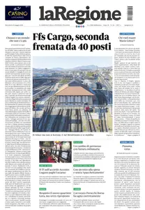

---

**Time:** 08:16:36 (Asia/Tehran)  
**Blog:** crazy-slim  

**Title:** Libertà Sicilia - 20 Maggio 2026  

**Details:** Italiano | 12 pages | True PDF | 3.2 MB  

**Link:** http://zavat.pw/newspapers/Libert%C3%A0Sicilia20Maggio2026-39019.html  

---

**Time:** 02:30:12 (Asia/Tehran)  
**Blog:** AvaxGenius  

**Title:** Advances in Interdisciplinary Engineering: Select Proceedings of FLAME 2020 (Repost)  

**Details:** English | EPUB | 2021 | 835 Pages | ISBN : 9811599556 | 112 MB  

**Link:** http://zavat.pw/ebooks/981615699556.html  

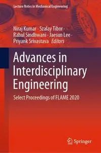

---

**Time:** 02:30:12 (Asia/Tehran)  
**Blog:** AvaxGenius  

**Title:** Proceedings of SYROM 2022 & ROBOTICS 2022 (Repost)  

**Details:** English | EPUB | 2023 | 414 Pages | ISBN : 3031256549 | 112.3 MB  

**Link:** http://zavat.pw/ebooks/30831256549.html  

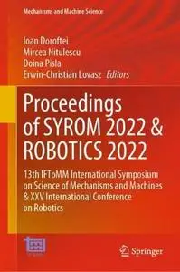

---

**Time:** 02:30:12 (Asia/Tehran)  
**Blog:** AvaxGenius  

**Title:** Proceedings of the 7th International Symposium of Space Optical Instruments and Applications (Repost)  

**Details:** English | PDF (True) | 2023 | 745 Pages | ISBN : 9819940974 | 114.9 MB  

**Link:** http://zavat.pw/ebooks/968199740974.html  

---

**Time:** 02:30:12 (Asia/Tehran)  
**Blog:** AvaxGenius  

**Title:** Press/Siever Allgemeine Geologie (Repost)  

**Details:** Deutsch | PDF | 2017 | 786 Pages | ISBN : 3662483416 | 98.8 MB  

**Link:** http://zavat.pw/ebooks/366234833416.html  

---

**Time:** 02:30:12 (Asia/Tehran)  
**Blog:** AvaxGenius  

**Title:** Fulminant Myocarditis (Repost)  

**Details:** English | EPUB | 2022 | 375 Pages | ISBN : 9811957584 | 176.7 MB  

**Link:** http://zavat.pw/ebooks/98117957584.html  

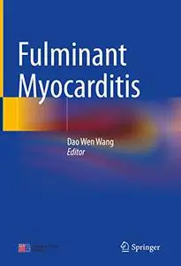

---

**Time:** 02:30:12 (Asia/Tehran)  
**Blog:** AvaxGenius  

**Title:** Sports-related Fractures, Dislocations and Trauma: Advanced On- and Off-field Management (Repost)  

**Details:** English | PDF (True) | 2020 | 995 Pages | ISBN : 3030367894 | 98.2 MB  

**Link:** http://zavat.pw/ebooks/30303687894.html  

---

**Time:** 02:30:12 (Asia/Tehran)  
**Blog:** AvaxGenius  

**Title:** Mars: A Volcanic World (Repost)  

**Details:** English | EPUB (True) | 2021 | 328 Pages | ISBN : 3030841022 | 246.2 MB  

**Link:** http://zavat.pw/ebooks/30308841022.html  

---

**Time:** 02:30:12 (Asia/Tehran)  
**Blog:** AvaxGenius  

**Title:** 21st Century Maritime Silk Road: Wind Energy Resource Evaluation (Repost)  

**Details:** English | EPUB | 2021 | 189 Pages | ISBN : 9811641102 | 110.3 MB  

**Link:** http://zavat.pw/ebooks/98116419102.html  

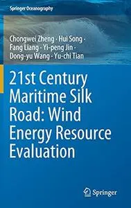

---

**Time:** 02:30:12 (Asia/Tehran)  
**Blog:** AvaxGenius  

**Title:** Mechanism Design for Robotics (Repost)  

**Details:** English | PDF,EPUB | 2018 (2019 Edition) | 467 Pages | ISBN : 3030003647 | 112.8 MB  

**Link:** http://zavat.pw/ebooks/30307003647.html  

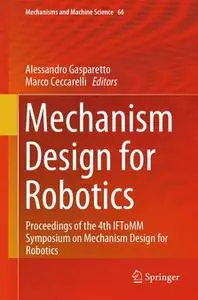

---

**Time:** 02:30:12 (Asia/Tehran)  
**Blog:** AvaxGenius  

**Title:** China Seismic Experimental Site: Theoretical Framework and Ongoing Practice (Repost)  

**Details:** English | EPUB | 2022 | 276 Pages | ISBN : 9811686068 | 141.7 MB  

**Link:** http://zavat.pw/ebooks/98116886068.html  

---

**Time:** 02:30:12 (Asia/Tehran)  
**Blog:** AvaxGenius  

**Title:** International Scientific Conference Energy Management of Municipal Transportation Facilities and Transport EMMFT 2017 (Repost)  

**Details:** English | PDF | 2018 | 1367 Pages | ISBN : 3319709860 | 115.8 MB  

**Link:** http://zavat.pw/ebooks/33197097860.html  

---

**Time:** 02:30:12 (Asia/Tehran)  
**Blog:** AvaxGenius  

**Title:** Atomic and Molecular Spectroscopy: Basic Aspects and Practical Applications, Fifth Edition (Repost)  

**Details:** English | EPUB (True) | 2022 | 698 Pages | ISBN : 3031047753 | 118.7 MB  

**Link:** http://zavat.pw/ebooks/30318047753.html  

---

**Time:** 02:30:12 (Asia/Tehran)  
**Blog:** AvaxGenius  

**Title:** Multidisciplinary Aspects of Design: Objects, Processes, Experiences and Narratives (Repost)  

**Details:** English | EPUB (True) | 2024 | 784 Pages | ISBN : 3031498100 | 103.2 MB  

**Link:** http://zavat.pw/ebooks/30314798100.html  

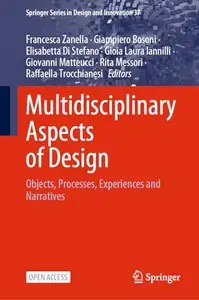

---

**Time:** 02:30:12 (Asia/Tehran)  
**Blog:** AvaxGenius  

**Title:** Advances in Network-Based Information Systems (Repost)  

**Details:** English | PDF (True) | 2024 | Pages | ISBN : 3031723244 | 103.8 MB  

**Link:** http://zavat.pw/ebooks/30317723244.html  

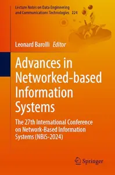

---

**Time:** 02:30:12 (Asia/Tehran)  
**Blog:** AvaxGenius  

**Title:** Optical Polymer Waveguides: From the Design to the Final 3D-Opto Mechatronic Integrated Device (Repost)  

**Details:** English | EPUB | 2022 | 283 Pages | ISBN : 3030928535 | 106.6 MB  

**Link:** http://zavat.pw/ebooks/30309285835.html  

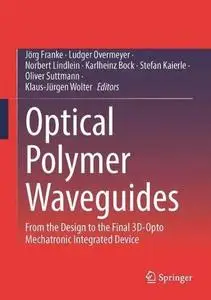

---

**Time:** 01:26:09 (Asia/Tehran)  
**Blog:** IrGens  

**Title:** TTC Video - Queen of the Sciences: A History of Mathematics [Digitally Remastered]  

**Details:** .MP4, AVC, 1280x720, 30 fps | English, AAC, 2 Ch | 12h 16m | 10.24 GB  

**Link:** http://zavat.pw/ebooks/the-queen-of-the-sciences-a-history-of-mathematics.html  

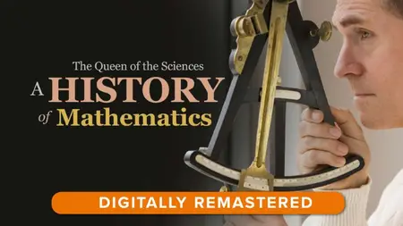

---

**Time:** 01:26:09 (Asia/Tehran)  
**Blog:** IrGens  

**Title:** Leading with Impact: Turning Difficult Conversations into Performance Wins  

**Details:** ISBN: 9780135899274 | .MP4, AVC, 1280x720, 30 fps | English, AAC, 2 Ch | 2h 1m | 3.66 GB  

**Link:** http://zavat.pw/ebooks/9780135899274.html  

---

**Time:** 01:26:09 (Asia/Tehran)  
**Blog:** hill0  

**Title:** Hydrostatic Pressure Chemistry  

**Details:** English | 2026 | ISBN: 9819574609 | 152 Pages | PDF EPUB (True) | 62 MB  

**Link:** http://zavat.pw/ebooks/9819574609.html  

---

**Time:** 01:26:09 (Asia/Tehran)  
**Blog:** hill0  

**Title:** Managing AI Projects  

**Details:** English | 2026 | ASIN: B0GPV56NFL | 368 Pages | EPUB | 10 MB  

**Link:** http://zavat.pw/ebooks/B0GPV56NFL.html  

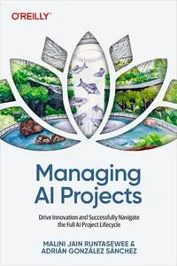

---

**Time:** 01:26:09 (Asia/Tehran)  
**Blog:** hill0  

**Title:** Financial Times Europe - 19 May 2026  

**Details:** English | 18 pages | True PDF | 6 MB  

**Link:** http://zavat.pw/newspapers/FTE-190526.html  

---

**Time:** 00:10:33 (Asia/Tehran)  
**Blog:** hill0  

**Title:** Understanding and Treating Depressive Disorders: An Introduction  

**Details:** English | 2026 | ISBN: 3032144647 | 680 Pages | PDF EPUB (True) | 45 MB  

**Link:** http://zavat.pw/ebooks/3032144647.html  

---

**Time:** 00:10:33 (Asia/Tehran)  
**Blog:** hill0  

**Title:** Bernard Shaw and the Ethical Use of Artificial Intelligence and Large Language Models  

**Details:** English | 2026 | ISBN: 3032165504 | 253 Pages | PDF EPUB (True) | 21 MB  

**Link:** http://zavat.pw/ebooks/3032165504.html  

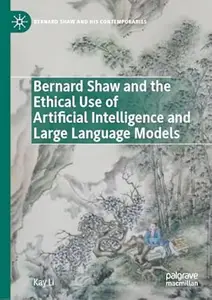

---

**Time:** 00:10:33 (Asia/Tehran)  
**Blog:** hill0  

**Title:** Evasion Engineering  

**Details:** English | 2026 | ISBN: 1718505043 | 280 Pages | PDF | 9 MB  

**Link:** http://zavat.pw/ebooks/1718505043.html  

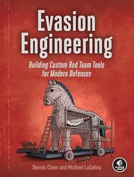

