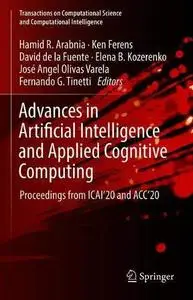
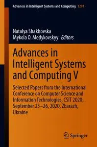
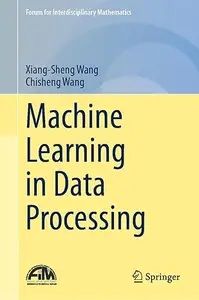

# Zavat feed - 2026-05-21

---

**Time:** 03:17:52 (Asia/Tehran)  
**Blog:** AvaxGenius  

**Title:** Advances in Artificial Intelligence and Applied Cognitive Computing: Proceedings from ICAI’20 and ACC’20 (Repost)  

**Details:** English | EPUB | 2021 | 1152 Pages | ISBN : 3030702952 | 141.9 MB  

**Link:** http://zavat.pw/ebooks/30360702952.html  

---

**Time:** 03:17:52 (Asia/Tehran)  
**Blog:** AvaxGenius  

**Title:** Advances in Intelligent Systems and Computing V (Repost)  

**Details:** English | PDF | 2021 | 1190 Pages | ISBN : 3030632695 | 150.2 MB  

**Link:** http://zavat.pw/ebooks/30306632695.html  

---

**Time:** 01:40:18 (Asia/Tehran)  
**Blog:** hill0  

**Title:** Machine Learning in Data Processing  

**Details:** English | 2026 | ISBN: 3032208548 | 122 Pages | PDF EPUB (True) | 6.4 MB  

**Link:** http://zavat.pw/ebooks/3032208548.html  

