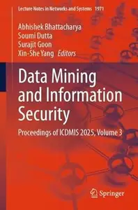
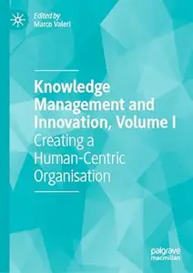
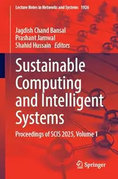
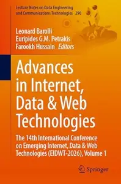
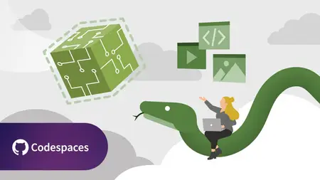
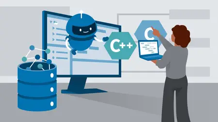

# Zavat feed - 2026-05-25

---

**Time:** 02:00:21 (Asia/Tehran)  
**Blog:** IrGens  

**Title:** E-Mails mit KI – professionell und schnell schreiben  

**Details:** .MP4, AVC, 1280x720, 30 fps | Deutsch, AAC, 2 Ch | 1 Std. 54 Min. | 301 MB  

**Link:** http://zavat.pw/ebooks/e-mails-mit-ki-professionell-und-schnell-schreiben.html  

---

**Time:** 02:00:21 (Asia/Tehran)  
**Blog:** hill0  

**Title:** Data Mining and Information Security, Volume 3  

**Details:** English | 2026 | ISBN: 3032259541 | 621 Pages | PDF (True) | 74 MB  

**Link:** http://zavat.pw/ebooks/3032259541.html  

---

**Time:** 02:00:21 (Asia/Tehran)  
**Blog:** hill0  

**Title:** Advances in Earth and Environmental Sciences- Volume 1 Earth Sciences  

**Details:** English | 2026 | ISBN: 3032252091 | 364 Pages | PDF (True) | 90 MB  

**Link:** http://zavat.pw/ebooks/3032252091.html  

---

**Time:** 02:00:21 (Asia/Tehran)  
**Blog:** hill0  

**Title:** Trade, Jobs, and Rules  

**Details:** English | 2026 | ISBN: 3032241928 | 214 Pages | PDF EPUB (True) | 3 MB  

**Link:** http://zavat.pw/ebooks/3032241928.html  

---

**Time:** 02:00:21 (Asia/Tehran)  
**Blog:** hill0  

**Title:** Life Course Perspectives on Black Sexual Minority Men's Health and Quality of Life  

**Details:** English | 2026 | ISBN: 3032182328 | 402 Pages | PDF EPUB (True) | 6 MB  

**Link:** http://zavat.pw/ebooks/3032182328.html  

---

**Time:** 02:00:21 (Asia/Tehran)  
**Blog:** hill0  

**Title:** Perspectives on Reglobalization  

**Details:** English | 2026 | ISBN: 3032072352 | 384 Pages | PDF EPUB (True) | 6 MB  

**Link:** http://zavat.pw/ebooks/3032072352.html  

---

**Time:** 02:00:21 (Asia/Tehran)  
**Blog:** hill0  

**Title:** Knowledge Management and Innovation, Volume I  

**Details:** English | 2026 | ISBN: 3032166195 | 272 Pages | PDF EPUB (True) | 11 MB  

**Link:** http://zavat.pw/ebooks/3032166195.html  

---

**Time:** 02:00:21 (Asia/Tehran)  
**Blog:** hill0  

**Title:** Financial Crime in the Digital Era  

**Details:** English | 2026 | ISBN: 3032201977 | 510 Pages | PDF EPUB (True) | 65 MB  

**Link:** http://zavat.pw/ebooks/3032201977.html  

---

**Time:** 02:00:21 (Asia/Tehran)  
**Blog:** hill0  

**Title:** Sustainable Computing and Intelligent Systems, Volume 1  

**Details:** English | 2026 | ISBN: 3032229073 | 302 Pages | PDF (True) | 40 MB  

**Link:** http://zavat.pw/ebooks/3032229073.html  

---

**Time:** 02:00:21 (Asia/Tehran)  
**Blog:** hill0  

**Title:** Advances in Internet, Data & Web Technologies, Volume 1  

**Details:** English | 2026 | ISBN: 3032227941 | 327 Pages | PDF (True) | 40 MB  

**Link:** http://zavat.pw/ebooks/3032227941.html  

---

**Time:** 02:00:21 (Asia/Tehran)  
**Blog:** hill0  

**Title:** Interlegal Reasoning  

**Details:** English | 2026 | ISBN: 3032225248 | 354 Pages | PDF EPUB (True) | 3.3 MB  

**Link:** http://zavat.pw/ebooks/3032225248.html  

---

**Time:** 00:58:11 (Asia/Tehran)  
**Blog:** IrGens  

**Title:** WebAssembly (Wasm) lernen – Einstieg mit Python  

**Details:** .MP4, AVC, 1280x720, 30 fps | Deutsch, AAC, 2 Ch | 1 Std. 14 Min. | 148 MB  

**Link:** http://zavat.pw/ebooks/webassembly-wasm-lernen-einstieg-mit-python.html  

---

**Time:** 00:58:11 (Asia/Tehran)  
**Blog:** IrGens  

**Title:** Von Windows zu Linux migrieren: Praxisleitfaden für IT-Admins  

**Details:** .MP4, AVC, 1280x720, 30 fps | Deutsch, AAC, 2 Ch | 55 Min. | 95.9 MB  

**Link:** http://zavat.pw/ebooks/von-windows-zu-linux-migrieren-praxisleitfaden-fur-it-admins.html  

---

**Time:** 00:58:11 (Asia/Tehran)  
**Blog:** IrGens  

**Title:** C und C++ lernen mit KI-Unterstützung  

**Details:** .MP4, AVC, 1280x720, 30 fps | Deutsch, AAC, 2 Ch | 2 Std. 20 Min. | 343 MB  

**Link:** http://zavat.pw/ebooks/c-und-c-plus-plus-lernen-mit-ki-unterstutzung.html  

---

**Time:** 00:58:11 (Asia/Tehran)  
**Blog:** IrGens  

**Title:** Multimodal Vibe Coding with Google Gemini  

**Details:** .MP4, AVC, 1280x720, 30 fps | English, AAC, 2 Ch | 24m | 74.95 MB  

**Link:** http://zavat.pw/ebooks/multimodal-vibe-coding-with-google-gemini.html  

