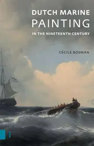
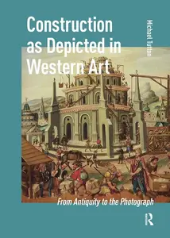
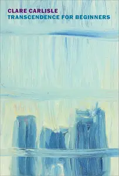

# Zavat feed - 2026-05-26

---

**Time:** 01:13:10 (Asia/Tehran)  
**Blog:** IrGens  

**Title:** Dutch Marine Painting in the Nineteenth Century  

**Details:** English | December 24, 2025 | ISBN: 9048572320 | True EPUB | 288 pages | 123 MB  

**Link:** http://zavat.pw/ebooks/9048572320.html  

---

**Time:** 01:13:10 (Asia/Tehran)  
**Blog:** IrGens  

**Title:** Construction as Depicted in Western Art: From Antiquity to the Photograph  

**Details:** English | February 4, 2021 | ISBN: 9462982554, 1041177453 | True EPUB | 296 pages | 16.2 MB  

**Link:** http://zavat.pw/ebooks/9462982554-epub.html  

---

**Time:** 01:13:10 (Asia/Tehran)  
**Blog:** IrGens  

**Title:** Transcendence for Beginners: Life Writing and Philosophy  

**Details:** English | April 7, 2026 | ISBN: 9798896230144, ASIN: B0FH15JLRT | True EPUB | 216 pages | 4.6 MB  

**Link:** http://zavat.pw/ebooks/9798896230144.html  

