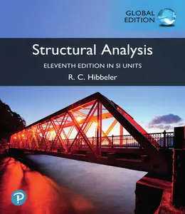
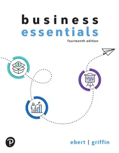
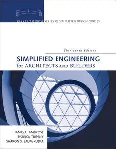
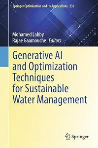
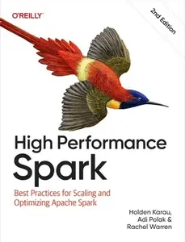

# Zavat feed - 2026-05-30

---

**Time:** 01:19:36 (Asia/Tehran)  
**Blog:** yoyoloit  

**Title:** Structural Analysis, in SI Units, 11th Edition  

**Details:** English | 2024 | ISBN: 1292469722 | 761 pages | True PDF | 139.27 MB  

**Link:** http://zavat.pw/ebooks/1292469722.html  

---

**Time:** 01:19:36 (Asia/Tehran)  
**Blog:** yoyoloit  

**Title:** Managing Electrical Hazards, 6th Edition  

**Details:** English | 2024 | ISBN: 0138318697 | 90 pages | True PDF | 12.47 MB  

**Link:** http://zavat.pw/ebooks/0138318697.html  

---

**Time:** 01:19:36 (Asia/Tehran)  
**Blog:** yoyoloit  

**Title:** Business Essentials, 14th Edition  

**Details:** English | 2025 | ISBN: 0138072442 | 705 pages | True PDF EPUB | 238.21 MB  

**Link:** http://zavat.pw/ebooks/0138072442.html  

---

**Time:** 01:19:36 (Asia/Tehran)  
**Blog:** yoyoloit  

**Title:** Simplified Engineering for Architects and Builders, 13th Edition  

**Details:** English | 2025 | ISBN: 1119523052 | 466 pages | True PDF EPUB | 48.38 MB  

**Link:** http://zavat.pw/ebooks/1119523052.html  

---

**Time:** 01:19:36 (Asia/Tehran)  
**Blog:** yoyoloit  

**Title:** A Beginner's Guide To Web Application Penetration Testing  

**Details:** English | 2025 | ISBN: 1394295596 | 353 pages | True PDF EPUB | 45.97 MB  

**Link:** http://zavat.pw/ebooks/1394295596a.html  

---

**Time:** 01:19:36 (Asia/Tehran)  
**Blog:** yoyoloit  

**Title:** Campbell Biology in Focus, 4th edition  

**Details:** English | 2024 | ISBN: 0138255210 | 1139 pages | True PDF EPUB | 873.24 MB  

**Link:** http://zavat.pw/ebooks/0138255210.html  

---

**Time:** 01:19:36 (Asia/Tehran)  
**Blog:** yoyoloit  

**Title:** Business Mathematics, 15th Edition  

**Details:** English | 2025 | ISBN: 0138318875 | 897 pages | True PDF EPUB | 803.89 MB  

**Link:** http://zavat.pw/ebooks/0138318875.html  

---

**Time:** 01:19:36 (Asia/Tehran)  
**Blog:** hill0  

**Title:** Generative AI and Optimization Techniques for Sustainable Water Management  

**Details:** English | 2026 | ISBN: 3032190118 | 279 Pages | PDF EPUB (True) | 36 MB  

**Link:** http://zavat.pw/ebooks/3032190118.html  

---

**Time:** 01:19:36 (Asia/Tehran)  
**Blog:** hill0  

**Title:** High Performance Spark, 2nd Edition  

**Details:** English | 2026 | ISBN: 1098145852 | 442 Pages | EPUB | 6 MB  

**Link:** http://zavat.pw/ebooks/1098145852.html  

