# Zavat feed - 2026-06-01

---

**Time:** 20:04:32 (Asia/Tehran)  
**Blog:** yoyoloit  

**Title:** Superteams: The Science and Secrets of High-Performing Teams  

**Details:** English | 2026 | ISBN: 198218633X | 352 pages | True EPUB | 7.92 MB  

**Link:** http://zavat.pw/ebooks/198218633X.html  

---

**Time:** 20:04:32 (Asia/Tehran)  
**Blog:** yoyoloit  

**Title:** Mastering Your Mental Game: Secrets from My Twenty-Five Years on the PGA Tour―A Practical Guide to Improving Your Performance  

**Details:** English | 2026 | ISBN: 1668202050 | 256 pages | True EPUB | 2.28 MB  

**Link:** http://zavat.pw/ebooks/1668202050.html  

---

**Time:** 20:04:32 (Asia/Tehran)  
**Blog:** yoyoloit  

**Title:** When Technology Fails, Revised and Expanded: The Definitive Manual for Preparedness in an Uncertain World  

**Details:** English | 2026 | ISBN: 1645023478 | 448 pages | True EPUB | 73.99 MB  

**Link:** http://zavat.pw/ebooks/1645023478.html  

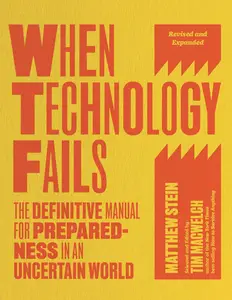

---

**Time:** 20:04:32 (Asia/Tehran)  
**Blog:** yoyoloit  

**Title:** The Capitol: The Surprising Biography of an American Building  

**Details:** English | 2026 | ISBN: 0593185005 | 464 pages | True EPUB | 43.99 MB  

**Link:** http://zavat.pw/ebooks/0593185005.html  

---

**Time:** 20:04:32 (Asia/Tehran)  
**Blog:** yoyoloit  

**Title:** The Hidden Nations of Animals: A Grand Tour of Earth's Wild Civilizations  

**Details:** English | 2026 | ISBN: 0593716841 | 288 pages | True EPUB | 53.15 MB  

**Link:** http://zavat.pw/ebooks/0593716841.html  

---

**Time:** 20:04:32 (Asia/Tehran)  
**Blog:** yoyoloit  

**Title:** The Teacher's Guide to Restorative Yoga: 30+ Therapeutic Pose and Sequence Combinations to Calm the Nervous System  

**Details:** English | 2026 | ISBN: 9798889843702 | 224 pages | True EPUB | 22.66 MB  

**Link:** http://zavat.pw/ebooks/9798889843702.html  

---

**Time:** 20:04:32 (Asia/Tehran)  
**Blog:** yoyoloit  

**Title:** The Vegan Asian Kitchen: 100+ Plant-Based Recipes Inspired by Malaysia, China, Thailand, and Beyond  

**Details:** English | 2026 | ISBN: 0593543297 | 352 pages | True EPUB | 163.11 MB  

**Link:** http://zavat.pw/ebooks/0593543297.html  

---

**Time:** 20:04:32 (Asia/Tehran)  
**Blog:** yoyoloit  

**Title:** Perennials for the Northeast: A Comprehensive Guide  

**Details:** English | 2026 | ISBN: 1643264508 | 420 pages | True EPUB | 237.08 MB  

**Link:** http://zavat.pw/ebooks/1643264508.html  

---

**Time:** 20:04:32 (Asia/Tehran)  
**Blog:** yoyoloit  

**Title:** Perennials for the Pacific Northwest: A Comprehensive Guide  

**Details:** English | 2026 | ISBN: 1643264524 | 408 pages | True EPUB | 222.05 MB  

**Link:** http://zavat.pw/ebooks/1643264524.html  

---

**Time:** 20:04:32 (Asia/Tehran)  
**Blog:** yoyoloit  

**Title:** The New Cocktail Hour: The Essential Guide to Handcrafted Drinks (Revised & Expanded Edition)  

**Details:** English | 2026 | ISBN: 9798894142616 | 344 pages | True EPUB | 81.98 MB  

**Link:** http://zavat.pw/ebooks/9798894142616.html  

---

**Time:** 20:04:32 (Asia/Tehran)  
**Blog:** yoyoloit  

**Title:** Beautiful Bugs: A Curious Collection of Exquisite Insects  

**Details:** English | 2026 | ISBN: 1797243047 | 208 pages | True EPUB | 205.2 MB  

**Link:** http://zavat.pw/ebooks/1797243047.html  

---

**Time:** 20:04:32 (Asia/Tehran)  
**Blog:** yoyoloit  

**Title:** Python Projects for Raspberry Pi: Physical computing for work, play, and learning  

**Details:** English | 2026 | ISBN: 1916868525 | 240 pages | True EPUB | 7.4 MB  

**Link:** http://zavat.pw/ebooks/1916868525.html  

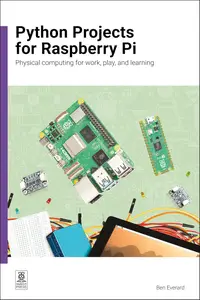

---

**Time:** 20:04:32 (Asia/Tehran)  
**Blog:** yoyoloit  

**Title:** Cooking the Borderlands : Spice and Smoke Between Mexico and the States  

**Details:** English | 2026 | ISBN: 0593796136 | 288 pages | True EPUB | 157.49 MB  

**Link:** http://zavat.pw/ebooks/0593796136.html  

---

**Time:** 20:04:32 (Asia/Tehran)  
**Blog:** yoyoloit  

**Title:** Business Math, 12th Edition  

**Details:** English | 2024 | ISBN: 0138055025 | 897 pages | True PDF EPUB | 247.09 MB  

**Link:** http://zavat.pw/ebooks/0138055025a.html  

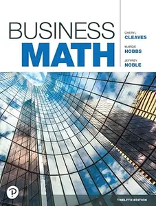

---

**Time:** 20:04:32 (Asia/Tehran)  
**Blog:** yoyoloit  

**Title:** The Coaching Psychology Handbook: Integrating Psychological Theory, Practice and Research  

**Details:** English | 2026 | ISBN: 1394292775 | 931 pages | True PDF EPUB | 11.54 MB  

**Link:** http://zavat.pw/ebooks/1394292775.html  

---

**Time:** 20:04:32 (Asia/Tehran)  
**Blog:** IrGens  

**Title:** Best Literary Translations 2026  

**Details:** English | April 14, 2026 | ISBN: 1646054245 | True EPUB | 225 pages | 3.2 MB  

**Link:** http://zavat.pw/ebooks/1646054245.html  

---

**Time:** 20:04:32 (Asia/Tehran)  
**Blog:** IrGens  

**Title:** The First Lady Next Door: A Memoir of Iceland, Identity, and Unexpected Adventure  

**Details:** English | May 5, 2026 | ISBN: 1464243042, 9781668096543, 9781668096482 | True EPUB | 384 pages | 19.2 MB  

**Link:** http://zavat.pw/ebooks/1464243042.html  

---

**Time:** 20:04:32 (Asia/Tehran)  
**Blog:** IrGens  

**Title:** Street Nihonga: The Art of Jimmy Tsutomu Mirikitani  

**Details:** English | February 27, 2026 | ISBN: 9048570425, 9789048570430, 9789048575107 | True EPUB/PDF | 228 pages | 351/335 MB  

**Link:** http://zavat.pw/ebooks/9048570425.html  

---

**Time:** 20:04:32 (Asia/Tehran)  
**Blog:** IrGens  

**Title:** Banksy: Completed  

**Details:** English | October 26, 2021 | ISBN: 0262046245, 0262553937 | True EPUB | 216 pages | 27.5 MB  

**Link:** http://zavat.pw/ebooks/0262046245.html  

---

**Time:** 20:04:32 (Asia/Tehran)  
**Blog:** IrGens  

**Title:** No Liberty to Libel: The Constitutional Case Against New York Times v. Sullivan  

**Details:** English | May 12, 2026 | ISBN: 1641775033 | True EPUB | 256 pages | 0.6 MB  

**Link:** http://zavat.pw/ebooks/1641775033.html  

---

**Time:** 20:04:32 (Asia/Tehran)  
**Blog:** IrGens  

**Title:** An Inconvenient Widow: The Torment, Trial, and Triumph of Mary Todd Lincoln  

**Details:** English | May 19, 2026 | ISBN: 1982140720, 9781982140762 | True EPUB | 480 pages | 37.2 MB  

**Link:** http://zavat.pw/ebooks/1982140720.html  

---

**Time:** 20:04:32 (Asia/Tehran)  
**Blog:** IrGens  

**Title:** George Orwell: A Reader's Guide: Or, 'Who Is Big Brother?' and Other Puzzles  

**Details:** English | October 7, 2025 | ISBN: 0300284233, 9780300277746 | True EPUB | 224 pages | 3.4 MB  

**Link:** http://zavat.pw/ebooks/0300284233.html  

---

**Time:** 20:04:32 (Asia/Tehran)  
**Blog:** IrGens  

**Title:** The Mark Twain Book of Quotes: A Collection of Speeches, Quotations & Essays from America's Greatest Humorist  

**Details:** English | May 26, 2026 | ISBN: 1961293641, 9781961293656 | True EPUB | 180 pages | 1.8 MB  

**Link:** http://zavat.pw/ebooks/1961293641.html  

---

**Time:** 20:04:32 (Asia/Tehran)  
**Blog:** IrGens  

**Title:** A Fortune of Sand: A Novel  

**Details:** English | May 26, 2026 | ISBN: 9798217093243, 9798217347667 | True EPUB | 320 pages | 9.4 MB  

**Link:** http://zavat.pw/ebooks/9798217093243.html  

---

**Time:** 20:04:32 (Asia/Tehran)  
**Blog:** IrGens  

**Title:** Ways of Listening: Building a Deeper Relationship with Music in the Streaming Era  

**Details:** English | May 26, 2026 | ISBN: 0771016042, 9780771016080 | True EPUB | 208 pages | 2.8 MB  

**Link:** http://zavat.pw/ebooks/0771016042.html  

---

**Time:** 20:04:32 (Asia/Tehran)  
**Blog:** hill0  

**Title:** Art and Authorship in the AI Spring  

**Details:** English | 2026 | ISBN: 3032185734 | 211 Pages | PDF EPUB (True) | 12 MB  

**Link:** http://zavat.pw/ebooks/3032185734.html  

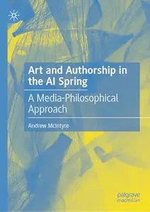

---

**Time:** 20:04:32 (Asia/Tehran)  
**Blog:** hill0  

**Title:** A Brief Guide to Optical Spectroscopy of Trivalent Rare Earth Ions in Glasses  

**Details:** English | 2026 | ISBN: 3032185009 | 150 Pages | PDF EPUB (True) | 31 MB  

**Link:** http://zavat.pw/ebooks/3032185009.html  

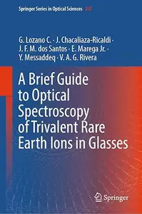

---

**Time:** 20:04:32 (Asia/Tehran)  
**Blog:** hill0  

**Title:** Food, Plants, Remedies and Healing Practices  

**Details:** English | 2026 | ISBN: 3032177650 | 352 Pages | EPUB (True) | 28 MB  

**Link:** http://zavat.pw/ebooks/3032177650E.html  

---

**Time:** 20:04:32 (Asia/Tehran)  
**Blog:** hill0  

**Title:** The Biocultural City as a Utopia or the Future Reality?  

**Details:** English | 2026 | ISBN: 3032175836 | 292 Pages | PDF (True) | 12 MB  

**Link:** http://zavat.pw/ebooks/3032175836.html  

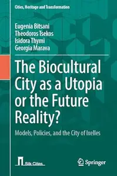

---

**Time:** 20:04:32 (Asia/Tehran)  
**Blog:** hill0  

**Title:** Frankfurter Allgemeine Zeitung - 2 Juni 2026  

**Details:** Deutsch | 42 pages | True PDF | 70 MB  

**Link:** http://zavat.pw/newspapers/FAZ-020626.html  

---

**Time:** 20:04:32 (Asia/Tehran)  
**Blog:** hill0  

**Title:** Transgenerational Toxicology in Caenorhabditis elegans  

**Details:** English | 2026 | ISBN: 9819213886 | 277 Pages | PDF (True) | 64 MB  

**Link:** http://zavat.pw/ebooks/9819213886.html  

---

**Time:** 20:04:32 (Asia/Tehran)  
**Blog:** hill0  

**Title:** TPRM-Driven Supply Chain Cybersecurity  

**Details:** English | 2026 | ISBN: 1806708116 | 110 Pages | PDF (True) | 15 MB  

**Link:** http://zavat.pw/ebooks/1806708116p.html  

---

**Time:** 20:04:32 (Asia/Tehran)  
**Blog:** hill0  

**Title:** Offensive Automotive Cybersecurity  

**Details:** English | 2026 | ISBN: 1836648634 | 564 Pages | PDF (True) | 52 MB  

**Link:** http://zavat.pw/ebooks/1836648634p.html  

---

**Time:** 20:04:32 (Asia/Tehran)  
**Blog:** hill0  

**Title:** Building-Construction Design – From Principle to Detail: Volume 2 ― Conception  

**Details:** English | 2026 | ISBN: 3662710056 | 948 Pages | PDF (True) | 266 MB  

**Link:** http://zavat.pw/ebooks/3662710056.html  

---

**Time:** 20:04:32 (Asia/Tehran)  
**Blog:** hill0  

**Title:** Deep Learning in Cardiovascular Health  

**Details:** English | 2026 | ISBN: 3032124697 | 267 Pages | PDF EPUB (True) | 32 MB  

**Link:** http://zavat.pw/ebooks/3032124697.html  

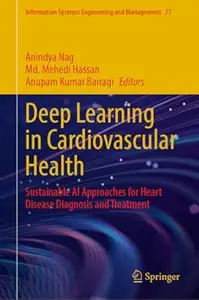

---

**Time:** 20:04:32 (Asia/Tehran)  
**Blog:** hill0  

**Title:** Diffusion of Neutrons in Nuclear Reactors  

**Details:** English | 2026 | ISBN: 3032050871 | 387 Pages | PDF EPUB (True) | 77 MB  

**Link:** http://zavat.pw/ebooks/3032050871.html  

---

**Time:** 20:04:32 (Asia/Tehran)  
**Blog:** hill0  

**Title:** Numerical Solutions to Partial Differential Equations with Finite Difference Methods  

**Details:** English | 2026 | ISBN: 9819555620 | 472 Pages | PDF EPUB (True) | 34 MB  

**Link:** http://zavat.pw/ebooks/9819555620.html  

---

**Time:** 20:04:32 (Asia/Tehran)  
**Blog:** hill0  

**Title:** Semantic Communications  

**Details:** English | 2026 | ISBN: 3032110041 | 203 Pages | PDF EPUB (True) | 28 MB  

**Link:** http://zavat.pw/ebooks/3032110041.html  

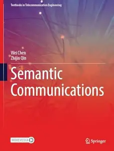

---

**Time:** 20:04:32 (Asia/Tehran)  
**Blog:** hill0  

**Title:** Exploring Computational Geometry  

**Details:** English | 2026 | ISBN: 3032063922 | 454 Pages | PDF (True) | 20 MB  

**Link:** http://zavat.pw/ebooks/3032063922.html  

---

**Time:** 20:04:32 (Asia/Tehran)  
**Blog:** hill0  

**Title:** Introduction to Numerical Mathematics  

**Details:** English | 2026 | ISBN: 3662725452 | 539 Pages | PDF EPUB (True) | 75 MB  

**Link:** http://zavat.pw/ebooks/3662725452.html  

---

**Time:** 20:04:32 (Asia/Tehran)  
**Blog:** crazy-slim  

**Title:** Mece Magazine - June 2026  

**Details:** English | 96 pages | True PDF | 168.3 MB  

**Link:** http://zavat.pw/magazines/MeceMagazineJune2026-95020.html  

---

**Time:** 20:04:32 (Asia/Tehran)  
**Blog:** crazy-slim  

**Title:** Goodfellas Men's Magazine - June 2026  

**Details:** English | 50 pages | True PDF | 32.2 MB  

**Link:** http://zavat.pw/magazines/GoodfellasMensMagazineJune2026-31344.html  

---

**Time:** 20:04:32 (Asia/Tehran)  
**Blog:** crazy-slim  

**Title:** Milieu - Summer 2026  

**Details:** English | 156 pages | True PDF | 89.3 MB  

**Link:** http://zavat.pw/magazines/MilieuSummer2026-95129.html  

---

**Time:** 20:04:32 (Asia/Tehran)  
**Blog:** crazy-slim  

**Title:** Women Fitness India - June 2026  

**Details:** English | 46 pages | True PDF | 76.6 MB  

**Link:** http://zavat.pw/magazines/WomenFitnessIndiaJune2026-60876.html  

---

**Time:** 20:04:32 (Asia/Tehran)  
**Blog:** crazy-slim  

**Title:** PleinAir Magazine - June-July 2026  

**Details:** English | 124 pages | True PDF | 90.6 MB  

**Link:** http://zavat.pw/magazines/PleinAirMagazineJuneJuly2026-15063.html  

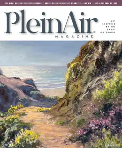

---

**Time:** 20:04:32 (Asia/Tehran)  
**Blog:** crazy-slim  

**Title:** Old Bike Australasia - Issue 129 2026  

**Details:** English | 116 pages | True PDF | 81.3 MB  

**Link:** http://zavat.pw/magazines/OldBikeAustralasiaIssue1292026-04898.html  

---

**Time:** 20:04:32 (Asia/Tehran)  
**Blog:** crazy-slim  

**Title:** Antiques to Vintage & Everything In Between - Winter 2026  

**Details:** English | 120 pages | True PDF | 58.9 MB  

**Link:** http://zavat.pw/magazines/AntiquestoVintageEverythingInBetweenWinter2026-24062.html  

---

**Time:** 20:04:32 (Asia/Tehran)  
**Blog:** crazy-slim  

**Title:** Sound + Image - Issue 367 2026  

**Details:** English | 100 pages | True PDF | 143.4 MB  

**Link:** http://zavat.pw/magazines/SoundImageIssue3672026-33179.html  

---

**Time:** 20:04:32 (Asia/Tehran)  
**Blog:** crazy-slim  

**Title:** Poetry - June 2026  

**Details:** English | 90 pages | True PDF | 7.8 MB  

**Link:** http://zavat.pw/magazines/PoetryJune2026-41548.html  

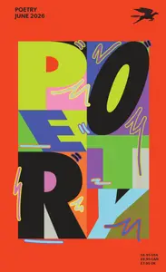

---

**Time:** 20:04:32 (Asia/Tehran)  
**Blog:** crazy-slim  

**Title:** Gripped - June-July 2026  

**Details:** English | 68 pages | True PDF | 38.0 MB  

**Link:** http://zavat.pw/magazines/GrippedJuneJuly2026-66334.html  

---

**Time:** 20:04:32 (Asia/Tehran)  
**Blog:** crazy-slim  

**Title:** The Absolute Sound - July-August 2026  

**Details:** English | 142 pages | True PDF | 54.6 MB  

**Link:** http://zavat.pw/magazines/TheAbsoluteSoundJulyAugust2026-72216.html  

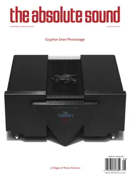

---

**Time:** 20:04:32 (Asia/Tehran)  
**Blog:** crazy-slim  

**Title:** Nashville Lifestyles Magazine - June 2026  

**Details:** English | 108 pages | True PDF | 63.0 MB  

**Link:** http://zavat.pw/magazines/NashvilleLifestylesMagazineJune2026-13266.html  

---

**Time:** 20:04:32 (Asia/Tehran)  
**Blog:** crazy-slim  

**Title:** The American Scholar - Summer 2026  

**Details:** English | 132 pages | True PDF | 22.0 MB  

**Link:** http://zavat.pw/magazines/TheAmericanScholarSummer2026-38599.html  

---

**Time:** 20:04:32 (Asia/Tehran)  
**Blog:** crazy-slim  

**Title:** Naples Illustrated - June 2026  

**Details:** English | 116 pages | True PDF | 57.2 MB  

**Link:** http://zavat.pw/magazines/NaplesIllustratedJune2026-03101.html  

---

**Time:** 20:04:32 (Asia/Tehran)  
**Blog:** crazy-slim  

**Title:** India Today - 8 June 2026  

**Details:** English | 192 pages | True PDF | 91.6 MB  

**Link:** http://zavat.pw/magazines/IndiaToday8June2026-78865.html  

---

**Time:** 14:06:54 (Asia/Tehran)  
**Blog:** yoyoloit  

**Title:** American Elegy: Reflections on 250 Years of the Dis-United States of America  

**Details:** English | 2026 | ISBN: 1632461803 | 260 pages | True EPUB | 3.54 MB  

**Link:** http://zavat.pw/ebooks/1632461803.html  

---

**Time:** 14:06:54 (Asia/Tehran)  
**Blog:** yoyoloit  

**Title:** Cybernetic System Design for a Complex World: The Variety Calculus  

**Details:** English | 2026 | ISBN: 1041166249 | 244 pages | True PDF EPUB | 7.15 MB  

**Link:** http://zavat.pw/ebooks/1041166249.html  

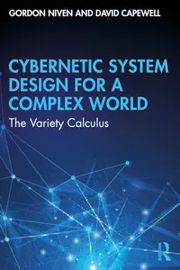

---

**Time:** 14:06:54 (Asia/Tehran)  
**Blog:** yoyoloit  

**Title:** Getting to Go!: Lessons from an Entrepreneur and CPA About Starting a Business from Scratch  

**Details:** English | 2026 | ISBN: 1969935189 | 186 pages | True EPUB | 3.56 MB  

**Link:** http://zavat.pw/ebooks/1969935189.html  

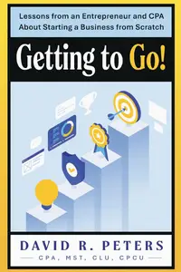

---

**Time:** 14:06:54 (Asia/Tehran)  
**Blog:** yoyoloit  

**Title:** The Remarkable Life Deck: A Ten-Year Plan for Achieving Your Dreams  

**Details:** English | 2026 | ISBN: 1797211161 | 80 pages | True EPUB | 46.12 MB  

**Link:** http://zavat.pw/ebooks/1797211161.html  

---

**Time:** 14:06:54 (Asia/Tehran)  
**Blog:** IrGens  

**Title:** Relegated: One American's Pints-and-Pies Journey from the Top to the Bottom of English Football  

**Details:** English | May 19, 2026 | ISBN: 1668066769, 9781668066782 | True EPUB | 240 pages | 5.96 MB  

**Link:** http://zavat.pw/ebooks/1668066769.html  

---

**Time:** 14:06:54 (Asia/Tehran)  
**Blog:** IrGens  

**Title:** The Thousand Crimes of Ming Tsu  

**Details:** English | June 1, 2021 | ISBN: 0316542156 | True EPUB | 288 pages | 2.3 MB  

**Link:** http://zavat.pw/ebooks/0316542156.html  

---

**Time:** 14:06:54 (Asia/Tehran)  
**Blog:** IrGens  

**Title:** Babylon, South Dakota: A Novel  

**Details:** English | May 26, 2026 | ISBN: 0316576271 | True EPUB | 336 pages | 1.4 MB  

**Link:** http://zavat.pw/ebooks/0316576271.html  

---

**Time:** 14:06:54 (Asia/Tehran)  
**Blog:** IrGens  

**Title:** God Forgives, Brothers Don't: The Long March of Military Education and the Making of American Manhood  

**Details:** English | May 19, 2026 | ISBN: 1668087197, 9781668087213 | True EPUB | 352 pages | 2.7 MB  

**Link:** http://zavat.pw/ebooks/1668087197.html  

---

**Time:** 14:06:54 (Asia/Tehran)  
**Blog:** IrGens  

**Title:** Dead Weight  

**Details:** English | May 26, 2026 | ISBN: 1250329299 | True EPUB | 160 pages | 1.6 MB  

**Link:** http://zavat.pw/ebooks/1250329299.html  

---

**Time:** 14:06:54 (Asia/Tehran)  
**Blog:** IrGens  

**Title:** Night Objects: A Novel  

**Details:** English | May 26, 2026 | ISBN: 1538775875 | True EPUB | 384 pages | 2.6 MB  

**Link:** http://zavat.pw/ebooks/1538775875.html  

---

**Time:** 14:06:54 (Asia/Tehran)  
**Blog:** IrGens  

**Title:** Ode to the Half-Broken  

**Details:** English | May 26, 2026 | ISBN: 0756419581 | True EPUB | 416 pages | 2 MB  

**Link:** http://zavat.pw/ebooks/0756419581.html  

---

**Time:** 14:06:54 (Asia/Tehran)  
**Blog:** IrGens  

**Title:** Red Pill Politics: Demystifying Today’s Far Right  

**Details:** English | May 19, 2026 | ISBN: 1620978512, 9781620979112 | True EPUB | 240 pages | 0.6 MB  

**Link:** http://zavat.pw/ebooks/1620978512.html  

---

**Time:** 14:06:54 (Asia/Tehran)  
**Blog:** IrGens  

**Title:** Dream Road to Pan America: A Century in Pursuit of the World's Longest Highway  

**Details:** English | May 12, 2026 | ISBN: 0520416937, 9780520416949 | True EPUB | 376 pages | 7.6 MB  

**Link:** http://zavat.pw/ebooks/0520416937.html  

---

**Time:** 14:06:54 (Asia/Tehran)  
**Blog:** IrGens  

**Title:** Fight Ready: An MMA Coach’s Guide to Losing Weight, Getting Strong, and Kicking Ass  

**Details:** English | May 19, 2026 | ISBN: 1250378001, 9781250378019 | True EPUB | 336 pages | 17.4 MB  

**Link:** http://zavat.pw/ebooks/1250378001.html  

---

**Time:** 14:06:54 (Asia/Tehran)  
**Blog:** IrGens  

**Title:** Pretend You're Dead and I Carry You: A Novel  

**Details:** English | May 26, 2026 | ISBN: 1324097205 | True EPUB | 336 pages | 2.6 MB  

**Link:** http://zavat.pw/ebooks/1324097205.html  

---

**Time:** 14:06:54 (Asia/Tehran)  
**Blog:** AvaxGenius  

**Title:** Digital Technologies and Applications: Proceedings of ICDTA'23, Fez, Morocco, Volume 1 (Reopst)  

**Details:** English | PDF (True) | 2023 | 1038 Pages | ISBN : 303129856X | 99.8 MB  

**Link:** http://zavat.pw/ebooks/36031295856X.html  

---

**Time:** 14:06:54 (Asia/Tehran)  
**Blog:** AvaxGenius  

**Title:** Immersive Analytics (Repost)  

**Details:** English | PDF | 2018 | 365 Pages | ISBN : 3030013871 | 141.3 MB  

**Link:** http://zavat.pw/ebooks/307300138761.html  

---

**Time:** 14:06:54 (Asia/Tehran)  
**Blog:** AvaxGenius  

**Title:** Alfalfa and Alfalfa Improvement (Repost)  

**Details:** English | PDF | 1988 | 1099 Pages | ISBN : 089118094X | 194.1 MB  

**Link:** http://zavat.pw/ebooks/08961180946X.html  

---

**Time:** 14:06:54 (Asia/Tehran)  
**Blog:** AvaxGenius  

**Title:** Placentation in Mammals: Tribute to E.C. Amoroso’s Lifetime Contributions to Viviparity (Repost)  

**Details:** English | PDF,EPUB | 2021 | 261 Pages | ISBN : 3030773590 | 138.1 MB  

**Link:** http://zavat.pw/ebooks/306307473590.html  

---

**Time:** 14:06:54 (Asia/Tehran)  
**Blog:** AvaxGenius  

**Title:** Rethinking the Security of Machine Learning in Malware Detection  

**Details:** English | PDF(True) | 2025 | 195 Pages | ISBN : 9789465151304 | 13.3 MB  

**Link:** http://zavat.pw/ebooks/9789465151304.html  

---

**Time:** 14:06:54 (Asia/Tehran)  
**Blog:** AvaxGenius  

**Title:** Commutative algebra and symmetric cryptography  

**Details:** English | PDF(True) | 2025 | 125 Pages | ISBN : 9789465151472 | 3.4 MB  

**Link:** http://zavat.pw/ebooks/9789465151472.html  

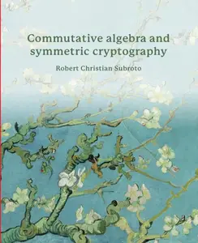

---

**Time:** 14:06:54 (Asia/Tehran)  
**Blog:** AvaxGenius  

**Title:** Guiding Automated Theorem Proving with Machine Learning  

**Details:** English | PDF(True) | 2025 | 157 Pages | ISBN : 9789465150499 | 11.3 MB  

**Link:** http://zavat.pw/ebooks/9789465150499.html  

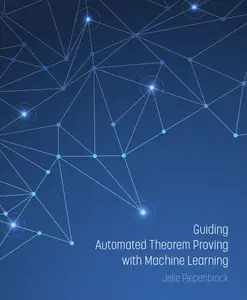

---

**Time:** 14:06:54 (Asia/Tehran)  
**Blog:** AvaxGenius  

**Title:** Operator System Perspectives at Truncated Noncommutative Geometry  

**Details:** English | PDF (True) | 2025 | 145 Pages | ISBN : 9789465151496 | 1.9 MB  

**Link:** http://zavat.pw/ebooks/9789465151496.html  

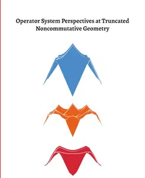

---

**Time:** 14:06:54 (Asia/Tehran)  
**Blog:** AvaxGenius  

**Title:** Sheaves on Stacky Curves  

**Details:** English | PDF (True) | 2025 | 175 Pages | ISBN : 9789465151687 | 4.4 MB  

**Link:** http://zavat.pw/ebooks/9789465151687.html  

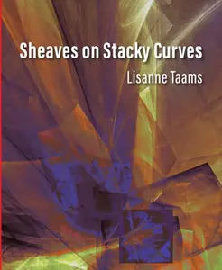

---

**Time:** 14:06:54 (Asia/Tehran)  
**Blog:** AvaxGenius  

**Title:** Uncertainty Quantification of Machine Learning Models  

**Details:** English | PDF (True) | 2025 | 227 Pages | ISBN : 9789465150475 | 4.7 MB  

**Link:** http://zavat.pw/ebooks/9789465150475.html  

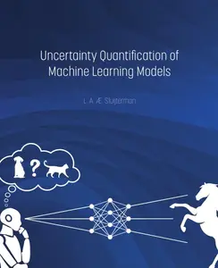

---

**Time:** 14:06:54 (Asia/Tehran)  
**Blog:** AvaxGenius  

**Title:** Number Fields  

**Details:** English | PDF (True) | 2023 | 587 Pages | ISBN : 9493296032 | 4.8 MB  

**Link:** http://zavat.pw/ebooks/9493296032.html  

---

**Time:** 14:06:54 (Asia/Tehran)  
**Blog:** AvaxGenius  

**Title:** Dioptrice  

**Details:** English | PDF (True) | 2025 | 178 Pages | ISBN : 9465150703 | 5.8 MB  

**Link:** http://zavat.pw/ebooks/9465150703.html  

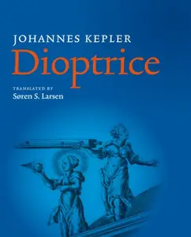

---

**Time:** 14:06:54 (Asia/Tehran)  
**Blog:** AvaxGenius  

**Title:** Flight Training - June 2026  

**Details:** English | True PDF | 60 Pages | 38.6 MB  

**Link:** http://zavat.pw/magazines/FlightTrainingJune2026.html  

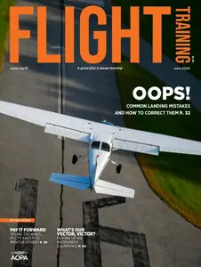

---

**Time:** 14:06:54 (Asia/Tehran)  
**Blog:** AvaxGenius  

**Title:** College Algebra & Trigonometry  

**Details:** English | PDF | 2019 | 558 Pages | ISBN : N/A | 2.1 MB  

**Link:** http://zavat.pw/ebooks/College_Algebra_Trigonometry.html  

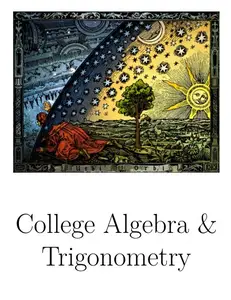

---

**Time:** 14:06:54 (Asia/Tehran)  
**Blog:** AvaxGenius  

**Title:** Ontohackers: Radical Movement Philosophy in the Age of Extinctions and Algorithms, Part III: Metahistories of Movement:  

**Details:** English | PDF (True) | 2025 | 193 Pages | ISBN : 1685712827 | 18.7 MB  

**Link:** http://zavat.pw/ebooks/1685712827.html  

---

**Time:** 14:06:54 (Asia/Tehran)  
**Blog:** hill0  

**Title:** Learn QGIS: Techniques for efficient spatial analysis  

**Details:** English | 2026 | ISBN: 9781836203315 | 545 Pages | EPUB (True) | 88 MB  

**Link:** http://zavat.pw/ebooks/9781836203315.html  

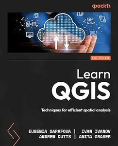

---

**Time:** 14:06:54 (Asia/Tehran)  
**Blog:** hill0  

**Title:** Praxishandbuch Digitales Management: Band 1  

**Details:** Deutsch | 2026 | ISBN: 3658495804 | 777 Pages | PDF (True) | 18 MB  

**Link:** http://zavat.pw/ebooks/3658495804.html  

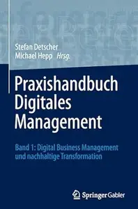

---

**Time:** 14:06:54 (Asia/Tehran)  
**Blog:** hill0  

**Title:** Handbuch Lokale Integrationspolitik, 2. Auflage  

**Details:** Deutsch | 2026 | ISBN: 3658507756 | 1115 Pages | PDF (True) | 26 MB  

**Link:** http://zavat.pw/ebooks/3658507756.html  

---

**Time:** 14:06:54 (Asia/Tehran)  
**Blog:** hill0  

**Title:** Das Puzzle EUropa  

**Details:** Deutsch | 2026 | ISBN: 365851292X | 526 Pages | PDF (True) | 9 MB  

**Link:** http://zavat.pw/ebooks/365851292X.html  

---

**Time:** 14:06:54 (Asia/Tehran)  
**Blog:** hill0  

**Title:** Digitale Technologien verstehen und gestalten  

**Details:** Deutsch | 2026 | ISBN: 3658514175 | 265 Pages | PDF (True) | 7 MB  

**Link:** http://zavat.pw/ebooks/3658514175.html  

---

**Time:** 14:06:54 (Asia/Tehran)  
**Blog:** hill0  

**Title:** Empathisch führen  

**Details:** Deutsch | 2026 | ISBN: 3662733668 | 110 Pages | PDF (True) | 2.3 MB  

**Link:** http://zavat.pw/ebooks/3662733668.html  

---

**Time:** 14:06:54 (Asia/Tehran)  
**Blog:** hill0  

**Title:** Eigene Praxis, eigene Wege  

**Details:** Deutsch | 2026 | ISBN: 3662728877 | 168 Pages | PDF (True) | 6 MB  

**Link:** http://zavat.pw/ebooks/3662728877.html  

---

**Time:** 14:06:54 (Asia/Tehran)  
**Blog:** hill0  

**Title:** Authentisch kommunizieren: Man selbst sein, um zu überzeugen  

**Details:** Deutsch | 2026 | ISBN: 3662728176 | 133 Pages | PDF (True) | 5 MB  

**Link:** http://zavat.pw/ebooks/3662728176.html  

---

**Time:** 14:06:54 (Asia/Tehran)  
**Blog:** hill0  

**Title:** Technische Mechanik 6 - Aeromechanik  

**Details:** Deutsch | 2026 | ISBN: 3662729288 | 810 Pages | PDF (True) | 56 MB  

**Link:** http://zavat.pw/ebooks/3662729288.html  

---

**Time:** 14:06:54 (Asia/Tehran)  
**Blog:** hill0  

**Title:** Fermentation: Kimchi, Kombucha & Co.  

**Details:** Deutsch | 2026 | ISBN: 383389881X | 280 Pages | EPUB (True) | 16 MB  

**Link:** http://zavat.pw/ebooks/383389881X.html  

---

**Time:** 14:06:54 (Asia/Tehran)  
**Blog:** hill0  

**Title:** Hybridization of Renewable Energy  

**Details:** English | 2026 | ISBN: 1032989661 | 265 Pages | PDF EPUB (True) | 39 MB  

**Link:** http://zavat.pw/ebooks/1032989661.html  

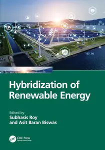

---

**Time:** 14:06:54 (Asia/Tehran)  
**Blog:** hill0  

**Title:** Operating Room Leadership and Perioperative Practice Management (3rd Edition)  

**Details:** English | 2026 | ISBN: 1009467409 | 496 Pages | PDF | 12 MB  

**Link:** http://zavat.pw/ebooks/1009467409.html  

---

**Time:** 14:06:54 (Asia/Tehran)  
**Blog:** hill0  

**Title:** Kaplan and Sadock's Comprehensive Text of Psychiatry, 11th Edition  

**Details:** English | 2025 | ISBN: 1975175735 | 16525 Pages | PDF | 116 MB  

**Link:** http://zavat.pw/ebooks/1975175735p.html  

---

**Time:** 14:06:54 (Asia/Tehran)  
**Blog:** hill0  

**Title:** Roman Rural Archaeology  

**Details:** English | 2026 | ISBN: 1316510999 | 679 Pages | PDF | 30 MB  

**Link:** http://zavat.pw/ebooks/1316510999.html  

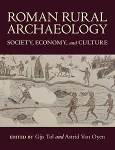

---

**Time:** 14:06:54 (Asia/Tehran)  
**Blog:** hill0  

**Title:** Bombs and Barbed Wire: One Man's Great Escape  

**Details:** English | 2021 | ISBN: 036937391X | 416 Pages | EPUB (True) | 5 MB  

**Link:** http://zavat.pw/ebooks/036937391X.html  

---

**Time:** 14:06:54 (Asia/Tehran)  
**Blog:** crazy-slim  

**Title:** Hartford Courant - 1 June 2026  

**Details:** English | 24 pages | True PDF | 45.1 MB  

**Link:** http://zavat.pw/newspapers/HartfordCourant1June2026-11777.html  

---

**Time:** 14:06:54 (Asia/Tehran)  
**Blog:** crazy-slim  

**Title:** Los Angeles Times - 1 June 2026  

**Details:** English | 32 pages | True PDF | 16.7 MB  

**Link:** http://zavat.pw/newspapers/LosAngelesTimes1June2026-07703.html  

---

**Time:** 14:06:54 (Asia/Tehran)  
**Blog:** crazy-slim  

**Title:** The Boston Globe - 1 June 2026  

**Details:** English | 32 pages | True PDF | 6.8 MB  

**Link:** http://zavat.pw/newspapers/TheBostonGlobe1June2026-60346.html  

---

**Time:** 14:06:54 (Asia/Tehran)  
**Blog:** crazy-slim  

**Title:** The Washington Post - June 1, 2026  

**Details:** English | 44 pages | True PDF | 22.3 MB  

**Link:** http://zavat.pw/newspapers/TheWashingtonPostJune12026-26764.html  

---

**Time:** 14:06:54 (Asia/Tehran)  
**Blog:** crazy-slim  

**Title:** Sun Journal - 1 June 2026  

**Details:** English | 18 pages | True PDF | 30.9 MB  

**Link:** http://zavat.pw/newspapers/SunJournal1June2026-59021.html  

---

**Time:** 14:06:54 (Asia/Tehran)  
**Blog:** crazy-slim  

**Title:** Chicago Sun-Times - 1 June 2026  

**Details:** English | 44 pages | True PDF | 63.8 MB  

**Link:** http://zavat.pw/newspapers/ChicagoSunTimes1June2026-62451.html  

---

**Time:** 14:06:54 (Asia/Tehran)  
**Blog:** crazy-slim  

**Title:** France-Antilles Guadeloupe - 1 Juin 2026  

**Details:** Français | 36 pages | PDF | 41.4 MB  

**Link:** http://zavat.pw/newspapers/FranceAntillesGuadeloupe1Juin2026-53827.html  

---

**Time:** 14:06:54 (Asia/Tehran)  
**Blog:** crazy-slim  

**Title:** The Philadelphia Inquirer - June 1, 2026  

**Details:** English | 28 pages | True PDF | 34.6 MB  

**Link:** http://zavat.pw/newspapers/ThePhiladelphiaInquirerJune12026-36389.html  

---

**Time:** 14:06:54 (Asia/Tehran)  
**Blog:** crazy-slim  

**Title:** The Morning Call Morning Edition - 1 June 2026  

**Details:** English | 24 pages | True PDF | 17.8 MB  

**Link:** http://zavat.pw/newspapers/TheMorningCallMorningEdition1June2026-35645.html  

---

**Time:** 14:06:54 (Asia/Tehran)  
**Blog:** crazy-slim  

**Title:** The Dallas Morning News - June 1, 2026  

**Details:** English | 30 pages | True PDF | 15.6 MB  

**Link:** http://zavat.pw/newspapers/TheDallasMorningNewsJune12026-77380.html  

---

**Time:** 14:06:54 (Asia/Tehran)  
**Blog:** crazy-slim  

**Title:** Sun Sentinel - 1 June 2026  

**Details:** English | 28 pages | True PDF | 21.5 MB  

**Link:** http://zavat.pw/newspapers/SunSentinel1June2026-45958.html  

---

**Time:** 14:06:54 (Asia/Tehran)  
**Blog:** crazy-slim  

**Title:** The Beacon-News - 1 June 2026  

**Details:** English | 16 pages | True PDF | 9.8 MB  

**Link:** http://zavat.pw/newspapers/TheBeaconNews1June2026-13128.html  

---

**Time:** 14:06:54 (Asia/Tehran)  
**Blog:** crazy-slim  

**Title:** Post-Tribune - 1 June 2026  

**Details:** English | 16 pages | True PDF | 8.8 MB  

**Link:** http://zavat.pw/newspapers/PostTribune1June2026-75246.html  

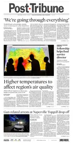

---

**Time:** 14:06:54 (Asia/Tehran)  
**Blog:** crazy-slim  

**Title:** Portland Press Herald - 1 June 2026  

**Details:** English | 18 pages | True PDF | 19.5 MB  

**Link:** http://zavat.pw/newspapers/PortlandPressHerald1June2026-92977.html  

---

**Time:** 14:06:54 (Asia/Tehran)  
**Blog:** crazy-slim  

**Title:** Orlando Sentinel - 1 June 2026  

**Details:** English | 25 pages | True PDF | 19.4 MB  

**Link:** http://zavat.pw/newspapers/OrlandoSentinel1June2026-97259.html  

---

**Time:** 08:53:40 (Asia/Tehran)  
**Blog:** IrGens  

**Title:** The Hearing Trumpet (Penguin Modern Classics)  

**Details:** English | 29 Sept. 2005 | ISBN: 0141187999, 9781837312627 | True EPUB | 176 pages | 15.2 MB  

**Link:** http://zavat.pw/ebooks/0141187999.html  

---

**Time:** 08:53:40 (Asia/Tehran)  
**Blog:** IrGens  

**Title:** The Unicorn Hunters: A Novel  

**Details:** English | June 2, 2026 | ISBN: 0593128281, 9780593128299 | True EPUB | 368 pages | 6.96 MB  

**Link:** http://zavat.pw/ebooks/0593128281.html  

---

**Time:** 08:53:40 (Asia/Tehran)  
**Blog:** IrGens  

**Title:** The Savage Landscape: How We Made the Wilderness  

**Details:** English | 7 May 2026 | ISBN: 0008686521, 9780008686543 | True EPUB | 448 pages | 33.3 MB  

**Link:** http://zavat.pw/ebooks/0008686521.html  

---

**Time:** 08:53:40 (Asia/Tehran)  
**Blog:** IrGens  

**Title:** Everything I Wish I'd Known about Anxiety: A Roadmap Back to Yourself  

**Details:** English | 16 April 2026 | ISBN: 1804584088, 9781804584095 | True EPUB | 288 pages | 1.6 MB  

**Link:** http://zavat.pw/ebooks/1804584088.html  

---

**Time:** 08:53:40 (Asia/Tehran)  
**Blog:** IrGens  

**Title:** You Thought I Was Dead: My Life of Celebrities, Sex, and Champagne  

**Details:** English | May 5, 2026 | ISBN: 9798895653234, 9798895653241 | True EPUB | 320 pages | 22.3 MB  

**Link:** http://zavat.pw/ebooks/9798895653234.html  

---

**Time:** 08:53:40 (Asia/Tehran)  
**Blog:** IrGens  

**Title:** The Vivisectors: A Novel  

**Details:** English | May 26, 2026 | ISBN: 0374619298 | True EPUB | 288 pages | 1.2 MB  

**Link:** http://zavat.pw/ebooks/0374619298.html  

---

**Time:** 08:53:40 (Asia/Tehran)  
**Blog:** IrGens  

**Title:** Neurodegenerative Diseases: Pathologies, Mechanisms, and Treatment Strategies  

**Details:** English | May 27, 2026 | ISBN: 1032870249 | True EPUB | 184 pages | 11 MB  

**Link:** http://zavat.pw/ebooks/1032870249-epub.html  

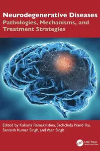

---

**Time:** 08:53:40 (Asia/Tehran)  
**Blog:** IrGens  

**Title:** Banton of Paramount: Haute Couture in Hollywood's Golden Age  

**Details:** English | May 19, 2026 | ISBN: 1493085026, 9781493094424 | True EPUB | 352 pages | 29.9 MB  

**Link:** http://zavat.pw/ebooks/1493085026.html  

---

**Time:** 08:53:40 (Asia/Tehran)  
**Blog:** IrGens  

**Title:** Aerth  

**Details:** English | January 25, 2025 | ISBN: 1739570782 | True EPUB | 180 pages | 2.4 MB  

**Link:** http://zavat.pw/ebooks/1739570782.html  

---

**Time:** 08:53:40 (Asia/Tehran)  
**Blog:** IrGens  

**Title:** What Are the Odds?: A Statistical Guide to Certainty in an Uncertain World  

**Details:** English | April 14, 2026 | ISBN: 0674296362, 9780674303904 | True EPUB | 496 pages | 9.2 MB  

**Link:** http://zavat.pw/ebooks/0674296362-epub.html  

---

**Time:** 08:53:40 (Asia/Tehran)  
**Blog:** IrGens  

**Title:** Energy, Soul-Connecting and Awakening Consciousness: Psychotherapy in a New Paradigm  

**Details:** English | July 30, 2024 | ISBN: 1913494675 | True EPUB | 276 pages | 1.9 MB  

**Link:** http://zavat.pw/ebooks/1913494675.html  

---

**Time:** 08:53:40 (Asia/Tehran)  
**Blog:** IrGens  

**Title:** Beyond the Quantum: A Quest for the Origin and Hidden Meaning of Quantum Mechanics [Audiobook] (Repost)  

**Details:** English | October 14, 2025 | ASIN: B0F8KBWYQ5 | M4B@64 kbps | 10h 41m | 278 MB  

**Link:** http://zavat.pw/audiobooks/B0F8KBWYQ5.html  

---

**Time:** 08:53:40 (Asia/Tehran)  
**Blog:** AvaxGenius  

**Title:** War Machine  

**Details:** English | PDF (True) | 2026 | 125 Pages | ISBN : 1685713211 | 128.8 MB  

**Link:** http://zavat.pw/ebooks/1685713211.html  

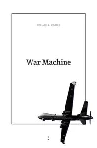

---

**Time:** 08:53:40 (Asia/Tehran)  
**Blog:** AvaxGenius  

**Title:** Kayfabe Nation: Professional Wrestling, Donald Trump, and the New Cynicism  

**Details:** English | PDF (True) | 2026 | 265 Pages | ISBN : 1685713122 | 8.9 MB  

**Link:** http://zavat.pw/ebooks/1685713122.html  

---

**Time:** 08:53:40 (Asia/Tehran)  
**Blog:** AvaxGenius  

**Title:** Ecology and Restoration of Red Spruce Ecosystems in the Central and Southern Appalachians  

**Details:** English | PDF EPUB (True) | 2026 | 343 Pages | ISBN : 9783032196163 | 171.1 MB  

**Link:** http://zavat.pw/ebooks/9783032196163.html  

---

**Time:** 08:53:40 (Asia/Tehran)  
**Blog:** AvaxGenius  

**Title:** Sustainability and Science Education: Exploring Roles and Challenges  

**Details:** English | PDF EPUB (True) | 2026 | 304 Pages | ISBN : 9783032244086 | 9.7 MB  

**Link:** http://zavat.pw/ebooks/9783032244086.html  

---

**Time:** 08:53:40 (Asia/Tehran)  
**Blog:** AvaxGenius  

**Title:** Beyond Popular Science  

**Details:** English | PDF (True) | 2026 | 570 Pages | ISBN : 1805118781 | 74.7 MB  

**Link:** http://zavat.pw/ebooks/1805118781.html  

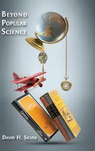

---

**Time:** 08:53:40 (Asia/Tehran)  
**Blog:** AvaxGenius  

**Title:** How to do science: a guide to researching human physiology  

**Details:** English | PDF (True) | 2017 | 184 Pages | ISBN : N/A | 53.6 MB  

**Link:** http://zavat.pw/ebooks/Howtodoscience.html  

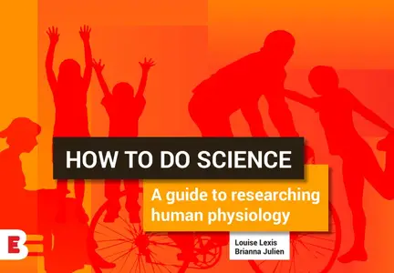

---

**Time:** 08:53:40 (Asia/Tehran)  
**Blog:** AvaxGenius  

**Title:** Don’t Cheat Yourself: Scenarios to clarify collusion confusion  

**Details:** English | PDF (True) | 2023 | 96 Pages | ISBN : N/A | 5.6 MB  

**Link:** http://zavat.pw/ebooks/DontCheatYourself.html  

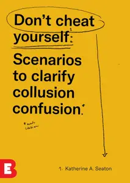

---

**Time:** 08:53:40 (Asia/Tehran)  
**Blog:** AvaxGenius  

**Title:** Modeling, Functions, and Graphs  

**Details:** English | PDF | 2024 | 1330 Pages | ISBN : N/A | 175.7 MB  

**Link:** http://zavat.pw/ebooks/ModelingFunctionsandGraphs.html  

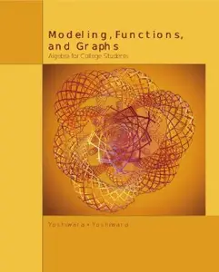

---

**Time:** 08:53:40 (Asia/Tehran)  
**Blog:** AvaxGenius  

**Title:** Applied Discrete Structures: Part 2  Applied Algebra  

**Details:** English | PDF | 2025 | 287 Pages | ISBN : N/A | 3.4 MB  

**Link:** http://zavat.pw/ebooks/Applied_DiscreteStructures_Applied_Algebra.html  

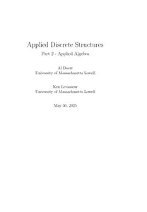

---

**Time:** 08:53:40 (Asia/Tehran)  
**Blog:** AvaxGenius  

**Title:** Applied Discrete Structures: Part 1 Fundamentals  

**Details:** English | PDF | 2025 | 353 Pages | ISBN : N/A | 5.3 MB  

**Link:** http://zavat.pw/ebooks/Applied_Discrete_Structures_Fundamentals.html  

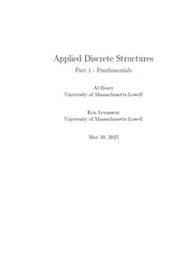

---

**Time:** 08:53:40 (Asia/Tehran)  
**Blog:** AvaxGenius  

**Title:** Applied Discrete Structures  

**Details:** English | PDF | 2017 (Updated 2025) | 588 Pages | ISBN : N/A | 8.4 MB  

**Link:** http://zavat.pw/ebooks/Applied_Discrete_Structures_25.html  

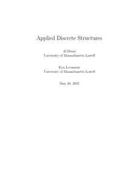

---

**Time:** 08:53:40 (Asia/Tehran)  
**Blog:** AvaxGenius  

**Title:** Business Finance  

**Details:** English | PDF EPUB (True) | 2023 | 153 Pages | ISBN : N/A | 4.6 MB  

**Link:** http://zavat.pw/ebooks/Business__Finance.html  

---

**Time:** 08:53:40 (Asia/Tehran)  
**Blog:** AvaxGenius  

**Title:** Fundamentals of Finance  

**Details:** English | PDF EPUB (True) | 2026 | 77 Pages | ISBN : N/A | 3.3 MB  

**Link:** http://zavat.pw/ebooks/Fundamentals_of__Finance.html  

---

**Time:** 08:53:40 (Asia/Tehran)  
**Blog:** AvaxGenius  

**Title:** Mathematical Reasoning and Investigation  

**Details:** English | PDF EPUB(True) | 2023 | 237 Pages | ISBN : N/A | 32.9 MB  

**Link:** http://zavat.pw/ebooks/Mathematical__Reasoning.html  

---

**Time:** 08:53:40 (Asia/Tehran)  
**Blog:** AvaxGenius  

**Title:** Numerical Optimization and Algorithms, 2nd Edition  

**Details:** English | PDF (True) | 2026 | 394 Pages | ISBN : 3725873585 | 27.6 MB  

**Link:** http://zavat.pw/ebooks/3725873585.html  

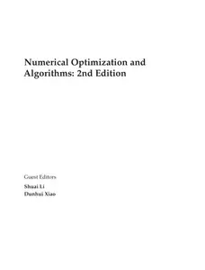

---

**Time:** 08:53:40 (Asia/Tehran)  
**Blog:** crazy-slim  

**Title:** kajak-Magazin - Juli-August 2026  

**Details:** Deutsch | 100 pages | PDF | 131.0 MB  

**Link:** http://zavat.pw/magazines/kajakMagazinJuliAugust2026-07423.html  

---

**Time:** 08:53:40 (Asia/Tehran)  
**Blog:** crazy-slim  

**Title:** Deutsche Welle Edición en español - 1 Junio 2026  

**Details:** Español | 79 pages | PDF | 200.7 MB  

**Link:** http://zavat.pw/newspapers/DeutscheWelleEdici%C3%B3nenespa%C3%B1ol1Junio2026-46405.html  

---

**Time:** 08:53:40 (Asia/Tehran)  
**Blog:** crazy-slim  

**Title:** Weidwerk - Juni 2026  

**Details:** Deutsch | 76 pages | True PDF | 38.6 MB  

**Link:** http://zavat.pw/magazines/WeidwerkJuni2026-61820.html  

---

**Time:** 08:53:40 (Asia/Tehran)  
**Blog:** crazy-slim  

**Title:** Yacht Info - Nr.2 2026  

**Details:** Deutsch | 32 pages | True PDF | 33.4 MB  

**Link:** http://zavat.pw/magazines/YachtInfoNr22026-78002.html  

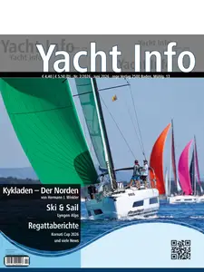

---

**Time:** 08:53:40 (Asia/Tehran)  
**Blog:** crazy-slim  

**Title:** Outdoor - Juli 2026  

**Details:** Deutsch | 140 pages | True PDF | 85.5 MB  

**Link:** http://zavat.pw/magazines/OutdoorJuli2026-91262.html  

---

**Time:** 08:53:40 (Asia/Tehran)  
**Blog:** crazy-slim  

**Title:** Grand Strand Magazine - June July 2026  

**Details:** English | 216 pages | PDF | 197.5 MB  

**Link:** http://zavat.pw/magazines/GrandStrandMagazineJuneJuly2026-54864.html  

---

**Time:** 08:53:40 (Asia/Tehran)  
**Blog:** crazy-slim  

**Title:** Tattoo-Scout - Juni 2026  

**Details:** Deutsch | 100 pages | PDF | 79.1 MB  

**Link:** http://zavat.pw/magazines/TattooScoutJuni2026-88120.html  

---

**Time:** 08:53:40 (Asia/Tehran)  
**Blog:** crazy-slim  

**Title:** RENDSBURGerLEBEN - Juni 2026  

**Details:** Deutsch | 84 pages | True PDF | 19.7 MB  

**Link:** http://zavat.pw/magazines/RENDSBURGerLEBENJuni2026-98003.html  

---

**Time:** 08:53:40 (Asia/Tehran)  
**Blog:** crazy-slim  

**Title:** Pro Zukunft - 1 Juni 2026  

**Details:** Deutsch | 32 pages | True PDF | 11.4 MB  

**Link:** http://zavat.pw/magazines/ProZukunft1Juni2026-11546.html  

---

**Time:** 08:53:40 (Asia/Tehran)  
**Blog:** crazy-slim  

**Title:** Melbourne Wedding & Bride - Issue 41 2026  

**Details:** English | 316 pages | PDF | 199.0 MB  

**Link:** http://zavat.pw/magazines/MelbourneWeddingBrideIssue412026-36296.html  

---

**Time:** 08:53:40 (Asia/Tehran)  
**Blog:** crazy-slim  

**Title:** Neue Energie - Juni 2026  

**Details:** Deutsch | 76 pages | PDF | 58.2 MB  

**Link:** http://zavat.pw/magazines/NeueEnergieJuni2026-24652.html  

---

**Time:** 08:53:40 (Asia/Tehran)  
**Blog:** crazy-slim  

**Title:** MountainBIKE - Juli 2026  

**Details:** Deutsch | 140 pages | True PDF | 85.7 MB  

**Link:** http://zavat.pw/magazines/MountainBIKEJuli2026-73822.html  

---

**Time:** 08:53:40 (Asia/Tehran)  
**Blog:** crazy-slim  

**Title:** Küche+Architektur - Ausgabe 2 2026  

**Details:** Deutsch | 85 pages | True PDF | 36.9 MB  

**Link:** http://zavat.pw/magazines/K%C3%BCcheArchitekturAusgabe22026-52846.html  

---

**Time:** 08:53:40 (Asia/Tehran)  
**Blog:** crazy-slim  

**Title:** KIELerleben - Juni 2026  

**Details:** Deutsch | 100 pages | True PDF | 23.9 MB  

**Link:** http://zavat.pw/magazines/KIELerlebenJuni2026-81728.html  

---

**Time:** 08:53:40 (Asia/Tehran)  
**Blog:** crazy-slim  

**Title:** Garten+Haus - Juni 2026  

**Details:** Deutsch | 100 pages | True PDF | 73.4 MB  

**Link:** http://zavat.pw/magazines/GartenHausJuni2026-64147.html  

---

**Time:** 01:23:56 (Asia/Tehran)  
**Blog:** IrGens  

**Title:** The Wright Brothers  

**Details:** English | May 5, 2015 | ISBN: 1476728747, 9781476728766 | True EPUB | 336 pages | 29.3 MB  

**Link:** http://zavat.pw/ebooks/1476728747-epub.html  

---

**Time:** 01:23:56 (Asia/Tehran)  
**Blog:** IrGens  

**Title:** The Wright Brothers [Audiobook]  

**Details:** English | May 05, 2015 | ASIN: B00TA5MPEU | M4B@64 kbps | 10h 2m | 274 MB  

**Link:** http://zavat.pw/audiobooks/B00TA5MPEU-m4b.html  

---

**Time:** 01:23:56 (Asia/Tehran)  
**Blog:** IrGens  

**Title:** Sleep for Dummies [Audiobook] (Repost)  

**Details:** English | August 26, 2025 | ASIN: B0F71S417Y | M4B@128 kbps | 10h 18m | 567 MB  

**Link:** http://zavat.pw/audiobooks/B0F71S417Y.html  

---

**Time:** 01:23:56 (Asia/Tehran)  
**Blog:** hill0  

**Title:** Integrated Computer Technologies in Mechanical Engineering - 2025, Volume 2  

**Details:** English | 2026 | ISBN: 3032223814 | 517 Pages | PDF (True) | 78 MB  

**Link:** http://zavat.pw/ebooks/3032223814.html  

---

**Time:** 01:23:56 (Asia/Tehran)  
**Blog:** hill0  

**Title:** Digital Heritage and Cultural Tourism  

**Details:** English | 2026 | ISBN: 3032229731 | 160 Pages | PDF (True) | 8 MB  

**Link:** http://zavat.pw/ebooks/3032229731.html  

---

**Time:** 01:23:56 (Asia/Tehran)  
**Blog:** hill0  

**Title:** Vibration Fatigue and Related Topics  

**Details:** English | 2026 | ISBN: 303222392X | 267 Pages | PDF (True) | 22 MB  

**Link:** http://zavat.pw/ebooks/303222392X.html  

---

**Time:** 01:23:56 (Asia/Tehran)  
**Blog:** hill0  

**Title:** Rethinking the University  

**Details:** English | 2026 | ISBN: 3032233844 | 388 Pages | PDF (True) | 13 MB  

**Link:** http://zavat.pw/ebooks/3032233844.html  

---

**Time:** 01:23:56 (Asia/Tehran)  
**Blog:** hill0  

**Title:** Agro-Textiles: Environmental and Ecological Perspectives  

**Details:** English | 2026 | ISBN: 3032134765 | 414 Pages | PDF (True) | 13 MB  

**Link:** http://zavat.pw/ebooks/3032134765.html  

---

**Time:** 01:23:56 (Asia/Tehran)  
**Blog:** hill0  

**Title:** The Pragmatics of Queenship in Shakespeare's Drama  

**Details:** English | 2026 | ISBN: 3032170982 | 220 Pages | PDF (True) | 6 MB  

**Link:** http://zavat.pw/ebooks/3032170982.html  

---

**Time:** 01:23:56 (Asia/Tehran)  
**Blog:** hill0  

**Title:** Stein and Husserl’s Phenomenology of the Social in Ideas II  

**Details:** English | 2026 | ISBN: 3032173388 | 225 Pages | PDF (True) | 9 MB  

**Link:** http://zavat.pw/ebooks/3032173388.html  

---

**Time:** 01:23:56 (Asia/Tehran)  
**Blog:** hill0  

**Title:** Hermeneutics of Law: From Ancients to Contemporaries  

**Details:** English | 2026 | ISBN: 3032186749 | 188 Pages | PDF (True) | 6 MB  

**Link:** http://zavat.pw/ebooks/3032186749.html  

---

**Time:** 01:23:56 (Asia/Tehran)  
**Blog:** hill0  

**Title:** Jacob Bronowski: Selected Poems  

**Details:** English | 2026 | ISBN: 3032195969 | 152 Pages | PDF (True) | 7 MB  

**Link:** http://zavat.pw/ebooks/3032195969.html  

---

**Time:** 00:06:11 (Asia/Tehran)  
**Blog:** IrGens  

**Title:** The American West: History, Myth, and Legacy [TTC Audio]  

**Details:** English | August 18, 2017 | ASIN: B074BCYHGS | M4B@64 kbps | 12h 2m | 435 MB  

**Link:** http://zavat.pw/audiobooks/B074BCYHGS-m4b.html  

---

**Time:** 00:06:11 (Asia/Tehran)  
**Blog:** IrGens  

**Title:** TTC Video - The American West: History, Myth, and Legacy  

**Details:** .MP4, AVC, 1280x720, 30 fps | English, AAC, 2 Ch | 12h 7m | 11.19 GB  

**Link:** http://zavat.pw/ebooks/the-american-west-history-myth-and-legacy.html  

---

**Time:** 00:06:11 (Asia/Tehran)  
**Blog:** IrGens  

**Title:** Stone (Princeton Legacy Library)  

**Details:** English/Russian | March 24, 2026 | ISBN: 0691284563, 9780691196596 | True EPUB | 272 pages | 2.2 MB  

**Link:** http://zavat.pw/ebooks/0691284563.html  

---

**Time:** 00:06:11 (Asia/Tehran)  
**Blog:** IrGens  

**Title:** Why Did the Heavens Not Darken?: ‘The Final Solution’ in History  

**Details:** English | August 21, 2012 | ISBN: 184467777X | True EPUB | 544 pages | 1.5 MB  

**Link:** http://zavat.pw/ebooks/184467777X-epub.html  

---

**Time:** 00:06:11 (Asia/Tehran)  
**Blog:** IrGens  

**Title:** The Overthrow of Colonial Slavery: 1776-1848  

**Details:** English | May 3, 2011 | ISBN: 1844674762, 1844674754 | True EPUB | 576 pages | 3 MB  

**Link:** http://zavat.pw/ebooks/1844674762.html  

---

**Time:** 00:06:11 (Asia/Tehran)  
**Blog:** IrGens  

**Title:** Retrench, Defend, Compete: Securing America's Future Against a Rising China  

**Details:** English | December 15, 2025 | ISBN: 1501784846, 1501784854 | True EPUB | 336 pages | 2 MB  

**Link:** http://zavat.pw/ebooks/1501784846.html  

---

**Time:** 00:06:11 (Asia/Tehran)  
**Blog:** IrGens  

**Title:** Green Gone Wrong: How Our Economy Is Undermining the Environmental Revolution  

**Details:** English | April 20, 2010 | ISBN: 1416572228 | True EPUB | 272 pages | 1.9 MB  

**Link:** http://zavat.pw/ebooks/1416572228-epub.html  

---

**Time:** 00:06:11 (Asia/Tehran)  
**Blog:** IrGens  

**Title:** Flirting for Dummies  

**Details:** English | May 22, 2009 | ISBN: 0470742593 | True EPUB | 288 pages | 7.5 MB  

**Link:** http://zavat.pw/ebooks/0470742593-epub.html  

---

**Time:** 00:06:11 (Asia/Tehran)  
**Blog:** hill0  

**Title:** Human Factors in Cybersecurity  

**Details:** English | 2026 | ISBN: 9781806118335 | 332 Pages | PDF EPUB (True) | 159 MB  

**Link:** http://zavat.pw/ebooks/9781806118335.html  

---

**Time:** 00:06:11 (Asia/Tehran)  
**Blog:** hill0  

**Title:** Agentic AI for Cybersecurity  

**Details:** English | 2026 | ISBN: 0135589851 | 453 Pages | EPUB | 8 MB  

**Link:** http://zavat.pw/ebooks/0135589851.html  

