# Zavat feed - 2026-06-01

---

**Time:** 01:23:56 (Asia/Tehran)  
**Blog:** IrGens  

**Title:** The Wright Brothers  

**Details:** English | May 5, 2015 | ISBN: 1476728747, 9781476728766 | True EPUB | 336 pages | 29.3 MB  

**Link:** http://zavat.pw/ebooks/1476728747-epub.html  

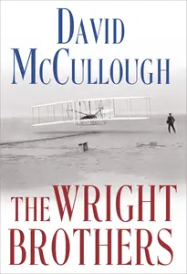

---

**Time:** 01:23:56 (Asia/Tehran)  
**Blog:** IrGens  

**Title:** The Wright Brothers [Audiobook]  

**Details:** English | May 05, 2015 | ASIN: B00TA5MPEU | M4B@64 kbps | 10h 2m | 274 MB  

**Link:** http://zavat.pw/audiobooks/B00TA5MPEU-m4b.html  

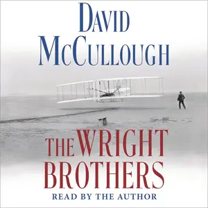

---

**Time:** 01:23:56 (Asia/Tehran)  
**Blog:** IrGens  

**Title:** Sleep for Dummies [Audiobook] (Repost)  

**Details:** English | August 26, 2025 | ASIN: B0F71S417Y | M4B@128 kbps | 10h 18m | 567 MB  

**Link:** http://zavat.pw/audiobooks/B0F71S417Y.html  

---

**Time:** 01:23:56 (Asia/Tehran)  
**Blog:** hill0  

**Title:** Integrated Computer Technologies in Mechanical Engineering - 2025, Volume 2  

**Details:** English | 2026 | ISBN: 3032223814 | 517 Pages | PDF (True) | 78 MB  

**Link:** http://zavat.pw/ebooks/3032223814.html  

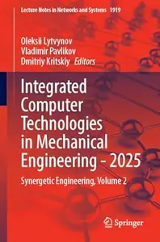

---

**Time:** 01:23:56 (Asia/Tehran)  
**Blog:** hill0  

**Title:** Digital Heritage and Cultural Tourism  

**Details:** English | 2026 | ISBN: 3032229731 | 160 Pages | PDF (True) | 8 MB  

**Link:** http://zavat.pw/ebooks/3032229731.html  

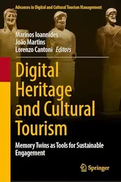

---

**Time:** 01:23:56 (Asia/Tehran)  
**Blog:** hill0  

**Title:** Vibration Fatigue and Related Topics  

**Details:** English | 2026 | ISBN: 303222392X | 267 Pages | PDF (True) | 22 MB  

**Link:** http://zavat.pw/ebooks/303222392X.html  

---

**Time:** 01:23:56 (Asia/Tehran)  
**Blog:** hill0  

**Title:** Rethinking the University  

**Details:** English | 2026 | ISBN: 3032233844 | 388 Pages | PDF (True) | 13 MB  

**Link:** http://zavat.pw/ebooks/3032233844.html  

---

**Time:** 01:23:56 (Asia/Tehran)  
**Blog:** hill0  

**Title:** Agro-Textiles: Environmental and Ecological Perspectives  

**Details:** English | 2026 | ISBN: 3032134765 | 414 Pages | PDF (True) | 13 MB  

**Link:** http://zavat.pw/ebooks/3032134765.html  

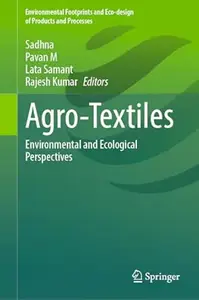

---

**Time:** 01:23:56 (Asia/Tehran)  
**Blog:** hill0  

**Title:** The Pragmatics of Queenship in Shakespeare's Drama  

**Details:** English | 2026 | ISBN: 3032170982 | 220 Pages | PDF (True) | 6 MB  

**Link:** http://zavat.pw/ebooks/3032170982.html  

---

**Time:** 01:23:56 (Asia/Tehran)  
**Blog:** hill0  

**Title:** Stein and Husserl’s Phenomenology of the Social in Ideas II  

**Details:** English | 2026 | ISBN: 3032173388 | 225 Pages | PDF (True) | 9 MB  

**Link:** http://zavat.pw/ebooks/3032173388.html  

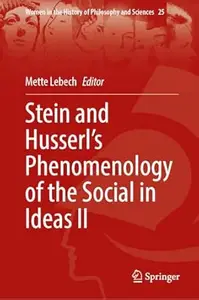

---

**Time:** 01:23:56 (Asia/Tehran)  
**Blog:** hill0  

**Title:** Hermeneutics of Law: From Ancients to Contemporaries  

**Details:** English | 2026 | ISBN: 3032186749 | 188 Pages | PDF (True) | 6 MB  

**Link:** http://zavat.pw/ebooks/3032186749.html  

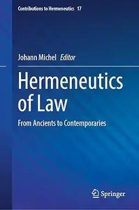

---

**Time:** 01:23:56 (Asia/Tehran)  
**Blog:** hill0  

**Title:** Jacob Bronowski: Selected Poems  

**Details:** English | 2026 | ISBN: 3032195969 | 152 Pages | PDF (True) | 7 MB  

**Link:** http://zavat.pw/ebooks/3032195969.html  

---

**Time:** 00:06:11 (Asia/Tehran)  
**Blog:** IrGens  

**Title:** The American West: History, Myth, and Legacy [TTC Audio]  

**Details:** English | August 18, 2017 | ASIN: B074BCYHGS | M4B@64 kbps | 12h 2m | 435 MB  

**Link:** http://zavat.pw/audiobooks/B074BCYHGS-m4b.html  

---

**Time:** 00:06:11 (Asia/Tehran)  
**Blog:** IrGens  

**Title:** TTC Video - The American West: History, Myth, and Legacy  

**Details:** .MP4, AVC, 1280x720, 30 fps | English, AAC, 2 Ch | 12h 7m | 11.19 GB  

**Link:** http://zavat.pw/ebooks/the-american-west-history-myth-and-legacy.html  

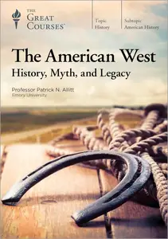

---

**Time:** 00:06:11 (Asia/Tehran)  
**Blog:** IrGens  

**Title:** Stone (Princeton Legacy Library)  

**Details:** English/Russian | March 24, 2026 | ISBN: 0691284563, 9780691196596 | True EPUB | 272 pages | 2.2 MB  

**Link:** http://zavat.pw/ebooks/0691284563.html  

---

**Time:** 00:06:11 (Asia/Tehran)  
**Blog:** IrGens  

**Title:** Why Did the Heavens Not Darken?: ‘The Final Solution’ in History  

**Details:** English | August 21, 2012 | ISBN: 184467777X | True EPUB | 544 pages | 1.5 MB  

**Link:** http://zavat.pw/ebooks/184467777X-epub.html  

---

**Time:** 00:06:11 (Asia/Tehran)  
**Blog:** IrGens  

**Title:** The Overthrow of Colonial Slavery: 1776-1848  

**Details:** English | May 3, 2011 | ISBN: 1844674762, 1844674754 | True EPUB | 576 pages | 3 MB  

**Link:** http://zavat.pw/ebooks/1844674762.html  

---

**Time:** 00:06:11 (Asia/Tehran)  
**Blog:** IrGens  

**Title:** Retrench, Defend, Compete: Securing America's Future Against a Rising China  

**Details:** English | December 15, 2025 | ISBN: 1501784846, 1501784854 | True EPUB | 336 pages | 2 MB  

**Link:** http://zavat.pw/ebooks/1501784846.html  

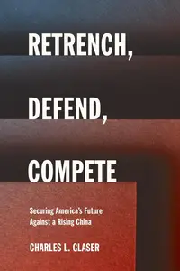

---

**Time:** 00:06:11 (Asia/Tehran)  
**Blog:** IrGens  

**Title:** Green Gone Wrong: How Our Economy Is Undermining the Environmental Revolution  

**Details:** English | April 20, 2010 | ISBN: 1416572228 | True EPUB | 272 pages | 1.9 MB  

**Link:** http://zavat.pw/ebooks/1416572228-epub.html  

---

**Time:** 00:06:11 (Asia/Tehran)  
**Blog:** IrGens  

**Title:** Flirting for Dummies  

**Details:** English | May 22, 2009 | ISBN: 0470742593 | True EPUB | 288 pages | 7.5 MB  

**Link:** http://zavat.pw/ebooks/0470742593-epub.html  

---

**Time:** 00:06:11 (Asia/Tehran)  
**Blog:** hill0  

**Title:** Human Factors in Cybersecurity  

**Details:** English | 2026 | ISBN: 9781806118335 | 332 Pages | PDF EPUB (True) | 159 MB  

**Link:** http://zavat.pw/ebooks/9781806118335.html  

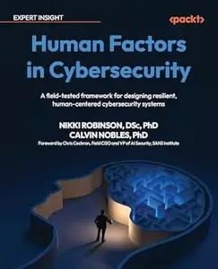

---

**Time:** 00:06:11 (Asia/Tehran)  
**Blog:** hill0  

**Title:** Agentic AI for Cybersecurity  

**Details:** English | 2026 | ISBN: 0135589851 | 453 Pages | EPUB | 8 MB  

**Link:** http://zavat.pw/ebooks/0135589851.html  

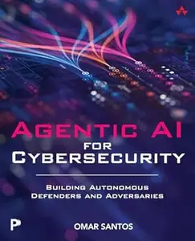

