# Zavat feed - 2026-06-05

---

**Time:** 08:24:51 (Asia/Tehran)  
**Blog:** yoyoloit  

**Title:** Fundamentals of Computer Science  

**Details:** English | 2024 | ISBN: 0138044996 | 750 pages | True PDF EPUB | 43.96 MB  

**Link:** http://zavat.pw/ebooks/0138044996.html  

---

**Time:** 08:24:51 (Asia/Tehran)  
**Blog:** yoyoloit  

**Title:** College Algebra: Concepts Through Functions, 5th Edition  

**Details:** English | 2024 | ISBN: 0138069085 | 843 pages | True PDF EPUB | 387.22 MB  

**Link:** http://zavat.pw/ebooks/0138069085.html  

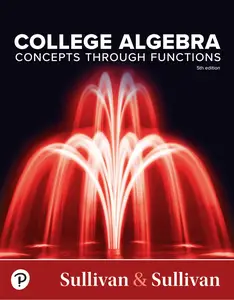

---

**Time:** 08:24:51 (Asia/Tehran)  
**Blog:** yoyoloit  

**Title:** Statistical Reasoning for Everyday Life, 6th Edition  

**Details:** English | 2024 | ISBN: 0138030146 | 457 pages | True PDF EPUB | 112.88 MB  

**Link:** http://zavat.pw/ebooks/0138030146.html  

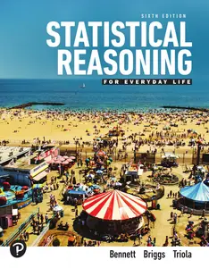

---

**Time:** 08:24:51 (Asia/Tehran)  
**Blog:** yoyoloit  

**Title:** Visualizing Technology, 10th edition  

**Details:** English | 2024 | ISBN: 0137931808 | 705 pages | True PDF EPUB | 482.17 MB  

**Link:** http://zavat.pw/ebooks/0137931808.html  

---

**Time:** 08:24:51 (Asia/Tehran)  
**Blog:** yoyoloit  

**Title:** Precalculus Enhanced with Graphing Utilities, 8th Edition  

**Details:** English | 2021 | ISBN: 0135813417 | 1248 pages | True PDF EPUB | 312.26 MB  

**Link:** http://zavat.pw/ebooks/0135813417.html  

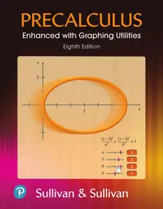

---

**Time:** 08:24:51 (Asia/Tehran)  
**Blog:** yoyoloit  

**Title:** Modern Operating Systems, 5th Edition  

**Details:** English | 2023 | ISBN: 0137618875 | 1185 pages | True PDF | 8.91 MB  

**Link:** http://zavat.pw/ebooks/0137618875a.html  

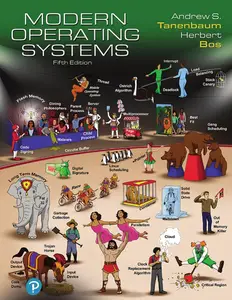

---

**Time:** 08:24:51 (Asia/Tehran)  
**Blog:** yoyoloit  

**Title:** Starting Out with Programming Logic and Design, 6th Edition  

**Details:** English | 2023 | ISBN: 0137602146 | 833 pages | True PDF EPUB | 80.77 MB  

**Link:** http://zavat.pw/ebooks/0137602146.html  

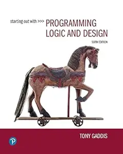

---

**Time:** 08:24:51 (Asia/Tehran)  
**Blog:** yoyoloit  

**Title:** Exploring Microsoft 365: Introductory 2021  

**Details:** English | 2023 | ISBN: 0137602391 | 1185 pages | True PDF EPUB | 558.29 MB  

**Link:** http://zavat.pw/ebooks/0137602391.html  

---

**Time:** 08:24:51 (Asia/Tehran)  
**Blog:** yoyoloit  

**Title:** Algal Polysaccharides and Proteins for Food Applications : Specification, Cultivation and Extraction  

**Details:** English | 2026 | ISBN: 1837671222 | 608 pages | True EPUB | 16.59 MB  

**Link:** http://zavat.pw/ebooks/1837671222.html  

---

**Time:** 08:24:51 (Asia/Tehran)  
**Blog:** yoyoloit  

**Title:** The Courage to Choose Yourself: Transforming Life's Transitions into Your Greatest Growth  

**Details:** English | 2026 | ISBN: 9798318601774 | 288 pages | True EPUB | 2.17 MB  

**Link:** http://zavat.pw/ebooks/9798318601774.html  

---

**Time:** 08:24:51 (Asia/Tehran)  
**Blog:** yoyoloit  

**Title:** A Billion Years of Sex Differences : How Evolution Shaped the Minds of Men and Women  

**Details:** English | 2026 | ISBN: 180075647X | 368 pages | True EPUB | 932.66 KB  

**Link:** http://zavat.pw/ebooks/180075647X.html  

---

**Time:** 08:24:51 (Asia/Tehran)  
**Blog:** yoyoloit  

**Title:** Let Your Body Do the Work: Activate Your Naturally Occurring GLP-1 Hormones for Healthy, Sustainable Weight Loss and Long-Term  

**Details:** English | 2026 | ISBN: 9798217273102 | 176 pages | True EPUB | 5.24 MB  

**Link:** http://zavat.pw/ebooks/9798217273102.html  

---

**Time:** 08:24:51 (Asia/Tehran)  
**Blog:** yoyoloit  

**Title:** Overcoming Depression and Low Mood: A Five Areas CBT Approach, 5th Edition  

**Details:** English | 2027 | ISBN: 1041107862 | 303 pages | True PDF EPUB | 60.24 MB  

**Link:** http://zavat.pw/ebooks/1041107862.html  

---

**Time:** 08:24:51 (Asia/Tehran)  
**Blog:** yoyoloit  

**Title:** How Writing Works: A Field Guide to Effective Writing, 3rd Edition  

**Details:** English | 2026 | ISBN: 1041158106 | 332 pages | True PDF EPUB | 5.08 MB  

**Link:** http://zavat.pw/ebooks/1041158106.html  

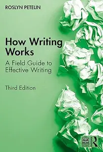

---

**Time:** 08:24:51 (Asia/Tehran)  
**Blog:** yoyoloit  

**Title:** New Realms for Writing, 2nd edition: Inspire Student Expression with Digital Age Formats  

**Details:** English | 2026 | ISBN: 081410293X | 179 pages | True EPUB | 12.11 MB  

**Link:** http://zavat.pw/ebooks/081410293X.html  

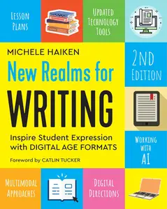

---

**Time:** 08:24:51 (Asia/Tehran)  
**Blog:** IrGens  

**Title:** Rabbit, Fox, Tar: A Novel  

**Details:** English | June 2, 2026 | ISBN: 1646223179, 9781646223183 | True EPUB | 299 pages | 3.2 MB  

**Link:** http://zavat.pw/ebooks/1646223179.html  

---

**Time:** 08:24:51 (Asia/Tehran)  
**Blog:** IrGens  

**Title:** Frontierlands: Britain's Survival in the Making  

**Details:** English | 5 Feb. 2026 | ISBN: 1911709313, 9781529908237 | True EPUB | 384 pages | 0.9 MB  

**Link:** http://zavat.pw/ebooks/1911709313.html  

---

**Time:** 08:24:51 (Asia/Tehran)  
**Blog:** IrGens  

**Title:** Be Like the Sea: Life, Learnings and Leadership from an Irish Navy Captain  

**Details:** English | 28 May 2026 | ISBN: 1804584495, 9781804584507 | True EPUB | 288 pages | 5.6 MB  

**Link:** http://zavat.pw/ebooks/1804584495.html  

---

**Time:** 08:24:51 (Asia/Tehran)  
**Blog:** IrGens  

**Title:** The Children: A Novel  

**Details:** English | June 2, 2026 | ISBN: 0063487438, 9780063487413 | True EPUB | 416 pages | 1.8 MB  

**Link:** http://zavat.pw/ebooks/0063487438.html  

---

**Time:** 08:24:51 (Asia/Tehran)  
**Blog:** IrGens  

**Title:** Collapse: A Novel  

**Details:** English | June 2, 2026 | ISBN: 0374616833, 9780374616847 | True EPUB | 171 pages | 2.6 MB  

**Link:** http://zavat.pw/ebooks/0374616833.html  

---

**Time:** 08:24:51 (Asia/Tehran)  
**Blog:** IrGens  

**Title:** Black Out Loud: The Revolutionary History of Black Comedy from Vaudeville to '90s Sitcoms  

**Details:** English | March 24, 2026 | ISBN: 0063418177, 9780063418196 | True EPUB | 336 pages | 6.9 MB  

**Link:** http://zavat.pw/ebooks/0063418177.html  

---

**Time:** 08:24:51 (Asia/Tehran)  
**Blog:** IrGens  

**Title:** Encyclopædia Britannica Anniversary Edition: 250 Years of Excellence (1768-2018)  

**Details:** English | February 15, 2018 | ISBN: 1625136722, 1625136277, 9781625136374 | True EPUB | 700 pages | 73.1 MB  

**Link:** http://zavat.pw/ebooks/1625136722.html  

---

**Time:** 08:24:51 (Asia/Tehran)  
**Blog:** IrGens  

**Title:** The Moys of New York and Shanghai: One Family's Extraordinary Journey Through War and Revolution  

**Details:** English | March 10, 2026 | ISBN: 0520409558, 9780520409569 | True EPUB | 368 pages | 8.3 MB  

**Link:** http://zavat.pw/ebooks/0520409558.html  

---

**Time:** 08:24:51 (Asia/Tehran)  
**Blog:** IrGens  

**Title:** Chasing Nirvana: A Seeker's Story of Love, Loss, and Liberation  

**Details:** English | March 3, 2026 | ISBN: 9798896360889, 9798896360896 | True EPUB | 356 pages | 4.6 MB  

**Link:** http://zavat.pw/ebooks/9798896360889.html  

---

**Time:** 08:24:51 (Asia/Tehran)  
**Blog:** IrGens  

**Title:** Spies and Other Gods: A Novel  

**Details:** English | April 14, 2026 | ISBN: 0802167675, 9780802167682 | True EPUB | 272 pages | 0.6 MB  

**Link:** http://zavat.pw/ebooks/0802167675.html  

---

**Time:** 08:24:51 (Asia/Tehran)  
**Blog:** crazy-slim  

**Title:** Teknik & prylar - 5 Juni 2026  

**Details:** Svenska | 178 pages | PDF | 115.0 MB  

**Link:** http://zavat.pw/magazines/Teknikprylar5Juni2026-35233.html  

---

**Time:** 08:24:51 (Asia/Tehran)  
**Blog:** crazy-slim  

**Title:** Historie Norge - 5 Juni 2026  

**Details:** Norsk | 148 pages | PDF | 174.2 MB  

**Link:** http://zavat.pw/magazines/HistorieNorge5Juni2026-63153.html  

---

**Time:** 08:24:51 (Asia/Tehran)  
**Blog:** crazy-slim  

**Title:** Helse & Mindfulness - 5 Juni 2026  

**Details:** Norsk | 116 pages | PDF | 77.2 MB  

**Link:** http://zavat.pw/magazines/HelseMindfulness5Juni2026-26327.html  

---

**Time:** 08:24:51 (Asia/Tehran)  
**Blog:** crazy-slim  

**Title:** Stock Magazine - 5 Juni 2026  

**Details:** Svenska | 68 pages | PDF | 46.1 MB  

**Link:** http://zavat.pw/magazines/StockMagazine5Juni2026-22557.html  

---

**Time:** 08:24:51 (Asia/Tehran)  
**Blog:** crazy-slim  

**Title:** TV14 Sverige - 5 Juni 2026  

**Details:** Svenska | 156 pages | PDF | 179.8 MB  

**Link:** http://zavat.pw/magazines/TV14Sverige5Juni2026-66945.html  

---

**Time:** 08:24:51 (Asia/Tehran)  
**Blog:** crazy-slim  

**Title:** Icakuriren - 5 Juni 2026  

**Details:** Svenska | 68 pages | PDF | 68.3 MB  

**Link:** http://zavat.pw/magazines/Icakuriren5Juni2026-88306.html  

---

**Time:** 08:24:51 (Asia/Tehran)  
**Blog:** crazy-slim  

**Title:** Kulturnytt - 5 Juni 2026  

**Details:** Svenska | 68 pages | PDF | 55.0 MB  

**Link:** http://zavat.pw/magazines/Kulturnytt5Juni2026-65904.html  

---

**Time:** 08:24:51 (Asia/Tehran)  
**Blog:** crazy-slim  

**Title:** 週刊GoodsPress - June 2026  

**Details:** 日本語 | 152 pages | True PDF | 145.8 MB  

**Link:** http://zavat.pw/magazines/%E9%80%B1%E5%88%8AGoodsPressJune2026-57362.html  

---

**Time:** 08:24:51 (Asia/Tehran)  
**Blog:** crazy-slim  

**Title:** Expressen Söndag - 5 Juni 2026  

**Details:** Svenska | 76 pages | PDF | 66.6 MB  

**Link:** http://zavat.pw/magazines/ExpressenS%C3%B6ndag5Juni2026-92939.html  

---

**Time:** 08:24:51 (Asia/Tehran)  
**Blog:** crazy-slim  

**Title:** Aftonbladet Lätta Kryss - 5 Juni 2026  

**Details:** Svenska | 36 pages | PDF | 21.0 MB  

**Link:** http://zavat.pw/magazines/AftonbladetL%C3%A4ttaKryss5Juni2026-36387.html  

---

**Time:** 08:24:51 (Asia/Tehran)  
**Blog:** crazy-slim  

**Title:** Mi Semanal - 5 Junio 2026  

**Details:** Español | 4 pages | PDF | 3.0 MB  

**Link:** http://zavat.pw/magazines/MiSemanal5Junio2026-03580.html  

---

**Time:** 08:24:51 (Asia/Tehran)  
**Blog:** crazy-slim  

**Title:** EcoJardín Especial - 300 Trucos de Jardinería y Huerto 15, 2026  

**Details:** Español | 68 pages | True PDF | 89.5 MB  

**Link:** http://zavat.pw/magazines/EcoJard%C3%ADnEspecial300TrucosdeJardiner%C3%ADayHuerto152026-81466.html  

---

**Time:** 08:24:51 (Asia/Tehran)  
**Blog:** crazy-slim  

**Title:** Horóscopo do Dia - 4 Junho 2026  

**Details:** Portuguese | 18 pages | True PDF | 11.5 MB  

**Link:** http://zavat.pw/magazines/Hor%C3%B3scopodoDia4Junho2026-97612.html  

---

**Time:** 08:24:51 (Asia/Tehran)  
**Blog:** crazy-slim  

**Title:** The Wine Kingdom ワイン王国 - July 2026  

**Details:** 日本語 | 156 pages | True PDF | 50.7 MB  

**Link:** http://zavat.pw/magazines/TheWineKingdom%E3%83%AF%E3%82%A4%E3%83%B3%E7%8E%8B%E5%9B%BDJuly2026-08529.html  

---

**Time:** 08:24:51 (Asia/Tehran)  
**Blog:** crazy-slim  

**Title:** You South Africa - 11 June 2026  

**Details:** English | 117 pages | True PDF | 60.0 MB  

**Link:** http://zavat.pw/magazines/YouSouthAfrica11June2026-09937.html  

---

**Time:** 03:30:38 (Asia/Tehran)  
**Blog:** yoyoloit  

**Title:** How to Be Chill : 365 Ways to Find Peace in a Noisy World  

**Details:** English | 2026 | ISBN: 9798886743944 | 192 pages | True EPUB | 81.78 MB  

**Link:** http://zavat.pw/ebooks/9798886743944.html  

---

**Time:** 03:30:38 (Asia/Tehran)  
**Blog:** yoyoloit  

**Title:** Consumer Panic Buying in Times of Crisis : Effective Management of Supply Chain Disruptions  

**Details:** English | 2026 | ISBN: 1041168810 | 227 pages | True PDF | 31.42 MB  

**Link:** http://zavat.pw/ebooks/1041168810.html  

---

**Time:** 03:30:38 (Asia/Tehran)  
**Blog:** yoyoloit  

**Title:** How to Be a (Happy) Skeptic : The Power of Doubt in a Meaningful Life--Lessons From Cicero's Philosophy  

**Details:** English | 2026 | ISBN: 9798217179671 | 352 pages | True EPUB | 1.43 MB  

**Link:** http://zavat.pw/ebooks/9798217179671.html  

---

**Time:** 03:30:38 (Asia/Tehran)  
**Blog:** yoyoloit  

**Title:** I Eat the Stars : How to Live Fully and Beautifully in a Collapsing World  

**Details:** English | 2026 | ISBN: 059399499X | 336 pages | True EPUB | 2.15 MB  

**Link:** http://zavat.pw/ebooks/059399499X.html  

---

**Time:** 03:30:38 (Asia/Tehran)  
**Blog:** yoyoloit  

**Title:** Introductory Sports Engineering and Technology  

**Details:** English | 2026 | ISBN: 1032532505 | 268 pages | True PDF EPUB | 68.58 MB  

**Link:** http://zavat.pw/ebooks/1032532505.html  

---

**Time:** 03:30:38 (Asia/Tehran)  
**Blog:** yoyoloit  

**Title:** Interdisciplinary Rheumatology : Rheumatology, Obstetrics, and Gynecology  

**Details:** English | 2027 | ISBN: 1032609400 | 182 pages | True PDF EPUB | 8.31 MB  

**Link:** http://zavat.pw/ebooks/1032609400.html  

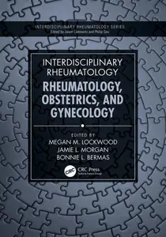

---

**Time:** 03:30:38 (Asia/Tehran)  
**Blog:** yoyoloit  

**Title:** Mathematical Foundations of Blockchains: Fundamentals, Volume 1  

**Details:** English | 2026 | ISBN: 1032979615 | 507 pages | True PDF | 17.27 MB  

**Link:** http://zavat.pw/ebooks/1032979615.html  

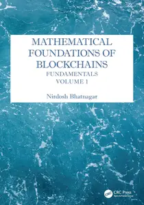

---

**Time:** 03:30:38 (Asia/Tehran)  
**Blog:** yoyoloit  

**Title:** Principles of Quality Costs: Understanding the Strategic Implementation of Process Management  

**Details:** English | 2026 | ISBN: 9781636942117 | 358 pages | True EPUB | 12.89 MB  

**Link:** http://zavat.pw/ebooks/9781636942117.html  

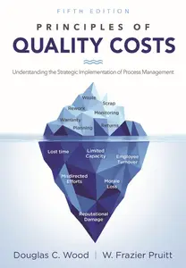

---

**Time:** 03:30:38 (Asia/Tehran)  
**Blog:** yoyoloit  

**Title:** Veracruz All Natural: Fresh Mexican Recipes from Our American Home (A Cookbook)  

**Details:** English | 2026 | ISBN: 1668050358 | 272 pages | True EPUB | 111.09 MB  

**Link:** http://zavat.pw/ebooks/1668050358.html  

---

**Time:** 03:30:38 (Asia/Tehran)  
**Blog:** yoyoloit  

**Title:** The Emergency Playbook: A Bunker-Free Guide to Disaster Preparation  

**Details:** English | 2026 | ISBN: 0593837649 | 320 pages | True EPUB | 13.95 MB  

**Link:** http://zavat.pw/ebooks/0593837649.html  

---

**Time:** 03:30:38 (Asia/Tehran)  
**Blog:** yoyoloit  

**Title:** Strength Training for Longevity: Simple Workouts for a Lifetime of Health and Mobility  

**Details:** English | 2026 | ISBN: 9798217331031 | 144 pages | True EPUB | 36.41 MB  

**Link:** http://zavat.pw/ebooks/9798217331031.html  

---

**Time:** 03:30:38 (Asia/Tehran)  
**Blog:** yoyoloit  

**Title:** Geowater : A Geographic Approach to Water Data and Forecasting  

**Details:** English | 2026 | ISBN: 1589489292 | 186 pages | True EPUB | 61.67 MB  

**Link:** http://zavat.pw/ebooks/1589489292.html  

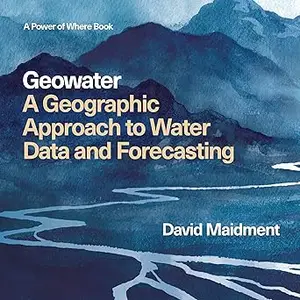

---

**Time:** 03:30:38 (Asia/Tehran)  
**Blog:** yoyoloit  

**Title:** How to Use Multivariate Statistics in Descriptive Research : Making the Invisible Visible  

**Details:** English | 2026 | ISBN: 1394362609 | 209 pages | True PDF | 6.94 MB  

**Link:** http://zavat.pw/ebooks/1394362609.html  

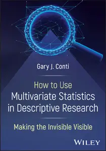

---

**Time:** 03:30:38 (Asia/Tehran)  
**Blog:** yoyoloit  

**Title:** Safety by Design : Human-Centered Approaches to AI, Automation, and Remote Operations  

**Details:** English | 2026 | ISBN: 1041229720 | 399 pages | True PDF EPUB | 77.74 MB  

**Link:** http://zavat.pw/ebooks/1041229720.html  

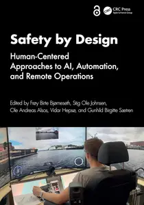

---

**Time:** 02:21:58 (Asia/Tehran)  
**Blog:** IrGens  

**Title:** You Were Never Just Using It: How Technology Rewrote the Self, One Click at a Time  

**Details:** English | April 14, 2026 | ISBN: 1997701332, 9781997701347 | True EPUB | 349 pages | 0.4 MB  

**Link:** http://zavat.pw/ebooks/1997701332.html  

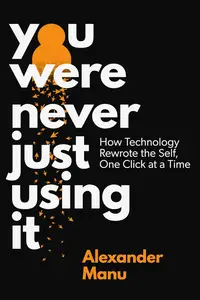

---

**Time:** 02:21:58 (Asia/Tehran)  
**Blog:** IrGens  

**Title:** Bede: The Man Who Invented England  

**Details:** English | 4 Jun. 2026 | ISBN: 178027839X, 9781788856690 | True EPUB | 320 pages | 5.5 MB  

**Link:** http://zavat.pw/ebooks/178027839X.html  

---

**Time:** 02:21:58 (Asia/Tehran)  
**Blog:** IrGens  

**Title:** Without Terminus: Untraining an Archive  

**Details:** English | June 2, 2026 | ISBN: 1644453924, 9781644453933 | True EPUB | 224 pages | 27.7 MB  

**Link:** http://zavat.pw/ebooks/1644453924.html  

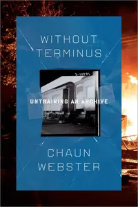

---

**Time:** 02:21:58 (Asia/Tehran)  
**Blog:** AvaxGenius  

**Title:** Systems and Implemented Technologies for Data-Driven Innovation, addressing Data Spaces  

**Details:** English | PDF (True) | 2024 | 208 Pages | ISBN : 8770041717 | 12.4 MB  

**Link:** http://zavat.pw/ebooks/8770041717.html  

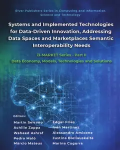

---

**Time:** 02:21:58 (Asia/Tehran)  
**Blog:** AvaxGenius  

**Title:** Architecting a Framework for Edge AI Functional and Non-functional Requirements  

**Details:** English | PDF (True) | 2026 | 188 Pages | ISBN : 9788743809579 | 4.2 MB  

**Link:** http://zavat.pw/ebooks/9788743809579.html  

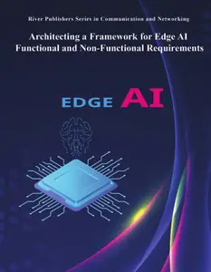

---

**Time:** 02:21:58 (Asia/Tehran)  
**Blog:** hill0  

**Title:** AI Safety in Healthcare Systems  

**Details:** English | 2026 | ISBN: 1041249616 | 230 Pages | PDF EPUB (True) | 15 MB  

**Link:** http://zavat.pw/ebooks/1041249616.html  

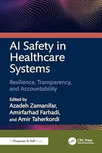

---

**Time:** 02:21:58 (Asia/Tehran)  
**Blog:** hill0  

**Title:** Complex Fuzzy Rough Sets and Their Applications  

**Details:** English | 2026 | ISBN: 874380781X | 203 Pages | PDF (True) | 7 MB  

**Link:** http://zavat.pw/ebooks/874380781Xp.html  

---

**Time:** 02:21:58 (Asia/Tehran)  
**Blog:** hill0  

**Title:** 5G Networks & Cybersecurity  

**Details:** English | 2026 | ISBN: 8743810888 | 85 Pages | PDF EPUB (True) | 21 MB  

**Link:** http://zavat.pw/ebooks/8743810888.html  

---

**Time:** 02:21:58 (Asia/Tehran)  
**Blog:** hill0  

**Title:** DK Road Trips California  

**Details:** English | 2026 | ISBN: 0241797993 | 1225 Pages | EPUB (True) | 277 MB  

**Link:** http://zavat.pw/ebooks/0241797993.html  

---

**Time:** 02:21:58 (Asia/Tehran)  
**Blog:** hill0  

**Title:** DK Top 10 Las Vegas  

**Details:** English | 2026 | ISBN: 0241797985 | 408 Pages | EPUB (True) | 158 MB  

**Link:** http://zavat.pw/ebooks/0241797985.html  

---

**Time:** 02:21:58 (Asia/Tehran)  
**Blog:** hill0  

**Title:** Ethical Artificial Intelligence in the Insurance Industry  

**Details:** English | 2026 | ISBN: 1041236883 | 308 Pages | PDF EPUB (True) | 22 MB  

**Link:** http://zavat.pw/ebooks/1041236883.html  

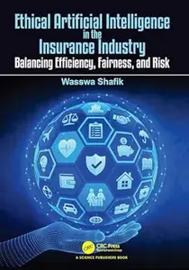

---

**Time:** 02:21:58 (Asia/Tehran)  
**Blog:** hill0  

**Title:** Textual and Contextual Data Analysis  

**Details:** English | 2026 | ISBN: 1032502266 | 250 Pages | PDF EPUB (True) | 31 MB  

**Link:** http://zavat.pw/ebooks/1032502266.html  

---

**Time:** 02:21:58 (Asia/Tehran)  
**Blog:** hill0  

**Title:** The AI Educator  

**Details:** English | 2026 | ISBN: 1041037074 | 273 Pages | PDF EPUB (True) | 9 MB  

**Link:** http://zavat.pw/ebooks/1041037074.html  

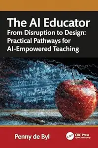

---

**Time:** 00:38:56 (Asia/Tehran)  
**Blog:** IrGens  

**Title:** Humans Not Robots: When Elite Sport and Real Life Collide  

**Details:** English | 4 Jun. 2026 | ISBN: 0008797234, 9780008797249 | True EPUB | 293 pages | 1.5 MB  

**Link:** http://zavat.pw/ebooks/0008797234.html  

---

**Time:** 00:38:56 (Asia/Tehran)  
**Blog:** IrGens  

**Title:** The Fire Agent: A Novel  

**Details:** English | June 2, 2026 | ISBN: 1966302002, 9781966302018 | True EPUB | 624 pages | 13.7 MB  

**Link:** http://zavat.pw/ebooks/1966302002.html  

---

**Time:** 00:38:56 (Asia/Tehran)  
**Blog:** IrGens  

**Title:** Called by the Hills: A Home in the Himalaya (UK Edition)  

**Details:** English | 15 Jan. 2026 | ISBN: 1917092709, 9781917092715 | True EPUB | 204 pages | 8.8 MB  

**Link:** http://zavat.pw/ebooks/1917092709.html  

---

**Time:** 00:38:56 (Asia/Tehran)  
**Blog:** IrGens  

**Title:** The Last Word  

**Details:** English | January 30, 1997 | ISBN: 0195108345, 0195149831, 9780199882113 | True EPUB | 160 pages | 1.9 MB  

**Link:** http://zavat.pw/ebooks/0195108345.html  

---

**Time:** 00:38:56 (Asia/Tehran)  
**Blog:** IrGens  

**Title:** The Beautiful Death of Ozzy Osbourne: How Metal Teaches Us to Live  

**Details:** English | 4 Jun. 2026 | ISBN: 0008819807, 9780008819811 | True EPUB | 224 pages | 11.2 MB  

**Link:** http://zavat.pw/ebooks/0008819807.html  

---

**Time:** 00:38:56 (Asia/Tehran)  
**Blog:** IrGens  

**Title:** To Love a Country: The Problem of Patriotism in America  

**Details:** English | June 2, 2026 | ISBN: 9798217087174, 9798217087181 | True EPUB | 256 pages | 2.9 MB  

**Link:** http://zavat.pw/ebooks/9798217087174.html  

---

**Time:** 00:38:56 (Asia/Tehran)  
**Blog:** IrGens  

**Title:** Political Thought on Uprisings: Essays on Just Rebellion  

**Details:** English | January 8, 2026 | ISBN: 9798765149690, 9798765149713 | True EPUB | 126 pages | 0.3 MB  

**Link:** http://zavat.pw/ebooks/9798765149690.html  

---

**Time:** 00:38:56 (Asia/Tehran)  
**Blog:** IrGens  

**Title:** Trust No One: A Thriller  

**Details:** English | February 24, 2026 | ISBN: 006341323X, 9780063413221 | True EPUB | 432 pages | 11.7 MB  

**Link:** http://zavat.pw/ebooks/006341323X.html  

---

**Time:** 00:38:56 (Asia/Tehran)  
**Blog:** IrGens  

**Title:** Look Closer: How to Get More Out of Reading  

**Details:** English | 6 Nov. 2025 | ISBN: 1911717316, 1529936780, 9781529936797 | True EPUB | 352 pages | 0.7 MB  

**Link:** http://zavat.pw/ebooks/1911717316.html  

---

**Time:** 00:38:56 (Asia/Tehran)  
**Blog:** IrGens  

**Title:** The Primal Primer: Survive Anything, Slay Anxiety, and Exit the System  

**Details:** English | September 29, 2022 | ISBN: 9798986761213, 9798986761220 | True EPUB | 190 pages | 1.3 MB  

**Link:** http://zavat.pw/ebooks/9798986761213.html  

---

**Time:** 00:38:56 (Asia/Tehran)  
**Blog:** IrGens  

**Title:** Reparenting the Inner Child: The New Science of Our Oldest Wounds and How to Heal Them  

**Details:** English | March 24, 2026 | ISBN: 1250393132, 1806159112, 9781250393142 | True EPUB | 384 pages | 2.5 MB  

**Link:** http://zavat.pw/ebooks/1250393132.html  

---

**Time:** 00:38:56 (Asia/Tehran)  
**Blog:** IrGens  

**Title:** Shameless: Finding Freedom and Resilience Through Failure  

**Details:** English | 21 May 2026 | ISBN: 0241762812, 9780241826478 | True EPUB | 240 pages | 1.8 MB  

**Link:** http://zavat.pw/ebooks/0241762812.html  

---

**Time:** 00:38:56 (Asia/Tehran)  
**Blog:** AvaxGenius  

**Title:** Biomedical Photoacoustics: Technology and Applications (Repost)  

**Details:** English | EPUB (True) | 2024 | 608 Pages | ISBN : 3031614100 | 152.6 MB  

**Link:** http://zavat.pw/ebooks/303162141005.html  

---

**Time:** 00:38:56 (Asia/Tehran)  
**Blog:** AvaxGenius  

**Title:** Dispersity, Structure and Phase Changes of Proteins and Bio Agglomerates in Biotechnological Processes (Repost)  

**Details:** English | EPUB (True) | 2024 | 548 Pages | ISBN : 3031631633 | 113.9 MB  

**Link:** http://zavat.pw/ebooks/303126315633.html  

---

**Time:** 00:38:56 (Asia/Tehran)  
**Blog:** AvaxGenius  

**Title:** Frontiers of Energy and Environmental Engineering (Repost)  

**Details:** English | EPUB (True) | 2024 | 779 Pages | ISBN : 9819703719 | 104.4 MB  

**Link:** http://zavat.pw/ebooks/981971037519.html  

---

**Time:** 00:38:56 (Asia/Tehran)  
**Blog:** AvaxGenius  

**Title:** Lecture Notes in Computational Intelligence and Decision Making (Repost)  

**Details:** English | PDF | 2022 | 819 Pages | ISBN : 3030820130 | 111.3 MB  

**Link:** http://zavat.pw/ebooks/305308205130.html  

---

**Time:** 00:38:56 (Asia/Tehran)  
**Blog:** hill0  

**Title:** A Practitioners' Guide to SAS: Mastering SAS Consulting  

**Details:** English | 2026 | ASIN: B0FGNNT4PH | 352 Pages | EPUB (True/Retail) | 4 MB  

**Link:** http://zavat.pw/ebooks/B0FGNNT4PH.html  

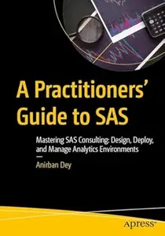

---

**Time:** 00:38:56 (Asia/Tehran)  
**Blog:** hill0  

**Title:** Beginning Axum  

**Details:** English | 2026 | ASIN: B0GLFH565K | 711 Pages | EPUB (True/Retail) | 5.4 MB  

**Link:** http://zavat.pw/ebooks/B0GLFH565Kt.html  

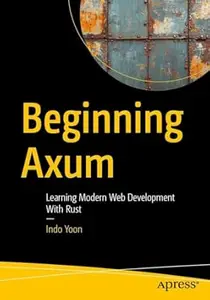

---

**Time:** 00:38:56 (Asia/Tehran)  
**Blog:** hill0  

**Title:** Road Engineering  

**Details:** English | 2026 | ISBN: 9819566584 | 259 Pages | PDF EPUB (True) | 41 MB  

**Link:** http://zavat.pw/ebooks/9819566584.html  

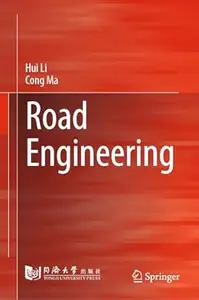

---

**Time:** 00:38:56 (Asia/Tehran)  
**Blog:** hill0  

**Title:** Accelerating Graph Algorithms  

**Details:** English | 2026 | ISBN: 9819557461 | 166 Pages | PDF EPUB (True) | 12 MB  

**Link:** http://zavat.pw/ebooks/9819557461.html  

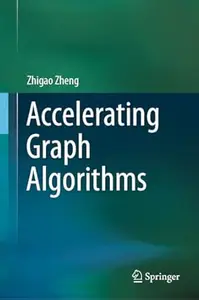

