# Zavat feed - 2026-06-07

---

**Time:** 16:27:26 (Asia/Tehran)  
**Blog:** yoyoloit  

**Title:** The Plunge: Maverick Swimmers, an Unlikely Quest, and the Transformative Power of Cold Water  

**Details:** English | 2026 | ISBN: 1668055864 | 320 pages | True EPUB | 4.35 MB  

**Link:** http://zavat.pw/ebooks/1668055864.html  

---

**Time:** 16:27:26 (Asia/Tehran)  
**Blog:** yoyoloit  

**Title:** Two Extra Steps: The Unfair Edge Anyone Can Use  

**Details:** English | 2026 | ISBN: 1637749163 | 240 pages | True EPUB | 1.56 MB  

**Link:** http://zavat.pw/ebooks/1637749163.html  

---

**Time:** 16:27:26 (Asia/Tehran)  
**Blog:** yoyoloit  

**Title:** Walking Red Flag: Dating Advice from Your Favorite Guy Friend  

**Details:** English | 2026 | ISBN: 1668061805 | 288 pages | True EPUB | 6.3 MB  

**Link:** http://zavat.pw/ebooks/1668061805.html  

---

**Time:** 16:27:26 (Asia/Tehran)  
**Blog:** yoyoloit  

**Title:** The Fenian Empire: A Hemispheric History of Irish Republican Nationalism  

**Details:** English | 2026 | ISBN: 1479832588 | 297 pages | True PDF EPUB | 180.61 MB  

**Link:** http://zavat.pw/ebooks/1479832588.html  

---

**Time:** 16:27:26 (Asia/Tehran)  
**Blog:** yoyoloit  

**Title:** Divided Over the Declaration: How an Enduring Debate Sustains the Vision of America  

**Details:** English | 2026 | ISBN: 9798895151709 | 336 pages | True EPUB | 2.43 MB  

**Link:** http://zavat.pw/ebooks/9798895151709.html  

---

**Time:** 16:27:26 (Asia/Tehran)  
**Blog:** yoyoloit  

**Title:** Turtle Island and the Tradition of Giants: When Earth Met Sky and Men Walked with Gods  

**Details:** English | 2026 | ISBN: 159143470X | 352 pages | True EPUB | 6.83 MB  

**Link:** http://zavat.pw/ebooks/159143470X.html  

---

**Time:** 16:27:26 (Asia/Tehran)  
**Blog:** yoyoloit  

**Title:** Advanced Rune Magic: The Greater Mysteries of Nordic Spirituality  

**Details:** English | 2026 | ISBN: 9798888502174 | 288 pages | True EPUB | 8.86 MB  

**Link:** http://zavat.pw/ebooks/9798888502174.html  

---

**Time:** 16:27:26 (Asia/Tehran)  
**Blog:** yoyoloit  

**Title:** The Fall of Republics: A History from Ancient Carthage to the American Constitution  

**Details:** English | 2026 | ISBN: 069119582X | 449 pages | True PDF EPUB | 26.46 MB  

**Link:** http://zavat.pw/ebooks/069119582X.html  

---

**Time:** 16:27:26 (Asia/Tehran)  
**Blog:** yoyoloit  

**Title:** The Persistence: How Scott Presler Cleaned Up America's Cities, Seized the Voter Registration Movement from Democrats  

**Details:** English | 2026 | ISBN: 1648212298 | 264 pages | True EPUB | 1.11 MB  

**Link:** http://zavat.pw/ebooks/1648212298.html  

---

**Time:** 16:27:26 (Asia/Tehran)  
**Blog:** yoyoloit  

**Title:** Corporate Reviews of Internal Deviance: Managing Investigations for Compliance and Conformance  

**Details:** English | 2026 | ISBN: 1839999977 | 274 pages | True EPUB | 1.23 MB  

**Link:** http://zavat.pw/ebooks/1839999977.html  

---

**Time:** 16:27:26 (Asia/Tehran)  
**Blog:** yoyoloit  

**Title:** Peaceful Aging: Meditations for Living a Long Purposeful Life  

**Details:** English | 2026 | ISBN: 1684818117 | 318 pages | True EPUB | 490.66 KB  

**Link:** http://zavat.pw/ebooks/1684818117.html  

---

**Time:** 16:27:26 (Asia/Tehran)  
**Blog:** yoyoloit  

**Title:** Compassion in Crisis: Building Disaster-Resilient Communities  

**Details:** English | 2026 | ISBN: 1597147117 | 240 pages | True EPUB | 5.06 MB  

**Link:** http://zavat.pw/ebooks/1597147117.html  

---

**Time:** 16:27:26 (Asia/Tehran)  
**Blog:** IrGens  

**Title:** TTC Video - How Chemistry Surrounds You  

**Details:** .MP4, AVC, 1280x720, 30 fps | English, AAC, 2 Ch | 11h 7m | 9.25 GB  

**Link:** http://zavat.pw/ebooks/how-chemistry-surrounds-you.html  

---

**Time:** 16:27:26 (Asia/Tehran)  
**Blog:** hill0  

**Title:** Artificial Intelligence and Data Science in Agriculture  

**Details:** English | 2026 | ISBN: 3111438414 | 598 Pages | PDF EPUB (True) | 90 MB  

**Link:** http://zavat.pw/ebooks/3111438414.html  

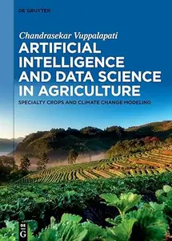

---

**Time:** 16:27:26 (Asia/Tehran)  
**Blog:** hill0  

**Title:** Menschliche Architektur  

**Details:** Deutsch | 2026 | ISBN: 3658498153 | 585 Pages | PDF (True) | 17 MB  

**Link:** http://zavat.pw/ebooks/3658498153.html  

---

**Time:** 16:27:26 (Asia/Tehran)  
**Blog:** hill0  

**Title:** Praxiswissen Business Continuity Management im Einkauf  

**Details:** Deutsch | 2026 | ISBN: 3658519436 | 167 Pages | PDF (True) | 2 MB  

**Link:** http://zavat.pw/ebooks/3658519436.html  

---

**Time:** 16:27:26 (Asia/Tehran)  
**Blog:** hill0  

**Title:** Kaizen im Rettungsdienst  

**Details:** Deutsch | 2026 | ISBN: 3658507780 | 98 Pages | PDF (True) | 4 MB  

**Link:** http://zavat.pw/ebooks/3658507780.html  

---

**Time:** 14:33:08 (Asia/Tehran)  
**Blog:** yoyoloit  

**Title:** The Simple Magic of Executive Communication: Forget Perfection. Communication That Changes Everything Begins With Connection  

**Details:** English | 2026 | ISBN: 9798887507033 | 216 pages | True EPUB | 1.87 MB  

**Link:** http://zavat.pw/ebooks/9798887507033.html  

---

**Time:** 14:33:08 (Asia/Tehran)  
**Blog:** yoyoloit  

**Title:** Race in Transit Tracing the Politics of Migration from Ottoman Syria through US Empire  

**Details:** English | 2026 | ISBN: 1503638731 | 232 pages | True PDF EPUB | 30.51 MB  

**Link:** http://zavat.pw/ebooks/1503638731.html  

---

**Time:** 14:33:08 (Asia/Tehran)  
**Blog:** yoyoloit  

**Title:** The Masquerade: A History of Extravagance and Intrigue  

**Details:** English | 2026 | ISBN: 0300276214 | 368 pages | True EPUB | 15.56 MB  

**Link:** http://zavat.pw/ebooks/0300276214.html  

---

**Time:** 14:33:08 (Asia/Tehran)  
**Blog:** yoyoloit  

**Title:** Follow-Up Freak: How High-Performers Build Trust, Create Opportunity, and Win More Business  

**Details:** English | 2026 | ISBN: 9798891883284 | 112 pages | True EPUB | 1.66 MB  

**Link:** http://zavat.pw/ebooks/9798891883284.html  

---

**Time:** 14:33:08 (Asia/Tehran)  
**Blog:** yoyoloit  

**Title:** Fodor's Montreal & Quebec City, 33rd Edition  

**Details:** English | 2026 | ISBN: 1640979018 | 304 pages | True EPUB | 74.72 MB  

**Link:** http://zavat.pw/ebooks/1640979018.html  

---

**Time:** 14:33:08 (Asia/Tehran)  
**Blog:** yoyoloit  

**Title:** Red Card: The 2026 World Cup, Sportswashing, and the FIFA Greed Machine  

**Details:** English | 2026 | ISBN: 1682195287 | 184 pages | True EPUB | 3.78 MB  

**Link:** http://zavat.pw/ebooks/1682195287.html  

---

**Time:** 14:33:08 (Asia/Tehran)  
**Blog:** yoyoloit  

**Title:** Evasion Engineering: Building Custom Red Team Tools for Modern Defenses  

**Details:** English | 2026 | ISBN: 1718505043 | 256 pages | True/Retail EPUB, MOBI | 88.88 MB  

**Link:** http://zavat.pw/ebooks/1718505043ax.html  

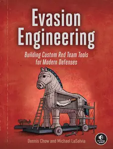

---

**Time:** 14:33:08 (Asia/Tehran)  
**Blog:** yoyoloit  

**Title:** Demystifying Classical Particles, Fields, and Relativity Through the Lagrangian Formalism  

**Details:** English | 2026 | ISBN: 9819828953 | 270 pages | True PDF | 14.58 MB  

**Link:** http://zavat.pw/ebooks/9819828953.html  

---

**Time:** 14:33:08 (Asia/Tehran)  
**Blog:** yoyoloit  

**Title:** From Instruments to Strategies: How Derivatives Are Used in Practice  

**Details:** English | 2026 | ISBN: 1800619391 | 557 pages | True PDF | 11.3 MB  

**Link:** http://zavat.pw/ebooks/1800619391.html  

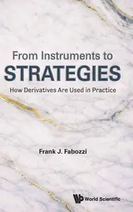

---

**Time:** 14:33:08 (Asia/Tehran)  
**Blog:** yoyoloit  

**Title:** Memory And Sleep: A Computational Understanding  

**Details:** English | 2026 | ISBN: 9819829046 | 354 pages | True PDF | 13.14 MB  

**Link:** http://zavat.pw/ebooks/9819829046.html  

---

**Time:** 14:33:08 (Asia/Tehran)  
**Blog:** yoyoloit  

**Title:** Advances In Quantum Electrodynamics Fundamentals: From The Electromagnetic Vacuum To Cosmology  

**Details:** English | 2026 | ISBN: 9819826659 | 213 pages | True PDF EPUB | 10.81 MB  

**Link:** http://zavat.pw/ebooks/9819826659.html  

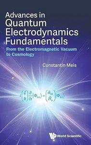

---

**Time:** 14:33:08 (Asia/Tehran)  
**Blog:** yoyoloit  

**Title:** Creating Number: How Humans Developed Natural, Complex, Real and Infinite Numbers  

**Details:** English | 2026 | ISBN: 9819826217 | 303 pages | True PDF | 131.21 MB  

**Link:** http://zavat.pw/ebooks/9819826217.html  

---

**Time:** 14:33:08 (Asia/Tehran)  
**Blog:** yoyoloit  

**Title:** AI and ChatGPT: A Techno-legal-socio Analysis  

**Details:** English | 2026 | ISBN: 9819821967 | 274 pages | True PDF | 6.78 MB  

**Link:** http://zavat.pw/ebooks/9819821967.html  

---

**Time:** 14:33:08 (Asia/Tehran)  
**Blog:** yoyoloit  

**Title:** A Random Walk Through Fifty Years of Rydberg Physics  

**Details:** English | 2026 | ISBN: 1800618808 | 365 pages | True PDF | 54.9 MB  

**Link:** http://zavat.pw/ebooks/1800618808.html  

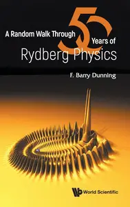

---

**Time:** 14:33:08 (Asia/Tehran)  
**Blog:** yoyoloit  

**Title:** The Handbook of Electrophysiology: A Practical Guide for Neurophysiologists  

**Details:** English | 2026 | ISBN: 9819813751 | 822 pages | True PDF | 27.47 MB  

**Link:** http://zavat.pw/ebooks/9819813751.html  

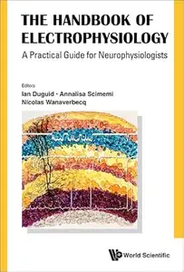

---

**Time:** 14:33:08 (Asia/Tehran)  
**Blog:** IrGens  

**Title:** John Dos Passos's Transatlantic Chronicling: Critical Essays on the Interwar Years  

**Details:** English | March 25, 2022 | ISBN: 1621907139, 9798895273036 | True EPUB | 360 pages | 5.5 MB  

**Link:** http://zavat.pw/ebooks/1621907139.html  

---

**Time:** 14:33:08 (Asia/Tehran)  
**Blog:** IrGens  

**Title:** A Hosting: Interviews with Irish Writers 1991-2025  

**Details:** English | 16 April 2026 | ISBN: 1843519755, 9781807620011 | True EPUB | 354 pages | 1.5 MB  

**Link:** http://zavat.pw/ebooks/1843519755.html  

---

**Time:** 14:33:08 (Asia/Tehran)  
**Blog:** IrGens  

**Title:** Galileo, Bellarmine, and the Bible  

**Details:** English | January 31, 1991 | ISBN: 0268010242, 0268010277, 9780268158934 | True EPUB | 304 pages | 4.6 MB  

**Link:** http://zavat.pw/ebooks/0268010242.html  

---

**Time:** 14:33:08 (Asia/Tehran)  
**Blog:** crazy-slim  

**Title:** Verywell Special Edition - Understanding Migraines - June 2025  

**Details:** English | 100 pages | PDF | 82.2 MB  

**Link:** http://zavat.pw/magazines/VerywellSpecialEditionUnderstandingMigrainesJune2025-36202.html  

---

**Time:** 14:33:08 (Asia/Tehran)  
**Blog:** crazy-slim  

**Title:** Verywell Special Edition - Parkinson's A New Understanding - April 2025  

**Details:** English | 100 pages | PDF | 81.3 MB  

**Link:** http://zavat.pw/magazines/VerywellSpecialEditionParkinsonsANewUnderstandingApril2025-45917.html  

---

**Time:** 14:33:08 (Asia/Tehran)  
**Blog:** crazy-slim  

**Title:** Verywell Special Edition - Multiple Sclerosis A New Understanding - March 2026  

**Details:** English | 100 pages | PDF | 50.8 MB  

**Link:** http://zavat.pw/magazines/VerywellSpecialEditionMultipleSclerosisANewUnderstandingMarch2026-76450.html  

---

**Time:** 14:33:08 (Asia/Tehran)  
**Blog:** crazy-slim  

**Title:** Verywell Special Edition - Heart Health A New Understanding - February 2026  

**Details:** English | 100 pages | PDF | 52.6 MB  

**Link:** http://zavat.pw/magazines/VerywellSpecialEditionHeartHealthANewUnderstandingFebruary2026-09391.html  

---

**Time:** 14:33:08 (Asia/Tehran)  
**Blog:** crazy-slim  

**Title:** Verywell Special Edition - Arthritis A New Understanding - May 2025  

**Details:** English | 100 pages | PDF | 54.7 MB  

**Link:** http://zavat.pw/magazines/VerywellSpecialEditionArthritisANewUnderstandingMay2025-12498.html  

---

**Time:** 14:33:08 (Asia/Tehran)  
**Blog:** crazy-slim  

**Title:** Verywell Special Edition - Alzheimer's A New Understanding - October 2025  

**Details:** English | 100 pages | PDF | 55.8 MB  

**Link:** http://zavat.pw/magazines/VerywellSpecialEditionAlzheimersANewUnderstandingOctober2025-67222.html  

---

**Time:** 14:33:08 (Asia/Tehran)  
**Blog:** crazy-slim  

**Title:** Le Fana de l'Aviation Hors-Série N.37 - Juillet 2008  

**Details:** Français | 116 pages | True PDF | 26.7 MB  

**Link:** http://zavat.pw/magazines/LeFanadelAviationHorsS%C3%A9rieN37Juillet2008-45530.html  

---

**Time:** 14:33:08 (Asia/Tehran)  
**Blog:** crazy-slim  

**Title:** Le Fana de l'Aviation Hors-Série N.44 - Décembre 2010  

**Details:** Français | 132 pages | True PDF | 13.3 MB  

**Link:** http://zavat.pw/magazines/LeFanadelAviationHorsS%C3%A9rieN44D%C3%A9cembre2010-24992.html  

---

**Time:** 14:33:08 (Asia/Tehran)  
**Blog:** crazy-slim  

**Title:** Le Fana de l'Aviation Hors-Série N.46 - Octobre 2011  

**Details:** Français | 132 pages | True PDF | 25.5 MB  

**Link:** http://zavat.pw/magazines/LeFanadelAviationHorsS%C3%A9rieN46Octobre2011-60932.html  

---

**Time:** 14:33:08 (Asia/Tehran)  
**Blog:** crazy-slim  

**Title:** Le Fana de l'Aviation Hors-Série N.45 - Juin 2011  

**Details:** Français | 100 pages | True PDF | 18.7 MB  

**Link:** http://zavat.pw/magazines/LeFanadelAviationHorsS%C3%A9rieN45Juin2011-70738.html  

---

**Time:** 14:33:08 (Asia/Tehran)  
**Blog:** crazy-slim  

**Title:** Le Fana de l'Aviation Hors-Série N.42 - Juin 2010  

**Details:** Français | 132 pages | True PDF | 28.8 MB  

**Link:** http://zavat.pw/magazines/LeFanadelAviationHorsS%C3%A9rieN42Juin2010-07103.html  

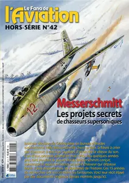

---

**Time:** 14:33:08 (Asia/Tehran)  
**Blog:** crazy-slim  

**Title:** Le Fana de l'Aviation Hors-Série N.43 - Novembre 2010  

**Details:** Français | 132 pages | True PDF | 38.6 MB  

**Link:** http://zavat.pw/magazines/LeFanadelAviationHorsS%C3%A9rieN43Novembre2010-89394.html  

---

**Time:** 14:33:08 (Asia/Tehran)  
**Blog:** crazy-slim  

**Title:** Le Fana de l'Aviation Hors-Série N.34 - Mai 2007  

**Details:** Français | 132 pages | True PDF | 39.7 MB  

**Link:** http://zavat.pw/magazines/LeFanadelAviationHorsS%C3%A9rieN34Mai2007-37249.html  

---

**Time:** 14:33:08 (Asia/Tehran)  
**Blog:** crazy-slim  

**Title:** Le Fana de l'Aviation Hors-Série N.41 - Décembre 2009  

**Details:** Français | 100 pages | True PDF | 22.8 MB  

**Link:** http://zavat.pw/magazines/LeFanadelAviationHorsS%C3%A9rieN41D%C3%A9cembre2009-65189.html  

---

**Time:** 14:33:08 (Asia/Tehran)  
**Blog:** crazy-slim  

**Title:** Le Fana de l'Aviation Hors-Série N.39 - Avril 2009  

**Details:** Français | 132 pages | True PDF | 20.0 MB  

**Link:** http://zavat.pw/magazines/LeFanadelAviationHorsS%C3%A9rieN39Avril2009-84642.html  

---

**Time:** 12:03:57 (Asia/Tehran)  
**Blog:** yoyoloit  

**Title:** Of Another Mind: Navigating a New Social Contract with Superintelligent AI  

**Details:** English | 2026 | ISBN: 9819826241 | 303 pages | True PDF | 6.93 MB  

**Link:** http://zavat.pw/ebooks/9819826241.html  

---

**Time:** 12:03:57 (Asia/Tehran)  
**Blog:** yoyoloit  

**Title:** Elements of Functional Analysis and Operator Theory  

**Details:** English | 2026 | ISBN: 9819829526 | 392 pages | True PDF | 5.26 MB  

**Link:** http://zavat.pw/ebooks/9819829526.html  

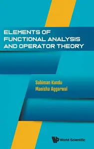

---

**Time:** 12:03:57 (Asia/Tehran)  
**Blog:** yoyoloit  

**Title:** Ubiquitous Laplacian: An Introduction To Numerical Pdes With Applications In Data Science  

**Details:** English | 2026 | ISBN: 9819814537 | 308 pages | True PDF | 30.22 MB  

**Link:** http://zavat.pw/ebooks/9819814537.html  

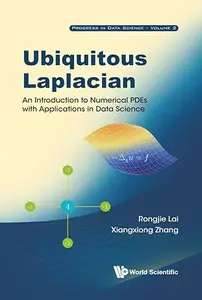

---

**Time:** 12:03:57 (Asia/Tehran)  
**Blog:** IrGens  

**Title:** Procol Harum: Every Album, Every Song (On Track)  

**Details:** English | June 29, 2024 | ISBN: 178952315X, ‎ 9781789524390 | True EPUB | 128 pages | 4.7 MB  

**Link:** http://zavat.pw/ebooks/178952315X.html  

---

**Time:** 12:03:57 (Asia/Tehran)  
**Blog:** IrGens  

**Title:** Queen: Every Album, Every Song (On Track)  

**Details:** English | July 15, 2019 | ISBN: 1789520037, 9781789520255 | True EPUB | 160 pages | 9.9 MB  

**Link:** http://zavat.pw/ebooks/1789520037.html  

---

**Time:** 12:03:57 (Asia/Tehran)  
**Blog:** IrGens  

**Title:** Radiohead: Every Album, Every Song (On Track)  

**Details:** English | December 17, 2021 | ISBN: 1789521491, ‎ 9781789522044 | True EPUB | 160 pages | 2.2 MB  

**Link:** http://zavat.pw/ebooks/1789521491.html  

---

**Time:** 12:03:57 (Asia/Tehran)  
**Blog:** IrGens  

**Title:** Ralph McTell: Every Album, Every Song (On Track)  

**Details:** English | December 22, 2023 | ISBN: 1789522943, 9781789524901 | True EPUB | 258 pages | 4.6 MB  

**Link:** http://zavat.pw/ebooks/1789522943.html  

---

**Time:** 12:03:57 (Asia/Tehran)  
**Blog:** IrGens  

**Title:** Renaissance: Every Album, Every Song (On Track)  

**Details:** English | April 15, 2021 | ISBN: 1789520622, 9781789522273 | True EPUB | 176 pages | 3.5 MB  

**Link:** http://zavat.pw/ebooks/1789520622.html  

---

**Time:** 12:03:57 (Asia/Tehran)  
**Blog:** IrGens  

**Title:** Reimagining the Past in the Borderlands of Medieval England and Wales  

**Details:** English | September 24, 2024 | ISBN: 0192856464, 0192856472, 9780192670274 | True EPUB | 314 pages | 10.1 MB  

**Link:** http://zavat.pw/ebooks/0192856464.html  

---

**Time:** 12:03:57 (Asia/Tehran)  
**Blog:** IrGens  

**Title:** Light While There is Light: An American History (New York Review Books Classics)  

**Details:** English | May 12, 2026 | ISBN: 9798896230366, 9798896230373 | True EPUB | 216 pages | 6.3 MB  

**Link:** http://zavat.pw/ebooks/9798896230366.html  

---

**Time:** 12:03:57 (Asia/Tehran)  
**Blog:** IrGens  

**Title:** Brown Girl, Brownstones (Penguin Classics)  

**Details:** English | June 2, 2026 | ISBN: 0143139215, 9780593513323 | True EPUB | 304 pages | 0.7 MB  

**Link:** http://zavat.pw/ebooks/0143139215.html  

---

**Time:** 12:03:57 (Asia/Tehran)  
**Blog:** IrGens  

**Title:** The Incredible Afterlives of Dr. Stevenson  

**Details:** English | April 22, 2026 | ISBN: 0226824225, 9780226824239 | True EPUB | 472 pages | 1.66 MB  

**Link:** http://zavat.pw/ebooks/0226824225.html  

---

**Time:** 12:03:57 (Asia/Tehran)  
**Blog:** IrGens  

**Title:** The Warrior Walker: How I Found Resilience, Purpose and Meaning on Britain's Coastline  

**Details:** English | ‎ 26 Mar. 2026 | ISBN: 1785128698, 9781785128707 | True EPUB | 288 pages | 1.7 MB  

**Link:** http://zavat.pw/ebooks/1785128698.html  

---

**Time:** 12:03:57 (Asia/Tehran)  
**Blog:** IrGens  

**Title:** Your Mind, Your Rules: Take Control of Your Thinking to Transform Your Life [Audiobook] (Repost)  

**Details:** English | April 09, 2026 | ASIN: B0G7KXSGJH, B0G7KW7S25 | M4B@128 kbps | 5h 55m | 324 MB  

**Link:** http://zavat.pw/audiobooks/B0G7KXSGJH.html  

---

**Time:** 12:03:57 (Asia/Tehran)  
**Blog:** AvaxGenius  

**Title:** Recent Advances in Earthquake Engineering: Select Proceedings of VCDRR 2021 (Repost)  

**Details:** English | EPUB | 2022 | 528 Pages | ISBN : 9811646163 | 132.5 MB  

**Link:** http://zavat.pw/ebooks/98116646163.html  

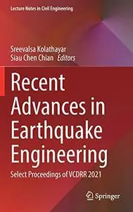

---

**Time:** 12:03:57 (Asia/Tehran)  
**Blog:** AvaxGenius  

**Title:** Physical and Mathematical Modeling of Earth and Environment Processes—2022 (Repost)  

**Details:** English | EPUB | 2023 | 626 Pages | ISBN : 3031259610 | 124.9 MB  

**Link:** http://zavat.pw/ebooks/30312569610.html  

---

**Time:** 12:03:57 (Asia/Tehran)  
**Blog:** AvaxGenius  

**Title:** A Geoinformatics Approach to Water Erosion: Soil Loss and Beyond (Repost)  

**Details:** English | EPUB | 2022 | 364 Pages | ISBN : 3030915352 | 103.6 MB  

**Link:** http://zavat.pw/ebooks/30309165352.html  

---

**Time:** 12:03:57 (Asia/Tehran)  
**Blog:** AvaxGenius  

**Title:** Congress on Intelligent Systems: Proceedings of CIS 2021, Volume 1 (Repost)  

**Details:** English | EPUB | 2022 | 933 Pages | ISBN : 981169415X | 113.9 MB  

**Link:** http://zavat.pw/ebooks/9811695415X.html  

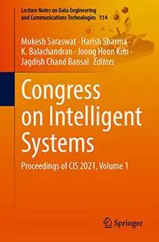

---

**Time:** 12:03:57 (Asia/Tehran)  
**Blog:** AvaxGenius  

**Title:** Advanced Technologies, Systems, and Applications VI (Repost)  

**Details:** English | EPUB | 2022 | 803 Pages | ISBN : 3030900541 | 216.7 MB  

**Link:** http://zavat.pw/ebooks/30306900541.html  

---

**Time:** 12:03:57 (Asia/Tehran)  
**Blog:** AvaxGenius  

**Title:** Proceedings of China SAE Congress 2022: Selected Papers (Repost)  

**Details:** English | EPUB | 2023 | 1137 Pages | ISBN : 9819913640 | 272 MB  

**Link:** http://zavat.pw/ebooks/98196913640.html  

---

**Time:** 12:03:57 (Asia/Tehran)  
**Blog:** AvaxGenius  

**Title:** Ultrasound Physics and its Application in Medicine (Repost)  

**Details:** English | PDF EPUB (True) | 2024 | 335 Pages | ISBN : 1956390413 | 174.1 MB  

**Link:** http://zavat.pw/ebooks/19563590413.html  

---

**Time:** 12:03:57 (Asia/Tehran)  
**Blog:** AvaxGenius  

**Title:** Innovations in Smart Cities Applications Volume 4 (Repost)  

**Details:** English | PDF (True) | 2021 | 1529 Pages | ISBN : 3030668398 | 215.9 MB  

**Link:** http://zavat.pw/ebooks/30306568398.html  

---

**Time:** 12:03:57 (Asia/Tehran)  
**Blog:** AvaxGenius  

**Title:** Advanced Informatics for Computing Research (Repost)  

**Details:** English | PDF | 2019 | 848 Pages | ISBN : 9811331391 | 103.25 MB  

**Link:** http://zavat.pw/ebooks/98113631391.html  

---

**Time:** 12:03:57 (Asia/Tehran)  
**Blog:** AvaxGenius  

**Title:** Digital Management of Container Terminal Operations (Repost)  

**Details:** English | EPUB | 2020 | 317 Pages | ISBN : 9811529361 | 103.8 MB  

**Link:** http://zavat.pw/ebooks/98115629361.html  

---

**Time:** 12:03:57 (Asia/Tehran)  
**Blog:** AvaxGenius  

**Title:** Fundamentals of High Lift for Future Civil Aircraft (Repost)  

**Details:** English | EPUB | 2021 | 634 Pages | ISBN : 3030524280 | 169.3 MB  

**Link:** http://zavat.pw/ebooks/30360524280.html  

---

**Time:** 12:03:57 (Asia/Tehran)  
**Blog:** AvaxGenius  

**Title:** Handbook of Massive Data Sets (Massive Computing) (Repost)  

**Details:** English | PDF | 2002 | 1209 Pages | ISBN : 146134882X | 132.26 MB  

**Link:** http://zavat.pw/ebooks/1461348282X.html  

---

**Time:** 12:03:57 (Asia/Tehran)  
**Blog:** AvaxGenius  

**Title:** Global Bariatric Surgery: The Art of Weight Loss Across the Borders (Repost)  

**Details:** English | EPUB | 2018 | 512 Pages | ISBN : 3319935445 | 117.41 MB  

**Link:** http://zavat.pw/ebooks/33192935445.html  

---

**Time:** 12:03:57 (Asia/Tehran)  
**Blog:** AvaxGenius  

**Title:** Cooperating Robots for Flexible Manufacturing (Repost)  

**Details:** English | EPUB | 2021 | 415 Pages | ISBN : 3030515907 | 134.1 MB  

**Link:** http://zavat.pw/ebooks/30230515907.html  

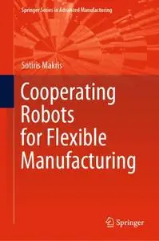

---

**Time:** 12:03:57 (Asia/Tehran)  
**Blog:** AvaxGenius  

**Title:** Frans Hals or not Frans Hals: Connoisseurship, Technical Analysis and Digital Tools (Repost)  

**Details:** English | EPUB (True) | 2025 | 288 Pages | ISBN : 3031594886 | 387.1 MB  

**Link:** http://zavat.pw/ebooks/303515924886.html  

---

**Time:** 12:03:57 (Asia/Tehran)  
**Blog:** hill0  

**Title:** Integrated Circuit Fabrication: Science and Technology  

**Details:** English | 2023 | ISBN: 1009303589 | 635 Pages | PDF | 20 MB  

**Link:** http://zavat.pw/ebooks/1009303589.html  

---

**Time:** 12:03:57 (Asia/Tehran)  
**Blog:** hill0  

**Title:** Matrix Mathematics (2nd Edition)  

**Details:** English | 2023 | ISBN: 1108837107 | 491 Pages | PDF (True) | 6 MB  

**Link:** http://zavat.pw/ebooks/1108837107.html  

---

**Time:** 12:03:57 (Asia/Tehran)  
**Blog:** hill0  

**Title:** Bayesian Data Analysis for the Behavioral and Neural Sciences  

**Details:** English | 2021 | ISBN: 1108835562 | 616 Pages | PDF (True) | 14 MB  

**Link:** http://zavat.pw/ebooks/1108835562.html  

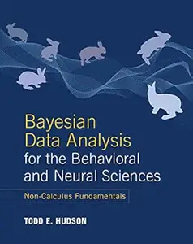

---

**Time:** 12:03:57 (Asia/Tehran)  
**Blog:** hill0  

**Title:** Introduction to Machine Learning: From Math to Code  

**Details:** English | 2025 | ISBN: 1316519503 | 678 Pages | PDF | 22 MB  

**Link:** http://zavat.pw/ebooks/1316519503.html  

---

**Time:** 12:03:57 (Asia/Tehran)  
**Blog:** hill0  

**Title:** Large-Scale Data Analytics with Python and Spark  

**Details:** English | 2024 | ISBN: 100931825X | 396 Pages | PDF (True) | 42 MB  

**Link:** http://zavat.pw/ebooks/100931825X.html  

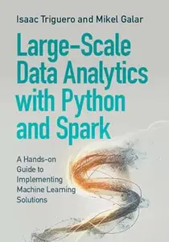

---

**Time:** 12:03:57 (Asia/Tehran)  
**Blog:** hill0  

**Title:** Analysis 2  

**Details:** Deutsch | 2026 | ISBN: 3662711400 | 267 Pages | PDF (True) | 10 MB  

**Link:** http://zavat.pw/ebooks/3662711400.html  

---

**Time:** 12:03:57 (Asia/Tehran)  
**Blog:** hill0  

**Title:** Die Bewertung von Anlagen zur Fischhaltung und von Fischrechten im Binnenland  

**Details:** Deutsch | 2026 | ISBN: 3662724081 | 158 Pages | PDF (True) | 8 MB  

**Link:** http://zavat.pw/ebooks/3662724081.html  

---

**Time:** 12:03:57 (Asia/Tehran)  
**Blog:** hill0  

**Title:** UX Research und User Research  

**Details:** Deutsch | 2026 | ISBN: 3662722348 | 425 Pages | PDF (True) | 23 MB  

**Link:** http://zavat.pw/ebooks/3662722348.html  

---

**Time:** 12:03:57 (Asia/Tehran)  
**Blog:** hill0  

**Title:** Ambulante Neuropsychologie im Bereich der beruflichen Teilhabe: Eine Einführung für Psychotherapeut:innen  

**Details:** Deutsch | 2026 | ISBN: 3662733587 | 61 Pages | PDF (True) | 2 MB  

**Link:** http://zavat.pw/ebooks/3662733587.html  

---

**Time:** 12:03:57 (Asia/Tehran)  
**Blog:** hill0  

**Title:** Praxis der Lappenplastiken  

**Details:** Deutsch | 2026 | ISBN: 3662627698 | 366 Pages | PDF (True) | 430 MB  

**Link:** http://zavat.pw/ebooks/3662627698.html  

---

**Time:** 12:03:57 (Asia/Tehran)  
**Blog:** hill0  

**Title:** The Blue Straggler Mystery  

**Details:** English | 2026 | ISBN: 9819820081 | 296 Pages | EPUB (True) | 6 MB  

**Link:** http://zavat.pw/ebooks/9819820081e.html  

---

**Time:** 12:03:57 (Asia/Tehran)  
**Blog:** hill0  

**Title:** Introduction to Scientific Computation  

**Details:** English | 2026 | ISBN: 9819815487 | 323 Pages | EPUB (True) | 3 MB  

**Link:** http://zavat.pw/ebooks/9819815487.html  

---

**Time:** 12:03:57 (Asia/Tehran)  
**Blog:** hill0  

**Title:** Generative AI in Clinical Practice  

**Details:** English | 2026 | ISBN: 9819822203 | 313 Pages | EPUB (True) | 4.2 MB  

**Link:** http://zavat.pw/ebooks/9819822203.html  

---

**Time:** 12:03:57 (Asia/Tehran)  
**Blog:** hill0  

**Title:** In The Search For Beauty: Unravelling Non-euclidean Geometry  

**Details:** English | 2019 | ISBN: 9813274352 | 248 Pages | PDF EPUB (True) | 8 MB  

**Link:** http://zavat.pw/ebooks/9813274352.html  

---

**Time:** 12:03:57 (Asia/Tehran)  
**Blog:** hill0  

**Title:** Energy Transitions: The AI-energy Nexus  

**Details:** English | 2026 | ISBN: 981982043X | 307 Pages | EPUB (True) | 12 MB  

**Link:** http://zavat.pw/ebooks/981982043Xe.html  

---

**Time:** 12:03:57 (Asia/Tehran)  
**Blog:** crazy-slim  

**Title:** Il Tempo - 7 Giugno 2026  

**Details:** Italiano | 32 pages | PDF | 78.0 MB  

**Link:** http://zavat.pw/newspapers/IlTempo7Giugno2026-01048.html  

---

**Time:** 12:03:57 (Asia/Tehran)  
**Blog:** crazy-slim  

**Title:** California Post - June 7, 2026  

**Details:** English | 80 pages | True PDF | 80.3 MB  

**Link:** http://zavat.pw/newspapers/CaliforniaPostJune72026-59175.html  

---

**Time:** 12:03:57 (Asia/Tehran)  
**Blog:** crazy-slim  

**Title:** The Washington Post - June 7, 2026  

**Details:** English | 72 pages | True PDF | 53.3 MB  

**Link:** http://zavat.pw/newspapers/TheWashingtonPostJune72026-08455.html  

---

**Time:** 12:03:57 (Asia/Tehran)  
**Blog:** crazy-slim  

**Title:** Corriere dello Sport Stadio - 7 Giugno 2026  

**Details:** Italiano | 40 pages | PDF | 89.9 MB  

**Link:** http://zavat.pw/newspapers/CorrieredelloSportStadio7Giugno2026-93698.html  

---

**Time:** 12:03:57 (Asia/Tehran)  
**Blog:** crazy-slim  

**Title:** The Philadelphia Inquirer - June 7, 2026  

**Details:** English | 68 pages | True PDF | 149.3 MB  

**Link:** http://zavat.pw/newspapers/ThePhiladelphiaInquirerJune72026-92400.html  

---

**Time:** 12:03:57 (Asia/Tehran)  
**Blog:** crazy-slim  

**Title:** Trinidad & Tobago Daily Express - 7 June 2026  

**Details:** English | 76 pages | True PDF | 51.6 MB  

**Link:** http://zavat.pw/newspapers/TrinidadTobagoDailyExpress7June2026-50309.html  

---

**Time:** 12:03:57 (Asia/Tehran)  
**Blog:** crazy-slim  

**Title:** The Morning Call Morning Edition - 7 June 2026  

**Details:** English | 61 pages | True PDF | 53.9 MB  

**Link:** http://zavat.pw/newspapers/TheMorningCallMorningEdition7June2026-76668.html  

---

**Time:** 12:03:57 (Asia/Tehran)  
**Blog:** crazy-slim  

**Title:** USA Today - June 7, 2026  

**Details:** English | 12 pages | True PDF | 3.7 MB  

**Link:** http://zavat.pw/newspapers/USATodayJune72026-86368.html  

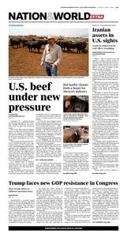

---

**Time:** 12:03:57 (Asia/Tehran)  
**Blog:** crazy-slim  

**Title:** Sun Sentinel - 7 June 2026  

**Details:** English | 65 pages | True PDF | 57.3 MB  

**Link:** http://zavat.pw/newspapers/SunSentinel7June2026-95959.html  

---

**Time:** 12:03:57 (Asia/Tehran)  
**Blog:** crazy-slim  

**Title:** Orlando Sentinel - 7 June 2026  

**Details:** English | 132 pages | True PDF | 103.3 MB  

**Link:** http://zavat.pw/newspapers/OrlandoSentinel7June2026-19812.html  

---

**Time:** 12:03:57 (Asia/Tehran)  
**Blog:** crazy-slim  

**Title:** Chicago Sun-Times - 7 June 2026  

**Details:** English | 80 pages | True PDF | 145.6 MB  

**Link:** http://zavat.pw/newspapers/ChicagoSunTimes7June2026-26875.html  

---

**Time:** 12:03:57 (Asia/Tehran)  
**Blog:** crazy-slim  

**Title:** The Courier-News - 7 June 2026  

**Details:** English | 24 pages | True PDF | 21.1 MB  

**Link:** http://zavat.pw/newspapers/TheCourierNews7June2026-91189.html  

---

**Time:** 12:03:57 (Asia/Tehran)  
**Blog:** crazy-slim  

**Title:** The Beacon-News - 7 June 2026  

**Details:** English | 24 pages | True PDF | 22.2 MB  

**Link:** http://zavat.pw/newspapers/TheBeaconNews7June2026-74152.html  

---

**Time:** 12:03:57 (Asia/Tehran)  
**Blog:** crazy-slim  

**Title:** Post-Tribune - 7 June 2026  

**Details:** English | 24 pages | True PDF | 20.6 MB  

**Link:** http://zavat.pw/newspapers/PostTribune7June2026-32453.html  

---

**Time:** 12:03:57 (Asia/Tehran)  
**Blog:** crazy-slim  

**Title:** Sun Journal - 7 June 2026  

**Details:** English | 73 pages | True PDF | 103.4 MB  

**Link:** http://zavat.pw/newspapers/SunJournal7June2026-81447.html  

---

**Time:** 02:27:02 (Asia/Tehran)  
**Blog:** hill0  

**Title:** Event-based Model Predictive Control  

**Details:** English | 2026 | ISBN: 1394367783 | 212 Pages | EPUB (True) | 12 MB  

**Link:** http://zavat.pw/ebooks/1394367783E.html  

---

**Time:** 02:27:02 (Asia/Tehran)  
**Blog:** hill0  

**Title:** The Principles of Pharmacology  

**Details:** English | 2026 | ISBN: 1394347855 | 125 Pages | EPUB (True) | 2.4 MB  

**Link:** http://zavat.pw/ebooks/1394347855e.html  

---

**Time:** 02:27:02 (Asia/Tehran)  
**Blog:** hill0  

**Title:** The Future of Sapiens and Verticality, Volume 6  

**Details:** English | 2026 | ISBN: 1836690770 | 306 Pages | EPUB (True) | 11 MB  

**Link:** http://zavat.pw/ebooks/1836690770.html  

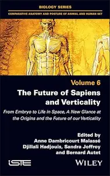

