# Zavat feed - 2026-06-08

---

**Time:** 21:51:05 (Asia/Tehran)  
**Blog:** yoyoloit  

**Title:** Digital Twins: Core Principles and AI Integration  

**Details:** English | 2026 | ISBN: 0443455732 | 396 pages | True PDF | 12.08 MB  

**Link:** http://zavat.pw/ebooks/0443455732.html  

---

**Time:** 21:51:05 (Asia/Tehran)  
**Blog:** yoyoloit  

**Title:** Ontological Prisms: Knowledge Engineering for Enterprise & Agentic Systems  

**Details:** English | 2026 | ISBN: 139435262X | 349 pages | True PDF | 11.39 MB  

**Link:** http://zavat.pw/ebooks/139435262X.html  

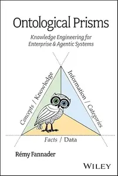

---

**Time:** 21:51:05 (Asia/Tehran)  
**Blog:** yoyoloit  

**Title:** Real-World Electrical Engineering Case Studies  

**Details:** English | 2026 | ISBN: 1394359438 | 355 pages | True PDF EPUB | 9.25 MB  

**Link:** http://zavat.pw/ebooks/1394359438.html  

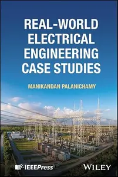

---

**Time:** 21:51:05 (Asia/Tehran)  
**Blog:** yoyoloit  

**Title:** The Digital Mind : Interdisciplinary Approaches to Modern Challenges  

**Details:** English | 2026 | ISBN: 1394361432 | 382 pages | True PDF | 6.82 MB  

**Link:** http://zavat.pw/ebooks/1394361432.html  

---

**Time:** 21:51:05 (Asia/Tehran)  
**Blog:** hill0  

**Title:** Ethical Ed Tech  

**Details:** English | 2026 | ISBN: 139436962X | 414 Pages | EPUB (True) | 0.6 MB  

**Link:** http://zavat.pw/ebooks/139436962X.html  

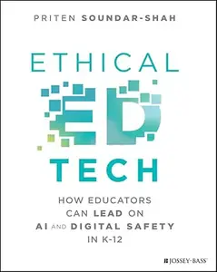

---

**Time:** 21:51:05 (Asia/Tehran)  
**Blog:** hill0  

**Title:** Observability in the AI-Native Era  

**Details:** English | 2026 | ISBN: 9781806389599 | 347 Pages | True EPUB | 14 MB  

**Link:** http://zavat.pw/ebooks/9781806389599et.html  

---

**Time:** 21:51:05 (Asia/Tehran)  
**Blog:** hill0  

**Title:** The Evolution of UK Regional Policy  

**Details:** English | 2026 | ISBN: 1041098766 | 276 Pages | PDF EPUB (True) | 7 MB  

**Link:** http://zavat.pw/ebooks/1041098766.html  

---

**Time:** 21:51:05 (Asia/Tehran)  
**Blog:** hill0  

**Title:** Kinase Inhibitors: Synthesis, Medicinal Effects, and Applications  

**Details:** English | 2026 | ISBN: 1041221150 | 116 Pages | PDF (True) | 6 MB  

**Link:** http://zavat.pw/ebooks/1041221150.html  

---

**Time:** 21:51:05 (Asia/Tehran)  
**Blog:** hill0  

**Title:** Frankfurter Allgemeine Zeitung - 9 Juni 2026  

**Details:** Deutsch | 42 pages | True PDF | 77 MB  

**Link:** http://zavat.pw/newspapers/FAZ-090626.html  

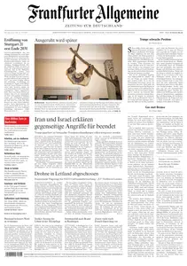

---

**Time:** 21:51:05 (Asia/Tehran)  
**Blog:** hill0  

**Title:** Mosquito Units in the Far Eas (Combat Aircraft Book 163)  

**Details:** English | 2026 | ISBN: 1472870700 | 97 Pages | PDF EPUB (True) | 79 MB  

**Link:** http://zavat.pw/ebooks/1472870700.html  

---

**Time:** 21:51:05 (Asia/Tehran)  
**Blog:** hill0  

**Title:** HumanCorps: Redesigning Organisations for the Wisdom Age  

**Details:** English | 2026 | ISBN: 1041272278 | 401 Pages | PDF (True) | 189 MB  

**Link:** http://zavat.pw/ebooks/1041272278.html  

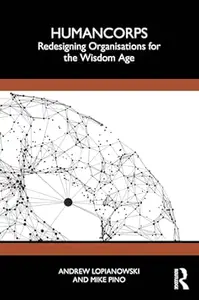

---

**Time:** 21:51:05 (Asia/Tehran)  
**Blog:** hill0  

**Title:** History of Earth Sciences  

**Details:** English | 2026 | ISBN: 1789452317 | 317 Pages | PDF (True) | 32 MB  

**Link:** http://zavat.pw/ebooks/1789452317.html  

---

**Time:** 21:51:05 (Asia/Tehran)  
**Blog:** hill0  

**Title:** Guide to Line Producing  

**Details:** English | 2026 | ISBN: 1041024878 | 278 Pages | PDF (True) | 12 MB  

**Link:** http://zavat.pw/ebooks/1041024878.html  

---

**Time:** 21:51:05 (Asia/Tehran)  
**Blog:** hill0  

**Title:** Essentials of Tests of Dyslexia  

**Details:** English | 2026 | ISBN: 1394382693 | 310 Pages | PDF (True) | 16 MB  

**Link:** http://zavat.pw/ebooks/1394382693.html  

---

**Time:** 21:51:05 (Asia/Tehran)  
**Blog:** hill0  

**Title:** Radiation Detection for Nuclear Physics  

**Details:** English | 2020 | ISBN: 075031429X | 351 Pages | EPUB (True) | 24 MB  

**Link:** http://zavat.pw/ebooks/075031429Xe.html  

---

**Time:** 21:51:05 (Asia/Tehran)  
**Blog:** hill0  

**Title:** Wind Engineering: Fundamentals and Applications  

**Details:** English | 2026 | ISBN: 3032174228 | 315 Pages | PDF EPUB (True) | 134 MB  

**Link:** http://zavat.pw/ebooks/3032174228.html  

---

**Time:** 19:05:44 (Asia/Tehran)  
**Blog:** yoyoloit  

**Title:** Microbial Interventions in Microplastics Remediation  

**Details:** English | 2026 | ISBN: 139438470X | 558 pages | True PDF | 153.09 MB  

**Link:** http://zavat.pw/ebooks/139438470X.html  

---

**Time:** 19:05:44 (Asia/Tehran)  
**Blog:** yoyoloit  

**Title:** Artificial Intelligence for Sustainable Energy Systems 2  

**Details:** English | 2026 | ISBN: 1836691432 | 289 pages | True PDF | 10.87 MB  

**Link:** http://zavat.pw/ebooks/1836691432.html  

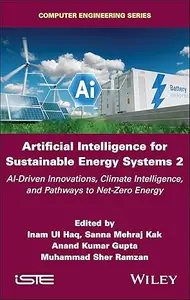

---

**Time:** 19:05:44 (Asia/Tehran)  
**Blog:** yoyoloit  

**Title:** Lens Design for Imaging : Volume 2: Aberration Theory  

**Details:** English | 2026 | ISBN: 3527414584 | 797 pages | True PDF | 71.32 MB  

**Link:** http://zavat.pw/ebooks/3527414584.html  

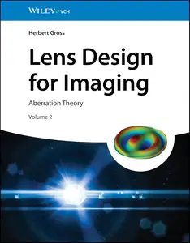

---

**Time:** 19:05:44 (Asia/Tehran)  
**Blog:** yoyoloit  

**Title:** Decision-Making for Earth Resource Development: Quantifying Uncertainty  

**Details:** English | 2026 | ISBN: 1394306768 | 385 pages | True PDF | 22.2 MB  

**Link:** http://zavat.pw/ebooks/1394306768.html  

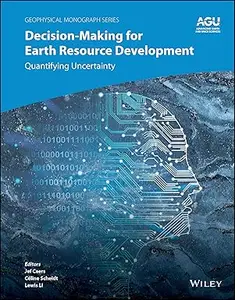

---

**Time:** 19:05:44 (Asia/Tehran)  
**Blog:** yoyoloit  

**Title:** Robust Design in Geotechnical Engineering  

**Details:** English | 2027 | ISBN: 1032914246 | 246 pages | True PDF EPUB | 35.11 MB  

**Link:** http://zavat.pw/ebooks/1032914246.html  

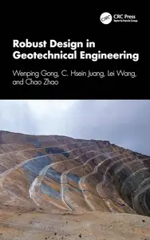

---

**Time:** 19:05:44 (Asia/Tehran)  
**Blog:** yoyoloit  

**Title:** Petroleum and Natural Gas Engineering for Petroleum and Non-Petroleum Professionals  

**Details:** English | 2026 | ISBN: 1032385308 | 573 pages | True PDF EPUB | 351.79 MB  

**Link:** http://zavat.pw/ebooks/1032385308.html  

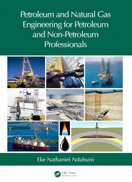

---

**Time:** 19:05:44 (Asia/Tehran)  
**Blog:** yoyoloit  

**Title:** The Weight of Quantum : Quantum Theory and the Structure of Physics  

**Details:** English | 2026 | ISBN: 1041172435 | 342 pages | True PDF | 20.8 MB  

**Link:** http://zavat.pw/ebooks/1041172435.html  

---

**Time:** 19:05:44 (Asia/Tehran)  
**Blog:** yoyoloit  

**Title:** Weakened Ramsey Theory (Discrete Mathematics and Its Applications)  

**Details:** English | 2026 | ISBN: 1032807024 | 190 pages | True PDF | 44.36 MB  

**Link:** http://zavat.pw/ebooks/1032807024.html  

---

**Time:** 19:05:44 (Asia/Tehran)  
**Blog:** yoyoloit  

**Title:** What Every Engineer Should Know About Artificial Intelligence and Big Data  

**Details:** English | 2027 | ISBN: 1032829850 | 316 pages | True PDF EPUB | 22.11 MB  

**Link:** http://zavat.pw/ebooks/1032829850.html  

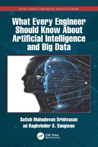

---

**Time:** 19:05:44 (Asia/Tehran)  
**Blog:** yoyoloit  

**Title:** Symmetries of Algebraic Varieties in Two and Three Dimensions: A Computational Approach  

**Details:** English | 2026 | ISBN: 1041088205 | 343 pages | True PDF | 34.59 MB  

**Link:** http://zavat.pw/ebooks/1041088205.html  

---

**Time:** 19:05:44 (Asia/Tehran)  
**Blog:** yoyoloit  

**Title:** Resilient Space Systems Design : An Introduction, 2nd Edition  

**Details:** English | 2026 | ISBN: 1041205457 | 240 pages | True PDF EPUB | 33.18 MB  

**Link:** http://zavat.pw/ebooks/1041205457.html  

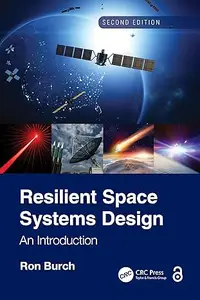

---

**Time:** 19:05:44 (Asia/Tehran)  
**Blog:** yoyoloit  

**Title:** Pattern Language for Game Design, 2nd Edition  

**Details:** English | 2026 | ISBN: 1032824719 | 479 pages | True PDF EPUB | 53.01 MB  

**Link:** http://zavat.pw/ebooks/1032824719.html  

---

**Time:** 19:05:44 (Asia/Tehran)  
**Blog:** yoyoloit  

**Title:** Exploratory Data Analysis Using R  

**Details:** English | 2026 | ISBN: 1032814802 | 573 pages | True PDF | 6.69 MB  

**Link:** http://zavat.pw/ebooks/1032814802.html  

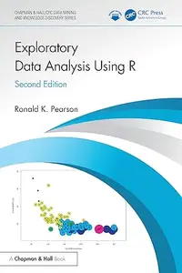

---

**Time:** 19:05:44 (Asia/Tehran)  
**Blog:** yoyoloit  

**Title:** Machine Learning and AI for Precision Plant Epigenetics  

**Details:** English | 2026 | ISBN: 1394380283 | 490 pages | True PDF | 8.25 MB  

**Link:** http://zavat.pw/ebooks/1394380283.html  

---

**Time:** 19:05:44 (Asia/Tehran)  
**Blog:** yoyoloit  

**Title:** Emotional Intelligence-Driven Engineering  

**Details:** English | 2026 | ISBN: 1394389868 | 583 pages | True PDF | 72.95 MB  

**Link:** http://zavat.pw/ebooks/1394389868.html  

---

**Time:** 19:05:44 (Asia/Tehran)  
**Blog:** hill0  

**Title:** Classical and Quantum Information Theory  

**Details:** English | 2026 | ISBN: 1009579525 | 922 Pages | PDF | 10 MB  

**Link:** http://zavat.pw/ebooks/1009579525.html  

---

**Time:** 19:05:44 (Asia/Tehran)  
**Blog:** hill0  

**Title:** Analogical Reasoning in Science  

**Details:** English | 2026 | ISBN: 1009526472 | 80 Pages | PDF (True) | 2 MB  

**Link:** http://zavat.pw/ebooks/1009526472.html  

---

**Time:** 19:05:44 (Asia/Tehran)  
**Blog:** hill0  

**Title:** The 50 Greatest Shipwrecks  

**Details:** English | 2021 | ISBN: 1399008048 | 213 Pages | EPUB (True) | 20 MB  

**Link:** http://zavat.pw/ebooks/1399008048.html  

---

**Time:** 19:05:44 (Asia/Tehran)  
**Blog:** hill0  

**Title:** The Diplomatic Presidency  

**Details:** English | 2022 | ISBN: 0700632867 | 392 Pages | EPUB (True) | 2.5 MB  

**Link:** http://zavat.pw/ebooks/0700632867.html  

---

**Time:** 19:05:44 (Asia/Tehran)  
**Blog:** hill0  

**Title:** Fuzzy Hybrid Computing in Construction Engineering and Management  

**Details:** English | 2018 | ISBN: 1787438694 | 462 Pages | EPUB (True) | 11 MB  

**Link:** http://zavat.pw/ebooks/1787438694E.html  

---

**Time:** 19:05:44 (Asia/Tehran)  
**Blog:** hill0  

**Title:** Ethics for Bioengineering Scientists: Treating Data as Clients  

**Details:** English | 2022 | ISBN: 103205235X | 353 Pages | EPUB (True) | 4 MB  

**Link:** http://zavat.pw/ebooks/103205235X.html  

---

**Time:** 19:05:44 (Asia/Tehran)  
**Blog:** hill0  

**Title:** Claim Your Dream Life  

**Details:** English | 2022 | ISBN: 1631956655 | 135 Pages | EPUB (True) | 1.3 MB  

**Link:** http://zavat.pw/ebooks/1631956655.html  

---

**Time:** 19:05:44 (Asia/Tehran)  
**Blog:** hill0  

**Title:** America the Beautiful Cross Stitch  

**Details:** English | 2021 | ISBN: 0760372276 | 150 Pages | EPUB (True) | 30 MB  

**Link:** http://zavat.pw/ebooks/0760372276.html  

---

**Time:** 19:05:44 (Asia/Tehran)  
**Blog:** hill0  

**Title:** Advanced Technologies for Realizing Sustainable Development Goals 5G, AI, Big Data, Blockchain and Industry 4.0 Applications  

**Details:** English | 2024 | ISBN: 9789815256680 | 343 Pages | PDF (True) | 34 MB  

**Link:** http://zavat.pw/ebooks/9789815256680.html  

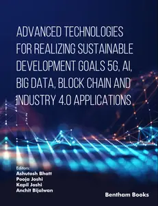

---

**Time:** 19:05:44 (Asia/Tehran)  
**Blog:** hill0  

**Title:** 1001 Chess Exercises for Advanced Club Players  

**Details:** English | 2024 | ISBN: 9083382761 | 2109 Pages | EPUB (True) | 33 MB  

**Link:** http://zavat.pw/ebooks/9083382761.html  

---

**Time:** 19:05:44 (Asia/Tehran)  
**Blog:** hill0  

**Title:** The Sixth Man: A History of the NBA's Best Off the Bench  

**Details:** English | 2022 | ISBN: 147668538X | 130 Pages | EPUB (True) | 16 MB  

**Link:** http://zavat.pw/ebooks/147668538X.html  

---

**Time:** 19:05:44 (Asia/Tehran)  
**Blog:** crazy-slim  

**Title:** Hornby Magazine - July 2026  

**Details:** English | 164 pages | PDF | 212.4 MB  

**Link:** http://zavat.pw/magazines/HornbyMagazineJuly2026-17125.html  

---

**Time:** 19:05:44 (Asia/Tehran)  
**Blog:** crazy-slim  

**Title:** Mobiography - June 2026  

**Details:** English | 136 pages | PDF | 152.2 MB  

**Link:** http://zavat.pw/magazines/MobiographyJune2026-79836.html  

---

**Time:** 19:05:44 (Asia/Tehran)  
**Blog:** crazy-slim  

**Title:** Prairies North Magazine - Summer 2026  

**Details:** English | 68 pages | PDF | 82.7 MB  

**Link:** http://zavat.pw/magazines/PrairiesNorthMagazineSummer2026-84579.html  

---

**Time:** 19:05:44 (Asia/Tehran)  
**Blog:** crazy-slim  

**Title:** Latitudes N.204 -  

**Details:** Italiano | 218 pages | True PDF | 67.2 MB  

**Link:** http://zavat.pw/magazines/LatitudesN204-37705.html  

---

**Time:** 19:05:44 (Asia/Tehran)  
**Blog:** crazy-slim  

**Title:** Learn Hot English - Issue 289 2026  

**Details:** English | 72 pages | PDF | 100.3 MB  

**Link:** http://zavat.pw/magazines/LearnHotEnglishIssue2892026-62057.html  

---

**Time:** 19:05:44 (Asia/Tehran)  
**Blog:** crazy-slim  

**Title:** My Herbs - Issue 36 2026  

**Details:** English | 84 pages | PDF | 52.0 MB  

**Link:** http://zavat.pw/magazines/MyHerbsIssue362026-15876.html  

---

**Time:** 19:05:44 (Asia/Tehran)  
**Blog:** crazy-slim  

**Title:** Haunted Magazine - Issue 50 Part 1 2026  

**Details:** English | 100 pages | PDF | 142.0 MB  

**Link:** http://zavat.pw/magazines/HauntedMagazineIssue50Part12026-88421.html  

---

**Time:** 19:05:44 (Asia/Tehran)  
**Blog:** crazy-slim  

**Title:** Chef & Restaurant UK - June 2026  

**Details:** English | 132 pages | PDF | 112.5 MB  

**Link:** http://zavat.pw/magazines/ChefRestaurantUKJune2026-08082.html  

---

**Time:** 19:05:44 (Asia/Tehran)  
**Blog:** crazy-slim  

**Title:** FlyLife - Winter 2026  

**Details:** English | 100 pages | PDF | 129.1 MB  

**Link:** http://zavat.pw/magazines/FlyLifeWinter2026-31019.html  

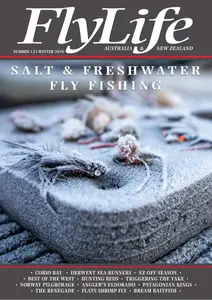

---

**Time:** 19:05:44 (Asia/Tehran)  
**Blog:** crazy-slim  

**Title:** Classic Land Rover - July 2026  

**Details:** English | 100 pages | PDF | 126.1 MB  

**Link:** http://zavat.pw/magazines/ClassicLandRoverJuly2026-17605.html  

---

**Time:** 19:05:44 (Asia/Tehran)  
**Blog:** crazy-slim  

**Title:** Combat Aircraft - July 2026  

**Details:** English | 84 pages | PDF | 104.5 MB  

**Link:** http://zavat.pw/magazines/CombatAircraftJuly2026-38624.html  

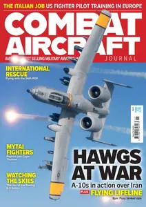

---

**Time:** 19:05:44 (Asia/Tehran)  
**Blog:** crazy-slim  

**Title:** British Railway Modelling - July 2026  

**Details:** English | 150 pages | PDF | 178.0 MB  

**Link:** http://zavat.pw/magazines/BritishRailwayModellingJuly2026-34856.html  

---

**Time:** 19:05:44 (Asia/Tehran)  
**Blog:** crazy-slim  

**Title:** Bus & Coach Preservation - July 2026  

**Details:** English | 68 pages | PDF | 74.4 MB  

**Link:** http://zavat.pw/magazines/BusCoachPreservationJuly2026-86030.html  

---

**Time:** 19:05:44 (Asia/Tehran)  
**Blog:** crazy-slim  

**Title:** Autism Parenting - Issue 192 2026  

**Details:** English | 57 pages | PDF | 53.1 MB  

**Link:** http://zavat.pw/magazines/AutismParentingIssue1922026-99464.html  

---

**Time:** 19:05:44 (Asia/Tehran)  
**Blog:** crazy-slim  

**Title:** Cape Times - 8 June 2026  

**Details:** English | 14 pages | True PDF | 15.1 MB  

**Link:** http://zavat.pw/newspapers/CapeTimes8June2026-99657.html  

---

**Time:** 15:21:32 (Asia/Tehran)  
**Blog:** yoyoloit  

**Title:** Foundations of Grammar: Beyond Standardized American English  

**Details:** English | 2026 | ISBN: 135046287X | 385 pages | True PDF EPUB | 5.73 MB  

**Link:** http://zavat.pw/ebooks/135046287X.html  

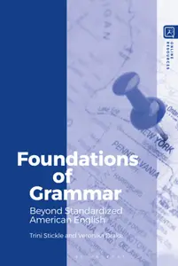

---

**Time:** 15:21:32 (Asia/Tehran)  
**Blog:** yoyoloit  

**Title:** Be Expert with Map and Compass: The Complete Orienteering Handbook, 4th Edition  

**Details:** English | 2026 | ISBN: 1394375611 | 291 pages | True PDF | 29.21 MB  

**Link:** http://zavat.pw/ebooks/1394375611a.html  

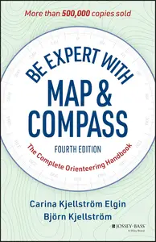

---

**Time:** 15:21:32 (Asia/Tehran)  
**Blog:** yoyoloit  

**Title:** Ubuntu Linux Bible, 11th Edition  

**Details:** English | 2025 | ISBN: 1394349769 | 705 pages | True PDF | 6.43 MB  

**Link:** http://zavat.pw/ebooks/1394349769a.html  

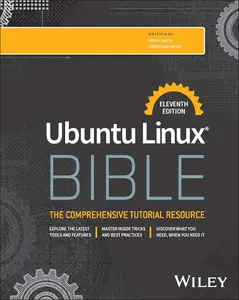

---

**Time:** 15:21:32 (Asia/Tehran)  
**Blog:** yoyoloit  

**Title:** Terpyridines: Multifaceted Ligands for Diverse Applications  

**Details:** English | 2026 | ISBN: 3527354522 | 547 pages | True PDF EPUB | 124.34 MB  

**Link:** http://zavat.pw/ebooks/3527354522.html  

---

**Time:** 15:21:32 (Asia/Tehran)  
**Blog:** yoyoloit  

**Title:** New Space: From Low Earth Orbit to the Moon and Beyond  

**Details:** English | 2025 | ISBN: 1394292929 | 466 pages | True PDF EPUB | 174.29 MB  

**Link:** http://zavat.pw/ebooks/1394292929.html  

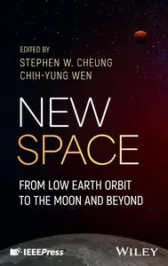

---

**Time:** 15:21:32 (Asia/Tehran)  
**Blog:** yoyoloit  

**Title:** Multiscale Structural Mechanics: Top-Down Modeling of Composite Structures Using Mechanics of Structure Genome  

**Details:** English | 2025 | ISBN: 9781119092698 | 462 pages | True PDF EPUB | 34.19 MB  

**Link:** http://zavat.pw/ebooks/1119092671.html  

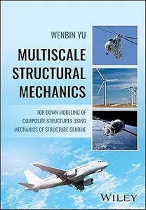

---

**Time:** 15:21:32 (Asia/Tehran)  
**Blog:** yoyoloit  

**Title:** Nonvolatile Memory and Selector Devices, 2 Volumes: Technology and Applications  

**Details:** English | 2026 | ISBN: 3527353992 | 873 pages | True PDF EPUB | 176.65 MB  

**Link:** http://zavat.pw/ebooks/3527353992.html  

---

**Time:** 15:21:32 (Asia/Tehran)  
**Blog:** yoyoloit  

**Title:** The Meeting Book How the Best Companies Meet Better  

**Details:** English | 2026 | ISBN: 139439179X | 238 pages | True PDF | 976.49 KB  

**Link:** http://zavat.pw/ebooks/1394384580a.html  

---

**Time:** 15:21:32 (Asia/Tehran)  
**Blog:** hill0  

**Title:** FIFA World Cup 2026 Complete Guide  

**Details:** English | 2026 | ASIN: B0H276X3SL | 206 Pages | True EPUB | 1 MB  

**Link:** http://zavat.pw/ebooks/B0H276X3SL.html  

---

**Time:** 15:21:32 (Asia/Tehran)  
**Blog:** hill0  

**Title:** Materials, Manufacturing Processes And Devices  

**Details:** English | 2025 | ISBN: 9819818427 | 270 Pages | EPUB (True) | 39 MB  

**Link:** http://zavat.pw/ebooks/9819818427e.html  

---

**Time:** 15:21:32 (Asia/Tehran)  
**Blog:** hill0  

**Title:** Semantic Computing And AI  

**Details:** English | 2026 | ISBN: 9819818516 | 469 Pages | EPUB (True) | 15 MB  

**Link:** http://zavat.pw/ebooks/9819818516E.html  

---

**Time:** 15:21:32 (Asia/Tehran)  
**Blog:** hill0  

**Title:** Psychosocial Interventions For Chronic Illness  

**Details:** English | 2026 | ISBN: 9819817315 | 449 Pages | EPUB (True) | 15 MB  

**Link:** http://zavat.pw/ebooks/9819817315E.html  

---

**Time:** 15:21:32 (Asia/Tehran)  
**Blog:** hill0  

**Title:** Introduction To Sediment Geochemistry  

**Details:** English | 2026 | ISBN: 9819821266 | 271 Pages | EPUB (True) | 9 MB  

**Link:** http://zavat.pw/ebooks/9819821266E.html  

---

**Time:** 15:21:32 (Asia/Tehran)  
**Blog:** hill0  

**Title:** Inverse Semigroups (2nd Edition)  

**Details:** English | 2026 | ISBN: 9819816769 | 478 Pages | EPUB (True) | 3.4 MB  

**Link:** http://zavat.pw/ebooks/9819816769E.html  

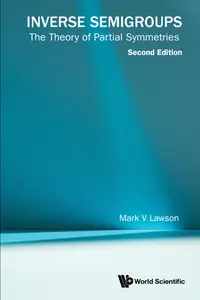

---

**Time:** 15:21:32 (Asia/Tehran)  
**Blog:** hill0  

**Title:** Interdisciplinarity In The Sciences  

**Details:** English | 2026 | ISBN: 9819815088 | 213 Pages | EPUB (True) | 10 MB  

**Link:** http://zavat.pw/ebooks/9819815088e.html  

---

**Time:** 15:21:32 (Asia/Tehran)  
**Blog:** hill0  

**Title:** How Impacts Are Created In Academia  

**Details:** English | 2026 | ISBN: 9819808421 | 232 Pages | EPUB (True) | 3 MB  

**Link:** http://zavat.pw/ebooks/9819808421e.html  

---

**Time:** 15:21:32 (Asia/Tehran)  
**Blog:** hill0  

**Title:** Crafting Economic Security in the Indo-Pacific Region: Concepts, Practices and New Dynamics  

**Details:** English | 2026 | ISBN: 9819817242 | 322 Pages | PDF EPUB (True) | 15 MB  

**Link:** http://zavat.pw/ebooks/9819817242.html  

---

**Time:** 15:21:32 (Asia/Tehran)  
**Blog:** hill0  

**Title:** Computational Approaches To Policy Challenges  

**Details:** English | 2026 | ISBN: 9819826683 | 232 Pages | PDF EPUB (True) | 37 MB  

**Link:** http://zavat.pw/ebooks/9819826683t.html  

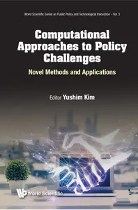

---

**Time:** 15:21:32 (Asia/Tehran)  
**Blog:** hill0  

**Title:** Laser Beam Profiling: Cost-Effective Solutions  

**Details:** English | 2022 | ISBN: 0750338334 | 63 Pages | PDF EPUB (True) | 19 MB  

**Link:** http://zavat.pw/ebooks/0750338334.html  

---

**Time:** 15:21:32 (Asia/Tehran)  
**Blog:** hill0  

**Title:** Electrochemical Capacitors  

**Details:** English | 2023 | ISBN: 0750350407 | 243 Pages | PDF EPUB (True) | 100 MB  

**Link:** http://zavat.pw/ebooks/0750350407.html  

---

**Time:** 15:21:32 (Asia/Tehran)  
**Blog:** hill0  

**Title:** Le Temps - 8 Juin 2026  

**Details:** Français | 20 pages | True PDF | 18 MB  

**Link:** http://zavat.pw/newspapers/le-temps-20260608.html  

---

**Time:** 15:21:32 (Asia/Tehran)  
**Blog:** crazy-slim  

**Title:** Hartford Courant - 8 June 2026  

**Details:** English | 24 pages | True PDF | 39.9 MB  

**Link:** http://zavat.pw/newspapers/HartfordCourant8June2026-59167.html  

---

**Time:** 15:21:32 (Asia/Tehran)  
**Blog:** crazy-slim  

**Title:** The Boston Globe - 8 June 2026  

**Details:** English | 32 pages | True PDF | 6.4 MB  

**Link:** http://zavat.pw/newspapers/TheBostonGlobe8June2026-58313.html  

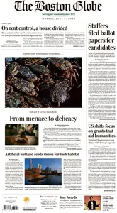

---

**Time:** 15:21:32 (Asia/Tehran)  
**Blog:** crazy-slim  

**Title:** Los Angeles Times - 8 June 2026  

**Details:** English | 32 pages | True PDF | 15.4 MB  

**Link:** http://zavat.pw/newspapers/LosAngelesTimes8June2026-48597.html  

---

**Time:** 15:21:32 (Asia/Tehran)  
**Blog:** crazy-slim  

**Title:** The Baltimore Sun - 8 June 2026  

**Details:** English | 28 pages | True PDF | 25.5 MB  

**Link:** http://zavat.pw/newspapers/TheBaltimoreSun8June2026-01008.html  

---

**Time:** 15:21:32 (Asia/Tehran)  
**Blog:** crazy-slim  

**Title:** The Baltimore Sun Carroll County Times - 8 June 2026  

**Details:** English | 28 pages | True PDF | 23.9 MB  

**Link:** http://zavat.pw/newspapers/TheBaltimoreSunCarrollCountyTimes8June2026-98634.html  

---

**Time:** 15:21:32 (Asia/Tehran)  
**Blog:** crazy-slim  

**Title:** The Washington Times - June 8, 2026  

**Details:** English | 22 pages | True PDF | 31.2 MB  

**Link:** http://zavat.pw/newspapers/TheWashingtonTimesJune82026-88762.html  

---

**Time:** 15:21:32 (Asia/Tehran)  
**Blog:** crazy-slim  

**Title:** The Morning Call Morning Edition - 8 June 2026  

**Details:** English | 24 pages | True PDF | 18.7 MB  

**Link:** http://zavat.pw/newspapers/TheMorningCallMorningEdition8June2026-07236.html  

---

**Time:** 15:21:32 (Asia/Tehran)  
**Blog:** crazy-slim  

**Title:** The Washington Post - June 8, 2026  

**Details:** English | 44 pages | True PDF | 21.5 MB  

**Link:** http://zavat.pw/newspapers/TheWashingtonPostJune82026-01493.html  

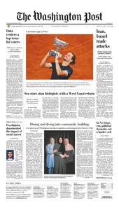

---

**Time:** 15:21:32 (Asia/Tehran)  
**Blog:** crazy-slim  

**Title:** The Philadelphia Inquirer - June 8, 2026  

**Details:** English | 28 pages | True PDF | 31.5 MB  

**Link:** http://zavat.pw/newspapers/ThePhiladelphiaInquirerJune82026-92409.html  

---

**Time:** 15:21:32 (Asia/Tehran)  
**Blog:** crazy-slim  

**Title:** The Dallas Morning News - June 8, 2026  

**Details:** English | 28 pages | True PDF | 15.9 MB  

**Link:** http://zavat.pw/newspapers/TheDallasMorningNewsJune82026-24101.html  

---

**Time:** 15:21:32 (Asia/Tehran)  
**Blog:** crazy-slim  

**Title:** Sun Sentinel - 8 June 2026  

**Details:** English | 28 pages | True PDF | 19.7 MB  

**Link:** http://zavat.pw/newspapers/SunSentinel8June2026-95940.html  

---

**Time:** 15:21:32 (Asia/Tehran)  
**Blog:** crazy-slim  

**Title:** The Beacon-News - 8 June 2026  

**Details:** English | 16 pages | True PDF | 7.9 MB  

**Link:** http://zavat.pw/newspapers/TheBeaconNews8June2026-04412.html  

---

**Time:** 15:21:32 (Asia/Tehran)  
**Blog:** crazy-slim  

**Title:** Sun Journal - 8 June 2026  

**Details:** English | 12 pages | True PDF | 18.0 MB  

**Link:** http://zavat.pw/newspapers/SunJournal8June2026-70609.html  

---

**Time:** 15:21:32 (Asia/Tehran)  
**Blog:** crazy-slim  

**Title:** Orlando Sentinel - 8 June 2026  

**Details:** English | 25 pages | True PDF | 18.7 MB  

**Link:** http://zavat.pw/newspapers/OrlandoSentinel8June2026-43090.html  

---

**Time:** 15:21:32 (Asia/Tehran)  
**Blog:** crazy-slim  

**Title:** Post-Tribune - 8 June 2026  

**Details:** English | 16 pages | True PDF | 9.1 MB  

**Link:** http://zavat.pw/newspapers/PostTribune8June2026-02451.html  

---

**Time:** 10:06:56 (Asia/Tehran)  
**Blog:** yoyoloit  

**Title:** GMAT Official Guide 2026 - 2027: Book + Online Question Bank  

**Details:** English | 2026 | ISBN: 1394412800 | 994 pages | True EPUB | 40.41 MB  

**Link:** http://zavat.pw/ebooks/1394412800.html  

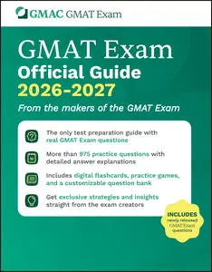

---

**Time:** 10:06:56 (Asia/Tehran)  
**Blog:** yoyoloit  

**Title:** GMAT Official Guide Verbal Review 2026 - 2027: Book + Online Question Bank  

**Details:** English | 2026 | ISBN: 1394412673 | 416 pages | True EPUB | 3.68 MB  

**Link:** http://zavat.pw/ebooks/1394412673.html  

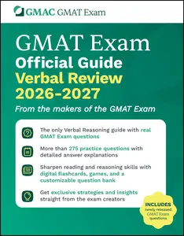

---

**Time:** 10:06:56 (Asia/Tehran)  
**Blog:** yoyoloit  

**Title:** GMAT Official Guide Quantitative Review 2026 - 2027: Book + Online Question Bank  

**Details:** English | 2026 | ISBN: 1394412657 | 208 pages | True EPUB | 23.73 MB  

**Link:** http://zavat.pw/ebooks/1394412657.html  

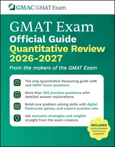

---

**Time:** 10:06:56 (Asia/Tehran)  
**Blog:** yoyoloit  

**Title:** American Catholics: An Encyclopedic History  

**Details:** English | 2026 | ISBN: 9798216970156 | 467 pages | True PDF EPUB | 15.42 MB  

**Link:** http://zavat.pw/ebooks/9798216970156.html  

---

**Time:** 10:06:56 (Asia/Tehran)  
**Blog:** crazy-slim  

**Title:** Canadian Geographic - July-August 2026  

**Details:** English | 84 pages | True PDF | 27.5 MB  

**Link:** http://zavat.pw/magazines/CanadianGeographicJulyAugust2026-91891.html  

---

**Time:** 10:06:56 (Asia/Tehran)  
**Blog:** crazy-slim  

**Title:** Lottomio del Giovedì - 9 Giugno 2026  

**Details:** Italiano | 31 pages | True PDF | 17.0 MB  

**Link:** http://zavat.pw/magazines/LottomiodelGioved%C3%AC9Giugno2026-28628.html  

---

**Time:** 10:06:56 (Asia/Tehran)  
**Blog:** crazy-slim  

**Title:** The Economic Times Wealth - June 8, 2026  

**Details:** English | 24 pages | True PDF | 5.7 MB  

**Link:** http://zavat.pw/magazines/TheEconomicTimesWealthJune82026-49359.html  

---

**Time:** 10:06:56 (Asia/Tehran)  
**Blog:** crazy-slim  

**Title:** Aftonbladet - 8 Juni 2026  

**Details:** Svenska | 32 pages | PDF | 30.9 MB  

**Link:** http://zavat.pw/newspapers/Aftonbladet8Juni2026-25761.html  

---

**Time:** 10:06:56 (Asia/Tehran)  
**Blog:** crazy-slim  

**Title:** Western Morning News - 8 June 2026  

**Details:** English | 40 pages | PDF | 50.5 MB  

**Link:** http://zavat.pw/newspapers/WesternMorningNews8June2026-44669.html  

---

**Time:** 10:06:56 (Asia/Tehran)  
**Blog:** crazy-slim  

**Title:** Record - 8 Junho 2026  

**Details:** Portuguese | 32 pages | True PDF | 18.5 MB  

**Link:** http://zavat.pw/newspapers/Record8Junho2026-95695.html  

---

**Time:** 10:06:56 (Asia/Tehran)  
**Blog:** crazy-slim  

**Title:** Sportbladet - 8 Juni 2026  

**Details:** Svenska | 12 pages | PDF | 13.4 MB  

**Link:** http://zavat.pw/newspapers/Sportbladet8Juni2026-25020.html  

---

**Time:** 10:06:56 (Asia/Tehran)  
**Blog:** crazy-slim  

**Title:** Midi Libre Rodez - 8 Juin 2026  

**Details:** Français | 34 pages | PDF | 42.4 MB  

**Link:** http://zavat.pw/newspapers/MidiLibreRodez8Juin2026-57085.html  

---

**Time:** 10:06:56 (Asia/Tehran)  
**Blog:** crazy-slim  

**Title:** Midi Libre Nimes - 8 Juin 2026  

**Details:** Français | 38 pages | PDF | 49.4 MB  

**Link:** http://zavat.pw/newspapers/MidiLibreNimes8Juin2026-30234.html  

---

**Time:** 10:06:56 (Asia/Tehran)  
**Blog:** crazy-slim  

**Title:** Las Provincias - 8 Junio 2026  

**Details:** Español | 64 pages | True PDF | 9.5 MB  

**Link:** http://zavat.pw/newspapers/LasProvincias8Junio2026-59809.html  

---

**Time:** 10:06:56 (Asia/Tehran)  
**Blog:** crazy-slim  

**Title:** Western Mail - 8 June 2026  

**Details:** English | 48 pages | PDF | 58.2 MB  

**Link:** http://zavat.pw/newspapers/WesternMail8June2026-87378.html  

---

**Time:** 10:06:56 (Asia/Tehran)  
**Blog:** crazy-slim  

**Title:** L'Indépendant Narbonne - 8 Juin 2026  

**Details:** Français | 32 pages | PDF | 40.6 MB  

**Link:** http://zavat.pw/newspapers/LInd%C3%A9pendantNarbonne8Juin2026-14199.html  

---

**Time:** 10:06:56 (Asia/Tehran)  
**Blog:** crazy-slim  

**Title:** L'Indépendant Catalan - 8 Juin 2026  

**Details:** Français | 34 pages | PDF | 43.8 MB  

**Link:** http://zavat.pw/newspapers/LInd%C3%A9pendantCatalan8Juin2026-61537.html  

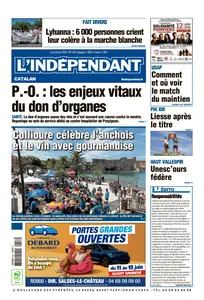

---

**Time:** 10:06:56 (Asia/Tehran)  
**Blog:** crazy-slim  

**Title:** L'Indépendant Carcassonne - 8 Juin 2026  

**Details:** Français | 32 pages | PDF | 41.0 MB  

**Link:** http://zavat.pw/newspapers/LInd%C3%A9pendantCarcassonne8Juin2026-92680.html  

---

**Time:** 10:06:56 (Asia/Tehran)  
**Blog:** crazy-slim  

**Title:** Western Daily Press - 8 June 2026  

**Details:** English | 40 pages | PDF | 49.8 MB  

**Link:** http://zavat.pw/newspapers/WesternDailyPress8June2026-40206.html  

---

**Time:** 02:40:15 (Asia/Tehran)  
**Blog:** IrGens  

**Title:** Mao and the Sino-Soviet Split, 1959–1973: A New History  

**Details:** English | September 15, 2018 | ISBN: 149851166X, 1498511686, 9781498511674 | True EPUB/PDF | 342 pages | 1.2/2.2 MB  

**Link:** http://zavat.pw/ebooks/149851166X-epub.html  

---

**Time:** 02:40:15 (Asia/Tehran)  
**Blog:** IrGens  

**Title:** White Power: Policing American Slavery  

**Details:** English | May 19, 2026 | ISBN: 1469694840, 9781469688862 | True EPUB | 320 pages | 6.2 MB  

**Link:** http://zavat.pw/ebooks/1469694840.html  

---

**Time:** 01:29:24 (Asia/Tehran)  
**Blog:** IrGens  

**Title:** Spirits of Empire: How Settler Colonialism Made American Religion  

**Details:** English | March 17, 2026 | ISBN: 1469693623, 9781469686790 | True EPUB | 368 pages | 7.3 MB  

**Link:** http://zavat.pw/ebooks/1469693623.html  

---

**Time:** 01:29:24 (Asia/Tehran)  
**Blog:** IrGens  

**Title:** God Bless the Pill: The Surprising History of Contraception and Sexuality in American Religion  

**Details:** English | April 14, 2026 | ISBN: 1469693429, 1469693437 | True EPUB | 260 pages | 3 MB  

**Link:** http://zavat.pw/ebooks/1469693429.html  

---

**Time:** 01:29:24 (Asia/Tehran)  
**Blog:** IrGens  

**Title:** Death in the Strike Zone: The Mystery of America’s First Baseball Hero  

**Details:** English | March 24, 2026 | ISBN: 1567927599, 9781567927603 | True EPUB | 192 pages | 8.6 MB  

**Link:** http://zavat.pw/ebooks/1567927599.html  

---

**Time:** 01:29:24 (Asia/Tehran)  
**Blog:** IrGens  

**Title:** The Game at the End of the World  

**Details:** English | May 5, 2026 | ISBN: 1632064111, 9781632064127 | True EPUB | 296 pages | 2.3 MB  

**Link:** http://zavat.pw/ebooks/1632064111.html  

---

**Time:** 01:29:24 (Asia/Tehran)  
**Blog:** IrGens  

**Title:** Being Patient: Close Encounters in Cancer World  

**Details:** English | May 1, 2026 | ISBN: 1742237916, 9781761179433 | True EPUB | 208 pages | 1.2 MB  

**Link:** http://zavat.pw/ebooks/1742237916.html  

---

**Time:** 01:29:24 (Asia/Tehran)  
**Blog:** hill0  

**Title:** The Baltic Dry Index  

**Details:** English | 2026 | ISBN: 3032210720 | 128 Pages | PDF EPUB (True) | 14 MB  

**Link:** http://zavat.pw/ebooks/3032210720.html  

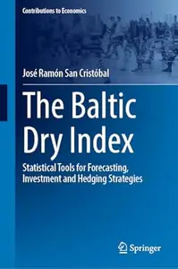

---

**Time:** 01:29:24 (Asia/Tehran)  
**Blog:** hill0  

**Title:** Sensible Design  

**Details:** English | 2026 | ISBN: 3032103657 | 251 Pages | PDF EPUB (True) | 26 MB  

**Link:** http://zavat.pw/ebooks/3032103657.html  

---

**Time:** 01:29:24 (Asia/Tehran)  
**Blog:** hill0  

**Title:** Commoning Cultural Value  

**Details:** English | 2026 | ISBN: 3032190630 | 190 Pages | PDF EPUB (True) | 3.3 MB  

**Link:** http://zavat.pw/ebooks/3032190630.html  

---

**Time:** 01:29:24 (Asia/Tehran)  
**Blog:** hill0  

**Title:** From Gridlock to Governance  

**Details:** English | 2026 | ISBN: 3032194253 | 260 Pages | PDF EPUB (True) | 6 MB  

**Link:** http://zavat.pw/ebooks/3032194253.html  

