# Zavat feed - 2026-06-09

---

**Time:** 14:01:01 (Asia/Tehran)  
**Blog:** IrGens  

**Title:** Query and Explore Data in Databricks SQL  

**Details:** .MP4, AVC, 1920x1080, 30 fps | English, AAC, 2 Ch | 1h 15m | 208 MB  

**Link:** http://zavat.pw/ebooks/databricks-sql-query-explore-data.html  

---

**Time:** 14:01:01 (Asia/Tehran)  
**Blog:** IrGens  

**Title:** Vector Search for General Databases  

**Details:** .MP4, AVC, 1920x1080, 30 fps | English, AAC, 2 Ch | 51m | 180 MB  

**Link:** http://zavat.pw/ebooks/vector-search-general-databases.html  

---

**Time:** 14:01:01 (Asia/Tehran)  
**Blog:** IrGens  

**Title:** Putting PowerShell to Work  

**Details:** .MP4, AVC, 1920x1080, 30 fps | English, AAC, 2 Ch | 2h 43m | 312 MB  

**Link:** http://zavat.pw/ebooks/putting-powershell-work.html  

---

**Time:** 14:01:01 (Asia/Tehran)  
**Blog:** IrGens  

**Title:** Authentication and Authorization in ASP.NET Core 10 Blazor  

**Details:** .MP4, AVC, 1920x1080, 30 fps | English, AAC, 2 Ch | 2h 47m | 737 MB  

**Link:** http://zavat.pw/ebooks/authentication-authorization-asp-dot-net-core-10-blazor.html  

---

**Time:** 14:01:01 (Asia/Tehran)  
**Blog:** hill0  

**Title:** Recent Research on Environmental Earth Sciences, Geomorphology, Soil Science, Paleoclimate, and Karst  

**Details:** English | 2026 | ISBN: 3032209897 | 494 Pages | PDF (True) | 66 MB  

**Link:** http://zavat.pw/ebooks/3032209897.html  

---

**Time:** 14:01:01 (Asia/Tehran)  
**Blog:** hill0  

**Title:** Trust in Agile Teams  

**Details:** English | 2026 | ISBN: 3032219620 | 191 Pages | PDF EPUB (True) | 1.3 MB  

**Link:** http://zavat.pw/ebooks/3032219620.html  

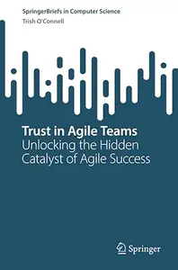

---

**Time:** 14:01:01 (Asia/Tehran)  
**Blog:** crazy-slim  

**Title:** MCG Mantova Chiama Garda - Giugno-Luglio 2026  

**Details:** Italiano | 162 pages | True PDF | 53.0 MB  

**Link:** http://zavat.pw/magazines/MCGMantovaChiamaGardaGiugnoLuglio2026-51727.html  

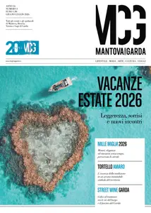

---

**Time:** 14:01:01 (Asia/Tehran)  
**Blog:** crazy-slim  

**Title:** The Spectator World - 8 June 2026  

**Details:** English | 68 pages | True PDF | 122.2 MB  

**Link:** http://zavat.pw/magazines/TheSpectatorWorld8June2026-56160.html  

---

**Time:** 14:01:01 (Asia/Tehran)  
**Blog:** crazy-slim  

**Title:** Literatur Spiegel - September 2017  

**Details:** Deutsch | 20 pages | True PDF | 5.3 MB  

**Link:** http://zavat.pw/magazines/LiteraturSpiegelSeptember2017-62301.html  

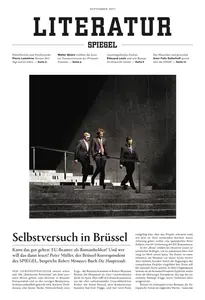

---

**Time:** 14:01:01 (Asia/Tehran)  
**Blog:** crazy-slim  

**Title:** Literatur Spiegel - Oktober 2017  

**Details:** Deutsch | 24 pages | True PDF | 6.1 MB  

**Link:** http://zavat.pw/magazines/LiteraturSpiegelOktober2017-53436.html  

---

**Time:** 14:01:01 (Asia/Tehran)  
**Blog:** crazy-slim  

**Title:** Literatur Spiegel - November 2017  

**Details:** Deutsch | 20 pages | True PDF | 5.4 MB  

**Link:** http://zavat.pw/magazines/LiteraturSpiegelNovember2017-36428.html  

---

**Time:** 14:01:01 (Asia/Tehran)  
**Blog:** crazy-slim  

**Title:** Literatur Spiegel - März 2017  

**Details:** Deutsch | 20 pages | True PDF | 4.3 MB  

**Link:** http://zavat.pw/magazines/LiteraturSpiegelM%C3%A4rz2017-42109.html  

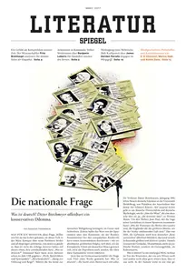

---

**Time:** 14:01:01 (Asia/Tehran)  
**Blog:** crazy-slim  

**Title:** The Maine Sportsman - September 2016  

**Details:** English | 84 pages | True PDF | 98.1 MB  

**Link:** http://zavat.pw/magazines/TheMaineSportsmanSeptember2016-44217.html  

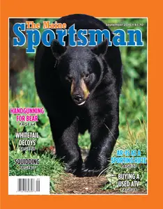

---

**Time:** 14:01:01 (Asia/Tehran)  
**Blog:** crazy-slim  

**Title:** Literatur Spiegel - Juni-Juli  2017  

**Details:** Deutsch | 20 pages | True PDF | 4.6 MB  

**Link:** http://zavat.pw/magazines/LiteraturSpiegelJuniJuli2017-20857.html  

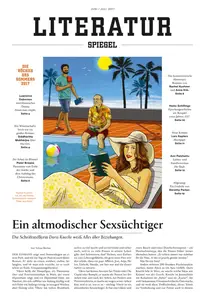

---

**Time:** 14:01:01 (Asia/Tehran)  
**Blog:** crazy-slim  

**Title:** Literatur Spiegel - Mai 2017  

**Details:** Deutsch | 20 pages | True PDF | 5.0 MB  

**Link:** http://zavat.pw/magazines/LiteraturSpiegelMai2017-62473.html  

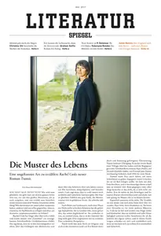

---

**Time:** 14:01:01 (Asia/Tehran)  
**Blog:** crazy-slim  

**Title:** Literatur Spiegel - Februar 2017  

**Details:** Deutsch | 20 pages | True PDF | 5.3 MB  

**Link:** http://zavat.pw/magazines/LiteraturSpiegelFebruar2017-15810.html  

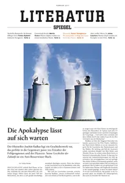

---

**Time:** 14:01:01 (Asia/Tehran)  
**Blog:** crazy-slim  

**Title:** Literatur Spiegel - Dezember 2016 - Januar 2017  

**Details:** Deutsch | 29 pages | True PDF | 10.8 MB  

**Link:** http://zavat.pw/magazines/LiteraturSpiegelDezember2016Januar2017-38086.html  

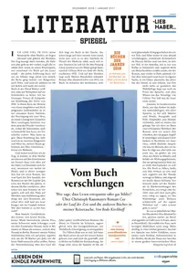

---

**Time:** 14:01:01 (Asia/Tehran)  
**Blog:** crazy-slim  

**Title:** Kultur Spiegel - September 2013  

**Details:** Deutsch | 48 pages | True PDF | 11.7 MB  

**Link:** http://zavat.pw/magazines/KulturSpiegelSeptember2013-79883.html  

---

**Time:** 14:01:01 (Asia/Tehran)  
**Blog:** crazy-slim  

**Title:** Literatur Spiegel - August 2017  

**Details:** Deutsch | 20 pages | True PDF | 5.1 MB  

**Link:** http://zavat.pw/magazines/LiteraturSpiegelAugust2017-56735.html  

---

**Time:** 14:01:01 (Asia/Tehran)  
**Blog:** crazy-slim  

**Title:** Literatur Spiegel - April 2017  

**Details:** Deutsch | 24 pages | True PDF | 5.7 MB  

**Link:** http://zavat.pw/magazines/LiteraturSpiegelApril2017-58187.html  

---

**Time:** 14:01:01 (Asia/Tehran)  
**Blog:** crazy-slim  

**Title:** Kultur Spiegel - November 2013  

**Details:** Deutsch | 64 pages | True PDF | 12.0 MB  

**Link:** http://zavat.pw/magazines/KulturSpiegelNovember2013-08562.html  

---

**Time:** 10:13:13 (Asia/Tehran)  
**Blog:** yoyoloit  

**Title:** Force of Nature: Understanding Evolution's Deepest Logic―and Putting It to Use  

**Details:** English | 2026 | ISBN: 039388192X | 288 pages | True EPUB | 1.2 MB  

**Link:** http://zavat.pw/ebooks/039388192X.html  

---

**Time:** 10:13:13 (Asia/Tehran)  
**Blog:** yoyoloit  

**Title:** Unfuck Your Wellness: Using Science to Evaluate Acupuncture, Hypnosis, Aromatherapy, Cannabis, and Other Healing Modalities  

**Details:** English | 2026 | ISBN: 1648415997 | 192 pages | True EPUB | 12.23 MB  

**Link:** http://zavat.pw/ebooks/1648415997.html  

---

**Time:** 10:13:13 (Asia/Tehran)  
**Blog:** yoyoloit  

**Title:** Kylian Mbappé: The Definitive Biography  

**Details:** English | 2026 | ISBN: 9798897102426 | 352 pages | True EPUB | 6.14 MB  

**Link:** http://zavat.pw/ebooks/9798897102426.html  

---

**Time:** 10:13:13 (Asia/Tehran)  
**Blog:** IrGens  

**Title:** Cloud Native Platform Engineering  

**Details:** ISBN: 9780135894750 | .MKV, AVC, 1280x720, 30 fps | English, AAC, 2 Ch | 10h 30m | 17.12 GB  

**Link:** http://zavat.pw/ebooks/9780135894750.html  

---

**Time:** 10:13:13 (Asia/Tehran)  
**Blog:** IrGens  

**Title:** The Company We Keep: Friendship, Connection, and Redefining What It Means to Grow Together  

**Details:** English | May 19, 2026 | ISBN: 0593855434, 9798217045396 | True EPUB | 256 pages | 3.7 MB  

**Link:** http://zavat.pw/ebooks/0593855434.html  

---

**Time:** 10:13:13 (Asia/Tehran)  
**Blog:** IrGens  

**Title:** Freedom: Essays  

**Details:** English | June 9, 2026 | ISBN: 073522174X, 9780735221758 | True EPUB | 256 pages | 1.3 MB  

**Link:** http://zavat.pw/ebooks/073522174X.html  

---

**Time:** 10:13:13 (Asia/Tehran)  
**Blog:** IrGens  

**Title:** The Yahoo Boys: Love, Deception, and the Real Lives of Nigeria's Romance Scammers  

**Details:** English | June 9, 2026 | ISBN: 0374609306, 9780374609313 | True EPUB | 304 pages | 5.9 MB  

**Link:** http://zavat.pw/ebooks/0374609306.html  

---

**Time:** 10:13:13 (Asia/Tehran)  
**Blog:** IrGens  

**Title:** Contested Continent: The Struggle for North America, c. 1000-1680  

**Details:** English | June 1, 2026 | ISBN: 0195372786, 9780190090654 | True EPUB | 752 pages | 20.6 MB  

**Link:** http://zavat.pw/ebooks/0195372786.html  

---

**Time:** 10:13:13 (Asia/Tehran)  
**Blog:** IrGens  

**Title:** Rasputin Swims the Potomac: A Novel  

**Details:** English | June 9, 2026 | ISBN: 1250776546, 9781250776556 | True EPUB | 416 pages | 4.4 MB  

**Link:** http://zavat.pw/ebooks/1250776546.html  

---

**Time:** 10:13:13 (Asia/Tehran)  
**Blog:** IrGens  

**Title:** Roy Orbison: King of Hearts  

**Details:** English | April 28, 2026 | ISBN: 0806544635, 9780806544656 | True EPUB | 240 pages | 1.8 MB  

**Link:** http://zavat.pw/ebooks/0806544635.html  

---

**Time:** 10:13:13 (Asia/Tehran)  
**Blog:** IrGens  

**Title:** Transcendent: A Memoir  

**Details:** English | June 9, 2026 | ISBN: 1668097753, 9781668097779 | True EPUB | 256 pages | 11.7 MB  

**Link:** http://zavat.pw/ebooks/1668097753.html  

---

**Time:** 10:13:13 (Asia/Tehran)  
**Blog:** IrGens  

**Title:** The Traveler  

**Details:** English | June 9, 2026 | ISBN: 1250428556, 9781250428578 | True EPUB | 384 pages | 1.8 MB  

**Link:** http://zavat.pw/ebooks/1250428556.html  

---

**Time:** 10:13:13 (Asia/Tehran)  
**Blog:** IrGens  

**Title:** Survival Notes: Life Lessons from Contemporary Artists  

**Details:** English | October 28, 2025 | ISBN: 0500297916, 9780500780978 | True EPUB | 192 pages | 6.2 MB  

**Link:** http://zavat.pw/ebooks/0500297916.html  

---

**Time:** 10:13:13 (Asia/Tehran)  
**Blog:** IrGens  

**Title:** The Make-Believe: A Memoir of Magic and Madness  

**Details:** English | 28 May 2026 | ISBN: 1529155215, 9781804956434 | True EPUB | 357 pages | 0.99 MB  

**Link:** http://zavat.pw/ebooks/1529155215.html  

---

**Time:** 10:13:13 (Asia/Tehran)  
**Blog:** IrGens  

**Title:** Delulu Is (Not) the Solulu: The Secret to Staying Sane While Falling Apart  

**Details:** English | Jan. 1 2026 | ISBN: 9366117961, 9789366112374 | True EPUB | 228 pages | 1.7 MB  

**Link:** http://zavat.pw/ebooks/9366117961.html  

---

**Time:** 10:13:13 (Asia/Tehran)  
**Blog:** IrGens  

**Title:** Agentic AI Systems Design, Build, and Deploy Intelligent Agents  

**Details:** ISBN: 9781808088438 | .MKV, AVC, 1920x1080, 60 fps | English, AAC, 2 Ch | 37h 35m | 11.24 GB  

**Link:** http://zavat.pw/ebooks/9781808088438.html  

---

**Time:** 10:13:13 (Asia/Tehran)  
**Blog:** hill0  

**Title:** General Theory of Law  

**Details:** English | 2026 | ISBN: 3032225167 | 128 Pages | EPUB (True) | 2 MB  

**Link:** http://zavat.pw/ebooks/3032225167E.html  

---

**Time:** 10:13:13 (Asia/Tehran)  
**Blog:** hill0  

**Title:** Online Resilience and Wellbeing in Young People: Holistic and Harm Reduction Approaches  

**Details:** English | 2026 | ISBN: 3032228441 | 135 Pages | PDF EPUB (True) | 5 MB  

**Link:** http://zavat.pw/ebooks/3032228441.html  

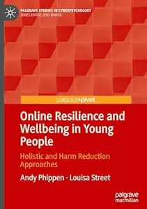

---

**Time:** 10:13:13 (Asia/Tehran)  
**Blog:** hill0  

**Title:** Political Economy of Electricity Access in Africa  

**Details:** English | 2026 | ISBN: 3032208432 | 399 Pages | PDF EPUB (True) | 17 MB  

**Link:** http://zavat.pw/ebooks/3032208432.html  

---

**Time:** 10:13:13 (Asia/Tehran)  
**Blog:** hill0  

**Title:** Operative Standards for Cancer Surgery: Volume II: Thyroid, Gastric, Rectum, Esophagus, Melanoma  

**Details:** English | 2019 | ISBN: 1496337034 | 577 Pages | PDF | 10 MB  

**Link:** http://zavat.pw/ebooks/1496337034P.html  

---

**Time:** 10:13:13 (Asia/Tehran)  
**Blog:** hill0  

**Title:** Advanced Nuclear Radiation Detectors  

**Details:** English | 2021 | ISBN: 0750325062 | 80 Pages | EPUB (True) | 3 MB  

**Link:** http://zavat.pw/ebooks/0750325062E.html  

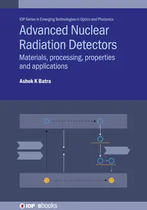

---

**Time:** 10:13:13 (Asia/Tehran)  
**Blog:** hill0  

**Title:** Eyes on the Sky: A Spectrum of Telescopes  

**Details:** English | 2016 | ISBN: 0198734271 | 252 Pages | EPUB (True) | 26 MB  

**Link:** http://zavat.pw/ebooks/0198734271E.html  

---

**Time:** 10:13:13 (Asia/Tehran)  
**Blog:** hill0  

**Title:** Antitrust and Competition Policy: A New Foundation  

**Details:** English | 2026 | ISBN: 1009724630 | 322 Pages | PDF | 2 MB  

**Link:** http://zavat.pw/ebooks/1009724630.html  

---

**Time:** 10:13:13 (Asia/Tehran)  
**Blog:** hill0  

**Title:** Vitamin E im Überblick  

**Details:** Deutsch | 2026 | ISBN: 366273589X | 65 Pages | PDF (True) | 3 MB  

**Link:** http://zavat.pw/ebooks/366273589X.html  

---

**Time:** 10:13:13 (Asia/Tehran)  
**Blog:** hill0  

**Title:** Integrative Suchttherapie  

**Details:** Deutsch | 2026 | ISBN: 3662732564 | 127 Pages | PDF (True) | 3 MB  

**Link:** http://zavat.pw/ebooks/3662732564.html  

---

**Time:** 10:13:13 (Asia/Tehran)  
**Blog:** hill0  

**Title:** Klettermedizin: Grundlagen, Unfälle, Verletzungen und Therapie, 2. Auflage  

**Details:** Deutsch | 2026 | ISBN: 366272474X | 293 Pages | PDF (True) | 37 MB  

**Link:** http://zavat.pw/ebooks/366272474X.html  

---

**Time:** 10:13:13 (Asia/Tehran)  
**Blog:** hill0  

**Title:** Softwareentwicklung für die Naturwissenschaften  

**Details:** Deutsch | 2026 | ISBN: 3662716062 | 618 Pages | PDF (True) | 20 MB  

**Link:** http://zavat.pw/ebooks/3662716062.html  

---

**Time:** 10:13:13 (Asia/Tehran)  
**Blog:** hill0  

**Title:** Klinische Ethik in der Intensivmedizin  

**Details:** Deutsch | 2026 | ISBN: 3662723778 | 239 Pages | PDF (True) | 2.4 MB  

**Link:** http://zavat.pw/ebooks/3662723778.html  

---

**Time:** 10:13:13 (Asia/Tehran)  
**Blog:** hill0  

**Title:** Open Source Software  

**Details:** Deutsch | 2026 | ISBN: 3658513837 | 60 Pages | PDF (True) | 0.8 MB  

**Link:** http://zavat.pw/ebooks/3658513837.html  

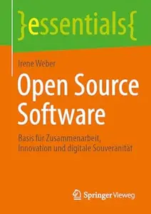

---

**Time:** 10:13:13 (Asia/Tehran)  
**Blog:** hill0  

**Title:** Customer Experience Leadership im Tourismus  

**Details:** Deutsch | 2026 | ISBN: 365850093X | 527 Pages | PDF (True) | 22 MB  

**Link:** http://zavat.pw/ebooks/365850093X.html  

---

**Time:** 10:13:13 (Asia/Tehran)  
**Blog:** hill0  

**Title:** Data-Driven Marketing und der Erfolgsfaktor Mensch, 2. Auflage  

**Details:** Deutsch | 2026 | ISBN: 3658504153 | 139 Pages | PDF (True) | 8 MB  

**Link:** http://zavat.pw/ebooks/3658504153.html  

---

**Time:** 10:13:13 (Asia/Tehran)  
**Blog:** crazy-slim  

**Title:** Corriere dello Sport Stadio - 9 Giugno 2026  

**Details:** Italiano | 40 pages | PDF | 90.7 MB  

**Link:** http://zavat.pw/newspapers/CorrieredelloSportStadio9Giugno2026-17752.html  

---

**Time:** 10:13:13 (Asia/Tehran)  
**Blog:** crazy-slim  

**Title:** Il Tempo - 9 Giugno 2026  

**Details:** Italiano | 32 pages | PDF | 79.8 MB  

**Link:** http://zavat.pw/newspapers/IlTempo9Giugno2026-58174.html  

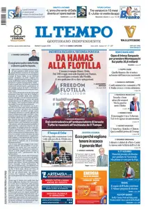

---

**Time:** 10:13:13 (Asia/Tehran)  
**Blog:** crazy-slim  

**Title:** Western Daily Press - 9 June 2026  

**Details:** English | 40 pages | PDF | 47.3 MB  

**Link:** http://zavat.pw/newspapers/WesternDailyPress9June2026-15755.html  

---

**Time:** 10:13:13 (Asia/Tehran)  
**Blog:** crazy-slim  

**Title:** Western Morning News - 9 June 2026  

**Details:** English | 40 pages | PDF | 47.7 MB  

**Link:** http://zavat.pw/newspapers/WesternMorningNews9June2026-11768.html  

---

**Time:** 10:13:13 (Asia/Tehran)  
**Blog:** crazy-slim  

**Title:** Tiverton Gazette - 9 June 2026  

**Details:** English | 32 pages | PDF | 38.2 MB  

**Link:** http://zavat.pw/newspapers/TivertonGazette9June2026-71229.html  

---

**Time:** 10:13:13 (Asia/Tehran)  
**Blog:** crazy-slim  

**Title:** Plymouth Herald - 9 June 2026  

**Details:** English | 40 pages | PDF | 44.4 MB  

**Link:** http://zavat.pw/newspapers/PlymouthHerald9June2026-30291.html  

---

**Time:** 10:13:13 (Asia/Tehran)  
**Blog:** crazy-slim  

**Title:** Grimsby Telegraph - 9 June 2026  

**Details:** English | 40 pages | PDF | 43.9 MB  

**Link:** http://zavat.pw/newspapers/GrimsbyTelegraph9June2026-50338.html  

---

**Time:** 10:13:13 (Asia/Tehran)  
**Blog:** crazy-slim  

**Title:** The Wall Street Journal - June 9, 2026  

**Details:** English | 28 pages | True PDF | 11.1 MB  

**Link:** http://zavat.pw/newspapers/TheWallStreetJournalJune92026-00562.html  

---

**Time:** 10:13:13 (Asia/Tehran)  
**Blog:** crazy-slim  

**Title:** Derby Telegraph - 9 June 2026  

**Details:** English | 40 pages | PDF | 46.2 MB  

**Link:** http://zavat.pw/newspapers/DerbyTelegraph9June2026-31150.html  

---

**Time:** 10:13:13 (Asia/Tehran)  
**Blog:** crazy-slim  

**Title:** The Australian - 9 June 2026  

**Details:** English | 24 pages | PDF | 72.2 MB  

**Link:** http://zavat.pw/newspapers/TheAustralian9June2026-13819.html  

---

**Time:** 10:13:13 (Asia/Tehran)  
**Blog:** crazy-slim  

**Title:** Nottingham Post - 9 June 2026  

**Details:** English | 40 pages | PDF | 44.5 MB  

**Link:** http://zavat.pw/newspapers/NottinghamPost9June2026-44018.html  

---

**Time:** 10:13:13 (Asia/Tehran)  
**Blog:** crazy-slim  

**Title:** Bristol Post - 9 June 2026  

**Details:** English | 40 pages | PDF | 46.4 MB  

**Link:** http://zavat.pw/newspapers/BristolPost9June2026-08398.html  

---

**Time:** 10:13:13 (Asia/Tehran)  
**Blog:** crazy-slim  

**Title:** Hull Daily Mail - 9 June 2026  

**Details:** English | 48 pages | PDF | 51.0 MB  

**Link:** http://zavat.pw/newspapers/HullDailyMail9June2026-25798.html  

---

**Time:** 10:13:13 (Asia/Tehran)  
**Blog:** crazy-slim  

**Title:** Daily Express (Irish) - 9 June 2026  

**Details:** English | 64 pages | PDF | 74.9 MB  

**Link:** http://zavat.pw/newspapers/DailyExpressIrish9June2026-51463.html  

---

**Time:** 10:13:13 (Asia/Tehran)  
**Blog:** crazy-slim  

**Title:** The Guardian - 9 June 2026  

**Details:** English | 72 pages | True PDF | 50.6 MB  

**Link:** http://zavat.pw/newspapers/TheGuardian9June2026-81162.html  

---

**Time:** 06:01:13 (Asia/Tehran)  
**Blog:** yoyoloit  

**Title:** Handbook of Bio-based Packaging for Agri-food Applications  

**Details:** English | 2026 | ISBN: 1839164050 | 314 pages | True EPUB | 8.84 MB  

**Link:** http://zavat.pw/ebooks/1839164050.html  

---

**Time:** 06:01:13 (Asia/Tehran)  
**Blog:** yoyoloit  

**Title:** Two Types of People: Insights from Top Performers to Help You Make Decisions, Act, and Grow  

**Details:** English | 2026 | ISBN: 0800748069 | 208 pages | True EPUB | 812.56 KB  

**Link:** http://zavat.pw/ebooks/0800748069.html  

---

**Time:** 06:01:13 (Asia/Tehran)  
**Blog:** yoyoloit  

**Title:** The Complete Book of Ducati Motorcycles Third Edition: Every Model Since 1946  

**Details:** English | 2026 | ISBN: 0760398747 | 312 pages | True EPUB | 59.36 MB  

**Link:** http://zavat.pw/ebooks/0760398747.html  

---

**Time:** 06:01:13 (Asia/Tehran)  
**Blog:** IrGens  

**Title:** Democracy, Plan, and Market: Yakov Kronrod's Political Economy of Socialism  

**Details:** English | September 26, 2017 | ISBN: 3838211081, 9783838270081 | True EPUB/PDF | 140 pages | 0.5/1.2 MB  

**Link:** http://zavat.pw/ebooks/3838211081-pdf.html  

---

**Time:** 06:01:13 (Asia/Tehran)  
**Blog:** IrGens  

**Title:** Freer Markets, More Rules: Regulatory Reform in Advanced Industrial Countries  

**Details:** English | August 8, 1996 | ISBN: 0801432154, 0801485347 | True PDF | 312 pages | 16.3 MB  

**Link:** http://zavat.pw/ebooks/0801432154.html  

---

**Time:** 06:01:13 (Asia/Tehran)  
**Blog:** IrGens  

**Title:** Poor Economics: A Radical Rethinking of the Way to Fight Global Poverty (Revised and Updated Edition)  

**Details:** English | September 16, 2025 | ISBN: 1541706188, 9781541706194 | True EPUB | 400 pages | 2.3 MB  

**Link:** http://zavat.pw/ebooks/1541706188.html  

---

**Time:** 06:01:13 (Asia/Tehran)  
**Blog:** IrGens  

**Title:** The Reverse Centaur's Guide to Life After AI: How to Think About Artificial Intelligence—Before It's Too Late  

**Details:** English | June 23, 2026 | ISBN: 037462156X, 9780374621575 | True EPUB | 240 pages | 2.3 MB  

**Link:** http://zavat.pw/ebooks/037462156X.html  

---

**Time:** 01:50:32 (Asia/Tehran)  
**Blog:** hill0  

**Title:** Vision Language Models  

**Details:** English | 2026 | ASIN: B0GC53W7FT | 449 Pages | EPUB | 21 MB  

**Link:** http://zavat.pw/ebooks/B0GC53W7FT.html  

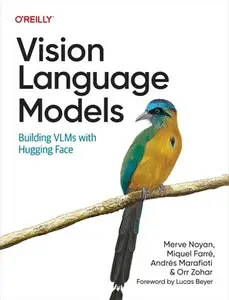

---

**Time:** 01:50:32 (Asia/Tehran)  
**Blog:** hill0  

**Title:** QGIS and Applications in Territorial Planning  

**Details:** English | 2018 | ISBN: 178630189X | 327 Pages | EPUB (True) | 18 MB  

**Link:** http://zavat.pw/ebooks/178630189Xe.html  

---

**Time:** 01:50:32 (Asia/Tehran)  
**Blog:** hill0  

**Title:** QGIS Quick Start Guide  

**Details:** English | 2019 | ISBN: 9781789341157 | 166 Pages | EPUB (True) | 9 MB  

**Link:** http://zavat.pw/ebooks/9781789341157.html  

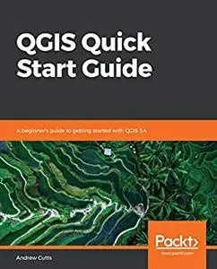

---

**Time:** 01:50:32 (Asia/Tehran)  
**Blog:** hill0  

**Title:** Mastery of Endoscopic and Laparoscopic Surgery (4th Edition)  

**Details:** English | 2014 | ISBN: 145117344X | 720 Pages | True PDF | 84 MB  

**Link:** http://zavat.pw/ebooks/145117344XTR.html  

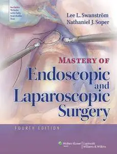

---

**Time:** 01:50:32 (Asia/Tehran)  
**Blog:** hill0  

**Title:** Laryngeal Cancer: Clinical Case-Based Approaches  

**Details:** English | 2019 | ISBN: 1684200016 | 189 Pages | True EPUB | 24 MB  

**Link:** http://zavat.pw/ebooks/1684200016e.html  

---

**Time:** 01:50:32 (Asia/Tehran)  
**Blog:** hill0  

**Title:** Mastery of Cardiothoracic Surgery, 3rd Edition  

**Details:** English | 2014 | ISBN: 1451113153 | 1232 pages | True PDF | 111 MB  

**Link:** http://zavat.pw/ebooks/1451113153t.html  

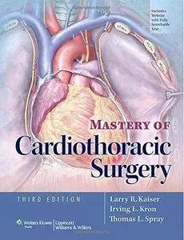

---

**Time:** 00:08:12 (Asia/Tehran)  
**Blog:** yoyoloit  

**Title:** Psychedelics and the Counterculture of Aging  

**Details:** English | 2026 | ISBN: 9798888503560 | 192 pages | True EPUB | 2.44 MB  

**Link:** http://zavat.pw/ebooks/9798888503560.html  

---

**Time:** 00:08:12 (Asia/Tehran)  
**Blog:** yoyoloit  

**Title:** Take Control of Your PCOS: Naturally Balance Your Hormones, Restore Intestinal Flora, and Boost Fertility  

**Details:** English | 2026 | ISBN: 9798888503706 | 224 pages | True EPUB | 6.61 MB  

**Link:** http://zavat.pw/ebooks/9798888503706.html  

---

**Time:** 00:08:12 (Asia/Tehran)  
**Blog:** yoyoloit  

**Title:** Dzogchen Dream Yoga : How to Practice Dreamtime Awareness  

**Details:** English | 2026 | ISBN: 9798888504567 | 192 pages | True EPUB | 8.29 MB  

**Link:** http://zavat.pw/ebooks/9798888504567.html  

---

**Time:** 00:08:12 (Asia/Tehran)  
**Blog:** yoyoloit  

**Title:** The Art of Listening to Yourself : How to Tune In to Your Intuitive Voice  

**Details:** English | 2026 | ISBN: 9798888504635 | 320 pages | True EPUB | 8.97 MB  

**Link:** http://zavat.pw/ebooks/9798888504635.html  

---

**Time:** 00:08:12 (Asia/Tehran)  
**Blog:** hill0  

**Title:** Operative Techniques in Foregut Surgery (2nd Edition)  

**Details:** English | 2024 | ISBN: 1975176618 | 998 Pages | EPUB (True) | 254 MB  

**Link:** http://zavat.pw/ebooks/1975176618E.html  

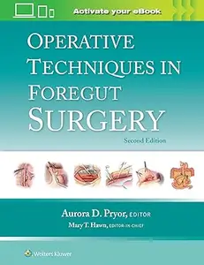

---

**Time:** 00:08:12 (Asia/Tehran)  
**Blog:** hill0  

**Title:** Reconstructive Surgery of the Oesophagus and Stomach  

**Details:** English | 2025 | ISBN: 3031668456 | 314 Pages | EPUB (True) | 134 MB  

**Link:** http://zavat.pw/ebooks/3031668456E.html  

---

**Time:** 00:08:12 (Asia/Tehran)  
**Blog:** hill0  

**Title:** Atlas of Minimally Invasive Surgery for Lung and Esophageal Cancer  

**Details:** English | 2017 | ISBN: 9402408339 | 412 Pages | True EPUB | 54 MB  

**Link:** http://zavat.pw/ebooks/9402408339E.html  

