# Zavat feed - 2026-06-13

---

**Time:** 22:43:59 (Asia/Tehran)  
**Blog:** hill0  

**Title:** Nitrogen-doped Graphene Nanomaterials for Electrochemical Systems  

**Details:** English | 2026 | ISBN: 9819597528 | 517 Pages | EPUB (True) | 40 MB  

**Link:** http://zavat.pw/ebooks/9819597528e.html  

---

**Time:** 22:43:59 (Asia/Tehran)  
**Blog:** hill0  

**Title:** Shaping the Digital Future Through Innovation and Practice  

**Details:** English | 2026 | ISBN: 3032084881 | 367 Pages | PDF (True) | 13 MB  

**Link:** http://zavat.pw/ebooks/3032084881.html  

---

**Time:** 22:43:59 (Asia/Tehran)  
**Blog:** hill0  

**Title:** Algebraic Topology: An Introduction  

**Details:** English | 2012 | ISBN: 1842657364 | 386 Pages | PDF (True) | 7 MB  

**Link:** http://zavat.pw/ebooks/1842657364.html  

---

**Time:** 22:43:59 (Asia/Tehran)  
**Blog:** hill0  

**Title:** Multiplicative Euclidean and Non-Euclidean Geometry  

**Details:** English | 2023 | ISBN: 1527589978 | 370 Pages | PDF (True) | 4 MB  

**Link:** http://zavat.pw/ebooks/1527589978.html  

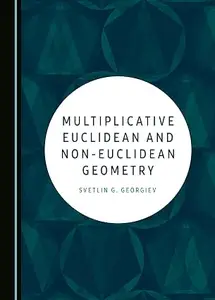

---

**Time:** 21:21:24 (Asia/Tehran)  
**Blog:** IrGens  

**Title:** Texan Crucible: How the Irish, Germans, and Czechs Became Anglo  

**Details:** English | June 9, 2026 | ISBN: 1477334106, 9781477334126 | True EPUB | 280 pages | 18.97 MB  

**Link:** http://zavat.pw/ebooks/1477334106.html  

---

**Time:** 21:21:24 (Asia/Tehran)  
**Blog:** hill0  

**Title:** Barycentric calculus in euclidean and hyperbolic geometry  

**Details:** English | 2010 | ISBN: 981430493X | 360 Pages | PDF (True) | 4 MB  

**Link:** http://zavat.pw/ebooks/981430493Xp.html  

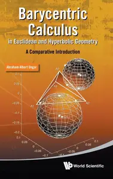

---

**Time:** 21:21:24 (Asia/Tehran)  
**Blog:** hill0  

**Title:** Computation of Nonlinear Structures  

**Details:** English | 2016 | ISBN: 111899695X | 1366 Pages | EPUB (True) | 25 MB  

**Link:** http://zavat.pw/ebooks/111899695Xe.html  

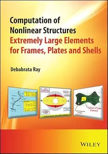

---

**Time:** 21:21:24 (Asia/Tehran)  
**Blog:** hill0  

**Title:** Numerical Methods for Partial Differential Equations: An Introduction  

**Details:** English | 2016 | ISBN: 1119111358 | 440 Pages | PDF | 27 MB  

**Link:** http://zavat.pw/ebooks/1119111358p.html  

---

**Time:** 21:21:24 (Asia/Tehran)  
**Blog:** hill0  

**Title:** Artificial Intelligence in Social Work: Bridging Technology and Humanity  

**Details:** English | 2026 | ISBN: 3032184428 | 599 Pages | PDF EPUB (True) | 8 MB  

**Link:** http://zavat.pw/ebooks/3032184428.html  

---

**Time:** 21:21:24 (Asia/Tehran)  
**Blog:** hill0  

**Title:** Immunology: Overview and Laboratory Manual (2nd Edition)  

**Details:** English | 2026 | ISBN: 3032199972 | 568 Pages | PDF EPUB (True) | 44 MB  

**Link:** http://zavat.pw/ebooks/3032199972.html  

---

**Time:** 21:21:24 (Asia/Tehran)  
**Blog:** hill0  

**Title:** Industrial Decision Analysis  

**Details:** English | 2026 | ISBN: 3032242983 | 256 Pages | PDF EPUB (True) | 5 MB  

**Link:** http://zavat.pw/ebooks/3032242983.html  

---

**Time:** 21:21:24 (Asia/Tehran)  
**Blog:** hill0  

**Title:** The Analytic History of American Politics  

**Details:** English | 2026 | ISBN: 3032251265 | 467 Pages | PDF EPUB (True) | 3.3 MB  

**Link:** http://zavat.pw/ebooks/3032251265.html  

---

**Time:** 21:21:24 (Asia/Tehran)  
**Blog:** hill0  

**Title:** Encyclopedia of Exercise Medicine in Health and Disease (2nd Edition)  

**Details:** English | 2026 | ISBN: 3032059879 | 1229 Pages | PDF EPUB (True) | 109 MB  

**Link:** http://zavat.pw/ebooks/3032059879.html  

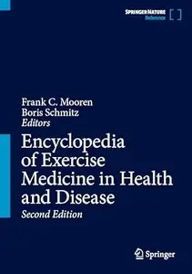

---

**Time:** 21:21:24 (Asia/Tehran)  
**Blog:** hill0  

**Title:** Introduction to Tensor Network Methods (2nd Edition)  

**Details:** English | 2026 | ISBN: 3032176344 | 339 Pages | PDF EPUB (True) | 45 MB  

**Link:** http://zavat.pw/ebooks/3032176344.html  

---

**Time:** 21:21:24 (Asia/Tehran)  
**Blog:** hill0  

**Title:** CompTIA A+ CertMike: Prepare. Practice. Pass the Test! Get Certified!: Core 2 Exam 220-1202 (2nd Edition)  

**Details:** English | 2026 | ISBN: 1394357680 | 858 Pages | EPUB (True) | 72 MB  

**Link:** http://zavat.pw/ebooks/1394357680.html  

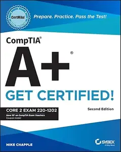

---

**Time:** 19:39:56 (Asia/Tehran)  
**Blog:** IrGens  

**Title:** I'll Take the Fire: A Novel  

**Details:** English | June 9, 2026 | ISBN: 0143139150, 9780593513262 | True EPUB | 368 pages | 1 MB  

**Link:** http://zavat.pw/ebooks/0143139150.html  

---

**Time:** 19:39:56 (Asia/Tehran)  
**Blog:** IrGens  

**Title:** How to Resist Guilt: On What's Holding Women Back  

**Details:** English | 28 May 2026 | ISBN: 1035077590, 9781035077625 | True EPUB | 288 pages | 0.9 MB  

**Link:** http://zavat.pw/ebooks/1035077590.html  

---

**Time:** 19:39:56 (Asia/Tehran)  
**Blog:** IrGens  

**Title:** The Travels of Dean Mahomet: An Eighteenth-Century Journey through India  

**Details:** English | July 30, 1997 | ISBN: 0520207173, 9780520918511 | True EPUB | 256 pages | 7.5 MB  

**Link:** http://zavat.pw/ebooks/0520207173-epub.html  

---

**Time:** 19:39:56 (Asia/Tehran)  
**Blog:** IrGens  

**Title:** Seek Immediate Shelter: A Novel  

**Details:** English | May 5, 2026 | ISBN: 1250410126, 9781250410139 | True EPUB | 304 pages | 1.2 MB  

**Link:** http://zavat.pw/ebooks/1250410126.html  

---

**Time:** 19:39:56 (Asia/Tehran)  
**Blog:** IrGens  

**Title:** Your Presence Is a Danger to Your Life: Voices from Gaza  

**Details:** English | 21 May 2026 | ISBN: 1804272418, 9781804272428 | True EPUB | 256 pages | 0.3 MB  

**Link:** http://zavat.pw/ebooks/1804272418.html  

---

**Time:** 19:39:56 (Asia/Tehran)  
**Blog:** IrGens  

**Title:** Requiem for French Theory: Transatlantic Funeral Dirge in a Marxist Key  

**Details:** English | July 1, 2026 | ISBN: 1685901506, 1685901492, 9781685901516 | True EPUB | 168 pages | 1.6 MB  

**Link:** http://zavat.pw/ebooks/1685901506.html  

---

**Time:** 19:39:56 (Asia/Tehran)  
**Blog:** IrGens  

**Title:** Synchronizing the Body in Ancient Medicine and Philosophy  

**Details:** English | June 13, 2026 | ISBN: 3112235681, 9783112235706 | True EPUB | 190 pages | 1.7 MB  

**Link:** http://zavat.pw/ebooks/3112235681.html  

---

**Time:** 19:39:56 (Asia/Tehran)  
**Blog:** IrGens  

**Title:** Frederick Douglass and Herman Melville: Essays in Relation  

**Details:** English | March 10, 2008 | ISBN: 0807831840, 0807858722, 9781469606699 | True EPUB | 488 pages | 3 MB  

**Link:** http://zavat.pw/ebooks/0807831840.html  

---

**Time:** 19:39:56 (Asia/Tehran)  
**Blog:** IrGens  

**Title:** Kant's Moral World: Ideas and the Real Use of Pure Practical Reason  

**Details:** English | January 20, 2026 | ISBN: 0197829430, 9780197829448 | True EPUB | 298 pages | 0.8 MB  

**Link:** http://zavat.pw/ebooks/0197829430.html  

---

**Time:** 19:39:56 (Asia/Tehran)  
**Blog:** hill0  

**Title:** Linux Security Foundations  

**Details:** English | 2026 | ASIN: B0GN6NP8Y9 | 485 Pages | True PDF EPUB | 5 MB  

**Link:** http://zavat.pw/ebooks/B0GN6NP8Y9T.html  

---

**Time:** 19:39:56 (Asia/Tehran)  
**Blog:** hill0  

**Title:** Creative AI Agents with Copilot Studio  

**Details:** English | 2026 | ASIN: B0GT8C2ZZZ | 506 Pages | True PDF EPUB | 15 MB  

**Link:** http://zavat.pw/ebooks/B0GT8C2ZZZt.html  

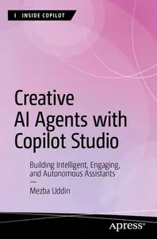

---

**Time:** 18:05:27 (Asia/Tehran)  
**Blog:** IrGens  

**Title:** The Guide to Urban Fly Fishing: How to Explore and Enjoy Your Local Waters  

**Details:** English | April 28, 2026 | ISBN: 1645023176, 9781645023180 | True EPUB | 256 pages | 95.5 MB  

**Link:** http://zavat.pw/ebooks/1645023176.html  

---

**Time:** 18:05:27 (Asia/Tehran)  
**Blog:** IrGens  

**Title:** Street Design: The Secret to Great Cities and Towns, 2nd Edition  

**Details:** English | June 1, 2026 | ISBN: 1119892953, 9781119892960 | True EPUB | 704 pages | 447 MB  

**Link:** http://zavat.pw/ebooks/1119892953-epub.html  

---

**Time:** 18:05:27 (Asia/Tehran)  
**Blog:** IrGens  

**Title:** RSPB British Birds of Prey, 2nd Edition [Repost]  

**Details:** English | 16 Oct. 2025 | ISBN: 1399421123, 9781399421119 | True EPUB | 224 pages | 107 MB  

**Link:** http://zavat.pw/ebooks/1399421123-epub.html  

---

**Time:** 18:05:27 (Asia/Tehran)  
**Blog:** IrGens  

**Title:** The Collected Stories of Katherine Mansfield (Modern Library Torchbearers)  

**Details:** English | May 12, 2026 | ISBN: 0593979567, 9780593979570 | True EPUB | 448 pages | 4.4 MB  

**Link:** http://zavat.pw/ebooks/0593979567.html  

---

**Time:** 18:05:27 (Asia/Tehran)  
**Blog:** IrGens  

**Title:** Dialectic of Pop (Urbanomic / Mono)  

**Details:** English | January 28, 2020 | ISBN: 1913029557, 9781913029609 | True EPUB | 456 pages | 0.8 MB  

**Link:** http://zavat.pw/ebooks/1913029557-epub.html  

---

**Time:** 18:05:27 (Asia/Tehran)  
**Blog:** AvaxGenius  

**Title:** Environmental Modeling: Using MATLAB®  

**Details:** English | PDF (True) | 2007 | 393 Pages | ISBN : 3540729364 | 36.1 MB  

**Link:** http://zavat.pw/ebooks/35540729364.html  

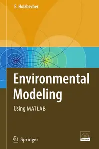

---

**Time:** 18:05:27 (Asia/Tehran)  
**Blog:** AvaxGenius  

**Title:** Programming Differential Privacy  

**Details:** English | PDF | 2026 | 150 Pages | ISBN : N/A | 1.3 MB  

**Link:** http://zavat.pw/ebooks/ProgrammingDifferentialPrivacy.html  

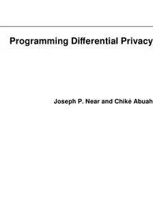

---

**Time:** 18:05:27 (Asia/Tehran)  
**Blog:** AvaxGenius  

**Title:** Philosophy and the Arts: A Textbook with Readings  

**Details:** English | PDF (True) | 2025 | 217 Pages | ISBN : N/A | 10 MB  

**Link:** http://zavat.pw/ebooks/PhilosophyandtheArts.html  

---

**Time:** 18:05:27 (Asia/Tehran)  
**Blog:** AvaxGenius  

**Title:** Catering: A Guide to Managing a Successful Business Operation, Second Edition  

**Details:** English | PDF (True) | 2016 | 322 Pages | ISBN : 1118137973 | 5.10 MB  

**Link:** http://zavat.pw/ebooks/11181357973T.html  

---

**Time:** 18:05:27 (Asia/Tehran)  
**Blog:** AvaxGenius  

**Title:** Facing the Challenges in Structural Engineering (Repost)  

**Details:** English | PDF | 2017 (2018 Edition) | 513 Pages | ISBN : 3319619136 | 103.7 MB  

**Link:** http://zavat.pw/ebooks/433169619136.html  

---

**Time:** 18:05:27 (Asia/Tehran)  
**Blog:** AvaxGenius  

**Title:** Experimental Robotics: The 18th International Symposium (Repost)  

**Details:** English | PDF (True) | 2024 | 626 Pages | ISBN : 3031635957 | 117.4 MB  

**Link:** http://zavat.pw/ebooks/340316359657.html  

---

**Time:** 18:05:27 (Asia/Tehran)  
**Blog:** AvaxGenius  

**Title:** Befriending Bumble Bees: A Practical Guide to Raising Local Bumble Bees  

**Details:** English | PDF | 2007 | 75 Pages | ISBN : N/A | 237.1 MB  

**Link:** http://zavat.pw/ebooks/BefriendingBumble____Bees.html  

---

**Time:** 18:05:27 (Asia/Tehran)  
**Blog:** AvaxGenius  

**Title:** Multivariate Analysis of Ecological Data With Ade4 (Repost)  

**Details:** English | EPUB | 2018 | 334 Pages | ISBN : 1493988484 | 95.5 MB  

**Link:** http://zavat.pw/ebooks/1493971.html  

---

**Time:** 18:05:27 (Asia/Tehran)  
**Blog:** AvaxGenius  

**Title:** Magnetic Micro and Nanorobot Swarms: From Fundamentals to Applications (Repost)  

**Details:** English | EPUB (True) | 2023 | 349 Pages | ISBN : 9819936942 | 165.5 MB  

**Link:** http://zavat.pw/ebooks/981649936942.html  

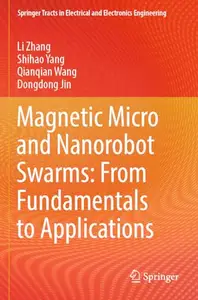

---

**Time:** 18:05:27 (Asia/Tehran)  
**Blog:** AvaxGenius  

**Title:** Wadi Flash Floods: Challenges and Advanced Approaches for Disaster Risk Reduction (Repost)  

**Details:** English | EPUB | 2021 | 559 Pages | ISBN : 981162903X | 183.8 MB  

**Link:** http://zavat.pw/ebooks/98116662903X.html  

---

**Time:** 18:05:27 (Asia/Tehran)  
**Blog:** AvaxGenius  

**Title:** Design and Development of Aerospace Vehicles and Propulsion Systems: Proceedings of SAROD 2018 (Repost)  

**Details:** English | EPUB | 2021 | 529 Pages | ISBN : 981159600X | 194.2 MB  

**Link:** http://zavat.pw/ebooks/9811579600X.html  

---

**Time:** 18:05:27 (Asia/Tehran)  
**Blog:** AvaxGenius  

**Title:** Tools for Landscape-Scale Geobotany and Conservation (Repost)  

**Details:** English | EPUB | 2021 | 451 Pages | ISBN : 3030749495 | 218.6 MB  

**Link:** http://zavat.pw/ebooks/30360749495.html  

---

**Time:** 18:05:27 (Asia/Tehran)  
**Blog:** AvaxGenius  

**Title:** The Cost of Corrosion in China (Repost)  

**Details:** English | EPUB (True) | 2019 | 950 Pages | ISBN : 9813293535 | 257.5 MB  

**Link:** http://zavat.pw/ebooks/98132793535.html  

---

**Time:** 18:05:27 (Asia/Tehran)  
**Blog:** AvaxGenius  

**Title:** Water-Related Urbanization and Locality (Repost)  

**Details:** English | EPUB | 2020 | 377 Pages | ISBN : 981153506X | 262.4 MB  

**Link:** http://zavat.pw/ebooks/9871153506X.html  

---

**Time:** 18:05:27 (Asia/Tehran)  
**Blog:** AvaxGenius  

**Title:** Best Practices in Physics-based Fault Rupture Models for Seismic Hazard Assessment of Nuclear Installations (Repost)  

**Details:** English | PDF | 2017 (2018 Edition) | 333 Pages | ISBN : 3319727087 | 102.83 MB  

**Link:** http://zavat.pw/ebooks/33179727087.html  

---

**Time:** 18:05:27 (Asia/Tehran)  
**Blog:** hill0  

**Title:** CompTIA A+ CertMike: Prepare. Practice. Pass the Test! Get Certified!: Core 1 Exam 220-1201 (2nd Edition)  

**Details:** English | 2025 | ISBN: 1394357532 | 552 Pages | EPUB (True) | 50 MB  

**Link:** http://zavat.pw/ebooks/1394357532.html  

---

**Time:** 18:05:27 (Asia/Tehran)  
**Blog:** hill0  

**Title:** Blockchain Success Stories  

**Details:** English | 2026 | ISBN: 1394346484 | 377 Pages | EPUB (True) | 4 MB  

**Link:** http://zavat.pw/ebooks/1394346484e.html  

---

**Time:** 18:05:27 (Asia/Tehran)  
**Blog:** hill0  

**Title:** AI and Wind Power 2: Advancing Sustainability, Grid Integration, and Future Frameworks  

**Details:** English | 2026 | ISBN: 1836691424 | 358 Pages | EPUB (True) | 7 MB  

**Link:** http://zavat.pw/ebooks/1836691424e.html  

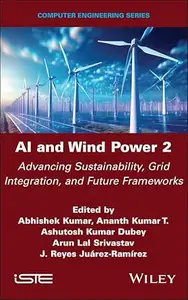

---

**Time:** 15:51:35 (Asia/Tehran)  
**Blog:** IrGens  

**Title:** Svelte & SvelteKit  

**Details:** .MP4, AVC, 1920x1080, 30 fps | English, AAC, 2 Ch | 5h 55m | 1.27 GB  

**Link:** http://zavat.pw/ebooks/svelte-sveltekit-v2.html  

---

**Time:** 15:51:35 (Asia/Tehran)  
**Blog:** AvaxGenius  

**Title:** Principles of Macroeconomics  

**Details:** English | PDF EPUB (True) | 2026 | 574 Pages | ISBN : N/A | 18.3 MB  

**Link:** http://zavat.pw/ebooks/Principles__of__Macroeconomics.html  

---

**Time:** 15:51:35 (Asia/Tehran)  
**Blog:** AvaxGenius  

**Title:** Introduction to Nutrition and Wellness, 2nd Edition  

**Details:** English | PDF (True) | 2026 | 955 Pages | ISBN : N/A | 130.1 MB  

**Link:** http://zavat.pw/ebooks/IntroductiontoNutritionandWellness2ndEdition.html  

---

**Time:** 15:51:35 (Asia/Tehran)  
**Blog:** AvaxGenius  

**Title:** Introduction to Electronic Commerce and Social Commerce (Springer Texts in Business and Economics)  

**Details:** English | PDF (True) | 2017 | 446 Pages | ISBN : 3319500902 | 10.2 MB  

**Link:** http://zavat.pw/ebooks/3319500902T.html  

---

**Time:** 15:51:35 (Asia/Tehran)  
**Blog:** hill0  

**Title:** Interdisciplinary Approaches of Sustainable Economy and Urban Cultural Landscapes  

**Details:** English | 2026 | ISBN: 303217497X | 223 Pages | PDF (True) | 49 MB  

**Link:** http://zavat.pw/ebooks/303217497X.html  

---

**Time:** 15:51:35 (Asia/Tehran)  
**Blog:** hill0  

**Title:** Norms in International Relations: An Introduction  

**Details:** English | 2026 | ISBN: 3658509163 | 109 Pages | PDF EPUB (True) | 1.3 MB  

**Link:** http://zavat.pw/ebooks/3658509163.html  

---

**Time:** 15:51:35 (Asia/Tehran)  
**Blog:** hill0  

**Title:** Fault Detection in Microservice Architectures  

**Details:** English | 2026 | ASIN: B0GQZ2DM75 | 248 Pages | MOBI | 3 MB  

**Link:** http://zavat.pw/ebooks/B0GQZ2DM75M.html  

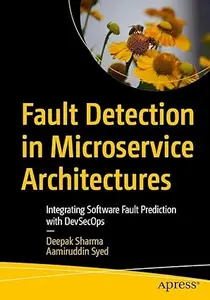

---

**Time:** 15:51:35 (Asia/Tehran)  
**Blog:** hill0  

**Title:** Threat-Driven Software Development  

**Details:** English | 2026 | ISBN: 0135567386 | 512 Pages | EPUB | 5.4 MB  

**Link:** http://zavat.pw/ebooks/0135567386.html  

---

**Time:** 15:51:35 (Asia/Tehran)  
**Blog:** hill0  

**Title:** Object-Oriented Programming in C# : In Control  

**Details:** English | 2025 | ISBN: n/a | 113 Pages | PDF EPUB (True) | 0.8 MB  

**Link:** http://zavat.pw/ebooks/object-oriented-programming-c-control.html  

---

**Time:** 15:51:35 (Asia/Tehran)  
**Blog:** hill0  

**Title:** The EventStorming Handbook  

**Details:** English | 2024 | ISBN: n/a | 107 Pages | PDF EPUB (True) | 52 MB  

**Link:** http://zavat.pw/ebooks/eventstorming-handbook-unlocking.html  

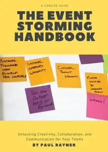

---

**Time:** 15:51:35 (Asia/Tehran)  
**Blog:** crazy-slim  

**Title:** Barron's - June 15, 2026  

**Details:** English | 54 pages | True PDF | 7.5 MB  

**Link:** http://zavat.pw/magazines/BarronsJune152026-56231.html  

---

**Time:** 15:51:35 (Asia/Tehran)  
**Blog:** crazy-slim  

**Title:** Shooting Sportsman - September-October 2023  

**Details:** English | 124 pages | True PDF | 167.2 MB  

**Link:** http://zavat.pw/magazines/ShootingSportsmanSeptemberOctober2023-54225.html  

---

**Time:** 15:51:35 (Asia/Tehran)  
**Blog:** crazy-slim  

**Title:** Shooting Sportsman - September-October 2022  

**Details:** English | 116 pages | True PDF | 165.2 MB  

**Link:** http://zavat.pw/magazines/ShootingSportsmanSeptemberOctober2022-21046.html  

---

**Time:** 15:51:35 (Asia/Tehran)  
**Blog:** crazy-slim  

**Title:** Shooting Sportsman - November-December 2023  

**Details:** English | 116 pages | True PDF | 162.8 MB  

**Link:** http://zavat.pw/magazines/ShootingSportsmanNovemberDecember2023-99708.html  

---

**Time:** 15:51:35 (Asia/Tehran)  
**Blog:** crazy-slim  

**Title:** Shooting Sportsman - May-June 2022  

**Details:** English | 92 pages | True PDF | 120.2 MB  

**Link:** http://zavat.pw/magazines/ShootingSportsmanMayJune2022-56096.html  

---

**Time:** 15:51:35 (Asia/Tehran)  
**Blog:** crazy-slim  

**Title:** Shooting Sportsman - March-April 2023  

**Details:** English | 100 pages | True PDF | 127.0 MB  

**Link:** http://zavat.pw/magazines/ShootingSportsmanMarchApril2023-72273.html  

---

**Time:** 15:51:35 (Asia/Tehran)  
**Blog:** crazy-slim  

**Title:** Shooting Sportsman - November-December 2022  

**Details:** English | 116 pages | True PDF | 152.7 MB  

**Link:** http://zavat.pw/magazines/ShootingSportsmanNovemberDecember2022-34781.html  

---

**Time:** 15:51:35 (Asia/Tehran)  
**Blog:** crazy-slim  

**Title:** Shooting Sportsman - May-June 2023  

**Details:** English | 100 pages | True PDF | 115.2 MB  

**Link:** http://zavat.pw/magazines/ShootingSportsmanMayJune2023-70773.html  

---

**Time:** 15:51:35 (Asia/Tehran)  
**Blog:** crazy-slim  

**Title:** Shooting Sportsman - July-August 2023  

**Details:** English | 108 pages | True PDF | 149.3 MB  

**Link:** http://zavat.pw/magazines/ShootingSportsmanJulyAugust2023-71872.html  

---

**Time:** 15:51:35 (Asia/Tehran)  
**Blog:** crazy-slim  

**Title:** School Library Journal - September 2015  

**Details:** English | 196 pages | True PDF | 172.8 MB  

**Link:** http://zavat.pw/magazines/SchoolLibraryJournalSeptember2015-21347.html  

---

**Time:** 15:51:35 (Asia/Tehran)  
**Blog:** crazy-slim  

**Title:** Shooting Sportsman - January-February 2022  

**Details:** English | 100 pages | True PDF | 142.7 MB  

**Link:** http://zavat.pw/magazines/ShootingSportsmanJanuaryFebruary2022-08415.html  

---

**Time:** 15:51:35 (Asia/Tehran)  
**Blog:** crazy-slim  

**Title:** Shooting Sportsman - March-April 2022  

**Details:** English | 100 pages | True PDF | 136.3 MB  

**Link:** http://zavat.pw/magazines/ShootingSportsmanMarchApril2022-21270.html  

---

**Time:** 15:51:35 (Asia/Tehran)  
**Blog:** crazy-slim  

**Title:** Summum - Mars 2015  

**Details:** Français | 108 pages | True PDF | 140.7 MB  

**Link:** http://zavat.pw/magazines/SummumMars2015-98207.html  

---

**Time:** 15:51:35 (Asia/Tehran)  
**Blog:** crazy-slim  

**Title:** Kultur Spiegel - September 2009  

**Details:** Deutsch | 56 pages | True PDF | 10.2 MB  

**Link:** http://zavat.pw/magazines/KulturSpiegelSeptember2009-83392.html  

---

**Time:** 15:51:35 (Asia/Tehran)  
**Blog:** crazy-slim  

**Title:** Summum - Octobre 2016  

**Details:** Français | 104 pages | True PDF | 121.4 MB  

**Link:** http://zavat.pw/magazines/SummumOctobre2016-85006.html  

---

**Time:** 14:14:05 (Asia/Tehran)  
**Blog:** crazy-slim  

**Title:** Success - January 2015  

**Details:** English | 92 pages | PDF | 59.1 MB  

**Link:** http://zavat.pw/magazines/SuccessJanuary2015-04681.html  

---

**Time:** 14:14:05 (Asia/Tehran)  
**Blog:** crazy-slim  

**Title:** Success - March 2015  

**Details:** English | 92 pages | PDF | 55.7 MB  

**Link:** http://zavat.pw/magazines/SuccessMarch2015-13891.html  

---

**Time:** 14:14:05 (Asia/Tehran)  
**Blog:** crazy-slim  

**Title:** Success - September 2015  

**Details:** English | 92 pages | PDF | 59.8 MB  

**Link:** http://zavat.pw/magazines/SuccessSeptember2015-25077.html  

---

**Time:** 14:14:05 (Asia/Tehran)  
**Blog:** crazy-slim  

**Title:** Success - October 2015  

**Details:** English | 92 pages | PDF | 50.4 MB  

**Link:** http://zavat.pw/magazines/SuccessOctober2015-66949.html  

---

**Time:** 14:14:05 (Asia/Tehran)  
**Blog:** crazy-slim  

**Title:** Success - April 2015  

**Details:** English | 92 pages | PDF | 54.0 MB  

**Link:** http://zavat.pw/magazines/SuccessApril2015-39395.html  

---

**Time:** 14:14:05 (Asia/Tehran)  
**Blog:** crazy-slim  

**Title:** Success - November 2015  

**Details:** English | 100 pages | PDF | 56.1 MB  

**Link:** http://zavat.pw/magazines/SuccessNovember2015-07529.html  

---

**Time:** 14:14:05 (Asia/Tehran)  
**Blog:** crazy-slim  

**Title:** Success - May 2015  

**Details:** English | 92 pages | PDF | 56.5 MB  

**Link:** http://zavat.pw/magazines/SuccessMay2015-51200.html  

---

**Time:** 14:14:05 (Asia/Tehran)  
**Blog:** crazy-slim  

**Title:** Success - June 2015  

**Details:** English | 92 pages | PDF | 57.2 MB  

**Link:** http://zavat.pw/magazines/SuccessJune2015-17824.html  

---

**Time:** 14:14:05 (Asia/Tehran)  
**Blog:** crazy-slim  

**Title:** Success - July 2015  

**Details:** English | 92 pages | PDF | 57.1 MB  

**Link:** http://zavat.pw/magazines/SuccessJuly2015-77120.html  

---

**Time:** 14:14:05 (Asia/Tehran)  
**Blog:** crazy-slim  

**Title:** Success - December 2015  

**Details:** English | 92 pages | PDF | 50.5 MB  

**Link:** http://zavat.pw/magazines/SuccessDecember2015-57736.html  

---

**Time:** 14:14:05 (Asia/Tehran)  
**Blog:** crazy-slim  

**Title:** Success - August 2015  

**Details:** English | 92 pages | PDF | 57.4 MB  

**Link:** http://zavat.pw/magazines/SuccessAugust2015-04435.html  

---

**Time:** 14:14:05 (Asia/Tehran)  
**Blog:** crazy-slim  

**Title:** Success - February 2015  

**Details:** English | 92 pages | PDF | 58.7 MB  

**Link:** http://zavat.pw/magazines/SuccessFebruary2015-61824.html  

---

**Time:** 14:14:05 (Asia/Tehran)  
**Blog:** crazy-slim  

**Title:** School Library Journal - September 2015  

**Details:** English | 196 pages | True PDF | 415.7 MB  

**Link:** http://zavat.pw/magazines/SchoolLibraryJournalSeptember2015-80365.html  

---

**Time:** 14:14:05 (Asia/Tehran)  
**Blog:** crazy-slim  

**Title:** Shooting Sportsman - July-August 2022  

**Details:** English | 100 pages | True PDF | 807.9 MB  

**Link:** http://zavat.pw/magazines/ShootingSportsmanJulyAugust2022-93792.html  

---

**Time:** 14:14:05 (Asia/Tehran)  
**Blog:** crazy-slim  

**Title:** School Library Journal - October 2015  

**Details:** English | 144 pages | True PDF | 161.0 MB  

**Link:** http://zavat.pw/magazines/SchoolLibraryJournalOctober2015-37792.html  

---

**Time:** 11:51:14 (Asia/Tehran)  
**Blog:** yoyoloit  

**Title:** Unproven, Unlikely, and Firmly Believed: Why We Fall for History’s Most Seductive Conspiracy Theories  

**Details:** English | 2026 | ISBN: 9798893031508 | 352 pages | True EPUB | 532.56 KB  

**Link:** http://zavat.pw/ebooks/9798893031508.html  

---

**Time:** 11:51:14 (Asia/Tehran)  
**Blog:** hill0  

**Title:** MATLAB Primer  

**Details:** English | 2026 | ISBN: n/a | 186 Pages | PDF (True) | 2 MB  

**Link:** http://zavat.pw/ebooks/MATLAB-Primer.html  

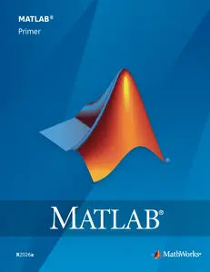

---

**Time:** 11:51:14 (Asia/Tehran)  
**Blog:** hill0  

**Title:** Hanged for Hitler  

**Details:** English | 2026 | ASIN: B0GQJ7W1JP | 300 Pages | True EPUB | 2 MB  

**Link:** http://zavat.pw/ebooks/B0GQJ7W1JP.html  

---

**Time:** 11:51:14 (Asia/Tehran)  
**Blog:** hill0  

**Title:** OP-Pflege Prüfungswissen, 4.Auflage  

**Details:** Deutsch | 2026 | ISBN: 3662727838 | 286 Pages | PDF (True) | 25 MB  

**Link:** http://zavat.pw/ebooks/3662727838.html  

---

**Time:** 11:51:14 (Asia/Tehran)  
**Blog:** hill0  

**Title:** Genetische Anthropologie  

**Details:** Deutsch | 2026 | ISBN: 3662722453 | 292 Pages | PDF (True) | 44 MB  

**Link:** http://zavat.pw/ebooks/3662722453.html  

---

**Time:** 11:51:14 (Asia/Tehran)  
**Blog:** hill0  

**Title:** Vom Werk zur Baustelle  

**Details:** Deutsch | 2026 | ISBN: 3658514256 | 152 Pages | PDF (True) | 5 MB  

**Link:** http://zavat.pw/ebooks/3658514256.html  

---

**Time:** 11:51:14 (Asia/Tehran)  
**Blog:** hill0  

**Title:** Statistik und quantitative Methoden auf Bachelorniveau, 2. Auflage  

**Details:** Deutsch | 2026 | ISBN: 3662725940 | 194 Pages | PDF (True) | 12 MB  

**Link:** http://zavat.pw/ebooks/3662725940.html  

---

**Time:** 11:51:14 (Asia/Tehran)  
**Blog:** hill0  

**Title:** Normalformen von Matrizen  

**Details:** Deutsch | 2026 | ISBN: 3662731851 | 79 Pages | PDF (True) | 1 MB  

**Link:** http://zavat.pw/ebooks/3662731851.html  

---

**Time:** 11:51:14 (Asia/Tehran)  
**Blog:** hill0  

**Title:** Die Ordnung der Welt  

**Details:** Deutsch | 2026 | ISBN: 3658510528 | 421 Pages | PDF (True) | 10 MB  

**Link:** http://zavat.pw/ebooks/3658510528.html  

---

**Time:** 11:51:14 (Asia/Tehran)  
**Blog:** hill0  

**Title:** Positive Psychologie und Didaktik  

**Details:** Deutsch | 2026 | ISBN: 3662732777 | 189 Pages | PDF (True) | 9 MB  

**Link:** http://zavat.pw/ebooks/3662732777.html  

---

**Time:** 11:51:14 (Asia/Tehran)  
**Blog:** hill0  

**Title:** KI in der Supply Chain  

**Details:** Deutsch | 2026 | ISBN: 3658512962 | 181 Pages | PDF (True) | 5 MB  

**Link:** http://zavat.pw/ebooks/3658512962.html  

---

**Time:** 11:51:14 (Asia/Tehran)  
**Blog:** hill0  

**Title:** Übungs- und Lernbuch Wahrscheinlichkeitstheorie und Stochastik  

**Details:** Deutsch | 2026 | ISBN: 3662727196 | 438 Pages | PDF (True) | 5 MB  

**Link:** http://zavat.pw/ebooks/3662727196.html  

---

**Time:** 11:51:14 (Asia/Tehran)  
**Blog:** hill0  

**Title:** The Wind Beneath the Stone  

**Details:** English | 2026 | ISBN: 152669185X | 223 Pages | EPUB (True) | 11 MB  

**Link:** http://zavat.pw/ebooks/152669185X.html  

---

**Time:** 11:51:14 (Asia/Tehran)  
**Blog:** hill0  

**Title:** Building Blocks for Social-Emotional Learning  

**Details:** English | 2022 | ISBN: 195281247X | 356 Pages | EPUB (True) | 15 MB  

**Link:** http://zavat.pw/ebooks/195281247X.html  

---

**Time:** 11:51:14 (Asia/Tehran)  
**Blog:** hill0  

**Title:** The 24:7 Dad: 12 Habits of Confident Fathers  

**Details:** English | 2026 | ISBN: 1394382359 | 224 Pages | EPUB (True) | 1.4 MB  

**Link:** http://zavat.pw/ebooks/1394382359.html  

---

**Time:** 11:51:14 (Asia/Tehran)  
**Blog:** hill0  

**Title:** There Has To Be More: The Essential Guide To Personal Growth  

**Details:** English | 2021 | ISBN: 1922611107 | 202 Pages | EPUB (True) | 1.4 MB  

**Link:** http://zavat.pw/ebooks/1922611107.html  

---

**Time:** 11:51:14 (Asia/Tehran)  
**Blog:** crazy-slim  

**Title:** The Morning Call Morning Edition - 13 June 2026  

**Details:** English | 25 pages | True PDF | 17.1 MB  

**Link:** http://zavat.pw/newspapers/TheMorningCallMorningEdition13June2026-28339.html  

---

**Time:** 11:51:14 (Asia/Tehran)  
**Blog:** crazy-slim  

**Title:** Virginia Gazette - 13 June 2026  

**Details:** English | 26 pages | True PDF | 24.9 MB  

**Link:** http://zavat.pw/newspapers/VirginiaGazette13June2026-32610.html  

---

**Time:** 11:51:14 (Asia/Tehran)  
**Blog:** crazy-slim  

**Title:** The Philadelphia Inquirer - June 13, 2026  

**Details:** English | 24 pages | True PDF | 18.4 MB  

**Link:** http://zavat.pw/newspapers/ThePhiladelphiaInquirerJune132026-19888.html  

---

**Time:** 11:51:14 (Asia/Tehran)  
**Blog:** crazy-slim  

**Title:** USA Today - June 13, 2026  

**Details:** English | 14 pages | True PDF | 5.1 MB  

**Link:** http://zavat.pw/newspapers/USATodayJune132026-36018.html  

---

**Time:** 11:51:14 (Asia/Tehran)  
**Blog:** crazy-slim  

**Title:** The Dallas Morning News - June 13, 2026  

**Details:** English | 32 pages | True PDF | 17.5 MB  

**Link:** http://zavat.pw/newspapers/TheDallasMorningNewsJune132026-23324.html  

---

**Time:** 11:51:14 (Asia/Tehran)  
**Blog:** crazy-slim  

**Title:** Trinidad & Tobago Daily Express - 13 June 2026  

**Details:** English | 40 pages | True PDF | 32.9 MB  

**Link:** http://zavat.pw/newspapers/TrinidadTobagoDailyExpress13June2026-76202.html  

---

**Time:** 11:51:14 (Asia/Tehran)  
**Blog:** crazy-slim  

**Title:** Post-Tribune - 13 June 2026  

**Details:** English | 18 pages | True PDF | 11.7 MB  

**Link:** http://zavat.pw/newspapers/PostTribune13June2026-51495.html  

---

**Time:** 11:51:14 (Asia/Tehran)  
**Blog:** crazy-slim  

**Title:** Sun Journal - 13 June 2026  

**Details:** English | 12 pages | True PDF | 15.4 MB  

**Link:** http://zavat.pw/newspapers/SunJournal13June2026-77508.html  

---

**Time:** 11:51:14 (Asia/Tehran)  
**Blog:** crazy-slim  

**Title:** Sun Sentinel - 13 June 2026  

**Details:** English | 33 pages | True PDF | 23.5 MB  

**Link:** http://zavat.pw/newspapers/SunSentinel13June2026-14272.html  

---

**Time:** 11:51:14 (Asia/Tehran)  
**Blog:** crazy-slim  

**Title:** New York Post - June 13, 2026  

**Details:** English | 64 pages | True PDF | 34.5 MB  

**Link:** http://zavat.pw/newspapers/NewYorkPostJune132026-21546.html  

---

**Time:** 11:51:14 (Asia/Tehran)  
**Blog:** crazy-slim  

**Title:** Daily Press - 13 June 2026  

**Details:** English | 79 pages | True PDF | 33.1 MB  

**Link:** http://zavat.pw/newspapers/DailyPress13June2026-73949.html  

---

**Time:** 11:51:14 (Asia/Tehran)  
**Blog:** crazy-slim  

**Title:** Chicago Sun-Times - 13 June 2026  

**Details:** English | 40 pages | True PDF | 73.5 MB  

**Link:** http://zavat.pw/newspapers/ChicagoSunTimes13June2026-67129.html  

---

**Time:** 11:51:14 (Asia/Tehran)  
**Blog:** crazy-slim  

**Title:** Portland Press Herald - 13 June 2026  

**Details:** English | 24 pages | True PDF | 29.2 MB  

**Link:** http://zavat.pw/newspapers/PortlandPressHerald13June2026-95080.html  

---

**Time:** 11:51:14 (Asia/Tehran)  
**Blog:** crazy-slim  

**Title:** Orlando Sentinel - 13 June 2026  

**Details:** English | 38 pages | True PDF | 27.2 MB  

**Link:** http://zavat.pw/newspapers/OrlandoSentinel13June2026-21479.html  

---

**Time:** 11:51:14 (Asia/Tehran)  
**Blog:** crazy-slim  

**Title:** Newsday - 13 June 2026  

**Details:** English | 56 pages | True PDF | 22.9 MB  

**Link:** http://zavat.pw/newspapers/Newsday13June2026-99456.html  

---

**Time:** 08:28:12 (Asia/Tehran)  
**Blog:** yoyoloit  

**Title:** Stalin's Secret Services: Henchman and Poisoned Tipped Umbrellas  

**Details:** English | 2026 | ISBN: 103614741X | 238 pages | True PDF EPUB | 16.49 MB  

**Link:** http://zavat.pw/ebooks/103614741X.html  

---

**Time:** 08:28:12 (Asia/Tehran)  
**Blog:** yoyoloit  

**Title:** Equipment in Anaesthesia and Critical Care, Second Edition : A Complete Guide for the FRCA  

**Details:** English | 2026 | ISBN: 1914961471 | 300 pages | True EPUB | 108.37 MB  

**Link:** http://zavat.pw/ebooks/1914961471.html  

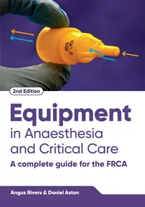

---

**Time:** 08:28:12 (Asia/Tehran)  
**Blog:** yoyoloit  

**Title:** The Thin Khaki Line: An Operational History of the British and Commonwealth Armies During World War II  

**Details:** English | 2026 | ISBN: 1636245668 | 369 pages | True PDF EPUB | 30.13 MB  

**Link:** http://zavat.pw/ebooks/1636245668.html  

---

**Time:** 08:28:12 (Asia/Tehran)  
**Blog:** yoyoloit  

**Title:** Britain's Munitions Industry in the Second World War: Fighting Fit  

**Details:** English | 2026 | ISBN: 1036136124 | 265 pages | True PDF EPUB | 9.53 MB  

**Link:** http://zavat.pw/ebooks/1036136124.html  

---

**Time:** 08:28:12 (Asia/Tehran)  
**Blog:** yoyoloit  

**Title:** Critical Race Theory: A Primer (Concepts and Insights), 2nd Edition  

**Details:** English | 2026 | ISBN: 9798317700713 | 575 pages | True EPUB | 782.97 KB  

**Link:** http://zavat.pw/ebooks/9798317700713.html  

---

**Time:** 08:28:12 (Asia/Tehran)  
**Blog:** yoyoloit  

**Title:** Poking the Squid: What We Can Learn from Animal Sex  

**Details:** English | 2026 | ISBN: 1324089040 | 272 pages | True EPUB | 163.66 MB  

**Link:** http://zavat.pw/ebooks/1324089040.html  

---

**Time:** 08:28:12 (Asia/Tehran)  
**Blog:** yoyoloit  

**Title:** The Battles of Forum Gallorum and Mutina, 43 BC: Caesar, Antony and the Next Generation of the Third Roman Civil War  

**Details:** English | 2026 | ISBN: 1399039954 | 247 pages | True PDF EPUB | 4.6 MB  

**Link:** http://zavat.pw/ebooks/1399039954.html  

---

**Time:** 08:28:12 (Asia/Tehran)  
**Blog:** yoyoloit  

**Title:** General George Washington – Spymaster Agent 711: The Intelligence Battle during the American War of Independence  

**Details:** English | 2026 | ISBN: 1036147762 | 199 pages | True PDF EPUB | 16.87 MB  

**Link:** http://zavat.pw/ebooks/1036147762.html  

---

**Time:** 08:28:12 (Asia/Tehran)  
**Blog:** yoyoloit  

**Title:** Regression With Dummy Variables, 2nd Edition  

**Details:** English | 2027 | ISBN: 1544334583 | 167 pages | True PDF EPUB | 18.19 MB  

**Link:** http://zavat.pw/ebooks/1544334583.html  

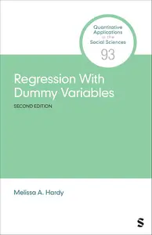

---

**Time:** 08:28:12 (Asia/Tehran)  
**Blog:** yoyoloit  

**Title:** Exploring Public Administration: An Introduction  

**Details:** English | 2027 | ISBN: 1071814427 | 641 pages | True PDF EPUB | 255.09 MB  

**Link:** http://zavat.pw/ebooks/1071814427.html  

---

**Time:** 08:28:12 (Asia/Tehran)  
**Blog:** yoyoloit  

**Title:** The Data Analyst’s Guide to Cause and Effect : An Introduction to Causal Inference in Practice  

**Details:** English | 2027 | ISBN: 9798348848712 | 166 pages | True PDF EPUB | 8.96 MB  

**Link:** http://zavat.pw/ebooks/9798348848712.html  

---

**Time:** 08:28:12 (Asia/Tehran)  
**Blog:** yoyoloit  

**Title:** Statistical Design and Inference for the Social Sciences  

**Details:** English | 2026 | ISBN: 1071848577 | 517 pages | True PDF | 19.18 MB  

**Link:** http://zavat.pw/ebooks/1071848577.html  

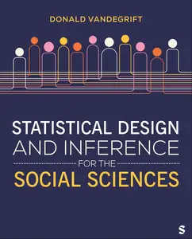

---

**Time:** 08:28:12 (Asia/Tehran)  
**Blog:** yoyoloit  

**Title:** Human Resource Management in Public Service: Paradoxes, Processes, and Problems  

**Details:** English | 2027 | ISBN: 1071917889 | 531 pages | True PDF EPUB | 19.36 MB  

**Link:** http://zavat.pw/ebooks/1071917889.html  

---

**Time:** 08:28:12 (Asia/Tehran)  
**Blog:** yoyoloit  

**Title:** Transforming Health Care: Creating Equitable, Antiracist Healthcare Organizations  

**Details:** English | 2026 | ISBN: 019780537X | 185 pages | True PDF | 1.56 MB  

**Link:** http://zavat.pw/ebooks/019780537X.html  

---

**Time:** 08:28:12 (Asia/Tehran)  
**Blog:** yoyoloit  

**Title:** Populations of Individuals : Understanding Biological Variation From Molecules to Ecosystems  

**Details:** English | 2026 | ISBN: 0197846009 | 249 pages | True PDF EPUB | 10.91 MB  

**Link:** http://zavat.pw/ebooks/0197846009.html  

---

**Time:** 08:28:12 (Asia/Tehran)  
**Blog:** AvaxGenius  

**Title:** Multiobjective Evolutionary Algorithms and Applications (Repost)  

**Details:** English | PDF(True) | 2005 | 295 Pages | ISBN : 1852338369 | 144.7 MB  

**Link:** http://zavat.pw/ebooks/185423383649.html  

---

**Time:** 08:28:12 (Asia/Tehran)  
**Blog:** AvaxGenius  

**Title:** Artificial Intelligence in Models, Methods and Applications (Repost)  

**Details:** English | EPUB | 2023 | 694 Pages | ISBN : 3031229371 | 106.4MB  

**Link:** http://zavat.pw/ebooks/340312293741.html  

---

**Time:** 08:28:12 (Asia/Tehran)  
**Blog:** AvaxGenius  

**Title:** Diagnostic Thoracic Pathology (Repost)  

**Details:** English | PDF | 2020 | 1133 Pages | ISBN : 3030364372 | 393 MB  

**Link:** http://zavat.pw/ebooks/303307364372.html  

---

**Time:** 08:28:12 (Asia/Tehran)  
**Blog:** AvaxGenius  

**Title:** Pain Imaging: A Clinical-Radiological Approach to Pain Diagnosis (Repost)  

**Details:** English | PDF,EPUB | 2019 | 449 Pages | ISBN : 3319998218 | 221.6 MB  

**Link:** http://zavat.pw/ebooks/33197998218.html  

---

**Time:** 08:28:12 (Asia/Tehran)  
**Blog:** AvaxGenius  

**Title:** Structures of Coastal Resilience (Repost)  

**Details:** English | PDF,EPUB (Both True ) | 2018 | 262 Pages | ISBN : 1610918584 | 216.59 MB  

**Link:** http://zavat.pw/ebooks/16109168584.html  

---

**Time:** 08:28:12 (Asia/Tehran)  
**Blog:** AvaxGenius  

**Title:** Frontiers in Computational Fluid-Structure Interaction and Flow Simulation (Repost)  

**Details:** English | PDF,EPUB | 2018 | 493 Pages | ISBN : 3319964682 | 198.5 MB  

**Link:** http://zavat.pw/ebooks/33169964682.html  

---

**Time:** 08:28:12 (Asia/Tehran)  
**Blog:** AvaxGenius  

**Title:** The Muse: Misunderstandings and Their Remedies  

**Details:** English | PDF EPUB (True) | 2023 | 549 Pages | ISBN : N/A | 16.6 MB  

**Link:** http://zavat.pw/ebooks/The_Muse.html  

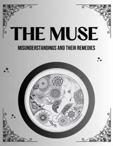

---

**Time:** 08:28:12 (Asia/Tehran)  
**Blog:** AvaxGenius  

**Title:** Genetic Narratology: Analysing Narrative across Versions  

**Details:** English | PDF (True) | 2024 | 322 Pages | ISBN : 1805113992 | 6.2 MB  

**Link:** http://zavat.pw/ebooks/1805113992.html  

---

**Time:** 08:28:12 (Asia/Tehran)  
**Blog:** AvaxGenius  

**Title:** Breaking Images: Iconoclastic Analyses of Mathematics and its Education  

**Details:** English | PDF (True) | 2024 | 602 Pages | ISBN : 1805113216 | 7.6 MB  

**Link:** http://zavat.pw/ebooks/1805113216.html  

---

**Time:** 08:28:12 (Asia/Tehran)  
**Blog:** AvaxGenius  

**Title:** Super Minimally Invasive Surgery: Gastrointestinal Endoscopy Section  

**Details:** English | PDF (True) | 2026 | 548 Pages | ISBN : 9782759838424 | 31.3 MB  

**Link:** http://zavat.pw/ebooks/9782759838424.html  

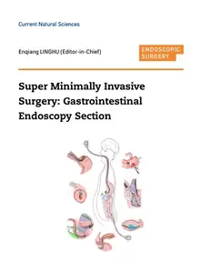

---

**Time:** 08:28:12 (Asia/Tehran)  
**Blog:** AvaxGenius  

**Title:** The Air and its Secrets: A History of Atmospheric Science  

**Details:** English | PDF (True) | 2025 | 488 Pages | ISBN : 275983820X | 21.9 MB  

**Link:** http://zavat.pw/ebooks/275983820X.html  

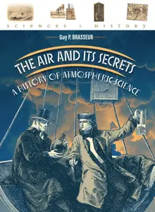

---

**Time:** 08:28:12 (Asia/Tehran)  
**Blog:** AvaxGenius  

**Title:** Earth’s climate response to a changing Sun  

**Details:** English | PDF EPUB (True) | 2016 | 361 Pages | ISBN : 2759817334 | 58.9 MB  

**Link:** http://zavat.pw/ebooks/2759817334T.html  

---

**Time:** 08:28:12 (Asia/Tehran)  
**Blog:** AvaxGenius  

**Title:** Space Weather and Space Climate - A timeline  

**Details:** English | PDF (True) | 2024 | 168 Pages | ISBN : 275983610X | 24.5 MB  

**Link:** http://zavat.pw/ebooks/275983610X.html  

---

**Time:** 08:28:12 (Asia/Tehran)  
**Blog:** crazy-slim  

**Title:** Io Donna del Corriere della Sera - 13 Giugno 2026  

**Details:** Italiano | 116 pages | True PDF | 19.5 MB  

**Link:** http://zavat.pw/magazines/IoDonnadelCorrieredellaSera13Giugno2026-22990.html  

---

**Time:** 08:28:12 (Asia/Tehran)  
**Blog:** crazy-slim  

**Title:** SportWeek - 13 Giugno 2026  

**Details:** Italiano | 116 pages | True PDF | 17.7 MB  

**Link:** http://zavat.pw/magazines/SportWeek13Giugno2026-49948.html  

---

**Time:** 08:28:12 (Asia/Tehran)  
**Blog:** crazy-slim  

**Title:** La Sicilia - 13 Giugno 2026  

**Details:** Italiano | 64 pages | PDF | 186.7 MB  

**Link:** http://zavat.pw/newspapers/LaSicilia13Giugno2026-43143.html  

---

**Time:** 08:28:12 (Asia/Tehran)  
**Blog:** crazy-slim  

**Title:** Libero - 13 Giugno 2026  

**Details:** Italiano | 40 pages | PDF | 87.4 MB  

**Link:** http://zavat.pw/newspapers/Libero13Giugno2026-32776.html  

---

**Time:** 08:28:12 (Asia/Tehran)  
**Blog:** crazy-slim  

**Title:** El País - 13 Junio 2026  

**Details:** Español | 64 pages | True PDF | 23.4 MB  

**Link:** http://zavat.pw/newspapers/ElPa%C3%ADs13Junio2026-33906.html  

---

**Time:** 08:28:12 (Asia/Tehran)  
**Blog:** crazy-slim  

**Title:** Tuttolibri - 13 Giugno 2026  

**Details:** Italiano | 24 pages | True PDF | 10.5 MB  

**Link:** http://zavat.pw/newspapers/Tuttolibri13Giugno2026-69098.html  

---

**Time:** 08:28:12 (Asia/Tehran)  
**Blog:** crazy-slim  

**Title:** Quotidiano di Puglia Taranto - 13 Giugno 2026  

**Details:** Italiano | 28 pages | True PDF | 14.4 MB  

**Link:** http://zavat.pw/newspapers/QuotidianodiPugliaTaranto13Giugno2026-85834.html  

---

**Time:** 08:28:12 (Asia/Tehran)  
**Blog:** crazy-slim  

**Title:** laRegione - 13 Giugno 2026  

**Details:** Italiano | 28 pages | PDF | 87.6 MB  

**Link:** http://zavat.pw/newspapers/laRegione13Giugno2026-98208.html  

---

**Time:** 08:28:12 (Asia/Tehran)  
**Blog:** crazy-slim  

**Title:** Quotidiano di Puglia Lecce - 13 Giugno 2026  

**Details:** Italiano | 28 pages | True PDF | 13.3 MB  

**Link:** http://zavat.pw/newspapers/QuotidianodiPugliaLecce13Giugno2026-41708.html  

---

**Time:** 08:28:12 (Asia/Tehran)  
**Blog:** crazy-slim  

**Title:** Quotidiano di Puglia Brindisi - 13 Giugno 2026  

**Details:** Italiano | 28 pages | True PDF | 14.3 MB  

**Link:** http://zavat.pw/newspapers/QuotidianodiPugliaBrindisi13Giugno2026-94533.html  

---

**Time:** 08:28:12 (Asia/Tehran)  
**Blog:** crazy-slim  

**Title:** Quotidiano di Puglia Bari - 13 Giugno 2026  

**Details:** Italiano | 28 pages | True PDF | 12.8 MB  

**Link:** http://zavat.pw/newspapers/QuotidianodiPugliaBari13Giugno2026-54895.html  

---

**Time:** 08:28:12 (Asia/Tehran)  
**Blog:** crazy-slim  

**Title:** Messaggero Veneto Udine - 13 Giugno 2026  

**Details:** Italiano | 56 pages | True PDF | 16.6 MB  

**Link:** http://zavat.pw/newspapers/MessaggeroVenetoUdine13Giugno2026-27870.html  

---

**Time:** 08:28:12 (Asia/Tehran)  
**Blog:** crazy-slim  

**Title:** Messaggero Veneto Pordenone - 13 Giugno 2026  

**Details:** Italiano | 56 pages | True PDF | 17.9 MB  

**Link:** http://zavat.pw/newspapers/MessaggeroVenetoPordenone13Giugno2026-46133.html  

---

**Time:** 08:28:12 (Asia/Tehran)  
**Blog:** crazy-slim  

**Title:** Messaggero Veneto Gorizia - 13 Giugno 2026  

**Details:** Italiano | 56 pages | True PDF | 16.8 MB  

**Link:** http://zavat.pw/newspapers/MessaggeroVenetoGorizia13Giugno2026-74380.html  

---

**Time:** 08:28:12 (Asia/Tehran)  
**Blog:** crazy-slim  

**Title:** Libertà Sicilia - 13 Giugno 2026  

**Details:** Italiano | 12 pages | True PDF | 3.6 MB  

**Link:** http://zavat.pw/newspapers/Libert%C3%A0Sicilia13Giugno2026-98833.html  

---

**Time:** 03:45:00 (Asia/Tehran)  
**Blog:** AvaxGenius  

**Title:** Thermodynamic Mechanism of MQL Grinding with Nano Bio-lubricant (Repost)  

**Details:** English | EPUB (True) | 2023 | 412 Pages | ISBN : 9819962641 | 108.7 MB  

**Link:** http://zavat.pw/ebooks/98199662641.html  

---

**Time:** 03:45:00 (Asia/Tehran)  
**Blog:** AvaxGenius  

**Title:** Advances in Automation, Mechanical and Design Engineering: SAMDE 2022 (Repost)  

**Details:** English | EPUB (True) | 2023 | 467 Pages | ISBN : 3031400690 | 112.3 MB  

**Link:** http://zavat.pw/ebooks/30314070690.html  

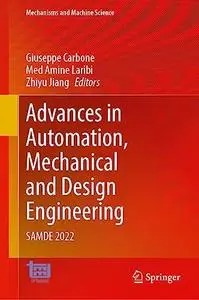

---

**Time:** 03:45:00 (Asia/Tehran)  
**Blog:** AvaxGenius  

**Title:** Sustainable Communication Networks and Application: Proceedings of ICSCN 2020 (Repost)  

**Details:** English | EPUB | 2021 | 681 Pages | ISBN : 9811586764 | 114.6 MB  

**Link:** http://zavat.pw/ebooks/98115876764.html  

---

**Time:** 03:45:00 (Asia/Tehran)  
**Blog:** AvaxGenius  

**Title:** Advances in Nonlinear Dynamics, Volume III (Repost)  

**Details:** English | EPUB (True) | 2024 | 649 Pages | ISBN : 3031506340 | 120 MB  

**Link:** http://zavat.pw/ebooks/30315706340.html  

---

**Time:** 03:45:00 (Asia/Tehran)  
**Blog:** AvaxGenius  

**Title:** Plants and People in the African Past: Progress in African Archaeobotany (Repost)  

**Details:** English | PDF,EPUB | 2018 | 577 Pages | ISBN : 3319898388 | 129.99 MB  

**Link:** http://zavat.pw/ebooks/33198978388.html  

---

**Time:** 03:45:00 (Asia/Tehran)  
**Blog:** AvaxGenius  

**Title:** Robotics for Sustainable Future: CLAWAR 2021 (Repost)  

**Details:** English | EPUB | 2022 | 508 Pages | ISBN : 3030862933 | 139.6 MB  

**Link:** http://zavat.pw/ebooks/30308627933.html  

---

**Time:** 03:45:00 (Asia/Tehran)  
**Blog:** AvaxGenius  

**Title:** The Geohistorical Approach: Methods and Applications (Repost)  

**Details:** English | EPUB | 2020 | 360 Pages | ISBN : 3030424383 | 178.5 MB  

**Link:** http://zavat.pw/ebooks/30306424383.html  

---

**Time:** 03:45:00 (Asia/Tehran)  
**Blog:** AvaxGenius  

**Title:** Geotechnics for Natural Disaster Mitigation and Management (Repost)  

**Details:** English | EPUB | 2020 | 148 Pages | ISBN : 981138827X | 95.5 MB  

**Link:** http://zavat.pw/ebooks/9811358827X.html  

---

**Time:** 03:45:00 (Asia/Tehran)  
**Blog:** AvaxGenius  

**Title:** Endovascular Treatment of Arterial Emergencies (Repost)  

**Details:** English | EPUB | 2021 | 252 Pages | ISBN : 3030688313 | 96.4 MB  

**Link:** http://zavat.pw/ebooks/303056883123.html  

---

**Time:** 03:45:00 (Asia/Tehran)  
**Blog:** AvaxGenius  

**Title:** In Vitro Fertilization: A Textbook of Current and Emerging Methods and Devices, Second Edition (Repost)  

**Details:** English | EPUB | 2019 | 962 Pages | ISBN : 3319430106 | 97.6 MB  

**Link:** http://zavat.pw/ebooks/331946301065.html  

---

**Time:** 03:45:00 (Asia/Tehran)  
**Blog:** AvaxGenius  

**Title:** The Art of Skin Graft: Advanced Graft Technique (Repost)  

**Details:** English | EPUB (True) | 2024 | 299 Pages | ISBN : 9819700167 | 563.2 MB  

**Link:** http://zavat.pw/ebooks/981957001267.html  

---

**Time:** 00:33:49 (Asia/Tehran)  
**Blog:** AvaxGenius  

**Title:** An Introduction to Linear Programming and Game Theory, Third Edition  

**Details:** English | PDF (True) | 2008 | 476 Pages | ISBN : 0470232862 | 14.6 MB  

**Link:** http://zavat.pw/ebooks/04702328262.html  

---

**Time:** 00:33:49 (Asia/Tehran)  
**Blog:** hill0  

**Title:** ML and Generative AI in the Data Lakehouse  

**Details:** English | 2026 | ISBN: 1098178491 | 556 Pages | EPUB | 12 MB  

**Link:** http://zavat.pw/ebooks/1098178491.html  

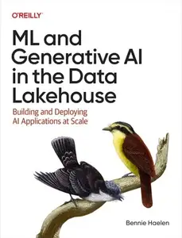

---

**Time:** 00:33:49 (Asia/Tehran)  
**Blog:** hill0  

**Title:** The C4 Model: Visualizing Software Architecture  

**Details:** English | 2026 | ASIN: B0GC5YKYFD | 189 Pages | EPUB | 9 MB  

**Link:** http://zavat.pw/ebooks/B0GC5YKYFD.html  

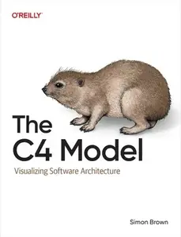

---

**Time:** 00:33:49 (Asia/Tehran)  
**Blog:** hill0  

**Title:** Creative AI Agents with Copilot Studio  

**Details:** English | 2026 | ASIN: B0GT8C2ZZZ | 343 Pages | EPUB | 8 MB  

**Link:** http://zavat.pw/ebooks/B0GT8C2ZZZ.html  

---

**Time:** 00:33:49 (Asia/Tehran)  
**Blog:** hill0  

**Title:** Linux Security Foundations  

**Details:** English | 2026 | ASIN: B0GN6NP8Y9 | 417 Pages | EPUB | 2 MB  

**Link:** http://zavat.pw/ebooks/B0GN6NP8Y9.html  

---

**Time:** 00:33:49 (Asia/Tehran)  
**Blog:** hill0  

**Title:** The Waiting Room  

**Details:** English | 2026 | ISBN: 0008781788 | 225 Pages | EPUB (True) | 2 MB  

**Link:** http://zavat.pw/ebooks/0008781788.html  

---

**Time:** 00:33:49 (Asia/Tehran)  
**Blog:** hill0  

**Title:** Low Carbon Research Methods  

**Details:** English | 2026 | ISBN: 1915983487 | 255 Pages | EPUB (True) | 0.7 MB  

**Link:** http://zavat.pw/ebooks/1915983487.html  

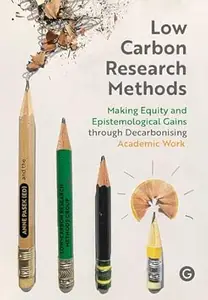

---

**Time:** 00:33:49 (Asia/Tehran)  
**Blog:** hill0  

**Title:** Blood and Progress  

**Details:** English | 2026 | ISBN: 1546011412 | 316 Pages | EPUB (True) | 3 MB  

**Link:** http://zavat.pw/ebooks/1546011412.html  

---

**Time:** 00:33:49 (Asia/Tehran)  
**Blog:** hill0  

**Title:** Leverage Leadership 3.0  

**Details:** English | 2026 | ISBN: 139432443X | 507 Pages | EPUB (True) | 4 MB  

**Link:** http://zavat.pw/ebooks/139432443X.html  

---

**Time:** 00:33:49 (Asia/Tehran)  
**Blog:** hill0  

**Title:** The Edge of Knowing  

**Details:** English | 2026 | ISBN: 946258768X | 177 Pages | PDF EPUB (True) | 68 MB  

**Link:** http://zavat.pw/ebooks/946258768X.html  

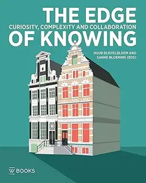

