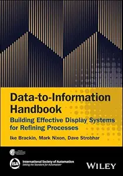
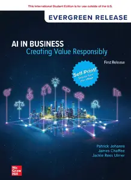

# Zavat feed - 2026-06-17

---

**Time:** 11:58:46 (Asia/Tehran)  
**Blog:** AvaxGenius  

**Title:** ETHICS: Endorse Technologies for Heritage Innovation: Cross-disciplinary Strategies (Repost)  

**Details:** English | EPUB (True) | 2024 | 356 Pages | ISBN : 3031501209 | 96.7 MB  

**Link:** http://zavat.pw/ebooks/30318501209.html  

---

**Time:** 11:58:46 (Asia/Tehran)  
**Blog:** AvaxGenius  

**Title:** Climate Change Impacts on Nigeria: Environment and Sustainable Development (Repost)  

**Details:** English | PDF,EPUB | 2023 | 581 Pages | ISBN : 3031210069 | 123 MB  

**Link:** http://zavat.pw/ebooks/30312170069.html  

---

**Time:** 11:58:46 (Asia/Tehran)  
**Blog:** AvaxGenius  

**Title:** Immersive Analytics (Repost)  

**Details:** English | PDF | 2018 | 365 Pages | ISBN : 3030013871 | 141.3 MB  

**Link:** http://zavat.pw/ebooks/30300136871.html  

---

**Time:** 11:58:46 (Asia/Tehran)  
**Blog:** AvaxGenius  

**Title:** Advances in Effective Flow Separation Control for Aircraft Drag Reduction: Modeling, Simulations and Experimentations (Repost)  

**Details:** English | EPUB | 2020 | 340 Pages | ISBN : 3030296873 | 121 MB  

**Link:** http://zavat.pw/ebooks/30380296873.html  

---

**Time:** 11:58:46 (Asia/Tehran)  
**Blog:** AvaxGenius  

**Title:** Geology and Tectonics of Northwestern South America: The Pacific-Caribbean-Andean Junction (Repost)  

**Details:** English | EPUB | 2019 | 1010 Pages | ISBN : 3319761315 | 362.9 MB  

**Link:** http://zavat.pw/ebooks/83319761315.html  

---

**Time:** 11:58:46 (Asia/Tehran)  
**Blog:** AvaxGenius  

**Title:** The Encapsulation Phenomenon: Synthesis, Reactivity and Applications of Caged Ions and Molecules (Repost)  

**Details:** English | PDF | 2016 | 653 Pages | ISBN : 3319277375 | 125.1 MB  

**Link:** http://zavat.pw/ebooks/33192797375.html  

---

**Time:** 11:58:46 (Asia/Tehran)  
**Blog:** AvaxGenius  

**Title:** Large Igneous Provinces: A Driver of Global Environmental and Biotic Changes (Repost)  

**Details:** English | PDF | 2021 | 514 Pages | ISBN : 1119507456 | 105.96 MB  

**Link:** http://zavat.pw/ebooks/11195507456.html  

---

**Time:** 11:58:46 (Asia/Tehran)  
**Blog:** AvaxGenius  

**Title:** Handbook of Thermal Management of Engines (Repost)  

**Details:** English | EPUB(True) | 2022 | 562 Pages | ISBN : 981168569X | 181.9 MB  

**Link:** http://zavat.pw/ebooks/9819168569X.html  

---

**Time:** 11:58:46 (Asia/Tehran)  
**Blog:** AvaxGenius  

**Title:** Beteiligungsmanagement und Bewertung für Praktiker (Repost)  

**Details:** Deutsch | EPUB | 2020 | 811 Pages | ISBN : 3658307919 | 115.6 MB  

**Link:** http://zavat.pw/ebooks/36583078919.html  

---

**Time:** 11:58:46 (Asia/Tehran)  
**Blog:** AvaxGenius  

**Title:** Carpal Instability: The Comprehensive Case-Based Approach (Repost)  

**Details:** English | EPUB (True) | 2024 | 532 Pages | ISBN : 3031558685 | 255.5 MB  

**Link:** http://zavat.pw/ebooks/30381558685.html  

---

**Time:** 11:58:46 (Asia/Tehran)  
**Blog:** AvaxGenius  

**Title:** Fabrication of Micro/Nano Structures via Precision Machining: Modelling, Processing and Evaluation (Repost)  

**Details:** English | EPUB (True) | 2023 | 397 Pages | ISBN : 9819913373 | 187.7 MB  

**Link:** http://zavat.pw/ebooks/98199913373.html  

---

**Time:** 11:58:46 (Asia/Tehran)  
**Blog:** AvaxGenius  

**Title:** The Future of the Gulf Region: Value Change and Global Cycles (Repost)  

**Details:** English | EPUB | 2021 | 470 Pages | ISBN : 3030782980 | 102.1 MB  

**Link:** http://zavat.pw/ebooks/30308782980.html  

---

**Time:** 11:58:46 (Asia/Tehran)  
**Blog:** AvaxGenius  

**Title:** NanoCarbon: A Wonder Material for Energy Applications (Repost)  

**Details:** English | EPUB (True) | 2024 | 389 Pages | ISBN : 9819999308 | 96.7 MB  

**Link:** http://zavat.pw/ebooks/98199899308.html  

---

**Time:** 11:58:46 (Asia/Tehran)  
**Blog:** AvaxGenius  

**Title:** The Failed Rotator Cuff: Diagnosis and Management (Repost)  

**Details:** English | PDF,EPUB | 2021 | 307 Pages | ISBN : 3030794806 | 104.8 MB  

**Link:** http://zavat.pw/ebooks/73030794806.html  

---

**Time:** 11:58:46 (Asia/Tehran)  
**Blog:** AvaxGenius  

**Title:** Switching Arc Phenomena in Transmission Voltage Level Vacuum Circuit Breakers (Repost)  

**Details:** English | EPUB | 2021 | 434 Pages | ISBN : 9811613974 | 154.1 MB  

**Link:** http://zavat.pw/ebooks/98181613974.html  

---

**Time:** 06:28:05 (Asia/Tehran)  
**Blog:** yoyoloit  

**Title:** Not Built in a Day : How Slavery Made the Roman Empire  

**Details:** English | 2026 | ISBN: 1668089556 | 448 pages | True EPUB | 18.14 MB  

**Link:** http://zavat.pw/ebooks/1668089556.html  

---

**Time:** 06:28:05 (Asia/Tehran)  
**Blog:** yoyoloit  

**Title:** The Invisible Interface: How AI Turns Intentions into Actions - and Who Wins  

**Details:** English | 2026 | ISBN: 1646872487 | 340 pages | True EPUB | 1.78 MB  

**Link:** http://zavat.pw/ebooks/1646872487.html  

---

**Time:** 06:28:05 (Asia/Tehran)  
**Blog:** yoyoloit  

**Title:** Alexander: God, King, Man  

**Details:** English | 2026 | ISBN: 1250285615 | 496 pages | True EPUB | 41.76 MB  

**Link:** http://zavat.pw/ebooks/1250285615.html  

---

**Time:** 06:28:05 (Asia/Tehran)  
**Blog:** yoyoloit  

**Title:** Post-Merger Integration: Building the Mindset, Skills, and Discipline Needed for Deal Success  

**Details:** English | 2026 | ISBN: 1394380844 | 227 pages | True PDF EPUB | 6.12 MB  

**Link:** http://zavat.pw/ebooks/1394380844.html  

---

**Time:** 06:28:05 (Asia/Tehran)  
**Blog:** yoyoloit  

**Title:** Breaking Negative Thinking Patterns Step by Step  

**Details:** English | 2026 | ISBN: 1394360355 | 275 pages | True PDF | 3.64 MB  

**Link:** http://zavat.pw/ebooks/1394360355.html  

---

**Time:** 06:28:05 (Asia/Tehran)  
**Blog:** yoyoloit  

**Title:** Computational Methods for Quantum High-Energy-Density Physics (Oxford Graduate Texts)  

**Details:** English | 2026 | ISBN: 019899608X | 369 pages | True PDF | 15.58 MB  

**Link:** http://zavat.pw/ebooks/019899608X.html  

---

**Time:** 06:28:05 (Asia/Tehran)  
**Blog:** yoyoloit  

**Title:** Human Sexuality: A Well-Being Approach  

**Details:** English | 2027 | ISBN: 1071886436 | 480 pages | True EPUB | 40.12 MB  

**Link:** http://zavat.pw/ebooks/1071886436.html  

---

**Time:** 06:28:05 (Asia/Tehran)  
**Blog:** yoyoloit  

**Title:** The Flow Multiplier: Building Peak Performance Systems With AI  

**Details:** English | 2026 | ISBN: 9798897010806 | 164 pages | True EPUB | 916.29 KB  

**Link:** http://zavat.pw/ebooks/9798897010806.html  

---

**Time:** 06:28:05 (Asia/Tehran)  
**Blog:** yoyoloit  

**Title:** Agentic Intelligence: Strategy at the Speed of Data  

**Details:** English | 2026 | ISBN: 9798887508566 | 280 pages | True EPUB | 1.76 MB  

**Link:** http://zavat.pw/ebooks/9798887508566.html  

---

**Time:** 06:28:05 (Asia/Tehran)  
**Blog:** yoyoloit  

**Title:** Medical Oncology Illustrated Board Review  

**Details:** English | 2026 | ISBN: 0826146635 | 594 pages | True PDF EPUB | 233.88 MB  

**Link:** http://zavat.pw/ebooks/0826146635.html  

---

**Time:** 06:28:05 (Asia/Tehran)  
**Blog:** yoyoloit  

**Title:** Docs for Developers: An Engineer’s Field Guide to Technical Writing, 2nd Edition  

**Details:** English | 2026 | ISBN: 9798868825088 | 271 pages | True PDF EPUB | 8.34 MB  

**Link:** http://zavat.pw/ebooks/9798868825088a.html  

---

**Time:** 06:28:05 (Asia/Tehran)  
**Blog:** yoyoloit  

**Title:** Data-to-Information Handbook: Building Effective Display Systems for Refining Processes  

**Details:** English | 2026 | ISBN: 1394402457 | 259 pages | True PDF | 8.26 MB  

**Link:** http://zavat.pw/ebooks/1394402457.html  

---

**Time:** 06:28:05 (Asia/Tehran)  
**Blog:** yoyoloit  

**Title:** Teachers, Schools, and Society: A Brief Introduction to Education: 2026 Release ISE  

**Details:** English | 2026 | ISBN: 1266253645 | 449 pages | True PDF EPUB | 281 MB  

**Link:** http://zavat.pw/ebooks/1266253645.html  

---

**Time:** 06:28:05 (Asia/Tehran)  
**Blog:** yoyoloit  

**Title:** Experiencing the World's Religions: Tradition, Challenge, and Change: 2026 Release ISE  

**Details:** English | 2026 | ISBN: 1266808701 | 561 pages | True PDF EPUB | 286.18 MB  

**Link:** http://zavat.pw/ebooks/1266808701.html  

---

**Time:** 06:28:05 (Asia/Tehran)  
**Blog:** yoyoloit  

**Title:** AI in Business: Creating Value Responsibly ISE  

**Details:** English | 2026 | ISBN: 9781265658632 | 300 pages | True EPUB | 32.36 MB  

**Link:** http://zavat.pw/ebooks/9781265658632.html  

---

**Time:** 03:23:57 (Asia/Tehran)  
**Blog:** yoyoloit  

**Title:** Flowerprint: The Wild, Wonderful World of Botanical Dyeing  

**Details:** English | 2026 | ISBN: 1643265318 | 268 pages | True EPUB | 82.72 MB  

**Link:** http://zavat.pw/ebooks/1643265318.html  

---

**Time:** 03:23:57 (Asia/Tehran)  
**Blog:** yoyoloit  

**Title:** Oversharing : Anytime Snacks, Everyday Dinners, and Cooking for Company  

**Details:** English | 2026 | ISBN: 1454962348 | 288 pages | True EPUB | 190.31 MB  

**Link:** http://zavat.pw/ebooks/1454962348.html  

---

**Time:** 03:23:57 (Asia/Tehran)  
**Blog:** yoyoloit  

**Title:** A Little Something: Snacks, picky bits, dips and drinks for lazy days  

**Details:** English | 2026 | ISBN: 1761501771 | 157 pages | True PDF | 84.57 MB  

**Link:** http://zavat.pw/ebooks/1761501771.html  

---

**Time:** 03:23:57 (Asia/Tehran)  
**Blog:** yoyoloit  

**Title:** Mastering Unreal Engine 5 Game Development with C++ Scripting: Build efficient, scalable gameplay systems using advanced C++  

**Details:** English | 2026 | ISBN: 180666593X | 270 pages | True PDF EPUB | 64.25 MB  

**Link:** http://zavat.pw/ebooks/180666593X.html  

---

**Time:** 03:23:57 (Asia/Tehran)  
**Blog:** yoyoloit  

**Title:** Zephyr RTOS Cookbook : Build Portable and Scalable Embedded Systems Through Hands-on Recipes  

**Details:** English | 2026 | ISBN: 1807429172 | 224 pages | True PDF EPUB | 57.33 MB  

**Link:** http://zavat.pw/ebooks/1807429172.html  

---

**Time:** 03:23:57 (Asia/Tehran)  
**Blog:** yoyoloit  

**Title:** Soccer Analytics with Machine Learning : Learning Predictive Modeling Techniques with Sports Data  

**Details:** English | 2026 | ISBN: 1098181115 | 345 pages | True PDF EPUB | 12.66 MB  

**Link:** http://zavat.pw/ebooks/1098181115a.html  

---

**Time:** 03:23:57 (Asia/Tehran)  
**Blog:** yoyoloit  

**Title:** Exercises for Resistance Training : A Practical Guide to Technique, Cueing, and Coaching  

**Details:** English | 2026 | ISBN: 1718239890 | 256 pages | True EPUB | 219.38 MB  

**Link:** http://zavat.pw/ebooks/1718239890.html  

---

**Time:** 03:23:57 (Asia/Tehran)  
**Blog:** IrGens  

**Title:** The Frenzy: Stories  

**Details:** English | June 16, 2026 | ISBN: 0593978110, 9780593978139 | True EPUB | 336 pages | 2.8 MB  

**Link:** http://zavat.pw/ebooks/0593978110.html  

---

**Time:** 03:23:57 (Asia/Tehran)  
**Blog:** IrGens  

**Title:** Monumental: Great Buildings of the World Through the Hands and Eyes of a Stonemason  

**Details:** English | 21 May 2026 | ISBN: 000865882X, 9780008658847 | True EPUB | 368 pages | 39.7 MB  

**Link:** http://zavat.pw/ebooks/000865882X.html  

---

**Time:** 01:36:43 (Asia/Tehran)  
**Blog:** IrGens  

**Title:** The Wisdom of Feeling: Finding Clarity, Courage, and Connection Through Emotional Intelligence  

**Details:** English | June 16, 2026 | ISBN: 0593851021, 9780593851043 | True EPUB | 304 pages | 1.5 MB  

**Link:** http://zavat.pw/ebooks/0593851021.html  

---

**Time:** 01:36:43 (Asia/Tehran)  
**Blog:** IrGens  

**Title:** Boys: Building strong young men from the inside out  

**Details:** English | 16 Jun. 2026 | ISBN: 0733342523, 9781460715116 | True EPUB | 352 pages | 3.4 MB  

**Link:** http://zavat.pw/ebooks/0733342523.html  

---

**Time:** 01:36:43 (Asia/Tehran)  
**Blog:** IrGens  

**Title:** An American Journey  

**Details:** English | May 29, 2026 | ISBN: 1915812909, 9781915812919 | True EPUB | 232 pages | 3.2 MB  

**Link:** http://zavat.pw/ebooks/1915812909.html  

---

**Time:** 01:36:43 (Asia/Tehran)  
**Blog:** IrGens  

**Title:** Against Heritage: The Reinvention of Traditional Foods  

**Details:** English | May 19, 2026 | ISBN: 1469694530, 1469694549, 9781469684727 | True EPUB | 244 pages | 3.5 MB  

**Link:** http://zavat.pw/ebooks/1469694530.html  

---

**Time:** 01:36:43 (Asia/Tehran)  
**Blog:** IrGens  

**Title:** The One and the Ninety-Nine: Forging Identity in the Age of Social Contagion  

**Details:** English | June 16, 2026 | ISBN: 1250373034, 9781250373045 | True EPUB | 288 pages | 17.4 MB  

**Link:** http://zavat.pw/ebooks/1250373034.html  

---

**Time:** 01:36:43 (Asia/Tehran)  
**Blog:** hill0  

**Title:** Data Science Programming All-in-One For Dummies  

**Details:** English | 2020 | ISBN: 1119626110 | 854 Pages | EPUB (True) | 7 MB  

**Link:** http://zavat.pw/ebooks/1119626110.html  

---

**Time:** 01:36:43 (Asia/Tehran)  
**Blog:** hill0  

**Title:** Docs for Developers (2nd Edition)  

**Details:** English | 2026 | ASIN: B0GH5XQF99 | 271 Pages | PDF EPUB (True) | 5.4 MB  

**Link:** http://zavat.pw/ebooks/B0GH5XQF99t.html  

---

**Time:** 01:36:43 (Asia/Tehran)  
**Blog:** hill0  

**Title:** Observability Engineering, 2nd Edition  

**Details:** English | 2026 | ISBN: 1098179927 | 692 Pages | EPUB | 12 MB  

**Link:** http://zavat.pw/ebooks/1098179927.html  

