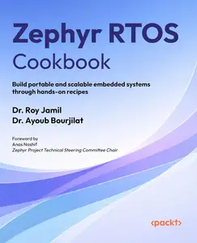
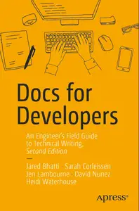
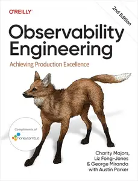

# Zavat feed - 2026-06-17

---

**Time:** 03:23:57 (Asia/Tehran)  
**Blog:** yoyoloit  

**Title:** Flowerprint: The Wild, Wonderful World of Botanical Dyeing  

**Details:** English | 2026 | ISBN: 1643265318 | 268 pages | True EPUB | 82.72 MB  

**Link:** http://zavat.pw/ebooks/1643265318.html  

---

**Time:** 03:23:57 (Asia/Tehran)  
**Blog:** yoyoloit  

**Title:** Oversharing : Anytime Snacks, Everyday Dinners, and Cooking for Company  

**Details:** English | 2026 | ISBN: 1454962348 | 288 pages | True EPUB | 190.31 MB  

**Link:** http://zavat.pw/ebooks/1454962348.html  

---

**Time:** 03:23:57 (Asia/Tehran)  
**Blog:** yoyoloit  

**Title:** A Little Something: Snacks, picky bits, dips and drinks for lazy days  

**Details:** English | 2026 | ISBN: 1761501771 | 157 pages | True PDF | 84.57 MB  

**Link:** http://zavat.pw/ebooks/1761501771.html  

---

**Time:** 03:23:57 (Asia/Tehran)  
**Blog:** yoyoloit  

**Title:** Mastering Unreal Engine 5 Game Development with C++ Scripting: Build efficient, scalable gameplay systems using advanced C++  

**Details:** English | 2026 | ISBN: 180666593X | 270 pages | True PDF EPUB | 64.25 MB  

**Link:** http://zavat.pw/ebooks/180666593X.html  

---

**Time:** 03:23:57 (Asia/Tehran)  
**Blog:** yoyoloit  

**Title:** Zephyr RTOS Cookbook : Build Portable and Scalable Embedded Systems Through Hands-on Recipes  

**Details:** English | 2026 | ISBN: 1807429172 | 224 pages | True PDF EPUB | 57.33 MB  

**Link:** http://zavat.pw/ebooks/1807429172.html  

---

**Time:** 03:23:57 (Asia/Tehran)  
**Blog:** yoyoloit  

**Title:** Soccer Analytics with Machine Learning : Learning Predictive Modeling Techniques with Sports Data  

**Details:** English | 2026 | ISBN: 1098181115 | 345 pages | True PDF EPUB | 12.66 MB  

**Link:** http://zavat.pw/ebooks/1098181115a.html  

---

**Time:** 03:23:57 (Asia/Tehran)  
**Blog:** yoyoloit  

**Title:** Exercises for Resistance Training : A Practical Guide to Technique, Cueing, and Coaching  

**Details:** English | 2026 | ISBN: 1718239890 | 256 pages | True EPUB | 219.38 MB  

**Link:** http://zavat.pw/ebooks/1718239890.html  

---

**Time:** 03:23:57 (Asia/Tehran)  
**Blog:** IrGens  

**Title:** The Frenzy: Stories  

**Details:** English | June 16, 2026 | ISBN: 0593978110, 9780593978139 | True EPUB | 336 pages | 2.8 MB  

**Link:** http://zavat.pw/ebooks/0593978110.html  

---

**Time:** 03:23:57 (Asia/Tehran)  
**Blog:** IrGens  

**Title:** Monumental: Great Buildings of the World Through the Hands and Eyes of a Stonemason  

**Details:** English | 21 May 2026 | ISBN: 000865882X, 9780008658847 | True EPUB | 368 pages | 39.7 MB  

**Link:** http://zavat.pw/ebooks/000865882X.html  

---

**Time:** 01:36:43 (Asia/Tehran)  
**Blog:** IrGens  

**Title:** The Wisdom of Feeling: Finding Clarity, Courage, and Connection Through Emotional Intelligence  

**Details:** English | June 16, 2026 | ISBN: 0593851021, 9780593851043 | True EPUB | 304 pages | 1.5 MB  

**Link:** http://zavat.pw/ebooks/0593851021.html  

---

**Time:** 01:36:43 (Asia/Tehran)  
**Blog:** IrGens  

**Title:** Boys: Building strong young men from the inside out  

**Details:** English | 16 Jun. 2026 | ISBN: 0733342523, 9781460715116 | True EPUB | 352 pages | 3.4 MB  

**Link:** http://zavat.pw/ebooks/0733342523.html  

---

**Time:** 01:36:43 (Asia/Tehran)  
**Blog:** IrGens  

**Title:** An American Journey  

**Details:** English | May 29, 2026 | ISBN: 1915812909, 9781915812919 | True EPUB | 232 pages | 3.2 MB  

**Link:** http://zavat.pw/ebooks/1915812909.html  

---

**Time:** 01:36:43 (Asia/Tehran)  
**Blog:** IrGens  

**Title:** Against Heritage: The Reinvention of Traditional Foods  

**Details:** English | May 19, 2026 | ISBN: 1469694530, 1469694549, 9781469684727 | True EPUB | 244 pages | 3.5 MB  

**Link:** http://zavat.pw/ebooks/1469694530.html  

---

**Time:** 01:36:43 (Asia/Tehran)  
**Blog:** IrGens  

**Title:** The One and the Ninety-Nine: Forging Identity in the Age of Social Contagion  

**Details:** English | June 16, 2026 | ISBN: 1250373034, 9781250373045 | True EPUB | 288 pages | 17.4 MB  

**Link:** http://zavat.pw/ebooks/1250373034.html  

---

**Time:** 01:36:43 (Asia/Tehran)  
**Blog:** hill0  

**Title:** Data Science Programming All-in-One For Dummies  

**Details:** English | 2020 | ISBN: 1119626110 | 854 Pages | EPUB (True) | 7 MB  

**Link:** http://zavat.pw/ebooks/1119626110.html  

---

**Time:** 01:36:43 (Asia/Tehran)  
**Blog:** hill0  

**Title:** Docs for Developers (2nd Edition)  

**Details:** English | 2026 | ASIN: B0GH5XQF99 | 271 Pages | PDF EPUB (True) | 5.4 MB  

**Link:** http://zavat.pw/ebooks/B0GH5XQF99t.html  

---

**Time:** 01:36:43 (Asia/Tehran)  
**Blog:** hill0  

**Title:** Observability Engineering, 2nd Edition  

**Details:** English | 2026 | ISBN: 1098179927 | 692 Pages | EPUB | 12 MB  

**Link:** http://zavat.pw/ebooks/1098179927.html  

