# Zavat feed - 2026-06-19

---

**Time:** 19:16:24 (Asia/Tehran)  
**Blog:** yoyoloit  

**Title:** Advanced Physics Problems And Solutions - Volume 2: Electricity And Magnetism, Quantum Mechanics, And Statistical Mechanics  

**Details:** English | 2026 | ISBN: 1800618905 | 252 pages | True PDF | 10.19 MB  

**Link:** http://zavat.pw/ebooks/1800618905.html  

---

**Time:** 19:16:24 (Asia/Tehran)  
**Blog:** IrGens  

**Title:** Killing Baby Hitler: A Novel  

**Details:** English | June 9, 2026 | ISBN: 1682194752, 9781682194768 | True EPUB | 320 pages | 4.7 MB  

**Link:** http://zavat.pw/ebooks/1682194752.html  

---

**Time:** 19:16:24 (Asia/Tehran)  
**Blog:** IrGens  

**Title:** Soul on Fire: Martin Luther King Jr. and the Psychology of Nonviolence  

**Details:** English | May 21, 2026 | ISBN: 0197657583, 9780197657607 | True EPUB | 288 pages | 1.9 MB  

**Link:** http://zavat.pw/ebooks/0197657583.html  

---

**Time:** 19:16:24 (Asia/Tehran)  
**Blog:** IrGens  

**Title:** Worse than War: The Global Costs of Violence  

**Details:** English | May 5, 2026 | ISBN: 069116889X, 9780691289656 | True EPUB | 336 pages | 2.4 MB  

**Link:** http://zavat.pw/ebooks/069116889X-epub.html  

---

**Time:** 19:16:24 (Asia/Tehran)  
**Blog:** IrGens  

**Title:** I, Vera: The Many Lives of Vera Gedroits, a Radical Princess  

**Details:** English | 21 May 2026 | ISBN: 0008650381, 9780008650407 | True EPUB | 416 pages | 19.3 MB  

**Link:** http://zavat.pw/ebooks/0008650381.html  

---

**Time:** 19:16:24 (Asia/Tehran)  
**Blog:** IrGens  

**Title:** Fredric Jameson and Film Theory: Marxism, Allegory, and Geopolitics in World Cinema  

**Details:** English | January 14, 2022 | ISBN: 1978808879, 1978808860, ‎ 9781978808898 | True EPUB | 278 pages | 4 MB  

**Link:** http://zavat.pw/ebooks/1978808879-epub.html  

---

**Time:** 19:16:24 (Asia/Tehran)  
**Blog:** IrGens  

**Title:** Deleuze, Mathematics, Metaphysics: Difference and Necessity  

**Details:** English | September 30, 2024 | ISBN: 1399536338, 1399536346, 9781399536363 | True EPUB | 240 pages | 0.4 MB  

**Link:** http://zavat.pw/ebooks/1399536338-epub.html  

---

**Time:** 19:16:24 (Asia/Tehran)  
**Blog:** hill0  

**Title:** High Accuracy Computing Methods: Fluid Flows and Wave Phenomena  

**Details:** English | 2013 | ISBN: 1107023637 | 592 Pages | PDF (True) | 132 MB  

**Link:** http://zavat.pw/ebooks/1107023637.html  

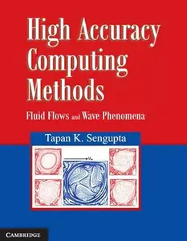

---

**Time:** 19:16:24 (Asia/Tehran)  
**Blog:** hill0  

**Title:** AbstractSwarm Multi-Agent Modeling and Simulation  

**Details:** English | 2026 | ISBN: 9819591317 | 88 Pages | PDF EPUB (True) | 7 MB  

**Link:** http://zavat.pw/ebooks/9819591317.html  

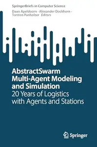

---

**Time:** 19:16:24 (Asia/Tehran)  
**Blog:** hill0  

**Title:** Effektives Arbeiten mit MS Teams, OneNote, Outlook & Co., 3. Auflage  

**Details:** Deutsch | 2026 | ISBN: 3747511996 | 744 Pages | EPUB | 22 MB  

**Link:** http://zavat.pw/ebooks/3747511996.html  

---

**Time:** 19:16:24 (Asia/Tehran)  
**Blog:** crazy-slim  

**Title:** TV Movie - 19 Juni 2026  

**Details:** Deutsch | 196 pages | True PDF | 69.1 MB  

**Link:** http://zavat.pw/magazines/TVMovie19Juni2026-95450.html  

---

**Time:** 19:16:24 (Asia/Tehran)  
**Blog:** crazy-slim  

**Title:** Schwimmbad + Sauna - Juli-August 2026  

**Details:** Deutsch | 159 pages | True PDF | 88.8 MB  

**Link:** http://zavat.pw/magazines/SchwimmbadSaunaJuliAugust2026-58461.html  

---

**Time:** 19:16:24 (Asia/Tehran)  
**Blog:** crazy-slim  

**Title:** Tipi - Sommer 2026  

**Details:** Deutsch | 134 pages | True PDF | 57.4 MB  

**Link:** http://zavat.pw/magazines/TipiSommer2026-61674.html  

---

**Time:** 19:16:24 (Asia/Tehran)  
**Blog:** crazy-slim  

**Title:** TV Hören und Sehen - 19 Juni 2026  

**Details:** Deutsch | 124 pages | True PDF | 29.6 MB  

**Link:** http://zavat.pw/magazines/TVH%C3%B6renundSehen19Juni2026-05911.html  

---

**Time:** 19:16:24 (Asia/Tehran)  
**Blog:** crazy-slim  

**Title:** Land & Berge - Juli-August 2026  

**Details:** Deutsch | 116 pages | True PDF | 53.9 MB  

**Link:** http://zavat.pw/magazines/LandBergeJuliAugust2026-12642.html  

---

**Time:** 19:16:24 (Asia/Tehran)  
**Blog:** crazy-slim  

**Title:** Landhaus Living - Juli-August 2026  

**Details:** Deutsch | 116 pages | True PDF | 59.5 MB  

**Link:** http://zavat.pw/magazines/LandhausLivingJuliAugust2026-56857.html  

---

**Time:** 19:16:24 (Asia/Tehran)  
**Blog:** crazy-slim  

**Title:** Schweizer Garten - Juli 2026  

**Details:** Deutsch | 96 pages | True PDF | 34.5 MB  

**Link:** http://zavat.pw/magazines/SchweizerGartenJuli2026-65788.html  

---

**Time:** 19:16:24 (Asia/Tehran)  
**Blog:** crazy-slim  

**Title:** LandLeben - Juli-August 2026  

**Details:** Deutsch | 117 pages | True PDF | 57.9 MB  

**Link:** http://zavat.pw/magazines/LandLebenJuliAugust2026-61141.html  

---

**Time:** 19:16:24 (Asia/Tehran)  
**Blog:** crazy-slim  

**Title:** Fliegermagazin - 19 Juni 2026  

**Details:** Deutsch | 84 pages | True PDF | 30.4 MB  

**Link:** http://zavat.pw/magazines/Fliegermagazin19Juni2026-16110.html  

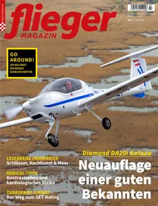

---

**Time:** 19:16:24 (Asia/Tehran)  
**Blog:** crazy-slim  

**Title:** Bild der Frau - 19 Juni 2026  

**Details:** Deutsch | 76 pages | True PDF | 73.6 MB  

**Link:** http://zavat.pw/magazines/BildderFrau19Juni2026-60048.html  

---

**Time:** 19:16:24 (Asia/Tehran)  
**Blog:** crazy-slim  

**Title:** Fernsehwoche - 19 Juni 2026  

**Details:** Deutsch | 96 pages | True PDF | 40.2 MB  

**Link:** http://zavat.pw/magazines/Fernsehwoche19Juni2026-18264.html  

---

**Time:** 19:16:24 (Asia/Tehran)  
**Blog:** crazy-slim  

**Title:** Golf Week - 12 Juni 2026  

**Details:** Deutsch | 64 pages | True PDF | 8.4 MB  

**Link:** http://zavat.pw/magazines/GolfWeek12Juni2026-06578.html  

---

**Time:** 19:16:24 (Asia/Tehran)  
**Blog:** crazy-slim  

**Title:** Das Neue - 19 Juni 2026  

**Details:** Deutsch | 72 pages | True PDF | 33.6 MB  

**Link:** http://zavat.pw/magazines/DasNeue19Juni2026-84889.html  

---

**Time:** 19:16:24 (Asia/Tehran)  
**Blog:** crazy-slim  

**Title:** Der Standard Rondo - 19 Juni 2026  

**Details:** Deutsch | 24 pages | True PDF | 6.1 MB  

**Link:** http://zavat.pw/magazines/DerStandardRondo19Juni2026-81618.html  

---

**Time:** 19:16:24 (Asia/Tehran)  
**Blog:** crazy-slim  

**Title:** Alles für die Frau - 19 Juni 2026  

**Details:** Deutsch | 72 pages | True PDF | 17.2 MB  

**Link:** http://zavat.pw/magazines/Allesf%C3%BCrdieFrau19Juni2026-86576.html  

---

**Time:** 15:30:53 (Asia/Tehran)  
**Blog:** IrGens  

**Title:** Perversions of the Market: Sadism, Masochism, and the Culture of Capitalism  

**Details:** English | December 1, 2024 | ISBN: 9798855800227, 9798855800210, 9798855800234 | True EPUB | 168 pages | 0.7 MB  

**Link:** http://zavat.pw/ebooks/9798855800227.html  

---

**Time:** 15:30:53 (Asia/Tehran)  
**Blog:** IrGens  

**Title:** Ghost-Eye: A Novel  

**Details:** English | June 16, 2026 | ISBN: 0374298394, ‎ 9780374719432 | True EPUB | 336 pages | 4.1 MB  

**Link:** http://zavat.pw/ebooks/0374298394.html  

---

**Time:** 15:30:53 (Asia/Tehran)  
**Blog:** IrGens  

**Title:** Absolute Ethical Life: Aristotle, Hegel and Marx  

**Details:** English | June 3, 2025 | ISBN: 1503642852, 1503642860, 9781503642867 | True EPUB | 383 pages | 1.4 MB  

**Link:** http://zavat.pw/ebooks/1503642852.html  

---

**Time:** 15:30:53 (Asia/Tehran)  
**Blog:** IrGens  

**Title:** The Ancient Interpretation of Dreams: Early Greek Hermeneutics and Its Sources  

**Details:** English | June 16, 2026 | ISBN: 0691263558, 069126354X, 9780691286990 | True EPUB | 336 pages | 2.9 MB  

**Link:** http://zavat.pw/ebooks/0691263558.html  

---

**Time:** 15:30:53 (Asia/Tehran)  
**Blog:** IrGens  

**Title:** Archbishop, Chancellor, Kingmaker: A Life of Thomas Arundel  

**Details:** English | February 24, 2026 | ISBN: 0300286406, 9780300289435 | True EPUB | 384 pages | 9.9 MB  

**Link:** http://zavat.pw/ebooks/0300286406.html  

---

**Time:** 15:30:53 (Asia/Tehran)  
**Blog:** IrGens  

**Title:** Jewish Firebugs: Arson and Antisemitism from the Civil War to World War I  

**Details:** English | July 7, 2026 | ISBN: 1479842133, 9781479842148 | True EPUB | 224 pages | 25.1 MB  

**Link:** http://zavat.pw/ebooks/1479842133.html  

---

**Time:** 15:30:53 (Asia/Tehran)  
**Blog:** hill0  

**Title:** Spring Boot API  

**Details:** English | 2025 | ASIN: B0G4S2CVW3 | 390 Pages | PDF | 15 MB  

**Link:** http://zavat.pw/ebooks/B0G4S2CVW3.html  

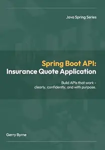

---

**Time:** 15:30:53 (Asia/Tehran)  
**Blog:** hill0  

**Title:** New Hampshire and Independence  

**Details:** English | 2026 | ISBN: 1467170240 | 257 Pages | PDF (True) | 158 MB  

**Link:** http://zavat.pw/ebooks/1467170240.html  

---

**Time:** 15:30:53 (Asia/Tehran)  
**Blog:** hill0  

**Title:** Quantenmechanik (nicht nur) für Lehramtsstudierende, 2. Auflage  

**Details:** Deutsch | 2026 | ISBN: 3662723948 | 456 Pages | PDF (True) | 8 MB  

**Link:** http://zavat.pw/ebooks/3662723948.html  

---

**Time:** 15:30:53 (Asia/Tehran)  
**Blog:** hill0  

**Title:** Generationen-Management, 4.Auflage  

**Details:** Deutsch | 2026 | ISBN: 365851373X | 344 Pages | PDF (True) | 21 MB  

**Link:** http://zavat.pw/ebooks/365851373X.html  

---

**Time:** 15:30:53 (Asia/Tehran)  
**Blog:** hill0  

**Title:** Leitfaden Projektmanagement für Bauherren  

**Details:** Deutsch | 2026 | ISBN: 3658512326 | 530 Pages | PDF (True) | 39 MB  

**Link:** http://zavat.pw/ebooks/3658512326.html  

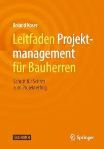

---

**Time:** 15:30:53 (Asia/Tehran)  
**Blog:** hill0  

**Title:** Handbuch Digitale Medien und Methoden  

**Details:** Deutsch | 2026 | ISBN: 3658366249 | 716 Pages | PDF (True) | 21 MB  

**Link:** http://zavat.pw/ebooks/3658366249.html  

---

**Time:** 15:30:53 (Asia/Tehran)  
**Blog:** hill0  

**Title:** Süddeutsche Zeitung Magazin - 19 Juni 2026  

**Details:** Deutsch | 32 pages | True PDF | 6 MB  

**Link:** http://zavat.pw/magazines/SZMAGZ-190626.html  

---

**Time:** 15:30:53 (Asia/Tehran)  
**Blog:** hill0  

**Title:** IoT, Machine Learning and Blockchain Technologies for Renewable Energy and Modern Hybrid Power Systems  

**Details:** English | 2023 | ISBN: 8770227241 | 551 Pages | EPUB (True) | 30 MB  

**Link:** http://zavat.pw/ebooks/8770227241E.html  

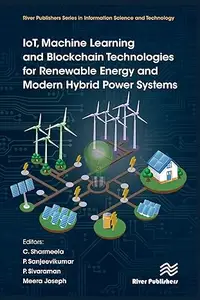

---

**Time:** 15:30:53 (Asia/Tehran)  
**Blog:** crazy-slim  

**Title:** The Week Junior UK - 20 June 2026  

**Details:** English | 36 pages | True PDF | 23.8 MB  

**Link:** http://zavat.pw/magazines/TheWeekJuniorUK20June2026-19681.html  

---

**Time:** 15:30:53 (Asia/Tehran)  
**Blog:** crazy-slim  

**Title:** Dimagrire - Luglio 2026  

**Details:** Italiano | 100 pages | True PDF | 45.2 MB  

**Link:** http://zavat.pw/magazines/DimagrireLuglio2026-40368.html  

---

**Time:** 15:30:53 (Asia/Tehran)  
**Blog:** crazy-slim  

**Title:** MenteCorpo - Luglio-Agosto 2026  

**Details:** Italiano | 98 pages | True PDF | 34.2 MB  

**Link:** http://zavat.pw/magazines/MenteCorpoLuglioAgosto2026-09836.html  

---

**Time:** 15:30:53 (Asia/Tehran)  
**Blog:** crazy-slim  

**Title:** Coqtail For Fine Drinkers - Giugno 2026  

**Details:** Italiano, English | 160 pages | True PDF | 30.1 MB  

**Link:** http://zavat.pw/magazines/CoqtailForFineDrinkersGiugno2026-37024.html  

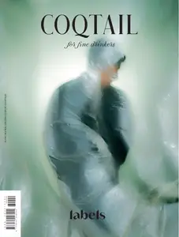

---

**Time:** 15:30:53 (Asia/Tehran)  
**Blog:** crazy-slim  

**Title:** Classic Voice - Giugno 2026  

**Details:** Italiano | 84 pages | True PDF | 73.1 MB  

**Link:** http://zavat.pw/magazines/ClassicVoiceGiugno2026-39961.html  

---

**Time:** 15:30:53 (Asia/Tehran)  
**Blog:** crazy-slim  

**Title:** Focus - 19 Juni 2026  

**Details:** Deutsch | 108 pages | True PDF | 61.5 MB  

**Link:** http://zavat.pw/magazines/Focus19Juni2026-20590.html  

---

**Time:** 15:30:53 (Asia/Tehran)  
**Blog:** crazy-slim  

**Title:** The Spectator Australia - 20 June 2026  

**Details:** English | 64 pages | True PDF | 59.7 MB  

**Link:** http://zavat.pw/magazines/TheSpectatorAustralia20June2026-14477.html  

---

**Time:** 15:30:53 (Asia/Tehran)  
**Blog:** crazy-slim  

**Title:** Military Modelcraft International - July 2026  

**Details:** English | 101 pages | True PDF | 43.6 MB  

**Link:** http://zavat.pw/magazines/MilitaryModelcraftInternationalJuly2026-44303.html  

---

**Time:** 15:30:53 (Asia/Tehran)  
**Blog:** crazy-slim  

**Title:** Focus Money - 19 Juni 2026  

**Details:** Deutsch | 108 pages | True PDF | 48.1 MB  

**Link:** http://zavat.pw/magazines/FocusMoney19Juni2026-35106.html  

---

**Time:** 15:30:53 (Asia/Tehran)  
**Blog:** crazy-slim  

**Title:** The Jerusalem Report - June 19, 2026  

**Details:** English | 48 pages | True PDF | 18.4 MB  

**Link:** http://zavat.pw/magazines/TheJerusalemReportJune192026-74974.html  

---

**Time:** 15:30:53 (Asia/Tehran)  
**Blog:** crazy-slim  

**Title:** The Spectator - 20 June 2026  

**Details:** English | 64 pages | True PDF | 111.9 MB  

**Link:** http://zavat.pw/magazines/TheSpectator20June2026-87674.html  

---

**Time:** 15:30:53 (Asia/Tehran)  
**Blog:** crazy-slim  

**Title:** Computer Hoy - 19 Junio 2026  

**Details:** Español | 76 pages | True PDF | 34.0 MB  

**Link:** http://zavat.pw/magazines/ComputerHoy19Junio2026-97307.html  

---

**Time:** 15:30:53 (Asia/Tehran)  
**Blog:** crazy-slim  

**Title:** You South Africa - 25 June 2026  

**Details:** English | 117 pages | True PDF | 59.7 MB  

**Link:** http://zavat.pw/magazines/YouSouthAfrica25June2026-65086.html  

---

**Time:** 15:30:53 (Asia/Tehran)  
**Blog:** crazy-slim  

**Title:** Women's Fitness UK - July 2026  

**Details:** English | 100 pages | True PDF | 34.0 MB  

**Link:** http://zavat.pw/magazines/WomensFitnessUKJuly2026-25993.html  

---

**Time:** 15:30:53 (Asia/Tehran)  
**Blog:** crazy-slim  

**Title:** Open Magazine - 29 June 2026  

**Details:** English | 68 pages | True PDF | 38.4 MB  

**Link:** http://zavat.pw/magazines/OpenMagazine29June2026-21530.html  

---

**Time:** 11:06:39 (Asia/Tehran)  
**Blog:** yoyoloit  

**Title:** Longitudinal Analysis of Real World Time-to-event Data in Health Care: Big Data Approach using R  

**Details:** English | 2026 | ISBN: 1032847476 | 228 pages | True PDF EPUB | 24.86 MB  

**Link:** http://zavat.pw/ebooks/1032847476.html  

---

**Time:** 11:06:39 (Asia/Tehran)  
**Blog:** yoyoloit  

**Title:** Mass Flow Measurement  

**Details:** English | 2026 | ISBN: 1032601604 | 177 pages | True PDF EPUB | 35.38 MB  

**Link:** http://zavat.pw/ebooks/1032601604.html  

---

**Time:** 11:06:39 (Asia/Tehran)  
**Blog:** yoyoloit  

**Title:** Artificial Intelligence in Operations: Strategy, Efficiency, and the Future of Execution  

**Details:** English | 2026 | ISBN: 8743812910 | 95 pages | True PDF EPUB | 26.43 MB  

**Link:** http://zavat.pw/ebooks/8743812910.html  

---

**Time:** 11:06:39 (Asia/Tehran)  
**Blog:** IrGens  

**Title:** Renaissance Dogs: A Litter of Hilarious Pups, Mutts, and Hounds  

**Details:** English | 16 June 2026 | ISBN: 9798217273133, 9798217273140 | True EPUB | 208 pages | 304 MB  

**Link:** http://zavat.pw/ebooks/9798217273133.html  

---

**Time:** 11:06:39 (Asia/Tehran)  
**Blog:** IrGens  

**Title:** Treasury of Greek Mythology: Classic Stories of Gods, Goddesses, Heroes & Monsters  

**Details:** English | June 16, 2026 | ISBN: 9798217231324, 9798217231348 | True EPUB | 192 pages | 122 MB  

**Link:** http://zavat.pw/ebooks/9798217231324.html  

---

**Time:** 11:06:39 (Asia/Tehran)  
**Blog:** IrGens  

**Title:** Miracula: Weird and Wonderful Stories of Ancient Greece and Rome  

**Details:** English | June 23, 2025 | ISBN: 1836390491, 9781836390503 | True EPUB/PDF | 472 pages | 6.9/13.3 MB  

**Link:** http://zavat.pw/ebooks/1836390491.html  

---

**Time:** 11:06:39 (Asia/Tehran)  
**Blog:** IrGens  

**Title:** Our Bodies, Our Planet: A Parasite's History of Us [Audiobook] (Repost)  

**Details:** English | October 13, 2025 | ASIN: B0FKHF1YNH | M4B@64 kbps | 11h 41m | 335 MB  

**Link:** http://zavat.pw/audiobooks/B0FKHF1YNH.html  

---

**Time:** 11:06:39 (Asia/Tehran)  
**Blog:** IrGens  

**Title:** Our Bodies, Our Planet: A Parasite’s History of Us  

**Details:** English | November 21, 2025 | ISBN: 1836391072, ‎ 9781836391463 | True EPUB/PDF | 330 pages | 8.7/12.7 MB  

**Link:** http://zavat.pw/ebooks/1836391072.html  

---

**Time:** 11:06:39 (Asia/Tehran)  
**Blog:** IrGens  

**Title:** A Philosophy of Simple Living  

**Details:** English | July 15, 2020 | ISBN: 178914227X, 9781789142655 | True EPUB | 200 pages | 2.1 MB  

**Link:** http://zavat.pw/ebooks/178914227X-epub.html  

---

**Time:** 11:06:39 (Asia/Tehran)  
**Blog:** IrGens  

**Title:** Voices of Thunder: Radical Religious Women of the Seventeenth Century  

**Details:** English | December 11, 2025 | ISBN: 1836391196, 9781836391555 | True EPUB/PDF | 337 pages | 5.7/15.7 MB  

**Link:** http://zavat.pw/ebooks/1836391196.html  

---

**Time:** 11:06:39 (Asia/Tehran)  
**Blog:** IrGens  

**Title:** Exophony: Voyages Outside the Mother Tongue  

**Details:** English | June 3, 2025 | ISBN: 0811237877, 9780811237888 | True EPUB | 192 pages | 0.9 MB  

**Link:** http://zavat.pw/ebooks/0811237877.html  

---

**Time:** 11:06:39 (Asia/Tehran)  
**Blog:** AvaxGenius  

**Title:** Flight International - 18 March 2014  

**Details:** English | PDF | 52 Pages | 19.1 MB  

**Link:** http://zavat.pw/magazines/Flight_International18March2014.html  

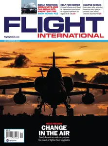

---

**Time:** 11:06:39 (Asia/Tehran)  
**Blog:** hill0  

**Title:** Salesforce Lightning Web Component Cookbook  

**Details:** English | 2026 | ISBN: 9781835469866 | 426 Pages | EPUB (True) | 23 MB  

**Link:** http://zavat.pw/ebooks/9781835469866F.html  

---

**Time:** 11:06:39 (Asia/Tehran)  
**Blog:** hill0  

**Title:** High-Performance Computing and Artificial Intelligence in Process Engineering  

**Details:** English | 2025 | ISBN: 0750361727 | 309 Pages | PDF EPUB (True) | 82 MB  

**Link:** http://zavat.pw/ebooks/0750361727R.html  

---

**Time:** 11:06:39 (Asia/Tehran)  
**Blog:** hill0  

**Title:** Handbook of Green Engineering Technologies for Sustainable Smart Cities  

**Details:** English | 2022 | ISBN: 0367554984 | 341 Pages | PDF EPUB (True) | 20 MB  

**Link:** http://zavat.pw/ebooks/0367554984.html  

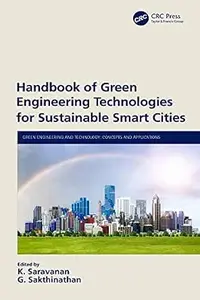

---

**Time:** 11:06:39 (Asia/Tehran)  
**Blog:** hill0  

**Title:** Mechanotransduction and Mechanosensing  

**Details:** English | 2026 | ISBN: 303219508X | 452 Pages | PDF (True) | 50 MB  

**Link:** http://zavat.pw/ebooks/303219508X.html  

---

**Time:** 11:06:39 (Asia/Tehran)  
**Blog:** hill0  

**Title:** Digital Technologies and Applications. Volume 3  

**Details:** English | 2026 | ISBN: 3032060605 | 678 Pages | PDF (True) | 52 MB  

**Link:** http://zavat.pw/ebooks/3032060605.html  

---

**Time:** 11:06:39 (Asia/Tehran)  
**Blog:** hill0  

**Title:** Table Tennis – A Practical Guide for Students, Coaches and Hobby Athletes  

**Details:** English | 2026 | ISBN: 3662732793 | 213 Pages | PDF EPUB (True) | 16 MB  

**Link:** http://zavat.pw/ebooks/3662732793.html  

---

**Time:** 11:06:39 (Asia/Tehran)  
**Blog:** hill0  

**Title:** The Global Business of Education  

**Details:** English | 2026 | ISBN: 3032255635 | 449 Pages | PDF EPUB (True) | 8 MB  

**Link:** http://zavat.pw/ebooks/3032255635.html  

---

**Time:** 11:06:39 (Asia/Tehran)  
**Blog:** hill0  

**Title:** Why Odysseus?: Survivor, Scoundrel, (Anti)hero  

**Details:** English | 2026 | ISBN: 3032209862 | 262 Pages | PDF EPUB (True) | 2 MB  

**Link:** http://zavat.pw/ebooks/3032209862.html  

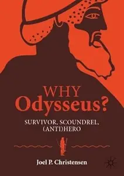

---

**Time:** 11:06:39 (Asia/Tehran)  
**Blog:** hill0  

**Title:** Getting Real About College Composition  

**Details:** English | 2026 | ISBN: 3032136687 | 194 Pages | PDF EPUB (True) | 2 MB  

**Link:** http://zavat.pw/ebooks/3032136687.html  

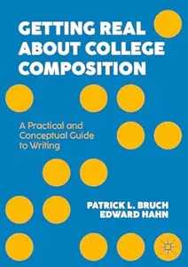

---

**Time:** 11:06:39 (Asia/Tehran)  
**Blog:** hill0  

**Title:** Functor and Tensor Categories, Models, and Systems  

**Details:** English | 2026 | ISBN: 3032094593 | 426 Pages | PDF EPUB (True) | 27 MB  

**Link:** http://zavat.pw/ebooks/3032094593.html  

---

**Time:** 11:06:39 (Asia/Tehran)  
**Blog:** hill0  

**Title:** MATLAB Data Analysis  

**Details:** English | 2026 | ISBN: n/a | 156 Pages | PDF (True) | 2.3 MB  

**Link:** http://zavat.pw/ebooks/matla-data_analysis-26.html  

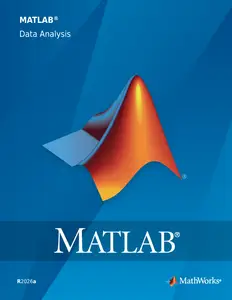

---

**Time:** 11:06:39 (Asia/Tehran)  
**Blog:** hill0  

**Title:** Le Temps - 19 Juin 2026  

**Details:** Français | 24 pages | True PDF | 11 MB  

**Link:** http://zavat.pw/newspapers/le-temps-20260619.html  

---

**Time:** 11:06:39 (Asia/Tehran)  
**Blog:** hill0  

**Title:** Süddeutsche Zeitung - 19 Juni 2026  

**Details:** Deutsch | 28 pages | True PDF | 6 MB  

**Link:** http://zavat.pw/newspapers/SZ-190626.html  

---

**Time:** 11:06:39 (Asia/Tehran)  
**Blog:** crazy-slim  

**Title:** The Guardian USA - June 19, 2026  

**Details:** English | 75 pages | PDF | 206.5 MB  

**Link:** http://zavat.pw/newspapers/TheGuardianUSAJune192026-29881.html  

---

**Time:** 11:06:39 (Asia/Tehran)  
**Blog:** crazy-slim  

**Title:** The Washington Post - June 19, 2026  

**Details:** English | 52 pages | True PDF | 73.2 MB  

**Link:** http://zavat.pw/newspapers/TheWashingtonPostJune192026-77775.html  

---

**Time:** 11:06:39 (Asia/Tehran)  
**Blog:** crazy-slim  

**Title:** California Post - June 19, 2026  

**Details:** English | 64 pages | True PDF | 57.0 MB  

**Link:** http://zavat.pw/newspapers/CaliforniaPostJune192026-02115.html  

---

**Time:** 11:06:39 (Asia/Tehran)  
**Blog:** crazy-slim  

**Title:** Il Tempo - 19 Giugno 2026  

**Details:** Italiano | 32 pages | PDF | 77.8 MB  

**Link:** http://zavat.pw/newspapers/IlTempo19Giugno2026-01065.html  

---

**Time:** 11:06:39 (Asia/Tehran)  
**Blog:** crazy-slim  

**Title:** Corriere dello Sport Stadio - 19 Giugno 2026  

**Details:** Italiano | 40 pages | PDF | 89.4 MB  

**Link:** http://zavat.pw/newspapers/CorrieredelloSportStadio19Giugno2026-85999.html  

---

**Time:** 11:06:39 (Asia/Tehran)  
**Blog:** crazy-slim  

**Title:** Macau Daily Times - 19 June 2026  

**Details:** English | 16 pages | PDF | 37.3 MB  

**Link:** http://zavat.pw/newspapers/MacauDailyTimes19June2026-32970.html  

---

**Time:** 11:06:39 (Asia/Tehran)  
**Blog:** crazy-slim  

**Title:** Gardasee Zeitung - 17 Juni 2026  

**Details:** Deutsch | 60 pages | True PDF | 21.1 MB  

**Link:** http://zavat.pw/newspapers/GardaseeZeitung17Juni2026-96030.html  

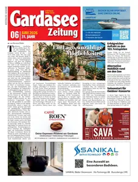

---

**Time:** 11:06:39 (Asia/Tehran)  
**Blog:** crazy-slim  

**Title:** USA Today Sports Weekly - 17 June 2026  

**Details:** English | 32 pages | True PDF | 5.2 MB  

**Link:** http://zavat.pw/newspapers/USATodaySportsWeekly17June2026-91834.html  

---

**Time:** 11:06:39 (Asia/Tehran)  
**Blog:** crazy-slim  

**Title:** L'Espresso - 19 Giugno 2026  

**Details:** Italiano | 124 pages | True PDF | 17.6 MB  

**Link:** http://zavat.pw/magazines/LEspresso19Giugno2026-55115.html  

---

**Time:** 11:06:39 (Asia/Tehran)  
**Blog:** crazy-slim  

**Title:** Ideat Germany - Juli-August 2026  

**Details:** Deutsch | 172 pages | True PDF | 161.0 MB  

**Link:** http://zavat.pw/magazines/IdeatGermanyJuliAugust2026-47195.html  

---

**Time:** 11:06:39 (Asia/Tehran)  
**Blog:** crazy-slim  

**Title:** TV Digital Sky Österreich - 19 Juni 2026  

**Details:** Deutsch | 228 pages | PDF | 355.1 MB  

**Link:** http://zavat.pw/magazines/TVDigitalSky%C3%96sterreich19Juni2026-67374.html  

---

**Time:** 11:06:39 (Asia/Tehran)  
**Blog:** crazy-slim  

**Title:** TV Digital XXL - 19 Juni 2026  

**Details:** Deutsch | 228 pages | PDF | 356.2 MB  

**Link:** http://zavat.pw/magazines/TVDigitalXXL19Juni2026-47035.html  

---

**Time:** 11:06:39 (Asia/Tehran)  
**Blog:** crazy-slim  

**Title:** TV Digital Entertain - 19 Juni 2026  

**Details:** Deutsch | 228 pages | PDF | 354.8 MB  

**Link:** http://zavat.pw/magazines/TVDigitalEntertain19Juni2026-55908.html  

---

**Time:** 11:06:39 (Asia/Tehran)  
**Blog:** crazy-slim  

**Title:** VGN Regional - 19 Juni 2026  

**Details:** Deutsch | 44 pages | PDF | 34.2 MB  

**Link:** http://zavat.pw/magazines/VGNRegional19Juni2026-75474.html  

---

**Time:** 11:06:39 (Asia/Tehran)  
**Blog:** crazy-slim  

**Title:** TV Digital Kabel Deutschland - 19 Juni 2026  

**Details:** Deutsch | 228 pages | PDF | 354.8 MB  

**Link:** http://zavat.pw/magazines/TVDigitalKabelDeutschland19Juni2026-32734.html  

---

**Time:** 05:43:56 (Asia/Tehran)  
**Blog:** AvaxGenius  

**Title:** Electronics World - March 2025  

**Details:** English | True PDF | 48 Pages | 10 MB  

**Link:** http://zavat.pw/magazines/ElectronicsWorldMarch2025.html  

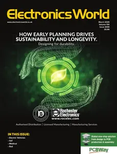

---

**Time:** 05:43:56 (Asia/Tehran)  
**Blog:** AvaxGenius  

**Title:** Fluid-Structure Interaction of Composite Structures (Repost)  

**Details:** English | EPUB | 2020 | 287 Pages | ISBN : 303057637X | 114.9 MB  

**Link:** http://zavat.pw/ebooks/30301547637X.html  

---

**Time:** 05:43:56 (Asia/Tehran)  
**Blog:** AvaxGenius  

**Title:** The Population Ecology of White-Headed Langur (Repost)  

**Details:** English | EPUB | 2021 | 241 Pages | ISBN : 9813341173 | 176.87 MB  

**Link:** http://zavat.pw/ebooks/981133411473.html  

---

**Time:** 05:43:56 (Asia/Tehran)  
**Blog:** AvaxGenius  

**Title:** Wind Science and Engineering: Origins, Developments, Fundamentals and Advancements (Repost)  

**Details:** English | EPUB | 2019 | 944 Pages | ISBN : 3030188140 | 354.7 MB  

**Link:** http://zavat.pw/ebooks/303018814035.html  

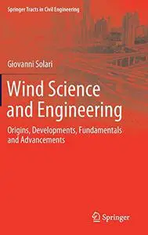

---

**Time:** 05:43:56 (Asia/Tehran)  
**Blog:** AvaxGenius  

**Title:** Chirurgie für Anästhesisten: Operationsverfahren kennen - Anästhesie optimieren (Repost)  

**Details:** Deutsch | EPUB | 2021 | 718 Pages | ISBN : 3662533375 | 160.9 MB  

**Link:** http://zavat.pw/ebooks/366253337525.html  

---

**Time:** 05:43:56 (Asia/Tehran)  
**Blog:** AvaxGenius  

**Title:** Big Data and Security (Repost)  

**Details:** English | EPUB | 2021 | 665 Pages | ISBN : 9811631492 | 116.4 MB  

**Link:** http://zavat.pw/ebooks/981116315492.html  

---

**Time:** 05:43:56 (Asia/Tehran)  
**Blog:** AvaxGenius  

**Title:** New Results in Numerical and Experimental Fluid Mechanics VIII (Repost)  

**Details:** English | PDF | 2010 | 746 Pages | ISBN : 3642356796 | 136.1 MB  

**Link:** http://zavat.pw/ebooks/326423567965.html  

---

**Time:** 05:43:56 (Asia/Tehran)  
**Blog:** AvaxGenius  

**Title:** Alluvial Fans in Southern Iran: Geological, Environmental and Remote Sensing Analyses (Repost)  

**Details:** English | EPUB | 2022 | 220 Pages | ISBN : 9811920443 | 144.6 MB  

**Link:** http://zavat.pw/ebooks/981219204453.html  

---

**Time:** 05:43:56 (Asia/Tehran)  
**Blog:** AvaxGenius  

**Title:** Hybrid Advanced Techniques for Forecasting in Energy Sector (Repost)  

**Details:** English | PDF | 2018 | 252 Pages | ISBN : 3038972908 | 104.83 MB  

**Link:** http://zavat.pw/ebooks/230389729085.html  

---

**Time:** 05:43:56 (Asia/Tehran)  
**Blog:** AvaxGenius  

**Title:** Vitreoretinal Surgery, Third Edition (Repost)  

**Details:** English | EPUB | 2021 | 659 Pages | ISBN : 3030687686 | 196 MB  

**Link:** http://zavat.pw/ebooks/320350687686.html  

---

**Time:** 05:43:56 (Asia/Tehran)  
**Blog:** AvaxGenius  

**Title:** Anatomy, Age and Ecology of High Mountain Plants in Ladakh, the Western Himalaya (Repost)  

**Details:** English | PDF | 2018 | 618 Pages | ISBN : 3319786970 | 173.14 MB  

**Link:** http://zavat.pw/ebooks/332197869705.html  

---

**Time:** 05:43:56 (Asia/Tehran)  
**Blog:** AvaxGenius  

**Title:** Biomineralization Mechanism of the Pearl Oyster, Pinctada fucata (Repost)  

**Details:** English | EPUB | 2018 (2019 Edition) | 750 Pages | ISBN : 9811314586 | 149.9 MB  

**Link:** http://zavat.pw/ebooks/948113145486.html  

---

**Time:** 05:43:56 (Asia/Tehran)  
**Blog:** AvaxGenius  

**Title:** Atlas of Anatomic Hepatic Resection for Hepatocellular Carcinoma: Glissonean Pedicle Approach (Repost)  

**Details:** English | EPUB | 2018 (2019 Edition) | 339 Pages | ISBN : 9811306672 | 174.2 MB  

**Link:** http://zavat.pw/ebooks/981153066722.html  

---

**Time:** 05:43:56 (Asia/Tehran)  
**Blog:** AvaxGenius  

**Title:** Precipitation Partitioning by Vegetation: A Global Synthesis (Repost)  

**Details:** English | EPUB | 2020 | 295 Pages | ISBN : 3030297012 | 163.31 MB  

**Link:** http://zavat.pw/ebooks/303024297012.html  

---

**Time:** 05:43:56 (Asia/Tehran)  
**Blog:** AvaxGenius  

**Title:** Proceedings of International Conference on Communication and Computational Technologies (Repost)  

**Details:** English | EPUB (True) | 2023 | 992 Pages | ISBN : 9819934842 | 107.5 MB  

**Link:** http://zavat.pw/ebooks/981299345842.html  

---

**Time:** 02:45:33 (Asia/Tehran)  
**Blog:** IrGens  

**Title:** Doctors at War: The Clandestine Battle against the Nazi Occupation of France  

**Details:** English | March 1, 2023 | ISBN: 080717873X, 9780807179437 | True EPUB | 192 pages | 2.8 MB  

**Link:** http://zavat.pw/ebooks/080717873X.html  

---

**Time:** 02:45:33 (Asia/Tehran)  
**Blog:** IrGens  

**Title:** Grounding the Cloud: Urbanism in the Shadow of Data  

**Details:** English | July 7, 2026 | ISBN: 1517919606, 1517919614, 9781452975504 | True EPUB | 192 pages | 9.3 MB  

**Link:** http://zavat.pw/ebooks/1517919606.html  

---

**Time:** 02:45:33 (Asia/Tehran)  
**Blog:** IrGens  

**Title:** The Child Follows the Womb: Gender, Reproduction, and Roman Slavery  

**Details:** English | January 13, 2026 | ISBN: 0300284861, 9780300289510 | True EPUB | 224 pages | 9.5 MB  

**Link:** http://zavat.pw/ebooks/0300284861.html  

---

**Time:** 02:45:33 (Asia/Tehran)  
**Blog:** IrGens  

**Title:** Auden by Peter Ackroyd  

**Details:** English | June 5, 2026 | ISBN: 1836391722, 9781836392194 | True EPUB | 400 pages | 5 MB  

**Link:** http://zavat.pw/ebooks/1836391722.html  

---

**Time:** 02:45:33 (Asia/Tehran)  
**Blog:** IrGens  

**Title:** The Museum of Imaginary Musical Instruments  

**Details:** English | April 13, 2026 | ISBN: 1836391854, 9781836392248 | True EPUB | 200 pages | 20.96 MB  

**Link:** http://zavat.pw/ebooks/1836391854.html  

---

**Time:** 02:45:33 (Asia/Tehran)  
**Blog:** hill0  

**Title:** Teaching AI: Exploring New Frontiers for Learning  

**Details:** English | 2018 | ISBN: 1564847055 | 193 Pages | PDF EPUB (True) | 8 MB  

**Link:** http://zavat.pw/ebooks/1564847055.html  

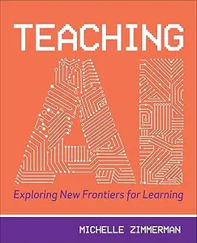

---

**Time:** 00:48:31 (Asia/Tehran)  
**Blog:** IrGens  

**Title:** Desire: The Workbook: A Guided Journey into the Longings That Shape Our Lives  

**Details:** English | March 3, 2026 | ISBN: 0593728300, 9780593728314 | True EPUB | 384 pages | 4.2 MB  

**Link:** http://zavat.pw/ebooks/0593728300.html  

---

**Time:** 00:48:31 (Asia/Tehran)  
**Blog:** IrGens  

**Title:** Ghosts of the Night: The Extraordinary Lives of British Owls  

**Details:** English | 18 Jun. 2026 | ISBN: 0008659206, 9780008659219 | True EPUB | 256 pages | 6.7 MB  

**Link:** http://zavat.pw/ebooks/0008659206.html  

---

**Time:** 00:48:31 (Asia/Tehran)  
**Blog:** IrGens  

**Title:** AutoCAD 2027: Getting Started  

**Details:** .MP4, AVC, 1280x720, 30 fps | English, AAC, 2 Ch | 2h 39m | 381 MB  

**Link:** http://zavat.pw/ebooks/autocad-2027-getting-started.html  

---

**Time:** 00:48:31 (Asia/Tehran)  
**Blog:** hill0  

**Title:** The Spirit of New York (2nd Edition)  

**Details:** English | 2022 | ISBN: 1438487142 | 474 Pages | EPUB (True) | 3 MB  

**Link:** http://zavat.pw/ebooks/1438487142e.html  

