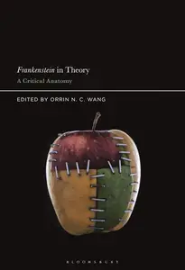
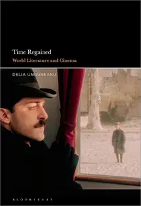
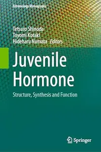

# Zavat feed - 2026-06-28

---

**Time:** 01:05:47 (Asia/Tehran)  
**Blog:** IrGens  

**Title:** Frankenstein in Theory: A Critical Anatomy  

**Details:** English | January 14, 2021 | ISBN: 1501360795, 1501372203, 9781501360800 | True EPUB | 272 pages | 0.9 MB  

**Link:** http://zavat.pw/ebooks/1501360795-epub.html  

---

**Time:** 01:05:47 (Asia/Tehran)  
**Blog:** IrGens  

**Title:** Time Regained: World Literature and Cinema  

**Details:** English | November 4, 2021 | ISBN: 1501355791, 9798765103494, 9781501355806 | True EPUB | 312 pages | 7.8 MB  

**Link:** http://zavat.pw/ebooks/1501355791-epub.html  

---

**Time:** 01:05:47 (Asia/Tehran)  
**Blog:** IrGens  

**Title:** From the Front Line: Stalingrad–Treblinka–Berlin, 1941–45 (New York Review Books Classics)  

**Details:** English | June 16, 2026 | ISBN: 9798896230083, 9798896230090 | True EPUB | 512 pages | 10.1 MB  

**Link:** http://zavat.pw/ebooks/9798896230083.html  

---

**Time:** 01:05:47 (Asia/Tehran)  
**Blog:** hill0  

**Title:** Juvenile Hormone: Structure, Synthesis and Function  

**Details:** English | 2026 | ISBN: 9819586046 | 369 Pages | PDF EPUB (True) | 39 MB  

**Link:** http://zavat.pw/ebooks/9819586046.html  

