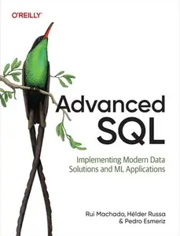
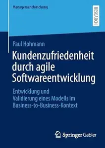
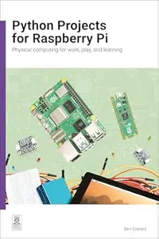
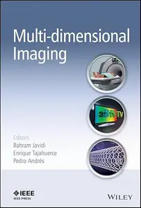
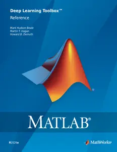
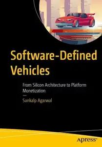
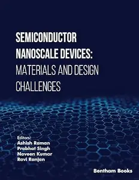
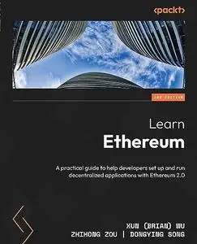
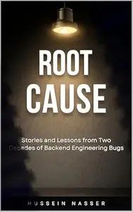
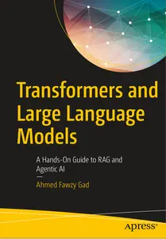

# Zavat feed - 2026-07-01

---

**Time:** 23:51:22 (Asia/Tehran)  
**Blog:** AvaxGenius  

**Title:** Handbook on Synthesis Strategies for Advanced Materials Volume-III: Materials Specific Synthesis Strategies (Repost)  

**Details:** English | EPUB | 2021 | 921 Pages | ISBN : 9811618917 | 183.2 MB  

**Link:** http://zavat.pw/ebooks/9812161891575.html  

---

**Time:** 23:51:22 (Asia/Tehran)  
**Blog:** AvaxGenius  

**Title:** Gluteal Fat Augmentation: Best Practices in Brazilian Butt Lift (Repost)  

**Details:** English | EPUB | 2021 | 264 Pages | ISBN : 3030589447 | 258.1 MB  

**Link:** http://zavat.pw/ebooks/350305895447.html  

---

**Time:** 23:51:22 (Asia/Tehran)  
**Blog:** AvaxGenius  

**Title:** Advanced Intelligent Systems for Sustainable Development (AI2SD’2020): Volume 1 (Repost)  

**Details:** English | PDF (True) | 2022 | 1173 Pages | ISBN : 3030906329 | 108.9 MB  

**Link:** http://zavat.pw/ebooks/305309063219.html  

---

**Time:** 23:51:22 (Asia/Tehran)  
**Blog:** AvaxGenius  

**Title:** Digital Technologies and Applications: Proceedings of ICDTA'23, Fez, Morocco, Volume 1 (Reopst)  

**Details:** English | PDF (True) | 2023 | 1038 Pages | ISBN : 303129856X | 99.8 MB  

**Link:** http://zavat.pw/ebooks/30351295856X.html  

---

**Time:** 23:51:22 (Asia/Tehran)  
**Blog:** AvaxGenius  

**Title:** Alfalfa and Alfalfa Improvement (Repost)  

**Details:** English | PDF | 1988 | 1099 Pages | ISBN : 089118094X | 194.1 MB  

**Link:** http://zavat.pw/ebooks/05891180594X.html  

---

**Time:** 23:51:22 (Asia/Tehran)  
**Blog:** AvaxGenius  

**Title:** Complex Networks and Their Applications XI (Repost)  

**Details:** English | PDF,EPUB | 2023 | 667 Pages | ISBN : 303121126X | 159.4 MB  

**Link:** http://zavat.pw/ebooks/30531211265X.html  

---

**Time:** 23:51:22 (Asia/Tehran)  
**Blog:** AvaxGenius  

**Title:** Proceeding of the International Conference on Computer Networks, Big Data and IoT (ICCBI - 2019) (Repost)  

**Details:** English | PDF | 2020 | 1019 Pages | ISBN : 3030431916 | 97.08 MB  

**Link:** http://zavat.pw/ebooks/305304319156.html  

---

**Time:** 23:51:22 (Asia/Tehran)  
**Blog:** AvaxGenius  

**Title:** Document Analysis Systems (Repost)  

**Details:** English | PDF | 2022 | 794 Pages | ISBN : 3031065549 | 112.5 MB  

**Link:** http://zavat.pw/ebooks/303611065549.html  

---

**Time:** 23:51:22 (Asia/Tehran)  
**Blog:** AvaxGenius  

**Title:** AETA 2017 - Recent Advances in Electrical Engineering and Related Sciences: Theory and Application (Repost)  

**Details:** English | PDF | 2018 | 1086 Pages | ISBN : 3319698133 | 189.6 MB  

**Link:** http://zavat.pw/ebooks/35319698133.html  

---

**Time:** 23:51:22 (Asia/Tehran)  
**Blog:** AvaxGenius  

**Title:** European Workshop on Structural Health Monitoring: EWSHM 2022 - Volume 2 (Repost)  

**Details:** English | EPUB | 2022(2023 Edition) | 1129 Pages | ISBN : 303107257X | 321.9 MB  

**Link:** http://zavat.pw/ebooks/3031507257X1.html  

---

**Time:** 23:51:22 (Asia/Tehran)  
**Blog:** hill0  

**Title:** Übungs- und Lernbuch Wahrscheinlichkeitstheorie und Stochastik  

**Details:** Deutsch | 2026 | ISBN: 3662727196 | 438 Pages | EPUB (True) | 48 MB  

**Link:** http://zavat.pw/ebooks/3662727196e.html  

---

**Time:** 23:51:22 (Asia/Tehran)  
**Blog:** hill0  

**Title:** Advanced SQL  

**Details:** English | 2026 | ASIN: B0GLFMVZN2 | 482 Pages | EPUB | 3.4 MB  

**Link:** http://zavat.pw/ebooks/B0GLFMVZN2.html  

---

**Time:** 23:51:22 (Asia/Tehran)  
**Blog:** hill0  

**Title:** Math for Web Design  

**Details:** English | 2026 | ISBN: 1633434826 | 501 Pages | PDF | 8 MB  

**Link:** http://zavat.pw/ebooks/1633434826p.html  

---

**Time:** 21:52:13 (Asia/Tehran)  
**Blog:** hill0  

**Title:** Aircraft Control and Simulation (3rd Edition)  

**Details:** English | 2016 | ISBN: 1118870980 | 999 Pages | EPUB (True) | 54 MB  

**Link:** http://zavat.pw/ebooks/1118870980e.html  

---

**Time:** 21:52:13 (Asia/Tehran)  
**Blog:** hill0  

**Title:** Security Technologies and Methods for Advanced Cyber Threat Intelligence, Detection and Mitigation  

**Details:** English | 2022 | ISBN: 1680838342 | 353 Pages | EPUB | 3 MB  

**Link:** http://zavat.pw/ebooks/1680838342.html  

---

**Time:** 21:52:13 (Asia/Tehran)  
**Blog:** hill0  

**Title:** Prüfungstrainer Elektrotechnik: Erst verstehen, dann bestehen, 5. Auflage  

**Details:** Deutsch | 2026 | ISBN: 3662723921 | 401 Pages | PDF (True) | 12 MB  

**Link:** http://zavat.pw/ebooks/3662723921.html  

---

**Time:** 21:52:13 (Asia/Tehran)  
**Blog:** hill0  

**Title:** Kundenzufriedenheit durch agile Softwareentwicklung  

**Details:** Deutsch | 2026 | ISBN: 3658521945 | 350 Pages | PDF (True) | 17 MB  

**Link:** http://zavat.pw/ebooks/3658521945.html  

---

**Time:** 21:52:13 (Asia/Tehran)  
**Blog:** hill0  

**Title:** Datenqualität in Stichprobenerhebungen, 4.Auflage  

**Details:** Deutsch | 2026 | ISBN: 3662731975 | 264 Pages | PDF (True) | 3.4 MB  

**Link:** http://zavat.pw/ebooks/3662731975.html  

---

**Time:** 21:52:13 (Asia/Tehran)  
**Blog:** hill0  

**Title:** Zur Geschichte des Gaskampfs und der industriellen Kriegsführung in Deutschland  

**Details:** Deutsch | 2026 | ISBN: 3658448334 | 688 Pages | PDF (True) | 60 MB  

**Link:** http://zavat.pw/ebooks/3658448334.html  

---

**Time:** 21:52:13 (Asia/Tehran)  
**Blog:** hill0  

**Title:** Peace Makers: Shaping the modern world  

**Details:** English | 2026 | ISBN: 1836009011 | 265 Pages | EPUB (True) | 4 MB  

**Link:** http://zavat.pw/ebooks/1836009011.html  

---

**Time:** 21:52:13 (Asia/Tehran)  
**Blog:** hill0  

**Title:** Ecological Modelling and Ecophysics (2nd Edition)  

**Details:** English | 2024 | ISBN: 0750361573 | 385 Pages | PDF EPUB (True) | 45 MB  

**Link:** http://zavat.pw/ebooks/0750361573.html  

---

**Time:** 21:52:13 (Asia/Tehran)  
**Blog:** hill0  

**Title:** The Strategic management process (3rd Edition)  

**Details:** English | 2022 | ISBN: 9780627039027 | 805 Pages | EPUB (True) | 7 MB  

**Link:** http://zavat.pw/ebooks/9780627039027.html  

---

**Time:** 21:52:13 (Asia/Tehran)  
**Blog:** hill0  

**Title:** Python Projects for Raspberry Pi  

**Details:** English | 2026 | ISBN: 1916868525 | 218 Pages | PDF | 7 MB  

**Link:** http://zavat.pw/ebooks/1916868525p.html  

---

**Time:** 21:52:13 (Asia/Tehran)  
**Blog:** hill0  

**Title:** Production at the Leading Edge of Technology  

**Details:** English | 2026 | ISBN: 3032195233 | 703 Pages | PDF (True) | 49 MB  

**Link:** http://zavat.pw/ebooks/3032195233.html  

---

**Time:** 21:52:13 (Asia/Tehran)  
**Blog:** hill0  

**Title:** Practical C# Projects with .NET  

**Details:** English | 2026 | ISBN: ‎ 978-1836642510 | 606 Pages | EPUB (True) | 22 MB  

**Link:** http://zavat.pw/ebooks/978-1836642510.html  

---

**Time:** 21:52:13 (Asia/Tehran)  
**Blog:** hill0  

**Title:** The Geopolitics of Hydrogen  

**Details:** English | 2026 | ISBN: 3032247918 | 229 Pages | PDF EPUB (True) | 8 MB  

**Link:** http://zavat.pw/ebooks/3032247918.html  

---

**Time:** 21:52:13 (Asia/Tehran)  
**Blog:** hill0  

**Title:** Artificial Intelligence for Sustainable Development Goals  

**Details:** English | 2026 | ISBN: 3032282160 | 211 Pages | PDF EPUB (True) | 28 MB  

**Link:** http://zavat.pw/ebooks/3032282160.html  

---

**Time:** 19:32:44 (Asia/Tehran)  
**Blog:** hill0  

**Title:** Machine Unlearning: Concepts, Techniques and Applications  

**Details:** English | 2026 | ISBN: 3032184460 | 200 Pages | PDF EPUB (True) | 10 MB  

**Link:** http://zavat.pw/ebooks/3032184460.html  

---

**Time:** 19:32:44 (Asia/Tehran)  
**Blog:** hill0  

**Title:** From Inflation to Hot Big Bang  

**Details:** English | 2026 | ISBN: 3032098920 | 263 Pages | PDF EPUB (True) | 24 MB  

**Link:** http://zavat.pw/ebooks/3032098920.html  

---

**Time:** 19:32:44 (Asia/Tehran)  
**Blog:** hill0  

**Title:** Exploration of Spatio-Temporal Environmental Conditions  

**Details:** English | 2026 | ISBN: 3032175259 | 141 Pages | PDF EPUB (True) | 20 MB  

**Link:** http://zavat.pw/ebooks/3032175259.html  

---

**Time:** 19:32:44 (Asia/Tehran)  
**Blog:** hill0  

**Title:** Canada: Land and People  

**Details:** English | 2026 | ISBN: 3032043905 | 847 Pages | PDF (True) | 217 MB  

**Link:** http://zavat.pw/ebooks/3032043905.html  

---

**Time:** 19:32:44 (Asia/Tehran)  
**Blog:** hill0  

**Title:** Intentional Luxury  

**Details:** English | 2026 | ISBN: 3032175291 | 228 Pages | PDF EPUB (True) | 9 MB  

**Link:** http://zavat.pw/ebooks/3032175291.html  

---

**Time:** 16:46:47 (Asia/Tehran)  
**Blog:** hill0  

**Title:** Generative AI for Business Innovation  

**Details:** English | 2026 | ASIN: B0GPD1PFSY | 360 Pages | PDF EPUB (True) | 13 MB  

**Link:** http://zavat.pw/ebooks/B0GPD1PFSY.html  

---

**Time:** 16:46:47 (Asia/Tehran)  
**Blog:** hill0  

**Title:** Secure Boot Encryption with Linux  

**Details:** English | 2026 | ASIN: B0GVQZQB79 | 252 Pages | PDF EPUB (True) | 10 MB  

**Link:** http://zavat.pw/ebooks/B0GVQZQB79.html  

---

**Time:** 16:46:47 (Asia/Tehran)  
**Blog:** hill0  

**Title:** Multi-dimensional Imaging  

**Details:** English | 2014 | ISBN: 1118449835 | 610 Pages | EPUB (True) | 39 MB  

**Link:** http://zavat.pw/ebooks/1118449835E.html  

---

**Time:** 16:46:47 (Asia/Tehran)  
**Blog:** hill0  

**Title:** MATLAB Deep Learning Toolbox Reference  

**Details:** English | 2026 | ISBN: n/a | 4166 Pages | PDF (True) | 21 MB  

**Link:** http://zavat.pw/ebooks/Deep-Learning-Toolbox-Reference-26.html  

---

**Time:** 16:46:47 (Asia/Tehran)  
**Blog:** hill0  

**Title:** Software-Defined Vehicles  

**Details:** English | 2026 | ASIN: B0GRBR4SF1 | 611 Pages | PDF EPUB (True) | 124 MB  

**Link:** http://zavat.pw/ebooks/B0GRBR4SF1.html  

---

**Time:** 16:46:47 (Asia/Tehran)  
**Blog:** hill0  

**Title:** Design for Software: A Playbook for Developers  

**Details:** English | 2013 | ISBN: 111994290X | 288 Pages | True EPUB | 21 MB  

**Link:** http://zavat.pw/ebooks/111994290XE.html  

---

**Time:** 16:46:47 (Asia/Tehran)  
**Blog:** hill0  

**Title:** Semiconductor Nanoscale Devices  

**Details:** English | 2025 | ASIN: B0F44CWH3C | 393 Pages | PDF (True) | 89 MB  

**Link:** http://zavat.pw/ebooks/B0F44CWH3C.html  

---

**Time:** 16:46:47 (Asia/Tehran)  
**Blog:** hill0  

**Title:** Pilates (3rd Edition)  

**Details:** English | 2022 | ISBN: 1492598860 | 770 Pages | EPUB (True) | 145 MB  

**Link:** http://zavat.pw/ebooks/1492598860e.html  

---

**Time:** 16:46:47 (Asia/Tehran)  
**Blog:** hill0  

**Title:** DK Greece: Athens and the Mainland (Travel Guide)  

**Details:** English | 2022 | ISBN: 0241565960 | 599 Pages | EPUB (True) | 338 MB  

**Link:** http://zavat.pw/ebooks/0241565960t.html  

---

**Time:** 13:58:01 (Asia/Tehran)  
**Blog:** hill0  

**Title:** Adobe Photoshop CC For Dummies (2nd Edition)  

**Details:** English | 2018 | ISBN: 1119418119 | 520 Pages | EPUB (True) | 49 MB  

**Link:** http://zavat.pw/ebooks/1119418119.html  

---

**Time:** 13:58:01 (Asia/Tehran)  
**Blog:** hill0  

**Title:** New Trends in Mechanism and Machine Science  

**Details:** English | 2026 | ISBN: 3032302730 | 373 Pages | PDF EPUB (True) | 121 MB  

**Link:** http://zavat.pw/ebooks/3032302730.html  

---

**Time:** 13:58:01 (Asia/Tehran)  
**Blog:** hill0  

**Title:** Mechanics of Materials, 11th Edition in SI Units  

**Details:** English | 2023 | ISBN: 1292725737 | 890 Pages | PDF (True) | 141 MB  

**Link:** http://zavat.pw/ebooks/1292725737T.html  

---

**Time:** 13:58:01 (Asia/Tehran)  
**Blog:** hill0  

**Title:** Learn Ethereum (2nd Edition)  

**Details:** English | 2023 | ISBN: 9781804616512 | 814 Pages | True PDF | 136 MB  

**Link:** http://zavat.pw/ebooks/9781804616512p.html  

---

**Time:** 13:58:01 (Asia/Tehran)  
**Blog:** hill0  

**Title:** Hands-On Unity Game Development (4th Edition)  

**Details:** English | 2024 | ISBN: 9781835085714 | 983 Pages | EPUB (True) | 107 MB  

**Link:** http://zavat.pw/ebooks/9781835085714t.html  

---

**Time:** 13:58:01 (Asia/Tehran)  
**Blog:** hill0  

**Title:** Root Cause: Stories and Lessons from Two Decades of Backend Engineering Bugs  

**Details:** English | 2026 | ASIN: B0GWDVBPF6 | 238 Pages | True EPUB | 10 MB  

**Link:** http://zavat.pw/ebooks/B0GWDVBPF6.html  

---

**Time:** 13:58:01 (Asia/Tehran)  
**Blog:** hill0  

**Title:** Quantum Mechanics, 3rd Edition  

**Details:** English | 2021 | ISBN: 0367469154 | 407 Pages | True EPUB | 22 MB  

**Link:** http://zavat.pw/ebooks/0367469154e.html  

---

**Time:** 13:58:01 (Asia/Tehran)  
**Blog:** hill0  

**Title:** The Option Advisor: Wealth-Building Techniques Using Equity & Index Options  

**Details:** English | 2026 | ISBN: 0471185396 | 394 Pages | EPUB (True) | 31 MB  

**Link:** http://zavat.pw/ebooks/0471185396t.html  

---

**Time:** 13:58:01 (Asia/Tehran)  
**Blog:** hill0  

**Title:** Navigating Systemic Barriers in Academia  

**Details:** English | 2026 | ISBN: 1529247578 | 234 Pages | EPUB (True) | 0.7 MB  

**Link:** http://zavat.pw/ebooks/1529247578.html  

---

**Time:** 13:58:01 (Asia/Tehran)  
**Blog:** hill0  

**Title:** Spark: Igniting Organizational Change through a Planetary Mindset  

**Details:** English | 2026 | ISBN: 1529226708 | 268 Pages | EPUB (True) | 0.9 MB  

**Link:** http://zavat.pw/ebooks/1529226708e.html  

---

**Time:** 13:58:01 (Asia/Tehran)  
**Blog:** hill0  

**Title:** Transformers and Large Language Models  

**Details:** English | 2026 | ASIN: B0GTPRZ6MY | 358 Pages | PDF EPUB (True) | 18 MB  

**Link:** http://zavat.pw/ebooks/B0GTPRZ6MY.html  

---

**Time:** 13:58:01 (Asia/Tehran)  
**Blog:** hill0  

**Title:** Le Temps - 1 Juillet 2026  

**Details:** Français | 20 pages | True PDF | 8 MB  

**Link:** http://zavat.pw/newspapers/le-temps-20260701.html  

---

**Time:** 13:58:01 (Asia/Tehran)  
**Blog:** hill0  

**Title:** Frankfurter Allgemeine Zeitung - 1 Juli 2026  

**Details:** Deutsch | 43 pages | True PDF | 10 MB  

**Link:** http://zavat.pw/newspapers/FAZ-01-07-26.html  

---

**Time:** 13:58:01 (Asia/Tehran)  
**Blog:** hill0  

**Title:** Süddeutsche Zeitung - 1 Juli 2026  

**Details:** Deutsch | 27 pages | True PDF | 6 MB  

**Link:** http://zavat.pw/newspapers/SZ-010726.html  

---

**Time:** 13:58:01 (Asia/Tehran)  
**Blog:** crazy-slim  

**Title:** Western Mail - 1 July 2026  

**Details:** English | 48 pages | PDF | 58.1 MB  

**Link:** http://zavat.pw/newspapers/WesternMail1July2026-87877.html  

---

**Time:** 13:58:01 (Asia/Tehran)  
**Blog:** crazy-slim  

**Title:** Uxbridge Gazette - 1 July 2026  

**Details:** English | 40 pages | PDF | 47.9 MB  

**Link:** http://zavat.pw/newspapers/UxbridgeGazette1July2026-67881.html  

---

**Time:** 13:58:01 (Asia/Tehran)  
**Blog:** crazy-slim  

**Title:** Western Morning News - 1 July 2026  

**Details:** English | 40 pages | PDF | 47.8 MB  

**Link:** http://zavat.pw/newspapers/WesternMorningNews1July2026-95826.html  

---

**Time:** 13:58:01 (Asia/Tehran)  
**Blog:** crazy-slim  

**Title:** France-Antilles Guadeloupe - 1 Juillet 2026  

**Details:** Français | 40 pages | PDF | 46.4 MB  

**Link:** http://zavat.pw/newspapers/FranceAntillesGuadeloupe1Juillet2026-24452.html  

---

**Time:** 13:58:01 (Asia/Tehran)  
**Blog:** crazy-slim  

**Title:** Trinidad & Tobago Daily Express - 1 July 2026  

**Details:** English | 56 pages | True PDF | 28.0 MB  

**Link:** http://zavat.pw/newspapers/TrinidadTobagoDailyExpress1July2026-58460.html  

---

**Time:** 13:58:01 (Asia/Tehran)  
**Blog:** crazy-slim  

**Title:** The National (Scotland) - 1 July 2026  

**Details:** English | 40 pages | True PDF | 39.4 MB  

**Link:** http://zavat.pw/newspapers/TheNationalScotland1July2026-75786.html  

---

**Time:** 13:58:01 (Asia/Tehran)  
**Blog:** crazy-slim  

**Title:** Western Daily Press - 1 July 2026  

**Details:** English | 40 pages | PDF | 49.6 MB  

**Link:** http://zavat.pw/newspapers/WesternDailyPress1July2026-10956.html  

---

**Time:** 13:58:01 (Asia/Tehran)  
**Blog:** crazy-slim  

**Title:** Virginia Gazette - 1 July 2026  

**Details:** English | 20 pages | True PDF | 16.3 MB  

**Link:** http://zavat.pw/newspapers/VirginiaGazette1July2026-14388.html  

---

**Time:** 13:58:01 (Asia/Tehran)  
**Blog:** crazy-slim  

**Title:** Nottingham Post - 1 July 2026  

**Details:** English | 40 pages | PDF | 45.1 MB  

**Link:** http://zavat.pw/newspapers/NottinghamPost1July2026-11412.html  

---

**Time:** 13:58:01 (Asia/Tehran)  
**Blog:** crazy-slim  

**Title:** Sleaford Target - 1 July 2026  

**Details:** English | 48 pages | PDF | 52.6 MB  

**Link:** http://zavat.pw/newspapers/SleafordTarget1July2026-97713.html  

---

**Time:** 13:58:01 (Asia/Tehran)  
**Blog:** crazy-slim  

**Title:** Tidewater Review - 1 July 2026  

**Details:** English | 10 pages | True PDF | 8.2 MB  

**Link:** http://zavat.pw/newspapers/TidewaterReview1July2026-26510.html  

---

**Time:** 13:58:01 (Asia/Tehran)  
**Blog:** crazy-slim  

**Title:** The Washington Post - July 1, 2026  

**Details:** English | 50 pages | True PDF | 22.8 MB  

**Link:** http://zavat.pw/newspapers/TheWashingtonPostJuly12026-24207.html  

---

**Time:** 13:58:01 (Asia/Tehran)  
**Blog:** crazy-slim  

**Title:** The Morning Call Morning Edition - 1 July 2026  

**Details:** English | 25 pages | True PDF | 15.2 MB  

**Link:** http://zavat.pw/newspapers/TheMorningCallMorningEdition1July2026-28746.html  

---

**Time:** 13:58:01 (Asia/Tehran)  
**Blog:** crazy-slim  

**Title:** Sun Sentinel - 1 July 2026  

**Details:** English | 39 pages | True PDF | 30.1 MB  

**Link:** http://zavat.pw/newspapers/SunSentinel1July2026-37720.html  

---

**Time:** 13:58:01 (Asia/Tehran)  
**Blog:** crazy-slim  

**Title:** The Herald Sport (Scotland) - 1 July 2026  

**Details:** English | 12 pages | True PDF | 10.7 MB  

**Link:** http://zavat.pw/newspapers/TheHeraldSportScotland1July2026-50691.html  

---

**Time:** 02:34:27 (Asia/Tehran)  
**Blog:** hill0  

**Title:** Cybersecurity Implications in Blockchain Architectures  

**Details:** English | 2026 | ISBN: 1394395922 | 645 Pages | EPUB (True/Retail) | 0.8 MB  

**Link:** http://zavat.pw/ebooks/1394395922.html  

---

**Time:** 01:24:10 (Asia/Tehran)  
**Blog:** IrGens  

**Title:** Crossing the Wine-Dark Sea: Journeys through Ancient Literature  

**Details:** English | 4 Jun. 2026 | ISBN: 1805225855, 9781805225867 | True EPUB | 288 pages | 1.3 MB  

**Link:** http://zavat.pw/ebooks/1805225855.html  

---

**Time:** 01:24:10 (Asia/Tehran)  
**Blog:** IrGens  

**Title:** The Gospel of Intelligence: Robert Ingersoll on Religion and Politics  

**Details:** English | June 30, 2026 | ISBN: 1586424440, 9781586424459 | True EPUB | 160 pages | 3.3 MB  

**Link:** http://zavat.pw/ebooks/1586424440.html  

---

**Time:** 01:24:10 (Asia/Tehran)  
**Blog:** IrGens  

**Title:** Cancel Me If You Can  

**Details:** English | June 30, 2026 | ISBN: 1668222027, 9781668222041 | True EPUB | 348 pages | 34.6 MB  

**Link:** http://zavat.pw/ebooks/1668222027.html  

---

**Time:** 01:24:10 (Asia/Tehran)  
**Blog:** IrGens  

**Title:** Cybersecurity at Work [Released: 6/30/2026]  

**Details:** .MP4, AVC, 1280x720, 30 fps | English, AAC, 2 Ch | 1h 44m | 340 MB  

**Link:** http://zavat.pw/ebooks/cybersecurity-at-work-37671142.html  

