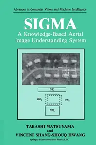
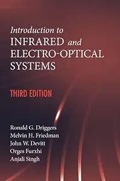
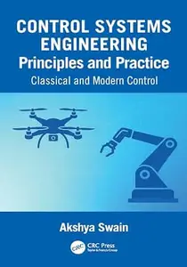
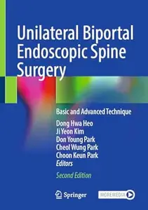
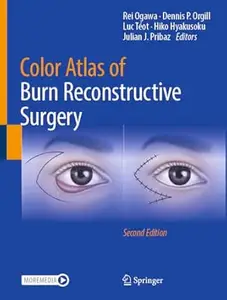
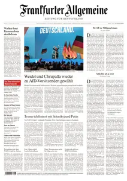
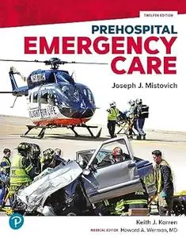

# Zavat feed - 2026-07-06

---

**Time:** 12:26:26 (Asia/Tehran)  
**Blog:** AvaxGenius  

**Title:** Solitons: Properties, Dynamics, Interactions, Applications  

**Details:** English | PDF (True) | 2002 | 308 Pages | ISBN : 0387988955 | 39.8 MB  

**Link:** http://zavat.pw/ebooks/03487988955.html  

---

**Time:** 12:26:26 (Asia/Tehran)  
**Blog:** AvaxGenius  

**Title:** Lectures on Fluid Dynamics  

**Details:** English | PDF | 2002 | 121 Pages | ISBN : 0387954228 | 9.8 MB  

**Link:** http://zavat.pw/ebooks/03879454228.html  

---

**Time:** 12:26:26 (Asia/Tehran)  
**Blog:** AvaxGenius  

**Title:** Neuropsychology  

**Details:** English | PDF | 1990 | 393 Pages | ISBN : 0896031330 | 42.2 MB  

**Link:** http://zavat.pw/ebooks/08960431330.html  

---

**Time:** 12:26:26 (Asia/Tehran)  
**Blog:** AvaxGenius  

**Title:** Computers, Chess, and Cognition  

**Details:** English | PDF | 1990 | 331 Pages | ISBN : 1461390826 | 44.5 MB  

**Link:** http://zavat.pw/ebooks/14613940826.html  

---

**Time:** 12:26:26 (Asia/Tehran)  
**Blog:** AvaxGenius  

**Title:** Operations Research and Artificial Intelligence: The Integration of Problem-Solving Strategies  

**Details:** English | PDF | 1990 | 503 Pages | ISBN : 0792391063 | 50.7 MB  

**Link:** http://zavat.pw/ebooks/07924391063.html  

---

**Time:** 12:26:26 (Asia/Tehran)  
**Blog:** AvaxGenius  

**Title:** Contributions to a Computer-Based Theory of Strategies  

**Details:** English | PDF | 1990 | 290 Pages | ISBN : 3642757383 | 30.1 MB  

**Link:** http://zavat.pw/ebooks/36427547383.html  

---

**Time:** 12:26:26 (Asia/Tehran)  
**Blog:** AvaxGenius  

**Title:** Understanding Editorial Text: A Computer Model of Argument Comprehension  

**Details:** English | PDF | 1990 | 316 Pages | ISBN : 0792391233 | 27.2 MB  

**Link:** http://zavat.pw/ebooks/07924391233.html  

---

**Time:** 12:26:26 (Asia/Tehran)  
**Blog:** AvaxGenius  

**Title:** Mathematical Methods in Linguistics  

**Details:** English | PDF | 1993 | 669 Pages | ISBN : 9027722447 | 51.1 MB  

**Link:** http://zavat.pw/ebooks/90274722447.html  

---

**Time:** 12:26:26 (Asia/Tehran)  
**Blog:** AvaxGenius  

**Title:** SIGMA: A Knowledge-Based Aerial Image Understanding System  

**Details:** English | PDF | 1990 | 290 Pages | ISBN : 030643301X | 27.8 MB  

**Link:** http://zavat.pw/ebooks/0306443301X.html  

---

**Time:** 12:26:26 (Asia/Tehran)  
**Blog:** AvaxGenius  

**Title:** Connectionistic Problem Solving: Computational Aspects of Biological Learning  

**Details:** English | PDF | 1990 | 276 Pages | ISBN : 0817634509 | 25.3 MB  

**Link:** http://zavat.pw/ebooks/08176434509.html  

---

**Time:** 12:26:26 (Asia/Tehran)  
**Blog:** AvaxGenius  

**Title:** Applied Control of Manipulation Robots: Analysis, Synthesis and Exercises  

**Details:** English | PDF | 1989 | 488 Pages | ISBN : 3642838715 | 45.1 MB  

**Link:** http://zavat.pw/ebooks/36428538715.html  

---

**Time:** 12:26:26 (Asia/Tehran)  
**Blog:** AvaxGenius  

**Title:** Logic Grammars  

**Details:** English | PDF | 1989 | 233 Pages | ISBN : 1461281881 | 16.4 MB  

**Link:** http://zavat.pw/ebooks/14612818481.html  

---

**Time:** 12:26:26 (Asia/Tehran)  
**Blog:** AvaxGenius  

**Title:** Modelling and Control  

**Details:** English | PDF | 1983 | 149 Pages | ISBN : 1468468480 | 11 MB  

**Link:** http://zavat.pw/ebooks/14684468480.html  

---

**Time:** 12:26:26 (Asia/Tehran)  
**Blog:** AvaxGenius  

**Title:** Advances in Natural Hazards and Volcanic Risks: Shaping a Sustainable Future (Repost)  

**Details:** English | EPUB (True) | 2023 | 226 Pages | ISBN : 3031250419 | 167.8 MB  

**Link:** http://zavat.pw/ebooks/320312504149.html  

---

**Time:** 12:26:26 (Asia/Tehran)  
**Blog:** AvaxGenius  

**Title:** Cities’ Vocabularies and the Sustainable Development of the Silkroads (Repost)  

**Details:** English | EPUB (True) | 2023 | 961 Pages | ISBN : 3031310268 | 236.8 MB  

**Link:** http://zavat.pw/ebooks/302314310268.html  

---

**Time:** 12:26:26 (Asia/Tehran)  
**Blog:** hill0  

**Title:** Introduction to Infrared and Electro-Optical Systems (3rd Edition)  

**Details:** English | 2022 | ISBN: ‎ 1630818321 | 739 Pages | PDF (True) | 108 MB  

**Link:** http://zavat.pw/ebooks/B0BT246VV9fg.html  

---

**Time:** 12:26:26 (Asia/Tehran)  
**Blog:** hill0  

**Title:** AI Driven Swift Architecture  

**Details:** English | 2026 | ISBN: 9781835886540 | 531 Pages | PDF (True) | 191 MB  

**Link:** http://zavat.pw/ebooks/9781835886540t.html  

---

**Time:** 12:26:26 (Asia/Tehran)  
**Blog:** hill0  

**Title:** Innovations in Finance  

**Details:** English | 2026 | ISBN: 3032193133 | 176 Pages | PDF EPUB (True) | 13 MB  

**Link:** http://zavat.pw/ebooks/3032193133.html  

---

**Time:** 12:26:26 (Asia/Tehran)  
**Blog:** hill0  

**Title:** Generative AI and Sustainability in Higher Education  

**Details:** English | 2026 | ISBN: 1041006322 | 216 Pages | PDF EPUB (True) | 21 MB  

**Link:** http://zavat.pw/ebooks/1041006322.html  

---

**Time:** 12:26:26 (Asia/Tehran)  
**Blog:** hill0  

**Title:** Specialized Plumbing Technologies  

**Details:** English | 2026 | ISBN: 1041192401 | 410 Pages | PDF EPUB (True) | 234 MB  

**Link:** http://zavat.pw/ebooks/1041192401.html  

---

**Time:** 12:26:26 (Asia/Tehran)  
**Blog:** hill0  

**Title:** Control Systems Engineering Principles and Practice  

**Details:** English | 2026 | ISBN: 1032944846 | 1053 Pages | PDF EPUB (True) | 90 MB  

**Link:** http://zavat.pw/ebooks/1032944846.html  

---

**Time:** 12:26:26 (Asia/Tehran)  
**Blog:** hill0  

**Title:** AI and the Ethics of Innovation  

**Details:** English | 2026 | ISBN: 3032206375 | 302 Pages | PDF EPUB (True) | 9 MB  

**Link:** http://zavat.pw/ebooks/3032206375.html  

---

**Time:** 12:26:26 (Asia/Tehran)  
**Blog:** hill0  

**Title:** Disasters and the Politics of Trauma  

**Details:** English | 2026 | ISBN: 3032190290 | 157 Pages | PDF EPUB (True) | 11 MB  

**Link:** http://zavat.pw/ebooks/3032190290.html  

---

**Time:** 12:26:26 (Asia/Tehran)  
**Blog:** hill0  

**Title:** The Green-Naghdi Theory of Water Waves  

**Details:** English | 2026 | ISBN: 3032142822 | 156 Pages | PDF EPUB (True) | 30 MB  

**Link:** http://zavat.pw/ebooks/3032142822.html  

---

**Time:** 12:26:26 (Asia/Tehran)  
**Blog:** hill0  

**Title:** Biomolecular Display Technologies  

**Details:** English | 2026 | ISBN: 1071652486 | 312 Pages | PDF (True) | 21 MB  

**Link:** http://zavat.pw/ebooks/1071652486.html  

---

**Time:** 12:26:26 (Asia/Tehran)  
**Blog:** hill0  

**Title:** Chimeric RNAs  

**Details:** English | 2026 | ISBN: 107165201X | 226 Pages | PDF (True) | 19 MB  

**Link:** http://zavat.pw/ebooks/107165201X.html  

---

**Time:** 12:26:26 (Asia/Tehran)  
**Blog:** hill0  

**Title:** Unilateral Biportal Endoscopic Spine Surgery (2nd Edition)  

**Details:** English | 2025 | ISBN: 9819670217 | 465 Pages | PDF (True) | 131 MB  

**Link:** http://zavat.pw/ebooks/9819670217P.html  

---

**Time:** 12:26:26 (Asia/Tehran)  
**Blog:** hill0  

**Title:** Color Atlas of Burn Reconstructive Surgery (2nd Edition)  

**Details:** English | 2025 | ISBN: 3031883527 | 498 Pages | EPUB (True) | 712 MB  

**Link:** http://zavat.pw/ebooks/3031883527E.html  

---

**Time:** 12:26:26 (Asia/Tehran)  
**Blog:** hill0  

**Title:** Le Temps - 6 Juillet 2026  

**Details:** Français | 18 pages | True PDF | 8 MB  

**Link:** http://zavat.pw/newspapers/le-temps-20260706.html  

---

**Time:** 12:26:26 (Asia/Tehran)  
**Blog:** hill0  

**Title:** Frankfurter Allgemeine Zeitung - 6 Juli 2026  

**Details:** Deutsch | 38 pages | True PDF | 10 MB  

**Link:** http://zavat.pw/newspapers/FAZ-06-07-26.html  

---

**Time:** 12:26:26 (Asia/Tehran)  
**Blog:** crazy-slim  

**Title:** The Baltimore Sun - 6 July 2026  

**Details:** English | 30 pages | True PDF | 29.4 MB  

**Link:** http://zavat.pw/newspapers/TheBaltimoreSun6July2026-34133.html  

---

**Time:** 12:26:26 (Asia/Tehran)  
**Blog:** crazy-slim  

**Title:** Hartford Courant - 6 July 2026  

**Details:** English | 24 pages | True PDF | 37.1 MB  

**Link:** http://zavat.pw/newspapers/HartfordCourant6July2026-45912.html  

---

**Time:** 12:26:26 (Asia/Tehran)  
**Blog:** crazy-slim  

**Title:** The Dallas Morning News - July 6, 2026  

**Details:** English | 29 pages | True PDF | 15.6 MB  

**Link:** http://zavat.pw/newspapers/TheDallasMorningNewsJuly62026-09589.html  

---

**Time:** 12:26:26 (Asia/Tehran)  
**Blog:** crazy-slim  

**Title:** Los Angeles Times - 6 July 2026  

**Details:** English | 32 pages | True PDF | 17.5 MB  

**Link:** http://zavat.pw/newspapers/LosAngelesTimes6July2026-15385.html  

---

**Time:** 12:26:26 (Asia/Tehran)  
**Blog:** crazy-slim  

**Title:** The Boston Globe - 6 July 2026  

**Details:** English | 32 pages | True PDF | 16.1 MB  

**Link:** http://zavat.pw/newspapers/TheBostonGlobe6July2026-29588.html  

---

**Time:** 12:26:26 (Asia/Tehran)  
**Blog:** crazy-slim  

**Title:** The Economic Times Wealth - July 6, 2026  

**Details:** English | 24 pages | True PDF | 4.9 MB  

**Link:** http://zavat.pw/magazines/TheEconomicTimesWealthJuly62026-97136.html  

---

**Time:** 12:26:26 (Asia/Tehran)  
**Blog:** crazy-slim  

**Title:** Lake County News-Sun - 6 July 2026  

**Details:** English | 16 pages | True PDF | 9.6 MB  

**Link:** http://zavat.pw/newspapers/LakeCountyNewsSun6July2026-75780.html  

---

**Time:** 12:26:26 (Asia/Tehran)  
**Blog:** crazy-slim  

**Title:** France-Antilles Guadeloupe - 6 Juillet 2026  

**Details:** Français | 40 pages | PDF | 47.0 MB  

**Link:** http://zavat.pw/newspapers/FranceAntillesGuadeloupe6Juillet2026-34040.html  

---

**Time:** 12:26:26 (Asia/Tehran)  
**Blog:** crazy-slim  

**Title:** The Washington Post - July 6, 2026  

**Details:** English | 44 pages | True PDF | 21.1 MB  

**Link:** http://zavat.pw/newspapers/TheWashingtonPostJuly62026-61610.html  

---

**Time:** 12:26:26 (Asia/Tehran)  
**Blog:** crazy-slim  

**Title:** Chicago Sun-Times - 6 July 2026  

**Details:** English | 44 pages | True PDF | 58.0 MB  

**Link:** http://zavat.pw/newspapers/ChicagoSunTimes6July2026-41691.html  

---

**Time:** 12:26:26 (Asia/Tehran)  
**Blog:** crazy-slim  

**Title:** The Morning Call Morning Edition - 6 July 2026  

**Details:** English | 25 pages | True PDF | 20.5 MB  

**Link:** http://zavat.pw/newspapers/TheMorningCallMorningEdition6July2026-18476.html  

---

**Time:** 12:26:26 (Asia/Tehran)  
**Blog:** crazy-slim  

**Title:** The Wall Street Journal - 6 July 2026  

**Details:** English | 29 pages | True PDF | 12.3 MB  

**Link:** http://zavat.pw/newspapers/TheWallStreetJournal6July2026-28528.html  

---

**Time:** 12:26:26 (Asia/Tehran)  
**Blog:** crazy-slim  

**Title:** The Philadelphia Inquirer - July 6, 2026  

**Details:** English | 28 pages | True PDF | 31.4 MB  

**Link:** http://zavat.pw/newspapers/ThePhiladelphiaInquirerJuly62026-07783.html  

---

**Time:** 12:26:26 (Asia/Tehran)  
**Blog:** crazy-slim  

**Title:** The Beacon-News - 6 July 2026  

**Details:** English | 16 pages | True PDF | 9.2 MB  

**Link:** http://zavat.pw/newspapers/TheBeaconNews6July2026-58156.html  

---

**Time:** 12:26:26 (Asia/Tehran)  
**Blog:** crazy-slim  

**Title:** Sun Sentinel - 6 July 2026  

**Details:** English | 25 pages | True PDF | 17.2 MB  

**Link:** http://zavat.pw/newspapers/SunSentinel6July2026-94814.html  

---

**Time:** 02:25:48 (Asia/Tehran)  
**Blog:** hill0  

**Title:** Digital China  

**Details:** English | 2026 | ISBN: 9819562392 | 278 Pages | PDF EPUB (True) | 42 MB  

**Link:** http://zavat.pw/ebooks/9819562392.html  

---

**Time:** 02:25:48 (Asia/Tehran)  
**Blog:** hill0  

**Title:** Prehospital Emergency Care (12th Edition)  

**Details:** English | 2024 | ISBN: 0138223866 | 1617 Pages | PDF (True) | 144 MB  

**Link:** http://zavat.pw/ebooks/0138223866T.html  

---

**Time:** 00:20:17 (Asia/Tehran)  
**Blog:** hill0  

**Title:** The New York Times - July 5, 2026  

**Details:** English | 108 pages | True PDF | 61 MB  

**Link:** http://zavat.pw/newspapers/NYT-050726.html  

