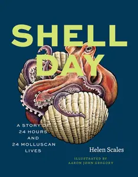
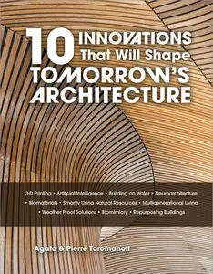
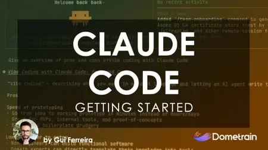
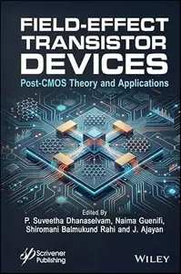
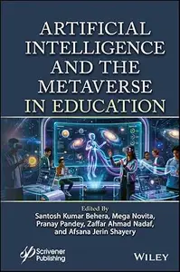
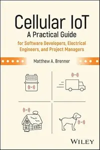

# Zavat feed - 2026-07-07

---

**Time:** 02:30:28 (Asia/Tehran)  
**Blog:** IrGens  

**Title:** Shell Day: A Story of 24 Hours and 24 Molluscan Lives  

**Details:** English | July 3, 2026 | ISBN: 0226840522, 9780226840536 | True EPUB | 208 pages | 2.7 MB  

**Link:** http://zavat.pw/ebooks/0226840522.html  

---

**Time:** 02:30:28 (Asia/Tehran)  
**Blog:** IrGens  

**Title:** Rate This Book: How Star Ratings Took Over the World  

**Details:** English | 2 July 2026 | ISBN: 1917923651, 9781917923675 | True EPUB | 288 pages | 1.5 MB  

**Link:** http://zavat.pw/ebooks/1917923651.html  

---

**Time:** 01:24:08 (Asia/Tehran)  
**Blog:** IrGens  

**Title:** Nashville Architecture: A Guide to the City  

**Details:** English | September 30, 2015 | ISBN: 1572339209 | True EPUB/PDF | 321 pages | 109/63.8 MB  

**Link:** http://zavat.pw/ebooks/1572339209.html  

---

**Time:** 01:24:08 (Asia/Tehran)  
**Blog:** IrGens  

**Title:** 10 Innovations That Will Shape Tomorrow's Architecture  

**Details:** English | June 28, 2026 | ISBN: 0764371657, 9781507306857 | True EPUB | 256 pages | 155 MB  

**Link:** http://zavat.pw/ebooks/0764371657.html  

---

**Time:** 01:24:08 (Asia/Tehran)  
**Blog:** IrGens  

**Title:** Getting Started: Claude Code  

**Details:** .MP4, AVC, 1920x1080, 30 fps | English, AAC, 2 Ch | 4h 32m | 2.15 GB  

**Link:** http://zavat.pw/ebooks/getting-started-claude-code.html  

---

**Time:** 01:24:08 (Asia/Tehran)  
**Blog:** hill0  

**Title:** Handbook of Traditional Spirituality and Sustainability  

**Details:** English | 2026 | ISBN: 3032057949 | 667 Pages | PDF (True) | 45 MB  

**Link:** http://zavat.pw/ebooks/3032057949.html  

---

**Time:** 01:24:08 (Asia/Tehran)  
**Blog:** hill0  

**Title:** Field-Effect Transistor Devices  

**Details:** English | 2026 | ISBN: 1394311451 | 523 Pages | EPUB (True) | 11 MB  

**Link:** http://zavat.pw/ebooks/1394311451E.html  

---

**Time:** 01:24:08 (Asia/Tehran)  
**Blog:** hill0  

**Title:** Darwin: A Biography  

**Details:** English | 2026 | ISBN: 0691232253 | 650 Pages | EPUB (True) | 51 MB  

**Link:** http://zavat.pw/ebooks/0691232253.html  

---

**Time:** 01:24:08 (Asia/Tehran)  
**Blog:** hill0  

**Title:** Artificial Intelligence and Metaverse in Education  

**Details:** English | 2026 | ISBN: 139433561X | 708 Pages | EPUB (True) | 12 MB  

**Link:** http://zavat.pw/ebooks/139433561XE.html  

---

**Time:** 01:24:08 (Asia/Tehran)  
**Blog:** hill0  

**Title:** Cellular IoT: A Practical Guide for Software Developers  

**Details:** English | 2026 | ISBN: 1394329652 | 693 Pages | EPUB (True) | 6 MB  

**Link:** http://zavat.pw/ebooks/1394329652E.html  

