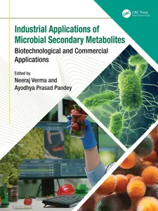
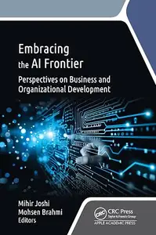
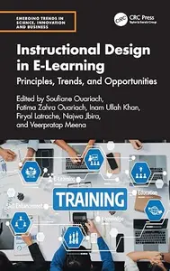
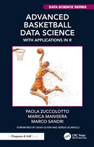
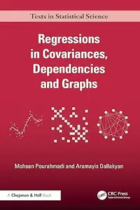
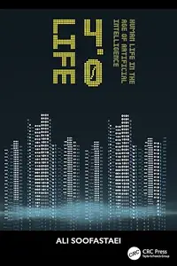
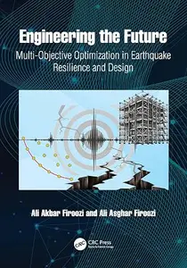
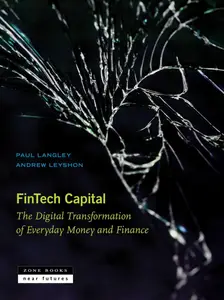
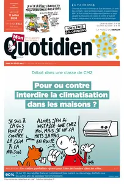
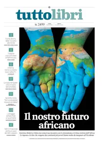

# Zavat feed - 2026-07-11

---

**Time:** 08:46:21 (Asia/Tehran)  
**Blog:** yoyoloit  

**Title:** Industrial Applications of Microbial Secondary Metabolites: Biotechnological and Commercial Applications  

**Details:** English | 2026 | ISBN: 1032515503 | 284 pages | True PDF | 42.55 MB  

**Link:** http://zavat.pw/ebooks/1032515503.html  

---

**Time:** 08:46:21 (Asia/Tehran)  
**Blog:** yoyoloit  

**Title:** Embracing the AI Frontier: Perspectives on Business and Organizational Development  

**Details:** English | 2026 | ISBN: 1779641303 | 256 pages | True PDF | 16.05 MB  

**Link:** http://zavat.pw/ebooks/1779641303.html  

---

**Time:** 08:46:21 (Asia/Tehran)  
**Blog:** yoyoloit  

**Title:** Microbes in the Food Industry: A Contemporary Outlook  

**Details:** English | 2026 | ISBN: 1041025181 | 288 pages | True PDF | 32.95 MB  

**Link:** http://zavat.pw/ebooks/1041025181.html  

---

**Time:** 08:46:21 (Asia/Tehran)  
**Blog:** yoyoloit  

**Title:** Instructional Design in E-Learning: Principles, Trends, and Opportunities  

**Details:** English | 2026 | ISBN: 1041161042 | 352 pages | True PDF | 28.26 MB  

**Link:** http://zavat.pw/ebooks/1041161042.html  

---

**Time:** 08:46:21 (Asia/Tehran)  
**Blog:** yoyoloit  

**Title:** Advanced Basketball Data Science: With Applications in R  

**Details:** English | 2026 | ISBN: 1032502177 | 343 pages | True PDF | 140.39 MB  

**Link:** http://zavat.pw/ebooks/1032502177.html  

---

**Time:** 08:46:21 (Asia/Tehran)  
**Blog:** yoyoloit  

**Title:** Industry 5.0: The Future of the Industrial Economy, 2nd Edition  

**Details:** English | 2026 | ISBN: 1041200013 | 205 pages | True PDF | 20.76 MB  

**Link:** http://zavat.pw/ebooks/1041200013.html  

---

**Time:** 08:46:21 (Asia/Tehran)  
**Blog:** yoyoloit  

**Title:** Generative AI in the Social Sciences and Humanities: Navigating Challenges and Opportunities in Research and Education  

**Details:** English | 2026 | ISBN: 1041143702 | 241 pages | True PDF | 12.23 MB  

**Link:** http://zavat.pw/ebooks/1041143702.html  

---

**Time:** 08:46:21 (Asia/Tehran)  
**Blog:** yoyoloit  

**Title:** Regressions in Covariances, Dependencies and Graphs  

**Details:** English | 2026 | ISBN: 1041066953 | 405 pages | True PDF | 17.57 MB  

**Link:** http://zavat.pw/ebooks/1041066953.html  

---

**Time:** 08:46:21 (Asia/Tehran)  
**Blog:** yoyoloit  

**Title:** LIFE 4.0: Human Life in the Age of Artificial Intelligence  

**Details:** English | 2026 | ISBN: 1032533463 | 326 pages | True PDF | 17.03 MB  

**Link:** http://zavat.pw/ebooks/1032533463.html  

---

**Time:** 08:46:21 (Asia/Tehran)  
**Blog:** yoyoloit  

**Title:** Engineering the Future Multi-Objective Optimization in Earthquake Resilience and Design  

**Details:** English | 2026 | ISBN: 1041200234 | 225 pages | True PDF | 24.67 MB  

**Link:** http://zavat.pw/ebooks/1041200234.html  

---

**Time:** 08:46:21 (Asia/Tehran)  
**Blog:** IrGens  

**Title:** Operational Cybersecurity with AI: From Vision to Threat Hunting  

**Details:** ISBN: 9780135889336 | .MP4, AVC, 1280x720, 30 fps | English, AAC, 2 Ch | 8h 7m | 14.76 GB  

**Link:** http://zavat.pw/ebooks/9780135889336.html  

---

**Time:** 08:46:21 (Asia/Tehran)  
**Blog:** IrGens  

**Title:** Zen and Slow Games  

**Details:** English | January 20, 2026 | ISBN: 0262553562, 9780262385022 | True EPUB | 224 pages | 32.3 MB  

**Link:** http://zavat.pw/ebooks/0262553562-epub.html  

---

**Time:** 08:46:21 (Asia/Tehran)  
**Blog:** IrGens  

**Title:** Fintech Capital: The Digital Transformation of Everyday Money and Finance  

**Details:** English | July 14, 2026 | ISBN: 1945861339, 9781945861345 | True EPUB | 336 pages | 1.4 MB  

**Link:** http://zavat.pw/ebooks/1945861339.html  

---

**Time:** 08:46:21 (Asia/Tehran)  
**Blog:** IrGens  

**Title:** Vermeer’s Afterlives  

**Details:** English | June 23, 2026 | ISBN: 0691277826, 9780691277912 | True PDF | 320 pages | 37.3 MB  

**Link:** http://zavat.pw/ebooks/0691277826.html  

---

**Time:** 08:46:21 (Asia/Tehran)  
**Blog:** IrGens  

**Title:** Heatwave: The Summer of 1976 – Britain at Boiling Point  

**Details:** English | 8 May 2025 | ISBN: 1800961715, 1800961731, 9781800961746 | True EPUB | 384 pages | 4.5 MB  

**Link:** http://zavat.pw/ebooks/1800961715.html  

---

**Time:** 08:46:21 (Asia/Tehran)  
**Blog:** IrGens  

**Title:** Invisible Capital: How Unseen Forces Shape Entrepreneurial Opportunity  

**Details:** English | October 21, 2010 | ISBN: 1605093076, 9781605099477 | True EPUB | 192pages | 3.2 MB  

**Link:** http://zavat.pw/ebooks/1605093076-epub.html  

---

**Time:** 08:46:21 (Asia/Tehran)  
**Blog:** IrGens  

**Title:** The DGSE: A Concise History of France's Foreign Intelligence Service  

**Details:** English | April 1, 2026 | ISBN: 1647127076, 1647127084, 9781647127091 | True EPUB | 200 pages | 8.8 MB  

**Link:** http://zavat.pw/ebooks/1647127076.html  

---

**Time:** 08:46:21 (Asia/Tehran)  
**Blog:** IrGens  

**Title:** Queer Saints: A Radical Guide to Magic, Miracles, and Modern Intercession  

**Details:** English | June 1, 2026 | ISBN: 1578639077, 9781633414020 | True EPUB | 240 pages | 2.9 MB  

**Link:** http://zavat.pw/ebooks/1578639077.html  

---

**Time:** 08:46:21 (Asia/Tehran)  
**Blog:** crazy-slim  

**Title:** Paris Turf - 11 Juillet 2026  

**Details:** Français | 52 pages | PDF | 87.1 MB  

**Link:** http://zavat.pw/newspapers/ParisTurf11Juillet2026-25430.html  

---

**Time:** 08:46:21 (Asia/Tehran)  
**Blog:** crazy-slim  

**Title:** Paris Courses - 11 Juillet 2026  

**Details:** Français | 32 pages | PDF | 55.2 MB  

**Link:** http://zavat.pw/newspapers/ParisCourses11Juillet2026-06596.html  

---

**Time:** 08:46:21 (Asia/Tehran)  
**Blog:** crazy-slim  

**Title:** WeekEnd - 11 Juillet 2026  

**Details:** Français | 20 pages | PDF | 25.5 MB  

**Link:** http://zavat.pw/newspapers/WeekEnd11Juillet2026-97498.html  

---

**Time:** 08:46:21 (Asia/Tehran)  
**Blog:** crazy-slim  

**Title:** Financial Times Europe - 11 July 2026  

**Details:** English | 48 pages | PDF | 63.1 MB  

**Link:** http://zavat.pw/newspapers/FinancialTimesEurope11July2026-15730.html  

---

**Time:** 08:46:21 (Asia/Tehran)  
**Blog:** crazy-slim  

**Title:** Mon Quotidien - 11 Juillet 2026  

**Details:** Français | 8 pages | PDF | 7.1 MB  

**Link:** http://zavat.pw/newspapers/MonQuotidien11Juillet2026-63208.html  

---

**Time:** 08:46:21 (Asia/Tehran)  
**Blog:** crazy-slim  

**Title:** Financial Times USA - 11 July 2026  

**Details:** English | 46 pages | PDF | 61.3 MB  

**Link:** http://zavat.pw/newspapers/FinancialTimesUSA11July2026-58344.html  

---

**Time:** 08:46:21 (Asia/Tehran)  
**Blog:** crazy-slim  

**Title:** Financial Times UK - 11 July 2026  

**Details:** English | 66 pages | PDF | 80.8 MB  

**Link:** http://zavat.pw/newspapers/FinancialTimesUK11July2026-30048.html  

---

**Time:** 08:46:21 (Asia/Tehran)  
**Blog:** crazy-slim  

**Title:** Le Petit Quotidien - 11 Juillet 2026  

**Details:** Français | 4 pages | PDF | 3.2 MB  

**Link:** http://zavat.pw/newspapers/LePetitQuotidien11Juillet2026-95110.html  

---

**Time:** 08:46:21 (Asia/Tehran)  
**Blog:** crazy-slim  

**Title:** La Sicilia - 11 Luglio 2026  

**Details:** Italiano | 64 pages | PDF | 187.6 MB  

**Link:** http://zavat.pw/newspapers/LaSicilia11Luglio2026-65424.html  

---

**Time:** 08:46:21 (Asia/Tehran)  
**Blog:** crazy-slim  

**Title:** VG - 11 Juli 2026  

**Details:** Norsk | 140 pages | PDF | 101.6 MB  

**Link:** http://zavat.pw/newspapers/VG11Juli2026-47144.html  

---

**Time:** 08:46:21 (Asia/Tehran)  
**Blog:** crazy-slim  

**Title:** Expressen - 11 Juli 2026  

**Details:** Svenska | 96 pages | PDF | 109.1 MB  

**Link:** http://zavat.pw/newspapers/Expressen11Juli2026-49731.html  

---

**Time:** 08:46:21 (Asia/Tehran)  
**Blog:** crazy-slim  

**Title:** Libero - 11 Luglio 2026  

**Details:** Italiano | 40 pages | PDF | 88.8 MB  

**Link:** http://zavat.pw/newspapers/Libero11Luglio2026-95879.html  

---

**Time:** 08:46:21 (Asia/Tehran)  
**Blog:** crazy-slim  

**Title:** El País - 11 Julio 2026  

**Details:** Español | 64 pages | True PDF | 27.3 MB  

**Link:** http://zavat.pw/newspapers/ElPa%C3%ADs11Julio2026-16934.html  

---

**Time:** 08:46:21 (Asia/Tehran)  
**Blog:** crazy-slim  

**Title:** TuttoSport - 11 Luglio 2026  

**Details:** Italiano | 40 pages | True PDF | 25.5 MB  

**Link:** http://zavat.pw/newspapers/TuttoSport11Luglio2026-90157.html  

---

**Time:** 08:46:21 (Asia/Tehran)  
**Blog:** crazy-slim  

**Title:** Tuttolibri - 11 Luglio 2026  

**Details:** Italiano | 24 pages | True PDF | 10.6 MB  

**Link:** http://zavat.pw/newspapers/Tuttolibri11Luglio2026-39916.html  

---

**Time:** 05:28:49 (Asia/Tehran)  
**Blog:** AvaxGenius  

**Title:** Personalized Orthopedics: Contributions and Applications of Biomedical Engineering (Repost)  

**Details:** English | EPUB | 2022 | 554 Pages | ISBN : 3030982785 | 129 MB  

**Link:** http://zavat.pw/ebooks/303049827853.html  

---

**Time:** 05:28:49 (Asia/Tehran)  
**Blog:** AvaxGenius  

**Title:** Mechanism Design for Robotics (Repost)  

**Details:** English | PDF,EPUB | 2018 (2019 Edition) | 467 Pages | ISBN : 3030003647 | 112.8 MB  

**Link:** http://zavat.pw/ebooks/303000343647.html  

---

**Time:** 05:28:49 (Asia/Tehran)  
**Blog:** AvaxGenius  

**Title:** Isogeometric Topology Optimization: Methods, Applications and Implementations (Repost)  

**Details:** English | PDF,EPUB | 2022 | 230 Pages | ISBN : 9811917698 | 101.8 MB  

**Link:** http://zavat.pw/ebooks/981154917698.html  

---

**Time:** 05:28:49 (Asia/Tehran)  
**Blog:** AvaxGenius  

**Title:** Advanced Manufacturing and Automation XIII (Repost)  

**Details:** English | EPUB (True) | 2024 | 774 Pages | ISBN : 9819706645 | 120.9 MB  

**Link:** http://zavat.pw/ebooks/928197406645.html  

---

**Time:** 05:28:49 (Asia/Tehran)  
**Blog:** AvaxGenius  

**Title:** Novel Luminescent Crystalline Materials of Gold(I) Complexes with Stimuli-Responsive Properties (Repost)  

**Details:** English | EPUB | 2020 | 200 Pages | ISBN : 9811540624 | 100.7 MB  

**Link:** http://zavat.pw/ebooks/981124540624.html  

---

**Time:** 05:28:49 (Asia/Tehran)  
**Blog:** AvaxGenius  

**Title:** Proceedings of International Conference on Computational Intelligence, Data Science and Cloud Computing: IEM-ICDC 2020 (Repost)  

**Details:** English | EPUB | 2021 | 781 Pages | ISBN : 9813349670 | 129.9 MB  

**Link:** http://zavat.pw/ebooks/981334916704.html  

---

**Time:** 05:28:49 (Asia/Tehran)  
**Blog:** AvaxGenius  

**Title:** ARL Reader Planungstheorie Band 2: Strategische Planung - Planungskultur (Repost)  

**Details:** Deutsch | PDF | 2019 | 315 Pages | ISBN : 3662576236 | 209.6 MB  

**Link:** http://zavat.pw/ebooks/366425761236.html  

---

**Time:** 05:28:49 (Asia/Tehran)  
**Blog:** AvaxGenius  

**Title:** Congress on Intelligent Systems Proceedings of CIS 2021, Volume 2 (Repost)  

**Details:** English | EPUB | 2022 | 914 Pages | ISBN : 9811691126 | 123.7 MB  

**Link:** http://zavat.pw/ebooks/981416911216.html  

---

**Time:** 05:28:49 (Asia/Tehran)  
**Blog:** AvaxGenius  

**Title:** Communication, Smart Technologies and Innovation for Society: Proceedings of CITIS 2021 (Repost)  

**Details:** English | EPUB | 2022 | 765 Pages | ISBN : 9811641250 | 105.3 MB  

**Link:** http://zavat.pw/ebooks/981136441250.html  

---

**Time:** 05:28:49 (Asia/Tehran)  
**Blog:** AvaxGenius  

**Title:** Data Intelligence and Cognitive Informatics: Proceedings of ICDICI 2023 (Repost)  

**Details:** English | EPUB (True) | 2024 | 579 Pages | ISBN : 9819979994 | 99.9 MB  

**Link:** http://zavat.pw/ebooks/981919799944.html  

---

**Time:** 05:28:49 (Asia/Tehran)  
**Blog:** AvaxGenius  

**Title:** Surgical and Perioperative Management of Patients with Anatomic Anomalies (Repost)  

**Details:** English | EPUB | 2021 | 522 Pages | ISBN : 3030556581 | 206.2 MB  

**Link:** http://zavat.pw/ebooks/303054561581.html  

---

**Time:** 05:28:49 (Asia/Tehran)  
**Blog:** AvaxGenius  

**Title:** Landscape Empowerment (Repost)  

**Details:** English | EPUB | 2021 | 269 Pages | ISBN : 9811520666 | 247.7 MB  

**Link:** http://zavat.pw/ebooks/981215230666.html  

---

**Time:** 05:28:49 (Asia/Tehran)  
**Blog:** AvaxGenius  

**Title:** Non-Pushing PCI Techniques (Repost)  

**Details:** English | EPUB | 2021 | 282 Pages | ISBN : 9811570426 | 218.6 MB  

**Link:** http://zavat.pw/ebooks/981214570426.html  

---

**Time:** 05:28:49 (Asia/Tehran)  
**Blog:** AvaxGenius  

**Title:** Liutex and Third Generation of Vortex Definition and Identification: An Invited Workshop from Chaos 2020 (Repost)  

**Details:** English | EPUB | 2021 | 479 Pages | ISBN : 3030702162 | 168.3 MB  

**Link:** http://zavat.pw/ebooks/303077021262.html  

---

**Time:** 05:28:49 (Asia/Tehran)  
**Blog:** AvaxGenius  

**Title:** Proceedings of the 26th International Symposium on Advancement of Construction Management and Real Estate (Repost)  

**Details:** English | PDF | 2022 | 1685 Pages | ISBN : 9811952558 | 107.8 MB  

**Link:** http://zavat.pw/ebooks/9811595232558.html  

---

**Time:** 02:00:58 (Asia/Tehran)  
**Blog:** hill0  

**Title:** Synthetic Gene Circuits  

**Details:** English | 2026 | ISBN: 1071653032 | 430 Pages | PDF EPUB (True) | 48 MB  

**Link:** http://zavat.pw/ebooks/1071653032.html  

---

**Time:** 00:34:13 (Asia/Tehran)  
**Blog:** hill0  

**Title:** Blood Substitutes and Oxygen Biotherapeutics (2nd Edition)  

**Details:** English | 2026 | ISBN: 3032226554 | 410 Pages | PDF EPUB (True) | 73 MB  

**Link:** http://zavat.pw/ebooks/3032226554.html  

