# Zavat feed - 2026-07-11

---

**Time:** 05:28:49 (Asia/Tehran)  
**Blog:** AvaxGenius  

**Title:** Personalized Orthopedics: Contributions and Applications of Biomedical Engineering (Repost)  

**Details:** English | EPUB | 2022 | 554 Pages | ISBN : 3030982785 | 129 MB  

**Link:** http://zavat.pw/ebooks/303049827853.html  

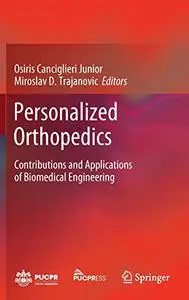

---

**Time:** 05:28:49 (Asia/Tehran)  
**Blog:** AvaxGenius  

**Title:** Mechanism Design for Robotics (Repost)  

**Details:** English | PDF,EPUB | 2018 (2019 Edition) | 467 Pages | ISBN : 3030003647 | 112.8 MB  

**Link:** http://zavat.pw/ebooks/303000343647.html  

---

**Time:** 05:28:49 (Asia/Tehran)  
**Blog:** AvaxGenius  

**Title:** Isogeometric Topology Optimization: Methods, Applications and Implementations (Repost)  

**Details:** English | PDF,EPUB | 2022 | 230 Pages | ISBN : 9811917698 | 101.8 MB  

**Link:** http://zavat.pw/ebooks/981154917698.html  

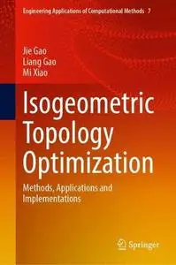

---

**Time:** 05:28:49 (Asia/Tehran)  
**Blog:** AvaxGenius  

**Title:** Advanced Manufacturing and Automation XIII (Repost)  

**Details:** English | EPUB (True) | 2024 | 774 Pages | ISBN : 9819706645 | 120.9 MB  

**Link:** http://zavat.pw/ebooks/928197406645.html  

---

**Time:** 05:28:49 (Asia/Tehran)  
**Blog:** AvaxGenius  

**Title:** Novel Luminescent Crystalline Materials of Gold(I) Complexes with Stimuli-Responsive Properties (Repost)  

**Details:** English | EPUB | 2020 | 200 Pages | ISBN : 9811540624 | 100.7 MB  

**Link:** http://zavat.pw/ebooks/981124540624.html  

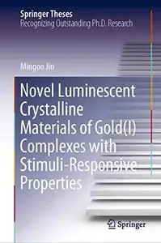

---

**Time:** 05:28:49 (Asia/Tehran)  
**Blog:** AvaxGenius  

**Title:** Proceedings of International Conference on Computational Intelligence, Data Science and Cloud Computing: IEM-ICDC 2020 (Repost)  

**Details:** English | EPUB | 2021 | 781 Pages | ISBN : 9813349670 | 129.9 MB  

**Link:** http://zavat.pw/ebooks/981334916704.html  

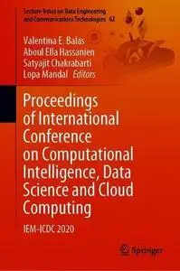

---

**Time:** 05:28:49 (Asia/Tehran)  
**Blog:** AvaxGenius  

**Title:** ARL Reader Planungstheorie Band 2: Strategische Planung - Planungskultur (Repost)  

**Details:** Deutsch | PDF | 2019 | 315 Pages | ISBN : 3662576236 | 209.6 MB  

**Link:** http://zavat.pw/ebooks/366425761236.html  

---

**Time:** 05:28:49 (Asia/Tehran)  
**Blog:** AvaxGenius  

**Title:** Congress on Intelligent Systems Proceedings of CIS 2021, Volume 2 (Repost)  

**Details:** English | EPUB | 2022 | 914 Pages | ISBN : 9811691126 | 123.7 MB  

**Link:** http://zavat.pw/ebooks/981416911216.html  

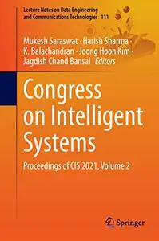

---

**Time:** 05:28:49 (Asia/Tehran)  
**Blog:** AvaxGenius  

**Title:** Communication, Smart Technologies and Innovation for Society: Proceedings of CITIS 2021 (Repost)  

**Details:** English | EPUB | 2022 | 765 Pages | ISBN : 9811641250 | 105.3 MB  

**Link:** http://zavat.pw/ebooks/981136441250.html  

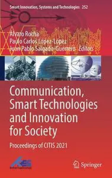

---

**Time:** 05:28:49 (Asia/Tehran)  
**Blog:** AvaxGenius  

**Title:** Data Intelligence and Cognitive Informatics: Proceedings of ICDICI 2023 (Repost)  

**Details:** English | EPUB (True) | 2024 | 579 Pages | ISBN : 9819979994 | 99.9 MB  

**Link:** http://zavat.pw/ebooks/981919799944.html  

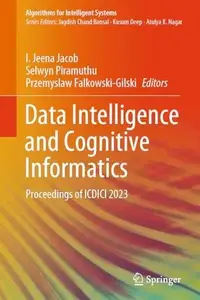

---

**Time:** 05:28:49 (Asia/Tehran)  
**Blog:** AvaxGenius  

**Title:** Surgical and Perioperative Management of Patients with Anatomic Anomalies (Repost)  

**Details:** English | EPUB | 2021 | 522 Pages | ISBN : 3030556581 | 206.2 MB  

**Link:** http://zavat.pw/ebooks/303054561581.html  

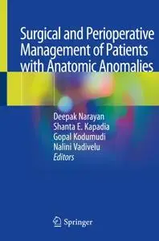

---

**Time:** 05:28:49 (Asia/Tehran)  
**Blog:** AvaxGenius  

**Title:** Landscape Empowerment (Repost)  

**Details:** English | EPUB | 2021 | 269 Pages | ISBN : 9811520666 | 247.7 MB  

**Link:** http://zavat.pw/ebooks/981215230666.html  

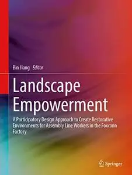

---

**Time:** 05:28:49 (Asia/Tehran)  
**Blog:** AvaxGenius  

**Title:** Non-Pushing PCI Techniques (Repost)  

**Details:** English | EPUB | 2021 | 282 Pages | ISBN : 9811570426 | 218.6 MB  

**Link:** http://zavat.pw/ebooks/981214570426.html  

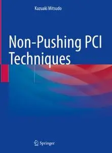

---

**Time:** 05:28:49 (Asia/Tehran)  
**Blog:** AvaxGenius  

**Title:** Liutex and Third Generation of Vortex Definition and Identification: An Invited Workshop from Chaos 2020 (Repost)  

**Details:** English | EPUB | 2021 | 479 Pages | ISBN : 3030702162 | 168.3 MB  

**Link:** http://zavat.pw/ebooks/303077021262.html  

---

**Time:** 05:28:49 (Asia/Tehran)  
**Blog:** AvaxGenius  

**Title:** Proceedings of the 26th International Symposium on Advancement of Construction Management and Real Estate (Repost)  

**Details:** English | PDF | 2022 | 1685 Pages | ISBN : 9811952558 | 107.8 MB  

**Link:** http://zavat.pw/ebooks/9811595232558.html  

---

**Time:** 02:00:58 (Asia/Tehran)  
**Blog:** hill0  

**Title:** Synthetic Gene Circuits  

**Details:** English | 2026 | ISBN: 1071653032 | 430 Pages | PDF EPUB (True) | 48 MB  

**Link:** http://zavat.pw/ebooks/1071653032.html  

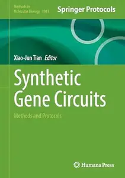

---

**Time:** 00:34:13 (Asia/Tehran)  
**Blog:** hill0  

**Title:** Blood Substitutes and Oxygen Biotherapeutics (2nd Edition)  

**Details:** English | 2026 | ISBN: 3032226554 | 410 Pages | PDF EPUB (True) | 73 MB  

**Link:** http://zavat.pw/ebooks/3032226554.html  

