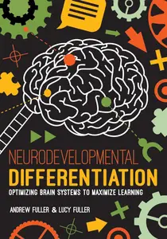
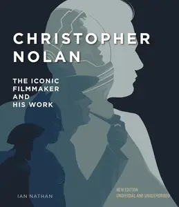
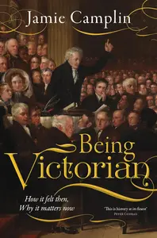
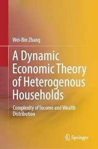
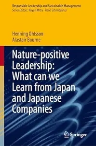
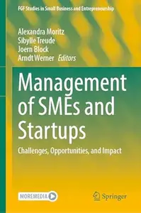
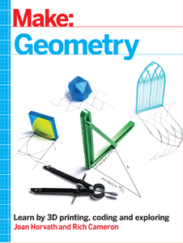

# Zavat feed - 2026-07-14

---

**Time:** 05:20:04 (Asia/Tehran)  
**Blog:** IrGens  

**Title:** Neurodevelopmental Differentiation: Optimizing Brain Systems to Maximize Learning  

**Details:** English | April 2, 2021 | ISBN: 1951075951, 9781951075965 | True EPUB | 240 pages | 1.8 MB  

**Link:** http://zavat.pw/ebooks/1951075951.html  

---

**Time:** 05:20:04 (Asia/Tehran)  
**Blog:** IrGens  

**Title:** The Twitnam Summer: Friendship, Satire and the Writing of Gulliver’s Travels  

**Details:** English | 4 Jun. 2026 | ISBN: 0008699984, 9780008700003 | True EPUB | 352 pages | 14.4 MB  

**Link:** http://zavat.pw/ebooks/0008699984.html  

---

**Time:** 05:20:04 (Asia/Tehran)  
**Blog:** IrGens  

**Title:** The Sopranos: The Official Cocktail Book  

**Details:** English | October 15, 2024 | ISBN: 9798886635676, 9798886635683 | True EPUB | 144 pages | 67 MB  

**Link:** http://zavat.pw/ebooks/9798886635676.html  

---

**Time:** 05:20:04 (Asia/Tehran)  
**Blog:** IrGens  

**Title:** Christopher Nolan: The Iconic Filmmaker and His Work, New Edition  

**Details:** English | June 2, 2026 | ISBN: 1805701800, 9781805701811 | True EPUB | 192 pages | 30.8 MB  

**Link:** http://zavat.pw/ebooks/1805701800.html  

---

**Time:** 05:20:04 (Asia/Tehran)  
**Blog:** IrGens  

**Title:** Being Victorian: How it felt then, Why it matters now  

**Details:** English | March 31, 2026 | ISBN: 1917458282, 9781917458542 | True EPUB | 336 pages | 11.3 MB  

**Link:** http://zavat.pw/ebooks/1917458282.html  

---

**Time:** 02:19:17 (Asia/Tehran)  
**Blog:** hill0  

**Title:** A Dynamic Economic Theory of Heterogenous Households  

**Details:** English | 2026 | ISBN: 9819589177 | 303 Pages | PDF EPUB (True) | 51 MB  

**Link:** http://zavat.pw/ebooks/9819589177.html  

---

**Time:** 02:19:17 (Asia/Tehran)  
**Blog:** hill0  

**Title:** The BRICS and the Transformation of Global Power  

**Details:** English | 2026 | ISBN: 3032235391 | 183 Pages | PDF EPUB (True) | 4 MB  

**Link:** http://zavat.pw/ebooks/3032235391.html  

---

**Time:** 02:19:17 (Asia/Tehran)  
**Blog:** hill0  

**Title:** Nature-Positive Leadership  

**Details:** English | 2026 | ISBN: 9819207452 | 169 Pages | PDF EPUB (True) | 22 MB  

**Link:** http://zavat.pw/ebooks/9819207452.html  

---

**Time:** 01:21:58 (Asia/Tehran)  
**Blog:** hill0  

**Title:** Management of SMEs and Startups  

**Details:** English | 2026 | ISBN: 3032175372 | 403 Pages | PDF EPUB (True) | 14 MB  

**Link:** http://zavat.pw/ebooks/3032175372.html  

---

**Time:** 01:21:58 (Asia/Tehran)  
**Blog:** hill0  

**Title:** Make – Geometry: Learn by Coding, 3D Printing and Building  

**Details:** English | 2021 | ISBN: 1680456717 | 340 Pages | True EPUB | 30 MB  

**Link:** http://zavat.pw/ebooks/1680456717T.html  

