# Zavat feed - 2026-07-15

---

**Time:** 22:29:58 (Asia/Tehran)  
**Blog:** hill0  

**Title:** Stochastic Lagrangian Modeling for Large Eddy Simulation of Dispersed Turbulent Two-Phase Flows  

**Details:** English | 2018 | ISBN: 1608053776 | 130 Pages | PDF (True) | 10 MB  

**Link:** http://zavat.pw/ebooks/1608053776.html  

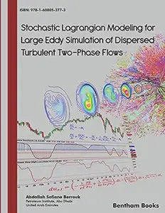

---

**Time:** 22:29:58 (Asia/Tehran)  
**Blog:** hill0  

**Title:** Digital Twin-Driven Manufacturing System  

**Details:** English | 2026 | ISBN: 9819582350 | 319 Pages | PDF EPUB (True) | 35 MB  

**Link:** http://zavat.pw/ebooks/9819582350.html  

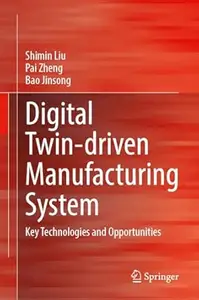

---

**Time:** 22:29:58 (Asia/Tehran)  
**Blog:** hill0  

**Title:** Intelligence at the Interface  

**Details:** English | 2026 | ISBN: 9819575834 | 302 Pages | PDF EPUB (True) | 46 MB  

**Link:** http://zavat.pw/ebooks/9819575834.html  

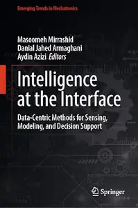

---

**Time:** 22:29:58 (Asia/Tehran)  
**Blog:** hill0  

**Title:** Intelligent Computing, Volume 1  

**Details:** English | 2026 | ISBN: 3032248035 | 912 Pages | PDF (True) | 118 MB  

**Link:** http://zavat.pw/ebooks/3032248035.html  

---

**Time:** 22:29:58 (Asia/Tehran)  
**Blog:** hill0  

**Title:** AI-Powered Smart Manufacturing  

**Details:** English | 2026 | ISBN: 3032214653 | 94 Pages | PDF EPUB (True) | 1 MB  

**Link:** http://zavat.pw/ebooks/3032214653.html  

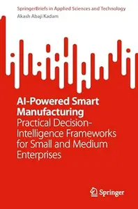

---

**Time:** 22:29:58 (Asia/Tehran)  
**Blog:** hill0  

**Title:** Community Quality-of-Life Indicators  

**Details:** English | 2026 | ISBN: 303221050X | 214 Pages | PDF EPUB (True) | 5 MB  

**Link:** http://zavat.pw/ebooks/303221050X.html  

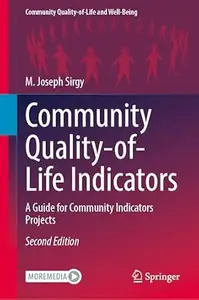

---

**Time:** 22:29:58 (Asia/Tehran)  
**Blog:** hill0  

**Title:** Complexity in Universal Evolution  

**Details:** English | 2026 | ISBN: 3032205166 | 603 Pages | PDF EPUB (True) | 45 MB  

**Link:** http://zavat.pw/ebooks/3032205166.html  

---

**Time:** 22:29:58 (Asia/Tehran)  
**Blog:** hill0  

**Title:** Artificial Intelligence for Inspired Action  

**Details:** English | 2026 | ISBN: 3032062772 | 163 Pages | PDF EPUB (True) | 5 MB  

**Link:** http://zavat.pw/ebooks/3032062772.html  

---

**Time:** 22:29:58 (Asia/Tehran)  
**Blog:** hill0  

**Title:** Simulation of Continuous Games  

**Details:** English | 2026 | ISBN: 3032159997 | 343 Pages | PDF EPUB (True) | 131 MB  

**Link:** http://zavat.pw/ebooks/3032159997.html  

---

**Time:** 22:29:58 (Asia/Tehran)  
**Blog:** hill0  

**Title:** Econometrics, Finance, and Time Series Analysis  

**Details:** English | 2026 | ISBN: 9819580447 | 132 Pages | PDF EPUB (True) | 9 MB  

**Link:** http://zavat.pw/ebooks/9819580447.html  

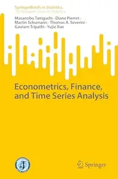

---

**Time:** 22:29:58 (Asia/Tehran)  
**Blog:** hill0  

**Title:** Computational Analysis of Human and Organisational Decision Processes for the Control of Risk Management and Cybersecurity  

**Details:** English | 2026 | ISBN: 3032238854 | 424 Pages | PDF EPUB (True) | 63 MB  

**Link:** http://zavat.pw/ebooks/3032238854.html  

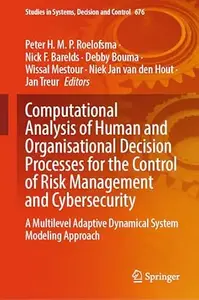

---

**Time:** 22:29:58 (Asia/Tehran)  
**Blog:** hill0  

**Title:** Novel Strategies for Critical Burn Care  

**Details:** English | 2026 | ISBN: 9819203244 | 179 Pages | PDF EPUB (True) | 122 MB  

**Link:** http://zavat.pw/ebooks/9819203244.html  

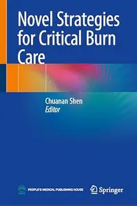

---

**Time:** 22:29:58 (Asia/Tehran)  
**Blog:** hill0  

**Title:** Analysis and Method to Increase the Productivity of Laser-based Powder Bed Fusion of Metals  

**Details:** English | 2026 | ISBN: 3032289424 | 192 Pages | PDF (True) | 36 MB  

**Link:** http://zavat.pw/ebooks/3032289424.html  

---

**Time:** 22:29:58 (Asia/Tehran)  
**Blog:** hill0  

**Title:** Differential Diagnosis and Management of Pancreatic Cystic Lesions  

**Details:** English | 2026 | ISBN: 9819206537 | 258 Pages | PDF EPUB (True) | 55 MB  

**Link:** http://zavat.pw/ebooks/9819206537.html  

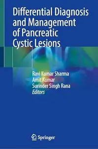

---

**Time:** 22:29:58 (Asia/Tehran)  
**Blog:** hill0  

**Title:** Why Music is Genetic  

**Details:** English | 2026 | ISBN: 3662725029 | 246 Pages | PDF EPUB (True) | 125 MB  

**Link:** http://zavat.pw/ebooks/3662725029.html  

---

**Time:** 22:29:58 (Asia/Tehran)  
**Blog:** crazy-slim  

**Title:** xBhp - June-July 2026  

**Details:** English | 200 pages | True PDF | 98.0 MB  

**Link:** http://zavat.pw/magazines/xBhpJuneJuly2026-46314.html  

---

**Time:** 22:29:58 (Asia/Tehran)  
**Blog:** crazy-slim  

**Title:** audioXpress - August 2026  

**Details:** English | 68 pages | True PDF | 14.6 MB  

**Link:** http://zavat.pw/magazines/audioXpressAugust2026-16627.html  

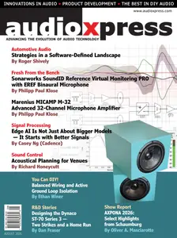

---

**Time:** 22:29:58 (Asia/Tehran)  
**Blog:** crazy-slim  

**Title:** Car Goods Magazine カーグッズマガジン - September 2026  

**Details:** 日本語 | 128 pages | True PDF | 148.1 MB  

**Link:** http://zavat.pw/magazines/CarGoodsMagazine%E3%82%AB%E3%83%BC%E3%82%B0%E3%83%83%E3%82%BA%E3%83%9E%E3%82%AC%E3%82%B8%E3%83%B3September2026-32867.html  

---

**Time:** 22:29:58 (Asia/Tehran)  
**Blog:** crazy-slim  

**Title:** Lecturas - 22 Julio 2026  

**Details:** Español | 100 pages | True PDF | 56.9 MB  

**Link:** http://zavat.pw/magazines/Lecturas22Julio2026-20944.html  

---

**Time:** 22:29:58 (Asia/Tehran)  
**Blog:** crazy-slim  

**Title:** The Australian Women's Weekly - August 2026  

**Details:** English | 196 pages | True PDF | 101.6 MB  

**Link:** http://zavat.pw/magazines/TheAustralianWomensWeeklyAugust2026-11320.html  

---

**Time:** 22:29:58 (Asia/Tehran)  
**Blog:** crazy-slim  

**Title:** Que Delícia - 6 Julho 2026  

**Details:** Portuguese | 36 pages | True PDF | 10.2 MB  

**Link:** http://zavat.pw/magazines/QueDel%C3%ADcia6Julho2026-36571.html  

---

**Time:** 22:29:58 (Asia/Tehran)  
**Blog:** crazy-slim  

**Title:** What on Earth! Magazine - July-August 2026  

**Details:** English | 68 pages | True PDF | 48.5 MB  

**Link:** http://zavat.pw/magazines/WhatonEarthMagazineJulyAugust2026-98333.html  

---

**Time:** 22:29:58 (Asia/Tehran)  
**Blog:** crazy-slim  

**Title:** Saras Salil - July 2026 I  

**Details:** हिन्दी | 32 pages | True PDF | 18.5 MB  

**Link:** http://zavat.pw/magazines/SarasSalilJuly2026I-96008.html  

---

**Time:** 22:29:58 (Asia/Tehran)  
**Blog:** crazy-slim  

**Title:** Variety - 15 July 2026  

**Details:** English | 88 pages | True PDF | 63.5 MB  

**Link:** http://zavat.pw/magazines/Variety15July2026-03312.html  

---

**Time:** 22:29:58 (Asia/Tehran)  
**Blog:** crazy-slim  

**Title:** Limelight - August 2026  

**Details:** English | 68 pages | True PDF | 103.2 MB  

**Link:** http://zavat.pw/magazines/LimelightAugust2026-02665.html  

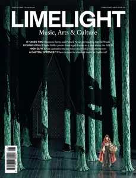

---

**Time:** 22:29:58 (Asia/Tehran)  
**Blog:** crazy-slim  

**Title:** National Geographic Kids Australia - Issue 139 2026  

**Details:** English | 52 pages | True PDF | 117.3 MB  

**Link:** http://zavat.pw/magazines/NationalGeographicKidsAustraliaIssue1392026-68419.html  

---

**Time:** 22:29:58 (Asia/Tehran)  
**Blog:** crazy-slim  

**Title:** Australian Motorcycle News - 20 July 2026  

**Details:** English | 116 pages | True PDF | 68.8 MB  

**Link:** http://zavat.pw/magazines/AustralianMotorcycleNews20July2026-69997.html  

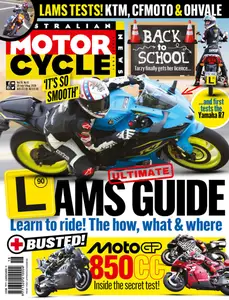

---

**Time:** 22:29:58 (Asia/Tehran)  
**Blog:** crazy-slim  

**Title:** AARP The Magazine - August-September 2026  

**Details:** English | 76 pages | True PDF | 46.7 MB  

**Link:** http://zavat.pw/magazines/AARPTheMagazineAugustSeptember2026-33762.html  

---

**Time:** 22:29:58 (Asia/Tehran)  
**Blog:** crazy-slim  

**Title:** Apple Intelligence Complete Manual - Summer 2026  

**Details:** English | 78 pages | PDF | 42.0 MB  

**Link:** http://zavat.pw/magazines/AppleIntelligenceCompleteManualSummer2026-95957.html  

---

**Time:** 22:29:58 (Asia/Tehran)  
**Blog:** crazy-slim  

**Title:** Prospect Magazine - August-September 2026  

**Details:** English | 132 pages | True PDF | 14.4 MB  

**Link:** http://zavat.pw/magazines/ProspectMagazineAugustSeptember2026-86509.html  

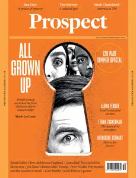

---

**Time:** 19:44:49 (Asia/Tehran)  
**Blog:** hill0  

**Title:** From Algorithms to Ailments  

**Details:** English | 2026 | ISBN: 303211022X | 234 Pages | PDF EPUB (True) | 12 MB  

**Link:** http://zavat.pw/ebooks/303211022X.html  

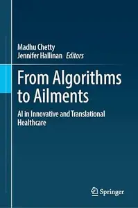

---

**Time:** 19:44:49 (Asia/Tehran)  
**Blog:** hill0  

**Title:** Sutskever's List: Foundational ideas of modern AI  

**Details:** English | 2026 | ISBN: 1633434796 | 400 Pages | EPUB | 5 MB  

**Link:** http://zavat.pw/ebooks/1633434796.html  

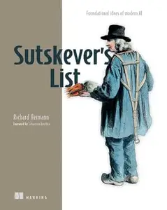

---

**Time:** 19:44:49 (Asia/Tehran)  
**Blog:** hill0  

**Title:** Aging and Lung Disease: A Clinical Guide (2nd Edition)  

**Details:** English | 2026 | ISBN: 3032298601 | 469 Pages | PDF EPUB (True) | 15 MB  

**Link:** http://zavat.pw/ebooks/3032298601.html  

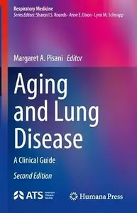

---

**Time:** 19:44:49 (Asia/Tehran)  
**Blog:** hill0  

**Title:** Pharmacotherapy in Neurobehavioral Paediatrics  

**Details:** English | 2026 | ISBN: 9819572436 | 109 Pages | PDF EPUB (True) | 5 MB  

**Link:** http://zavat.pw/ebooks/9819572436.html  

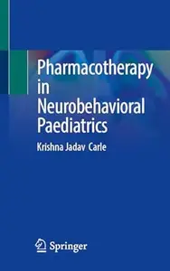

---

**Time:** 18:13:26 (Asia/Tehran)  
**Blog:** yoyoloit  

**Title:** Dynamic Fair Gain-sharing Cooperation  

**Details:** English | 2026 | ISBN: 1800619545 | 217 pages | True PDF | 5.41 MB  

**Link:** http://zavat.pw/ebooks/1800619545.html  

---

**Time:** 18:13:26 (Asia/Tehran)  
**Blog:** yoyoloit  

**Title:** Handbook On Efficiency And Productivity Analysis: Extending The Frontiers  

**Details:** English | 2026 | ISBN: 1800619049 | 359 pages | True PDF | 14.15 MB  

**Link:** http://zavat.pw/ebooks/1800619049.html  

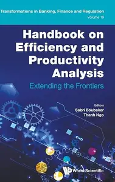

---

**Time:** 18:13:26 (Asia/Tehran)  
**Blog:** yoyoloit  

**Title:** Igniting Creativity With Reading Intelligence: The Method That Integrates Art And Technology  

**Details:** English | 2026 | ISBN: 9819828430 | 333 pages | True PDF | 9.46 MB  

**Link:** http://zavat.pw/ebooks/9819828430.html  

---

**Time:** 18:13:26 (Asia/Tehran)  
**Blog:** yoyoloit  

**Title:** Reservoir Computing: Machine Learning Meets Nonlinear Dynamics  

**Details:** English | 2026 | ISBN: 9819830222 | 657 pages | True PDF | 115.18 MB  

**Link:** http://zavat.pw/ebooks/9819830222.html  

---

**Time:** 18:13:26 (Asia/Tehran)  
**Blog:** AvaxGenius  

**Title:** Springer Handbook of Nanotechnology, 4th Edition (Repost)  

**Details:** English | EPUB | 2017 | 1704 Pages | ISBN : 3662543559 | 110.55 MB  

**Link:** http://zavat.pw/ebooks/3662524355955.html  

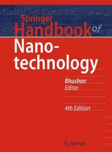

---

**Time:** 18:13:26 (Asia/Tehran)  
**Blog:** AvaxGenius  

**Title:** Medical Image Computing and Computer Assisted Intervention – MICCAI 2021 (Repost)  

**Details:** English | EPUB | 2021 | 781 Pages | ISBN : 3030871924 | 133 MB  

**Link:** http://zavat.pw/ebooks/30530851924.html  

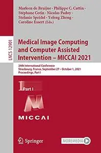

---

**Time:** 18:13:26 (Asia/Tehran)  
**Blog:** AvaxGenius  

**Title:** Water-Related Urbanization and Locality (Repost)  

**Details:** English | EPUB | 2020 | 377 Pages | ISBN : 981153506X | 262.4 MB  

**Link:** http://zavat.pw/ebooks/98115235056X.html  

---

**Time:** 18:13:26 (Asia/Tehran)  
**Blog:** AvaxGenius  

**Title:** Endovascular Surgery of Cerebral Aneurysms (Repost)  

**Details:** English | EPUB | 2022 | 307 Pages | ISBN : 981167101X | 122.3 MB  

**Link:** http://zavat.pw/ebooks/98151657101X.html  

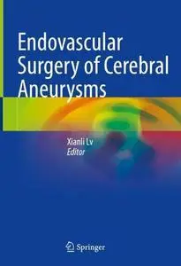

---

**Time:** 18:13:26 (Asia/Tehran)  
**Blog:** AvaxGenius  

**Title:** Unpublished Manuscripts: from 1951 to 2007 (Repost)  

**Details:** English | PDF | 2018 | 368 Pages | ISBN : 3319698494 | 166.15 MB  

**Link:** http://zavat.pw/ebooks/331954698494.html  

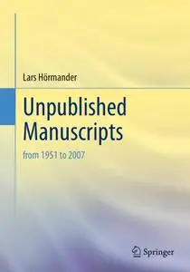

---

**Time:** 18:13:26 (Asia/Tehran)  
**Blog:** AvaxGenius  

**Title:** The Sutures of the Skull: Anatomy, Embryology, Imaging, and Surgery (Repost)  

**Details:** English | EPUB | 2021 | 444 Pages | ISBN : 3030723372 | 103.4 MB  

**Link:** http://zavat.pw/ebooks/303307233725.html  

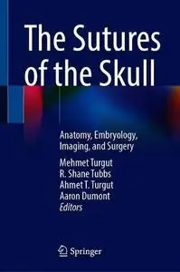

---

**Time:** 18:13:26 (Asia/Tehran)  
**Blog:** AvaxGenius  

**Title:** Computer Vision – ECCV 2020 (Repost)  

**Details:** English | PDF | 2020 | 830 Pages | ISBN : 3030585794 | 197.5 MB  

**Link:** http://zavat.pw/ebooks/3503058579452.html  

---

**Time:** 18:13:26 (Asia/Tehran)  
**Blog:** AvaxGenius  

**Title:** Sustainable Communication Networks and Application: Proceedings of ICSCN 2020 (Repost)  

**Details:** English | EPUB | 2021 | 681 Pages | ISBN : 9811586764 | 114.6 MB  

**Link:** http://zavat.pw/ebooks/9811158675564.html  

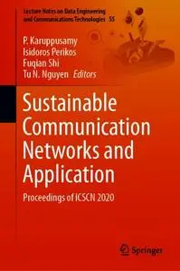

---

**Time:** 18:13:26 (Asia/Tehran)  
**Blog:** AvaxGenius  

**Title:** Proceedings of China SAE Congress 2022: Selected Papers (Repost)  

**Details:** English | PDF | 2023 | 1137 Pages | ISBN : 9819913640 | 185.7 MB  

**Link:** http://zavat.pw/ebooks/9819951355640.html  

---

**Time:** 18:13:26 (Asia/Tehran)  
**Blog:** AvaxGenius  

**Title:** ETHICS: Endorse Technologies for Heritage Innovation: Cross-disciplinary Strategies (Repost)  

**Details:** English | EPUB (True) | 2024 | 356 Pages | ISBN : 3031501209 | 96.7 MB  

**Link:** http://zavat.pw/ebooks/303135015209.html  

---

**Time:** 18:13:26 (Asia/Tehran)  
**Blog:** AvaxGenius  

**Title:** Geology and Tectonics of Northwestern South America: The Pacific-Caribbean-Andean Junction (Repost)  

**Details:** English | EPUB | 2019 | 1010 Pages | ISBN : 3319761315 | 362.9 MB  

**Link:** http://zavat.pw/ebooks/3319376551315.html  

---

**Time:** 18:13:26 (Asia/Tehran)  
**Blog:** AvaxGenius  

**Title:** Converging Clinical and Engineering Research on Neurorehabilitation III (Repost)  

**Details:** English | PDF | 2018 (2019 Edition) | 1170 Pages | ISBN : 303001844X | 100.08 MB  

**Link:** http://zavat.pw/ebooks/33030018454X.html  

---

**Time:** 18:13:26 (Asia/Tehran)  
**Blog:** AvaxGenius  

**Title:** Large Igneous Provinces: A Driver of Global Environmental and Biotic Changes (Repost)  

**Details:** English | PDF | 2021 | 514 Pages | ISBN : 1119507456 | 105.96 MB  

**Link:** http://zavat.pw/ebooks/111950574565.html  

---

**Time:** 18:13:26 (Asia/Tehran)  
**Blog:** AvaxGenius  

**Title:** Beteiligungsmanagement und Bewertung für Praktiker (Repost)  

**Details:** Deutsch | EPUB | 2020 | 811 Pages | ISBN : 3658307919 | 115.6 MB  

**Link:** http://zavat.pw/ebooks/3633583079159.html  

---

**Time:** 18:13:26 (Asia/Tehran)  
**Blog:** AvaxGenius  

**Title:** Computational Science and Its Applications – ICCSA 2020 (Repost)  

**Details:** English | PDF | 2020 | 1062 Pages | ISBN : 3030588076 | 172.4 MB  

**Link:** http://zavat.pw/ebooks/3053045882076.html  

---

**Time:** 18:13:26 (Asia/Tehran)  
**Blog:** crazy-slim  

**Title:** Cape Times - 15 July 2026  

**Details:** English | 16 pages | True PDF | 15.3 MB  

**Link:** http://zavat.pw/newspapers/CapeTimes15July2026-01696.html  

---

**Time:** 18:13:26 (Asia/Tehran)  
**Blog:** crazy-slim  

**Title:** Discovery Publicações - 15 Julho 2026  

**Details:** Portuguese | 82 pages | True PDF | 159.5 MB  

**Link:** http://zavat.pw/magazines/DiscoveryPublica%C3%A7%C3%B5es15Julho2026-42519.html  

---

**Time:** 18:13:26 (Asia/Tehran)  
**Blog:** crazy-slim  

**Title:** アニメージュ - August 2026  

**Details:** 日本語 | 190 pages | True PDF | 90.2 MB  

**Link:** http://zavat.pw/magazines/%E3%82%A2%E3%83%8B%E3%83%A1%E3%83%BC%E3%82%B8%E3%83%A5August2026-67025.html  

---

**Time:** 18:13:26 (Asia/Tehran)  
**Blog:** crazy-slim  

**Title:** ¡Hola! España - 22 Julio 2026  

**Details:** Español | 108 pages | True PDF | 81.5 MB  

**Link:** http://zavat.pw/magazines/HolaEspa%C3%B1a22Julio2026-19452.html  

---

**Time:** 18:13:26 (Asia/Tehran)  
**Blog:** crazy-slim  

**Title:** Mais Sampa - Julho 2026  

**Details:** Portuguese | 52 pages | True PDF | 51.1 MB  

**Link:** http://zavat.pw/magazines/MaisSampaJulho2026-47843.html  

---

**Time:** 18:13:26 (Asia/Tehran)  
**Blog:** crazy-slim  

**Title:** Science & Vie Junior N.443 - Août 2026  

**Details:** Français | 84 pages | True PDF | 106.5 MB  

**Link:** http://zavat.pw/magazines/ScienceVieJuniorN443Ao%C3%BBt2026-68116.html  

---

**Time:** 18:13:26 (Asia/Tehran)  
**Blog:** crazy-slim  

**Title:** Science & Vie Découvertes N.332 - Août 2026  

**Details:** Français | 76 pages | True PDF | 85.1 MB  

**Link:** http://zavat.pw/magazines/ScienceVieD%C3%A9couvertesN332Ao%C3%BBt2026-61650.html  

---

**Time:** 18:13:26 (Asia/Tehran)  
**Blog:** crazy-slim  

**Title:** Successful Farming - July 2026  

**Details:** English | 86 pages | True PDF | 109.5 MB  

**Link:** http://zavat.pw/magazines/SuccessfulFarmingJuly2026-91009.html  

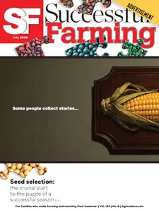

---

**Time:** 18:13:26 (Asia/Tehran)  
**Blog:** crazy-slim  

**Title:** T3 France N.105 - Juillet-Août 2026  

**Details:** Français | 116 pages | True PDF | 50.4 MB  

**Link:** http://zavat.pw/magazines/T3FranceN105JuilletAo%C3%BBt2026-77470.html  

---

**Time:** 18:13:26 (Asia/Tehran)  
**Blog:** crazy-slim  

**Title:** Tatler Malaysia - July 2026  

**Details:** English | 192 pages | True PDF | 88.7 MB  

**Link:** http://zavat.pw/magazines/TatlerMalaysiaJuly2026-08890.html  

---

**Time:** 18:13:26 (Asia/Tehran)  
**Blog:** crazy-slim  

**Title:** Country Life UK - July 15, 2026  

**Details:** English | 140 pages | True PDF | 88.0 MB  

**Link:** http://zavat.pw/magazines/CountryLifeUKJuly152026-88545.html  

---

**Time:** 18:13:26 (Asia/Tehran)  
**Blog:** crazy-slim  

**Title:** Runner's World South Africa - Jul-August 2026  

**Details:** English | 100 pages | True PDF | 40.1 MB  

**Link:** http://zavat.pw/magazines/RunnersWorldSouthAfricaJulAugust2026-10862.html  

---

**Time:** 18:13:26 (Asia/Tehran)  
**Blog:** crazy-slim  

**Title:** SFX - August 2026  

**Details:** English | 100 pages | True PDF | 68.3 MB  

**Link:** http://zavat.pw/magazines/SFXAugust2026-73332.html  

---

**Time:** 18:13:26 (Asia/Tehran)  
**Blog:** crazy-slim  

**Title:** Old Cars Weekly - August 15, 2026  

**Details:** English | 64 pages | True PDF | 30.0 MB  

**Link:** http://zavat.pw/magazines/OldCarsWeeklyAugust152026-32957.html  

---

**Time:** 18:13:26 (Asia/Tehran)  
**Blog:** crazy-slim  

**Title:** Boudoir Inspiration - July 2026 Artistic Nude Issue  

**Details:** English | 58 pages | True PDF | 38.3 MB  

**Link:** http://zavat.pw/magazines/BoudoirInspirationJuly2026ArtisticNudeIssue-96451.html  

---

**Time:** 16:19:35 (Asia/Tehran)  
**Blog:** IrGens  

**Title:** It Will Come Back to You: Collected Stories  

**Details:** English | July 14, 2026 | ISBN: 9798217179152, 9798217179176 | True EPUB | 224 pages | 0.6 MB  

**Link:** http://zavat.pw/ebooks/9798217179152.html  

---

**Time:** 16:19:35 (Asia/Tehran)  
**Blog:** IrGens  

**Title:** Bedlam: A Novel  

**Details:** English | July 14, 2026 | ISBN: 1836742045, 9781836742067 | True EPUB | 240 pages | 0.8 MB  

**Link:** http://zavat.pw/ebooks/1836742045.html  

---

**Time:** 16:19:35 (Asia/Tehran)  
**Blog:** IrGens  

**Title:** The Character of a Trimmer and Other Writings (Oxford World's Classics)  

**Details:** English | September 10, 2025 | ISBN: 0198879520, 9780198879541 | True EPUB | 288 pages | 0.6 MB  

**Link:** http://zavat.pw/ebooks/0198879520.html  

---

**Time:** 16:19:35 (Asia/Tehran)  
**Blog:** AvaxGenius  

**Title:** Malunions: Diagnosis, Evaluation and Management (Repost)  

**Details:** English | EPUB | 2021 | 418 Pages | ISBN : 1071611224 | 161.1 MB  

**Link:** http://zavat.pw/ebooks/310716112424.html  

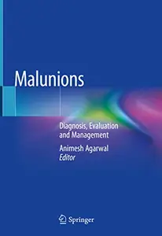

---

**Time:** 16:19:35 (Asia/Tehran)  
**Blog:** AvaxGenius  

**Title:** Experimental Robotics: The 17th International Symposium (Repost)  

**Details:** English | PDF | 2021 | 628 Pages | ISBN : 3030711501 | 142.5 MB  

**Link:** http://zavat.pw/ebooks/35030721501.html  

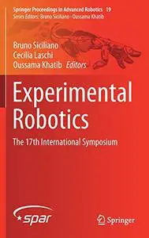

---

**Time:** 16:19:35 (Asia/Tehran)  
**Blog:** AvaxGenius  

**Title:** Neurovascular Surgery: Surgical Approaches for Neurovascular Diseases (Repost)  

**Details:** English | EPUB | 2018 (2019 Edition) | 285 Pages | ISBN : 9811089493 | 166.4 MB  

**Link:** http://zavat.pw/ebooks/9811208954933.html  

---

**Time:** 16:19:35 (Asia/Tehran)  
**Blog:** AvaxGenius  

**Title:** Advanced Intelligent Systems for Sustainable Development (AI2SD’2020): Volume 1 (Repost)  

**Details:** English | EPUB | 2022 | 1173 Pages | ISBN : 3030906329 | 170.2 MB  

**Link:** http://zavat.pw/ebooks/304309016329.html  

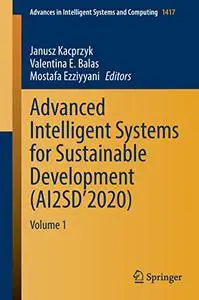

---

**Time:** 16:19:35 (Asia/Tehran)  
**Blog:** AvaxGenius  

**Title:** AUC 2019: Proceedings of the 15th International Asian Urbanization Conference, Vietnam (Repost)  

**Details:** English | EPUB | 2021 | 557 Pages | ISBN : 9811556075 | 107.1 MB  

**Link:** http://zavat.pw/ebooks/198115560754.html  

---

**Time:** 16:19:35 (Asia/Tehran)  
**Blog:** AvaxGenius  

**Title:** Digital Technologies and Applications: Proceedings of ICDTA'23, Fez, Morocco, Volume 1 (Repost)  

**Details:** English | EPUB (True) | 2023 | 1038 Pages | ISBN : 303129856X | 159 MB  

**Link:** http://zavat.pw/ebooks/30131298564X.html  

---

**Time:** 16:19:35 (Asia/Tehran)  
**Blog:** AvaxGenius  

**Title:** The Population Ecology of White-Headed Langur (Repost)  

**Details:** English | EPUB | 2021 | 241 Pages | ISBN : 9813341173 | 176.87 MB  

**Link:** http://zavat.pw/ebooks/198133414173.html  

---

**Time:** 16:19:35 (Asia/Tehran)  
**Blog:** AvaxGenius  

**Title:** Biomineralization Mechanism of the Pearl Oyster, Pinctada fucata (Repost)  

**Details:** English | EPUB | 2018 (2019 Edition) | 750 Pages | ISBN : 9811314586 | 149.9 MB  

**Link:** http://zavat.pw/ebooks/981613145286.html  

---

**Time:** 16:19:35 (Asia/Tehran)  
**Blog:** AvaxGenius  

**Title:** Atlas of Anatomic Hepatic Resection for Hepatocellular Carcinoma: Glissonean Pedicle Approach (Repost)  

**Details:** English | EPUB | 2018 (2019 Edition) | 339 Pages | ISBN : 9811306672 | 174.2 MB  

**Link:** http://zavat.pw/ebooks/981113064672.html  

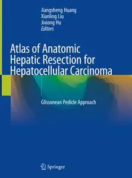

---

**Time:** 16:19:35 (Asia/Tehran)  
**Blog:** AvaxGenius  

**Title:** Big Data and Security (Repost)  

**Details:** English | EPUB | 2021 | 665 Pages | ISBN : 9811631492 | 116.4 MB  

**Link:** http://zavat.pw/ebooks/981116314492.html  

---

**Time:** 16:19:35 (Asia/Tehran)  
**Blog:** AvaxGenius  

**Title:** Vitreoretinal Surgery, Third Edition (Repost)  

**Details:** English | EPUB | 2021 | 659 Pages | ISBN : 3030687686 | 196 MB  

**Link:** http://zavat.pw/ebooks/303106876846.html  

---

**Time:** 16:19:35 (Asia/Tehran)  
**Blog:** AvaxGenius  

**Title:** Proceedings of International Conference on Communication and Computational Technologies (Repost)  

**Details:** English | EPUB (True) | 2023 | 992 Pages | ISBN : 9819934842 | 107.5 MB  

**Link:** http://zavat.pw/ebooks/198199348442.html  

---

**Time:** 16:19:35 (Asia/Tehran)  
**Blog:** AvaxGenius  

**Title:** Rural Technology Development and Delivery: RuTAG and Its Synergy with Other Initiatives (Repost)  

**Details:** English | EPUB | 2019 | 357 Pages | ISBN : 9811364346 | 168.8 MB  

**Link:** http://zavat.pw/ebooks/981114364346.html  

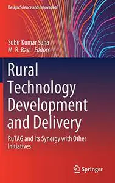

---

**Time:** 16:19:35 (Asia/Tehran)  
**Blog:** AvaxGenius  

**Title:** Exergy for A Better Environment and Improved Sustainability 2: Applications (Repost)  

**Details:** English | EPUB | 2018 | 1173 Pages | ISBN : 3319625748 | 197 MB  

**Link:** http://zavat.pw/ebooks/331496257248.html  

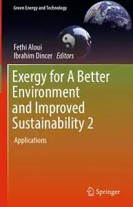

---

**Time:** 14:37:51 (Asia/Tehran)  
**Blog:** yoyoloit  

**Title:** Consciousness, Qualia And Robot Minds  

**Details:** English | 2026 | ISBN: 9819827825 | 201 pages | True PDF | 10.49 MB  

**Link:** http://zavat.pw/ebooks/9819827825.html  

---

**Time:** 14:37:51 (Asia/Tehran)  
**Blog:** yoyoloit  

**Title:** Solid Mechanics with Python: Non-Cartesian Coordinates  

**Details:** English | 2026 | ISBN: 9819827019 | 416 pages | True PDF | 34.54 MB  

**Link:** http://zavat.pw/ebooks/9819827019.html  

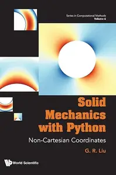

---

**Time:** 14:37:51 (Asia/Tehran)  
**Blog:** yoyoloit  

**Title:** Intelligence via Compression of Information: The SP Theory of Intelligence and its realisation in the SP Computer Model  

**Details:** English | 2026 | ISBN: 9819824834 | 276 pages | True PDF | 10.37 MB  

**Link:** http://zavat.pw/ebooks/9819824834.html  

---

**Time:** 14:37:51 (Asia/Tehran)  
**Blog:** yoyoloit  

**Title:** Proteinoid Proto-Neural Networks  

**Details:** English | 2026 | ISBN: 981982690X | 680 pages | True PDF | 166.34 MB  

**Link:** http://zavat.pw/ebooks/981982690X.html  

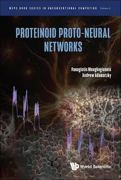

---

**Time:** 14:37:51 (Asia/Tehran)  
**Blog:** yoyoloit  

**Title:** Impulsive Higher-order Nonlinear And Functional Problems: Periodic And Semi-linear Impulsive Equations And Coupled Systems  

**Details:** English | 2026 | ISBN: 9819823579 | 311 pages | True PDF | 9.32 MB  

**Link:** http://zavat.pw/ebooks/9819823579.html  

---

**Time:** 14:37:51 (Asia/Tehran)  
**Blog:** yoyoloit  

**Title:** Deep Learning Methods for Image Object Detection and Recognition  

**Details:** English | 2026 | ISBN: 9819833345 | 258 pages | True PDF | 62.55 MB  

**Link:** http://zavat.pw/ebooks/9819833345.html  

---

**Time:** 14:37:51 (Asia/Tehran)  
**Blog:** yoyoloit  

**Title:** Regional Maritime Security Outlook: The Evolving Maritime Order  

**Details:** English | 2026 | ISBN: 9819834708 | 163 pages | True PDF | 6.95 MB  

**Link:** http://zavat.pw/ebooks/9819834708.html  

---

**Time:** 14:37:51 (Asia/Tehran)  
**Blog:** yoyoloit  

**Title:** Understanding and Testing the Foundations of International Trade with Micro Data  

**Details:** English | 2026 | ISBN: 9819829119 | 426 pages | True PDF | 14.73 MB  

**Link:** http://zavat.pw/ebooks/9819829119.html  

---

**Time:** 14:37:51 (Asia/Tehran)  
**Blog:** yoyoloit  

**Title:** Workless Society: Expansion Of The Leisure Class  

**Details:** English | 2026 | ISBN: 9819827744 | 159 pages | True PDF EPUB | 10.48 MB  

**Link:** http://zavat.pw/ebooks/9819827744.html  

---

**Time:** 14:37:51 (Asia/Tehran)  
**Blog:** IrGens  

**Title:** Why Evolution Is True  

**Details:** English | January 26, 2010 | ISBN: 0143116649, ‎ 9781440685859 | True EPUB | 282 pages | 1.9 MB  

**Link:** http://zavat.pw/ebooks/0143116649-epub.html  

---

**Time:** 14:37:51 (Asia/Tehran)  
**Blog:** IrGens  

**Title:** Catch the Devil: A True Story of Murder, Deception, and Injustice on the Gulf Coast  

**Details:** English | July 14, 2026 | ISBN: 0593230868, 9780593230879 | True EPUB | 304 pages | 12.5 MB  

**Link:** http://zavat.pw/ebooks/0593230868.html  

---

**Time:** 14:37:51 (Asia/Tehran)  
**Blog:** IrGens  

**Title:** Finding Treblinka: Forensic and Archaeological Discoveries  

**Details:** English | July 15, 2026 | ISBN: 1501788493, 1501786482, 9781501786495 | True EPUB | 480 pages | 56.3 MB  

**Link:** http://zavat.pw/ebooks/1501788493.html  

---

**Time:** 14:37:51 (Asia/Tehran)  
**Blog:** IrGens  

**Title:** We Were Not Looking: Reconstructing the Patriarchal World Through Ancient Near Eastern Context  

**Details:** English | May 15, 2026 | ISBN: 9798385279050, 9798385279043, 9798385279067 | True EPUB | 134 pages | 3.8 MB  

**Link:** http://zavat.pw/ebooks/9798385279050.html  

---

**Time:** 14:37:51 (Asia/Tehran)  
**Blog:** IrGens  

**Title:** When Everyone Reads: Kwame Alexander’s Guide to Inspiring a Lifelong Love of Books  

**Details:** English | July 14, 2026 | ISBN: 9798330916771 | True EPUB | 184 pages | 1.1 MB  

**Link:** http://zavat.pw/ebooks/9798330916771.html  

---

**Time:** 14:37:51 (Asia/Tehran)  
**Blog:** IrGens  

**Title:** The Practice of Not Reacting: Zen Wisdom for a Happy Life  

**Details:** English | July 14, 2026 | ISBN: 9798217182381, 9798217182398 | True EPUB | 192 pages | 1.4 MB  

**Link:** http://zavat.pw/ebooks/9798217182381.html  

---

**Time:** 14:37:51 (Asia/Tehran)  
**Blog:** IrGens  

**Title:** Like Silicon From Clay: What Ancient Jewish Wisdom Can Teach Us About AI  

**Details:** English | March 4, 2025 | ISBN: 0844750840, 9780844750866 | True EPUB | 328 pages | 11.5 MB  

**Link:** http://zavat.pw/ebooks/0844750840.html  

---

**Time:** 12:57:12 (Asia/Tehran)  
**Blog:** yoyoloit  

**Title:** Foundations of Physical Chemistry  

**Details:** English | 2027 | ISBN: 1041082339 | 283 pages | True PDF EPUB | 16.86 MB  

**Link:** http://zavat.pw/ebooks/1041082339.html  

---

**Time:** 12:57:12 (Asia/Tehran)  
**Blog:** hill0  

**Title:** Embedded Visual System and Its Applications on Robots  

**Details:** English | 2018 | ISBN: 1608053105 | 141 Pages | PDF (True) | 12 MB  

**Link:** http://zavat.pw/ebooks/1608053105.html  

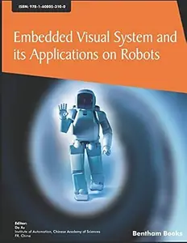

---

**Time:** 12:57:12 (Asia/Tehran)  
**Blog:** hill0  

**Title:** Extremal Graph and Hypergraph Theory  

**Details:** English | 2026 | ISBN: 1009585843 | 440 Pages | PDF | 37 MB  

**Link:** http://zavat.pw/ebooks/1009585843.html  

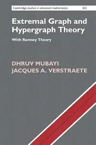

---

**Time:** 12:57:12 (Asia/Tehran)  
**Blog:** hill0  

**Title:** Social Work in the 21st Century  

**Details:** English | 2026 | ISBN: 3032273358 | 273 Pages | PDF EPUB (True) | 6 MB  

**Link:** http://zavat.pw/ebooks/3032273358.html  

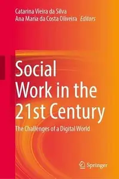

---

**Time:** 12:57:12 (Asia/Tehran)  
**Blog:** hill0  

**Title:** Building Agent-Powered Applications  

**Details:** English | 2026 | ISBN: 9781807605179 | 389 Pages | EPUB (True) | 23 MB  

**Link:** http://zavat.pw/ebooks/9781807605179.html  

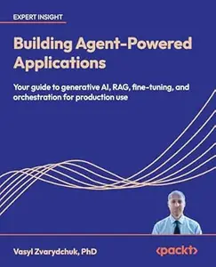

---

**Time:** 12:57:12 (Asia/Tehran)  
**Blog:** hill0  

**Title:** Bioresource Waste to Carbon Nanomaterial  

**Details:** English | 2026 | ISBN: 9819224047 | 460 Pages | PDF EPUB (True) | 37 MB  

**Link:** http://zavat.pw/ebooks/9819224047.html  

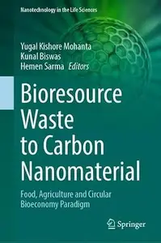

---

**Time:** 12:57:12 (Asia/Tehran)  
**Blog:** hill0  

**Title:** MarTech, AI, & Automation  

**Details:** English | 2026 | ISBN: 3658511656 | 232 Pages | PDF EPUB (True) | 24 MB  

**Link:** http://zavat.pw/ebooks/3658511656.html  

---

**Time:** 12:57:12 (Asia/Tehran)  
**Blog:** hill0  

**Title:** Green Energy Driven Integrated Smart Grid and Wireless Networks  

**Details:** English | 2026 | ISBN: 3032205085 | 155 Pages | PDF EPUB (True) | 15 MB  

**Link:** http://zavat.pw/ebooks/3032205085.html  

---

**Time:** 12:57:12 (Asia/Tehran)  
**Blog:** hill0  

**Title:** Environmental Toxicology  

**Details:** English | 2026 | ISBN: 3032286182 | 412 Pages | PDF EPUB (True) | 34 MB  

**Link:** http://zavat.pw/ebooks/3032286182.html  

---

**Time:** 12:57:12 (Asia/Tehran)  
**Blog:** hill0  

**Title:** Reproductive Healthcare for the Medically Complex Adolescent and Young Adult  

**Details:** English | 2026 | ISBN: 3032198860 | 292 Pages | PDF EPUB (True) | 6 MB  

**Link:** http://zavat.pw/ebooks/3032198860.html  

---

**Time:** 12:57:12 (Asia/Tehran)  
**Blog:** hill0  

**Title:** Governing Public Information in the Age of AI  

**Details:** English | 2026 | ISBN: 303220769X | 346 Pages | PDF EPUB (True) | 32 MB  

**Link:** http://zavat.pw/ebooks/303220769X.html  

---

**Time:** 12:57:12 (Asia/Tehran)  
**Blog:** crazy-slim  

**Title:** The Irish Echo - 15 July 2026  

**Details:** English | 28 pages | True PDF | 61.5 MB  

**Link:** http://zavat.pw/newspapers/TheIrishEcho15July2026-98966.html  

---

**Time:** 12:57:12 (Asia/Tehran)  
**Blog:** crazy-slim  

**Title:** The Baltimore Sun - 15 July 2026  

**Details:** English | 46 pages | True PDF | 42.3 MB  

**Link:** http://zavat.pw/newspapers/TheBaltimoreSun15July2026-77431.html  

---

**Time:** 12:57:12 (Asia/Tehran)  
**Blog:** crazy-slim  

**Title:** The Baltimore Sun The Aegis - 15 July 2026  

**Details:** English | 24 pages | True PDF | 22.7 MB  

**Link:** http://zavat.pw/newspapers/TheBaltimoreSunTheAegis15July2026-17411.html  

---

**Time:** 12:57:12 (Asia/Tehran)  
**Blog:** crazy-slim  

**Title:** The Baltimore Sun Carroll County Times - 15 July 2026  

**Details:** English | 28 pages | True PDF | 24.2 MB  

**Link:** http://zavat.pw/newspapers/TheBaltimoreSunCarrollCountyTimes15July2026-17990.html  

---

**Time:** 12:57:12 (Asia/Tehran)  
**Blog:** crazy-slim  

**Title:** The Boston Globe - 15 July 2026  

**Details:** English | 36 pages | True PDF | 7.5 MB  

**Link:** http://zavat.pw/newspapers/TheBostonGlobe15July2026-57233.html  

---

**Time:** 12:57:12 (Asia/Tehran)  
**Blog:** crazy-slim  

**Title:** The Baltimore Sun Towson Times - 15 July 2026  

**Details:** English | 12 pages | True PDF | 6.2 MB  

**Link:** http://zavat.pw/newspapers/TheBaltimoreSunTowsonTimes15July2026-14483.html  

---

**Time:** 12:57:12 (Asia/Tehran)  
**Blog:** crazy-slim  

**Title:** phantastisch! - 15 Juli 2026  

**Details:** Deutsch | 80 pages | True PDF | 30.8 MB  

**Link:** http://zavat.pw/magazines/phantastisch15Juli2026-94569.html  

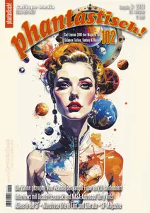

---

**Time:** 12:57:12 (Asia/Tehran)  
**Blog:** crazy-slim  

**Title:** marina.ch Deutsche Ausgabe - Juli-August 2026  

**Details:** Deutsch | 92 pages | True PDF | 70.1 MB  

**Link:** http://zavat.pw/magazines/marinachDeutscheAusgabeJuliAugust2026-92419.html  

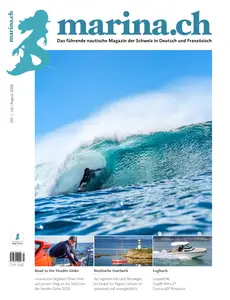

---

**Time:** 12:57:12 (Asia/Tehran)  
**Blog:** crazy-slim  

**Title:** Men's Health Guide - 15 Juli 2026  

**Details:** Deutsch | 100 pages | True PDF | 44.2 MB  

**Link:** http://zavat.pw/magazines/MensHealthGuide15Juli2026-35236.html  

---

**Time:** 12:57:12 (Asia/Tehran)  
**Blog:** crazy-slim  

**Title:** Die Politische Meinung - 15 Juli 2026  

**Details:** Deutsch | 132 pages | True PDF | 34.6 MB  

**Link:** http://zavat.pw/magazines/DiePolitischeMeinung15Juli2026-76081.html  

---

**Time:** 12:57:12 (Asia/Tehran)  
**Blog:** crazy-slim  

**Title:** fizzz - Juli-August 2026  

**Details:** Deutsch | 68 pages | True PDF | 30.4 MB  

**Link:** http://zavat.pw/magazines/fizzzJuliAugust2026-61253.html  

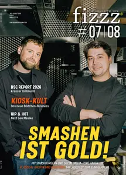

---

**Time:** 12:57:12 (Asia/Tehran)  
**Blog:** crazy-slim  

**Title:** France-Antilles Guadeloupe - 15 Juillet 2026  

**Details:** Français | 40 pages | PDF | 45.3 MB  

**Link:** http://zavat.pw/newspapers/FranceAntillesGuadeloupe15Juillet2026-49714.html  

---

**Time:** 12:57:12 (Asia/Tehran)  
**Blog:** crazy-slim  

**Title:** The Washington Post - July 15, 2026  

**Details:** English | 50 pages | True PDF | 22.0 MB  

**Link:** http://zavat.pw/newspapers/TheWashingtonPostJuly152026-42499.html  

---

**Time:** 12:57:12 (Asia/Tehran)  
**Blog:** crazy-slim  

**Title:** Virginia Gazette - 15 July 2026  

**Details:** English | 22 pages | True PDF | 21.9 MB  

**Link:** http://zavat.pw/newspapers/VirginiaGazette15July2026-80616.html  

---

**Time:** 12:57:12 (Asia/Tehran)  
**Blog:** crazy-slim  

**Title:** The Dallas Morning News - July 15, 2026  

**Details:** English | 33 pages | True PDF | 42.4 MB  

**Link:** http://zavat.pw/newspapers/TheDallasMorningNewsJuly152026-07061.html  

---

**Time:** 10:39:26 (Asia/Tehran)  
**Blog:** hill0  

**Title:** Metabolomics and Precision Medicine  

**Details:** English | 2026 | ISBN: 9819595665 | 317 Pages | PDF EPUB (True) | 53 MB  

**Link:** http://zavat.pw/ebooks/9819595665.html  

---

**Time:** 10:39:26 (Asia/Tehran)  
**Blog:** hill0  

**Title:** Minimally Invasive Surgery Trauma  

**Details:** English | 2026 | ISBN: 303228970X | 488 Pages | PDF EPUB (True) | 48 MB  

**Link:** http://zavat.pw/ebooks/303228970X.html  

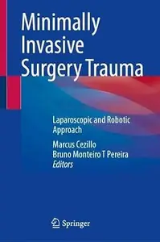

---

**Time:** 10:39:26 (Asia/Tehran)  
**Blog:** hill0  

**Title:** Sustainable AI Techniques for Real-Time Risk Monitoring  

**Details:** English | 2026 | ISBN: 3032286719 | 348 Pages | PDF EPUB (True) | 37 MB  

**Link:** http://zavat.pw/ebooks/3032286719.html  

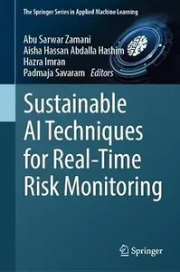

---

**Time:** 10:39:26 (Asia/Tehran)  
**Blog:** hill0  

**Title:** SFPE Handbook of Fire Protection Engineering (6th Edition)  

**Details:** English | 2026 | ISBN: 3031592115 | 3435 Pages | PDF (True) | 229 MB  

**Link:** http://zavat.pw/ebooks/3031592115.html  

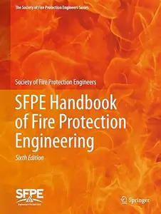

---

**Time:** 10:39:26 (Asia/Tehran)  
**Blog:** hill0  

**Title:** Le Temps - 15 Juillet 2026  

**Details:** Français | 20 pages | True PDF | 10 MB  

**Link:** http://zavat.pw/newspapers/le-temps-20260715.html  

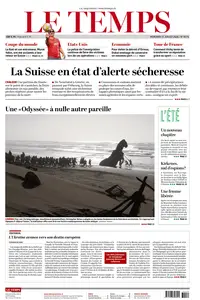

---

**Time:** 10:39:26 (Asia/Tehran)  
**Blog:** hill0  

**Title:** Frankfurter Allgemeine Zeitung - 15 Juli 2026  

**Details:** Deutsch | 43 pages | True PDF | 12 MB  

**Link:** http://zavat.pw/newspapers/FAZ-15-07-26.html  

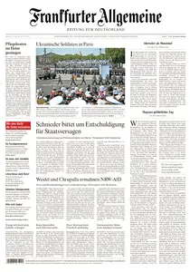

---

**Time:** 10:39:26 (Asia/Tehran)  
**Blog:** hill0  

**Title:** Süddeutsche Zeitung - 15 Juli 2026  

**Details:** Deutsch | 24 pages | True PDF | 8 MB  

**Link:** http://zavat.pw/newspapers/SZ-150726.html  

---

**Time:** 10:39:26 (Asia/Tehran)  
**Blog:** hill0  

**Title:** The New York Times - July 14, 2026  

**Details:** English | 50 pages | True PDF | 22 MB  

**Link:** http://zavat.pw/newspapers/NYT-140726.html  

---

**Time:** 10:39:26 (Asia/Tehran)  
**Blog:** hill0  

**Title:** Mastering Large Language Models  

**Details:** English | 2026 | ASIN: B0GRZBGVCP | 613 Pages | PDF EPUB (True) | 78 MB  

**Link:** http://zavat.pw/ebooks/B0GRZBGVCPt.html  

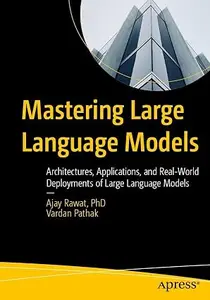

---

**Time:** 10:39:26 (Asia/Tehran)  
**Blog:** crazy-slim  

**Title:** Viel Spass - 15 Juli 2026  

**Details:** Deutsch | 64 pages | PDF | 66.8 MB  

**Link:** http://zavat.pw/magazines/VielSpass15Juli2026-96653.html  

---

**Time:** 10:39:26 (Asia/Tehran)  
**Blog:** crazy-slim  

**Title:** Sport Bild - 15 Juli 2026  

**Details:** Deutsch | 84 pages | True PDF | 61.2 MB  

**Link:** http://zavat.pw/magazines/SportBild15Juli2026-83826.html  

---

**Time:** 10:39:26 (Asia/Tehran)  
**Blog:** crazy-slim  

**Title:** Woche der Frau - 15 Juli 2026  

**Details:** Deutsch | 72 pages | PDF | 77.4 MB  

**Link:** http://zavat.pw/magazines/WochederFrau15Juli2026-98442.html  

---

**Time:** 10:39:26 (Asia/Tehran)  
**Blog:** crazy-slim  

**Title:** Woche Heute - 15 Juli 2026  

**Details:** Deutsch | 64 pages | True PDF | 23.1 MB  

**Link:** http://zavat.pw/magazines/WocheHeute15Juli2026-41981.html  

---

**Time:** 10:39:26 (Asia/Tehran)  
**Blog:** crazy-slim  

**Title:** Tina - 15 Juli 2026  

**Details:** Deutsch | 84 pages | True PDF | 24.3 MB  

**Link:** http://zavat.pw/magazines/Tina15Juli2026-40409.html  

---

**Time:** 10:39:26 (Asia/Tehran)  
**Blog:** crazy-slim  

**Title:** TV-Media - 15 Juli 2026  

**Details:** Deutsch | 132 pages | True PDF | 20.2 MB  

**Link:** http://zavat.pw/magazines/TVMedia15Juli2026-15599.html  

---

**Time:** 10:39:26 (Asia/Tehran)  
**Blog:** crazy-slim  

**Title:** Schöne Woche - 15 Juli 2026  

**Details:** Deutsch | 56 pages | True PDF | 25.0 MB  

**Link:** http://zavat.pw/magazines/Sch%C3%B6neWoche15Juli2026-03971.html  

---

**Time:** 10:39:26 (Asia/Tehran)  
**Blog:** crazy-slim  

**Title:** PferdeWoche - 15 Juli 2026  

**Details:** Deutsch | 44 pages | PDF | 51.7 MB  

**Link:** http://zavat.pw/magazines/PferdeWoche15Juli2026-59381.html  

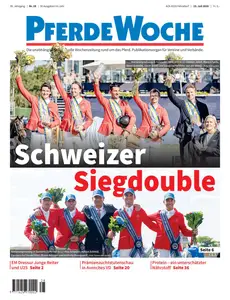

---

**Time:** 10:39:26 (Asia/Tehran)  
**Blog:** crazy-slim  

**Title:** Motor Klassik - August 2026  

**Details:** Deutsch | 164 pages | True PDF | 88.4 MB  

**Link:** http://zavat.pw/magazines/MotorKlassikAugust2026-58730.html  

---

**Time:** 10:39:26 (Asia/Tehran)  
**Blog:** crazy-slim  

**Title:** Reisegenuss - 15 Juli 2026  

**Details:** Deutsch | 80 pages | True PDF | 32.5 MB  

**Link:** http://zavat.pw/magazines/Reisegenuss15Juli2026-51662.html  

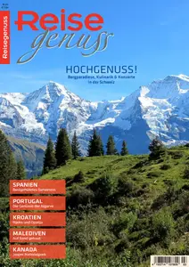

---

**Time:** 10:39:26 (Asia/Tehran)  
**Blog:** crazy-slim  

**Title:** Mini - 15 Juli 2026  

**Details:** Deutsch | 56 pages | PDF | 55.2 MB  

**Link:** http://zavat.pw/magazines/Mini15Juli2026-48498.html  

---

**Time:** 10:39:26 (Asia/Tehran)  
**Blog:** crazy-slim  

**Title:** Neue Welt - 15 Juli 2026  

**Details:** Deutsch | 72 pages | True PDF | 71.4 MB  

**Link:** http://zavat.pw/magazines/NeueWelt15Juli2026-81252.html  

---

**Time:** 10:39:26 (Asia/Tehran)  
**Blog:** crazy-slim  

**Title:** Neue Post - 15 Juli 2026  

**Details:** Deutsch | 72 pages | True PDF | 30.8 MB  

**Link:** http://zavat.pw/magazines/NeuePost15Juli2026-07883.html  

---

**Time:** 10:39:26 (Asia/Tehran)  
**Blog:** crazy-slim  

**Title:** Für Sie - 15 Juli 2026  

**Details:** Deutsch | 148 pages | True PDF | 128.1 MB  

**Link:** http://zavat.pw/magazines/F%C3%BCrSie15Juli2026-10143.html  

---

**Time:** 10:39:26 (Asia/Tehran)  
**Blog:** crazy-slim  

**Title:** Lea - 15 Juli 2026  

**Details:** Deutsch | 72 pages | True PDF | 90.7 MB  

**Link:** http://zavat.pw/magazines/Lea15Juli2026-28839.html  

---

**Time:** 08:15:03 (Asia/Tehran)  
**Blog:** IrGens  

**Title:** Lady X: A Novel  

**Details:** English | July 14, 2026 | ISBN: 0593983661, 9780593983676 | True EPUB | 352 pages | 3.3 MB  

**Link:** http://zavat.pw/ebooks/0593983661.html  

---

**Time:** 08:15:03 (Asia/Tehran)  
**Blog:** IrGens  

**Title:** The Solo Honeymoon: A Brief Beautiful True Love Story  

**Details:** English | July 14, 2026 | ISBN: 9798217177257, 9798217177264 | True EPUB | 256 pages | 1.9 MB  

**Link:** http://zavat.pw/ebooks/9798217177257.html  

---

**Time:** 08:15:03 (Asia/Tehran)  
**Blog:** IrGens  

**Title:** Air: A Novel  

**Details:** English | July 14, 2026 | ISBN: 1324094583, 9781324094593 | True EPUB | 208 pages | 0.8 MB  

**Link:** http://zavat.pw/ebooks/1324094583.html  

---

**Time:** 08:15:03 (Asia/Tehran)  
**Blog:** crazy-slim  

**Title:** Financial Times Europe - 15 July 2026  

**Details:** English | 18 pages | PDF | 104.4 MB  

**Link:** http://zavat.pw/newspapers/FinancialTimesEurope15July2026-37557.html  

---

**Time:** 08:15:03 (Asia/Tehran)  
**Blog:** crazy-slim  

**Title:** Financial Times UK - 15 July 2026  

**Details:** English | 22 pages | PDF | 132.8 MB  

**Link:** http://zavat.pw/newspapers/FinancialTimesUK15July2026-04630.html  

---

**Time:** 08:15:03 (Asia/Tehran)  
**Blog:** crazy-slim  

**Title:** Financial Times USA - 15 July 2026  

**Details:** English | 16 pages | PDF | 97.5 MB  

**Link:** http://zavat.pw/newspapers/FinancialTimesUSA15July2026-65112.html  

---

**Time:** 08:15:03 (Asia/Tehran)  
**Blog:** crazy-slim  

**Title:** Elle Türkiye - 14 Temmuz 2026  

**Details:** Türkçe | 266 pages | PDF | 197.2 MB  

**Link:** http://zavat.pw/magazines/ElleT%C3%BCrkiye14Temmuz2026-53738.html  

---

**Time:** 08:15:03 (Asia/Tehran)  
**Blog:** crazy-slim  

**Title:** Trucking Scandinavia - 15 Juli 2026  

**Details:** Svenska | 116 pages | PDF | 134.9 MB  

**Link:** http://zavat.pw/magazines/TruckingScandinavia15Juli2026-76304.html  

---

**Time:** 08:15:03 (Asia/Tehran)  
**Blog:** crazy-slim  

**Title:** Året Runt - 15 Juli 2026  

**Details:** Svenska | 112 pages | PDF | 106.1 MB  

**Link:** http://zavat.pw/magazines/%C3%85retRunt15Juli2026-81307.html  

---

**Time:** 08:15:03 (Asia/Tehran)  
**Blog:** crazy-slim  

**Title:** Tara - 15 Juli 2026  

**Details:** Svenska | 100 pages | PDF | 87.9 MB  

**Link:** http://zavat.pw/magazines/Tara15Juli2026-85782.html  

---

**Time:** 08:15:03 (Asia/Tehran)  
**Blog:** crazy-slim  

**Title:** Korsord & Sudoku - 15 Juli 2026  

**Details:** Svenska | 130 pages | PDF | 83.8 MB  

**Link:** http://zavat.pw/magazines/KorsordSudoku15Juli2026-27742.html  

---

**Time:** 08:15:03 (Asia/Tehran)  
**Blog:** crazy-slim  

**Title:** Stickat & Sånt - 15 Juli 2026  

**Details:** Svenska | 84 pages | PDF | 68.6 MB  

**Link:** http://zavat.pw/magazines/StickatS%C3%A5nt15Juli2026-81907.html  

---

**Time:** 08:15:03 (Asia/Tehran)  
**Blog:** crazy-slim  

**Title:** Svensk Damtidning - 15 Juli 2026  

**Details:** Svenska | 80 pages | PDF | 77.0 MB  

**Link:** http://zavat.pw/magazines/SvenskDamtidning15Juli2026-92942.html  

---

**Time:** 08:15:03 (Asia/Tehran)  
**Blog:** crazy-slim  

**Title:** Sveriges Stora - 15 Juli 2026  

**Details:** Svenska | 52 pages | PDF | 31.0 MB  

**Link:** http://zavat.pw/magazines/SverigesStora15Juli2026-55913.html  

---

**Time:** 08:15:03 (Asia/Tehran)  
**Blog:** crazy-slim  

**Title:** Sverigekrysset - 15 Juli 2026  

**Details:** Svenska | 36 pages | PDF | 26.7 MB  

**Link:** http://zavat.pw/magazines/Sverigekrysset15Juli2026-90493.html  

---

**Time:** 08:15:03 (Asia/Tehran)  
**Blog:** crazy-slim  

**Title:** Släkthistoria - 15 Juli 2026  

**Details:** Svenska | 76 pages | PDF | 88.8 MB  

**Link:** http://zavat.pw/magazines/Sl%C3%A4kthistoria15Juli2026-41177.html  

---

**Time:** 08:15:03 (Asia/Tehran)  
**Blog:** crazy-slim  

**Title:** Matmagasinet - 15 Juli 2026  

**Details:** Svenska | 84 pages | PDF | 73.1 MB  

**Link:** http://zavat.pw/magazines/Matmagasinet15Juli2026-38969.html  

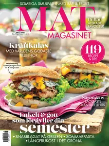

---

**Time:** 08:15:03 (Asia/Tehran)  
**Blog:** crazy-slim  

**Title:** Jaktjournalen - 15 Juli 2026  

**Details:** Svenska | 100 pages | PDF | 76.1 MB  

**Link:** http://zavat.pw/magazines/Jaktjournalen15Juli2026-27263.html  

---

**Time:** 05:16:23 (Asia/Tehran)  
**Blog:** IrGens  

**Title:** A Room of One's Own (Essentials Classics)  

**Details:** English | February 24, 2026 | ISBN: 1250418003, 9781250418012 | True EPUB | 160 pages | 0.7 MB  

**Link:** http://zavat.pw/ebooks/1250418003.html  

---

**Time:** 05:16:23 (Asia/Tehran)  
**Blog:** IrGens  

**Title:** Helen's Exile (ERIS Gems)  

**Details:** English | September 24, 2024 | ISBN: 1916809855, 9781916809864 | True EPUB | 20 pages | 0.6 MB  

**Link:** http://zavat.pw/ebooks/1916809855.html  

---

**Time:** 05:16:23 (Asia/Tehran)  
**Blog:** IrGens  

**Title:** Voice-A-Versa: Finding My Voice(s) Behind the Mic  

**Details:** English | July 14, 2026 | ISBN: 1419780891, 9798887076447 | True EPUB | 288 pages | 1.7 MB  

**Link:** http://zavat.pw/ebooks/1419780891.html  

---

**Time:** 02:21:17 (Asia/Tehran)  
**Blog:** hill0  

**Title:** Rheumatic Diseases in the Arab World  

**Details:** English | 2026 | ISBN: 9819209668 | 645 Pages | PDF EPUB (True) | 16 MB  

**Link:** http://zavat.pw/ebooks/9819209668.html  

---

**Time:** 02:21:17 (Asia/Tehran)  
**Blog:** hill0  

**Title:** The Accessible Design Reference and Specification Book  

**Details:** English | 2026 | ISBN: 1577158385 | 208 Pages | EPUB | 10 MB  

**Link:** http://zavat.pw/ebooks/1577158385.html  

---

**Time:** 01:21:30 (Asia/Tehran)  
**Blog:** IrGens  

**Title:** Cybersecurity Awareness: Mobile and Remote Work Security  

**Details:** .MP4, AVC, 1280x720, 30 fps | English, AAC, 2 Ch | 30m | 132 MB  

**Link:** http://zavat.pw/ebooks/cybersecurity-awareness-mobile-and-remote-work-security.html  

---

**Time:** 01:21:30 (Asia/Tehran)  
**Blog:** IrGens  

**Title:** Analytics Engineering for AI: From Data to Natural-Language Questions  

**Details:** .MP4, AVC, 1280x720, 30 fps | English, AAC, 2 Ch | 1h 25m | 259 MB  

**Link:** http://zavat.pw/ebooks/analytics-engineering-for-ai-from-data-to-natural-language-questions.html  

---

**Time:** 01:21:30 (Asia/Tehran)  
**Blog:** IrGens  

**Title:** Microsoft Foundry Fundamentals: A Beginner’s Guide to Models, Workflows, and Possibilities by Microsoft Press  

**Details:** .MP4, AVC, 1280x720, 30 fps | English, AAC, 2 Ch | 4h 5m | 614 MB  

**Link:** http://zavat.pw/ebooks/microsoft-foundry-fundamentals-a-beginner-s-guide-to-models-workflows-and-possibilities-by-microsoft-press.html  

---

**Time:** 01:21:30 (Asia/Tehran)  
**Blog:** IrGens  

**Title:** AI-Powered Exploratory Data Analysis (EDA) with Julius AI  

**Details:** .MP4, AVC, 1280x720, 30 fps | English, AAC, 2 Ch | 43m | 145 MB  

**Link:** http://zavat.pw/ebooks/ai-powered-exploratory-data-analysis-eda-with-julius-ai.html  

---

**Time:** 01:21:30 (Asia/Tehran)  
**Blog:** IrGens  

**Title:** Automating Workflows with Claude Code  

**Details:** .MP4, AVC, 1920x1080, 30 fps | English, AAC, 2 Ch | 1h 39m | 1.59 GB  

**Link:** http://zavat.pw/ebooks/automating-workflows-claude-code.html  

---

**Time:** 00:05:26 (Asia/Tehran)  
**Blog:** IrGens  

**Title:** You Can Have It All: Unlock the Secrets to a Great Life  

**Details:** English | January 23, 2026 | ISBN: 9373076272, 9369891323, ‎ 9789369896608 | True EPUB | 304 pages | 2.4 MB  

**Link:** http://zavat.pw/ebooks/9373076272.html  

---

**Time:** 00:05:26 (Asia/Tehran)  
**Blog:** IrGens  

**Title:** Culture Care: Reconnecting with Beauty for Our Common Life, 2nd Edition  

**Details:** English | July 14, 2026 | ISBN: 1514015943, 9781514015957 | True EPUB | 176 pages | 20.3 MB  

**Link:** http://zavat.pw/ebooks/1514015943.html  

---

**Time:** 00:05:26 (Asia/Tehran)  
**Blog:** IrGens  

**Title:** Blow by Blow: The Jeff Beck Story  

**Details:** English | July 14, 2026 | ISBN: 0306836580, 9780306836602 | True EPUB | 374 pages | 21.6 MB  

**Link:** http://zavat.pw/ebooks/0306836580.html  

---

**Time:** 00:05:26 (Asia/Tehran)  
**Blog:** IrGens  

**Title:** What Doesn't Kill You Makes You Hotter  

**Details:** English | July 14, 2026 | ISBN: 1668087340, 9781668087367 | True EPUB | 304 pages | 4.3 MB  

**Link:** http://zavat.pw/ebooks/1668087340.html  

---

**Time:** 00:05:26 (Asia/Tehran)  
**Blog:** IrGens  

**Title:** Sex Diaries: Real-life Stories of Non-Monogamy and Polyamory  

**Details:** English | July 14, 2026 | ISBN: 0593977424, 9780593977446 | True EPUB | 272 pages | 1.8 MB  

**Link:** http://zavat.pw/ebooks/0593977424.html  

---

**Time:** 00:05:26 (Asia/Tehran)  
**Blog:** hill0  

**Title:** Macro Photography  

**Details:** English | 2026 | ASIN: B0GGHLP7XT | 263 Pages | EPUB | 52 MB  

**Link:** http://zavat.pw/ebooks/B0GGHLP7XT.html  

