# Zavat feed - 2026-07-24

---

**Time:** 23:43:51 (Asia/Tehran)  
**Blog:** hill0  

**Title:** The Palgrave Encyclopedia of Early Modern Women's Writing  

**Details:** English | 2026 | ISBN: 3031550250 | 2364 Pages | PDF (True) | 74 MB  

**Link:** http://zavat.pw/ebooks/3031550250.html  

---

**Time:** 23:43:51 (Asia/Tehran)  
**Blog:** hill0  

**Title:** Answer Engine Optimization  

**Details:** English | 2026 | ASIN: B0GQF849PM | 364 Pages | EPUB | 7 MB  

**Link:** http://zavat.pw/ebooks/B0GQF849PM.html  

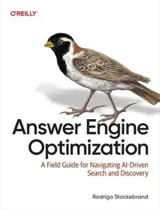

---

**Time:** 23:43:51 (Asia/Tehran)  
**Blog:** crazy-slim  

**Title:** Pony Magazine - August 2026  

**Details:** English | 68 pages | PDF | 62.9 MB  

**Link:** http://zavat.pw/magazines/PonyMagazineAugust2026-61902.html  

---

**Time:** 23:43:51 (Asia/Tehran)  
**Blog:** crazy-slim  

**Title:** Hobbyworld Spanish Edition N.283 - Julio 2026  

**Details:** Español | 48 pages | PDF | 79.2 MB  

**Link:** http://zavat.pw/magazines/HobbyworldSpanishEditionN283Julio2026-95456.html  

---

**Time:** 23:43:51 (Asia/Tehran)  
**Blog:** crazy-slim  

**Title:** Dein Spiegel - September 2015  

**Details:** Deutsch | 76 pages | True PDF | 25.2 MB  

**Link:** http://zavat.pw/magazines/DeinSpiegelSeptember2015-87802.html  

---

**Time:** 23:43:51 (Asia/Tehran)  
**Blog:** crazy-slim  

**Title:** Dein Spiegel - Oktober 2015  

**Details:** Deutsch | 76 pages | True PDF | 29.2 MB  

**Link:** http://zavat.pw/magazines/DeinSpiegelOktober2015-29615.html  

---

**Time:** 23:43:51 (Asia/Tehran)  
**Blog:** crazy-slim  

**Title:** Dein Spiegel - November 2015  

**Details:** Deutsch | 76 pages | True PDF | 26.3 MB  

**Link:** http://zavat.pw/magazines/DeinSpiegelNovember2015-28077.html  

---

**Time:** 23:43:51 (Asia/Tehran)  
**Blog:** crazy-slim  

**Title:** Dein Spiegel - März 2015  

**Details:** Deutsch | 75 pages | True PDF | 25.7 MB  

**Link:** http://zavat.pw/magazines/DeinSpiegelM%C3%A4rz2015-42870.html  

---

**Time:** 23:43:51 (Asia/Tehran)  
**Blog:** crazy-slim  

**Title:** Modern Railways - August 2026  

**Details:** English | 148 pages | PDF | 200.6 MB  

**Link:** http://zavat.pw/magazines/ModernRailwaysAugust2026-35124.html  

---

**Time:** 23:43:51 (Asia/Tehran)  
**Blog:** crazy-slim  

**Title:** Dein Spiegel - Mai 2015  

**Details:** Deutsch | 76 pages | True PDF | 24.2 MB  

**Link:** http://zavat.pw/magazines/DeinSpiegelMai2015-64538.html  

---

**Time:** 23:43:51 (Asia/Tehran)  
**Blog:** crazy-slim  

**Title:** Dein Spiegel - Juli 2015  

**Details:** Deutsch | 74 pages | True PDF | 22.3 MB  

**Link:** http://zavat.pw/magazines/DeinSpiegelJuli2015-44113.html  

---

**Time:** 23:43:51 (Asia/Tehran)  
**Blog:** crazy-slim  

**Title:** Dein Spiegel - Januar 2015  

**Details:** Deutsch | 76 pages | True PDF | 22.5 MB  

**Link:** http://zavat.pw/magazines/DeinSpiegelJanuar2015-44792.html  

---

**Time:** 23:43:51 (Asia/Tehran)  
**Blog:** crazy-slim  

**Title:** Dein Spiegel - Juni 2015  

**Details:** Deutsch | 76 pages | True PDF | 21.9 MB  

**Link:** http://zavat.pw/magazines/DeinSpiegelJuni2015-26918.html  

---

**Time:** 23:43:51 (Asia/Tehran)  
**Blog:** crazy-slim  

**Title:** Stitch Magazine - August-September 2026  

**Details:** English | 64 pages | PDF | 80.2 MB  

**Link:** http://zavat.pw/magazines/StitchMagazineAugustSeptember2026-45816.html  

---

**Time:** 23:43:51 (Asia/Tehran)  
**Blog:** crazy-slim  

**Title:** Dein Spiegel - Februar 2015  

**Details:** Deutsch | 76 pages | True PDF | 20.6 MB  

**Link:** http://zavat.pw/magazines/DeinSpiegelFebruar2015-99768.html  

---

**Time:** 23:43:51 (Asia/Tehran)  
**Blog:** crazy-slim  

**Title:** Dein Spiegel - August 2015  

**Details:** Deutsch | 76 pages | True PDF | 23.7 MB  

**Link:** http://zavat.pw/magazines/DeinSpiegelAugust2015-50539.html  

---

**Time:** 23:43:51 (Asia/Tehran)  
**Blog:** crazy-slim  

**Title:** Dein Spiegel - Dezember 2015  

**Details:** Deutsch | 76 pages | True PDF | 22.3 MB  

**Link:** http://zavat.pw/magazines/DeinSpiegelDezember2015-99457.html  

---

**Time:** 22:24:31 (Asia/Tehran)  
**Blog:** AvaxGenius  

**Title:** Foundations of Geometric Algebra Computing  

**Details:** English | EPUB (True) | 2013 | 216 Pages | ISBN : 3642317936 | 3.4 MB  

**Link:** http://zavat.pw/ebooks/36423179362E.html  

---

**Time:** 22:24:31 (Asia/Tehran)  
**Blog:** AvaxGenius  

**Title:** Algorithms for Data Science  

**Details:** English | PDF (True) | 2016 | 438 Pages | ISBN : 3319833731 | 8.3 MB  

**Link:** http://zavat.pw/ebooks/3319833731.html  

---

**Time:** 22:24:31 (Asia/Tehran)  
**Blog:** AvaxGenius  

**Title:** Algorithms for VLSI Physical Design Automation  

**Details:** English | PDF | 1995 | 553 Pages | ISBN : 0792395921 | 48 MB  

**Link:** http://zavat.pw/ebooks/07923955921.html  

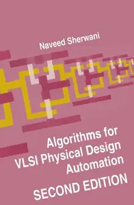

---

**Time:** 22:24:31 (Asia/Tehran)  
**Blog:** AvaxGenius  

**Title:** Uniform Random Numbers: Theory and Practice  

**Details:** English | PDF | 1995 | 218 Pages | ISBN : 0792395727 | 13.3 MB  

**Link:** http://zavat.pw/ebooks/07952395727.html  

---

**Time:** 22:24:31 (Asia/Tehran)  
**Blog:** crazy-slim  

**Title:** National Enquirer - August 3, 2026  

**Details:** English | 48 pages | True PDF | 25.5 MB  

**Link:** http://zavat.pw/newspapers/NationalEnquirerAugust32026-60916.html  

---

**Time:** 22:24:31 (Asia/Tehran)  
**Blog:** crazy-slim  

**Title:** Globe - August 3, 2026  

**Details:** English | 48 pages | True PDF | 25.8 MB  

**Link:** http://zavat.pw/newspapers/GlobeAugust32026-32131.html  

---

**Time:** 22:24:31 (Asia/Tehran)  
**Blog:** crazy-slim  

**Title:** Revista Lide - 21 Julho 2026  

**Details:** Portuguese | 116 pages | True PDF | 113.4 MB  

**Link:** http://zavat.pw/magazines/RevistaLide21Julho2026-69167.html  

---

**Time:** 22:24:31 (Asia/Tehran)  
**Blog:** crazy-slim  

**Title:** Corredor - 1 Julio 2026  

**Details:** Español | 100 pages | True PDF | 79.5 MB  

**Link:** http://zavat.pw/magazines/Corredor1Julio2026-88810.html  

---

**Time:** 22:24:31 (Asia/Tehran)  
**Blog:** crazy-slim  

**Title:** Sucesos de la Historia - 15 Julio 2026  

**Details:** Español | 8 pages | True PDF | 25.8 MB  

**Link:** http://zavat.pw/magazines/SucesosdelaHistoria15Julio2026-46948.html  

---

**Time:** 22:24:31 (Asia/Tehran)  
**Blog:** crazy-slim  

**Title:** Auto Bild España N.692 - Agosto 2026  

**Details:** Español | 124 pages | True PDF | 69.3 MB  

**Link:** http://zavat.pw/magazines/AutoBildEspa%C3%B1aN692Agosto2026-98555.html  

---

**Time:** 22:24:31 (Asia/Tehran)  
**Blog:** crazy-slim  

**Title:** Car and Driver カーアンドドライバー - September 2026  

**Details:** 日本語 | 144 pages | True PDF | 197.6 MB  

**Link:** http://zavat.pw/magazines/CarandDriver%E3%82%AB%E3%83%BC%E3%82%A2%E3%83%B3%E3%83%89%E3%83%89%E3%83%A9%E3%82%A4%E3%83%90%E3%83%BCSeptember2026-61168.html  

---

**Time:** 22:24:31 (Asia/Tehran)  
**Blog:** crazy-slim  

**Title:** Tudo Sobre Informática - Julho 2026  

**Details:** Portuguese | 38 pages | True PDF | 12.1 MB  

**Link:** http://zavat.pw/magazines/TudoSobreInform%C3%A1ticaJulho2026-57248.html  

---

**Time:** 22:24:31 (Asia/Tehran)  
**Blog:** crazy-slim  

**Title:** Signo do Mês - Julho 2026  

**Details:** Portuguese | 52 pages | True PDF | 19.9 MB  

**Link:** http://zavat.pw/magazines/SignodoM%C3%AAsJulho2026-76813.html  

---

**Time:** 22:24:31 (Asia/Tehran)  
**Blog:** crazy-slim  

**Title:** Sudoku Números e Desafios - 24 Julho 2026  

**Details:** Portuguese | 36 pages | True PDF | 20.0 MB  

**Link:** http://zavat.pw/magazines/SudokuN%C3%BAmeroseDesafios24Julho2026-72888.html  

---

**Time:** 22:24:31 (Asia/Tehran)  
**Blog:** crazy-slim  

**Title:** Recreio - 24 Julho 2026  

**Details:** Portuguese | 30 pages | True PDF | 27.6 MB  

**Link:** http://zavat.pw/magazines/Recreio24Julho2026-32925.html  

---

**Time:** 22:24:31 (Asia/Tehran)  
**Blog:** crazy-slim  

**Title:** Mais Rio de Janeiro - 20 Julho 2026  

**Details:** Portuguese | 110 pages | True PDF | 52.4 MB  

**Link:** http://zavat.pw/magazines/MaisRiodeJaneiro20Julho2026-56637.html  

---

**Time:** 22:24:31 (Asia/Tehran)  
**Blog:** crazy-slim  

**Title:** Manual do Construtor - Julho 2026  

**Details:** Portuguese | 32 pages | True PDF | 37.6 MB  

**Link:** http://zavat.pw/magazines/ManualdoConstrutorJulho2026-71131.html  

---

**Time:** 22:24:31 (Asia/Tehran)  
**Blog:** crazy-slim  

**Title:** Orientações Enem - Julho 2026  

**Details:** Portuguese | 40 pages | True PDF | 15.1 MB  

**Link:** http://zavat.pw/magazines/Orienta%C3%A7%C3%B5esEnemJulho2026-31300.html  

---

**Time:** 22:24:31 (Asia/Tehran)  
**Blog:** crazy-slim  

**Title:** Orações e Preces - Julho 2026  

**Details:** Portuguese | 34 pages | True PDF | 9.2 MB  

**Link:** http://zavat.pw/magazines/Ora%C3%A7%C3%B5esePrecesJulho2026-38523.html  

---

**Time:** 20:31:51 (Asia/Tehran)  
**Blog:** AvaxGenius  

**Title:** Theoretical Physics at the End of the Twentieth Century  

**Details:** English | PDF | 2002 | 646 Pages | ISBN : 0387953116 | 54.9 MB  

**Link:** http://zavat.pw/ebooks/03879553116.html  

---

**Time:** 20:31:51 (Asia/Tehran)  
**Blog:** AvaxGenius  

**Title:** Laser Filamentation: Mathematical Methods and Models (Repost)  

**Details:** English | PDF (True) | 2016 | 223 Pages | ISBN : 3319230832 | 5.4 MB  

**Link:** http://zavat.pw/ebooks/331925305832.html  

---

**Time:** 20:31:51 (Asia/Tehran)  
**Blog:** AvaxGenius  

**Title:** Theoretical Methods for Strongly Correlated Electrons  

**Details:** English | PDF | 2004 | 370 Pages | ISBN : 0387008950 | 4 MB  

**Link:** http://zavat.pw/ebooks/03870508950.html  

---

**Time:** 20:31:51 (Asia/Tehran)  
**Blog:** AvaxGenius  

**Title:** The Painlevé Property: One Century Later  

**Details:** English | PDF (True) | 1999 | 828 Pages | ISBN : 0387988882 | 64 MB  

**Link:** http://zavat.pw/ebooks/035879885882.html  

---

**Time:** 20:31:51 (Asia/Tehran)  
**Blog:** AvaxGenius  

**Title:** Teaching Thermodynamics  

**Details:** English | PDF | 1985 | 504 Pages | ISBN : 0306422077 | 41 MB  

**Link:** http://zavat.pw/ebooks/03066422077.html  

---

**Time:** 20:31:51 (Asia/Tehran)  
**Blog:** AvaxGenius  

**Title:** Handbook of the Thermodynamics of Organic Compounds  

**Details:** English | PDF | 1987 | 561 Pages | ISBN : 9401079234 | 36.4 MB  

**Link:** http://zavat.pw/ebooks/94010792434.html  

---

**Time:** 20:31:51 (Asia/Tehran)  
**Blog:** AvaxGenius  

**Title:** Bioelectrochemistry: General Introduction  

**Details:** English | PDF | 1995 | 379 Pages | ISBN : 3034873204 | 34.6 MB  

**Link:** http://zavat.pw/ebooks/3034875204.html  

---

**Time:** 20:31:51 (Asia/Tehran)  
**Blog:** AvaxGenius  

**Title:** Geodynamics of the Latin American Pacific Margin (Repost)  

**Details:** English | PDF | 2017 | 456 Pages | ISBN : 3319515284 | 167.1 MB  

**Link:** http://zavat.pw/ebooks/331955155284.html  

---

**Time:** 20:31:51 (Asia/Tehran)  
**Blog:** AvaxGenius  

**Title:** CT and MRI of Skull Base Lesions: A Diagnostic Guide (Repost)  

**Details:** English | PDF,EPUB | 2018 | 818 Pages | ISBN : 3319659561 | 326.82 MB  

**Link:** http://zavat.pw/ebooks/336196529561.html  

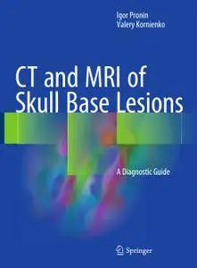

---

**Time:** 20:31:51 (Asia/Tehran)  
**Blog:** AvaxGenius  

**Title:** Light Metals 2018 (Repost)  

**Details:** English | PDF,EPUB | 2018 | 1536 Pages | ISBN : 3319722832 | 212.8 MB  

**Link:** http://zavat.pw/ebooks/433197228322.html  

---

**Time:** 20:31:51 (Asia/Tehran)  
**Blog:** AvaxGenius  

**Title:** Hysterectomy: A Comprehensive Surgical Approach (Repost)  

**Details:** English | PDF(True) | 2018 | 1595 Pages | ISBN : 3319224964 | 262.6 MB  

**Link:** http://zavat.pw/ebooks/331942244964.html  

---

**Time:** 20:31:51 (Asia/Tehran)  
**Blog:** AvaxGenius  

**Title:** Computational Line Geometry (Repost)  

**Details:** English | PDF | 2001 | 571 Pages | ISBN : 3642040179 | 99.37 MB  

**Link:** http://zavat.pw/ebooks/336420401759.html  

---

**Time:** 20:31:51 (Asia/Tehran)  
**Blog:** AvaxGenius  

**Title:** Elements of Manufacturing, Distribution and Logistics: Quantitative Methods for Planning and Control  

**Details:** English | PDF (True) | 2016 | 308 Pages | ISBN : 3319268619 | 3.3 MB  

**Link:** http://zavat.pw/ebooks/3319268619T.html  

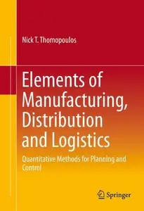

---

**Time:** 20:31:51 (Asia/Tehran)  
**Blog:** AvaxGenius  

**Title:** Recent Progress in Brain and Cognitive Engineering  

**Details:** English | PDF (True) | 2015 | 218 Pages | ISBN : 940177238X | 7.3 MB  

**Link:** http://zavat.pw/ebooks/94017472384X.html  

---

**Time:** 20:31:51 (Asia/Tehran)  
**Blog:** AvaxGenius  

**Title:** Lehrbuch der Softwaretechnik: Entwurf, Implementierung, Installation und Betrieb  

**Details:** Deutsch | PDF (True) | 2011 | 593 Pages | ISBN : 3827417066 | 5.8 MB  

**Link:** http://zavat.pw/ebooks/38274157066.html  

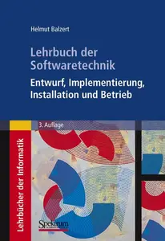

---

**Time:** 20:31:51 (Asia/Tehran)  
**Blog:** hill0  

**Title:** Vibration Control Systems  

**Details:** English | 2026 | ISBN: 1394358253 | 308 Pages | EPUB (True) | 6 MB  

**Link:** http://zavat.pw/ebooks/1394358253.html  

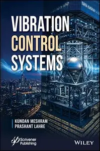

---

**Time:** 20:31:51 (Asia/Tehran)  
**Blog:** hill0  

**Title:** IT Service Management: Aus der Praxis für die Praxis, 5. Auflage  

**Details:** Deutsch | 2026 | ISBN: 3747511171 | 662 Pages | EPUB | 17 MB  

**Link:** http://zavat.pw/ebooks/3747511171.html  

---

**Time:** 20:31:51 (Asia/Tehran)  
**Blog:** hill0  

**Title:** Routledge Handbook of Terrestrial Ecohydrology (  

**Details:** English | 2026 | ISBN: 1032469455 | 624 Pages | PDF EPUB (True) | 48 MB  

**Link:** http://zavat.pw/ebooks/1032469455.html  

---

**Time:** 20:31:51 (Asia/Tehran)  
**Blog:** hill0  

**Title:** Evolution of the Monitor Lizards  

**Details:** English | 2026 | ISBN: 1032730315 | 304 Pages | PDF EPUB (True) | 134 MB  

**Link:** http://zavat.pw/ebooks/1032730315.html  

---

**Time:** 20:31:51 (Asia/Tehran)  
**Blog:** hill0  

**Title:** Neural Calibration of Coordinate Measuring Arms  

**Details:** English | 2026 | ISBN: 3032329175 | 104 Pages | PDF EPUB (True) | 26 MB  

**Link:** http://zavat.pw/ebooks/3032329175.html  

---

**Time:** 20:31:51 (Asia/Tehran)  
**Blog:** hill0  

**Title:** Semiotics in the Age of Artificial Intelligence  

**Details:** English | 2026 | ISBN: 3032292719 | 195 Pages | PDF EPUB (True) | 17 MB  

**Link:** http://zavat.pw/ebooks/3032292719.html  

---

**Time:** 20:31:51 (Asia/Tehran)  
**Blog:** hill0  

**Title:** Stability Problems in Mechanics of Continua  

**Details:** English | 2026 | ISBN: 3032310318 | 779 Pages | PDF (True) | 49 MB  

**Link:** http://zavat.pw/ebooks/3032310318.html  

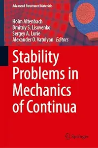

---

**Time:** 20:31:51 (Asia/Tehran)  
**Blog:** hill0  

**Title:** Natural Language Processing and Large Language Models  

**Details:** English | 2026 | ISBN: 9819206812 | 400 Pages | PDF EPUB (True) | 136 MB  

**Link:** http://zavat.pw/ebooks/9819206812.html  

---

**Time:** 18:51:41 (Asia/Tehran)  
**Blog:** AvaxGenius  

**Title:** Life Extension Magazine - August 2026  

**Details:** English | True PDF | 84 Pages | 8.2 MB  

**Link:** http://zavat.pw/magazines/LifeExtensionMagazineAugust2026.html  

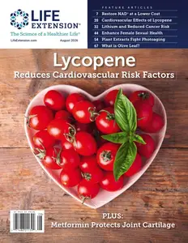

---

**Time:** 17:22:46 (Asia/Tehran)  
**Blog:** AvaxGenius  

**Title:** Flight Training - July 2026  

**Details:** English | True PDF | 60 Pages | 8.2 MB  

**Link:** http://zavat.pw/magazines/FlightTrainingJuly2026.html  

---

**Time:** 17:22:46 (Asia/Tehran)  
**Blog:** AvaxGenius  

**Title:** Methods and Applications of Error-Free Computation  

**Details:** English | PDF | 1984 | 204 Pages | ISBN : 1461297540 | 20.9 MB  

**Link:** http://zavat.pw/ebooks/14612957540.html  

---

**Time:** 17:22:46 (Asia/Tehran)  
**Blog:** AvaxGenius  

**Title:** Mathematical Learning Models — Theory and Algorithms  

**Details:** English | PDF | 1983 | 239 Pages | ISBN : 0387909133 | 14.9 MB  

**Link:** http://zavat.pw/ebooks/03879059133.html  

---

**Time:** 17:22:46 (Asia/Tehran)  
**Blog:** AvaxGenius  

**Title:** Methods in Computational Molecular Physics  

**Details:** English | PDF | 1983 | 367 Pages | ISBN : 9027716382 | 26.7 MB  

**Link:** http://zavat.pw/ebooks/90275716382.html  

---

**Time:** 17:22:46 (Asia/Tehran)  
**Blog:** AvaxGenius  

**Title:** Linear Optimization and Approximation  

**Details:** English | PDF | 1983 | 209 Pages | ISBN : 0387908579 | 18.1 MB  

**Link:** http://zavat.pw/ebooks/03879208579.html  

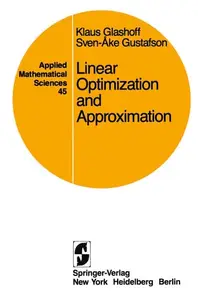

---

**Time:** 17:22:46 (Asia/Tehran)  
**Blog:** hill0  

**Title:** The Incomparable Historian  

**Details:** English | 2026 | ISBN: 3032256771 | 475 Pages | PDF EPUB (True) | 73 MB  

**Link:** http://zavat.pw/ebooks/3032256771.html  

---

**Time:** 17:22:46 (Asia/Tehran)  
**Blog:** hill0  

**Title:** The Handbook of Public Health in the Asia-Pacific  

**Details:** English | 2026 | ISBN: 9819521742 | 1270 Pages | PDF (True) | 22 MB  

**Link:** http://zavat.pw/ebooks/9819521742.html  

---

**Time:** 15:29:32 (Asia/Tehran)  
**Blog:** crazy-slim  

**Title:** FMT Flugmodell und Technik - August 2026  

**Details:** Deutsch | 132 pages | True PDF | 108.1 MB  

**Link:** http://zavat.pw/magazines/FMTFlugmodellundTechnikAugust2026-40426.html  

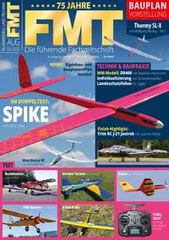

---

**Time:** 15:29:32 (Asia/Tehran)  
**Blog:** crazy-slim  

**Title:** Mojo Collector's Series Specials - Siouxsie and the Banshees 2026  

**Details:** English | 132 pages | True PDF | 76.3 MB  

**Link:** http://zavat.pw/magazines/MojoCollectorsSeriesSpecialsSiouxsieandtheBanshees2026-61804.html  

---

**Time:** 15:29:32 (Asia/Tehran)  
**Blog:** crazy-slim  

**Title:** PCtipp - August 2026  

**Details:** Deutsch | 72 pages | True PDF | 37.6 MB  

**Link:** http://zavat.pw/magazines/PCtippAugust2026-22445.html  

---

**Time:** 15:29:32 (Asia/Tehran)  
**Blog:** crazy-slim  

**Title:** The Independent - 24 July 2026  

**Details:** English | 114 pages | True PDF | 46.7 MB  

**Link:** http://zavat.pw/newspapers/TheIndependent24July2026-94660.html  

---

**Time:** 13:40:12 (Asia/Tehran)  
**Blog:** hill0  

**Title:** Equipment Leasing & Financing (2nd Edition)  

**Details:** English | 2026 | ISBN: 160649743X | 193 Pages | EPUB (True) | 1.2 MB  

**Link:** http://zavat.pw/ebooks/160649743X.html  

---

**Time:** 13:40:12 (Asia/Tehran)  
**Blog:** hill0  

**Title:** Mussolini, Architect: Propaganda and Urban Landscape in Fascist Italy  

**Details:** English | 2022 | ISBN: 144263104X | 407 Pages | EPUB (True) | 20 MB  

**Link:** http://zavat.pw/ebooks/144263104Xe.html  

---

**Time:** 13:40:12 (Asia/Tehran)  
**Blog:** hill0  

**Title:** Win The Digital Age with Data  

**Details:** English | 2022 | ASIN: B09Z8LV9Y9 | 57 Pages | True EPUB | 3.3 MB  

**Link:** http://zavat.pw/ebooks/B09Z8LV9Y9.html  

---

**Time:** 13:40:12 (Asia/Tehran)  
**Blog:** hill0  

**Title:** Clean Architecture with .NET  

**Details:** English | 2026 | ISBN: 9781805128533 | 396 Pages | EPUB (True) | 15 MB  

**Link:** http://zavat.pw/ebooks/9781805128533.html  

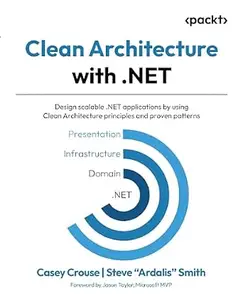

---

**Time:** 13:40:12 (Asia/Tehran)  
**Blog:** hill0  

**Title:** Multinational Corporations and Climate Change  

**Details:** English | 2026 | ISBN: 1009610902 | 283 Pages | PDF | 2 MB  

**Link:** http://zavat.pw/ebooks/1009610902.html  

---

**Time:** 13:40:12 (Asia/Tehran)  
**Blog:** hill0  

**Title:** Süddeutsche Zeitung Magazin - 24 Juli 2026  

**Details:** Deutsch | 33 pages | True PDF | 4.4 MB  

**Link:** http://zavat.pw/magazines/SZmagz-240726.html  

---

**Time:** 13:40:12 (Asia/Tehran)  
**Blog:** hill0  

**Title:** Harvard Business Review USA - July/August 2026  

**Details:** English | 152 pages | True PDF | 49 MB  

**Link:** http://zavat.pw/magazines/HBR-070826.html  

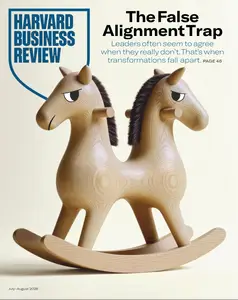

---

**Time:** 13:40:12 (Asia/Tehran)  
**Blog:** hill0  

**Title:** Simulink Support Package for Arduino Hardware User's Guide  

**Details:** English | 2026 | ISBN: n/a | 300 Pages | PDF (True) | 7 MB  

**Link:** http://zavat.pw/ebooks/SIMLUIKarduino-26.html  

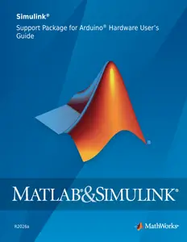

---

**Time:** 13:40:12 (Asia/Tehran)  
**Blog:** hill0  

**Title:** Machine Learning for Kids  

**Details:** English | 2021 | ISBN: 1718500564 | 291 Pages | PDF (True) | 44 MB  

**Link:** http://zavat.pw/ebooks/1718500564T.html  

---

**Time:** 13:40:12 (Asia/Tehran)  
**Blog:** hill0  

**Title:** Time for Dinner: Smarter recipes for faster cooking  

**Details:** English | 2024 | ISBN: 1743799799 | 533 Pages | EPUB (True) | 199 MB  

**Link:** http://zavat.pw/ebooks/1743799799T.html  

---

**Time:** 13:40:12 (Asia/Tehran)  
**Blog:** hill0  

**Title:** Total Definer: Atlas of Advanced Body Sculpting  

**Details:** English | 2023 | ISBN: 1684202558 | 520 Pages | PDF (True) | 392 MB  

**Link:** http://zavat.pw/ebooks/1684202558T.html  

---

**Time:** 13:40:12 (Asia/Tehran)  
**Blog:** crazy-slim  

**Title:** Air Modeller - August-September 2026  

**Details:** English | 68 pages | PDF | 111.9 MB  

**Link:** http://zavat.pw/magazines/AirModellerAugustSeptember2026-17663.html  

---

**Time:** 13:40:12 (Asia/Tehran)  
**Blog:** crazy-slim  

**Title:** Model Airplane International - August 2026  

**Details:** English | 68 pages | PDF | 107.6 MB  

**Link:** http://zavat.pw/magazines/ModelAirplaneInternationalAugust2026-04464.html  

---

**Time:** 13:40:12 (Asia/Tehran)  
**Blog:** crazy-slim  

**Title:** Hi-Fi News - September 2026  

**Details:** English | 148 pages | PDF (Vector Text) | 83.7 MB  

**Link:** http://zavat.pw/magazines/HiFiNewsSeptember2026-24892.html  

---

**Time:** 13:40:12 (Asia/Tehran)  
**Blog:** crazy-slim  

**Title:** The London Magazine - August 2026  

**Details:** English | 134 pages | True PDF | 53.9 MB  

**Link:** http://zavat.pw/magazines/TheLondonMagazineAugust2026-34899.html  

---

**Time:** 13:40:12 (Asia/Tehran)  
**Blog:** crazy-slim  

**Title:** FineScale Modeler - September-October 2026  

**Details:** English | 60 pages | True PDF | 21.2 MB  

**Link:** http://zavat.pw/magazines/FineScaleModelerSeptemberOctober2026-25747.html  

---

**Time:** 13:40:12 (Asia/Tehran)  
**Blog:** crazy-slim  

**Title:** Rolling Stone Japan - August 2026  

**Details:** 日本語 | 146 pages | PDF | 101.7 MB  

**Link:** http://zavat.pw/magazines/RollingStoneJapanAugust2026-70000.html  

---

**Time:** 13:40:12 (Asia/Tehran)  
**Blog:** crazy-slim  

**Title:** Carトップ (カートップ) - September 2026  

**Details:** 日本語 | 164 pages | PDF | 99.8 MB  

**Link:** http://zavat.pw/magazines/Car%E3%83%88%E3%83%83%E3%83%97%E3%82%AB%E3%83%BC%E3%83%88%E3%83%83%E3%83%97September2026-69164.html  

---

**Time:** 13:40:12 (Asia/Tehran)  
**Blog:** crazy-slim  

**Title:** Mega Drive Mania - Edição 18 2026  

**Details:** Portuguese | 52 pages | True PDF | 34.6 MB  

**Link:** http://zavat.pw/magazines/MegaDriveManiaEdi%C3%A7%C3%A3o182026-31794.html  

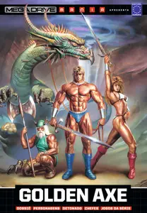

---

**Time:** 13:40:12 (Asia/Tehran)  
**Blog:** crazy-slim  

**Title:** Pickleball Magazine - July-August 2026  

**Details:** English | 68 pages | True PDF | 25.7 MB  

**Link:** http://zavat.pw/magazines/PickleballMagazineJulyAugust2026-94265.html  

---

**Time:** 13:40:12 (Asia/Tehran)  
**Blog:** crazy-slim  

**Title:** The Week Junior UK - 25 July 2026  

**Details:** English | 36 pages | True PDF | 23.3 MB  

**Link:** http://zavat.pw/magazines/TheWeekJuniorUK25July2026-08906.html  

---

**Time:** 13:40:12 (Asia/Tehran)  
**Blog:** crazy-slim  

**Title:** Saras Salil - July 2026 II  

**Details:** हिन्दी | 32 pages | True PDF | 20.2 MB  

**Link:** http://zavat.pw/magazines/SarasSalilJuly2026II-19893.html  

---

**Time:** 13:40:12 (Asia/Tehran)  
**Blog:** crazy-slim  

**Title:** The Washington Post - July 24, 2026  

**Details:** English | 51 pages | True PDF | 23.6 MB  

**Link:** http://zavat.pw/newspapers/TheWashingtonPostJuly242026-00564.html  

---

**Time:** 13:40:12 (Asia/Tehran)  
**Blog:** crazy-slim  

**Title:** Trinidad & Tobago Daily Express - 24 July 2026  

**Details:** English | 40 pages | True PDF | 20.3 MB  

**Link:** http://zavat.pw/newspapers/TrinidadTobagoDailyExpress24July2026-43700.html  

---

**Time:** 13:40:12 (Asia/Tehran)  
**Blog:** crazy-slim  

**Title:** The Philadelphia Inquirer - July 24, 2026  

**Details:** English | 28 pages | True PDF | 32.8 MB  

**Link:** http://zavat.pw/newspapers/ThePhiladelphiaInquirerJuly242026-08577.html  

---

**Time:** 13:40:12 (Asia/Tehran)  
**Blog:** crazy-slim  

**Title:** The Baltimore Sun The Aegis - 24 July 2026  

**Details:** English | 24 pages | True PDF | 24.2 MB  

**Link:** http://zavat.pw/newspapers/TheBaltimoreSunTheAegis24July2026-49849.html  

---

**Time:** 11:23:35 (Asia/Tehran)  
**Blog:** yoyoloit  

**Title:** Venture Capital and the Finance of Innovation, 3rd Edition  

**Details:** English | 2021 | ISBN: 1119490111 | 497 pages | True PDF | 16.08 MB  

**Link:** http://zavat.pw/ebooks/1119490111.html  

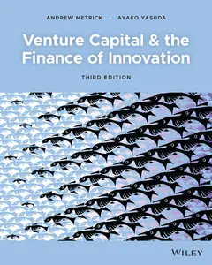

---

**Time:** 11:23:35 (Asia/Tehran)  
**Blog:** yoyoloit  

**Title:** Financial Accounting: Reporting, Analysis and Decision Making, 7th Edition  

**Details:** English | 2021 | ISBN: 0730395294 | 777 pages | True PDF | 9.08 MB  

**Link:** http://zavat.pw/ebooks/0730395294.html  

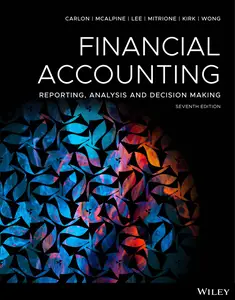

---

**Time:** 11:23:35 (Asia/Tehran)  
**Blog:** yoyoloit  

**Title:** Accounting: Reporting, Analysis and Decision Making, 7th Edition  

**Details:** English | 2021 | ISBN: 0730391914 | 980 pages | True PDF | 94.63 MB  

**Link:** http://zavat.pw/ebooks/0730391914a.html  

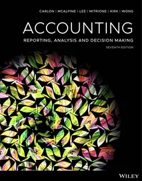

---

**Time:** 11:23:35 (Asia/Tehran)  
**Blog:** yoyoloit  

**Title:** Halliday's Fundamentals of Physics, 1st Australian & New Zealand Edition  

**Details:** English | 2021 | ISBN: 0730382877 | 1168 pages | True PDF | 19.6 MB  

**Link:** http://zavat.pw/ebooks/0730382877.html  

---

**Time:** 11:23:35 (Asia/Tehran)  
**Blog:** yoyoloit  

**Title:** Accounting, 11th Edition  

**Details:** English | 2021 | ISBN: 0730382737 | 1017 pages | True PDF | 57.65 MB  

**Link:** http://zavat.pw/ebooks/0730382737.html  

---

**Time:** 11:23:35 (Asia/Tehran)  
**Blog:** yoyoloit  

**Title:** Human Resource Management, 10th Edition  

**Details:** English | 2021 | ISBN: 0730385353 | 624 pages | True PDF | 5.99 MB  

**Link:** http://zavat.pw/ebooks/0730385353a.html  

---

**Time:** 11:23:35 (Asia/Tehran)  
**Blog:** yoyoloit  

**Title:** Festival & Special Event Management, Essentials Edition  

**Details:** English | 2021 | ISBN: 0730369404 | 434 pages | True PDF | 11.25 MB  

**Link:** http://zavat.pw/ebooks/0730369404.html  

---

**Time:** 11:23:35 (Asia/Tehran)  
**Blog:** yoyoloit  

**Title:** Understanding Databases: Concepts and Practice  

**Details:** English | 2021 | ISBN: 1119580641 | 317 pages | True PDF | 5.09 MB  

**Link:** http://zavat.pw/ebooks/1119580641.html  

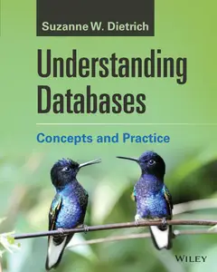

---

**Time:** 11:23:35 (Asia/Tehran)  
**Blog:** yoyoloit  

**Title:** Advanced Engineering Economics, 2nd Edition  

**Details:** English | 2021 | ISBN: 1119691966 | 814 pages | True PDF | 16.59 MB  

**Link:** http://zavat.pw/ebooks/1119691966.html  

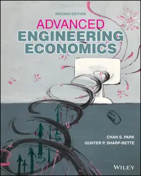

---

**Time:** 11:23:35 (Asia/Tehran)  
**Blog:** yoyoloit  

**Title:** Small Business: Creating Value Through Entrepreneurship  

**Details:** English | 2021 | ISBN: 1119591775 | 466 pages | True PDF | 16.78 MB  

**Link:** http://zavat.pw/ebooks/1119591775.html  

---

**Time:** 11:23:35 (Asia/Tehran)  
**Blog:** yoyoloit  

**Title:** Auditing: A Practical Approach with Data Analytics, 2nd Edition  

**Details:** English | 2021 | ISBN: 1119785995 | 813 pages | True PDF | 17.27 MB  

**Link:** http://zavat.pw/ebooks/1119785995.html  

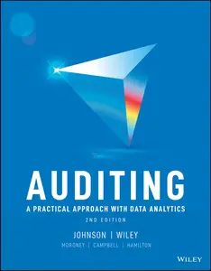

---

**Time:** 11:23:35 (Asia/Tehran)  
**Blog:** yoyoloit  

**Title:** Bread: A Baker's Book of Techniques and Recipes, 3rd Edition  

**Details:** English | 2021 | ISBN: 1119577519 | 530 pages | True PDF | 143.09 MB  

**Link:** http://zavat.pw/ebooks/1119577519a.html  

---

**Time:** 11:23:35 (Asia/Tehran)  
**Blog:** yoyoloit  

**Title:** Fundamentals of Modern Manufacturing: Materials, Processes and Systems, International Adaptation, 7th Edition  

**Details:** English | 2021 | ISBN: 1119706424 | 1011 pages | True PDF | 63.13 MB  

**Link:** http://zavat.pw/ebooks/1119706424.html  

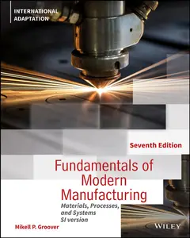

---

**Time:** 11:23:35 (Asia/Tehran)  
**Blog:** yoyoloit  

**Title:** Exploring Health Psychology  

**Details:** English | 2021 | ISBN: 1119760933 | 541 pages | True PDF | 46.69 MB  

**Link:** http://zavat.pw/ebooks/1119760933.html  

---

**Time:** 11:23:35 (Asia/Tehran)  
**Blog:** yoyoloit  

**Title:** Managing Innovation : Integrating Technological, Market and Organizational Change, 7th Edition  

**Details:** English | 2021 | ISBN: 1119713307 | 627 pages | True PDF | 10.77 MB  

**Link:** http://zavat.pw/ebooks/1119713307a.html  

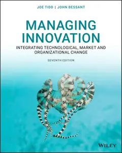

---

**Time:** 11:23:35 (Asia/Tehran)  
**Blog:** hill0  

**Title:** Intelligente Optimierung mit dem Bienenalgorithmus  

**Details:** Deutsch | 2026 | ISBN: 303214423X | 306 Pages | PDF (True) | 12 MB  

**Link:** http://zavat.pw/ebooks/303214423X.html  

---

**Time:** 11:23:35 (Asia/Tehran)  
**Blog:** hill0  

**Title:** Pneumologie  

**Details:** Deutsch | 2026 | ISBN: 3662714434 | 337 Pages | PDF (True) | 58 MB  

**Link:** http://zavat.pw/ebooks/3662714434.html  

---

**Time:** 11:23:35 (Asia/Tehran)  
**Blog:** hill0  

**Title:** Keywords Kennzahlen Retail Management  

**Details:** Deutsch | 2026 | ISBN: 3658521724 | 287 Pages | PDF (True) | 6 MB  

**Link:** http://zavat.pw/ebooks/3658521724.html  

---

**Time:** 11:23:35 (Asia/Tehran)  
**Blog:** hill0  

**Title:** Le Temps - 24 Juillet 2026  

**Details:** Français | 18 pages | True PDF | 8 MB  

**Link:** http://zavat.pw/newspapers/le-temps-20260724.html  

---

**Time:** 11:23:35 (Asia/Tehran)  
**Blog:** hill0  

**Title:** Frankfurter Allgemeine Zeitung - 24 Juli 2026  

**Details:** Deutsch | 42 pages | True PDF | 11 MB  

**Link:** http://zavat.pw/newspapers/FAZ-24-07-26.html  

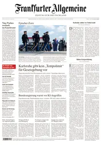

---

**Time:** 11:23:35 (Asia/Tehran)  
**Blog:** hill0  

**Title:** Süddeutsche Zeitung - 24 Juli 2026  

**Details:** Deutsch | 24 pages | True PDF | 6 MB  

**Link:** http://zavat.pw/newspapers/SZ-240726.html  

---

**Time:** 11:23:35 (Asia/Tehran)  
**Blog:** hill0  

**Title:** The Microsoft AI Insider’s Playbook  

**Details:** English | 2026 | ASIN: B0GRZ3BBB8 | 670 Pages | PDF EPUB (True) | 8 MB  

**Link:** http://zavat.pw/ebooks/B0GRZ3BBB8.html  

---

**Time:** 11:23:35 (Asia/Tehran)  
**Blog:** crazy-slim  

**Title:** 週刊アサヒ芸能 - 4 August 2026  

**Details:** 日本語 | 156 pages | True PDF | 194.2 MB  

**Link:** http://zavat.pw/magazines/%E9%80%B1%E5%88%8A%E3%82%A2%E3%82%B5%E3%83%92%E8%8A%B8%E8%83%BD4August2026-77959.html  

---

**Time:** 11:23:35 (Asia/Tehran)  
**Blog:** crazy-slim  

**Title:** 週刊GoodsPress - July 24, 2026  

**Details:** 日本語 | 156 pages | True PDF | 145.3 MB  

**Link:** http://zavat.pw/magazines/%E9%80%B1%E5%88%8AGoodsPressJuly242026-35958.html  

---

**Time:** 11:23:35 (Asia/Tehran)  
**Blog:** crazy-slim  

**Title:** Tabletop Gaming - August 2026  

**Details:** English | 84 pages | True PDF | 42.0 MB  

**Link:** http://zavat.pw/magazines/TabletopGamingAugust2026-09607.html  

---

**Time:** 11:23:35 (Asia/Tehran)  
**Blog:** crazy-slim  

**Title:** The Guardian Weekly - 24 July 2026  

**Details:** English | 64 pages | True PDF | 27.6 MB  

**Link:** http://zavat.pw/magazines/TheGuardianWeekly24July2026-72939.html  

---

**Time:** 11:23:35 (Asia/Tehran)  
**Blog:** crazy-slim  

**Title:** Cape Times - 24 July 2026  

**Details:** English | 16 pages | True PDF | 20.0 MB  

**Link:** http://zavat.pw/newspapers/CapeTimes24July2026-72772.html  

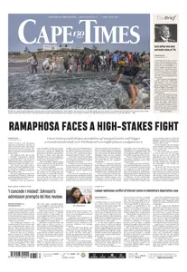

---

**Time:** 11:23:35 (Asia/Tehran)  
**Blog:** crazy-slim  

**Title:** Washingtonian - August 2026  

**Details:** English | 156 pages | True PDF | 201.8 MB  

**Link:** http://zavat.pw/magazines/WashingtonianAugust2026-80140.html  

---

**Time:** 11:23:35 (Asia/Tehran)  
**Blog:** crazy-slim  

**Title:** Revolver - Summer 2026  

**Details:** English | 104 pages | PDF | 60.4 MB  

**Link:** http://zavat.pw/magazines/RevolverSummer2026-42193.html  

---

**Time:** 11:23:35 (Asia/Tehran)  
**Blog:** crazy-slim  

**Title:** Doctor Who Magazine - August 2026  

**Details:** English | 104 pages | True PDF | 141.5 MB  

**Link:** http://zavat.pw/magazines/DoctorWhoMagazineAugust2026-79409.html  

---

**Time:** 11:23:35 (Asia/Tehran)  
**Blog:** crazy-slim  

**Title:** The Guardian USA - July 24, 2026  

**Details:** English | 71 pages | PDF | 193.4 MB  

**Link:** http://zavat.pw/newspapers/TheGuardianUSAJuly242026-39365.html  

---

**Time:** 11:23:35 (Asia/Tehran)  
**Blog:** crazy-slim  

**Title:** Focus Money - 24 Juli 2026  

**Details:** Deutsch | 108 pages | True PDF | 46.2 MB  

**Link:** http://zavat.pw/magazines/FocusMoney24Juli2026-38259.html  

---

**Time:** 11:23:35 (Asia/Tehran)  
**Blog:** crazy-slim  

**Title:** Corriere dello Sport Stadio - 24 Luglio 2026  

**Details:** Italiano | 40 pages | PDF | 86.2 MB  

**Link:** http://zavat.pw/newspapers/CorrieredelloSportStadio24Luglio2026-46485.html  

---

**Time:** 11:23:35 (Asia/Tehran)  
**Blog:** crazy-slim  

**Title:** California Post - July 24, 2026  

**Details:** English | 56 pages | PDF | 99.7 MB  

**Link:** http://zavat.pw/newspapers/CaliforniaPostJuly242026-57420.html  

---

**Time:** 11:23:35 (Asia/Tehran)  
**Blog:** crazy-slim  

**Title:** Focus - 25 Juli 2026  

**Details:** Deutsch | 110 pages | True PDF | 59.9 MB  

**Link:** http://zavat.pw/magazines/Focus25Juli2026-54355.html  

---

**Time:** 11:23:35 (Asia/Tehran)  
**Blog:** crazy-slim  

**Title:** L'Espresso - 24 Luglio 2026  

**Details:** Italiano | 124 pages | True PDF | 9.2 MB  

**Link:** http://zavat.pw/magazines/LEspresso24Luglio2026-18423.html  

---

**Time:** 11:23:35 (Asia/Tehran)  
**Blog:** crazy-slim  

**Title:** Il Tempo - 24 Luglio 2026  

**Details:** Italiano | 32 pages | PDF | 77.3 MB  

**Link:** http://zavat.pw/newspapers/IlTempo24Luglio2026-17851.html  

---

**Time:** 08:56:50 (Asia/Tehran)  
**Blog:** AvaxGenius  

**Title:** Flight International - July 2026  

**Details:** English | True PDF | 68 Pages | 11.8 MB  

**Link:** http://zavat.pw/magazines/FlightInternationalJuly2026.html  

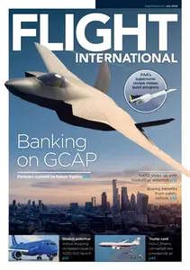

---

**Time:** 08:56:50 (Asia/Tehran)  
**Blog:** AvaxGenius  

**Title:** Fitting Linear Models: An Application of Conjugate Gradient Algorithms  

**Details:** English | PDF | 1982 | 208 Pages | ISBN : 0387907467 | 17.3 MB  

**Link:** http://zavat.pw/ebooks/03879067467.html  

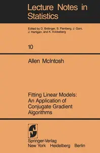

---

**Time:** 08:56:50 (Asia/Tehran)  
**Blog:** AvaxGenius  

**Title:** Control of Manipulation Robots: Theory and Application  

**Details:** English | PDF | 1982 | 379 Pages | ISBN : 3642818595 | 56.4 MB  

**Link:** http://zavat.pw/ebooks/36428148595.html  

---

**Time:** 08:56:50 (Asia/Tehran)  
**Blog:** AvaxGenius  

**Title:** Numerical Solution of Partial Differential Equations  

**Details:** English | PDF | 1981 | 550 Pages | ISBN : 0387905502 | 22.7 MB  

**Link:** http://zavat.pw/ebooks/03587905502.html  

---

**Time:** 08:56:50 (Asia/Tehran)  
**Blog:** AvaxGenius  

**Title:** The Monte Carlo Methods in Atmospheric Optics  

**Details:** English | PDF | 1980 | 218 Pages | ISBN : 3662135035 | 14.8 MB  

**Link:** http://zavat.pw/ebooks/36621355035.html  

---

**Time:** 08:56:50 (Asia/Tehran)  
**Blog:** AvaxGenius  

**Title:** Atom - Molecule Collision Theory: A Guide for the Experimentalist  

**Details:** English | PDF | 1979 | 785 Pages | ISBN : 0306401215 | 73.4 MB  

**Link:** http://zavat.pw/ebooks/03064041215.html  

---

**Time:** 08:56:50 (Asia/Tehran)  
**Blog:** AvaxGenius  

**Title:** Stochastic Approximation Methods for Constrained and Unconstrained Systems  

**Details:** English | PDF | 1978 | 273 Pages | ISBN : 0387903410 | 12.6 MB  

**Link:** http://zavat.pw/ebooks/03879403410.html  

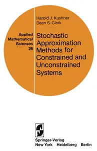

---

**Time:** 08:56:50 (Asia/Tehran)  
**Blog:** AvaxGenius  

**Title:** The Computation of Fixed Points and Applications  

**Details:** English | PDF | 1976 | 138 Pages | ISBN : 3540076859 | 7.1 MB  

**Link:** http://zavat.pw/ebooks/35400576859.html  

---

**Time:** 08:56:50 (Asia/Tehran)  
**Blog:** AvaxGenius  

**Title:** Stochastic Processes in Queueing Theory  

**Details:** English | PDF | 1976 | 291 Pages | ISBN : 1461298687 | 35.2 MB  

**Link:** http://zavat.pw/ebooks/14612958687.html  

---

**Time:** 08:56:50 (Asia/Tehran)  
**Blog:** AvaxGenius  

**Title:** Handbook for Automatic Computation Volume II: Linear Algebra  

**Details:** English | PDF | 1971 | 450 Pages | ISBN : 3642869424 | 33.9 MB  

**Link:** http://zavat.pw/ebooks/36424869424.html  

---

**Time:** 08:56:50 (Asia/Tehran)  
**Blog:** AvaxGenius  

**Title:** Optimal Design: An Introduction to the Theory for Parameter Estimation  

**Details:** English | PDF | 1980 | 94 Pages | ISBN : 9400959141 | 10.6 MB  

**Link:** http://zavat.pw/ebooks/94009592141.html  

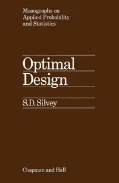

---

**Time:** 08:56:50 (Asia/Tehran)  
**Blog:** AvaxGenius  

**Title:** Walking Machines: An Introduction to Legged Robots  

**Details:** English | PDF | 1985 | 184 Pages | ISBN : 146846860X | 16.1 MB  

**Link:** http://zavat.pw/ebooks/1456846860X.html  

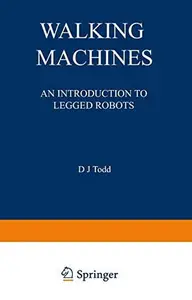

---

**Time:** 08:56:50 (Asia/Tehran)  
**Blog:** AvaxGenius  

**Title:** The Finite Element Method in Thermomechanics  

**Details:** English | PDF | 1986 | 407 Pages | ISBN : 9401160007 | 28.3 MB  

**Link:** http://zavat.pw/ebooks/94015160007.html  

---

**Time:** 08:56:50 (Asia/Tehran)  
**Blog:** crazy-slim  

**Title:** The Independent - 23 July 2026  

**Details:** English | 123 pages | True PDF | 54.1 MB  

**Link:** http://zavat.pw/newspapers/TheIndependent23July2026-45681.html  

---

**Time:** 08:56:50 (Asia/Tehran)  
**Blog:** crazy-slim  

**Title:** The Guardian - 24 July 2026  

**Details:** English | 64 pages | True PDF | 47.8 MB  

**Link:** http://zavat.pw/newspapers/TheGuardian24July2026-56586.html  

---

**Time:** 08:56:50 (Asia/Tehran)  
**Blog:** crazy-slim  

**Title:** Total Carp - August 2026  

**Details:** English | 132 pages | True PDF | 57.3 MB  

**Link:** http://zavat.pw/magazines/TotalCarpAugust2026-63347.html  

---

**Time:** 08:56:50 (Asia/Tehran)  
**Blog:** crazy-slim  

**Title:** Fast Bikes UK - September 2026  

**Details:** English | 100 pages | True PDF | 71.3 MB  

**Link:** http://zavat.pw/magazines/FastBikesUKSeptember2026-55510.html  

---

**Time:** 08:56:50 (Asia/Tehran)  
**Blog:** crazy-slim  

**Title:** The Times Literary Supplement - 24 July 2026  

**Details:** English | 48 pages | True PDF | 41.3 MB  

**Link:** http://zavat.pw/magazines/TheTimesLiterarySupplement24July2026-90050.html  

---

**Time:** 08:56:50 (Asia/Tehran)  
**Blog:** crazy-slim  

**Title:** Cambridge Edition - Issue 3 2026  

**Details:** English | 84 pages | True PDF | 49.9 MB  

**Link:** http://zavat.pw/magazines/CambridgeEditionIssue32026-19073.html  

---

**Time:** 08:56:50 (Asia/Tehran)  
**Blog:** crazy-slim  

**Title:** The Week UK - 25 July 2026  

**Details:** English | 44 pages | True PDF | 16.8 MB  

**Link:** http://zavat.pw/magazines/TheWeekUK25July2026-54931.html  

---

**Time:** 08:56:50 (Asia/Tehran)  
**Blog:** crazy-slim  

**Title:** China Report - August 2026  

**Details:** English | 68 pages | True PDF | 28.4 MB  

**Link:** http://zavat.pw/magazines/ChinaReportAugust2026-33338.html  

---

**Time:** 08:56:50 (Asia/Tehran)  
**Blog:** crazy-slim  

**Title:** Newsweek USA - July 31, 2026  

**Details:** English | 52 pages | True PDF | 33.1 MB  

**Link:** http://zavat.pw/magazines/NewsweekUSAJuly312026-23722.html  

---

**Time:** 08:56:50 (Asia/Tehran)  
**Blog:** crazy-slim  

**Title:** CARPology Magazine - August 2026  

**Details:** English | 132 pages | True PDF | 58.7 MB  

**Link:** http://zavat.pw/magazines/CARPologyMagazineAugust2026-74887.html  

---

**Time:** 08:56:50 (Asia/Tehran)  
**Blog:** crazy-slim  

**Title:** Libero - 24 Luglio 2026  

**Details:** Italiano | 40 pages | PDF | 86.9 MB  

**Link:** http://zavat.pw/newspapers/Libero24Luglio2026-74273.html  

---

**Time:** 08:56:50 (Asia/Tehran)  
**Blog:** crazy-slim  

**Title:** TuttoSport - 24 Luglio 2026  

**Details:** Italiano | 40 pages | True PDF | 26.4 MB  

**Link:** http://zavat.pw/newspapers/TuttoSport24Luglio2026-65974.html  

---

**Time:** 08:56:50 (Asia/Tehran)  
**Blog:** crazy-slim  

**Title:** El País - 24 Julio 2026  

**Details:** Español | 48 pages | True PDF | 16.4 MB  

**Link:** http://zavat.pw/newspapers/ElPa%C3%ADs24Julio2026-81198.html  

---

**Time:** 08:56:50 (Asia/Tehran)  
**Blog:** crazy-slim  

**Title:** Quotidiano di Puglia Taranto - 24 Luglio 2026  

**Details:** Italiano | 32 pages | True PDF | 13.5 MB  

**Link:** http://zavat.pw/newspapers/QuotidianodiPugliaTaranto24Luglio2026-90907.html  

---

**Time:** 08:56:50 (Asia/Tehran)  
**Blog:** crazy-slim  

**Title:** Quotidiano di Puglia Lecce - 24 Luglio 2026  

**Details:** Italiano | 32 pages | True PDF | 14.1 MB  

**Link:** http://zavat.pw/newspapers/QuotidianodiPugliaLecce24Luglio2026-74906.html  

---

**Time:** 05:30:31 (Asia/Tehran)  
**Blog:** IrGens  

**Title:** Aggregate and Compare Data with Elasticsearch Queries  

**Details:** .MP4, AVC, 1920x1080, 30 fps | English, AAC, 2 Ch | 54m | 131 MB  

**Link:** http://zavat.pw/ebooks/elasticsearch-aggregate-compare-data.html  

---

**Time:** 05:30:31 (Asia/Tehran)  
**Blog:** IrGens  

**Title:** Stream Processing Frameworks: Cloud-native Tools  

**Details:** .MP4, AVC, 1920x1080, 30 fps | English, AAC, 2 Ch | 57m | 179 MB  

**Link:** http://zavat.pw/ebooks/stream-processing-frameworks-cloud-native-tools.html  

---

**Time:** 05:30:31 (Asia/Tehran)  
**Blog:** IrGens  

**Title:** Microsoft Project Foundations  

**Details:** .MP4, AVC, 1920x1080, 30 fps | English, AAC, 2 Ch | 1h 22m | 784 MB  

**Link:** http://zavat.pw/ebooks/microsoft-project-foundations.html  

---

**Time:** 05:30:31 (Asia/Tehran)  
**Blog:** IrGens  

**Title:** Docker for Local AI App Development: Build Lightweight, Containerized AI Applications  

**Details:** .MP4, AVC, 1280x720, 30 fps | English, AAC, 2 Ch | 2h 11m | 287 MB  

**Link:** http://zavat.pw/ebooks/docker-for-local-ai-app-development-build-lightweight-containerized-ai-applications.html  

---

**Time:** 05:30:31 (Asia/Tehran)  
**Blog:** IrGens  

**Title:** AI Risk and Regulation Essentials for GRC Engineers  

**Details:** .MP4, AVC, 1280x720, 30 fps | English, AAC, 2 Ch | 38m | 63.3 MB  

**Link:** http://zavat.pw/ebooks/ai-risk-and-regulation-essentials-for-grc-engineers.html  

---

**Time:** 05:30:31 (Asia/Tehran)  
**Blog:** IrGens  

**Title:** Deep Learning: Getting Started [Released: 7/23/2026]  

**Details:** .MP4, AVC, 1280x720, 30 fps | English, AAC, 2 Ch | 1h 39m | 227 MB  

**Link:** http://zavat.pw/ebooks/deep-learning-getting-started-42471011.html  

---

**Time:** 05:30:31 (Asia/Tehran)  
**Blog:** IrGens  

**Title:** Tableau for Data Visualization [Released: 7/23/2026]  

**Details:** .MP4, AVC, 1280x720, 30 fps | English, AAC, 2 Ch | 9h 15m | 1.29 GB  

**Link:** http://zavat.pw/ebooks/tableau-for-data-visualization.html  

---

**Time:** 05:30:31 (Asia/Tehran)  
**Blog:** IrGens  

**Title:** Hermes Agent: From Install to Advanced Automation  

**Details:** .MP4, AVC, 1920x1080, 30 fps | English, AAC, 2 Ch | 6h 41m | 4.32 GB  

**Link:** http://zavat.pw/ebooks/hermes-agent-from-install-to-advanced-automation.html  

---

**Time:** 05:30:31 (Asia/Tehran)  
**Blog:** AvaxGenius  

**Title:** Synthesis of Digital Automata / Problemy Sinteza Tsifrovykh Avtomatov / Проƃлемы Синтеза Цифровых Автоматов  

**Details:** English | PDF | 1995 | 181 Pages | ISBN : 1468490354 | 20.3 MB  

**Link:** http://zavat.pw/ebooks/1468490354.html  

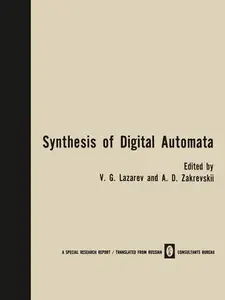

---

**Time:** 05:30:31 (Asia/Tehran)  
**Blog:** AvaxGenius  

**Title:** Introduction to Optimization Methods  

**Details:** English | PDF | 1974 | 214 Pages | ISBN : 0412110407 | 16.5 MB  

**Link:** http://zavat.pw/ebooks/04125110407.html  

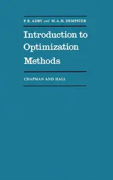

---

**Time:** 05:30:31 (Asia/Tehran)  
**Blog:** AvaxGenius  

**Title:** Geometry of Quantum Theory: Volume 1  

**Details:** English | PDF | 1968 | 204 Pages | ISBN : 146157708X | 15.4 MB  

**Link:** http://zavat.pw/ebooks/14615557708X.html  

---

**Time:** 05:30:31 (Asia/Tehran)  
**Blog:** AvaxGenius  

**Title:** Econometrics  

**Details:** English | PDF | 1990 | 296 Pages | ISBN : 0333495438 | 27.7 MB  

**Link:** http://zavat.pw/ebooks/03335495438.html  

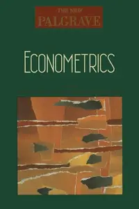

---

**Time:** 02:19:17 (Asia/Tehran)  
**Blog:** hill0  

**Title:** Mastering Tableau 2026 (5th Edition)  

**Details:** English | 2026 | ISBN: 9781806100712 | 738 Pages | PDF (True) | 91 MB  

**Link:** http://zavat.pw/ebooks/9781806100712.html  

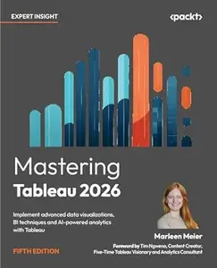

---

**Time:** 02:19:17 (Asia/Tehran)  
**Blog:** hill0  

**Title:** ADHD Across the Lifespan: Disability, Mental Health, and Social Impacts  

**Details:** English | 2026 | ISBN: 9819587115 | 243 Pages | PDF EPUB (True) | 4 MB  

**Link:** http://zavat.pw/ebooks/9819587115.html  

---

**Time:** 02:19:17 (Asia/Tehran)  
**Blog:** hill0  

**Title:** Historical City and Visual Representation  

**Details:** English | 2026 | ISBN: 303221159X | 178 Pages | PDF EPUB (True) | 30 MB  

**Link:** http://zavat.pw/ebooks/303221159X.html  

---

**Time:** 02:19:17 (Asia/Tehran)  
**Blog:** hill0  

**Title:** Natural Biopolymeric Composites for Biomedical Research  

**Details:** English | 2026 | ISBN: 9819599083 | 493 Pages | PDF EPUB (True) | 76 MB  

**Link:** http://zavat.pw/ebooks/9819599083.html  

---

**Time:** 02:19:17 (Asia/Tehran)  
**Blog:** hill0  

**Title:** Rust for Machine Learning (Early Release)  

**Details:** English | 2026 | ISBN: 0642572279820 | 68 Pages | EPUB | 5 MB  

**Link:** http://zavat.pw/ebooks/0642572279820.html  

