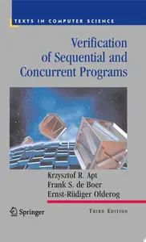
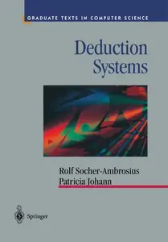
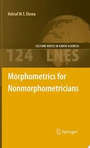
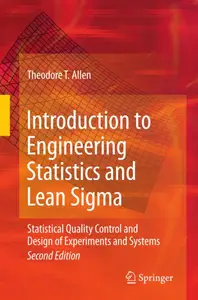
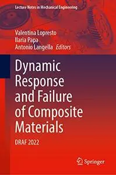
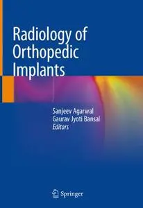
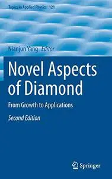
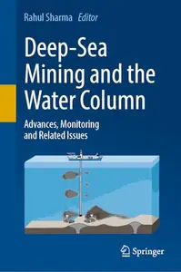
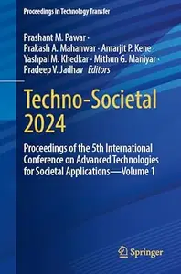

# Zavat feed - 2026-07-26

---

**Time:** 08:23:36 (Asia/Tehran)  
**Blog:** AvaxGenius  

**Title:** Proceedings of the 2nd International Conference on Green Energy Conversion System (Repost)  

**Details:** English | EPUB (True) | 2024 | 773 Pages | ISBN : 9819761476 | 152.5 MB  

**Link:** http://zavat.pw/ebooks/981297614576.html  

---

**Time:** 08:23:36 (Asia/Tehran)  
**Blog:** AvaxGenius  

**Title:** Digital TV and Wireless Multimedia Communication (Repost)  

**Details:** English | PDF | 2021 | 457 Pages | ISBN : 9811611939 | 101.2 MB  

**Link:** http://zavat.pw/ebooks/398116119339.html  

---

**Time:** 08:23:36 (Asia/Tehran)  
**Blog:** AvaxGenius  

**Title:** Singapore’s Park System Master Planning: A Nation Building Tool to Construct Narratives in Post-Colonial Countries (Repost)  

**Details:** English | EPUB | 2020 | 381 Pages | ISBN : 9811367442 | 161.27 MB  

**Link:** http://zavat.pw/ebooks/981135675442.html  

---

**Time:** 08:23:36 (Asia/Tehran)  
**Blog:** AvaxGenius  

**Title:** Logic for Applications  

**Details:** English | PDF (True) | 1997 | 466 Pages | ISBN : 0387948937 | 92.8 MB  

**Link:** http://zavat.pw/ebooks/03879484937.html  

---

**Time:** 08:23:36 (Asia/Tehran)  
**Blog:** AvaxGenius  

**Title:** Verification of Sequential and Concurrent Programs  

**Details:** English | PDF (True) | 2009 | 511 Pages | ISBN : 1447125134 | 3.9 MB  

**Link:** http://zavat.pw/ebooks/14447125134.html  

---

**Time:** 08:23:36 (Asia/Tehran)  
**Blog:** AvaxGenius  

**Title:** Deduction Systems  

**Details:** English | PDF (True) | 1997 | 218 Pages | ISBN : 1461274796 | 20.1 MB  

**Link:** http://zavat.pw/ebooks/14612764796.html  

---

**Time:** 08:23:36 (Asia/Tehran)  
**Blog:** AvaxGenius  

**Title:** Theory of Computation  

**Details:** English | PDF (True) | 2006 | 422 Pages | ISBN : 1849965714 | 2.8 MB  

**Link:** http://zavat.pw/ebooks/18499645714.html  

---

**Time:** 08:23:36 (Asia/Tehran)  
**Blog:** AvaxGenius  

**Title:** Guide to Intelligent Data Analysis: How to Intelligently Make Sense of Real Data  

**Details:** English | PDF(True) | 2010 | 398 Pages | ISBN : 184882260X | 6.5 MB  

**Link:** http://zavat.pw/ebooks/1848852260X.html  

---

**Time:** 08:23:36 (Asia/Tehran)  
**Blog:** AvaxGenius  

**Title:** Ethical and Social Issues in the Information Age  

**Details:** English | PDF (True) | 2010 | 342 Pages | ISBN : 1849960372 | 2.2 MB  

**Link:** http://zavat.pw/ebooks/18469960372.html  

---

**Time:** 08:23:36 (Asia/Tehran)  
**Blog:** AvaxGenius  

**Title:** Formal Languages and Compilation  

**Details:** English | PDF(True) | 2009 | 370 Pages | ISBN : 1848820496 | 3.2 MB  

**Link:** http://zavat.pw/ebooks/18486820496.html  

---

**Time:** 08:23:36 (Asia/Tehran)  
**Blog:** AvaxGenius  

**Title:** Ethical and Social Issues in the Information Age  

**Details:** English | PDF | 2003 | 388 Pages | ISBN : 038795421X | 3.6 MB  

**Link:** http://zavat.pw/ebooks/0387595421X.html  

---

**Time:** 08:23:36 (Asia/Tehran)  
**Blog:** AvaxGenius  

**Title:** Refinement Calculus: A Systematic Introduction  

**Details:** English | PDF | 1998 | 514 Pages | ISBN : 0387984178 | 34.5 MB  

**Link:** http://zavat.pw/ebooks/03879845178.html  

---

**Time:** 08:23:36 (Asia/Tehran)  
**Blog:** AvaxGenius  

**Title:** Fundamentals of Predictive Text Mining  

**Details:** English | PDF | 2010 | 231 Pages | ISBN : 1849962251 | 3.5 MB  

**Link:** http://zavat.pw/ebooks/184995622551.html  

---

**Time:** 08:23:36 (Asia/Tehran)  
**Blog:** AvaxGenius  

**Title:** Morphometrics for Nonmorphometricians  

**Details:** English | PDF (True) | 2010 | 363 Pages | ISBN : 3540958525 | 7.9 MB  

**Link:** http://zavat.pw/ebooks/35409558525.html  

---

**Time:** 08:23:36 (Asia/Tehran)  
**Blog:** AvaxGenius  

**Title:** Introduction to Engineering Statistics and Lean Sigma: Statistical Quality Control and Design of Experiments and Systems  

**Details:** English | PDF (True) | 2010 | 573 Pages | ISBN : 184882999X | 6.9 MB  

**Link:** http://zavat.pw/ebooks/184882999XT.html  

---

**Time:** 08:23:36 (Asia/Tehran)  
**Blog:** crazy-slim  

**Title:** La Stampa Biella - 26 Luglio 2026  

**Details:** Italiano | 64 pages | True PDF | 32.8 MB  

**Link:** http://zavat.pw/newspapers/LaStampaBiella26Luglio2026-92070.html  

---

**Time:** 08:23:36 (Asia/Tehran)  
**Blog:** crazy-slim  

**Title:** La Stampa Asti - 26 Luglio 2026  

**Details:** Italiano | 64 pages | True PDF | 33.1 MB  

**Link:** http://zavat.pw/newspapers/LaStampaAsti26Luglio2026-88725.html  

---

**Time:** 08:23:36 (Asia/Tehran)  
**Blog:** crazy-slim  

**Title:** Horóscopo do Dia - 25 Julho 2026  

**Details:** Portuguese | 18 pages | True PDF | 10.9 MB  

**Link:** http://zavat.pw/magazines/Hor%C3%B3scopodoDia25Julho2026-66193.html  

---

**Time:** 08:23:36 (Asia/Tehran)  
**Blog:** crazy-slim  

**Title:** Le Journal du dimanche N.4150 - 26 Juillet 2026  

**Details:** Français | 94 pages | True PDF | 70.5 MB  

**Link:** http://zavat.pw/magazines/LeJournaldudimancheN415026Juillet2026-88119.html  

---

**Time:** 08:23:36 (Asia/Tehran)  
**Blog:** crazy-slim  

**Title:** Publishers Weekly - 27 July 2026  

**Details:** English | 94 pages | True PDF | 91.2 MB  

**Link:** http://zavat.pw/magazines/PublishersWeekly27July2026-92375.html  

---

**Time:** 08:23:36 (Asia/Tehran)  
**Blog:** crazy-slim  

**Title:** La Stampa Aosta - 26 Luglio 2026  

**Details:** Italiano | 64 pages | True PDF | 32.7 MB  

**Link:** http://zavat.pw/newspapers/LaStampaAosta26Luglio2026-88528.html  

---

**Time:** 08:23:36 (Asia/Tehran)  
**Blog:** crazy-slim  

**Title:** The Team Roping Journal - August 2026  

**Details:** English | 116 pages | True PDF | 62.2 MB  

**Link:** http://zavat.pw/magazines/TheTeamRopingJournalAugust2026-12329.html  

---

**Time:** 08:23:36 (Asia/Tehran)  
**Blog:** crazy-slim  

**Title:** La Stampa - 26 Luglio 2026  

**Details:** Italiano | 64 pages | True PDF | 32.7 MB  

**Link:** http://zavat.pw/newspapers/LaStampa26Luglio2026-99761.html  

---

**Time:** 08:23:36 (Asia/Tehran)  
**Blog:** crazy-slim  

**Title:** La Stampa Alessandria - 26 Luglio 2026  

**Details:** Italiano | 64 pages | True PDF | 32.5 MB  

**Link:** http://zavat.pw/newspapers/LaStampaAlessandria26Luglio2026-77199.html  

---

**Time:** 08:23:36 (Asia/Tehran)  
**Blog:** crazy-slim  

**Title:** la Repubblica Roma - 26 Luglio 2026  

**Details:** Italiano | 48 pages | True PDF | 45.3 MB  

**Link:** http://zavat.pw/newspapers/laRepubblicaRoma26Luglio2026-61206.html  

---

**Time:** 08:23:36 (Asia/Tehran)  
**Blog:** crazy-slim  

**Title:** la Repubblica Torino - 26 Luglio 2026  

**Details:** Italiano | 48 pages | True PDF | 44.3 MB  

**Link:** http://zavat.pw/newspapers/laRepubblicaTorino26Luglio2026-14994.html  

---

**Time:** 08:23:36 (Asia/Tehran)  
**Blog:** crazy-slim  

**Title:** la Repubblica Robinson - 26 Luglio 2026  

**Details:** Italiano | 40 pages | True PDF | 41.6 MB  

**Link:** http://zavat.pw/newspapers/laRepubblicaRobinson26Luglio2026-57025.html  

---

**Time:** 08:23:36 (Asia/Tehran)  
**Blog:** crazy-slim  

**Title:** Newsmax - August 2026  

**Details:** English | 100 pages | PDF | 76.0 MB  

**Link:** http://zavat.pw/magazines/NewsmaxAugust2026-29260.html  

---

**Time:** 08:23:36 (Asia/Tehran)  
**Blog:** crazy-slim  

**Title:** Paradise Girls Magazine - July 2026  

**Details:** English | 78 pages | True PDF | 33.7 MB  

**Link:** http://zavat.pw/magazines/ParadiseGirlsMagazineJuly2026-22533.html  

---

**Time:** 08:23:36 (Asia/Tehran)  
**Blog:** crazy-slim  

**Title:** Boating New Zealand - August 2026  

**Details:** English | 132 pages | True PDF | 79.2 MB  

**Link:** http://zavat.pw/magazines/BoatingNewZealandAugust2026-19234.html  

---

**Time:** 04:36:46 (Asia/Tehran)  
**Blog:** AvaxGenius  

**Title:** Dynamic Response and Failure of Composite Materials: DRAF 2022 (Repost)  

**Details:** English | EPUB | 2023 | 422 Pages | ISBN : 3031285468 | 103.8 MB  

**Link:** http://zavat.pw/ebooks/30312858468.html  

---

**Time:** 04:36:46 (Asia/Tehran)  
**Blog:** AvaxGenius  

**Title:** Radiology of Orthopedic Implants (Repost)  

**Details:** English | EPUB | 2018 | 198 Pages | ISBN : 3319760076 | 127.9 MB  

**Link:** http://zavat.pw/ebooks/33197670076.html  

---

**Time:** 04:36:46 (Asia/Tehran)  
**Blog:** AvaxGenius  

**Title:** Novel Aspects of Diamond: From Growth to Applications, Second Edition (Repost)  

**Details:** English | EPUB | 2019 | 507 Pages | ISBN : 3030124681 | 123.8 MB  

**Link:** http://zavat.pw/ebooks/30301246581.html  

---

**Time:** 04:36:46 (Asia/Tehran)  
**Blog:** AvaxGenius  

**Title:** Silicon Photonics IV: Innovative Frontiers (Repost)  

**Details:** English | EPUB | 2021 | 519 Pages | ISBN : 3030682218 | 119.3 MB  

**Link:** http://zavat.pw/ebooks/30306682218.html  

---

**Time:** 04:36:46 (Asia/Tehran)  
**Blog:** AvaxGenius  

**Title:** Aesthetic Facial Surgery (Repost)  

**Details:** English | EPUB | 2021 | 905 Pages | ISBN : 3030579727 | 545.9 MB  

**Link:** http://zavat.pw/ebooks/303057397275.html  

---

**Time:** 04:36:46 (Asia/Tehran)  
**Blog:** AvaxGenius  

**Title:** Deep-Sea Mining and the Water Column: Advances, Monitoring and Related Issues (Repost)  

**Details:** English | EPUB (True) | 2024 | 600 Pages | ISBN : 3031590597 | 138 MB  

**Link:** http://zavat.pw/ebooks/303315950597.html  

---

**Time:** 04:36:46 (Asia/Tehran)  
**Blog:** AvaxGenius  

**Title:** Date Palm Byproducts: A Springboard for Circular Bio Economy (Repost)  

**Details:** English | EPUB (True) | 2023 | 392 Pages | ISBN : 9819904749 | 115.9 MB  

**Link:** http://zavat.pw/ebooks/98199047649.html  

---

**Time:** 04:36:46 (Asia/Tehran)  
**Blog:** AvaxGenius  

**Title:** Explorations in the History and Heritage of Machines and Mechanisms (Repost)  

**Details:** English | EPUB (True) | 2024 | 392 Pages | ISBN : 3031548752 | 142.1 MB  

**Link:** http://zavat.pw/ebooks/303145487542.html  

---

**Time:** 04:36:46 (Asia/Tehran)  
**Blog:** AvaxGenius  

**Title:** Novel Optical Fiber Sensing Technology and Systems (Repost)  

**Details:** English | EPUB (True) | 2024 | 408 Pages | ISBN : 9819971489 | 157 MB  

**Link:** http://zavat.pw/ebooks/981935971489.html  

---

**Time:** 04:36:46 (Asia/Tehran)  
**Blog:** AvaxGenius  

**Title:** Non-Pushing PCI Techniques (Repost)  

**Details:** English | PDF | 2021 | 282 Pages | ISBN : 9811570426 | 108.46 MB  

**Link:** http://zavat.pw/ebooks/982115704265.html  

---

**Time:** 04:36:46 (Asia/Tehran)  
**Blog:** AvaxGenius  

**Title:** Satellite Monitoring of Water Resources in the Middle East (Repost)  

**Details:** English | EPUB | 2022 | 414 Pages | ISBN : 3031155483 | 153.7 MB  

**Link:** http://zavat.pw/ebooks/3031331554835.html  

---

**Time:** 04:36:46 (Asia/Tehran)  
**Blog:** AvaxGenius  

**Title:** Proceedings of the 23rd Pacific Basin Nuclear Conference, Volume 1 (Repost)  

**Details:** English | EPUB (True) | 2023 | 1179 Pages | ISBN : 9819910226 | 215.9 MB  

**Link:** http://zavat.pw/ebooks/981991430226.html  

---

**Time:** 04:36:46 (Asia/Tehran)  
**Blog:** AvaxGenius  

**Title:** Arthroplasty of the Upper Extremity: A Clinical Guide from Elbow to Fingers (Repost)  

**Details:** English | EPUB | 2021 | 368 Pages | ISBN : 3030688798 | 166.6 MB  

**Link:** http://zavat.pw/ebooks/53030688798.html  

---

**Time:** 04:36:46 (Asia/Tehran)  
**Blog:** AvaxGenius  

**Title:** Information and Communication Technology for Intelligent Systems: Proceedings of ICTIS 2020, Volume 2 (Repost)  

**Details:** English | EPUB | 2021 | 802 Pages | ISBN : 9811570612 | 102.4 MB  

**Link:** http://zavat.pw/ebooks/98115570612.html  

---

**Time:** 04:36:46 (Asia/Tehran)  
**Blog:** AvaxGenius  

**Title:** Model Tests and Numerical Simulations of Liquefaction and Lateral Spreading: LEAP-UCD-2017 (Repost)  

**Details:** English | EPUB | 2020 | 655 Pages | ISBN : 3030228177 | 195.1 MB  

**Link:** http://zavat.pw/ebooks/30530228177.html  

---

**Time:** 01:54:48 (Asia/Tehran)  
**Blog:** hill0  

**Title:** Olfactory Prosthesis: From Concept Towards Reality  

**Details:** English | 2026 | ISBN: 3032217407 | 259 Pages | PDF (True) | 11 MB  

**Link:** http://zavat.pw/ebooks/3032217407.html  

---

**Time:** 01:54:48 (Asia/Tehran)  
**Blog:** hill0  

**Title:** Techno-Societal 2024―Volume 1  

**Details:** English | 2026 | ISBN: 3032137837 | 957 Pages | PDF (True) | 53 MB  

**Link:** http://zavat.pw/ebooks/3032137837.html  

---

**Time:** 01:54:48 (Asia/Tehran)  
**Blog:** hill0  

**Title:** The Food Industry and Regional Trade Agreements  

**Details:** English | 2026 | ISBN: 3032248868 | 235 Pages | PDF EPUB (True) | 3.3 MB  

**Link:** http://zavat.pw/ebooks/3032248868.html  

---

**Time:** 01:54:48 (Asia/Tehran)  
**Blog:** hill0  

**Title:** Cancer Virus Hunters: A History of Tumor Virology  

**Details:** English | 2022 | ISBN: 1421444011 | 391 Pages | EPUB (True) | 61 MB  

**Link:** http://zavat.pw/ebooks/1421444011t.html  

