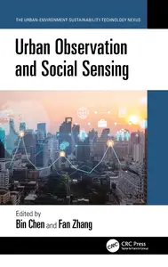
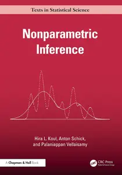
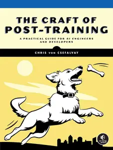
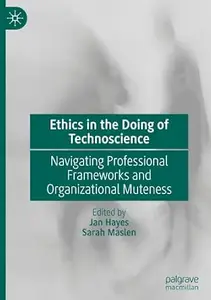
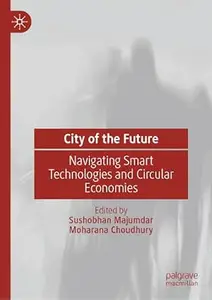
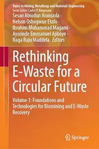
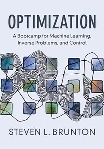
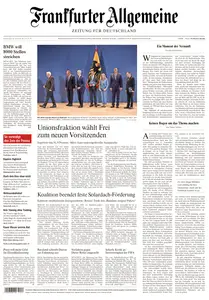
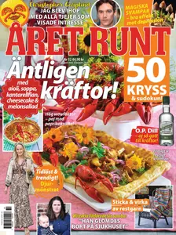
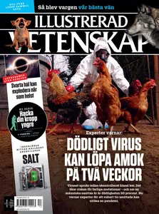

# Zavat feed - 2026-07-30

---

**Time:** 11:00:57 (Asia/Tehran)  
**Blog:** yoyoloit  

**Title:** Artificial Intelligence for Sustainable Supply Chain Management  

**Details:** English | 2026 | ISBN: 104111477X | 323 pages | True PDF EPUB | 15.75 MB  

**Link:** http://zavat.pw/ebooks/104111477X.html  

---

**Time:** 11:00:57 (Asia/Tehran)  
**Blog:** yoyoloit  

**Title:** Artificial Intelligence in Tribology  

**Details:** English | 2027 | ISBN: 1041035284 | 300 pages | True PDF EPUB | 79.97 MB  

**Link:** http://zavat.pw/ebooks/1041035284.html  

---

**Time:** 11:00:57 (Asia/Tehran)  
**Blog:** yoyoloit  

**Title:** Planning Digital Cities: Transforming Public Spaces in the Age of Technology  

**Details:** English | 2027 | ISBN: 1041191901 | 242 pages | True PDF EPUB | 29.02 MB  

**Link:** http://zavat.pw/ebooks/1041191901.html  

---

**Time:** 11:00:57 (Asia/Tehran)  
**Blog:** yoyoloit  

**Title:** Urban Observation and Social Sensing  

**Details:** English | 2027 | ISBN: 1032776536 | 181 pages | True PDF EPUB | 32.58 MB  

**Link:** http://zavat.pw/ebooks/1032776536.html  

---

**Time:** 11:00:57 (Asia/Tehran)  
**Blog:** yoyoloit  

**Title:** Symmetries of Algebraic Varieties in Two and Three Dimensions: A Computational Approach  

**Details:** English | 2027 | ISBN: 1041088205 | 330 pages | True EPUB | 13.37 MB  

**Link:** http://zavat.pw/ebooks/1041088205a.html  

---

**Time:** 11:00:57 (Asia/Tehran)  
**Blog:** yoyoloit  

**Title:** Nonparametric Inference (Chapman & Hall/CRC Texts in Statistical Science)  

**Details:** English | 2027 | ISBN: 1032956135 | 369 pages | True PDF EPUB | 9.28 MB  

**Link:** http://zavat.pw/ebooks/1032956135.html  

---

**Time:** 11:00:57 (Asia/Tehran)  
**Blog:** yoyoloit  

**Title:** The Craft of Post-Training: A Practical Guide for AI Engineers and Developers  

**Details:** English | 2026 | ISBN: 1718505205 | 434 pages | True PDF | 17.1 MB  

**Link:** http://zavat.pw/ebooks/1718505205a.html  

---

**Time:** 11:00:57 (Asia/Tehran)  
**Blog:** hill0  

**Title:** Applying Quantitative Bias Analysis to Epidemiologic Data (2nd Edition)  

**Details:** English | 2022 | ISBN: 3030826724 | 475 Pages | True EPUB | 20 MB  

**Link:** http://zavat.pw/ebooks/3030826724e.html  

---

**Time:** 11:00:57 (Asia/Tehran)  
**Blog:** hill0  

**Title:** Ethics in the Doing of Technoscience  

**Details:** English | 2026 | ISBN: 3032200016 | 301 Pages | PDF EPUB (True) | 9 MB  

**Link:** http://zavat.pw/ebooks/3032200016.html  

---

**Time:** 11:00:57 (Asia/Tehran)  
**Blog:** hill0  

**Title:** Water-oriented Design  

**Details:** English | 2026 | ISBN: 9819554489 | 295 Pages | PDF (True) | 24 MB  

**Link:** http://zavat.pw/ebooks/9819554489.html  

---

**Time:** 11:00:57 (Asia/Tehran)  
**Blog:** hill0  

**Title:** Terraform Authoring and Operations Professional Study Guide - AWS edition  

**Details:** English | 2026 | ISBN: 9781807784751 | 252 Pages | PDF EPUB (True) | 46 MB  

**Link:** http://zavat.pw/ebooks/9781807784751.html  

---

**Time:** 11:00:57 (Asia/Tehran)  
**Blog:** hill0  

**Title:** City of the Future  

**Details:** English | 2026 | ISBN: 3032180252 | 558 Pages | PDF EPUB (True) | 54 MB  

**Link:** http://zavat.pw/ebooks/3032180252.html  

---

**Time:** 11:00:57 (Asia/Tehran)  
**Blog:** hill0  

**Title:** Maternal and Child Health, Vol. 3 (2nd Edition)  

**Details:** English | 2026 | ISBN: 1071654357 | 284 Pages | PDF EPUB (True) | 29 MB  

**Link:** http://zavat.pw/ebooks/1071654357.html  

---

**Time:** 11:00:57 (Asia/Tehran)  
**Blog:** hill0  

**Title:** Handbook of Object Relations Theory  

**Details:** English | 2026 | ISBN: 3032293146 | 381 Pages | PDF EPUB (True) | 4.4 MB  

**Link:** http://zavat.pw/ebooks/3032293146.html  

---

**Time:** 11:00:57 (Asia/Tehran)  
**Blog:** hill0  

**Title:** Rethinking E-Waste for a Circular Future: Volume 1  

**Details:** English | 2026 | ISBN: 3032257239 | 535 Pages | PDF (True) | 21 MB  

**Link:** http://zavat.pw/ebooks/3032257239.html  

---

**Time:** 11:00:57 (Asia/Tehran)  
**Blog:** hill0  

**Title:** Teachers as AI Developers  

**Details:** English | 2026 | ISBN: 1009781081 | 88 Pages | PDF (True) | 4.5 MB  

**Link:** http://zavat.pw/ebooks/1009781081.html  

---

**Time:** 11:00:57 (Asia/Tehran)  
**Blog:** hill0  

**Title:** X-ray Photoelectron Spectroscopy (2nd Edition)  

**Details:** English | 2026 | ISBN: 1394269412 | 491 Pages | EPUB (True) | 23 MB  

**Link:** http://zavat.pw/ebooks/1394269412.html  

---

**Time:** 11:00:57 (Asia/Tehran)  
**Blog:** hill0  

**Title:** Optimization: A Bootcamp for Machine Learning, Inverse Problems, and Control  

**Details:** English | 2026 | ISBN: 1009755862 | 511 Pages | PDF | 55 MB  

**Link:** http://zavat.pw/ebooks/1009755862.html  

---

**Time:** 11:00:57 (Asia/Tehran)  
**Blog:** hill0  

**Title:** Le Temps - 30 Juillet 2026  

**Details:** Français | 18 pages | True PDF | 10 MB  

**Link:** http://zavat.pw/newspapers/le-temps-20260730.html  

---

**Time:** 11:00:57 (Asia/Tehran)  
**Blog:** hill0  

**Title:** Frankfurter Allgemeine Zeitung - 30 Juli 2026  

**Details:** Deutsch | 46 pages | True PDF | 14 MB  

**Link:** http://zavat.pw/newspapers/FAZ-30-07-26.html  

---

**Time:** 11:00:57 (Asia/Tehran)  
**Blog:** hill0  

**Title:** Süddeutsche Zeitung - 30 Juli 2026  

**Details:** Deutsch | 24 pages | True PDF | 5 MB  

**Link:** http://zavat.pw/newspapers/SZ-300726.html  

---

**Time:** 11:00:57 (Asia/Tehran)  
**Blog:** hill0  

**Title:** CI/CD as a Control System  

**Details:** English | 2026 | ASIN: B0GXHNV4Q2 | 409 Pages | PDF EPUB (True) | 15 MB  

**Link:** http://zavat.pw/ebooks/B0GXHNV4Q2.html  

---

**Time:** 11:00:57 (Asia/Tehran)  
**Blog:** crazy-slim  

**Title:** The World of Interiors - September 2026  

**Details:** English | 140 pages | PDF | 98.4 MB  

**Link:** http://zavat.pw/magazines/TheWorldofInteriorsSeptember2026-99119.html  

---

**Time:** 11:00:57 (Asia/Tehran)  
**Blog:** crazy-slim  

**Title:** Ulster Tatler Interiors - Summer 2026  

**Details:** English | 116 pages | True PDF | 39.1 MB  

**Link:** http://zavat.pw/magazines/UlsterTatlerInteriorsSummer2026-77576.html  

---

**Time:** 11:00:57 (Asia/Tehran)  
**Blog:** crazy-slim  

**Title:** Raspberry Pi Complete Manual - Summer 2026  

**Details:** English | 74 pages | True PDF | 48.3 MB  

**Link:** http://zavat.pw/magazines/RaspberryPiCompleteManualSummer2026-68668.html  

---

**Time:** 11:00:57 (Asia/Tehran)  
**Blog:** crazy-slim  

**Title:** Ancient Origins Magazine - July-August 2026  

**Details:** English | 138 pages | True PDF | 59.8 MB  

**Link:** http://zavat.pw/magazines/AncientOriginsMagazineJulyAugust2026-95814.html  

---

**Time:** 11:00:57 (Asia/Tehran)  
**Blog:** crazy-slim  

**Title:** International Kirmes & Park Revue - August 2026  

**Details:** English | 68 pages | PDF | 64.6 MB  

**Link:** http://zavat.pw/magazines/InternationalKirmesParkRevueAugust2026-19831.html  

---

**Time:** 11:00:57 (Asia/Tehran)  
**Blog:** crazy-slim  

**Title:** Bow International - Issue 198 2026  

**Details:** English | 52 pages | PDF | 42.8 MB  

**Link:** http://zavat.pw/magazines/BowInternationalIssue1982026-02639.html  

---

**Time:** 11:00:57 (Asia/Tehran)  
**Blog:** crazy-slim  

**Title:** Car&HiFi International - 29 July 2026  

**Details:** English | 65 pages | True PDF | 27.8 MB  

**Link:** http://zavat.pw/magazines/CarHiFiInternational29July2026-10359.html  

---

**Time:** 11:00:57 (Asia/Tehran)  
**Blog:** crazy-slim  

**Title:** Trendmagazin Küche & Bad - 30 Juli 2026  

**Details:** Deutsch | 213 pages | True PDF | 189.8 MB  

**Link:** http://zavat.pw/magazines/TrendmagazinK%C3%BCcheBad30Juli2026-52354.html  

---

**Time:** 11:00:57 (Asia/Tehran)  
**Blog:** crazy-slim  

**Title:** TV Direkt - 30 Juli 2026  

**Details:** Deutsch | 156 pages | True PDF | 87.1 MB  

**Link:** http://zavat.pw/magazines/TVDirekt30Juli2026-26168.html  

---

**Time:** 11:00:57 (Asia/Tehran)  
**Blog:** crazy-slim  

**Title:** Super TV - 30 Juli 2026  

**Details:** Deutsch | 100 pages | PDF | 141.5 MB  

**Link:** http://zavat.pw/magazines/SuperTV30Juli2026-85165.html  

---

**Time:** 11:00:57 (Asia/Tehran)  
**Blog:** crazy-slim  

**Title:** TV14 - 30 Juli 2026  

**Details:** Deutsch | 156 pages | True PDF | 43.5 MB  

**Link:** http://zavat.pw/magazines/TV1430Juli2026-15656.html  

---

**Time:** 11:00:57 (Asia/Tehran)  
**Blog:** crazy-slim  

**Title:** TV Klar - 30 Juli 2026  

**Details:** Deutsch | 72 pages | True PDF | 16.4 MB  

**Link:** http://zavat.pw/magazines/TVKlar30Juli2026-96542.html  

---

**Time:** 11:00:57 (Asia/Tehran)  
**Blog:** crazy-slim  

**Title:** SuperIllu - 30 Juli 2026  

**Details:** Deutsch | 92 pages | True PDF | 75.8 MB  

**Link:** http://zavat.pw/magazines/SuperIllu30Juli2026-17370.html  

---

**Time:** 11:00:57 (Asia/Tehran)  
**Blog:** crazy-slim  

**Title:** Kirmes & Park Revue - August 2026  

**Details:** Deutsch | 134 pages | PDF | 155.8 MB  

**Link:** http://zavat.pw/magazines/KirmesParkRevueAugust2026-53004.html  

---

**Time:** 11:00:57 (Asia/Tehran)  
**Blog:** crazy-slim  

**Title:** The Gap - 30 Juli 2026  

**Details:** Deutsch | 52 pages | True PDF | 23.8 MB  

**Link:** http://zavat.pw/magazines/TheGap30Juli2026-21524.html  

---

**Time:** 08:23:00 (Asia/Tehran)  
**Blog:** crazy-slim  

**Title:** Historie Norge - 30 Juli 2026  

**Details:** Norsk | 84 pages | PDF | 96.9 MB  

**Link:** http://zavat.pw/magazines/HistorieNorge30Juli2026-72917.html  

---

**Time:** 08:23:00 (Asia/Tehran)  
**Blog:** crazy-slim  

**Title:** Win Magazine Hacker N.2 - Agosto-Settembre 2026  

**Details:** Italiano | 84 pages | True PDF | 72.9 MB  

**Link:** http://zavat.pw/magazines/WinMagazineHackerN2AgostoSettembre2026-53395.html  

---

**Time:** 08:23:00 (Asia/Tehran)  
**Blog:** crazy-slim  

**Title:** Världens Historia - 30 Juli 2026  

**Details:** Svenska | 84 pages | PDF | 98.4 MB  

**Link:** http://zavat.pw/magazines/V%C3%A4rldensHistoria30Juli2026-72409.html  

---

**Time:** 08:23:00 (Asia/Tehran)  
**Blog:** crazy-slim  

**Title:** Villanytt - 25 Juli 2026  

**Details:** Svenska | 140 pages | PDF | 138.4 MB  

**Link:** http://zavat.pw/magazines/Villanytt25Juli2026-12019.html  

---

**Time:** 08:23:00 (Asia/Tehran)  
**Blog:** crazy-slim  

**Title:** Classic Rock Story N.3 - Agosto-Settembre 2026  

**Details:** Italiano | 116 pages | True PDF | 42.1 MB  

**Link:** http://zavat.pw/magazines/ClassicRockStoryN3AgostoSettembre2026-81165.html  

---

**Time:** 08:23:00 (Asia/Tehran)  
**Blog:** crazy-slim  

**Title:** Året Runt - 5 Augusti 2026  

**Details:** Svenska | 112 pages | True PDF | 55.9 MB  

**Link:** http://zavat.pw/magazines/%C3%85retRunt5Augusti2026-64960.html  

---

**Time:** 08:23:00 (Asia/Tehran)  
**Blog:** crazy-slim  

**Title:** Plaza Interiör - 29 Juli 2026  

**Details:** Svenska | 116 pages | PDF | 99.6 MB  

**Link:** http://zavat.pw/magazines/PlazaInteri%C3%B6r29Juli2026-66227.html  

---

**Time:** 08:23:00 (Asia/Tehran)  
**Blog:** crazy-slim  

**Title:** PC Tidningen - 30 Juli 2026  

**Details:** Svenska | 68 pages | PDF | 50.8 MB  

**Link:** http://zavat.pw/magazines/PCTidningen30Juli2026-05782.html  

---

**Time:** 08:23:00 (Asia/Tehran)  
**Blog:** crazy-slim  

**Title:** Leva & Bo - 30 Juli 2026  

**Details:** Svenska | 76 pages | PDF | 67.2 MB  

**Link:** http://zavat.pw/magazines/LevaBo30Juli2026-84944.html  

---

**Time:** 08:23:00 (Asia/Tehran)  
**Blog:** crazy-slim  

**Title:** Illustrerad Vetenskap - 30 Juli 2026  

**Details:** Svenska | 84 pages | PDF | 73.4 MB  

**Link:** http://zavat.pw/magazines/IllustreradVetenskap30Juli2026-39075.html  

---

**Time:** 08:23:00 (Asia/Tehran)  
**Blog:** crazy-slim  

**Title:** Hemmets Veckotidning - 5 Augusti 2026  

**Details:** Svenska | 120 pages | True PDF | 61.1 MB  

**Link:** http://zavat.pw/magazines/HemmetsVeckotidning5Augusti2026-11223.html  

---

**Time:** 08:23:00 (Asia/Tehran)  
**Blog:** crazy-slim  

**Title:** Gör Det Själv - 30 Juli 2026  

**Details:** Svenska | 68 pages | PDF | 61.4 MB  

**Link:** http://zavat.pw/magazines/G%C3%B6rDetSj%C3%A4lv30Juli2026-53584.html  

---

**Time:** 08:23:00 (Asia/Tehran)  
**Blog:** crazy-slim  

**Title:** Allers - 5 Augusti 2026  

**Details:** Svenska | 124 pages | True PDF | 60.7 MB  

**Link:** http://zavat.pw/magazines/Allers5Augusti2026-63859.html  

---

**Time:** 08:23:00 (Asia/Tehran)  
**Blog:** crazy-slim  

**Title:** Labores - 1 Agosto 2026  

**Details:** Español | 116 pages | True PDF | 60.9 MB  

**Link:** http://zavat.pw/magazines/Labores1Agosto2026-43468.html  

---

**Time:** 08:23:00 (Asia/Tehran)  
**Blog:** crazy-slim  

**Title:** Semana España - 5 Agosto 2026  

**Details:** Español | 108 pages | True PDF | 69.9 MB  

**Link:** http://zavat.pw/magazines/SemanaEspa%C3%B1a5Agosto2026-25917.html  

---

**Time:** 05:20:22 (Asia/Tehran)  
**Blog:** IrGens  

**Title:** Microsoft Excel Functions and Formulas 2026  

**Details:** .MP4, AVC, 1920x1080, 30 fps | English, AAC, 2 Ch | 13h 8m | 12.3 GB  

**Link:** http://zavat.pw/ebooks/microsoft-excel-functions-formulaes.html  

---

**Time:** 03:25:38 (Asia/Tehran)  
**Blog:** IrGens  

**Title:** Build a One‑Person Business with Claude: Your Complete AI Automation System  

**Details:** .MP4, AVC, 1280x720, 30 fps | English, AAC, 2 Ch | 43m | 175 MB  

**Link:** http://zavat.pw/ebooks/build-a-one-person-business-with-claude-your-complete-ai-automation-system.html  

---

**Time:** 03:25:38 (Asia/Tehran)  
**Blog:** IrGens  

**Title:** Building a Business Step by Step  

**Details:** .MP4, AVC, 1280x720, 30 fps | English, AAC, 2 Ch | 38m | 196 MB  

**Link:** http://zavat.pw/ebooks/building-a-business-step-by-step.html  

---

**Time:** 01:23:26 (Asia/Tehran)  
**Blog:** hill0  

**Title:** Korean Political Economy from a Comparative-Historical Perspective  

**Details:** English | 2026 | ISBN: 9819597846 | 250 Pages | PDF EPUB (True) | 4.4 MB  

**Link:** http://zavat.pw/ebooks/9819597846.html  

---

**Time:** 01:23:26 (Asia/Tehran)  
**Blog:** hill0  

**Title:** Agent Memory (Early Release)  

**Details:** English | 2026 | ISBN: 0642572370473 | 59 Pages | EPUB | 3 MB  

**Link:** http://zavat.pw/ebooks/0642572370473.html  

---

**Time:** 00:14:46 (Asia/Tehran)  
**Blog:** hill0  

**Title:** Decentralized Finance 2022-2023: Trading and investment strategies for beginners in cryptocurrency and NFTs  

**Details:** English | 2022 | ISBN: 9493298329 | 63 Pages | EPUB (True) | 0.5 MB  

**Link:** http://zavat.pw/ebooks/9493298329.html  

