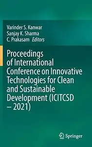
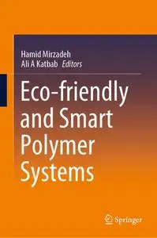
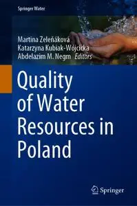
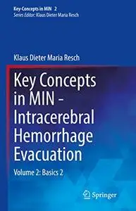
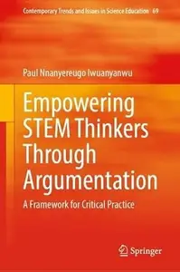
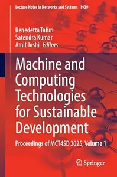

# Zavat feed - 2026-08-02

---

**Time:** 04:35:35 (Asia/Tehran)  
**Blog:** AvaxGenius  

**Title:** Pädiatrie (Repost)  

**Details:** Deutsch | PDF | 2019 | 865 Pages | ISBN : 366257294X | 122.5 MB  

**Link:** http://zavat.pw/ebooks/36362572594X.html  

---

**Time:** 04:35:35 (Asia/Tehran)  
**Blog:** AvaxGenius  

**Title:** Proceedings of International Conference on Innovative Technologies for Clean and Sustainable Development (Repost)  

**Details:** English | EPUB (True) | 2022 | 856 Pages | ISBN : 3030939359 | 128.2 MB  

**Link:** http://zavat.pw/ebooks/303095239359.html  

---

**Time:** 04:35:35 (Asia/Tehran)  
**Blog:** AvaxGenius  

**Title:** Eco-friendly and Smart Polymer Systems (Repost)  

**Details:** English | EPUB | 2020 | 747 Pages | ISBN : 3030450848 | 100.8 MB  

**Link:** http://zavat.pw/ebooks/350304550848.html  

---

**Time:** 04:35:35 (Asia/Tehran)  
**Blog:** AvaxGenius  

**Title:** Quality of Water Resources in Poland (Repost)  

**Details:** English | EPUB | 2021 | 461 Pages | ISBN : 3030648915 | 117.5 MB  

**Link:** http://zavat.pw/ebooks/305306428915.html  

---

**Time:** 04:35:35 (Asia/Tehran)  
**Blog:** AvaxGenius  

**Title:** Key Concepts in MIN - Intracerebral Hemorrhage Evacuation Volume 2: Basics 2 (Repost)  

**Details:** English | EPUB | 2022 | 470 Pages | ISBN : 3030906280 | 107.3 MB  

**Link:** http://zavat.pw/ebooks/303059062820.html  

---

**Time:** 04:35:35 (Asia/Tehran)  
**Blog:** AvaxGenius  

**Title:** Optical Polymer Waveguides: From the Design to the Final 3D-Opto Mechatronic Integrated Device (Repost)  

**Details:** English | EPUB | 2022 | 283 Pages | ISBN : 3030928535 | 106.6 MB  

**Link:** http://zavat.pw/ebooks/303094285325.html  

---

**Time:** 01:55:07 (Asia/Tehran)  
**Blog:** hill0  

**Title:** Quantitative Approaches to Global Power  

**Details:** English | 2026 | ISBN: 3032230403 | 264 Pages | PDF EPUB (True) | 24 MB  

**Link:** http://zavat.pw/ebooks/3032230403.html  

---

**Time:** 01:55:07 (Asia/Tehran)  
**Blog:** hill0  

**Title:** Empowering STEM Thinkers Through Argumentation  

**Details:** English | 2026 | ISBN: 3032279054 | 218 Pages | PDF EPUB (True) | 39 MB  

**Link:** http://zavat.pw/ebooks/3032279054.html  

---

**Time:** 01:55:07 (Asia/Tehran)  
**Blog:** hill0  

**Title:** Machine and Computing Technologies for Sustainable Development, Volume 1  

**Details:** English | 2026 | ISBN: 3032235146 | 511 Pages | PDF (True) | 44 MB  

**Link:** http://zavat.pw/ebooks/3032235146.html  

---

**Time:** 00:54:16 (Asia/Tehran)  
**Blog:** hill0  

**Title:** Canadian Woodworking - Summer 2026  

**Details:** English | 68 pages | True PDF | 16 MB  

**Link:** http://zavat.pw/magazines/CanadianWoodworking-sum-26.html  

