# Zavat feed - 2026-08-04

---

**Time:** 21:54:19 (Asia/Tehran)  
**Blog:** hill0  

**Title:** Marine Internal Combustion Engines and Environmental Protection Issues  

**Details:** English | 2026 | ISBN: 3032209390 | 275 Pages | PDF (True) | 76 MB  

**Link:** http://zavat.pw/ebooks/3032209390.html  

---

**Time:** 21:54:19 (Asia/Tehran)  
**Blog:** crazy-slim  

**Title:** Thrasher - September 2026  

**Details:** English | 164 pages | True PDF | 74.2 MB  

**Link:** http://zavat.pw/magazines/ThrasherSeptember2026-35965.html  

---

**Time:** 21:54:19 (Asia/Tehran)  
**Blog:** crazy-slim  

**Title:** Florimuse - August 2026  

**Details:** English | 62 pages | True PDF | 27.3 MB  

**Link:** http://zavat.pw/magazines/FlorimuseAugust2026-84096.html  

---

**Time:** 21:54:19 (Asia/Tehran)  
**Blog:** crazy-slim  

**Title:** Bikini Plus - August 2026  

**Details:** English | 72 pages | True PDF | 26.8 MB  

**Link:** http://zavat.pw/magazines/BikiniPlusAugust2026-09689.html  

---

**Time:** 21:54:19 (Asia/Tehran)  
**Blog:** crazy-slim  

**Title:** Wired USA - September-October 2026  

**Details:** English | 94 pages | True PDF | 20.8 MB  

**Link:** http://zavat.pw/magazines/WiredUSASeptemberOctober2026-81670.html  

---

**Time:** 21:54:19 (Asia/Tehran)  
**Blog:** crazy-slim  

**Title:** AOA Chile - Edición 6 2026  

**Details:** Español | 108 pages | True PDF | 106.5 MB  

**Link:** http://zavat.pw/magazines/AOAChileAgroOrg%C3%A1nicoAlimentosSaludablesEdici%C3%B3n62026-76210.html  

---

**Time:** 21:54:19 (Asia/Tehran)  
**Blog:** crazy-slim  

**Title:** Narrativeway Wellness Magazine - The Science of Wellness - Summer 2026  

**Details:** English | 148 pages | True PDF | 77.9 MB  

**Link:** http://zavat.pw/magazines/NarrativewayWellnessMagazineTheScienceofWellnessSummer2026-93274.html  

---

**Time:** 21:54:19 (Asia/Tehran)  
**Blog:** crazy-slim  

**Title:** TvNotas - 4 Agosto 2026  

**Details:** Español | 100 pages | True PDF | 45.5 MB  

**Link:** http://zavat.pw/magazines/TvNotas4Agosto2026-90927.html  

---

**Time:** 21:54:19 (Asia/Tehran)  
**Blog:** crazy-slim  

**Title:** Proceso - Agosto 2026  

**Details:** Español | 116 pages | True PDF | 39.6 MB  

**Link:** http://zavat.pw/magazines/ProcesoAgosto2026-97807.html  

---

**Time:** 21:54:19 (Asia/Tehran)  
**Blog:** crazy-slim  

**Title:** 週刊アサヒ芸能 - August 18, 2026  

**Details:** 日本語 | 170 pages | True PDF | 56.4 MB  

**Link:** http://zavat.pw/magazines/%E9%80%B1%E5%88%8A%E3%82%A2%E3%82%B5%E3%83%92%E8%8A%B8%E8%83%BDAugust182026-28932.html  

---

**Time:** 21:54:19 (Asia/Tehran)  
**Blog:** crazy-slim  

**Title:** Victoria - September-October 2026  

**Details:** English | 132 pages | True PDF | 94.9 MB  

**Link:** http://zavat.pw/magazines/VictoriaSeptemberOctober2026-39993.html  

---

**Time:** 21:54:19 (Asia/Tehran)  
**Blog:** crazy-slim  

**Title:** Confidenze - 4 Agosto 2026  

**Details:** Italiano | 88 pages | True PDF | 77.3 MB  

**Link:** http://zavat.pw/magazines/Confidenze4Agosto2026-66969.html  

---

**Time:** 21:54:19 (Asia/Tehran)  
**Blog:** crazy-slim  

**Title:** Top Yacht Design - Numero 46 2026  

**Details:** Italiano | 280 pages | True PDF | 55.2 MB  

**Link:** http://zavat.pw/magazines/TopYachtDesignNumero462026-08725.html  

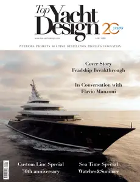

---

**Time:** 21:54:19 (Asia/Tehran)  
**Blog:** crazy-slim  

**Title:** Gress Magazine - 4 August 2026  

**Details:** Bahasa Indonesia | 106 pages | True PDF | 71.7 MB  

**Link:** http://zavat.pw/magazines/GressMagazine4August2026-33311.html  

---

**Time:** 21:54:19 (Asia/Tehran)  
**Blog:** crazy-slim  

**Title:** Moto Sprint - 4 Agosto 2026  

**Details:** Italiano | 84 pages | True PDF | 18.2 MB  

**Link:** http://zavat.pw/magazines/MotoSprint4Agosto2026-76393.html  

---

**Time:** 21:54:19 (Asia/Tehran)  
**Blog:** crazy-slim  

**Title:** Wildfowl - September 2026  

**Details:** English | 100 pages | True PDF | 51.1 MB  

**Link:** http://zavat.pw/magazines/WildfowlSeptember2026-73971.html  

---

**Time:** 20:23:58 (Asia/Tehran)  
**Blog:** AvaxGenius  

**Title:** Electricity and Magnetism: New Formulation by Introduction of Superconductivity (Repost)  

**Details:** English | PDF(True) | 2014 | 384 Pages | ISBN : 4431545255 | 96.3 MB  

**Link:** http://zavat.pw/ebooks/443315435255.html  

---

**Time:** 20:23:58 (Asia/Tehran)  
**Blog:** AvaxGenius  

**Title:** Parallel Computing in Optimization (Repost)  

**Details:** English | PDF | 1997 | 596 Pages | ISBN : 0792345835 | 44.9 MB  

**Link:** http://zavat.pw/ebooks/07923345835.html  

---

**Time:** 20:23:58 (Asia/Tehran)  
**Blog:** AvaxGenius  

**Title:** Geometric Algebra Applications Vol. III: Integral Transforms, Machine Learning, and Quantum Computing (Repost)  

**Details:** English | PDF EPUB (True) | 2024 | 662 Pages | ISBN : 3031663411 | 177.3 MB  

**Link:** http://zavat.pw/ebooks/3031663411Re.html  

---

**Time:** 20:23:58 (Asia/Tehran)  
**Blog:** AvaxGenius  

**Title:** Advanced Engineering Mathematics  

**Details:** English | PDF (True) | 2019 | 827 Pages | ISBN : 3030170705 | 7.2 MB  

**Link:** http://zavat.pw/ebooks/3030170705.html  

---

**Time:** 20:23:58 (Asia/Tehran)  
**Blog:** AvaxGenius  

**Title:** Fading and Shadowing in Wireless Systems, Second Edition (Repost)  

**Details:** English | PDF (True) | 2017 | 827 Pages | ISBN : 3319531972 | 34.5 MB  

**Link:** http://zavat.pw/ebooks/33193531972R.html  

---

**Time:** 20:23:58 (Asia/Tehran)  
**Blog:** AvaxGenius  

**Title:** Basic Linear Algebra  

**Details:** English | PDF (True) | 2002 | 242 Pages | ISBN : 1852336625 | 12.5 MB  

**Link:** http://zavat.pw/ebooks/18523536625T.html  

---

**Time:** 20:23:58 (Asia/Tehran)  
**Blog:** AvaxGenius  

**Title:** Space-Time Reference Systems  

**Details:** English | PDF (True) | 2013 | 321 Pages | ISBN : 3642302254 | 8.1 MB  

**Link:** http://zavat.pw/ebooks/36423302254T.html  

---

**Time:** 20:23:58 (Asia/Tehran)  
**Blog:** AvaxGenius  

**Title:** Further Linear Algebra  

**Details:** English | PDF (True) | 2002 | 239 Pages | ISBN : 1852334258 | 15 MB  

**Link:** http://zavat.pw/ebooks/18523334258.html  

---

**Time:** 20:23:58 (Asia/Tehran)  
**Blog:** AvaxGenius  

**Title:** An Introduction to Modern Mathematical Computing: With Maple™  

**Details:** English | PDF (True) | 2011 | 229 Pages | ISBN : 1461401216 | 5.8 MB  

**Link:** http://zavat.pw/ebooks/14631401216T.html  

---

**Time:** 20:23:58 (Asia/Tehran)  
**Blog:** AvaxGenius  

**Title:** Singular Perturbation Theory  

**Details:** English | PDF (True) | 2011 | 95 Pages | ISBN : 1441999574 | 1.1 MB  

**Link:** http://zavat.pw/ebooks/14415999574.html  

---

**Time:** 20:23:58 (Asia/Tehran)  
**Blog:** AvaxGenius  

**Title:** Geomechanics of Failures. Advanced Topics  

**Details:** English | PDF (True) | 2010 | 280 Pages | ISBN : 9048135370 | 28.8 MB  

**Link:** http://zavat.pw/ebooks/9048135370T.html  

---

**Time:** 20:23:58 (Asia/Tehran)  
**Blog:** AvaxGenius  

**Title:** Reliability, Life Testing and the Prediction of Service Lives: For Engineers and Scientists  

**Details:** English | PDF (True) | 2007 | 321 Pages | ISBN : 0387325220 | 23.6 MB  

**Link:** http://zavat.pw/ebooks/03873525220.html  

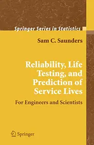

---

**Time:** 20:23:58 (Asia/Tehran)  
**Blog:** AvaxGenius  

**Title:** Differential Equations: Theory and Applications  

**Details:** English | PDF (True) | 2010 | 634 Pages | ISBN : 1441911626 | 9.1 MB  

**Link:** http://zavat.pw/ebooks/14419113626.html  

---

**Time:** 20:23:58 (Asia/Tehran)  
**Blog:** AvaxGenius  

**Title:** Maple and Mathematica: A Problem Solving Approach for Mathematics  

**Details:** English | PDF (True) | 2007 | 274 Pages | ISBN : 3211732659 | 1.2 MB  

**Link:** http://zavat.pw/ebooks/3211732659.html  

---

**Time:** 20:23:58 (Asia/Tehran)  
**Blog:** AvaxGenius  

**Title:** Maple - Règles et fonctions essentielles  

**Details:** Français | PDF (True) | 2009 | 218 Pages | ISBN : 2287252010 | 1.4 MB  

**Link:** http://zavat.pw/ebooks/22873252010.html  

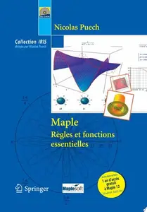

---

**Time:** 20:23:58 (Asia/Tehran)  
**Blog:** hill0  

**Title:** Your First 60 Days as a Leader  

**Details:** English | 2026 | ISBN: 0642572367008 | 39 Pages | EPUB | 2 MB  

**Link:** http://zavat.pw/ebooks/0642572367008.html  

---

**Time:** 20:23:58 (Asia/Tehran)  
**Blog:** hill0  

**Title:** AI and Accountability  

**Details:** English | 2026 | ISBN: 3032200903 | 222 Pages | PDF EPUB (True) | 11 MB  

**Link:** http://zavat.pw/ebooks/3032200903.html  

---

**Time:** 20:23:58 (Asia/Tehran)  
**Blog:** hill0  

**Title:** Reals by Abstraction. An Inquiry about Epistemic Economy in Mathematics: Volume II: The Real Numbers  

**Details:** English | 2026 | ISBN: 3032004306 | 252 Pages | PDF EPUB (True) | 15 MB  

**Link:** http://zavat.pw/ebooks/3032004306.html  

---

**Time:** 20:23:58 (Asia/Tehran)  
**Blog:** hill0  

**Title:** Soft Computing: Theories and Applications, Volume 1  

**Details:** English | 2026 | ISBN: 3032263697 | 415 Pages | PDF EPUB (True) | 89 MB  

**Link:** http://zavat.pw/ebooks/3032263697.html  

---

**Time:** 20:23:58 (Asia/Tehran)  
**Blog:** hill0  

**Title:** AI aided Sustainable Development  

**Details:** English | 2026 | ISBN: 3032252660 | 378 Pages | PDF EPUB (True) | 57 MB  

**Link:** http://zavat.pw/ebooks/3032252660.html  

---

**Time:** 20:23:58 (Asia/Tehran)  
**Blog:** hill0  

**Title:** Quantum Control of Hybrid Spin-Oscillator Systems  

**Details:** English | 2026 | ISBN: 3032237742 | 198 Pages | PDF (True) | 15 MB  

**Link:** http://zavat.pw/ebooks/3032237742.html  

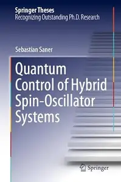

---

**Time:** 20:23:58 (Asia/Tehran)  
**Blog:** hill0  

**Title:** Safer Better Healthcare, By All for All  

**Details:** English | 2026 | ISBN: 3032230721 | 252 Pages | PDF EPUB (True) | 45 MB  

**Link:** http://zavat.pw/ebooks/3032230721.html  

---

**Time:** 18:29:12 (Asia/Tehran)  
**Blog:** IrGens  

**Title:** Pause: How to Lead Brilliant Work in a Busy World  

**Details:** English | August 4, 2026 | ISBN: 1668049481, 9781668049495 | True EPUB | 336 pages | 8.97 MB  

**Link:** http://zavat.pw/ebooks/1668049481.html  

---

**Time:** 18:29:12 (Asia/Tehran)  
**Blog:** IrGens  

**Title:** Major Hashida's Notebook: A Japanese spy's mission to Australia in World War II  

**Details:** English | 4 August 2026 | ISBN: 1761471422, 9781923627086 | True EPUB | 368 pages | 6.5 MB  

**Link:** http://zavat.pw/ebooks/1761471422.html  

---

**Time:** 18:29:12 (Asia/Tehran)  
**Blog:** AvaxGenius  

**Title:** Agricultural Aviation - Winter 2026  

**Details:** English | True PDF | 104 Pages | 12.6 MB  

**Link:** http://zavat.pw/magazines/AgriculturalAviationWinter2026.html  

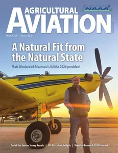

---

**Time:** 18:29:12 (Asia/Tehran)  
**Blog:** AvaxGenius  

**Title:** Agricultural Aviation - Spring 2026  

**Details:** English | True PDF | 100 Pages | 12.5 MB  

**Link:** http://zavat.pw/magazines/AgriculturalAviationSpring2026.html  

---

**Time:** 18:29:12 (Asia/Tehran)  
**Blog:** AvaxGenius  

**Title:** Instrumentation - June 2026  

**Details:** English | True PDF | 72 Pages | 24.6 MB  

**Link:** http://zavat.pw/magazines/InstrumentationJune2026.html  

---

**Time:** 18:29:12 (Asia/Tehran)  
**Blog:** AvaxGenius  

**Title:** Instrumentation - May 2026  

**Details:** English | True PDF | 72 Pages | 14 MB  

**Link:** http://zavat.pw/magazines/InstrumentationMay2026.html  

---

**Time:** 18:29:12 (Asia/Tehran)  
**Blog:** AvaxGenius  

**Title:** BikeBiz - July 2026  

**Details:** English | True PDF | 68 Pages | 13.7 MB  

**Link:** http://zavat.pw/magazines/BikeBizJuly2026.html  

---

**Time:** 18:29:12 (Asia/Tehran)  
**Blog:** AvaxGenius  

**Title:** BikeBiz - June 2026  

**Details:** English | True PDF | 68 Pages | 15.4 MB  

**Link:** http://zavat.pw/magazines/BikeBizJune2026.html  

---

**Time:** 18:29:12 (Asia/Tehran)  
**Blog:** AvaxGenius  

**Title:** Converter Magazine - May/June 2026  

**Details:** English | True PDF | 56 Pages | 13.4 MB  

**Link:** http://zavat.pw/magazines/ConverterMagazineMayJune2026.html  

---

**Time:** 18:29:12 (Asia/Tehran)  
**Blog:** AvaxGenius  

**Title:** Public Sector Building - July 2026  

**Details:** English | True PDF | 44 Pages | 8.3 MB  

**Link:** http://zavat.pw/magazines/PublicSectorBuildingJuly2026.html  

---

**Time:** 18:29:12 (Asia/Tehran)  
**Blog:** AvaxGenius  

**Title:** Public Sector Building - May 2026  

**Details:** English | True PDF | 36 Pages | 6.3 MB  

**Link:** http://zavat.pw/magazines/PublicSectorBuildingMay2026.html  

---

**Time:** 18:29:12 (Asia/Tehran)  
**Blog:** AvaxGenius  

**Title:** BKU Magazine - July 2026  

**Details:** English | True PDF | 48 Pages | 18.2 MB  

**Link:** http://zavat.pw/magazines/BKUMagazineJuly2026.html  

---

**Time:** 18:29:12 (Asia/Tehran)  
**Blog:** AvaxGenius  

**Title:** BKU Magazine - June 2026  

**Details:** English | True PDF | 52 Pages | 15.8 MB  

**Link:** http://zavat.pw/magazines/BKUMagazineJune2026.html  

---

**Time:** 18:29:12 (Asia/Tehran)  
**Blog:** AvaxGenius  

**Title:** DIY Week - June 2026  

**Details:** English | True PDF | 60 Pages | 23.5 MB  

**Link:** http://zavat.pw/magazines/DIYWeekJune2026.html  

---

**Time:** 18:29:12 (Asia/Tehran)  
**Blog:** AvaxGenius  

**Title:** DIY Week - May 2026  

**Details:** English | True PDF | 40 Pages | 15.3 MB  

**Link:** http://zavat.pw/magazines/DIYWeekMay2026.html  

---

**Time:** 18:29:12 (Asia/Tehran)  
**Blog:** hill0  

**Title:** Science and Society (2nd Edition)  

**Details:** English | 2026 | ISBN: 3032156734 | 306 Pages | PDF EPUB (True) | 58 MB  

**Link:** http://zavat.pw/ebooks/3032156734.html  

---

**Time:** 18:29:12 (Asia/Tehran)  
**Blog:** hill0  

**Title:** Grokking Simplicity: Taming Complex Software with Functional Thinking  

**Details:** English | 2021 | ISBN: 1617296201 | 593 Pages | PDF True | 75 MB  

**Link:** http://zavat.pw/ebooks/1617296201tf.html  

---

**Time:** 18:29:12 (Asia/Tehran)  
**Blog:** hill0  

**Title:** Handbook of the Psychology of Sibling Relationships  

**Details:** English | 2026 | ISBN: 3032212952 | 714 Pages | PDF EPUB (True) | 10 MB  

**Link:** http://zavat.pw/ebooks/3032212952.html  

---

**Time:** 18:29:12 (Asia/Tehran)  
**Blog:** hill0  

**Title:** Conscious Consumption: The Role of Artificial Intelligence in the Emergence of the Ethical Consumer  

**Details:** English | 2026 | ISBN: 3032223350 | 688 Pages | PDF EPUB (True) | 13 MB  

**Link:** http://zavat.pw/ebooks/3032223350.html  

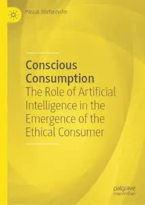

---

**Time:** 18:29:12 (Asia/Tehran)  
**Blog:** hill0  

**Title:** Offensive Automotive Cybersecurity  

**Details:** English | 2026 | ISBN: 9781836648635 | 564 Pages | PDF (True) | 52 MB  

**Link:** http://zavat.pw/ebooks/9781836648635.html  

---

**Time:** 18:29:12 (Asia/Tehran)  
**Blog:** hill0  

**Title:** The Platform Engineer's Handbook  

**Details:** English | 2026 | ISBN: 9781806380138 | 366 Pages | EPUB (True) | 31 MB  

**Link:** http://zavat.pw/ebooks/9781806380138.html  

---

**Time:** 18:29:12 (Asia/Tehran)  
**Blog:** hill0  

**Title:** Outsmarting the Avalanche  

**Details:** English | 2026 | ISBN: 1606496832 | 142 Pages | EPUB (True) | 4 MB  

**Link:** http://zavat.pw/ebooks/1606496832.html  

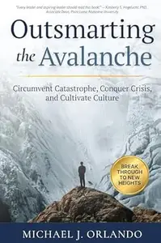

---

**Time:** 18:29:12 (Asia/Tehran)  
**Blog:** hill0  

**Title:** Design Thinking for Humanity  

**Details:** English | 2026 | ISBN: 1394366396 | 323 Pages | PDF (True) | 15 MB  

**Link:** http://zavat.pw/ebooks/1394366396.html  

---

**Time:** 18:29:12 (Asia/Tehran)  
**Blog:** hill0  

**Title:** Crop Physiology: From Gene to Field  

**Details:** English | 2026 | ISBN: 9819229596 | 377 Pages | PDF EPUB (True) | 52 MB  

**Link:** http://zavat.pw/ebooks/9819229596.html  

---

**Time:** 18:29:12 (Asia/Tehran)  
**Blog:** hill0  

**Title:** Phytoecdysteroids II: From Natural Origins to Therapeutic Frontiers  

**Details:** English | 2026 | ISBN: 9819584221 | 318 Pages | PDF EPUB (True) | 42 MB  

**Link:** http://zavat.pw/ebooks/9819584221.html  

---

**Time:** 15:56:32 (Asia/Tehran)  
**Blog:** IrGens  

**Title:** Empire and Frontier: Colonel Peter Schuyler and the Valiant Iroquois in King William's War: 1689-1701  

**Details:** English | August 4, 2026 | ISBN: 9798897101542, 9798897101559 | True EPUB | 368 pages | 32.7 MB  

**Link:** http://zavat.pw/ebooks/9798897101542.html  

---

**Time:** 15:56:32 (Asia/Tehran)  
**Blog:** IrGens  

**Title:** Welcome to Your Life: Love, Death & Tears For Fears  

**Details:** English | August 4, 2026 | ISBN: 0063455196, 9780063455160 | True EPUB | 304 pages | 12.97 MB  

**Link:** http://zavat.pw/ebooks/0063455196.html  

---

**Time:** 15:56:32 (Asia/Tehran)  
**Blog:** IrGens  

**Title:** Dispatches From the Kingdom of Outsiders: Writing on Music, Culture and More 1979-2025  

**Details:** English | August 4, 2026 | ISBN: 9798999048738, 9798999048752 | True EPUB | 340 pages | 3.2 MB  

**Link:** http://zavat.pw/ebooks/9798999048738.html  

---

**Time:** 15:56:32 (Asia/Tehran)  
**Blog:** IrGens  

**Title:** A History of American Higher Education, 4th Edition  

**Details:** English | August 4, 2026 | ISBN: 1421454939, 1421454947, 9781421454955 | True EPUB | 600 pages | 3.7 MB  

**Link:** http://zavat.pw/ebooks/1421454939.html  

---

**Time:** 13:59:59 (Asia/Tehran)  
**Blog:** AvaxGenius  

**Title:** Global Perspectives in Ocular Oncology (Repost)  

**Details:** English | PDF,EPUB | 2023 | 417 Pages | ISBN : 3031082494 | 204.7 MB  

**Link:** http://zavat.pw/ebooks/303130824945.html  

---

**Time:** 13:59:59 (Asia/Tehran)  
**Blog:** AvaxGenius  

**Title:** Multimedia Security Using Chaotic Maps: Principles and Methodologies (Repost)  

**Details:** English | EPUB | 2020 | 271 Pages | ISBN : 3030386996 | 97.53 MB  

**Link:** http://zavat.pw/ebooks/530303869926.html  

---

**Time:** 13:59:59 (Asia/Tehran)  
**Blog:** AvaxGenius  

**Title:** Precision Molecular Pathology of Neoplastic Pediatric Diseases (Repost)  

**Details:** English | EPUB | 2018 | 360 Pages | ISBN : 3319896253 | 99.4 MB  

**Link:** http://zavat.pw/ebooks/533159896253.html  

---

**Time:** 13:59:59 (Asia/Tehran)  
**Blog:** AvaxGenius  

**Title:** Precision Molecular Pathology of Aggressive B-Cell Lymphomas (Repost)  

**Details:** English | EPUB (True) | 2024 | 433 Pages | ISBN : 3031468414 | 103.8 MB  

**Link:** http://zavat.pw/ebooks/320314684144.html  

---

**Time:** 13:59:59 (Asia/Tehran)  
**Blog:** AvaxGenius  

**Title:** Textbook of Primary Care Dermatology (Repost)  

**Details:** English | EPUB | 2021 | 624 Pages | ISBN : 3030291006 | 363 MB  

**Link:** http://zavat.pw/ebooks/303042912006.html  

---

**Time:** 13:59:59 (Asia/Tehran)  
**Blog:** AvaxGenius  

**Title:** Atlas of Finger Reconstruction: Techniques and Cases (Repost)  

**Details:** English | EPUB (True) | 2023 | 288 Pages | ISBN : 9811996113 | 342.8 MB  

**Link:** http://zavat.pw/ebooks/981139961313.html  

---

**Time:** 13:59:59 (Asia/Tehran)  
**Blog:** AvaxGenius  

**Title:** Star Maps: History, Artistry, and Cartography, Third Edition (Repost)  

**Details:** English | EPUB (True) | 2019 | 599 Pages | ISBN : 3030136124 | 707.2 MB  

**Link:** http://zavat.pw/ebooks/30302136124R.html  

---

**Time:** 13:59:59 (Asia/Tehran)  
**Blog:** hill0  

**Title:** Multi-Robot Collaboration  

**Details:** English | 2026 | ISBN: 3032211492 | 303 Pages | PDF EPUB (True) | 21 MB  

**Link:** http://zavat.pw/ebooks/3032211492.html  

---

**Time:** 13:59:59 (Asia/Tehran)  
**Blog:** hill0  

**Title:** AI and Renewable Energy Storage Synergy  

**Details:** English | 2026 | ISBN: 1032850183 | 170 Pages | PDF EPUB (True) | 25 MB  

**Link:** http://zavat.pw/ebooks/1032850183.html  

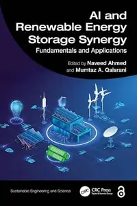

---

**Time:** 13:59:59 (Asia/Tehran)  
**Blog:** hill0  

**Title:** Raman and SERS Spectroscopy  

**Details:** English | 2026 | ISBN: 1041167091 | 122 Pages | PDF EPUB (True) | 19 MB  

**Link:** http://zavat.pw/ebooks/1041167091.html  

---

**Time:** 13:59:59 (Asia/Tehran)  
**Blog:** hill0  

**Title:** Clinical Atlas of Genodermatoses in Skin of Colour  

**Details:** English | 2026 | ISBN: 9819512794 | 845 Pages | PDF (True) | 84 MB  

**Link:** http://zavat.pw/ebooks/9819512794.html  

---

**Time:** 13:59:59 (Asia/Tehran)  
**Blog:** hill0  

**Title:** Frontline Operational Resuscitation and Combat Emergencies (FORCE) Manual  

**Details:** English | 2026 | ISBN: 9819216214 | 396 Pages | PDF EPUB (True) | 52 MB  

**Link:** http://zavat.pw/ebooks/9819216214.html  

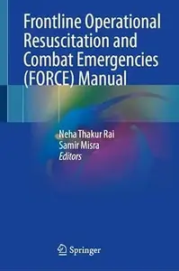

---

**Time:** 13:59:59 (Asia/Tehran)  
**Blog:** crazy-slim  

**Title:** The Baltimore Sun - 4 August 2026  

**Details:** English | 36 pages | True PDF | 36.0 MB  

**Link:** http://zavat.pw/newspapers/TheBaltimoreSun4August2026-53297.html  

---

**Time:** 13:59:59 (Asia/Tehran)  
**Blog:** crazy-slim  

**Title:** The Morning Call Morning Edition - 4 August 2026  

**Details:** English | 32 pages | True PDF | 20.1 MB  

**Link:** http://zavat.pw/newspapers/TheMorningCallMorningEdition4August2026-95185.html  

---

**Time:** 13:59:59 (Asia/Tehran)  
**Blog:** crazy-slim  

**Title:** The Philadelphia Inquirer - August 4, 2026  

**Details:** English | 28 pages | True PDF | 26.3 MB  

**Link:** http://zavat.pw/newspapers/ThePhiladelphiaInquirerAugust42026-94834.html  

---

**Time:** 13:59:59 (Asia/Tehran)  
**Blog:** crazy-slim  

**Title:** Trinidad & Tobago Daily Express - 4 August 2026  

**Details:** English | 48 pages | True PDF | 22.8 MB  

**Link:** http://zavat.pw/newspapers/TrinidadTobagoDailyExpress4August2026-10327.html  

---

**Time:** 13:59:59 (Asia/Tehran)  
**Blog:** crazy-slim  

**Title:** The Dallas Morning News - August 4, 2026  

**Details:** English | 29 pages | True PDF | 15.6 MB  

**Link:** http://zavat.pw/newspapers/TheDallasMorningNewsAugust42026-61055.html  

---

**Time:** 13:59:59 (Asia/Tehran)  
**Blog:** crazy-slim  

**Title:** The Boston Globe - 4 August 2026  

**Details:** English | 36 pages | True PDF | 6.8 MB  

**Link:** http://zavat.pw/newspapers/TheBostonGlobe4August2026-08023.html  

---

**Time:** 13:59:59 (Asia/Tehran)  
**Blog:** crazy-slim  

**Title:** Sun Journal - 4 August 2026  

**Details:** English | 24 pages | True PDF | 37.0 MB  

**Link:** http://zavat.pw/newspapers/SunJournal4August2026-69243.html  

---

**Time:** 13:59:59 (Asia/Tehran)  
**Blog:** crazy-slim  

**Title:** The Beacon-News - 4 August 2026  

**Details:** English | 18 pages | True PDF | 9.9 MB  

**Link:** http://zavat.pw/newspapers/TheBeaconNews4August2026-93151.html  

---

**Time:** 13:59:59 (Asia/Tehran)  
**Blog:** crazy-slim  

**Title:** The Baltimore Sun Carroll County Times - 4 August 2026  

**Details:** English | 24 pages | True PDF | 21.8 MB  

**Link:** http://zavat.pw/newspapers/TheBaltimoreSunCarrollCountyTimes4August2026-47779.html  

---

**Time:** 13:59:59 (Asia/Tehran)  
**Blog:** crazy-slim  

**Title:** Sun Sentinel - 4 August 2026  

**Details:** English | 28 pages | True PDF | 17.7 MB  

**Link:** http://zavat.pw/newspapers/SunSentinel4August2026-58383.html  

---

**Time:** 13:59:59 (Asia/Tehran)  
**Blog:** crazy-slim  

**Title:** Portland Press Herald - 4 August 2026  

**Details:** English | 24 pages | True PDF | 22.8 MB  

**Link:** http://zavat.pw/newspapers/PortlandPressHerald4August2026-17489.html  

---

**Time:** 13:59:59 (Asia/Tehran)  
**Blog:** crazy-slim  

**Title:** Chicago Sun-Times - 4 August 2026  

**Details:** English | 44 pages | True PDF | 75.1 MB  

**Link:** http://zavat.pw/newspapers/ChicagoSunTimes4August2026-93215.html  

---

**Time:** 13:59:59 (Asia/Tehran)  
**Blog:** crazy-slim  

**Title:** Post-Tribune - 4 August 2026  

**Details:** English | 18 pages | True PDF | 10.0 MB  

**Link:** http://zavat.pw/newspapers/PostTribune4August2026-46952.html  

---

**Time:** 13:59:59 (Asia/Tehran)  
**Blog:** crazy-slim  

**Title:** Newsday - 4 August 2026  

**Details:** English | 64 pages | True PDF | 22.9 MB  

**Link:** http://zavat.pw/newspapers/Newsday4August2026-03961.html  

---

**Time:** 13:59:59 (Asia/Tehran)  
**Blog:** crazy-slim  

**Title:** Orlando Sentinel - 4 August 2026  

**Details:** English | 25 pages | True PDF | 15.9 MB  

**Link:** http://zavat.pw/newspapers/OrlandoSentinel4August2026-95095.html  

---

**Time:** 11:08:47 (Asia/Tehran)  
**Blog:** yoyoloit  

**Title:** Theory of Computation for Software Developers  

**Details:** English | 2026 | ISBN: 1032614803 | 244 pages | True PDF EPUB | 26.12 MB  

**Link:** http://zavat.pw/ebooks/1032614803.html  

---

**Time:** 11:08:47 (Asia/Tehran)  
**Blog:** yoyoloit  

**Title:** Modern Wireless Communication Systems and Networks: Design, Practice, and Implementation  

**Details:** English | 2026 | ISBN: 1041112742 | 390 pages | True PDF EPUB | 28.11 MB  

**Link:** http://zavat.pw/ebooks/1041112742.html  

---

**Time:** 11:08:47 (Asia/Tehran)  
**Blog:** yoyoloit  

**Title:** The Basics of Oil Spill Cleanup, 4th Edition  

**Details:** English | 2026 | ISBN: 1032935820 | 278 pages | True PDF EPUB | 227.23 MB  

**Link:** http://zavat.pw/ebooks/1032935820.html  

---

**Time:** 11:08:47 (Asia/Tehran)  
**Blog:** yoyoloit  

**Title:** Next-Generation Smart Systems: Bridging Sustainability and Computational Intelligence  

**Details:** English | 2027 | ISBN: 1041362692 | 480 pages | True PDF EPUB | 325.28 MB  

**Link:** http://zavat.pw/ebooks/1041362692.html  

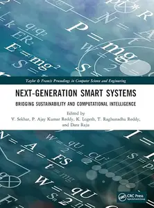

---

**Time:** 11:08:47 (Asia/Tehran)  
**Blog:** yoyoloit  

**Title:** Operation, Maintenance, and Management of Irrigation Systems  

**Details:** English | 2027 | ISBN: 1041256086 | 465 pages | True PDF EPUB | 166.14 MB  

**Link:** http://zavat.pw/ebooks/1041256086.html  

---

**Time:** 11:08:47 (Asia/Tehran)  
**Blog:** yoyoloit  

**Title:** Electronic Instrumentation with MATLAB®  

**Details:** English | 2027 | ISBN: 1041286163 | 302 pages | True PDF EPUB | 14.79 MB  

**Link:** http://zavat.pw/ebooks/1041286163.html  

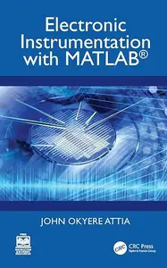

---

**Time:** 11:08:47 (Asia/Tehran)  
**Blog:** yoyoloit  

**Title:** Process Analytical Technology in Pharma: Foundations for the Analytical Scientist  

**Details:** English | 2026 | ISBN: 981535227X | 779 pages | True PDF EPUB | 100.02 MB  

**Link:** http://zavat.pw/ebooks/981535227X.html  

---

**Time:** 11:08:47 (Asia/Tehran)  
**Blog:** yoyoloit  

**Title:** Health Research Translation: Making Science Useful for Practicing Evidence-based Medicine  

**Details:** English | 2027 | ISBN: 1041106084 | 194 pages | True PDF EPUB | 10.86 MB  

**Link:** http://zavat.pw/ebooks/1041106084.html  

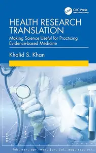

---

**Time:** 11:08:47 (Asia/Tehran)  
**Blog:** yoyoloit  

**Title:** Building Effective Peer Support Teams: A Guide to Creating Resilient First Responders  

**Details:** English | 2027 | ISBN: 1032982160 | 189 pages | True PDF EPUB | 9.86 MB  

**Link:** http://zavat.pw/ebooks/1032982160.html  

---

**Time:** 11:08:47 (Asia/Tehran)  
**Blog:** yoyoloit  

**Title:** Seven Saints of Science: An Introduction to the History of Conflict  

**Details:** English | 2026 | ISBN: 9815352245 | 209 pages | True PDF EPUB | 91.2 MB  

**Link:** http://zavat.pw/ebooks/9815352245.html  

---

**Time:** 11:08:47 (Asia/Tehran)  
**Blog:** yoyoloit  

**Title:** Parija’s Immunologic Diagnostics in Parasitology: Principles, Techniques, and Applications  

**Details:** English | 2027 | ISBN: 1041081995 | 224 pages | True PDF EPUB | 43.94 MB  

**Link:** http://zavat.pw/ebooks/1041081995.html  

---

**Time:** 11:08:47 (Asia/Tehran)  
**Blog:** yoyoloit  

**Title:** Integrating Sustainability and ESG in Private Equity: A Playbook for Generating Long-Term Value from Sustainable Practices  

**Details:** English | 2026 | ISBN: 1041038372 | 279 pages | True PDF EPUB | 2.52 MB  

**Link:** http://zavat.pw/ebooks/1041038372.html  

---

**Time:** 11:08:47 (Asia/Tehran)  
**Blog:** yoyoloit  

**Title:** Cystic Fibrosis: Disease Management and Advanced Drug Delivery Systems  

**Details:** English | 2026 | ISBN: 1779640404 | 405 pages | True PDF EPUB | 64.46 MB  

**Link:** http://zavat.pw/ebooks/1779640404.html  

---

**Time:** 11:08:47 (Asia/Tehran)  
**Blog:** yoyoloit  

**Title:** Understanding Cancer Biology: Genetics, Molecular Biology, and Cellular Signaling Pathways  

**Details:** English | 2026 | ISBN: 9815352032 | 740 pages | True PDF EPUB | 330.29 MB  

**Link:** http://zavat.pw/ebooks/9815352032.html  

---

**Time:** 11:08:47 (Asia/Tehran)  
**Blog:** AvaxGenius  

**Title:** Numerische Behandlung gewöhnlicher und partieller Differenzialgleichungen: Ein interaktives Lehrbuch für Ingenieure  

**Details:** Deutsch | PDF(True) | 2006 | 405 Pages | ISBN : 3540298673 | 3.4 MB  

**Link:** http://zavat.pw/ebooks/35403298673T.html  

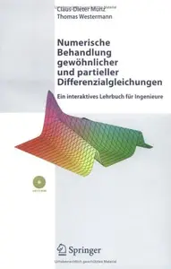

---

**Time:** 11:08:47 (Asia/Tehran)  
**Blog:** AvaxGenius  

**Title:** Computeralgebra: Eine algorithmisch orientierte Einführung  

**Details:** Deutsch | PDF (True) | 2006 | 527 Pages | ISBN : 3540298940 | 4.4 MB  

**Link:** http://zavat.pw/ebooks/35402598940t.html  

---

**Time:** 11:08:47 (Asia/Tehran)  
**Blog:** AvaxGenius  

**Title:** Lie Group Actions in Complex Analysis  

**Details:** English | PDF | 1995 | 212 Pages | ISBN : 3322802698 | 26.7 MB  

**Link:** http://zavat.pw/ebooks/33228023698.html  

---

**Time:** 11:08:47 (Asia/Tehran)  
**Blog:** AvaxGenius  

**Title:** Bifurcations and Periodic Orbits of Vector Fields  

**Details:** English | PDF | 1993 | 483 Pages | ISBN : 0792323920 | 40.6 MB  

**Link:** http://zavat.pw/ebooks/07923423920.html  

---

**Time:** 11:08:47 (Asia/Tehran)  
**Blog:** AvaxGenius  

**Title:** Convex Functions, Monotone Operators and Differentiability, 2nd Edition  

**Details:** English | PDF | 1993 | 127 Pages | ISBN : 3540567151 | 6.8 MB  

**Link:** http://zavat.pw/ebooks/35402567151.html  

---

**Time:** 11:08:47 (Asia/Tehran)  
**Blog:** AvaxGenius  

**Title:** The Cauchy Method of Residues Volume 2: Theory and Applications  

**Details:** English | PDF | 1993 | 206 Pages | ISBN : 0792323114 | 19.9 MB  

**Link:** http://zavat.pw/ebooks/07923523114.html  

---

**Time:** 11:08:47 (Asia/Tehran)  
**Blog:** AvaxGenius  

**Title:** Boundary Behaviour of Conformal Maps  

**Details:** English | PDF | 1992 | 306 Pages | ISBN : 3540547517 | 20 MB  

**Link:** http://zavat.pw/ebooks/35440547517.html  

---

**Time:** 11:08:47 (Asia/Tehran)  
**Blog:** AvaxGenius  

**Title:** Progress in Landslide Research and Technology, Volume 4 Issue 2, 2025  

**Details:** English | EPUB (True) | 2026 | 421 Pages | ISBN : 3032188628 | 434.6 MB  

**Link:** http://zavat.pw/ebooks/3032188628E.html  

---

**Time:** 11:08:47 (Asia/Tehran)  
**Blog:** AvaxGenius  

**Title:** Interaction Between Transport and Wetting Processes  

**Details:** English | EPUB (True) | 2026 | 473 Pages | ISBN : 3032268001 | 89.7 MB  

**Link:** http://zavat.pw/ebooks/3032268001E.html  

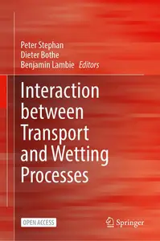

---

**Time:** 11:08:47 (Asia/Tehran)  
**Blog:** AvaxGenius  

**Title:** Towards Industrial Revolution and Sustainable Growth in Africa: Learning Ecosystems of the Future  

**Details:** English | PDF EPUB (True) | 2026 | 393 Pages | ISBN : 9819219345 | 30.7 MB  

**Link:** http://zavat.pw/ebooks/9819219345.html  

---

**Time:** 11:08:47 (Asia/Tehran)  
**Blog:** AvaxGenius  

**Title:** Innovation for Enhanced Resilience and Sustainability along the Belt & Road Initiative  

**Details:** English | PDF EPUB (True) | 2026 | 465 Pages | ISBN : 9819203201 | 98.1 MB  

**Link:** http://zavat.pw/ebooks/9819203201.html  

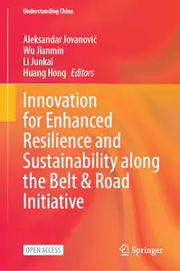

---

**Time:** 11:08:47 (Asia/Tehran)  
**Blog:** AvaxGenius  

**Title:** Linear and Complex Analysis Problem Book 3: Part 1  

**Details:** English | PDF | 1994 | 486 Pages | ISBN : 3540578706 | 31.6 MB  

**Link:** http://zavat.pw/ebooks/35405748706.html  

---

**Time:** 11:08:47 (Asia/Tehran)  
**Blog:** AvaxGenius  

**Title:** Clifford Algebra and Spinor-Valued Functions: A Function Theory for the Dirac Operator  

**Details:** English | PDF | 1992 | 501 Pages | ISBN : 9401052972 | 27.3 MB  

**Link:** http://zavat.pw/ebooks/94010532972.html  

---

**Time:** 11:08:47 (Asia/Tehran)  
**Blog:** AvaxGenius  

**Title:** Fractal Geometry and Analysis  

**Details:** English | PDF | 1991 | 485 Pages | ISBN : 0792313992 | 33 MB  

**Link:** http://zavat.pw/ebooks/07923143992.html  

---

**Time:** 11:08:47 (Asia/Tehran)  
**Blog:** AvaxGenius  

**Title:** Analytic Number Theory: Proceedings of a Conference in Honor of Paul T. Bateman  

**Details:** English | PDF | 1990 | 557 Pages | ISBN : 1461280346 | 34.6 MB  

**Link:** http://zavat.pw/ebooks/14614280346.html  

---

**Time:** 11:08:47 (Asia/Tehran)  
**Blog:** hill0  

**Title:** Handbook of Disciplines and Research Methodologies in Health Behavior and Health Promotion  

**Details:** English | 2026 | ISBN: 9819212871 | 1053 Pages | PDF EPUB (True) | 33 MB  

**Link:** http://zavat.pw/ebooks/9819212871.html  

---

**Time:** 11:08:47 (Asia/Tehran)  
**Blog:** hill0  

**Title:** Ophthalmology Illness Scripts: Thinking like an Eye Doctor  

**Details:** English | 2026 | ISBN: 3032310075 | 218 Pages | PDF EPUB (True) | 102 MB  

**Link:** http://zavat.pw/ebooks/3032310075.html  

---

**Time:** 11:08:47 (Asia/Tehran)  
**Blog:** hill0  

**Title:** Smart and Sustainable Nanomaterials in Digital Healthcare and Theranostic  

**Details:** English | 2026 | ISBN: 9819593859 | 589 Pages | PDF EPUB (True) | 96 MB  

**Link:** http://zavat.pw/ebooks/9819593859.html  

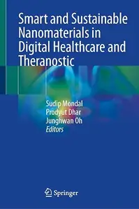

---

**Time:** 11:08:47 (Asia/Tehran)  
**Blog:** hill0  

**Title:** Fundamentals of Electrical Circuit Analysis (2nd Edition)  

**Details:** English | 2026 | ISBN: 9819507634 | 598 Pages | PDF EPUB (True) | 96 MB  

**Link:** http://zavat.pw/ebooks/9819507634.html  

---

**Time:** 11:08:47 (Asia/Tehran)  
**Blog:** hill0  

**Title:** RF & Microwave Multi-mode and Tunable Filters  

**Details:** English | 2026 | ISBN: 981920576X | 148 Pages | PDF EPUB (True) | 54 MB  

**Link:** http://zavat.pw/ebooks/981920576X.html  

---

**Time:** 11:08:47 (Asia/Tehran)  
**Blog:** hill0  

**Title:** Organic Chemical Methods  

**Details:** English | 2026 | ISBN: 3662735725 | 312 Pages | PDF EPUB (True) | 66 MB  

**Link:** http://zavat.pw/ebooks/3662735725.html  

---

**Time:** 11:08:47 (Asia/Tehran)  
**Blog:** hill0  

**Title:** Power System Fundamentals with PowerFactory  

**Details:** English | 2026 | ISBN: 3032324491 | 222 Pages | PDF EPUB (True) | 60 MB  

**Link:** http://zavat.pw/ebooks/3032324491.html  

---

**Time:** 11:08:47 (Asia/Tehran)  
**Blog:** hill0  

**Title:** Medical Neuroanatomy for the Boards and the Clinic (3rd Edition)  

**Details:** English | 2026 | ISBN: 3032307287 | 345 Pages | PDF EPUB (True) | 184 MB  

**Link:** http://zavat.pw/ebooks/3032307287.html  

---

**Time:** 11:08:47 (Asia/Tehran)  
**Blog:** hill0  

**Title:** Sustainability and ESG in Marketing  

**Details:** English | 2026 | ISBN: 3032255139 | 218 Pages | PDF EPUB (True) | 5 MB  

**Link:** http://zavat.pw/ebooks/3032255139.html  

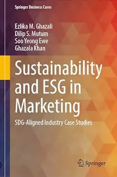

---

**Time:** 11:08:47 (Asia/Tehran)  
**Blog:** hill0  

**Title:** Methusalem Seminars at Ghent Analysis and PDE Center  

**Details:** English | 2026 | ISBN: 3032224926 | 125 Pages | PDF EPUB (True) | 9 MB  

**Link:** http://zavat.pw/ebooks/3032224926.html  

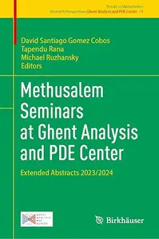

---

**Time:** 11:08:47 (Asia/Tehran)  
**Blog:** hill0  

**Title:** Writing a Medical Research Manuscript  

**Details:** English | 2026 | ISBN: 3032202752 | 183 Pages | PDF EPUB (True) | 24 MB  

**Link:** http://zavat.pw/ebooks/3032202752.html  

---

**Time:** 11:08:47 (Asia/Tehran)  
**Blog:** hill0  

**Title:** Microsoft Fabric Data Factory Playbook (Early Access)  

**Details:** English | 2026 | ISBN: 9781807782917 | 149 Pages | EPUB | 5.5 MB  

**Link:** http://zavat.pw/ebooks/9781807782917.html  

---

**Time:** 11:08:47 (Asia/Tehran)  
**Blog:** hill0  

**Title:** Claude Beyond the Prompt (Early Access)  

**Details:** English | 2026 | ISBN: 9781807782290 | 68 Pages | EPUB | 2.4 MB  

**Link:** http://zavat.pw/ebooks/9781807782290.html  

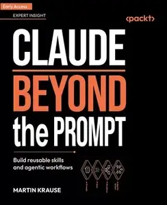

---

**Time:** 11:08:47 (Asia/Tehran)  
**Blog:** hill0  

**Title:** Python for ArcGIS Pro - Second Edition (Early Access)  

**Details:** English | 2026 | ISBN: 9781807303075 | 173 Pages | EPUB | 5 MB  

**Link:** http://zavat.pw/ebooks/9781807303075.html  

---

**Time:** 11:08:47 (Asia/Tehran)  
**Blog:** hill0  

**Title:** Seeing Interaction Design  

**Details:** English | 2026 | ISBN: 3032141990 | 266 Pages | PDF (True) | 41 MB  

**Link:** http://zavat.pw/ebooks/3032141990.html  

---

**Time:** 11:08:47 (Asia/Tehran)  
**Blog:** crazy-slim  

**Title:** kajak-Magazin - September-Oktober 2026  

**Details:** Deutsch | 100 pages | True PDF | 106.4 MB  

**Link:** http://zavat.pw/magazines/kajakMagazinSeptemberOktober2026-86332.html  

---

**Time:** 11:08:47 (Asia/Tehran)  
**Blog:** crazy-slim  

**Title:** Natura Helvetica - August-September 2026  

**Details:** Deutsch | 52 pages | True PDF | 44.9 MB  

**Link:** http://zavat.pw/magazines/NaturaHelveticaAugustSeptember2026-03822.html  

---

**Time:** 11:08:47 (Asia/Tehran)  
**Blog:** crazy-slim  

**Title:** WhatsApp für Einsteiger - August 2026  

**Details:** Deutsch | 57 pages | True PDF | 32.8 MB  

**Link:** http://zavat.pw/magazines/WhatsAppf%C3%BCrEinsteigerAugust2026-05456.html  

---

**Time:** 11:08:47 (Asia/Tehran)  
**Blog:** crazy-slim  

**Title:** Emotion Germany - August 2026  

**Details:** Deutsch | 159 pages | True PDF | 60.8 MB  

**Link:** http://zavat.pw/magazines/EmotionGermanyAugust2026-02904.html  

---

**Time:** 11:08:47 (Asia/Tehran)  
**Blog:** crazy-slim  

**Title:** Kite Magazin - 4 August 2026  

**Details:** Deutsch | 116 pages | True PDF | 60.4 MB  

**Link:** http://zavat.pw/magazines/KiteMagazin4August2026-44850.html  

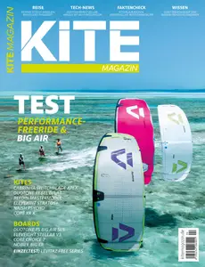

---

**Time:** 11:08:47 (Asia/Tehran)  
**Blog:** crazy-slim  

**Title:** Maxi Germany - September-Oktober 2026  

**Details:** Deutsch | 124 pages | True PDF | 44.8 MB  

**Link:** http://zavat.pw/magazines/MaxiGermanySeptemberOktober2026-50850.html  

---

**Time:** 11:08:47 (Asia/Tehran)  
**Blog:** crazy-slim  

**Title:** The Guardian USA - August 4, 2026  

**Details:** English | 66 pages | PDF | 180.0 MB  

**Link:** http://zavat.pw/newspapers/TheGuardianUSAAugust42026-84408.html  

---

**Time:** 11:08:47 (Asia/Tehran)  
**Blog:** crazy-slim  

**Title:** California Post - August 4, 2026  

**Details:** English | 56 pages | PDF | 92.7 MB  

**Link:** http://zavat.pw/newspapers/CaliforniaPostAugust42026-38148.html  

---

**Time:** 11:08:47 (Asia/Tehran)  
**Blog:** crazy-slim  

**Title:** Corriere dello Sport Stadio - 4 Agosto 2026  

**Details:** Italiano | 40 pages | PDF | 87.0 MB  

**Link:** http://zavat.pw/newspapers/CorrieredelloSportStadio4Agosto2026-96178.html  

---

**Time:** 11:08:47 (Asia/Tehran)  
**Blog:** crazy-slim  

**Title:** Il Tempo - 4 Agosto 2026  

**Details:** Italiano | 24 pages | PDF | 54.0 MB  

**Link:** http://zavat.pw/newspapers/IlTempo4Agosto2026-27463.html  

---

**Time:** 11:08:47 (Asia/Tehran)  
**Blog:** crazy-slim  

**Title:** The Wall Street Journal - August 4, 2026  

**Details:** English | 28 pages | True PDF | 6.7 MB  

**Link:** http://zavat.pw/newspapers/TheWallStreetJournalAugust42026-93679.html  

---

**Time:** 11:08:47 (Asia/Tehran)  
**Blog:** crazy-slim  

**Title:** Vögel Magazin - 4 August 2026  

**Details:** Deutsch | 100 pages | True PDF | 172.7 MB  

**Link:** http://zavat.pw/magazines/V%C3%B6gelMagazin4August2026-36068.html  

---

**Time:** 11:08:47 (Asia/Tehran)  
**Blog:** crazy-slim  

**Title:** Sport Bild Sonderheft - 31 Juli 2026  

**Details:** Deutsch | 244 pages | True PDF | 131.1 MB  

**Link:** http://zavat.pw/magazines/SportBildSonderheft31Juli2026-11171.html  

---

**Time:** 11:08:47 (Asia/Tehran)  
**Blog:** crazy-slim  

**Title:** Rute&Rolle - September 2026  

**Details:** Deutsch | 100 pages | True PDF | 102.9 MB  

**Link:** http://zavat.pw/magazines/RuteRolleSeptember2026-95491.html  

---

**Time:** 11:08:47 (Asia/Tehran)  
**Blog:** crazy-slim  

**Title:** Revue Heute - 4 August 2026  

**Details:** Deutsch | 100 pages | PDF | 108.5 MB  

**Link:** http://zavat.pw/magazines/RevueHeute4August2026-16949.html  

---

**Time:** 08:28:00 (Asia/Tehran)  
**Blog:** AvaxGenius  

**Title:** Multibody Mechanics and Visualization  

**Details:** English | PDF | 2005 | 516 Pages | ISBN : 1852337990 | 14.7 MB  

**Link:** http://zavat.pw/ebooks/18523537990.html  

---

**Time:** 08:28:00 (Asia/Tehran)  
**Blog:** AvaxGenius  

**Title:** Debian GNU/Linux in der Praxis: Anwendungen, Konzepte, Werkzeuge  

**Details:** Deutsch | PDF | 2006 | 576 Pages | ISBN : 3540237860 | 16.4 MB  

**Link:** http://zavat.pw/ebooks/35404237860.html  

---

**Time:** 08:28:00 (Asia/Tehran)  
**Blog:** AvaxGenius  

**Title:** Analysis für Informatiker: Grundlagen, Methoden, Algorithmen  

**Details:** Deutsch | PDF (True) | 2005 | 326 Page s| ISBN : 3540219919 | 3.2 MB  

**Link:** http://zavat.pw/ebooks/3540219919_T.html  

---

**Time:** 08:28:00 (Asia/Tehran)  
**Blog:** AvaxGenius  

**Title:** Differential Equations: Theory and Applications: with Maple®  

**Details:** English | PDF (True) | 2001 | 686 Pages | ISBN : 1475749732 | 53.6 MB  

**Link:** http://zavat.pw/ebooks/14757490732.html  

---

**Time:** 08:28:00 (Asia/Tehran)  
**Blog:** AvaxGenius  

**Title:** Predictive Analytics with Microsoft Azure Machine Learning: Build and Deploy Actionable Solutions in Minutes  

**Details:** English | PDF EPUB (True) | 2014 | 178 Pages | ISBN : 148420445X | 8.9 MB  

**Link:** http://zavat.pw/ebooks/148420445XT.html  

---

**Time:** 08:28:00 (Asia/Tehran)  
**Blog:** AvaxGenius  

**Title:** Supply Chain Strategies, Issues and Models  

**Details:** English | PDF (True) | 2014 | 259 Pages | ISBN : 1447153510 | 4.7 MB  

**Link:** http://zavat.pw/ebooks/14471253510.html  

---

**Time:** 08:28:00 (Asia/Tehran)  
**Blog:** AvaxGenius  

**Title:** Atlas of Functional Shoulder Anatomy  

**Details:** English | PDF (True) | 2008 | 240 Pages | ISBN : 8847007585 | 13.7 MB  

**Link:** http://zavat.pw/ebooks/88473007585.html  

---

**Time:** 08:28:00 (Asia/Tehran)  
**Blog:** AvaxGenius  

**Title:** Elements of Finite Model Theory  

**Details:** English | PDF | 2004 | 320 Pages | ISBN : 3642059481 | 29.2 MB  

**Link:** http://zavat.pw/ebooks/36423059481.html  

---

**Time:** 08:28:00 (Asia/Tehran)  
**Blog:** AvaxGenius  

**Title:** Explainable Artificial Intelligence  

**Details:** English | EPUB (True) | 2026 | 438 Pages | ISBN : 3032083230 | 53.2 MB  

**Link:** http://zavat.pw/ebooks/3032083230E.html  

---

**Time:** 08:28:00 (Asia/Tehran)  
**Blog:** crazy-slim  

**Title:** China Daily Global Edition USA - August 4, 2026  

**Details:** English | 16 pages | PDF | 41.2 MB  

**Link:** http://zavat.pw/newspapers/ChinaDailyGlobalEditionUSAAugust42026-54475.html  

---

**Time:** 08:28:00 (Asia/Tehran)  
**Blog:** crazy-slim  

**Title:** Biohack Yourself - Summer 2026  

**Details:** English | 148 pages | True PDF | 37.8 MB  

**Link:** http://zavat.pw/magazines/BiohackYourselfSummer2026-43559.html  

---

**Time:** 08:28:00 (Asia/Tehran)  
**Blog:** crazy-slim  

**Title:** Gazzetta d'Alba - 4 Agosto 2026  

**Details:** Italiano | 64 pages | True PDF | 31.6 MB  

**Link:** http://zavat.pw/newspapers/GazzettadAlba4Agosto2026-39181.html  

---

**Time:** 08:28:00 (Asia/Tehran)  
**Blog:** crazy-slim  

**Title:** Porsche Magazine N.1 - Agosto-Settembre 2026  

**Details:** Italiano | 116 pages | True PDF | 89.8 MB  

**Link:** http://zavat.pw/magazines/PorscheMagazineN1AgostoSettembre2026-58385.html  

---

**Time:** 08:28:00 (Asia/Tehran)  
**Blog:** crazy-slim  

**Title:** Buscadero Speciale N.2 - Agosto-Settembre 2026  

**Details:** Italiano | 116 pages | True PDF | 28.0 MB  

**Link:** http://zavat.pw/magazines/BuscaderoSpecialeN2AgostoSettembre2026-91656.html  

---

**Time:** 08:28:00 (Asia/Tehran)  
**Blog:** crazy-slim  

**Title:** Rum - 3 Augusti 2026  

**Details:** Svenska | 180 pages | PDF | 126.3 MB  

**Link:** http://zavat.pw/magazines/Rum3Augusti2026-80847.html  

---

**Time:** 08:28:00 (Asia/Tehran)  
**Blog:** crazy-slim  

**Title:** Telepiù - 4 Agosto 2026  

**Details:** Italiano | 132 pages | PDF | 131.4 MB  

**Link:** http://zavat.pw/magazines/Telepi%C3%B94Agosto2026-71071.html  

---

**Time:** 08:28:00 (Asia/Tehran)  
**Blog:** crazy-slim  

**Title:** Framgångsguide - 4 Augusti 2026  

**Details:** Svenska | 148 pages | PDF | 65.8 MB  

**Link:** http://zavat.pw/magazines/Framg%C3%A5ngsguide4Augusti2026-86496.html  

---

**Time:** 08:28:00 (Asia/Tehran)  
**Blog:** crazy-slim  

**Title:** TV Sorrisi e Canzoni - 4 Agosto 2026  

**Details:** Italiano | 124 pages | True PDF | 95.4 MB  

**Link:** http://zavat.pw/magazines/TVSorrisieCanzoni4Agosto2026-63220.html  

---

**Time:** 08:28:00 (Asia/Tehran)  
**Blog:** crazy-slim  

**Title:** Ljud & Bild - 4 Augusti 2026  

**Details:** Svenska | 92 pages | True PDF | 58.0 MB  

**Link:** http://zavat.pw/magazines/LjudBild4Augusti2026-36872.html  

---

**Time:** 08:28:00 (Asia/Tehran)  
**Blog:** crazy-slim  

**Title:** Saber y Sabor - Número 201 2026  

**Details:** Español | 252 pages | True PDF | 48.2 MB  

**Link:** http://zavat.pw/magazines/SaberySaborN%C3%BAmero2012026-90473.html  

---

**Time:** 08:28:00 (Asia/Tehran)  
**Blog:** crazy-slim  

**Title:** Old Gamer - 2 Agosto 2026  

**Details:** Portuguese | 52 pages | True PDF | 39.4 MB  

**Link:** http://zavat.pw/magazines/OldGamer2Agosto2026-36105.html  

---

**Time:** 08:28:00 (Asia/Tehran)  
**Blog:** crazy-slim  

**Title:** Settimana Sudoku N.1095 - Agosto 2026  

**Details:** Italiano | 48 pages | PDF | 26.7 MB  

**Link:** http://zavat.pw/magazines/SettimanaSudokuN1095Agosto2026-77062.html  

---

**Time:** 08:28:00 (Asia/Tehran)  
**Blog:** crazy-slim  

**Title:** Horóscopo do Dia - 3 Agosto 2026  

**Details:** Portuguese | 18 pages | True PDF | 10.0 MB  

**Link:** http://zavat.pw/magazines/Hor%C3%B3scopodoDia3Agosto2026-36466.html  

---

**Time:** 08:28:00 (Asia/Tehran)  
**Blog:** crazy-slim  

**Title:** Ricette Per Friggitrici Ad Aria - Agosto-Settembre 2026  

**Details:** Italiano | 84 pages | True PDF | 98.4 MB  

**Link:** http://zavat.pw/magazines/RicettePerFriggitriciAdAriaAgostoSettembre2026-72379.html  

---

**Time:** 01:30:57 (Asia/Tehran)  
**Blog:** hill0  

**Title:** Data-Driven Project Management with Python  

**Details:** English | 2026 | ISBN: 3032245559 | 168 Pages | PDF EPUB (True) | 20 MB  

**Link:** http://zavat.pw/ebooks/3032245559.html  

---

**Time:** 01:30:57 (Asia/Tehran)  
**Blog:** hill0  

**Title:** Lebesgue's Theory of Singular Integrals  

**Details:** English | 2026 | ISBN: 9819207371 | 225 Pages | PDF EPUB (True) | 17 MB  

**Link:** http://zavat.pw/ebooks/9819207371.html  

---

**Time:** 01:30:57 (Asia/Tehran)  
**Blog:** hill0  

**Title:** The Research Publishing Playbook  

**Details:** English | 2026 | ISBN: 3032285038 | 94 Pages | PDF EPUB (True) | 12 MB  

**Link:** http://zavat.pw/ebooks/3032285038.html  

---

**Time:** 01:30:57 (Asia/Tehran)  
**Blog:** hill0  

**Title:** Backward Stochastic Volterra Integral Equations  

**Details:** English | 2026 | ISBN: 3032208475 | 605 Pages | PDF EPUB (True) | 40 MB  

**Link:** http://zavat.pw/ebooks/3032208475.html  

---

**Time:** 01:30:57 (Asia/Tehran)  
**Blog:** hill0  

**Title:** Economics, Law and Humanities of AI  

**Details:** English | 2026 | ISBN: 3032212065 | 369 Pages | PDF EPUB (True) | 45 MB  

**Link:** http://zavat.pw/ebooks/3032212065.html  

---

**Time:** 01:30:57 (Asia/Tehran)  
**Blog:** hill0  

**Title:** Metal Chalcogenides for Energy Storage  

**Details:** English | 2026 | ISBN: 3031933060 | 598 Pages | PDF (True) | 74 MB  

**Link:** http://zavat.pw/ebooks/3031933060.html  

---

**Time:** 01:30:57 (Asia/Tehran)  
**Blog:** hill0  

**Title:** Intelligent Manufacturing Engineering: Deep Operations Research  

**Details:** English | 2026 | ISBN: 981953108X | 530 Pages | PDF EPUB (True) | 78 MB  

**Link:** http://zavat.pw/ebooks/981953108X.html  

---

**Time:** 01:30:57 (Asia/Tehran)  
**Blog:** hill0  

**Title:** Treatment of the Cruciate Ligaments Injuries  

**Details:** English | 2026 | ISBN: 9819590388 | 216 Pages | PDF (True) | 115 MB  

**Link:** http://zavat.pw/ebooks/9819590388.html  

---

**Time:** 01:30:57 (Asia/Tehran)  
**Blog:** hill0  

**Title:** Handbook of Innovation  

**Details:** English | 2026 | ISBN: 3032114047 | 1154 Pages | PDF EPUB (True) | 17 MB  

**Link:** http://zavat.pw/ebooks/3032114047.html  

---

**Time:** 01:30:57 (Asia/Tehran)  
**Blog:** hill0  

**Title:** Prompt Engineering for Accounting and Finance: Theory and Practice  

**Details:** English | 2026 | ISBN: 3032111943 | 740 Pages | PDF EPUB (True) | 17 MB  

**Link:** http://zavat.pw/ebooks/3032111943.html  

---

**Time:** 01:30:57 (Asia/Tehran)  
**Blog:** hill0  

**Title:** Privacy Preservation in Blockchain-based Financial Services  

**Details:** English | 2026 | ISBN: 3032217288 | 161 Pages | PDF EPUB (True) | 11 MB  

**Link:** http://zavat.pw/ebooks/3032217288.html  

---

**Time:** 01:30:57 (Asia/Tehran)  
**Blog:** hill0  

**Title:** Multidisciplinary Management of Sleeve Gastrectomy  

**Details:** English | 2026 | ISBN: 3032256437 | 333 Pages | PDF EPUB (True) | 10 MB  

**Link:** http://zavat.pw/ebooks/3032256437.html  

---

**Time:** 01:30:57 (Asia/Tehran)  
**Blog:** hill0  

**Title:** Differential Geometry and Group Theory  

**Details:** English | 2026 | ISBN: 3032275172 | 285 Pages | PDF EPUB (True) | 16 MB  

**Link:** http://zavat.pw/ebooks/3032275172.html  

---

**Time:** 01:30:57 (Asia/Tehran)  
**Blog:** hill0  

**Title:** Computational Physics I: Numerical Methods (4th Edition)  

**Details:** English | 2026 | ISBN: 3032078555 | 431 Pages | PDF EPUB (True) | 38 MB  

**Link:** http://zavat.pw/ebooks/3032078555.html  

---

**Time:** 01:30:57 (Asia/Tehran)  
**Blog:** hill0  

**Title:** Cell Culture for Universal Application  

**Details:** English | 2026 | ISBN: 303228872X | 471 Pages | PDF EPUB (True) | 20 MB  

**Link:** http://zavat.pw/ebooks/303228872X.html  

---

**Time:** 00:11:40 (Asia/Tehran)  
**Blog:** IrGens  

**Title:** Deep Time in the Mono Lake Basin: Nature and History over the Last 10,000 Years  

**Details:** English | May 19, 2026 | ISBN: 0520428579, 9780520428591 | True EPUB | 384 pages | 14.2 MB  

**Link:** http://zavat.pw/ebooks/0520428579-epub.html  

---

**Time:** 00:11:40 (Asia/Tehran)  
**Blog:** IrGens  

**Title:** Citizen of the Shadows: The Lives and Lies of Lothar Witzke  

**Details:** English | October 7, 2025 | ISBN: 9798895270325, 9798895270332, 9798895270349 | True EPUB | 504 pages | 14.4 MB  

**Link:** http://zavat.pw/ebooks/9798895270325.html  

---

**Time:** 00:11:40 (Asia/Tehran)  
**Blog:** IrGens  

**Title:** On the Origin of Species and Other Stories  

**Details:** English | May 25, 2021 | ISBN: 1885030711, 9781885030740 | True EPUB | 224 pages | 4.6 MB  

**Link:** http://zavat.pw/ebooks/1885030711.html  

---

**Time:** 00:11:40 (Asia/Tehran)  
**Blog:** IrGens  

**Title:** Centerpiece: Bold, vibrant recipes to put vegetables in the spotlight  

**Details:** English | 9 April 2026 | ISBN: 1783256656, 1783256540, 9781783256556, 9781783256662 | True EPUB | 224 pages | 28.8 MB  

**Link:** http://zavat.pw/ebooks/1783256656.html  

---

**Time:** 00:11:40 (Asia/Tehran)  
**Blog:** IrGens  

**Title:** Mon Cher Amour: The Love Letters of Albert Camus and Maria Casares, 1944-1959  

**Details:** English | April 21, 2026 | ISBN: 0525656618, 9780525656623 | True EPUB | 1200 pages | 5.97 MB  

**Link:** http://zavat.pw/ebooks/0525656618.html  

---

**Time:** 00:11:40 (Asia/Tehran)  
**Blog:** hill0  

**Title:** The Well-Grounded Rubyist, Fourth Edition  

**Details:** English | 2026 | ISBN: 1633434869 | 822 Pages | EPUB | 1 MB  

**Link:** http://zavat.pw/ebooks/1633434869.html  

