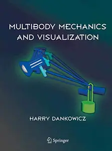
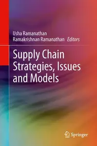
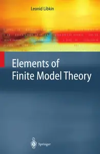
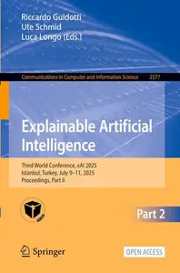
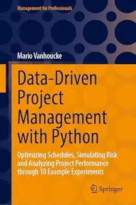

# Zavat feed - 2026-08-04

---

**Time:** 08:28:00 (Asia/Tehran)  
**Blog:** AvaxGenius  

**Title:** Multibody Mechanics and Visualization  

**Details:** English | PDF | 2005 | 516 Pages | ISBN : 1852337990 | 14.7 MB  

**Link:** http://zavat.pw/ebooks/18523537990.html  

---

**Time:** 08:28:00 (Asia/Tehran)  
**Blog:** AvaxGenius  

**Title:** Debian GNU/Linux in der Praxis: Anwendungen, Konzepte, Werkzeuge  

**Details:** Deutsch | PDF | 2006 | 576 Pages | ISBN : 3540237860 | 16.4 MB  

**Link:** http://zavat.pw/ebooks/35404237860.html  

---

**Time:** 08:28:00 (Asia/Tehran)  
**Blog:** AvaxGenius  

**Title:** Analysis für Informatiker: Grundlagen, Methoden, Algorithmen  

**Details:** Deutsch | PDF (True) | 2005 | 326 Page s| ISBN : 3540219919 | 3.2 MB  

**Link:** http://zavat.pw/ebooks/3540219919_T.html  

---

**Time:** 08:28:00 (Asia/Tehran)  
**Blog:** AvaxGenius  

**Title:** Differential Equations: Theory and Applications: with Maple®  

**Details:** English | PDF (True) | 2001 | 686 Pages | ISBN : 1475749732 | 53.6 MB  

**Link:** http://zavat.pw/ebooks/14757490732.html  

---

**Time:** 08:28:00 (Asia/Tehran)  
**Blog:** AvaxGenius  

**Title:** Predictive Analytics with Microsoft Azure Machine Learning: Build and Deploy Actionable Solutions in Minutes  

**Details:** English | PDF EPUB (True) | 2014 | 178 Pages | ISBN : 148420445X | 8.9 MB  

**Link:** http://zavat.pw/ebooks/148420445XT.html  

---

**Time:** 08:28:00 (Asia/Tehran)  
**Blog:** AvaxGenius  

**Title:** Supply Chain Strategies, Issues and Models  

**Details:** English | PDF (True) | 2014 | 259 Pages | ISBN : 1447153510 | 4.7 MB  

**Link:** http://zavat.pw/ebooks/14471253510.html  

---

**Time:** 08:28:00 (Asia/Tehran)  
**Blog:** AvaxGenius  

**Title:** Atlas of Functional Shoulder Anatomy  

**Details:** English | PDF (True) | 2008 | 240 Pages | ISBN : 8847007585 | 13.7 MB  

**Link:** http://zavat.pw/ebooks/88473007585.html  

---

**Time:** 08:28:00 (Asia/Tehran)  
**Blog:** AvaxGenius  

**Title:** Elements of Finite Model Theory  

**Details:** English | PDF | 2004 | 320 Pages | ISBN : 3642059481 | 29.2 MB  

**Link:** http://zavat.pw/ebooks/36423059481.html  

---

**Time:** 08:28:00 (Asia/Tehran)  
**Blog:** AvaxGenius  

**Title:** Explainable Artificial Intelligence  

**Details:** English | EPUB (True) | 2026 | 438 Pages | ISBN : 3032083230 | 53.2 MB  

**Link:** http://zavat.pw/ebooks/3032083230E.html  

---

**Time:** 08:28:00 (Asia/Tehran)  
**Blog:** crazy-slim  

**Title:** China Daily Global Edition USA - August 4, 2026  

**Details:** English | 16 pages | PDF | 41.2 MB  

**Link:** http://zavat.pw/newspapers/ChinaDailyGlobalEditionUSAAugust42026-54475.html  

---

**Time:** 08:28:00 (Asia/Tehran)  
**Blog:** crazy-slim  

**Title:** Biohack Yourself - Summer 2026  

**Details:** English | 148 pages | True PDF | 37.8 MB  

**Link:** http://zavat.pw/magazines/BiohackYourselfSummer2026-43559.html  

---

**Time:** 08:28:00 (Asia/Tehran)  
**Blog:** crazy-slim  

**Title:** Gazzetta d'Alba - 4 Agosto 2026  

**Details:** Italiano | 64 pages | True PDF | 31.6 MB  

**Link:** http://zavat.pw/newspapers/GazzettadAlba4Agosto2026-39181.html  

---

**Time:** 08:28:00 (Asia/Tehran)  
**Blog:** crazy-slim  

**Title:** Porsche Magazine N.1 - Agosto-Settembre 2026  

**Details:** Italiano | 116 pages | True PDF | 89.8 MB  

**Link:** http://zavat.pw/magazines/PorscheMagazineN1AgostoSettembre2026-58385.html  

---

**Time:** 08:28:00 (Asia/Tehran)  
**Blog:** crazy-slim  

**Title:** Buscadero Speciale N.2 - Agosto-Settembre 2026  

**Details:** Italiano | 116 pages | True PDF | 28.0 MB  

**Link:** http://zavat.pw/magazines/BuscaderoSpecialeN2AgostoSettembre2026-91656.html  

---

**Time:** 08:28:00 (Asia/Tehran)  
**Blog:** crazy-slim  

**Title:** Rum - 3 Augusti 2026  

**Details:** Svenska | 180 pages | PDF | 126.3 MB  

**Link:** http://zavat.pw/magazines/Rum3Augusti2026-80847.html  

---

**Time:** 08:28:00 (Asia/Tehran)  
**Blog:** crazy-slim  

**Title:** Telepiù - 4 Agosto 2026  

**Details:** Italiano | 132 pages | PDF | 131.4 MB  

**Link:** http://zavat.pw/magazines/Telepi%C3%B94Agosto2026-71071.html  

---

**Time:** 08:28:00 (Asia/Tehran)  
**Blog:** crazy-slim  

**Title:** Framgångsguide - 4 Augusti 2026  

**Details:** Svenska | 148 pages | PDF | 65.8 MB  

**Link:** http://zavat.pw/magazines/Framg%C3%A5ngsguide4Augusti2026-86496.html  

---

**Time:** 08:28:00 (Asia/Tehran)  
**Blog:** crazy-slim  

**Title:** TV Sorrisi e Canzoni - 4 Agosto 2026  

**Details:** Italiano | 124 pages | True PDF | 95.4 MB  

**Link:** http://zavat.pw/magazines/TVSorrisieCanzoni4Agosto2026-63220.html  

---

**Time:** 08:28:00 (Asia/Tehran)  
**Blog:** crazy-slim  

**Title:** Ljud & Bild - 4 Augusti 2026  

**Details:** Svenska | 92 pages | True PDF | 58.0 MB  

**Link:** http://zavat.pw/magazines/LjudBild4Augusti2026-36872.html  

---

**Time:** 08:28:00 (Asia/Tehran)  
**Blog:** crazy-slim  

**Title:** Saber y Sabor - Número 201 2026  

**Details:** Español | 252 pages | True PDF | 48.2 MB  

**Link:** http://zavat.pw/magazines/SaberySaborN%C3%BAmero2012026-90473.html  

---

**Time:** 08:28:00 (Asia/Tehran)  
**Blog:** crazy-slim  

**Title:** Old Gamer - 2 Agosto 2026  

**Details:** Portuguese | 52 pages | True PDF | 39.4 MB  

**Link:** http://zavat.pw/magazines/OldGamer2Agosto2026-36105.html  

---

**Time:** 08:28:00 (Asia/Tehran)  
**Blog:** crazy-slim  

**Title:** Settimana Sudoku N.1095 - Agosto 2026  

**Details:** Italiano | 48 pages | PDF | 26.7 MB  

**Link:** http://zavat.pw/magazines/SettimanaSudokuN1095Agosto2026-77062.html  

---

**Time:** 08:28:00 (Asia/Tehran)  
**Blog:** crazy-slim  

**Title:** Horóscopo do Dia - 3 Agosto 2026  

**Details:** Portuguese | 18 pages | True PDF | 10.0 MB  

**Link:** http://zavat.pw/magazines/Hor%C3%B3scopodoDia3Agosto2026-36466.html  

---

**Time:** 08:28:00 (Asia/Tehran)  
**Blog:** crazy-slim  

**Title:** Ricette Per Friggitrici Ad Aria - Agosto-Settembre 2026  

**Details:** Italiano | 84 pages | True PDF | 98.4 MB  

**Link:** http://zavat.pw/magazines/RicettePerFriggitriciAdAriaAgostoSettembre2026-72379.html  

---

**Time:** 01:30:57 (Asia/Tehran)  
**Blog:** hill0  

**Title:** Data-Driven Project Management with Python  

**Details:** English | 2026 | ISBN: 3032245559 | 168 Pages | PDF EPUB (True) | 20 MB  

**Link:** http://zavat.pw/ebooks/3032245559.html  

---

**Time:** 01:30:57 (Asia/Tehran)  
**Blog:** hill0  

**Title:** Lebesgue's Theory of Singular Integrals  

**Details:** English | 2026 | ISBN: 9819207371 | 225 Pages | PDF EPUB (True) | 17 MB  

**Link:** http://zavat.pw/ebooks/9819207371.html  

---

**Time:** 01:30:57 (Asia/Tehran)  
**Blog:** hill0  

**Title:** The Research Publishing Playbook  

**Details:** English | 2026 | ISBN: 3032285038 | 94 Pages | PDF EPUB (True) | 12 MB  

**Link:** http://zavat.pw/ebooks/3032285038.html  

---

**Time:** 01:30:57 (Asia/Tehran)  
**Blog:** hill0  

**Title:** Backward Stochastic Volterra Integral Equations  

**Details:** English | 2026 | ISBN: 3032208475 | 605 Pages | PDF EPUB (True) | 40 MB  

**Link:** http://zavat.pw/ebooks/3032208475.html  

---

**Time:** 01:30:57 (Asia/Tehran)  
**Blog:** hill0  

**Title:** Economics, Law and Humanities of AI  

**Details:** English | 2026 | ISBN: 3032212065 | 369 Pages | PDF EPUB (True) | 45 MB  

**Link:** http://zavat.pw/ebooks/3032212065.html  

---

**Time:** 01:30:57 (Asia/Tehran)  
**Blog:** hill0  

**Title:** Metal Chalcogenides for Energy Storage  

**Details:** English | 2026 | ISBN: 3031933060 | 598 Pages | PDF (True) | 74 MB  

**Link:** http://zavat.pw/ebooks/3031933060.html  

---

**Time:** 01:30:57 (Asia/Tehran)  
**Blog:** hill0  

**Title:** Intelligent Manufacturing Engineering: Deep Operations Research  

**Details:** English | 2026 | ISBN: 981953108X | 530 Pages | PDF EPUB (True) | 78 MB  

**Link:** http://zavat.pw/ebooks/981953108X.html  

---

**Time:** 01:30:57 (Asia/Tehran)  
**Blog:** hill0  

**Title:** Treatment of the Cruciate Ligaments Injuries  

**Details:** English | 2026 | ISBN: 9819590388 | 216 Pages | PDF (True) | 115 MB  

**Link:** http://zavat.pw/ebooks/9819590388.html  

---

**Time:** 01:30:57 (Asia/Tehran)  
**Blog:** hill0  

**Title:** Handbook of Innovation  

**Details:** English | 2026 | ISBN: 3032114047 | 1154 Pages | PDF EPUB (True) | 17 MB  

**Link:** http://zavat.pw/ebooks/3032114047.html  

---

**Time:** 01:30:57 (Asia/Tehran)  
**Blog:** hill0  

**Title:** Prompt Engineering for Accounting and Finance: Theory and Practice  

**Details:** English | 2026 | ISBN: 3032111943 | 740 Pages | PDF EPUB (True) | 17 MB  

**Link:** http://zavat.pw/ebooks/3032111943.html  

---

**Time:** 01:30:57 (Asia/Tehran)  
**Blog:** hill0  

**Title:** Privacy Preservation in Blockchain-based Financial Services  

**Details:** English | 2026 | ISBN: 3032217288 | 161 Pages | PDF EPUB (True) | 11 MB  

**Link:** http://zavat.pw/ebooks/3032217288.html  

---

**Time:** 01:30:57 (Asia/Tehran)  
**Blog:** hill0  

**Title:** Multidisciplinary Management of Sleeve Gastrectomy  

**Details:** English | 2026 | ISBN: 3032256437 | 333 Pages | PDF EPUB (True) | 10 MB  

**Link:** http://zavat.pw/ebooks/3032256437.html  

---

**Time:** 01:30:57 (Asia/Tehran)  
**Blog:** hill0  

**Title:** Differential Geometry and Group Theory  

**Details:** English | 2026 | ISBN: 3032275172 | 285 Pages | PDF EPUB (True) | 16 MB  

**Link:** http://zavat.pw/ebooks/3032275172.html  

---

**Time:** 01:30:57 (Asia/Tehran)  
**Blog:** hill0  

**Title:** Computational Physics I: Numerical Methods (4th Edition)  

**Details:** English | 2026 | ISBN: 3032078555 | 431 Pages | PDF EPUB (True) | 38 MB  

**Link:** http://zavat.pw/ebooks/3032078555.html  

---

**Time:** 01:30:57 (Asia/Tehran)  
**Blog:** hill0  

**Title:** Cell Culture for Universal Application  

**Details:** English | 2026 | ISBN: 303228872X | 471 Pages | PDF EPUB (True) | 20 MB  

**Link:** http://zavat.pw/ebooks/303228872X.html  

---

**Time:** 00:11:40 (Asia/Tehran)  
**Blog:** IrGens  

**Title:** Deep Time in the Mono Lake Basin: Nature and History over the Last 10,000 Years  

**Details:** English | May 19, 2026 | ISBN: 0520428579, 9780520428591 | True EPUB | 384 pages | 14.2 MB  

**Link:** http://zavat.pw/ebooks/0520428579-epub.html  

---

**Time:** 00:11:40 (Asia/Tehran)  
**Blog:** IrGens  

**Title:** Citizen of the Shadows: The Lives and Lies of Lothar Witzke  

**Details:** English | October 7, 2025 | ISBN: 9798895270325, 9798895270332, 9798895270349 | True EPUB | 504 pages | 14.4 MB  

**Link:** http://zavat.pw/ebooks/9798895270325.html  

---

**Time:** 00:11:40 (Asia/Tehran)  
**Blog:** IrGens  

**Title:** On the Origin of Species and Other Stories  

**Details:** English | May 25, 2021 | ISBN: 1885030711, 9781885030740 | True EPUB | 224 pages | 4.6 MB  

**Link:** http://zavat.pw/ebooks/1885030711.html  

---

**Time:** 00:11:40 (Asia/Tehran)  
**Blog:** IrGens  

**Title:** Centerpiece: Bold, vibrant recipes to put vegetables in the spotlight  

**Details:** English | 9 April 2026 | ISBN: 1783256656, 1783256540, 9781783256556, 9781783256662 | True EPUB | 224 pages | 28.8 MB  

**Link:** http://zavat.pw/ebooks/1783256656.html  

---

**Time:** 00:11:40 (Asia/Tehran)  
**Blog:** IrGens  

**Title:** Mon Cher Amour: The Love Letters of Albert Camus and Maria Casares, 1944-1959  

**Details:** English | April 21, 2026 | ISBN: 0525656618, 9780525656623 | True EPUB | 1200 pages | 5.97 MB  

**Link:** http://zavat.pw/ebooks/0525656618.html  

---

**Time:** 00:11:40 (Asia/Tehran)  
**Blog:** hill0  

**Title:** The Well-Grounded Rubyist, Fourth Edition  

**Details:** English | 2026 | ISBN: 1633434869 | 822 Pages | EPUB | 1 MB  

**Link:** http://zavat.pw/ebooks/1633434869.html  

