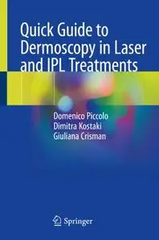
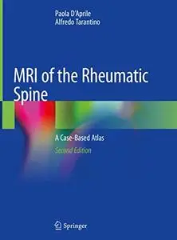
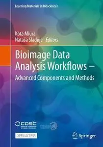
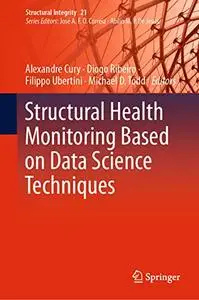
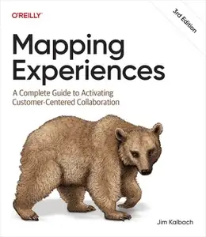

# Zavat feed - 2026-08-05

---

**Time:** 06:04:33 (Asia/Tehran)  
**Blog:** AvaxGenius  

**Title:** The Fourth Terminal: Benefits of Body-Biasing Techniques for FDSOI Circuits and Systems (Repost)  

**Details:** English | EPUB (True) | 2020 | 430 Pages | ISBN : 3030394956 | 102.9 MB  

**Link:** http://zavat.pw/ebooks/302303945956.html  

---

**Time:** 06:04:33 (Asia/Tehran)  
**Blog:** AvaxGenius  

**Title:** Quick Guide to Dermoscopy in Laser and IPL Treatments (Repost)  

**Details:** English | EPUB | 2020 | 143 Pages | ISBN : 3319416324 | 106.8 MB  

**Link:** http://zavat.pw/ebooks/331594163254.html  

---

**Time:** 06:04:33 (Asia/Tehran)  
**Blog:** AvaxGenius  

**Title:** The International System for Serous Fluid Cytopathology (Repost)  

**Details:** English | EPUB | 2020 | 315 Pages | ISBN : 3030539075 | 203.7 MB  

**Link:** http://zavat.pw/ebooks/303035390755.html  

---

**Time:** 06:04:33 (Asia/Tehran)  
**Blog:** AvaxGenius  

**Title:** Imaging of CNS Infections and Neuroimmunology (Repost)  

**Details:** English | EPUB | 2019 | 213 Pages | ISBN : 9811369038 | 95.4 MB  

**Link:** http://zavat.pw/ebooks/981153690328.html  

---

**Time:** 06:04:33 (Asia/Tehran)  
**Blog:** AvaxGenius  

**Title:** Acute Abdomen During Pregnancy, Second Edition (Repost)  

**Details:** English | EPUB | 2018 | 853 Pages | ISBN : 3319729942 | 107.4 MB  

**Link:** http://zavat.pw/ebooks/334197249942.html  

---

**Time:** 06:04:33 (Asia/Tehran)  
**Blog:** AvaxGenius  

**Title:** Geometry and Vision (Repost)  

**Details:** English | EPUB | 2021 | 407 Pages | ISBN : 3030720721 | 108.2 MB  

**Link:** http://zavat.pw/ebooks/303074320721.html  

---

**Time:** 06:04:33 (Asia/Tehran)  
**Blog:** AvaxGenius  

**Title:** MRI of the Rheumatic Spine: A Case-Based Atlas, Second Edition (Repost)  

**Details:** English | EPUB | 2020 | 223 Pages | ISBN : 303032995X | 109.1 MB  

**Link:** http://zavat.pw/ebooks/30304329954X.html  

---

**Time:** 06:04:33 (Asia/Tehran)  
**Blog:** AvaxGenius  

**Title:** Bioimage Data Analysis Workflows ‒ Advanced Components and Methods (Repost)  

**Details:** English | EPUB (True) | 2022 | 218 Pages | ISBN : 3030763935 | 225.5 MB  

**Link:** http://zavat.pw/ebooks/303607633935.html  

---

**Time:** 06:04:33 (Asia/Tehran)  
**Blog:** AvaxGenius  

**Title:** Advancement of GI-Science and Sustainable Agriculture: A Multi-dimensional Approach(Repost)  

**Details:** English | EPUB (True) | 2023 | 355 Pages | ISBN : 303136824X | 139.9 MB  

**Link:** http://zavat.pw/ebooks/34031362824X.html  

---

**Time:** 06:04:33 (Asia/Tehran)  
**Blog:** AvaxGenius  

**Title:** Ocular Oncology (Repost)  

**Details:** English | EPUB | 2019 | 158 Pages | ISBN : 9811323356 | 96.7 MB  

**Link:** http://zavat.pw/ebooks/981132443356.html  

---

**Time:** 06:04:33 (Asia/Tehran)  
**Blog:** AvaxGenius  

**Title:** Applied Head and Neck Anatomy for the Facial Cosmetic Surgeon (Repost)  

**Details:** English | EPUB | 2021 | 245 Pages | ISBN : 3030579301 | 121.3 MB  

**Link:** http://zavat.pw/ebooks/303305792301.html  

---

**Time:** 06:04:33 (Asia/Tehran)  
**Blog:** AvaxGenius  

**Title:** Enhancing Biomedical Education: Integrating Digital Visualization and 3D Technologies (Repost)  

**Details:** English | PDF EPUB (True) | 2025 | 382 Pages | ISBN : 3031732693 | 129.4 MB  

**Link:** http://zavat.pw/ebooks/303144732693.html  

---

**Time:** 06:04:33 (Asia/Tehran)  
**Blog:** AvaxGenius  

**Title:** Frontiers in Neutron Capture Therapy (Repost)  

**Details:** English | PDF | 2001 | 1389 Pages | ISBN : 030646442X | 129.3 MB  

**Link:** http://zavat.pw/ebooks/03056456442X.html  

---

**Time:** 06:04:33 (Asia/Tehran)  
**Blog:** AvaxGenius  

**Title:** Structural Health Monitoring Based on Data Science Techniques (Repost)  

**Details:** English | EPUB | 2022 | 490 Pages | ISBN : 3030817156 | 105.3 MB  

**Link:** http://zavat.pw/ebooks/304308127156.html  

---

**Time:** 06:04:33 (Asia/Tehran)  
**Blog:** AvaxGenius  

**Title:** Prostate Biopsy Interpretation: An Illustrated Guide (Repost)  

**Details:** English | EPUB | 2019 | 212 Pages | ISBN : 3030136000 | 548.3 MB  

**Link:** http://zavat.pw/ebooks/303401346000.html  

---

**Time:** 01:16:04 (Asia/Tehran)  
**Blog:** hill0  

**Title:** Mapping Experiences, 3rd Edition  

**Details:** English | 2026 | ASIN: B0GQFQZSH7 | 468 Pages | EPUB | 105 MB  

**Link:** http://zavat.pw/ebooks/B0GQFQZSH7.html  

---

**Time:** 01:16:04 (Asia/Tehran)  
**Blog:** hill0  

**Title:** Data Engineering for Multimodal AI  

**Details:** English | 2026 | ISBN: 1098190785 | 635 Pages | EPUB | 24 MB  

**Link:** http://zavat.pw/ebooks/1098190785.html  

