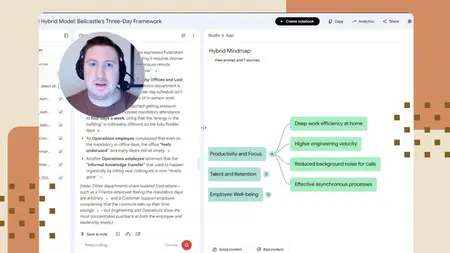
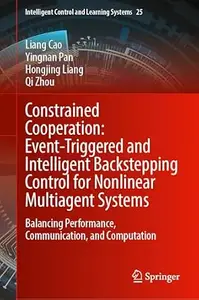

# Zavat feed - 2026-08-06

---

**Time:** 03:23:07 (Asia/Tehran)  
**Blog:** IrGens  

**Title:** Influencing Decisions with Data and AI: Nontechnical Skills for Data and AI Professionals  

**Details:** .MP4, AVC, 1280x720, 30 fps | English, AAC, 2 Ch | 1h 22m | 264 MB  

**Link:** http://zavat.pw/ebooks/influencing-decisions-with-data-and-ai-nontechnical-skills-for-data-and-ai-professionals.html  

---

**Time:** 03:23:07 (Asia/Tehran)  
**Blog:** IrGens  

**Title:** Integrating AWS Cost Optimization and FinOps Principles  

**Details:** .MP4, AVC, 1280x720, 30 fps | English, AAC, 2 Ch | 2h 53m | 410 MB  

**Link:** http://zavat.pw/ebooks/integrating-aws-cost-optimization-and-finops-principles.html  

---

**Time:** 03:23:07 (Asia/Tehran)  
**Blog:** IrGens  

**Title:** AI-Assisted Research with Google Gemini Notebook  

**Details:** .MP4, AVC, 1280x720, 30 fps | English, AAC, 2 Ch | 51m | 196 MB  

**Link:** http://zavat.pw/ebooks/ai-assisted-research-with-google-gemini-notebook.html  

---

**Time:** 01:12:15 (Asia/Tehran)  
**Blog:** hill0  

**Title:** Americans and All the Rest: Identity and Foreign Policy in U.S. History  

**Details:** English | 2026 | ISBN: 9819599202 | 241 Pages | PDF EPUB (True) | 27 MB  

**Link:** http://zavat.pw/ebooks/9819599202.html  

---

**Time:** 01:12:15 (Asia/Tehran)  
**Blog:** hill0  

**Title:** Constrained Cooperation  

**Details:** English | 2026 | ISBN: 9819577411 | 317 Pages | PDF (True) | 19 MB  

**Link:** http://zavat.pw/ebooks/9819577411.html  

---

**Time:** 01:12:15 (Asia/Tehran)  
**Blog:** hill0  

**Title:** Thermal Expansion of Polymers  

**Details:** English | 2026 | ISBN: 3527355235 | 306 Pages | PDF | 11 MB  

**Link:** http://zavat.pw/ebooks/3527355235.html  

