# Zavat feed - 2026-08-08

---

**Time:** 21:55:42 (Asia/Tehran)  
**Blog:** AvaxGenius  

**Title:** Error Correction Coding: Mathematical Methods and Algorithms  

**Details:** English | PDF | 2005 | 795 Pages | ISBN : 0471648000 | 70.5 MB  

**Link:** http://zavat.pw/ebooks/04716548000.html  

---

**Time:** 21:55:42 (Asia/Tehran)  
**Blog:** AvaxGenius  

**Title:** Fractal Geometry: Mathematical Foundations and Applications, Second Edition  

**Details:** English | PDF (True) | 2003 | 358 Pages | ISBN : 0470848618 | 3.2 MB  

**Link:** http://zavat.pw/ebooks/05470848618.html  

---

**Time:** 21:55:42 (Asia/Tehran)  
**Blog:** AvaxGenius  

**Title:** Mathematics of Hysteretic Phenomena: The T(x) Model for the Description of Hysteresis  

**Details:** English | PDF | 2003 | 168 Pages | ISBN : 3527404015 | 12.3 MB  

**Link:** http://zavat.pw/ebooks/35274504015.html  

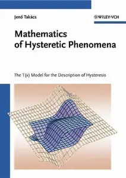

---

**Time:** 21:55:42 (Asia/Tehran)  
**Blog:** AvaxGenius  

**Title:** The History of Mathematics: A Brief Course, Second Edition  

**Details:** English | PDF (True) | 2005 | 612 Pages | ISBN : 0471444596 | 40.8 MB  

**Link:** http://zavat.pw/ebooks/04714544596.html  

---

**Time:** 21:55:42 (Asia/Tehran)  
**Blog:** AvaxGenius  

**Title:** Mathematical Models for Speech Technology  

**Details:** English | PDF (True) | 2005 | 274 Pages | ISBN : 0470844078 | 4.1 MB  

**Link:** http://zavat.pw/ebooks/04750844078.html  

---

**Time:** 21:55:42 (Asia/Tehran)  
**Blog:** AvaxGenius  

**Title:** Mathematical Journeys  

**Details:** English | PDF (True) | 2004 | 198 Pages | ISBN : 0471220663 | 1.8 MB  

**Link:** http://zavat.pw/ebooks/04712205663.html  

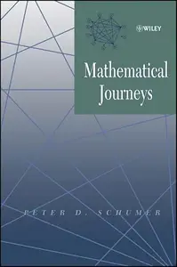

---

**Time:** 21:25:02 (Asia/Tehran)  
**Blog:** AvaxGenius  

**Title:** Engineering and Scientific Computations Using MATLAB®  

**Details:** English | PDF(True) | 2003 | 236 Pages | ISBN : 0471462004 | 45.7 MB  

**Link:** http://zavat.pw/ebooks/04714562004.html  

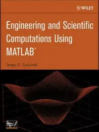

---

**Time:** 21:25:02 (Asia/Tehran)  
**Blog:** AvaxGenius  

**Title:** Digital Signal and Image Processing Using Matlab®: Advances and Applications: The Deterministic Case  

**Details:** English | PDF (True) | 2015 | 267 Pages | ISBN : 1848216416 | 7.8 MB  

**Link:** http://zavat.pw/ebooks/184854216416.html  

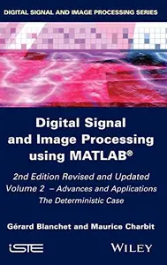

---

**Time:** 21:25:02 (Asia/Tehran)  
**Blog:** AvaxGenius  

**Title:** Digital Signal and Image Processing Using Matlab®: Volume 1 Fundamentals (Repost)  

**Details:** English | PDF | 2014 | 487 Pages | ISBN : 1848216408 | 158.2 MB  

**Link:** http://zavat.pw/ebooks/184825416408.html  

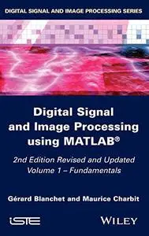

---

**Time:** 20:31:22 (Asia/Tehran)  
**Blog:** hill0  

**Title:** 21st Century Houses: RIBA Award-Winning Homes  

**Details:** English | 2022 | ISBN: 1914124340 | 395 Pages | EPUB (True) | 121 MB  

**Link:** http://zavat.pw/ebooks/1914124340t.html  

---

**Time:** 20:31:22 (Asia/Tehran)  
**Blog:** hill0  

**Title:** The Greatest of Their Time  

**Details:** English | 2022 | ISBN: 1399008862 | 266 Pages | EPUB (True) | 5 MB  

**Link:** http://zavat.pw/ebooks/1399008862.html  

---

**Time:** 20:31:22 (Asia/Tehran)  
**Blog:** hill0  

**Title:** Paras in Action  

**Details:** English | 2022 | ISBN: 1399040170 | 309 Pages | EPUB (True) | 23 MB  

**Link:** http://zavat.pw/ebooks/1399040170.html  

---

**Time:** 20:31:22 (Asia/Tehran)  
**Blog:** hill0  

**Title:** Image Segmentation: Principles, Techniques, and Applications  

**Details:** English | 2023 | ISBN: 111985900X | 310 Pages | EPUB (True) | 30 MB  

**Link:** http://zavat.pw/ebooks/111985900Xt.html  

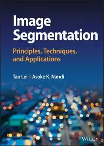

---

**Time:** 19:25:04 (Asia/Tehran)  
**Blog:** hill0  

**Title:** Stamping Through Astronomy (2nd Edition)  

**Details:** English | 2026 | ISBN: 3031983149 | 627 Pages | PDF (True) | 141 MB  

**Link:** http://zavat.pw/ebooks/3031983149.html  

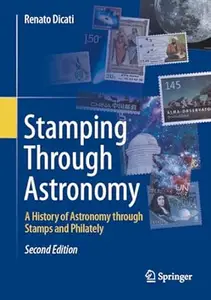

---

**Time:** 19:25:04 (Asia/Tehran)  
**Blog:** hill0  

**Title:** Teaching and Learning Mathematics with Meaning  

**Details:** English | 2026 | ISBN: 3032353513 | 177 Pages | PDF (True) | 2 MB  

**Link:** http://zavat.pw/ebooks/3032353513.html  

---

**Time:** 19:25:04 (Asia/Tehran)  
**Blog:** hill0  

**Title:** Causal Inference with Bayesian Networks  

**Details:** English | 2026 | ISBN: 9781835084984 | 686 Pages | PDF (True) | 39 MB  

**Link:** http://zavat.pw/ebooks/9781835084984T.html  

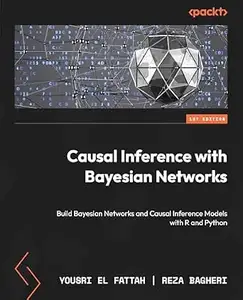

---

**Time:** 19:25:04 (Asia/Tehran)  
**Blog:** hill0  

**Title:** Healing Outcomes  

**Details:** English | 2026 | ISBN: 3032336104 | 154 Pages | PDF EPUB (True) | 4 MB  

**Link:** http://zavat.pw/ebooks/3032336104.html  

---

**Time:** 19:25:04 (Asia/Tehran)  
**Blog:** hill0  

**Title:** Probiotics as Antifungals  

**Details:** English | 2026 | ISBN: 9819200016 | 535 Pages | PDF EPUB (True) | 72 MB  

**Link:** http://zavat.pw/ebooks/9819200016.html  

---

**Time:** 19:25:04 (Asia/Tehran)  
**Blog:** hill0  

**Title:** Stroke Rehabilitation in Low-Resource Settings  

**Details:** English | 2026 | ISBN: 981920402X | 212 Pages | PDF EPUB (True) | 21 MB  

**Link:** http://zavat.pw/ebooks/981920402X.html  

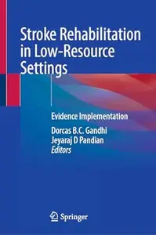

---

**Time:** 19:25:04 (Asia/Tehran)  
**Blog:** hill0  

**Title:** Quality Improvement in Cardiothoracic Surgery  

**Details:** English | 2026 | ISBN: 3032260728 | 324 Pages | PDF EPUB (True) | 13 MB  

**Link:** http://zavat.pw/ebooks/3032260728.html  

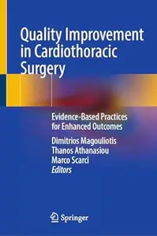

---

**Time:** 19:25:04 (Asia/Tehran)  
**Blog:** hill0  

**Title:** Multiscale Scratch Mechanics of Laminated Shale  

**Details:** English | 2026 | ISBN: 9819570409 | 250 Pages | PDF (True) | 56 MB  

**Link:** http://zavat.pw/ebooks/9819570409.html  

---

**Time:** 19:25:04 (Asia/Tehran)  
**Blog:** hill0  

**Title:** Molecular Biology Methods  

**Details:** English | 2026 | ISBN: 9819226414 | 271 Pages | PDF EPUB (True) | 7 MB  

**Link:** http://zavat.pw/ebooks/9819226414.html  

---

**Time:** 16:03:05 (Asia/Tehran)  
**Blog:** IrGens  

**Title:** Mexico: A History  

**Details:** English | 13 Nov. 2025 | ISBN: 0241386047, 0141990104, 9780241386057 | True EPUB | 752 pages | 54.7 MB  

**Link:** http://zavat.pw/ebooks/0241386047.html  

---

**Time:** 16:03:05 (Asia/Tehran)  
**Blog:** IrGens  

**Title:** Mars in Aries (Penguin Modern Classics)  

**Details:** English | 13 Nov. 2025 | ISBN: 0241674468, 9781802064407 | True EPUB | 208 pages | 1 MB  

**Link:** http://zavat.pw/ebooks/0241674468.html  

---

**Time:** 16:03:05 (Asia/Tehran)  
**Blog:** IrGens  

**Title:** Europe: A New History (UK Edition)  

**Details:** English | 26 Mar. 2026 | ISBN: 0241624509, 180206205X, 9781802062069 | True EPUB | 432 pages | 15.1 MB  

**Link:** http://zavat.pw/ebooks/0241624509.html  

---

**Time:** 16:03:05 (Asia/Tehran)  
**Blog:** IrGens  

**Title:** Along the Borders: In Search of What Divides and Unites Us  

**Details:** English | 30 April 2026 | ISBN: 1529935881, 9781529935899 | True EPUB | 336 pages | 4.9 MB  

**Link:** http://zavat.pw/ebooks/1529935881.html  

---

**Time:** 16:03:05 (Asia/Tehran)  
**Blog:** hill0  

**Title:** Advanced Wearable Sensing in Clinical Practice Towards Healthcare 5.0  

**Details:** English | 2026 | ISBN: 3032199832 | 279 Pages | PDF EPUB (True) | 34 MB  

**Link:** http://zavat.pw/ebooks/3032199832.html  

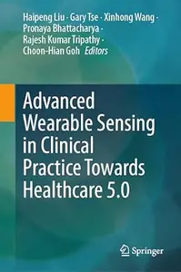

---

**Time:** 16:03:05 (Asia/Tehran)  
**Blog:** hill0  

**Title:** Sustainability Through Multidisciplinary Innovation  

**Details:** English | 2026 | ISBN: 3032254701 | 163 Pages | PDF EPUB (True) | 42 MB  

**Link:** http://zavat.pw/ebooks/3032254701.html  

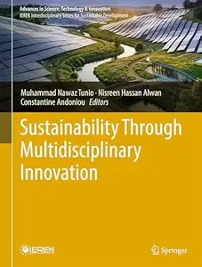

---

**Time:** 16:03:05 (Asia/Tehran)  
**Blog:** hill0  

**Title:** Influences of Cultural Heritage on Innovative Fashion Designs and Sustainable Industries  

**Details:** English | 2026 | ISBN: 3032074274 | 345 Pages | PDF EPUB (True) | 120 MB  

**Link:** http://zavat.pw/ebooks/3032074274.html  

---

**Time:** 16:03:05 (Asia/Tehran)  
**Blog:** hill0  

**Title:** Phytochemicals in Urological Cancers  

**Details:** English | 2026 | ISBN: 9819211573 | 262 Pages | PDF EPUB (True) | 19 MB  

**Link:** http://zavat.pw/ebooks/9819211573.html  

---

**Time:** 16:03:05 (Asia/Tehran)  
**Blog:** hill0  

**Title:** Artificial Intelligence Powered Ethical Systems, Generative Intelligence, and Societal Futures  

**Details:** English | 2026 | ISBN: 3032247837 | 392 Pages | PDF EPUB (True) | 71 MB  

**Link:** http://zavat.pw/ebooks/3032247837.html  

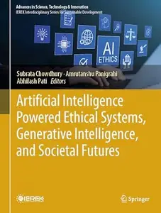

---

**Time:** 16:03:05 (Asia/Tehran)  
**Blog:** hill0  

**Title:** Dermatopathology (3rd Edition)  

**Details:** English | 2026 | ISBN: 3031989716 | 325 Pages | PDF (True) | 119 MB  

**Link:** http://zavat.pw/ebooks/3031989716.html  

---

**Time:** 16:03:05 (Asia/Tehran)  
**Blog:** hill0  

**Title:** Ureteroscopy (2nd Edition)  

**Details:** English | 2026 | ISBN: 3032316375 | 354 Pages | PDF EPUB (True) | 52 MB  

**Link:** http://zavat.pw/ebooks/3032316375.html  

---

**Time:** 16:03:05 (Asia/Tehran)  
**Blog:** hill0  

**Title:** Artificial Intelligence Applications for Human Well-being and a Sustainable Future  

**Details:** English | 2026 | ISBN: 3032143721 | 204 Pages | PDF EPUB (True) | 62 MB  

**Link:** http://zavat.pw/ebooks/3032143721.html  

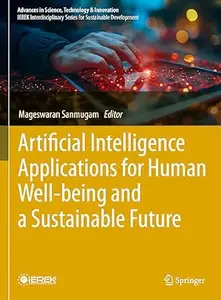

---

**Time:** 16:03:05 (Asia/Tehran)  
**Blog:** hill0  

**Title:** War in Space (2nd Edition)  

**Details:** English | 2026 | ISBN: 3032219590 | 271 Pages | PDF EPUB (True) | 69 MB  

**Link:** http://zavat.pw/ebooks/3032219590.html  

---

**Time:** 16:03:05 (Asia/Tehran)  
**Blog:** hill0  

**Title:** Handbook Railway Infrastructure  

**Details:** English | 2026 | ISBN: 3662732238 | 1155 Pages | PDF (True) | 141 MB  

**Link:** http://zavat.pw/ebooks/3662732238.html  

---

**Time:** 16:03:05 (Asia/Tehran)  
**Blog:** hill0  

**Title:** Earth Geosciences, Geophysics and Geotechnical Engineering  

**Details:** English | 2026 | ISBN: 303226037X | 173 Pages | PDF EPUB (True) | 74 MB  

**Link:** http://zavat.pw/ebooks/303226037X.html  

---

**Time:** 16:03:05 (Asia/Tehran)  
**Blog:** hill0  

**Title:** Diagnosis and Management of Myasthenia Gravis  

**Details:** English | 2026 | ISBN: 3032288762 | 244 Pages | PDF EPUB (True) | 19 MB  

**Link:** http://zavat.pw/ebooks/3032288762.html  

---

**Time:** 16:03:05 (Asia/Tehran)  
**Blog:** hill0  

**Title:** Next-Generation In Vitro Strategies in Woody Plant Cloning  

**Details:** English | 2026 | ISBN: 3032280702 | 529 Pages | PDF EPUB (True) | 38 MB  

**Link:** http://zavat.pw/ebooks/3032280702.html  

---

**Time:** 16:03:05 (Asia/Tehran)  
**Blog:** hill0  

**Title:** Evidence-based Practice of Pediatric Diseases  

**Details:** English | 2026 | ISBN: 3032263948 | 379 Pages | PDF EPUB (True) | 3 MB  

**Link:** http://zavat.pw/ebooks/3032263948.html  

---

**Time:** 16:03:05 (Asia/Tehran)  
**Blog:** hill0  

**Title:** An Introduction to Programming Languages (2nd Edition)  

**Details:** English | 2026 | ISBN: 3032268044 | 467 Pages | PDF EPUB (True) | 132 MB  

**Link:** http://zavat.pw/ebooks/3032268044.html  

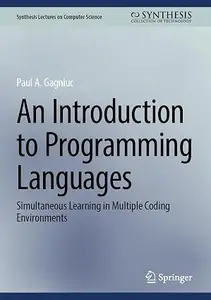

---

**Time:** 15:00:21 (Asia/Tehran)  
**Blog:** IrGens  

**Title:** Jean Gabin: The Actor Who Was France  

**Details:** English | January 24, 2023 | ISBN: 0813196329, 0813198755, 9780813196336 | True EPUB | 328 pages | 11.2 MB  

**Link:** http://zavat.pw/ebooks/0813196329.html  

---

**Time:** 15:00:21 (Asia/Tehran)  
**Blog:** IrGens  

**Title:** Ivan the Terrible (BFI Film Classics)  

**Details:** English | March 29, 2001 | ISBN: 085170834X, 9781838716462 | True EPUB | 96 pages | 7.3 MB  

**Link:** http://zavat.pw/ebooks/085170834X-epub.html  

---

**Time:** 15:00:21 (Asia/Tehran)  
**Blog:** hill0  

**Title:** Python Essentials  

**Details:** English | 2026 | ISBN: 3032192951 | 355 Pages | PDF EPUB (True) | 29 MB  

**Link:** http://zavat.pw/ebooks/3032192951.html  

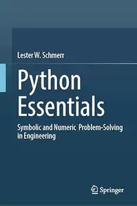

---

**Time:** 15:00:21 (Asia/Tehran)  
**Blog:** hill0  

**Title:** Transformative Technologies for Future-Ready and Sustainable Civil Infrastructure  

**Details:** English | 2026 | ISBN: 3032224292 | 380 Pages | PDF EPUB (True) | 68 MB  

**Link:** http://zavat.pw/ebooks/3032224292.html  

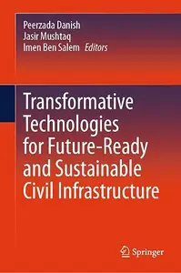

---

**Time:** 15:00:21 (Asia/Tehran)  
**Blog:** hill0  

**Title:** Counter Disinformation System Development in Ukraine  

**Details:** English | 2026 | ISBN: 3032247306 | 191 Pages | PDF EPUB (True) | 2 MB  

**Link:** http://zavat.pw/ebooks/3032247306.html  

---

**Time:** 15:00:21 (Asia/Tehran)  
**Blog:** hill0  

**Title:** Culture Evolving  

**Details:** English | 2026 | ISBN: 3032161231 | 502 Pages | PDF EPUB (True) | 38 MB  

**Link:** http://zavat.pw/ebooks/3032161231.html  

---

**Time:** 15:00:21 (Asia/Tehran)  
**Blog:** hill0  

**Title:** International Conference on Intelligent Systems and Computational Strategies in Engineering and Technology  

**Details:** English | 2026 | ISBN: 3032188334 | 446 Pages | PDF (True) | 23 MB  

**Link:** http://zavat.pw/ebooks/3032188334.html  

---

**Time:** 15:00:21 (Asia/Tehran)  
**Blog:** hill0  

**Title:** Advancements in the Science and Technology of Conjugated Polymers  

**Details:** English | 2022 | ISBN: 1685078044 | 260 Pages | PDF | 19 MB  

**Link:** http://zavat.pw/ebooks/1685078044.html  

---

**Time:** 15:00:21 (Asia/Tehran)  
**Blog:** hill0  

**Title:** Introduction to Glass Science and Technology (3rd Edition)  

**Details:** English | 2021 | ISBN: 1839161418 | 267 Pages | EPUB (True) | 3 MB  

**Link:** http://zavat.pw/ebooks/1839161418.html  

---

**Time:** 15:00:21 (Asia/Tehran)  
**Blog:** crazy-slim  

**Title:** Barron's - August 10, 2026  

**Details:** English | 52 pages | True PDF | 7.3 MB  

**Link:** http://zavat.pw/magazines/BarronsAugust102026-93854.html  

---

**Time:** 15:00:21 (Asia/Tehran)  
**Blog:** crazy-slim  

**Title:** Virginia Gazette - 8 August 2026  

**Details:** English | 22 pages | True PDF | 30.2 MB  

**Link:** http://zavat.pw/newspapers/VirginiaGazette8August2026-70361.html  

---

**Time:** 15:00:21 (Asia/Tehran)  
**Blog:** crazy-slim  

**Title:** The Philadelphia Inquirer - August 8, 2026  

**Details:** English | 24 pages | True PDF | 32.8 MB  

**Link:** http://zavat.pw/newspapers/ThePhiladelphiaInquirerAugust82026-12201.html  

---

**Time:** 15:00:21 (Asia/Tehran)  
**Blog:** crazy-slim  

**Title:** The Baltimore Sun - 8 August 2026  

**Details:** English | 28 pages | True PDF | 28.1 MB  

**Link:** http://zavat.pw/newspapers/TheBaltimoreSun8August2026-65516.html  

---

**Time:** 15:00:21 (Asia/Tehran)  
**Blog:** crazy-slim  

**Title:** The Dallas Morning News - August 8, 2026  

**Details:** English | 30 pages | True PDF | 16.2 MB  

**Link:** http://zavat.pw/newspapers/TheDallasMorningNewsAugust82026-63930.html  

---

**Time:** 15:00:21 (Asia/Tehran)  
**Blog:** crazy-slim  

**Title:** USA Today - August 8, 2026  

**Details:** English | 12 pages | True PDF | 3.9 MB  

**Link:** http://zavat.pw/newspapers/USATodayAugust82026-15554.html  

---

**Time:** 15:00:21 (Asia/Tehran)  
**Blog:** crazy-slim  

**Title:** The Baltimore Sun Carroll County Times - 8 August 2026  

**Details:** English | 24 pages | True PDF | 22.4 MB  

**Link:** http://zavat.pw/newspapers/TheBaltimoreSunCarrollCountyTimes8August2026-75237.html  

---

**Time:** 15:00:21 (Asia/Tehran)  
**Blog:** crazy-slim  

**Title:** The Morning Call Morning Edition - 8 August 2026  

**Details:** English | 24 pages | True PDF | 15.4 MB  

**Link:** http://zavat.pw/newspapers/TheMorningCallMorningEdition8August2026-81922.html  

---

**Time:** 15:00:21 (Asia/Tehran)  
**Blog:** crazy-slim  

**Title:** Los Angeles Times - 8 August 2026  

**Details:** English | 76 pages | True PDF | 53.8 MB  

**Link:** http://zavat.pw/newspapers/LosAngelesTimes8August2026-01653.html  

---

**Time:** 15:00:21 (Asia/Tehran)  
**Blog:** crazy-slim  

**Title:** The Boston Globe - 8 August 2026  

**Details:** English | 32 pages | True PDF | 6.7 MB  

**Link:** http://zavat.pw/newspapers/TheBostonGlobe8August2026-50128.html  

---

**Time:** 15:00:21 (Asia/Tehran)  
**Blog:** crazy-slim  

**Title:** Sun Sentinel - 8 August 2026  

**Details:** English | 28 pages | True PDF | 21.7 MB  

**Link:** http://zavat.pw/newspapers/SunSentinel8August2026-13002.html  

---

**Time:** 15:00:21 (Asia/Tehran)  
**Blog:** crazy-slim  

**Title:** Orlando Sentinel - 8 August 2026  

**Details:** English | 37 pages | True PDF | 26.1 MB  

**Link:** http://zavat.pw/newspapers/OrlandoSentinel8August2026-57878.html  

---

**Time:** 15:00:21 (Asia/Tehran)  
**Blog:** crazy-slim  

**Title:** Sun Journal - 8 August 2026  

**Details:** English | 12 pages | True PDF | 15.5 MB  

**Link:** http://zavat.pw/newspapers/SunJournal8August2026-98689.html  

---

**Time:** 15:00:21 (Asia/Tehran)  
**Blog:** crazy-slim  

**Title:** Newsday - 8 August 2026  

**Details:** English | 48 pages | True PDF | 21.4 MB  

**Link:** http://zavat.pw/newspapers/Newsday8August2026-64068.html  

---

**Time:** 15:00:21 (Asia/Tehran)  
**Blog:** crazy-slim  

**Title:** Post-Tribune - 8 August 2026  

**Details:** English | 18 pages | True PDF | 11.3 MB  

**Link:** http://zavat.pw/newspapers/PostTribune8August2026-33751.html  

---

**Time:** 13:00:04 (Asia/Tehran)  
**Blog:** hill0  

**Title:** The Silk Industry in Early Modern Piedmont  

**Details:** English | 2026 | ISBN: 3032153522 | 313 Pages | PDF EPUB (True) | 28 MB  

**Link:** http://zavat.pw/ebooks/3032153522.html  

---

**Time:** 13:00:04 (Asia/Tehran)  
**Blog:** hill0  

**Title:** Transforming Molecular Biology with Emerging Technologies  

**Details:** English | 2026 | ISBN: 1071653199 | 395 Pages | PDF (True) | 40 MB  

**Link:** http://zavat.pw/ebooks/1071653199.html  

---

**Time:** 13:00:04 (Asia/Tehran)  
**Blog:** hill0  

**Title:** Mastering Autodesk Inventor 2012 and Autodesk Inventor LT 2012  

**Details:** English | 2011 | ISBN: 1118016823 | 1256 Pages | EPUB (True) | 40 MB  

**Link:** http://zavat.pw/ebooks/1118016823e.html  

---

**Time:** 13:00:04 (Asia/Tehran)  
**Blog:** hill0  

**Title:** Topology in Optics (2nd Edition): Tying light in knots  

**Details:** English | 2021 | ISBN: 075033469X | 174 Pages | EPUB (True) | 11 MB  

**Link:** http://zavat.pw/ebooks/075033469Xe.html  

---

**Time:** 13:00:04 (Asia/Tehran)  
**Blog:** hill0  

**Title:** Signal Processing with Python: A practical approach  

**Details:** English | 2024 | ISBN: 0750359277 | 320 Pages | EPUB (True) | 17 MB  

**Link:** http://zavat.pw/ebooks/0750359277E.html  

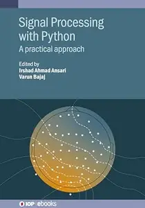

---

**Time:** 13:00:04 (Asia/Tehran)  
**Blog:** crazy-slim  

**Title:** The Washington Post - August 8, 2026  

**Details:** English | 36 pages | True PDF | 17.7 MB  

**Link:** http://zavat.pw/newspapers/TheWashingtonPostAugust82026-93865.html  

---

**Time:** 13:00:04 (Asia/Tehran)  
**Blog:** crazy-slim  

**Title:** D la Repubblica - 8 Agosto 2026  

**Details:** Italiano | 100 pages | True PDF | 17.2 MB  

**Link:** http://zavat.pw/magazines/DlaRepubblica8Agosto2026-49550.html  

---

**Time:** 13:00:04 (Asia/Tehran)  
**Blog:** crazy-slim  

**Title:** Love TV - 8 August 2026  

**Details:** English | 64 pages | True PDF | 11.8 MB  

**Link:** http://zavat.pw/magazines/LoveTV8August2026-67024.html  

---

**Time:** 13:00:04 (Asia/Tehran)  
**Blog:** crazy-slim  

**Title:** SportWeek - 8 Agosto 2026  

**Details:** Italiano | 84 pages | True PDF | 15.4 MB  

**Link:** http://zavat.pw/magazines/SportWeek8Agosto2026-64258.html  

---

**Time:** 13:00:04 (Asia/Tehran)  
**Blog:** crazy-slim  

**Title:** Io Donna del Corriere della Sera - 8 Agosto 2026  

**Details:** Italiano | 92 pages | True PDF | 15.1 MB  

**Link:** http://zavat.pw/magazines/IoDonnadelCorrieredellaSera8Agosto2026-85122.html  

---

**Time:** 11:12:21 (Asia/Tehran)  
**Blog:** hill0  

**Title:** Globalized State-led Development  

**Details:** English | 2026 | ISBN: 1009875221 | 315 Pages | PDF | 2 MB  

**Link:** http://zavat.pw/ebooks/1009875221.html  

---

**Time:** 11:12:21 (Asia/Tehran)  
**Blog:** hill0  

**Title:** Le Temps - 8 Août 2026  

**Details:** Français | 34 pages | True PDF | 16 MB  

**Link:** http://zavat.pw/newspapers/le-temps-20260808.html  

---

**Time:** 11:12:21 (Asia/Tehran)  
**Blog:** hill0  

**Title:** Frankfurter Allgemeine Sonntags Zeitung - 9 August 2026  

**Details:** Deutsch | 60 pages | True PDF | 17 MB  

**Link:** http://zavat.pw/newspapers/FAZSON-09-08-26.html  

---

**Time:** 11:12:21 (Asia/Tehran)  
**Blog:** crazy-slim  

**Title:** Deutsche Welle English Edition - 8 August 2026  

**Details:** English | 107 pages | PDF | 276.3 MB  

**Link:** http://zavat.pw/newspapers/DeutscheWelleEnglishEdition8August2026-97622.html  

---

**Time:** 11:12:21 (Asia/Tehran)  
**Blog:** crazy-slim  

**Title:** Deutsche Welle Edición en español - 8 Agosto 2026  

**Details:** Español | 70 pages | PDF | 175.9 MB  

**Link:** http://zavat.pw/newspapers/DeutscheWelleEdici%C3%B3nenespa%C3%B1ol8Agosto2026-34572.html  

---

**Time:** 11:12:21 (Asia/Tehran)  
**Blog:** crazy-slim  

**Title:** California Post - August 8, 2026  

**Details:** English | 48 pages | PDF | 85.3 MB  

**Link:** http://zavat.pw/newspapers/CaliforniaPostAugust82026-26462.html  

---

**Time:** 11:12:21 (Asia/Tehran)  
**Blog:** crazy-slim  

**Title:** Deutsche Welle Édition française - 8 Août 2026  

**Details:** Français | 32 pages | PDF | 79.4 MB  

**Link:** http://zavat.pw/newspapers/DeutscheWelle%C3%89ditionfran%C3%A7aise8Ao%C3%BBt2026-23215.html  

---

**Time:** 11:12:21 (Asia/Tehran)  
**Blog:** crazy-slim  

**Title:** The Wall Street Journal - August 8, 2026  

**Details:** English | 50 pages | True PDF | 19.9 MB  

**Link:** http://zavat.pw/newspapers/TheWallStreetJournalAugust82026-06127.html  

---

**Time:** 11:12:21 (Asia/Tehran)  
**Blog:** crazy-slim  

**Title:** Aftonbladet - 8 Augusti 2026  

**Details:** Svenska | 72 pages | PDF | 66.7 MB  

**Link:** http://zavat.pw/newspapers/Aftonbladet8Augusti2026-02284.html  

---

**Time:** 11:12:21 (Asia/Tehran)  
**Blog:** crazy-slim  

**Title:** El Día - 8 Agosto 2026  

**Details:** Español | 56 pages | PDF | 105.8 MB  

**Link:** http://zavat.pw/newspapers/ElD%C3%ADa8Agosto2026-23020.html  

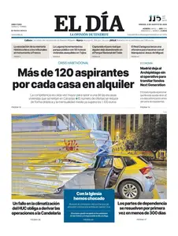

---

**Time:** 11:12:21 (Asia/Tehran)  
**Blog:** crazy-slim  

**Title:** Sport España - 8 Agosto 2026  

**Details:** Español | 32 pages | PDF | 56.9 MB  

**Link:** http://zavat.pw/newspapers/SportEspa%C3%B1a8Agosto2026-49164.html  

---

**Time:** 11:12:21 (Asia/Tehran)  
**Blog:** crazy-slim  

**Title:** Sportbladet - 8 Augusti 2026  

**Details:** Svenska | 18 pages | PDF | 21.9 MB  

**Link:** http://zavat.pw/newspapers/Sportbladet8Augusti2026-19486.html  

---

**Time:** 11:12:21 (Asia/Tehran)  
**Blog:** crazy-slim  

**Title:** El Periódico Castellano - 8 Agosto 2026  

**Details:** Español | 40 pages | PDF | 73.8 MB  

**Link:** http://zavat.pw/newspapers/ElPeri%C3%B3dicoCastellano8Agosto2026-62080.html  

---

**Time:** 11:12:21 (Asia/Tehran)  
**Blog:** crazy-slim  

**Title:** Cinco Días - 8 Agosto 2026  

**Details:** Español | 32 pages | PDF | 59.0 MB  

**Link:** http://zavat.pw/newspapers/CincoD%C3%ADas8Agosto2026-86670.html  

---

**Time:** 11:12:21 (Asia/Tehran)  
**Blog:** crazy-slim  

**Title:** Mundo Deportivo - 8 Agosto 2026  

**Details:** Español | 32 pages | PDF | 63.9 MB  

**Link:** http://zavat.pw/newspapers/MundoDeportivo8Agosto2026-74168.html  

---

**Time:** 11:12:21 (Asia/Tehran)  
**Blog:** crazy-slim  

**Title:** AS - 8 Agosto 2026  

**Details:** Español | 32 pages | PDF | 57.9 MB  

**Link:** http://zavat.pw/newspapers/AS8Agosto2026-90483.html  

---

**Time:** 11:12:21 (Asia/Tehran)  
**Blog:** crazy-slim  

**Title:** Western Morning News - 8 August 2026  

**Details:** English | 112 pages | PDF | 131.0 MB  

**Link:** http://zavat.pw/newspapers/WesternMorningNews8August2026-70407.html  

---

**Time:** 11:12:21 (Asia/Tehran)  
**Blog:** crazy-slim  

**Title:** Western Mail - 8 August 2026  

**Details:** English | 112 pages | PDF | 124.7 MB  

**Link:** http://zavat.pw/newspapers/WesternMail8August2026-06682.html  

---

**Time:** 10:08:54 (Asia/Tehran)  
**Blog:** AvaxGenius  

**Title:** Practical Finite Element Modeling in Earth Science Using Matlab  

**Details:** English | PDF (True) | 2017 | 249 Pages | ISBN : 1119248620 | 7 MB  

**Link:** http://zavat.pw/ebooks/11192428620.html  

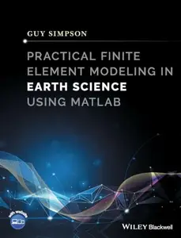

---

**Time:** 10:08:54 (Asia/Tehran)  
**Blog:** hill0  

**Title:** Green Analytical Chemistry in India  

**Details:** English | 2026 | ISBN: 303224563X | 323 Pages | PDF EPUB (True) | 24 MB  

**Link:** http://zavat.pw/ebooks/303224563X.html  

---

**Time:** 10:08:54 (Asia/Tehran)  
**Blog:** hill0  

**Title:** Quantum Dots: Applications in Biology (4th Edition)  

**Details:** English | 2026 | ISBN: 1071652095 | 233 Pages | PDF EPUB (True) | 52 MB  

**Link:** http://zavat.pw/ebooks/1071652095.html  

---

**Time:** 10:08:54 (Asia/Tehran)  
**Blog:** hill0  

**Title:** Frankfurter Allgemeine Zeitung - 8 August 2026  

**Details:** Deutsch | 64 pages | True PDF | 19 MB  

**Link:** http://zavat.pw/newspapers/FAZ-08-08-26.html  

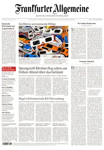

---

**Time:** 10:08:54 (Asia/Tehran)  
**Blog:** hill0  

**Title:** Süddeutsche Zeitung - 8 August 2026  

**Details:** Deutsch | 56 pages | True PDF | 15 MB  

**Link:** http://zavat.pw/newspapers/SZ-80826.html  

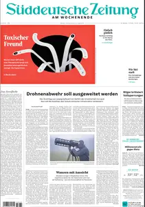

---

**Time:** 10:08:54 (Asia/Tehran)  
**Blog:** crazy-slim  

**Title:** Financial Times USA - 8 August 2026  

**Details:** English | 46 pages | PDF | 59.4 MB  

**Link:** http://zavat.pw/newspapers/FinancialTimesUSA8August2026-87295.html  

---

**Time:** 10:08:54 (Asia/Tehran)  
**Blog:** crazy-slim  

**Title:** Financial Times Europe - 8 August 2026  

**Details:** English | 48 pages | PDF | 61.0 MB  

**Link:** http://zavat.pw/newspapers/FinancialTimesEurope8August2026-35988.html  

---

**Time:** 10:08:54 (Asia/Tehran)  
**Blog:** crazy-slim  

**Title:** Il Resto del Carlino Ferrara Rovigo - 8 Agosto 2026  

**Details:** Italiano | 96 pages | True PDF | 33.3 MB  

**Link:** http://zavat.pw/newspapers/IlRestodelCarlinoFerraraRovigo8Agosto2026-25958.html  

---

**Time:** 10:08:54 (Asia/Tehran)  
**Blog:** crazy-slim  

**Title:** Il Resto del Carlino Forlì - 8 Agosto 2026  

**Details:** Italiano | 96 pages | True PDF | 33.1 MB  

**Link:** http://zavat.pw/newspapers/IlRestodelCarlinoForl%C3%AC8Agosto2026-23984.html  

---

**Time:** 09:07:32 (Asia/Tehran)  
**Blog:** AvaxGenius  

**Title:** Polymers for Advanced Technology  

**Details:** English | EPUB (True) | 2024 | 175 Pages | ISBN : 9819772087 | 48.2 MB  

**Link:** http://zavat.pw/ebooks/9819772087E.html  

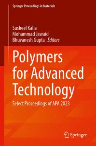

---

**Time:** 09:07:32 (Asia/Tehran)  
**Blog:** AvaxGenius  

**Title:** Topological Degree Approach to Bifurcation Problems (Repost)  

**Details:** English | PDF | 2008 | 265 Pages | ISBN : 1402087233 | 2 MB  

**Link:** http://zavat.pw/ebooks/140442087233R.html  

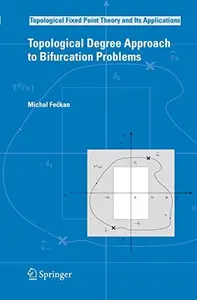

---

**Time:** 09:07:32 (Asia/Tehran)  
**Blog:** AvaxGenius  

**Title:** Differential Equations, Chaos and Variational Problems (Repost)  

**Details:** English | PDF | 2008 | 436 Pages | ISBN : 3764384816 | 5.9 MB  

**Link:** http://zavat.pw/ebooks/37643584816R.html  

---

**Time:** 09:07:32 (Asia/Tehran)  
**Blog:** AvaxGenius  

**Title:** Numerical Weather Prediction: East Asian Perspectives (Repost)  

**Details:** English | PDF EPUB (True) | 2023 | 590 Pages | ISBN : 3031405668 | 335.6 MB  

**Link:** http://zavat.pw/ebooks/303145056568.html  

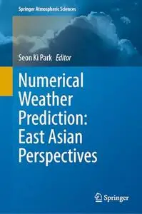

---

**Time:** 09:07:32 (Asia/Tehran)  
**Blog:** AvaxGenius  

**Title:** Impact: Design With All Senses: Proceedings of the Design Modelling Symposium, Berlin 2019 (Repost)  

**Details:** English | PDF | 2020 | 802 Pages | ISBN : 3030298280 | 235.6 MB  

**Link:** http://zavat.pw/ebooks/303025498280.html  

---

**Time:** 09:07:32 (Asia/Tehran)  
**Blog:** AvaxGenius  

**Title:** Biomarkers in Carcinoma of Unknown Primary (Repost)  

**Details:** English | EPUB | 2022 | 468 Pages | ISBN : 3030844315 | 104.9 MB  

**Link:** http://zavat.pw/ebooks/303084454315.html  

---

**Time:** 09:07:32 (Asia/Tehran)  
**Blog:** AvaxGenius  

**Title:** The Art of Skin Graft: Advanced Graft Technique (Repost)  

**Details:** English | PDF (True) | 2024 | 299 Pages | ISBN : 9819700167 | 119.2 MB  

**Link:** http://zavat.pw/ebooks/981943700167.html  

---

**Time:** 09:07:32 (Asia/Tehran)  
**Blog:** AvaxGenius  

**Title:** Nanostructured Materials for Supercapacitors (Repost)  

**Details:** English | EPUB | 2022 | 642 Pages | ISBN : 3030993019 | 185.5 MB  

**Link:** http://zavat.pw/ebooks/303099343019.html  

---

**Time:** 09:07:32 (Asia/Tehran)  
**Blog:** crazy-slim  

**Title:** Rente & Co - 8 August 2026  

**Details:** Deutsch | 68 pages | True PDF | 10.5 MB  

**Link:** http://zavat.pw/magazines/RenteCo8August2026-74252.html  

---

**Time:** 09:07:32 (Asia/Tehran)  
**Blog:** crazy-slim  

**Title:** Frau mit Herz - 8 August 2026  

**Details:** Deutsch | 72 pages | PDF | 79.3 MB  

**Link:** http://zavat.pw/magazines/FraumitHerz8August2026-70072.html  

---

**Time:** 09:07:32 (Asia/Tehran)  
**Blog:** crazy-slim  

**Title:** Gong Ratefuchs - 8 August 2026  

**Details:** Deutsch | 60 pages | PDF | 42.8 MB  

**Link:** http://zavat.pw/magazines/GongRatefuchs8August2026-34589.html  

---

**Time:** 09:07:32 (Asia/Tehran)  
**Blog:** crazy-slim  

**Title:** Madonna - 8 August 2026  

**Details:** Deutsch | 44 pages | True PDF | 30.6 MB  

**Link:** http://zavat.pw/magazines/Madonna8August2026-60212.html  

---

**Time:** 09:07:32 (Asia/Tehran)  
**Blog:** crazy-slim  

**Title:** Daily Mail - 8 August 2026  

**Details:** English | 108 pages | True PDF | 216.8 MB  

**Link:** http://zavat.pw/newspapers/DailyMail8August2026-04364.html  

---

**Time:** 09:07:32 (Asia/Tehran)  
**Blog:** crazy-slim  

**Title:** Die 2 - 8 August 2026  

**Details:** Deutsch | 88 pages | PDF | 124.6 MB  

**Link:** http://zavat.pw/magazines/Die28August2026-24303.html  

---

**Time:** 09:07:32 (Asia/Tehran)  
**Blog:** crazy-slim  

**Title:** Belfast Telegraph - 8 August 2026  

**Details:** English | 112 pages | PDF | 243.4 MB  

**Link:** http://zavat.pw/newspapers/BelfastTelegraph8August2026-54956.html  

---

**Time:** 09:07:32 (Asia/Tehran)  
**Blog:** crazy-slim  

**Title:** Euronews English Edition - 8 August 2026  

**Details:** English | 68 pages | PDF | 178.5 MB  

**Link:** http://zavat.pw/newspapers/EuronewsEnglishEdition8August2026-38649.html  

---

**Time:** 09:07:32 (Asia/Tehran)  
**Blog:** crazy-slim  

**Title:** Frau Aktuell - 8 August 2026  

**Details:** Deutsch | 72 pages | True PDF | 62.3 MB  

**Link:** http://zavat.pw/magazines/FrauAktuell8August2026-57853.html  

---

**Time:** 09:07:32 (Asia/Tehran)  
**Blog:** crazy-slim  

**Title:** Daheim - September-Oktober 2026  

**Details:** Deutsch | 124 pages | PDF | 124.3 MB  

**Link:** http://zavat.pw/magazines/DaheimSeptemberOktober2026-02699.html  

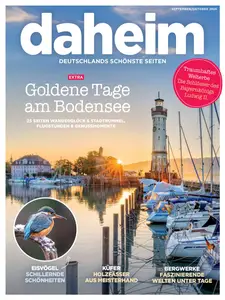

---

**Time:** 09:07:32 (Asia/Tehran)  
**Blog:** crazy-slim  

**Title:** Die Aktuelle - 8 August 2026  

**Details:** Deutsch | 80 pages | True PDF | 77.8 MB  

**Link:** http://zavat.pw/magazines/DieAktuelle8August2026-12533.html  

---

**Time:** 09:07:32 (Asia/Tehran)  
**Blog:** crazy-slim  

**Title:** Fernsehwoche - 7 August 2026  

**Details:** Deutsch | 96 pages | True PDF | 26.5 MB  

**Link:** http://zavat.pw/magazines/Fernsehwoche7August2026-69049.html  

---

**Time:** 09:07:32 (Asia/Tehran)  
**Blog:** crazy-slim  

**Title:** Burda Style - September 2026  

**Details:** Deutsch | 80 pages | PDF | 61.8 MB  

**Link:** http://zavat.pw/magazines/BurdaStyleSeptember2026-88419.html  

---

**Time:** 09:07:32 (Asia/Tehran)  
**Blog:** crazy-slim  

**Title:** South China Morning Post - 8 August 2026  

**Details:** English | 26 pages | PDF | 64.0 MB  

**Link:** http://zavat.pw/newspapers/SouthChinaMorningPost8August2026-73800.html  

---

**Time:** 09:07:32 (Asia/Tehran)  
**Blog:** crazy-slim  

**Title:** Das Goldene Blatt - 8 August 2026  

**Details:** Deutsch | 72 pages | True PDF | 47.8 MB  

**Link:** http://zavat.pw/magazines/DasGoldeneBlatt8August2026-13966.html  

---

**Time:** 08:03:59 (Asia/Tehran)  
**Blog:** IrGens  

**Title:** AI Software Development with opencode  

**Details:** .MP4, AVC, 1920x1080, 30 fps | English, AAC, 2 Ch | 8h 17m | 1.3 GB  

**Link:** http://zavat.pw/ebooks/ai-software-development-with-opencode.html  

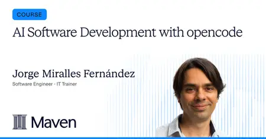

---

**Time:** 08:03:59 (Asia/Tehran)  
**Blog:** IrGens  

**Title:** AI in the Flow of Data Science: 10 Days to Smarter Data Analysis  

**Details:** .MP4, AVC, 1280x720, 30 fps | English, AAC, 2 Ch | 38m | 169 MB  

**Link:** http://zavat.pw/ebooks/ai-in-the-flow-of-data-science-10-days-to-smarter-data-analysis.html  

---

**Time:** 08:03:59 (Asia/Tehran)  
**Blog:** IrGens  

**Title:** Copilot Cowork 7-Day Challenge: Your Workday Streamlined with AI  

**Details:** .MP4, AVC, 1280x720, 30 fps | English, AAC, 2 Ch | 27m | 128 MB  

**Link:** http://zavat.pw/ebooks/copilot-cowork-7-day-challenge-your-workday-streamlined-with-ai.html  

---

**Time:** 08:03:59 (Asia/Tehran)  
**Blog:** AvaxGenius  

**Title:** Ultrasound Mid-Air Haptics for Touchless Interfaces (Repost)  

**Details:** English | EPUB(True) | 2022 | 411 Pages | ISBN : 3031040422 | 100.8 MB  

**Link:** http://zavat.pw/ebooks/303104340422.html  

---

**Time:** 08:03:59 (Asia/Tehran)  
**Blog:** AvaxGenius  

**Title:** Toxicology at Environmentally Relevant Concentrations in Caenorhabditis elegans (Repost)  

**Details:** English | EPUB | 2022 | 371 Pages | ISBN : 9811667454 | 101.9 MB  

**Link:** http://zavat.pw/ebooks/981166754454.html  

---

**Time:** 08:03:59 (Asia/Tehran)  
**Blog:** AvaxGenius  

**Title:** Essays on Astronomical History and Heritage: A Tribute to Wayne Orchiston on his 80th Birthday (Repost)  

**Details:** English | EPUB (True) | 2023 | 719 Pages | ISBN : 3031294920 | 159.4 MB  

**Link:** http://zavat.pw/ebooks/303129434920.html  

---

**Time:** 08:03:59 (Asia/Tehran)  
**Blog:** AvaxGenius  

**Title:** Digital Signal and Image Processing using MATLAB®  

**Details:** English | PDF (True) | 2006 | 752 Pages | ISBN : 1905209134 | 30.2 MB  

**Link:** http://zavat.pw/ebooks/19054209134.html  

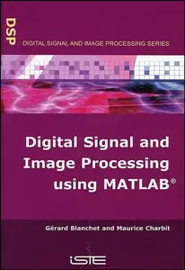

---

**Time:** 08:03:59 (Asia/Tehran)  
**Blog:** AvaxGenius  

**Title:** Nuclear Principles in Engineering, Third Edition (Repost)  

**Details:** English | PDF EPUB (True) | 2024 | 565 Pages | ISBN : 3031719417 | 106.7 MB  

**Link:** http://zavat.pw/ebooks/3031719417R.html  

---

**Time:** 08:03:59 (Asia/Tehran)  
**Blog:** AvaxGenius  

**Title:** Finite-Dimensional Variational Inequalities and Complementarity Problems  

**Details:** English | PDF (True) | 2003 | 724 Pages | ISBN : 0387955801 | 4.5 MB  

**Link:** http://zavat.pw/ebooks/03872955801.html  

---

**Time:** 08:03:59 (Asia/Tehran)  
**Blog:** AvaxGenius  

**Title:** Categories for Software Engineering  

**Details:** English | PDF | 2005 | 254 Pages | ISBN : 3540209093 | 12.4 MB  

**Link:** http://zavat.pw/ebooks/35402509093.html  

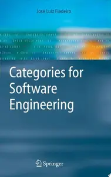

---

**Time:** 08:03:59 (Asia/Tehran)  
**Blog:** AvaxGenius  

**Title:** An Introduction to Difference Equations  

**Details:** English | PDF | 398 Pages | ISBN : 1475791682 | 20 MB  

**Link:** http://zavat.pw/ebooks/14755791682.html  

---

**Time:** 08:03:59 (Asia/Tehran)  
**Blog:** AvaxGenius  

**Title:** Discrete Stochastic Processes  

**Details:** English | PDF | 1996 | 280 Pages | ISBN : 0792395832 | 23.1 MB  

**Link:** http://zavat.pw/ebooks/07923595832.html  

---

**Time:** 08:03:59 (Asia/Tehran)  
**Blog:** AvaxGenius  

**Title:** Multidimensional Analysis: Algebras and Systems for Science and Engineering  

**Details:** English | PDF | 1995 | 242 Pages | ISBN : 0387944176 | 31.6 MB  

**Link:** http://zavat.pw/ebooks/03879441576.html  

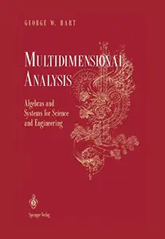

---

**Time:** 08:03:59 (Asia/Tehran)  
**Blog:** AvaxGenius  

**Title:** Continuous System Modeling  

**Details:** English | PDF | 1991 | 775 Pages | ISBN : 0387975020 | 60.4 MB  

**Link:** http://zavat.pw/ebooks/03847975020.html  

---

**Time:** 08:03:59 (Asia/Tehran)  
**Blog:** AvaxGenius  

**Title:** Stochastic Processes in Engineering Systems  

**Details:** English | PDF | 1985 | 371 Pages | ISBN : 1461295459 | 25.5 MB  

**Link:** http://zavat.pw/ebooks/14612952459.html  

---

**Time:** 08:03:59 (Asia/Tehran)  
**Blog:** AvaxGenius  

**Title:** Models and Methods for Interval-Valued Cooperative Games in Economic Management  

**Details:** English | PDF (True) | 2016 | 153 Pages | ISBN : 3319289969 | 1.8 MB  

**Link:** http://zavat.pw/ebooks/33149289969T.html  

---

**Time:** 08:03:59 (Asia/Tehran)  
**Blog:** AvaxGenius  

**Title:** Pro HTML5 Games  

**Details:** English | PDF (True) | 2012 | 356 Pages | ISBN : 143024710X | 9.3 MB  

**Link:** http://zavat.pw/ebooks/1432024710XT.html  

---

**Time:** 08:03:59 (Asia/Tehran)  
**Blog:** AvaxGenius  

**Title:** Pro Android Web Game Apps: Using HTML5, CSS3 and JavaScript  

**Details:** English | PDF (True) | 2012 | 656 Pages | ISBN : 1430238194 | 50.1 MB  

**Link:** http://zavat.pw/ebooks/1430238194XT.html  

---

**Time:** 08:03:59 (Asia/Tehran)  
**Blog:** crazy-slim  

**Title:** Midi Libre Ales - 8 Août 2026  

**Details:** Français | 22 pages | PDF | 28.1 MB  

**Link:** http://zavat.pw/newspapers/MidiLibreAles8Ao%C3%BBt2026-67384.html  

---

**Time:** 08:03:59 (Asia/Tehran)  
**Blog:** crazy-slim  

**Title:** Le Petit Bleu d'Agen - 8 Août 2026  

**Details:** Français | 22 pages | PDF | 25.9 MB  

**Link:** http://zavat.pw/newspapers/LePetitBleudAgen8Ao%C3%BBt2026-98105.html  

---

**Time:** 08:03:59 (Asia/Tehran)  
**Blog:** crazy-slim  

**Title:** Viajar - Agosto 2026  

**Details:** Portuguese | 28 pages | True PDF | 21.0 MB  

**Link:** http://zavat.pw/magazines/ViajarAgosto2026-42521.html  

---

**Time:** 08:03:59 (Asia/Tehran)  
**Blog:** crazy-slim  

**Title:** Sophia - Julho 2026  

**Details:** Portuguese | 52 pages | True PDF | 25.6 MB  

**Link:** http://zavat.pw/magazines/SophiaJulho2026-48990.html  

---

**Time:** 08:03:59 (Asia/Tehran)  
**Blog:** crazy-slim  

**Title:** Spaço Pets - Agosto 2026  

**Details:** Portuguese | 34 pages | True PDF | 24.0 MB  

**Link:** http://zavat.pw/magazines/Spa%C3%A7oPetsAgosto2026-56773.html  

---

**Time:** 08:03:59 (Asia/Tehran)  
**Blog:** crazy-slim  

**Title:** La Marseillaise - 8 Août 2026  

**Details:** Français | 40 pages | PDF | 43.0 MB  

**Link:** http://zavat.pw/newspapers/LaMarseillaise8Ao%C3%BBt2026-86615.html  

---

**Time:** 08:03:59 (Asia/Tehran)  
**Blog:** crazy-slim  

**Title:** Le Petit Quotidien - 8 Août 2026  

**Details:** Français | 4 pages | PDF | 3.2 MB  

**Link:** http://zavat.pw/newspapers/LePetitQuotidien8Ao%C3%BBt2026-38223.html  

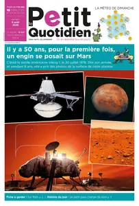

---

**Time:** 08:03:59 (Asia/Tehran)  
**Blog:** crazy-slim  

**Title:** La Nouvelle République des Pyrénées - 8 Août 2026  

**Details:** Français | 26 pages | PDF | 32.5 MB  

**Link:** http://zavat.pw/newspapers/LaNouvelleR%C3%A9publiquedesPyr%C3%A9n%C3%A9es8Ao%C3%BBt2026-96045.html  

---

**Time:** 08:03:59 (Asia/Tehran)  
**Blog:** crazy-slim  

**Title:** Recreio - 7 Agosto 2026  

**Details:** Portuguese | 30 pages | True PDF | 26.7 MB  

**Link:** http://zavat.pw/magazines/Recreio7Agosto2026-06023.html  

---

**Time:** 08:03:59 (Asia/Tehran)  
**Blog:** crazy-slim  

**Title:** La Dépêche du Midi Toulouse - 8 Août 2026  

**Details:** Français | 30 pages | PDF | 37.4 MB  

**Link:** http://zavat.pw/newspapers/LaD%C3%A9p%C3%AAcheduMidiToulouse8Ao%C3%BBt2026-97124.html  

---

**Time:** 08:03:59 (Asia/Tehran)  
**Blog:** crazy-slim  

**Title:** Piadas para todos - 31 Julho 2026  

**Details:** Portuguese | 38 pages | True PDF | 16.2 MB  

**Link:** http://zavat.pw/magazines/Piadasparatodos31Julho2026-05944.html  

---

**Time:** 08:03:59 (Asia/Tehran)  
**Blog:** crazy-slim  

**Title:** Receitas sem segredos - 5 Agosto 2026  

**Details:** Portuguese | 36 pages | True PDF | 14.4 MB  

**Link:** http://zavat.pw/magazines/Receitassemsegredos5Agosto2026-12630.html  

---

**Time:** 08:03:59 (Asia/Tehran)  
**Blog:** crazy-slim  

**Title:** Mente Saudável - Julho  2026  

**Details:** Portuguese | 56 pages | True PDF | 19.9 MB  

**Link:** http://zavat.pw/magazines/MenteSaud%C3%A1velJulho2026-71675.html  

---

**Time:** 08:03:59 (Asia/Tehran)  
**Blog:** crazy-slim  

**Title:** La Dépêche du Midi Tarn-et-Garonne - 8 Août 2026  

**Details:** Français | 30 pages | PDF | 37.2 MB  

**Link:** http://zavat.pw/newspapers/LaD%C3%A9p%C3%AAcheduMidiTarnetGaronne8Ao%C3%BBt2026-32013.html  

---

**Time:** 08:03:59 (Asia/Tehran)  
**Blog:** crazy-slim  

**Title:** Ideias e Revoluções - Agosto 2026  

**Details:** Portuguese | 34 pages | True PDF | 23.7 MB  

**Link:** http://zavat.pw/magazines/IdeiaseRevolu%C3%A7%C3%B5esAgosto2026-86012.html  

---

**Time:** 06:35:50 (Asia/Tehran)  
**Blog:** IrGens  

**Title:** Building Business Acumen for Financial Planning and Analysis (FP&A)  

**Details:** .MP4, AVC, 1280x720, 30 fps | English, AAC, 2 Ch | 1h 48m | 431 MB  

**Link:** http://zavat.pw/ebooks/building-business-acumen-for-financial-planning-and-analysis-fp-a.html  

---

**Time:** 06:35:50 (Asia/Tehran)  
**Blog:** IrGens  

**Title:** Developing Your Emotional Intelligence [Released: 8/6/2026]  

**Details:** .MP4, AVC, 1280x720, 30 fps | English, AAC, 2 Ch | 18m | 76 MB  

**Link:** http://zavat.pw/ebooks/developing-your-emotional-intelligence-54725012.html  

---

**Time:** 06:35:50 (Asia/Tehran)  
**Blog:** IrGens  

**Title:** What Bad Bosses Teach Us about Great Leadership  

**Details:** —  

**Link:** http://zavat.pw/ebooks/what-bad-bosses-teach-us-about-great-leadership.html  

---

**Time:** 06:35:50 (Asia/Tehran)  
**Blog:** IrGens  

**Title:** AI-Powered Data Analysis: Beyond Prompting  

**Details:** .MP4, AVC, 1280x720, 30 fps | English, AAC, 2 Ch | 54m | 161 MB  

**Link:** http://zavat.pw/ebooks/ai-powered-data-analysis-beyond-prompting.html  

---

**Time:** 06:35:50 (Asia/Tehran)  
**Blog:** AvaxGenius  

**Title:** Artificial Intelligence for Computer Games  

**Details:** English | PDF (True) | 2011 | 210 Pages | ISBN : 144198187X | 3.8 MB  

**Link:** http://zavat.pw/ebooks/1441984187X.html  

---

**Time:** 06:35:50 (Asia/Tehran)  
**Blog:** AvaxGenius  

**Title:** System Software Reliability  

**Details:** English | PDF (True) | 2006 | 442 Pages | ISBN : 1852339500 | 3 MB  

**Link:** http://zavat.pw/ebooks/18523395500.html  

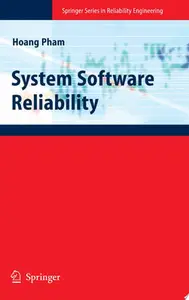

---

**Time:** 06:35:50 (Asia/Tehran)  
**Blog:** AvaxGenius  

**Title:** Reinventing Data Protection?  

**Details:** English | PDF (True) | 2009 | 356 Pages | ISBN : 1402094973 | 4.2 MB  

**Link:** http://zavat.pw/ebooks/14020594973.html  

---

**Time:** 06:35:50 (Asia/Tehran)  
**Blog:** AvaxGenius  

**Title:** Principles of Mobile Communication, Third Edition  

**Details:** English | PDF (True) | 2012 | 845 Pages | ISBN : 1461403634 | 17.3 MB  

**Link:** http://zavat.pw/ebooks/14614053634.html  

---

**Time:** 06:35:50 (Asia/Tehran)  
**Blog:** AvaxGenius  

**Title:** Principles of Mobile Communication  

**Details:** English | PDF | 2002 | 762 Pages | ISBN : 0306473151 | 89.7 MB  

**Link:** http://zavat.pw/ebooks/03046473151.html  

---

**Time:** 06:35:50 (Asia/Tehran)  
**Blog:** AvaxGenius  

**Title:** A First Course in Statistics for Signal Analysis  

**Details:** English | PDF (True) | 2006 | 216 Pages | ISBN : 0817645160 | 3.3 MB  

**Link:** http://zavat.pw/ebooks/08176545160.html  

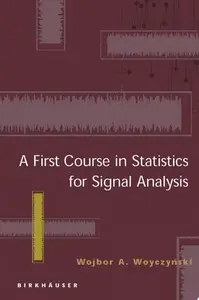

---

**Time:** 06:35:50 (Asia/Tehran)  
**Blog:** AvaxGenius  

**Title:** The Physics of Polymers: Concepts for Understanding Their Structures and Behavior  

**Details:** English | PDF (True) | 2007 | 525 Pages | ISBN : 3540252789 | 10.4 MB  

**Link:** http://zavat.pw/ebooks/35450252789.html  

---

**Time:** 06:35:50 (Asia/Tehran)  
**Blog:** AvaxGenius  

**Title:** Modeling and Control of Discrete-event Dynamic Systems: with Petri Nets and Other Tools  

**Details:** English | PDF (True) | 2007 | 352 Pages | ISBN : 184628872X | 6 MB  

**Link:** http://zavat.pw/ebooks/1846288572X.html  

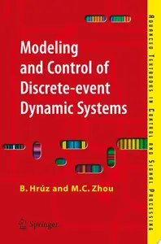

---

**Time:** 06:35:50 (Asia/Tehran)  
**Blog:** AvaxGenius  

**Title:** Stability of Dynamical Systems: Continuous, Discontinuous, and Discrete Systems  

**Details:** English | PDF (True) | 2008 | 516 Pages | ISBN : 0817646493 | 6.5 MB  

**Link:** http://zavat.pw/ebooks/08157646493.html  

---

**Time:** 06:35:50 (Asia/Tehran)  
**Blog:** AvaxGenius  

**Title:** Computational Chemistry and Molecular Modeling: Principles and Applications  

**Details:** English | PDF (True) | 2008 | 404 Pages | ISBN : 3540773029 | 4 MB  

**Link:** http://zavat.pw/ebooks/35450773029.html  

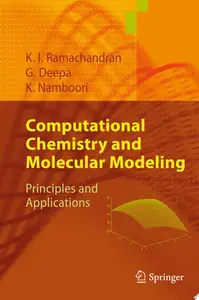

---

**Time:** 06:35:50 (Asia/Tehran)  
**Blog:** AvaxGenius  

**Title:** Neural-Symbolic Cognitive Reasoning  

**Details:** English | PDF | 2009 | 199 Pages | ISBN : 3540732454 | 1.3 MB  

**Link:** http://zavat.pw/ebooks/35405732454.html  

---

**Time:** 03:26:12 (Asia/Tehran)  
**Blog:** AvaxGenius  

**Title:** Alfalfa and Alfalfa Improvement (Repost)  

**Details:** English | PDF | 1988 | 1099 Pages | ISBN : 089118094X | 194.1 MB  

**Link:** http://zavat.pw/ebooks/08914318094X.html  

---

**Time:** 03:26:12 (Asia/Tehran)  
**Blog:** AvaxGenius  

**Title:** Advanced Technologies, Systems, and Applications VI (Repost)  

**Details:** English | PDF | 2022 | 803 Pages | ISBN : 3030900541 | 138 MB  

**Link:** http://zavat.pw/ebooks/303092005414.html  

---

**Time:** 03:26:12 (Asia/Tehran)  
**Blog:** AvaxGenius  

**Title:** HCI International 2020 - Late Breaking Papers: Multimodality and Intelligence (Repost)  

**Details:** English | PDF | 2020 | 552 Pages | ISBN : 3030601161 | 102.9 MB  

**Link:** http://zavat.pw/ebooks/230306011461.html  

---

**Time:** 03:26:12 (Asia/Tehran)  
**Blog:** AvaxGenius  

**Title:** Advanced Intelligent Systems for Sustainable Development (AI2SD’2020): Volume 2 (Repost)  

**Details:** English | PDF | 2022 | 1298 Pages | ISBN : 3030906388 | 145.3 MB  

**Link:** http://zavat.pw/ebooks/303090643388.html  

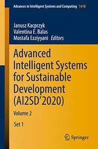

---

**Time:** 03:26:12 (Asia/Tehran)  
**Blog:** AvaxGenius  

**Title:** Conservation Practices in Museums: For Researchers and Museum Professionals (Repost)  

**Details:** English | EPUB | 2022 | 191 Pages | ISBN : 4431569081 | 121.3 MB  

**Link:** http://zavat.pw/ebooks/443135569081.html  

---

**Time:** 03:26:12 (Asia/Tehran)  
**Blog:** AvaxGenius  

**Title:** Advances in Data Computing, Communication and Security: Proceedings of I3CS2021 (Repost)  

**Details:** English | EPUB | 2022 | 702 Pages | ISBN : 9811684022 | 102.5 MB  

**Link:** http://zavat.pw/ebooks/981163284022.html  

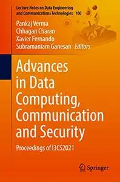

---

**Time:** 03:26:12 (Asia/Tehran)  
**Blog:** AvaxGenius  

**Title:** Proceedings of International Conference on Data Science and Applications: ICDSA 2021, Volume 1 (Repost)  

**Details:** English | PDF,EPUB | 2022 | 845 Pages | ISBN : 9811651191 | 174.5 MB  

**Link:** http://zavat.pw/ebooks/981164351191.html  

---

**Time:** 03:26:12 (Asia/Tehran)  
**Blog:** AvaxGenius  

**Title:** Proceedings of TEPEN 2022: Efficiency and Performance Engineering Network (Repost)  

**Details:** English | PDF (True) | 2023 | 1156 Pages | ISBN : 3031261925 | 186.1 MB  

**Link:** http://zavat.pw/ebooks/303124361925.html  

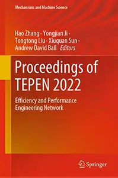

---

**Time:** 03:26:12 (Asia/Tehran)  
**Blog:** AvaxGenius  

**Title:** Cognitive Systems and Signal Processing (Repost)  

**Details:** English | EPUB | 2022 | 639 Pages | ISBN : 981162335X | 119.3 MB  

**Link:** http://zavat.pw/ebooks/98131642335X.html  

---

**Time:** 03:26:12 (Asia/Tehran)  
**Blog:** AvaxGenius  

**Title:** Equine Reproductive Procedures, Second Edition (Repost)  

**Details:** English | PDF | 2021 | 679 Pages | ISBN : 1119555981 | 192.2 MB  

**Link:** http://zavat.pw/ebooks/111955559851.html  

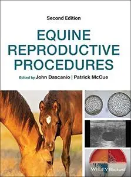

---

**Time:** 03:26:12 (Asia/Tehran)  
**Blog:** AvaxGenius  

**Title:** Mr Hopkins` Men: Cambridge Reform and British Mathematics in the 19th Century (Repost)  

**Details:** English | PDF | 2007 | 410 Pages | ISBN : 1848001320 | 96.1 MB  

**Link:** http://zavat.pw/ebooks/184438001320.html  

---

**Time:** 03:26:12 (Asia/Tehran)  
**Blog:** AvaxGenius  

**Title:** Plant Genomics 2019: Volume II (Repost)  

**Details:** English | PDF | 2023 | 586 Pages | ISBN : 3036580905 | 104.5 MB  

**Link:** http://zavat.pw/ebooks/303465809053.html  

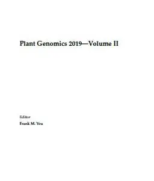

---

**Time:** 03:26:12 (Asia/Tehran)  
**Blog:** AvaxGenius  

**Title:** Proceedings of International Joint Conference on Computational Intelligence: IJCCI 2019 (Repost)  

**Details:** English | PDF | 2020 | 642 Pages | ISBN : 9811536066 | 102.9 MB  

**Link:** http://zavat.pw/ebooks/981134536066.html  

---

**Time:** 03:26:12 (Asia/Tehran)  
**Blog:** AvaxGenius  

**Title:** X-Ray Free-Electron Laser (Repost)  

**Details:** English | PDF | 2018 | 458 Pages | ISBN : 3038428795 | 231.09 MB  

**Link:** http://zavat.pw/ebooks/303384248795.html  

---

**Time:** 03:26:12 (Asia/Tehran)  
**Blog:** AvaxGenius  

**Title:** Proceedings of the 23rd Pacific Basin Nuclear Conference, Volume 1 (Repost)  

**Details:** English | PDF | 2023 | 1179 Pages | ISBN : 9819910226 | 143.5 MB  

**Link:** http://zavat.pw/ebooks/981991054226.html  

---

**Time:** 01:57:12 (Asia/Tehran)  
**Blog:** hill0  

**Title:** Optimal Control in Random Environments  

**Details:** English | 2026 | ISBN: 3032256402 | 135 Pages | PDF EPUB (True) | 9 MB  

**Link:** http://zavat.pw/ebooks/3032256402.html  

---

**Time:** 01:57:12 (Asia/Tehran)  
**Blog:** hill0  

**Title:** Knowledge Preservation in Nuclear Safety  

**Details:** English | 2026 | ISBN: 3032254620 | 637 Pages | PDF EPUB (True) | 54 MB  

**Link:** http://zavat.pw/ebooks/3032254620.html  

---

**Time:** 01:01:46 (Asia/Tehran)  
**Blog:** hill0  

**Title:** Husserl and Awakened Reason  

**Details:** English | 2026 | ISBN: 3032204739 | 221 Pages | PDF EPUB (True) | 2 MB  

**Link:** http://zavat.pw/ebooks/3032204739.html  

---

**Time:** 01:01:46 (Asia/Tehran)  
**Blog:** hill0  

**Title:** Smart and Connected Health  

**Details:** English | 2026 | ISBN: 3032092523 | 353 Pages | PDF EPUB (True) | 52 MB  

**Link:** http://zavat.pw/ebooks/3032092523.html  

---

**Time:** 01:01:46 (Asia/Tehran)  
**Blog:** hill0  

**Title:** Advanced Signal Processing Systems  

**Details:** English | 2026 | ISBN: 3032139163 | 289 Pages | PDF EPUB (True) | 55 MB  

**Link:** http://zavat.pw/ebooks/3032139163.html  

---

**Time:** 01:01:46 (Asia/Tehran)  
**Blog:** hill0  

**Title:** Rational, Responsible, and Relational  

**Details:** English | 2026 | ISBN: 3032247268 | 320 Pages | PDF EPUB (True) | 4 MB  

**Link:** http://zavat.pw/ebooks/3032247268.html  

---

**Time:** 00:02:36 (Asia/Tehran)  
**Blog:** AvaxGenius  

**Title:** Reinforcement Learning: With Open AI, TensorFlow and Keras Using Python (Repost)  

**Details:** English | EPUB (True) | 2018 | 174 Pages | ISBN : 1484232844 | 5.6 MB  

**Link:** http://zavat.pw/ebooks/14842332844E.html  

---

**Time:** 00:02:36 (Asia/Tehran)  
**Blog:** hill0  

**Title:** MLOps with Databricks  

**Details:** English | 2026 | ASIN: B0G48GG7G8 | 422 Pages | EPUB | 14 MB  

**Link:** http://zavat.pw/ebooks/B0G48GG7G8.html  

