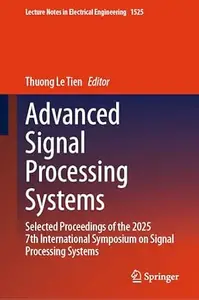
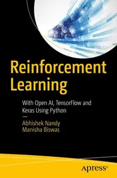
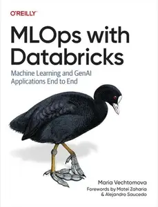

# Zavat feed - 2026-08-08

---

**Time:** 01:01:46 (Asia/Tehran)  
**Blog:** hill0  

**Title:** Husserl and Awakened Reason  

**Details:** English | 2026 | ISBN: 3032204739 | 221 Pages | PDF EPUB (True) | 2 MB  

**Link:** http://zavat.pw/ebooks/3032204739.html  

---

**Time:** 01:01:46 (Asia/Tehran)  
**Blog:** hill0  

**Title:** Smart and Connected Health  

**Details:** English | 2026 | ISBN: 3032092523 | 353 Pages | PDF EPUB (True) | 52 MB  

**Link:** http://zavat.pw/ebooks/3032092523.html  

---

**Time:** 01:01:46 (Asia/Tehran)  
**Blog:** hill0  

**Title:** Advanced Signal Processing Systems  

**Details:** English | 2026 | ISBN: 3032139163 | 289 Pages | PDF EPUB (True) | 55 MB  

**Link:** http://zavat.pw/ebooks/3032139163.html  

---

**Time:** 01:01:46 (Asia/Tehran)  
**Blog:** hill0  

**Title:** Rational, Responsible, and Relational  

**Details:** English | 2026 | ISBN: 3032247268 | 320 Pages | PDF EPUB (True) | 4 MB  

**Link:** http://zavat.pw/ebooks/3032247268.html  

---

**Time:** 00:02:36 (Asia/Tehran)  
**Blog:** AvaxGenius  

**Title:** Reinforcement Learning: With Open AI, TensorFlow and Keras Using Python (Repost)  

**Details:** English | EPUB (True) | 2018 | 174 Pages | ISBN : 1484232844 | 5.6 MB  

**Link:** http://zavat.pw/ebooks/14842332844E.html  

---

**Time:** 00:02:36 (Asia/Tehran)  
**Blog:** hill0  

**Title:** MLOps with Databricks  

**Details:** English | 2026 | ASIN: B0G48GG7G8 | 422 Pages | EPUB | 14 MB  

**Link:** http://zavat.pw/ebooks/B0G48GG7G8.html  

