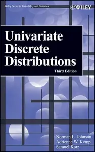
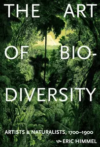
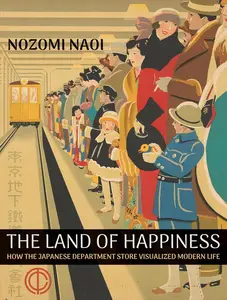
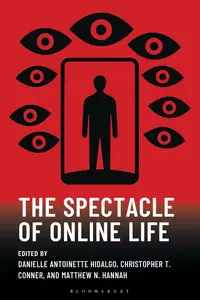

# Zavat feed - 2026-08-09

---

**Time:** 02:25:25 (Asia/Tehran)  
**Blog:** AvaxGenius  

**Title:** Univariate Discrete Distributions, Third Edition  

**Details:** English | PDF | 2005 | 671 Pages | ISBN : 0471272469 | 3.4 MB  

**Link:** http://zavat.pw/ebooks/04712752469.html  

---

**Time:** 01:24:00 (Asia/Tehran)  
**Blog:** IrGens  

**Title:** No Nonsense: A History of the Dutch Neoliberal Turn  

**Details:** English | July 28, 2026 | ISBN: 1804294195, 9781804294215 | True EPUB | 272 pages | 0.5 MB  

**Link:** http://zavat.pw/ebooks/1804294195.html  

---

**Time:** 01:24:00 (Asia/Tehran)  
**Blog:** IrGens  

**Title:** Confederate Cities: The Urban South During the Civil War Era  

**Details:** English | December 1, 2015 | ISBN: 022630017X, 022630020X, 9780226300344 | True PDF | 336 pages | 3.8 MB  

**Link:** http://zavat.pw/ebooks/022630017X-pdf.html  

---

**Time:** 01:24:00 (Asia/Tehran)  
**Blog:** IrGens  

**Title:** Planning the Home Front: Building Bombers and Communities at Willow Run  

**Details:** English | May 22, 2013 | ISBN: 022602542X, 9780226025568 | True EPUB/PDF | 376 pages | 7.5/2.2 MB  

**Link:** http://zavat.pw/ebooks/022602542X.html  

---

**Time:** 00:54:27 (Asia/Tehran)  
**Blog:** IrGens  

**Title:** The Art of Biodiversity: Artists & Naturalists, 1700–1900  

**Details:** English | April 14, 2026 | ISBN: 1419777254, 9798887074313 | True EPUB | 400 pages | 634 MB  

**Link:** http://zavat.pw/ebooks/1419777254.html  

---

**Time:** 00:54:27 (Asia/Tehran)  
**Blog:** IrGens  

**Title:** The Land of Happiness: How the Japanese Department Store Visualized Modern Life  

**Details:** English | August 4, 2026 | ISBN: 0262054426, 9780262054430 | True EPUB | 256 pages | 6.4 MB  

**Link:** http://zavat.pw/ebooks/0262054426.html  

---

**Time:** 00:54:27 (Asia/Tehran)  
**Blog:** IrGens  

**Title:** The Spectacle of Online Life  

**Details:** English | November 20, 2025 | ISBN: 1666948381, 9798216368199, 9781978760042 | True EPUB | 324 pages | 1.5 MB  

**Link:** http://zavat.pw/ebooks/1666948381.html  

---

**Time:** 00:54:27 (Asia/Tehran)  
**Blog:** IrGens  

**Title:** Diversity of Aesthetics  

**Details:** English | June 24, 2025 | ISBN: 1945335319, 9781945335556 | True EPUB | 176 pages | 1.5 MB  

**Link:** http://zavat.pw/ebooks/1945335319.html  

