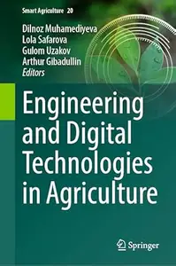
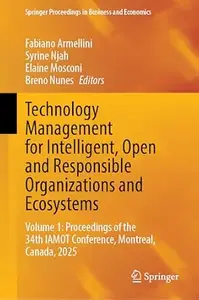

# Zavat feed - 2026-08-10

---

**Time:** 01:55:19 (Asia/Tehran)  
**Blog:** AvaxGenius  

**Title:** The Topology of Chaos: Alice in Stretch and Squeezeland  

**Details:** English | PDF | 2003 | 512 Pages | ISBN : 0471408166 | 26.8 MB  

**Link:** http://zavat.pw/ebooks/04714048166.html  

---

**Time:** 00:30:38 (Asia/Tehran)  
**Blog:** hill0  

**Title:** Engineering and Digital Technologies in Agriculture  

**Details:** English | 2026 | ISBN: 9819204801 | 172 Pages | PDF EPUB (True) | 35 MB  

**Link:** http://zavat.pw/ebooks/9819204801.html  

---

**Time:** 00:30:38 (Asia/Tehran)  
**Blog:** hill0  

**Title:** Rethinking Health and Well-Being  

**Details:** English | 2026 | ISBN: 3032285968 | 186 Pages | PDF EPUB (True) | 4 MB  

**Link:** http://zavat.pw/ebooks/3032285968.html  

---

**Time:** 00:30:38 (Asia/Tehran)  
**Blog:** hill0  

**Title:** Technology Management for Intelligent, Open and Responsible Organizations and Ecosystems: Volume 1  

**Details:** English | 2026 | ISBN: 303223123X | 610 Pages | PDF (True) | 28 MB  

**Link:** http://zavat.pw/ebooks/303223123X.html  

