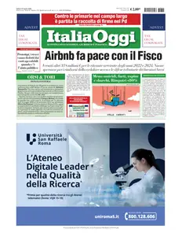
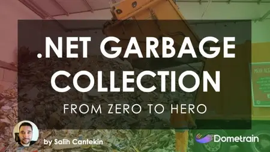
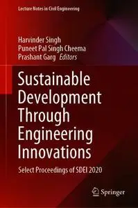
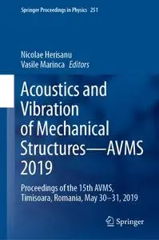
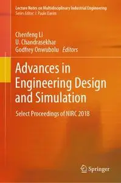
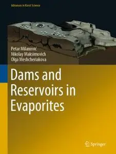
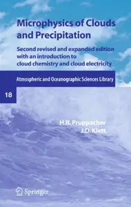
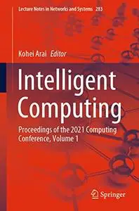
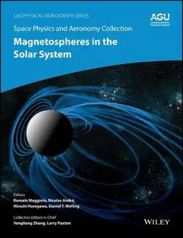
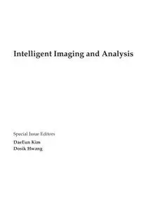

# Zavat feed - 2026-08-15

---

**Time:** 08:25:03 (Asia/Tehran)  
**Blog:** IrGens  

**Title:** Evaluating AI Outputs for Data Professionals  

**Details:** .MP4, AVC, 1280x720, 30 fps | English, AAC, 2 Ch | 1h | 173 MB  

**Link:** http://zavat.pw/ebooks/evaluating-ai-outputs-for-data-professionals.html  

---

**Time:** 08:25:03 (Asia/Tehran)  
**Blog:** IrGens  

**Title:** Beginning Guitar for Adults: Learn Chords, Strumming & Songs  

**Details:** .MP4, AVC, 1920x1080, 30 fps | English, AAC, 2 Ch | 2h 52m | 7.09 GB  

**Link:** http://zavat.pw/ebooks/beginning-guitar-for-adults-or-older-beginners.html  

---

**Time:** 08:25:03 (Asia/Tehran)  
**Blog:** crazy-slim  

**Title:** FrontLine - 31 August 2026  

**Details:** English | 116 pages | True PDF | 58.9 MB  

**Link:** http://zavat.pw/magazines/FrontLine31August2026-68259.html  

---

**Time:** 08:25:03 (Asia/Tehran)  
**Blog:** crazy-slim  

**Title:** Rail - 15 August 2026  

**Details:** English | 72 pages | True PDF | 70.4 MB  

**Link:** http://zavat.pw/magazines/Rail15August2026-82380.html  

---

**Time:** 08:25:03 (Asia/Tehran)  
**Blog:** crazy-slim  

**Title:** HWM Singapore - August 2026  

**Details:** English | 68 pages | True PDF | 23.2 MB  

**Link:** http://zavat.pw/magazines/HWMSingaporeAugust2026-38755.html  

---

**Time:** 08:25:03 (Asia/Tehran)  
**Blog:** crazy-slim  

**Title:** la Repubblica - 15 Agosto 2026  

**Details:** Italiano | 48 pages | True PDF | 45.7 MB  

**Link:** http://zavat.pw/newspapers/laRepubblica15Agosto2026-91962.html  

---

**Time:** 08:25:03 (Asia/Tehran)  
**Blog:** crazy-slim  

**Title:** TuttoSport - 15 Agosto 2026  

**Details:** Italiano | 40 pages | True PDF | 22.5 MB  

**Link:** http://zavat.pw/newspapers/TuttoSport15Agosto2026-94048.html  

---

**Time:** 08:25:03 (Asia/Tehran)  
**Blog:** crazy-slim  

**Title:** La Verita - 15 Agosto 2026  

**Details:** Italiano | 24 pages | True PDF | 29.6 MB  

**Link:** http://zavat.pw/newspapers/LaVerita15Agosto2026-29461.html  

---

**Time:** 08:25:03 (Asia/Tehran)  
**Blog:** crazy-slim  

**Title:** Corriere dello Sport - 15 Agosto 2026  

**Details:** Italiano | 58 pages | True PDF | 41.0 MB  

**Link:** http://zavat.pw/newspapers/CorrieredelloSport15Agosto2026-64769.html  

---

**Time:** 08:25:03 (Asia/Tehran)  
**Blog:** crazy-slim  

**Title:** La Stampa - 15 Agosto 2026  

**Details:** Italiano | 56 pages | True PDF | 28.7 MB  

**Link:** http://zavat.pw/newspapers/LaStampa15Agosto2026-17746.html  

---

**Time:** 08:25:03 (Asia/Tehran)  
**Blog:** crazy-slim  

**Title:** Il Messaggero - 15 Agosto 2026  

**Details:** Italiano | 48 pages | True PDF | 24.4 MB  

**Link:** http://zavat.pw/newspapers/IlMessaggero15Agosto2026-97530.html  

---

**Time:** 08:25:03 (Asia/Tehran)  
**Blog:** crazy-slim  

**Title:** La Gazzetta dello Sport - 15 Agosto 2026  

**Details:** Italiano | 48 pages | True PDF | 11.2 MB  

**Link:** http://zavat.pw/newspapers/LaGazzettadelloSport15Agosto2026-39066.html  

---

**Time:** 08:25:03 (Asia/Tehran)  
**Blog:** crazy-slim  

**Title:** Il Sole 24 Ore - 15 Agosto 2026  

**Details:** Italiano | 24 pages | True PDF | 19.6 MB  

**Link:** http://zavat.pw/newspapers/IlSole24Ore15Agosto2026-20654.html  

---

**Time:** 08:25:03 (Asia/Tehran)  
**Blog:** crazy-slim  

**Title:** ItaliaOggi - 15 Agosto 2026  

**Details:** Italiano | 31 pages | True PDF | 5.7 MB  

**Link:** http://zavat.pw/newspapers/ItaliaOggi15Agosto2026-75952.html  

---

**Time:** 08:25:03 (Asia/Tehran)  
**Blog:** crazy-slim  

**Title:** il Manifesto - 15 Agosto 2026  

**Details:** Italiano | 16 pages | True PDF | 3.7 MB  

**Link:** http://zavat.pw/newspapers/ilManifesto15Agosto2026-92551.html  

---

**Time:** 08:25:03 (Asia/Tehran)  
**Blog:** crazy-slim  

**Title:** Domani - 15 Agosto 2026  

**Details:** Italiano | 16 pages | True PDF | 9.0 MB  

**Link:** http://zavat.pw/newspapers/Domani15Agosto2026-48020.html  

---

**Time:** 08:25:03 (Asia/Tehran)  
**Blog:** crazy-slim  

**Title:** Corriere della Sera - 15 Agosto 2026  

**Details:** Italiano | 48 pages | True PDF | 9.5 MB  

**Link:** http://zavat.pw/newspapers/CorrieredellaSera15Agosto2026-47210.html  

---

**Time:** 07:31:47 (Asia/Tehran)  
**Blog:** IrGens  

**Title:** Getting Started: Rust  

**Details:** .MP4, AVC, 1920x1080, 60 fps | English, AAC, 2 Ch | 4h 9m | 1.54 GB  

**Link:** http://zavat.pw/ebooks/getting-started-rust.html  

---

**Time:** 07:31:47 (Asia/Tehran)  
**Blog:** IrGens  

**Title:** From Zero to Hero: Garbage Collection in .NET  

**Details:** .MP4, AVC, 1920x1080, 30 fps | English, AAC, 2 Ch | 3h 50m | 1.09 GB  

**Link:** http://zavat.pw/ebooks/from-zero-to-hero-garbage-collection-in-dotnet.html  

---

**Time:** 07:31:47 (Asia/Tehran)  
**Blog:** IrGens  

**Title:** Supercharge Google Colab with AI Tools  

**Details:** .MP4, AVC, 1920x1080, 30 fps | English, AAC, 2 Ch | 2h 3m | 277 MB  

**Link:** http://zavat.pw/ebooks/google-colab-ai.html  

---

**Time:** 07:31:47 (Asia/Tehran)  
**Blog:** AvaxGenius  

**Title:** Sustainable Development Through Engineering Innovations: Select Proceedings of SDEI 2020 (Repost)  

**Details:** English | EPUB | 2021 | 753 Pages | ISBN : 9811595534 | 109 MB  

**Link:** http://zavat.pw/ebooks/981156955634.html  

---

**Time:** 07:31:47 (Asia/Tehran)  
**Blog:** AvaxGenius  

**Title:** Hydro-Climatic Extremes in the Anthropocene (Repost)  

**Details:** English | EPUB (True) | 2023 | 462 Pages | ISBN : 3031377265 | 136.3 MB  

**Link:** http://zavat.pw/ebooks/30317377265.html  

---

**Time:** 07:31:47 (Asia/Tehran)  
**Blog:** AvaxGenius  

**Title:** Bark Anatomy of Trees and Shrubs in the Temperate Northern Hemisphere (Repost)  

**Details:** English | PDF | 2019 | 394 Pages | ISBN : 3030140555 | 98.6 MB  

**Link:** http://zavat.pw/ebooks/303061406555.html  

---

**Time:** 07:31:47 (Asia/Tehran)  
**Blog:** AvaxGenius  

**Title:** Acoustics and Vibration of Mechanical Structures—AVMS 2019 (Repost)  

**Details:** English | EPUB | 2021 | 522 Pages | ISBN : 3030541355 | 141 MB  

**Link:** http://zavat.pw/ebooks/303054661355.html  

---

**Time:** 07:31:47 (Asia/Tehran)  
**Blog:** AvaxGenius  

**Title:** Advances in Engineering Design and Simulation: Select Proceedings of NIRC 2018 (Repost)  

**Details:** English | EPUB | 2020 | 348 Pages | ISBN : 9811384673 | 96.43 MB  

**Link:** http://zavat.pw/ebooks/98113848673.html  

---

**Time:** 07:31:47 (Asia/Tehran)  
**Blog:** AvaxGenius  

**Title:** Dams and Reservoirs in Evaporites (Repost)  

**Details:** English | EPUB | 2019 | 157 Pages | ISBN : 3030185206 | 224.8 MB  

**Link:** http://zavat.pw/ebooks/30370185206.html  

---

**Time:** 07:31:47 (Asia/Tehran)  
**Blog:** AvaxGenius  

**Title:** The Karst Systems of Florida: Understanding Karst in a Geologically Young Terrain (Repost)  

**Details:** English | EPUB | 2018 (2019 Edition) | 459 Pages | ISBN : 3319696343 | 268.3MB  

**Link:** http://zavat.pw/ebooks/33196967343.html  

---

**Time:** 07:31:47 (Asia/Tehran)  
**Blog:** AvaxGenius  

**Title:** Microphysics of Clouds and Precipitation (Repost)  

**Details:** English | PDF | 2010 | 975 Pages | ISBN : 0792342119 | 131.8 MB  

**Link:** http://zavat.pw/ebooks/07692342119.html  

---

**Time:** 07:31:47 (Asia/Tehran)  
**Blog:** AvaxGenius  

**Title:** Amazon Fruits: An Ethnobotanical Journey (Repost)  

**Details:** English | PDF (True) | 2023 | 1276 Pages | ISBN : 3031128028 | 146.1 MB  

**Link:** http://zavat.pw/ebooks/33031128028.html  

---

**Time:** 07:31:47 (Asia/Tehran)  
**Blog:** AvaxGenius  

**Title:** Intelligent Computing: Proceedings of the 2021 Computing Conference, Volume 1 (Repost)  

**Details:** English | EPUB | 2022 | 1169 Pages | ISBN : 3030801187 | 173 MB  

**Link:** http://zavat.pw/ebooks/30308601187.html  

---

**Time:** 07:31:47 (Asia/Tehran)  
**Blog:** AvaxGenius  

**Title:** Innovations in Computational Intelligence and Computer Vision: Proceedings of ICICV 2022 (Repost)  

**Details:** English | PDF EPUB (True) | 2023 | 764 Pages | ISBN : 9819926017 | 154.9 MB  

**Link:** http://zavat.pw/ebooks/98169926017.html  

---

**Time:** 07:31:47 (Asia/Tehran)  
**Blog:** AvaxGenius  

**Title:** Recent Trends and Advances in Artificial Intelligence and Internet of Things (Repost)  

**Details:** English | EPUB | 2020 | 618 Pages | ISBN : 3030326438 | 123.81 MB  

**Link:** http://zavat.pw/ebooks/30630326438.html  

---

**Time:** 07:31:47 (Asia/Tehran)  
**Blog:** AvaxGenius  

**Title:** Space Physics and Aeronomy, Magnetospheres in the Solar System: Magnetospheres in the Solar System  

**Details:** English | EPUB(True) | 2021 | 800 Pages | ISBN : 1119507529 | 139.7 MB  

**Link:** http://zavat.pw/ebooks/11619507529.html  

---

**Time:** 07:31:47 (Asia/Tehran)  
**Blog:** AvaxGenius  

**Title:** Proceedings of the 7th International Conference on Fracture Fatigue and Wear (Repost)  

**Details:** English | PDF,EPUB | 2018 (2019 Edition) | 831 Pages | ISBN : 9811304106 | 178.11 MB  

**Link:** http://zavat.pw/ebooks/98113045106.html  

---

**Time:** 07:31:47 (Asia/Tehran)  
**Blog:** AvaxGenius  

**Title:** Intelligent Imaging and Analysis (Repost)  

**Details:** English | PDF | 2020 | 494 Pages | ISBN : 3039219200 | 105 MB  

**Link:** http://zavat.pw/ebooks/30392192050.html  

---

**Time:** 06:40:47 (Asia/Tehran)  
**Blog:** AvaxGenius  

**Title:** Utilization of Geospatial Information in Daily Life: Expression and Analysis of Dynamic Life Activity (Repost)  

**Details:** English | EPUB (True) | 2023 | 177 Pages | ISBN : 9811969043 | 106.9 MB  

**Link:** http://zavat.pw/ebooks/981169690643.html  

---

**Time:** 06:40:47 (Asia/Tehran)  
**Blog:** AvaxGenius  

**Title:** Advanced Concepts for Intelligent Vision Systems (Repost)  

**Details:** English | PDF | 2017 | 772 Pages | ISBN : 3319703528 | 112.5 MB  

**Link:** http://zavat.pw/ebooks/33197063528.html  

---

**Time:** 06:40:47 (Asia/Tehran)  
**Blog:** AvaxGenius  

**Title:** Cable Supported Composite Bridges (Repost)  

**Details:** English | EPUB (True) | 2023 | 778 Pages | ISBN : 9819932076 | 144.1 MB  

**Link:** http://zavat.pw/ebooks/981959532076.html  

---

**Time:** 01:17:31 (Asia/Tehran)  
**Blog:** hill0  

**Title:** Machine and Computing Technologies for Sustainable Development, Volume 3  

**Details:** English | 2026 | ISBN: 3032237157 | 505 Pages | PDF (True) | 61 MB  

**Link:** http://zavat.pw/ebooks/3032237157.html  

---

**Time:** 01:17:31 (Asia/Tehran)  
**Blog:** hill0  

**Title:** Imagining Antiquity in Shakespeare’s England  

**Details:** English | 2026 | ISBN: 3032237939 | 305 Pages | PDF EPUB (True) | 18 MB  

**Link:** http://zavat.pw/ebooks/3032237939.html  

---

**Time:** 01:17:31 (Asia/Tehran)  
**Blog:** hill0  

**Title:** The Power of the Flat Earth Idea  

**Details:** English | 2026 | ISBN: 303223980X | 394 Pages | PDF EPUB (True) | 26 MB  

**Link:** http://zavat.pw/ebooks/303223980X.html  

---

**Time:** 01:17:31 (Asia/Tehran)  
**Blog:** hill0  

**Title:** The Economics of Social Justice and Societal Evolution  

**Details:** English | 2026 | ISBN: 3032240549 | 782 Pages | PDF EPUB (True) | 43 MB  

**Link:** http://zavat.pw/ebooks/3032240549.html  

---

**Time:** 00:48:16 (Asia/Tehran)  
**Blog:** hill0  

**Title:** Physical and Mathematical Modeling of Earth and Environmental Processes  

**Details:** English | 2026 | ISBN: 3032247764 | 587 Pages | PDF (True) | 104 MB  

**Link:** http://zavat.pw/ebooks/3032247764.html  

---

**Time:** 00:48:16 (Asia/Tehran)  
**Blog:** hill0  

**Title:** Storytelling and Consumer Brand Relationships  

**Details:** English | 2026 | ISBN: 3032251222 | 173 Pages | PDF EPUB (True) | 16 MB  

**Link:** http://zavat.pw/ebooks/3032251222.html  

---

**Time:** 00:48:16 (Asia/Tehran)  
**Blog:** hill0  

**Title:** Business Process Management (2nd Edition)  

**Details:** English | 2025 | ISBN: 3658493380 | 260 Pages | EPUB (True) | 70 MB  

**Link:** http://zavat.pw/ebooks/3658493380T.html  

---

**Time:** 00:48:16 (Asia/Tehran)  
**Blog:** hill0  

**Title:** Advances in Intelligent Asset Management and Maintenance  

**Details:** English | 2026 | ISBN: 9819202833 | 235 Pages | PDF (True) | 17 MB  

**Link:** http://zavat.pw/ebooks/9819202833.html  

