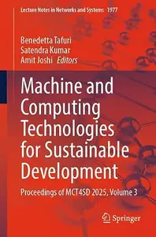
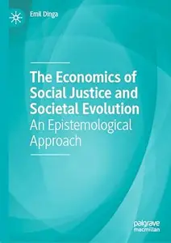
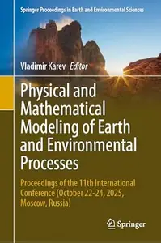
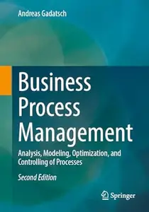
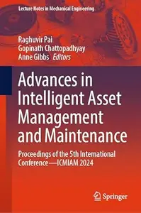

# Zavat feed - 2026-08-15

---

**Time:** 06:40:47 (Asia/Tehran)  
**Blog:** AvaxGenius  

**Title:** Utilization of Geospatial Information in Daily Life: Expression and Analysis of Dynamic Life Activity (Repost)  

**Details:** English | EPUB (True) | 2023 | 177 Pages | ISBN : 9811969043 | 106.9 MB  

**Link:** http://zavat.pw/ebooks/981169690643.html  

---

**Time:** 06:40:47 (Asia/Tehran)  
**Blog:** AvaxGenius  

**Title:** Advanced Concepts for Intelligent Vision Systems (Repost)  

**Details:** English | PDF | 2017 | 772 Pages | ISBN : 3319703528 | 112.5 MB  

**Link:** http://zavat.pw/ebooks/33197063528.html  

---

**Time:** 06:40:47 (Asia/Tehran)  
**Blog:** AvaxGenius  

**Title:** Cable Supported Composite Bridges (Repost)  

**Details:** English | EPUB (True) | 2023 | 778 Pages | ISBN : 9819932076 | 144.1 MB  

**Link:** http://zavat.pw/ebooks/981959532076.html  

---

**Time:** 01:17:31 (Asia/Tehran)  
**Blog:** hill0  

**Title:** Machine and Computing Technologies for Sustainable Development, Volume 3  

**Details:** English | 2026 | ISBN: 3032237157 | 505 Pages | PDF (True) | 61 MB  

**Link:** http://zavat.pw/ebooks/3032237157.html  

---

**Time:** 01:17:31 (Asia/Tehran)  
**Blog:** hill0  

**Title:** Imagining Antiquity in Shakespeare’s England  

**Details:** English | 2026 | ISBN: 3032237939 | 305 Pages | PDF EPUB (True) | 18 MB  

**Link:** http://zavat.pw/ebooks/3032237939.html  

---

**Time:** 01:17:31 (Asia/Tehran)  
**Blog:** hill0  

**Title:** The Power of the Flat Earth Idea  

**Details:** English | 2026 | ISBN: 303223980X | 394 Pages | PDF EPUB (True) | 26 MB  

**Link:** http://zavat.pw/ebooks/303223980X.html  

---

**Time:** 01:17:31 (Asia/Tehran)  
**Blog:** hill0  

**Title:** The Economics of Social Justice and Societal Evolution  

**Details:** English | 2026 | ISBN: 3032240549 | 782 Pages | PDF EPUB (True) | 43 MB  

**Link:** http://zavat.pw/ebooks/3032240549.html  

---

**Time:** 00:48:16 (Asia/Tehran)  
**Blog:** hill0  

**Title:** Physical and Mathematical Modeling of Earth and Environmental Processes  

**Details:** English | 2026 | ISBN: 3032247764 | 587 Pages | PDF (True) | 104 MB  

**Link:** http://zavat.pw/ebooks/3032247764.html  

---

**Time:** 00:48:16 (Asia/Tehran)  
**Blog:** hill0  

**Title:** Storytelling and Consumer Brand Relationships  

**Details:** English | 2026 | ISBN: 3032251222 | 173 Pages | PDF EPUB (True) | 16 MB  

**Link:** http://zavat.pw/ebooks/3032251222.html  

---

**Time:** 00:48:16 (Asia/Tehran)  
**Blog:** hill0  

**Title:** Business Process Management (2nd Edition)  

**Details:** English | 2025 | ISBN: 3658493380 | 260 Pages | EPUB (True) | 70 MB  

**Link:** http://zavat.pw/ebooks/3658493380T.html  

---

**Time:** 00:48:16 (Asia/Tehran)  
**Blog:** hill0  

**Title:** Advances in Intelligent Asset Management and Maintenance  

**Details:** English | 2026 | ISBN: 9819202833 | 235 Pages | PDF (True) | 17 MB  

**Link:** http://zavat.pw/ebooks/9819202833.html  

