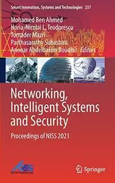
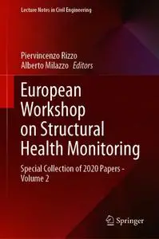

# Zavat feed - 2026-08-19

---

**Time:** 02:17:50 (Asia/Tehran)  
**Blog:** AvaxGenius  

**Title:** Networking, Intelligent Systems and Security: Proceedings of NISS 2021 (Repost)  

**Details:** English | EPUB | 2022 | 885 Pages | ISBN : 9811636362 | 143.6 MB  

**Link:** http://zavat.pw/ebooks/981163663662.html  

---

**Time:** 02:17:50 (Asia/Tehran)  
**Blog:** AvaxGenius  

**Title:** European Workshop on Structural Health Monitoring: Special Collection of 2020 Papers - Volume 2 (Repost)  

**Details:** English | EPUB | 2021 | 847 Pages | ISBN : 3030649075 | 232.5 MB  

**Link:** http://zavat.pw/ebooks/35030649075.html  

---

**Time:** 02:17:50 (Asia/Tehran)  
**Blog:** AvaxGenius  

**Title:** ARL Reader Planungstheorie Band 1: Kommunikative Planung - Neoinstitutionalismus und Governance (Repost)  

**Details:** Deutsch | PDF | 2019 | 365 Pages | ISBN : 3662576295 | 251.59 MB  

**Link:** http://zavat.pw/ebooks/366542576295.html  

---

**Time:** 02:17:50 (Asia/Tehran)  
**Blog:** AvaxGenius  

**Title:** New Technologies, Development and Application V (Repost)  

**Details:** English | PDF,EPUB | 2022 | 1151 Pages | ISBN : 3031052293 | 307.3 MB  

**Link:** http://zavat.pw/ebooks/303154052293.html  

