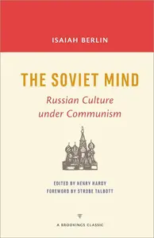
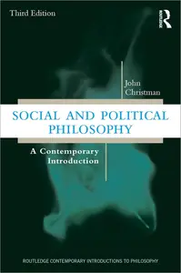
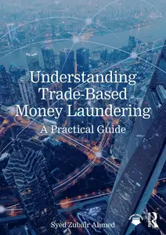
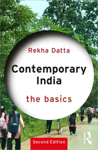

# Zavat feed - 2026-08-24

---

**Time:** 01:13:11 (Asia/Tehran)  
**Blog:** IrGens  

**Title:** The Soviet Mind: Russian Culture under Communism (A Brookings Classic)  

**Details:** English | October 11, 2016 | ISBN: 0815728875, ‎ 9780815728887 | True EPUB | 315 pages | 1.7 MB  

**Link:** http://zavat.pw/ebooks/0815728875.html  

---

**Time:** 01:13:11 (Asia/Tehran)  
**Blog:** IrGens  

**Title:** Social and Political Philosophy: A Contemporary Introduction, 3rd Edition  

**Details:** English | July 22, 2026 | ISBN: 1032907797, 1032907843, ‎ 9781040675281, 9781003559788 | True EPUB/PDF | 392 pages | 0.5/27.8 MB  

**Link:** http://zavat.pw/ebooks/1032907797.html  

---

**Time:** 01:13:11 (Asia/Tehran)  
**Blog:** IrGens  

**Title:** Understanding Trade-Based Money Laundering: A Practical Guide  

**Details:** English | July 24, 2026 | ISBN: 1032762233, 1032762217, ‎ 9781040747445, 9781003477631 | True EPUB/PDF | 280 pages | 5.8/9.3 MB  

**Link:** http://zavat.pw/ebooks/1032762233.html  

---

**Time:** 00:44:11 (Asia/Tehran)  
**Blog:** IrGens  

**Title:** The Routledge History of Love in World Literature and Culture  

**Details:** English | July 24, 2026 | ISBN: 103295034X, 9781040681817, 9781003566182 | True EPUB/PDF | 340 pages | 2.6/4.7 MB  

**Link:** http://zavat.pw/ebooks/103295034X.html  

---

**Time:** 00:44:11 (Asia/Tehran)  
**Blog:** IrGens  

**Title:** Contemporary India: The Basics, 2nd Edition  

**Details:** English | July 27, 2026 | ISBN: 1032856092, 1032856106, 9781040650455, 9781003518983 | True EPUB/PDF | 236 pages | 2.1/3.96 MB  

**Link:** http://zavat.pw/ebooks/1032856092.html  

