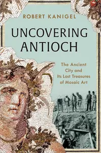
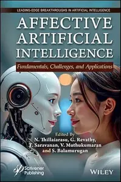

# Zavat feed - 2026-08-26

---

**Time:** 02:22:12 (Asia/Tehran)  
**Blog:** IrGens  

**Title:** Chamber Music: A Very Short Introduction  

**Details:** English | September 1, 2026 | ISBN: 0197833624, 9780197833636 | True EPUB | 152 pages | 7.6 MB  

**Link:** http://zavat.pw/ebooks/0197833624.html  

---

**Time:** 02:22:12 (Asia/Tehran)  
**Blog:** IrGens  

**Title:** The Blood-Dimmed Tide: Central Europe's Long Great War, 1905–1921  

**Details:** English | August 11, 2026 | ISBN: 067497235X, 9780674305410 | True EPUB | 304 pages | 1.5 MB  

**Link:** http://zavat.pw/ebooks/067497235X.html  

---

**Time:** 01:20:51 (Asia/Tehran)  
**Blog:** IrGens  

**Title:** What Happened to College?: How Politics Broke Higher Education and What We Can Do to Fix It  

**Details:** English | August 25, 2026 | ISBN: 1668200449, 9781668200469 | True EPUB | 288 pages | 4.2 MB  

**Link:** http://zavat.pw/ebooks/1668200449.html  

---

**Time:** 01:20:51 (Asia/Tehran)  
**Blog:** IrGens  

**Title:** Battle Axes: A Hard Rockin' History of Pointy Guitars  

**Details:** English | August 25, 2026 | ISBN: 177041794X, 9781778525551 | True EPUB | 376 pages | 16.9 MB  

**Link:** http://zavat.pw/ebooks/177041794X.html  

---

**Time:** 01:20:51 (Asia/Tehran)  
**Blog:** IrGens  

**Title:** The Complete Enneagram: 27 Paths to Greater Self-Knowledge, Renewed Edition  

**Details:** English | August 25, 2026 | ISBN: 1250450527, 9781250450531 | True EPUB | 544 pages | 6.5 MB  

**Link:** http://zavat.pw/ebooks/1250450527.html  

---

**Time:** 01:20:51 (Asia/Tehran)  
**Blog:** IrGens  

**Title:** Betrayal: Trump, Putin and The New Age of Conquest  

**Details:** English | 27 Aug. 2026 | ISBN: 1783353376, 1783353392, 9781783353408 | True EPUB | 368 pages | 2.9 MB  

**Link:** http://zavat.pw/ebooks/1783353376.html  

---

**Time:** 01:20:51 (Asia/Tehran)  
**Blog:** IrGens  

**Title:** Uncovering Antioch: The Ancient City and Its Lost Treasures of Mosaic Art  

**Details:** English | August 25, 2026 | ISBN: 1668006251, 9781668006245 | True EPUB | 320 pages | 70 MB  

**Link:** http://zavat.pw/ebooks/1668006251.html  

---

**Time:** 00:23:39 (Asia/Tehran)  
**Blog:** hill0  

**Title:** Macroeconomics For Dummies, U.S. Edition, 2nd Edition  

**Details:** English | 2026 | ISBN: 1394412282 | 417 Pages | EPUB | 3 MB  

**Link:** http://zavat.pw/ebooks/1394412282E.html  

---

**Time:** 00:23:39 (Asia/Tehran)  
**Blog:** hill0  

**Title:** The AI Instinct  

**Details:** English | 2026 | ISBN: 1394392125 | 193 Pages | PDF | 1.3 MB  

**Link:** http://zavat.pw/ebooks/1394392125.html  

---

**Time:** 00:23:39 (Asia/Tehran)  
**Blog:** hill0  

**Title:** Affective Artificial Intelligence: Fundamentals, Challenges, and Applications  

**Details:** English | 2026 | ISBN: 1394422725 | 483 Pages | EPUB | 9 MB  

**Link:** http://zavat.pw/ebooks/1394422725E.html  

