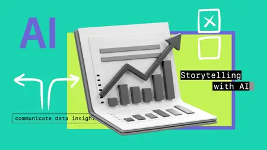

# Zavat feed - 2026-08-27

---

**Time:** 03:24:54 (Asia/Tehran)  
**Blog:** IrGens  

**Title:** Go: The Big Picture [Updated Aug 25, 2026]  

**Details:** .MP4, AVC, 1920x1080, 30 fps | English, AAC, 2 Ch | 1h 21m | 181 MB  

**Link:** http://zavat.pw/ebooks/go-big-picture-ai.html  

---

**Time:** 03:24:54 (Asia/Tehran)  
**Blog:** IrGens  

**Title:** Quantum Computing Qubits to Algorithms  

**Details:** .MP4, AVC, 1920x1080, 30 fps | English, AAC, 2 Ch | 1h 27m | 299 MB  

**Link:** http://zavat.pw/ebooks/quantum-computing-qubits-algorithms.html  

---

**Time:** 03:24:54 (Asia/Tehran)  
**Blog:** IrGens  

**Title:** GitHub Copilot: Multi-model Strategy and Agent Mode  

**Details:** .MP4, AVC, 1920x1080, 30 fps | English, AAC, 2 Ch | 54m | 304 MB  

**Link:** http://zavat.pw/ebooks/github-copilot-multi-model-strategy-agent-mode.html  

---

**Time:** 03:24:54 (Asia/Tehran)  
**Blog:** IrGens  

**Title:** AI-enabled Application Integration with Semantic Kernel  

**Details:** .MP4, AVC, 1920x1080, 30 fps | English, AAC, 2 Ch | 1h 20m | 360 MB  

**Link:** http://zavat.pw/ebooks/ai-enabled-application-integration-semantic-kernel.html  

---

**Time:** 03:24:54 (Asia/Tehran)  
**Blog:** IrGens  

**Title:** Data Visualization and Storytelling with AI: Design Visuals That Drive Better Decisions  

**Details:** .MP4, AVC, 1280x720, 30 fps | English, AAC, 2 Ch | 1h 19m | 274 MB  

**Link:** http://zavat.pw/ebooks/data-visualization-and-storytelling-with-ai-design-visuals-that-drive-better-decisions.html  

