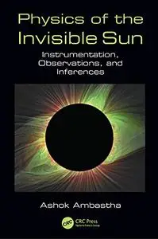
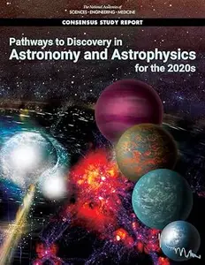
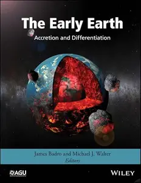

# Zavat feed - 2026-08-30

---

**Time:** 01:21:31 (Asia/Tehran)  
**Blog:** IrGens  

**Title:** Modern JavaScript: The Efficiency Upgrade  

**Details:** .MP4, AVC, 1920x1080, 30 fps | English, AAC, 2 Ch | 1h 36m | 224 MB  

**Link:** http://zavat.pw/ebooks/modern-javascript-efficiency-upgrade.html  

---

**Time:** 01:21:31 (Asia/Tehran)  
**Blog:** IrGens  

**Title:** How Economics Discovered Women: Bringing Gender Economics into the Twenty-First Century  

**Details:** English | August 25, 2026 | ISBN: 0520413423, 9780520413436 | True EPUB | 264 pages | 1 MB  

**Link:** http://zavat.pw/ebooks/0520413423.html  

---

**Time:** 01:21:31 (Asia/Tehran)  
**Blog:** IrGens  

**Title:** The Genius and the Impostor: The Neuroscience of Unlocking Human Potential  

**Details:** English | August 25, 2026 | ISBN: 0593850998, 9780593851012 | True EPUB | 336 pages | 6.9 MB  

**Link:** http://zavat.pw/ebooks/0593850998.html  

---

**Time:** 01:21:31 (Asia/Tehran)  
**Blog:** IrGens  

**Title:** Reds: A Global History of Communism  

**Details:** English | 27 Aug. 2026 | ISBN: 1035905906, 9781035905898 | True EPUB | 592 pages | 22.3 MB  

**Link:** http://zavat.pw/ebooks/1035905906.html  

---

**Time:** 01:21:31 (Asia/Tehran)  
**Blog:** IrGens  

**Title:** Eleven Days: The fascinating true account of Agatha Christie's mysterious disappearance  

**Details:** English | 27 Aug. 2026 | ISBN: 1835015735, 1835015751, 9781835015742 | True EPUB | 224 pages | 6.6 MB  

**Link:** http://zavat.pw/ebooks/1835015735.html  

---

**Time:** 01:21:31 (Asia/Tehran)  
**Blog:** IrGens  

**Title:** The Grip of the Ice: Scott, Shackleton and Survival in the Frozen Frontier  

**Details:** English | 30 July 2026 | ISBN: 0008774528, 9780008774530 | True EPUB | 368 pages | 17.4 MB  

**Link:** http://zavat.pw/ebooks/0008774528.html  

---

**Time:** 01:21:31 (Asia/Tehran)  
**Blog:** hill0  

**Title:** Fundamentals of Producing Lift Forces  

**Details:** English | 2026 | ISBN: 9819222214 | 152 Pages | PDF (True) | 24 MB  

**Link:** http://zavat.pw/ebooks/9819222214.html  

---

**Time:** 01:21:31 (Asia/Tehran)  
**Blog:** hill0  

**Title:** Synergizing Management, Culture, and Arts for Tourism Development - Vol. 3  

**Details:** English | 2026 | ISBN: 3032330513 | 882 Pages | PDF (True) | 35 MB  

**Link:** http://zavat.pw/ebooks/3032330513.html  

---

**Time:** 01:21:31 (Asia/Tehran)  
**Blog:** hill0  

**Title:** Physics of the Invisible Sun  

**Details:** English | 2020 | ISBN: 1138197440 | 323 Pages | EPUB (True) | 9 MB  

**Link:** http://zavat.pw/ebooks/1138197440E.html  

---

**Time:** 01:21:31 (Asia/Tehran)  
**Blog:** hill0  

**Title:** Black Holes  

**Details:** English | 2011 | ISBN: 1107005531 | 333 Pages | PDF (True) | 9 MB  

**Link:** http://zavat.pw/ebooks/1107005531.html  

---

**Time:** 01:21:31 (Asia/Tehran)  
**Blog:** hill0  

**Title:** Pathways to Discovery in Astronomy and Astrophysics for the 2020s  

**Details:** English | 2024 | ISBN: 0309467349 | 1113 Pages | EPUB (True) | 34 MB  

**Link:** http://zavat.pw/ebooks/0309467349.html  

---

**Time:** 01:21:31 (Asia/Tehran)  
**Blog:** hill0  

**Title:** Origins, Worlds, and Life  

**Details:** English | 2024 | ISBN: 0309475783 | 1402 Pages | EPUB (True) | 65 MB  

**Link:** http://zavat.pw/ebooks/0309475783E.html  

---

**Time:** 01:21:31 (Asia/Tehran)  
**Blog:** hill0  

**Title:** EPS Grand Challenges: Physics for Society in the Horizon 2050  

**Details:** English | 2024 | ISBN: 075036338X | 830 Pages | PDF (True) | 139 MB  

**Link:** http://zavat.pw/ebooks/075036338X.html  

---

**Time:** 01:21:31 (Asia/Tehran)  
**Blog:** hill0  

**Title:** The Early Earth: Accretion and Differentiation  

**Details:** English | 2015 | ISBN: 1118860578 | 469 Pages | EPUB (True) | 16 MB  

**Link:** http://zavat.pw/ebooks/1118860578E.html  

---

**Time:** 01:21:31 (Asia/Tehran)  
**Blog:** hill0  

**Title:** Beyond the Standard Model of Elementary Particle Physics  

**Details:** English | 2012 | ISBN: 3527411771 | 840 Pages | EPUB (True) | 57 MB  

**Link:** http://zavat.pw/ebooks/3527411771E.html  

---

**Time:** 01:21:31 (Asia/Tehran)  
**Blog:** hill0  

**Title:** Building Modern Data Applications with MongoDB and .NET  

**Details:** English | 2026 | ISBN: 1807786137 | 314 Pages | EPUB (True) | 4.4 MB  

**Link:** http://zavat.pw/ebooks/1807786137.html  

---

**Time:** 01:21:31 (Asia/Tehran)  
**Blog:** hill0  

**Title:** Reconstructing Wind Fields from Gravitational Data on Gas Giants  

**Details:** English | 2026 | ISBN: 3658512768 | 84 Pages | EPUB (True) | 6 MB  

**Link:** http://zavat.pw/ebooks/3658512768e.html  

