# Zavat feed - 2026-08-31

---

**Time:** 03:09:42 (Asia/Tehran)  
**Blog:** AvaxGenius  

**Title:** Polar Remote Sensing Volume I: Atmosphere and Oceans  

**Details:** English | PDF(True) | 2006 | 868 Pages | ISBN : 3540430970 | 40.9 MB  

**Link:** http://zavat.pw/ebooks/35404370970.html  

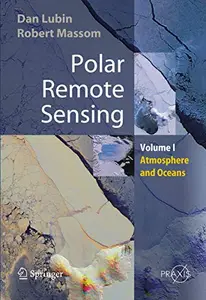

---

**Time:** 03:09:42 (Asia/Tehran)  
**Blog:** AvaxGenius  

**Title:** Logos of Phenomenology and Phenomenology of The Logos. Book Four (Repost)  

**Details:** English | PDF | 2006 | 358 Pages | ISBN : 1402037368 | 1.7 MB  

**Link:** http://zavat.pw/ebooks/14025037368.html  

---

**Time:** 03:09:42 (Asia/Tehran)  
**Blog:** AvaxGenius  

**Title:** Encyclopaedia of the History of Science, Technology, and Medicine in Non-Western Cultures (Repost)  

**Details:** English | PDF(True) | 2008 | 2428 Pages | ISBN : 140204559X | 103.6 MB  

**Link:** http://zavat.pw/ebooks/14023045559X.html  

---

**Time:** 03:09:42 (Asia/Tehran)  
**Blog:** AvaxGenius  

**Title:** Knee Arthroscopy and Knee Preservation Surgery (Repost)  

**Details:** English | PDF (True) | 2024 | 1331 Pages | ISBN : 3031294297 | 106.5 MB  

**Link:** http://zavat.pw/ebooks/303122945297.html  

---

**Time:** 03:09:42 (Asia/Tehran)  
**Blog:** AvaxGenius  

**Title:** Business and Consumer Analytics: New Ideas (Repost)  

**Details:** English | EPUB | 2019 | 1000 Pages | ISBN : 303006221X | 101.14 MB  

**Link:** http://zavat.pw/ebooks/30300762215X.html  

---

**Time:** 03:09:42 (Asia/Tehran)  
**Blog:** AvaxGenius  

**Title:** Encyclopedia of Optimization (Repost)  

**Details:** English | PDF | 2001 | 3001 Pages | ISBN : 0792369327 | 241.9 MB  

**Link:** http://zavat.pw/ebooks/037923695327.html  

---

**Time:** 03:09:42 (Asia/Tehran)  
**Blog:** AvaxGenius  

**Title:** History of Cryptography and Cryptanalysis: Codes, Ciphers, and Their Algorithms, Second Edition  

**Details:** English | PDF EPUB (True) | 2024 | 353 Pages | ISBN : 3031674847 | 101.2 MB  

**Link:** http://zavat.pw/ebooks/303156748437.html  

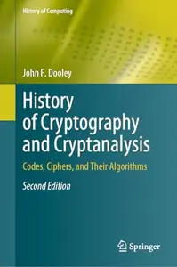

---

**Time:** 03:09:42 (Asia/Tehran)  
**Blog:** AvaxGenius  

**Title:** The 3D Stereotaxic Brain Atlas of the Degu: With MRI and Histology Digital Model with a Freely Rotatable Viewer (Repost)  

**Details:** English | EPUB | 2018 | 149 Pages | ISBN : 4431566139 | 210.1 MB  

**Link:** http://zavat.pw/ebooks/443135661439.html  

---

**Time:** 03:09:42 (Asia/Tehran)  
**Blog:** AvaxGenius  

**Title:** Dispersity, Structure and Phase Changes of Proteins and Bio Agglomerates in Biotechnological Processes (Repost)  

**Details:** English | EPUB (True) | 2024 | 548 Pages | ISBN : 3031631633 | 113.9 MB  

**Link:** http://zavat.pw/ebooks/305316351633.html  

---

**Time:** 03:09:42 (Asia/Tehran)  
**Blog:** AvaxGenius  

**Title:** Multivariate Analysis of Ecological Data With Ade4 (Repost)  

**Details:** English | EPUB | 2018 | 334 Pages | ISBN : 1493988484 | 95.5 MB  

**Link:** http://zavat.pw/ebooks/1493298284284.html  

---

**Time:** 03:09:42 (Asia/Tehran)  
**Blog:** AvaxGenius  

**Title:** East Asian Architecture in Globalization: Values, Inheritance and Dissemination (Repost)  

**Details:** English | EPUB (True) | 2021 | 634 Pages | ISBN : 3030759369 | 227.3 MB  

**Link:** http://zavat.pw/ebooks/305307593469.html  

---

**Time:** 03:09:42 (Asia/Tehran)  
**Blog:** AvaxGenius  

**Title:** Biocomposite Materials: Design and Mechanical Properties Characterization (Repost)  

**Details:** English | EPUB | 2021 | 345 Pages | ISBN : 9813340908 | 95.4 MB  

**Link:** http://zavat.pw/ebooks/981334609608.html  

---

**Time:** 03:09:42 (Asia/Tehran)  
**Blog:** AvaxGenius  

**Title:** Interventional Pain: A Step-by-Step Guide for the FIPP Exam (Repost)  

**Details:** English | EPUB | 2021 | 205 Pages | ISBN : 3030317404 | 225.7 MB  

**Link:** http://zavat.pw/ebooks/303031746504.html  

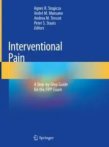

---

**Time:** 03:09:42 (Asia/Tehran)  
**Blog:** AvaxGenius  

**Title:** Data Science and Intelligent Systems (Repost)  

**Details:** English | PDF | 2022 | 1073 Pages | ISBN : 3030903206 | 114.8 MB  

**Link:** http://zavat.pw/ebooks/303049032606.html  

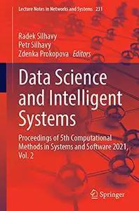

---

**Time:** 03:09:42 (Asia/Tehran)  
**Blog:** AvaxGenius  

**Title:** A Geoinformatics Approach to Water Erosion: Soil Loss and Beyond (Repost)  

**Details:** English | EPUB | 2022 | 364 Pages | ISBN : 3030915352 | 103.6 MB  

**Link:** http://zavat.pw/ebooks/303091653652.html  

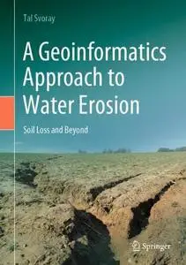

---

**Time:** 00:49:03 (Asia/Tehran)  
**Blog:** AvaxGenius  

**Title:** The Far Side of the Moon: A Photographic Guide (Repost)  

**Details:** English | True PDF | 2008 | 224 Pages | ISBN : 0387732055 | 224.29 MB  

**Link:** http://zavat.pw/ebooks/038773420655.html  

---

**Time:** 00:49:03 (Asia/Tehran)  
**Blog:** AvaxGenius  

**Title:** Handbook of Nondestructive Evaluation 4.0 (Repost)  

**Details:** English | EPUB | 2022 | 1282 Pages | ISBN : 3030732053 | 228.1 MB  

**Link:** http://zavat.pw/ebooks/303507326053.html  

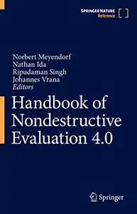

---

**Time:** 00:49:03 (Asia/Tehran)  
**Blog:** AvaxGenius  

**Title:** New Energy Vehicle Powertrain Technologies and Applications (Repost)  

**Details:** English | EPUB (True) | 2023 | 461 Pages | ISBN : 9811995656 | 166.4 MB  

**Link:** http://zavat.pw/ebooks/981619956656.html  

---

**Time:** 00:49:03 (Asia/Tehran)  
**Blog:** AvaxGenius  

**Title:** Proceedings of the 10th International Conference on Rotor Dynamics – IFToMM: Vol. 3 (Repost)  

**Details:** English | PDF | 2018 (2019 Edition) | 550 Pages | ISBN : 3319992694 | 96.8 MB  

**Link:** http://zavat.pw/ebooks/331499926946.html  

---

**Time:** 00:49:03 (Asia/Tehran)  
**Blog:** AvaxGenius  

**Title:** Impact: Design With All Senses: Proceedings of the Design Modelling Symposium, Berlin 2019 (Repost)  

**Details:** English | EPUB | 2020 | 802 Pages | ISBN : 3030298280 | 229.75 MB  

**Link:** http://zavat.pw/ebooks/430302968280.html  

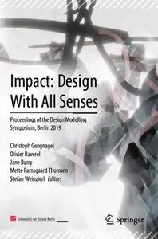

---

**Time:** 00:49:03 (Asia/Tehran)  
**Blog:** AvaxGenius  

**Title:** EEG/MEG Source Reconstruction: Textbook for Electro-and Magnetoencephalography (Repost)  

**Details:** English | EPUB (True) | 2022 | 429 Pages | ISBN : 3030749169 | 114.6 MB  

**Link:** http://zavat.pw/ebooks/360307491669.html  

---

**Time:** 00:49:03 (Asia/Tehran)  
**Blog:** AvaxGenius  

**Title:** Soft Rock Mechanics and Engineering (Repost)  

**Details:** English | EPUB | 2020 | 750 Pages | ISBN : 3030294765 | 174 MB  

**Link:** http://zavat.pw/ebooks/303042947565.html  

---

**Time:** 00:49:03 (Asia/Tehran)  
**Blog:** AvaxGenius  

**Title:** Global Bariatric Surgery: The Art of Weight Loss Across the Borders (Repost)  

**Details:** English | EPUB | 2018 | 512 Pages | ISBN : 3319935445 | 117.41 MB  

**Link:** http://zavat.pw/ebooks/3319954354445.html  

---

**Time:** 00:49:03 (Asia/Tehran)  
**Blog:** AvaxGenius  

**Title:** Advanced Machine Learning Technologies and Applications: Proceedings of AMLTA 2021 (Repost)  

**Details:** English | PDF | 2021 | 1144 Pages | ISBN : 3030697169 | 122.7 MB  

**Link:** http://zavat.pw/ebooks/305306974169.html  

---

**Time:** 00:49:03 (Asia/Tehran)  
**Blog:** AvaxGenius  

**Title:** Modelling the Evolution of Natural Fracture Networks (Repost)  

**Details:** English | EPUB | 2020 | 237 Pages | ISBN : 3030524132 | 102.2 MB  

**Link:** http://zavat.pw/ebooks/303054524132.html  

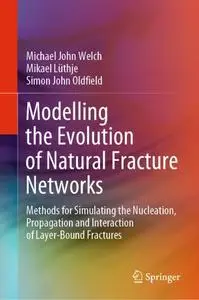

---

**Time:** 00:49:03 (Asia/Tehran)  
**Blog:** hill0  

**Title:** Bird (DK Eyewitness)  

**Details:** English | 2024 | ISBN: 0744092116 | 74 Pages | PDF (True) | 27 MB  

**Link:** http://zavat.pw/ebooks/0744092116.html  

---

**Time:** 00:49:03 (Asia/Tehran)  
**Blog:** hill0  

**Title:** Deploying a Modern Security Data Lake  

**Details:** English | 2022 | ISBN: 9781098134983 | 46 Pages | PDF (True) | 3 MB  

**Link:** http://zavat.pw/ebooks/9781098134983.html  

---

**Time:** 00:49:03 (Asia/Tehran)  
**Blog:** hill0  

**Title:** Ancient Worlds  

**Details:** English | 2026 | ISBN: 0744092892 | 34 Pages | PDF (True) | 30 MB  

**Link:** http://zavat.pw/ebooks/0744092892.html  

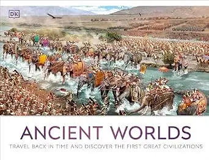

---

**Time:** 00:49:03 (Asia/Tehran)  
**Blog:** hill0  

**Title:** The Magic and Mystery of Space  

**Details:** English | 2025 | ISBN: 0241704871 | 82 Pages | PDF (True) | 58 MB  

**Link:** http://zavat.pw/ebooks/0241704871.html  

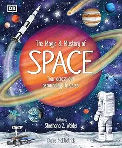

---

**Time:** 00:49:03 (Asia/Tehran)  
**Blog:** hill0  

**Title:** DK Super Planet Essential Ecosystems  

**Details:** English | 2025 | ISBN: 0593962605 | 50 Pages | PDF (True) | 27 MB  

**Link:** http://zavat.pw/ebooks/0593962605.html  

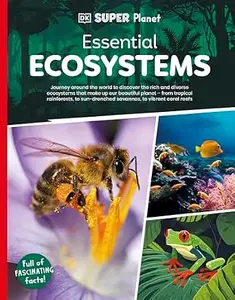

---

**Time:** 00:49:03 (Asia/Tehran)  
**Blog:** hill0  

**Title:** Principles for Navigating Big Debt Crises  

**Details:** English | 2022 | ISBN: 139852090X | 651 Pages | EPUB (True) | 122 MB  

**Link:** http://zavat.pw/ebooks/139852090X.html  

---

**Time:** 00:49:03 (Asia/Tehran)  
**Blog:** hill0  

**Title:** AI for You: The New Game Changer  

**Details:** English | 2022 | ISBN: 9369523731 | 261 Pages | EPUB (True) | 1 MB  

**Link:** http://zavat.pw/ebooks/9369523731.html  

---

**Time:** 00:49:03 (Asia/Tehran)  
**Blog:** hill0  

**Title:** AI. Civility. Climate.: Ways to Move Forward  

**Details:** English | 2026 | ISBN: 1606497170 | 222 Pages | EPUB (True) | 39 MB  

**Link:** http://zavat.pw/ebooks/1606497170.html  

---

**Time:** 00:49:03 (Asia/Tehran)  
**Blog:** hill0  

**Title:** Coupled Instabilities in Metal Structures  

**Details:** English | 2026 | ISBN: 3032362091 | 512 Pages | PDF (True) | 92 MB  

**Link:** http://zavat.pw/ebooks/3032362091.html  

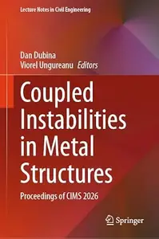

---

**Time:** 00:49:03 (Asia/Tehran)  
**Blog:** hill0  

**Title:** Clinical Laryngology: The Essentials  

**Details:** English | 2015 | ISBN: 9382076964 | 730 Pages | EPUB (True) | 11 MB  

**Link:** http://zavat.pw/ebooks/9382076964.html  

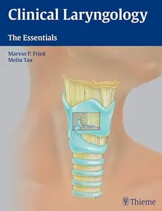

---

**Time:** 00:49:03 (Asia/Tehran)  
**Blog:** hill0  

**Title:** Encyclopedia of Football Medicine, Volume 1 : Trauma and Medical Emergencies  

**Details:** English | 2017 | ISBN: 3132203211 | 231 Pages | EPUB (True) | 7 MB  

**Link:** http://zavat.pw/ebooks/3132203211E.html  

---

**Time:** 00:49:03 (Asia/Tehran)  
**Blog:** crazy-slim  

**Title:** Il Globo - 31 Agosto 2026  

**Details:** Italiano | 40 pages | True PDF | 15.3 MB  

**Link:** http://zavat.pw/newspapers/IlGlobo31Agosto2026-15025.html  

---

**Time:** 00:49:03 (Asia/Tehran)  
**Blog:** crazy-slim  

**Title:** Sculpture - September-October 2026  

**Details:** English | 116 pages | True PDF | 33.1 MB  

**Link:** http://zavat.pw/magazines/SculptureSeptemberOctober2026-46306.html  

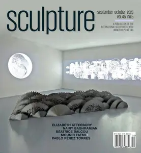

---

**Time:** 00:49:03 (Asia/Tehran)  
**Blog:** crazy-slim  

**Title:** 別冊2nd （別冊セカンド） - October 2026  

**Details:** 日本語 | 150 pages | True PDF | 184.6 MB  

**Link:** http://zavat.pw/magazines/%E5%88%A5%E5%86%8A2nd%E5%88%A5%E5%86%8A%E3%82%BB%E3%82%AB%E3%83%B3%E3%83%89October2026-42476.html  

