# Zavat feed - 2026-09-01

---

**Time:** 19:22:36 (Asia/Tehran)  
**Blog:** AvaxGenius  

**Title:** On the Geometry of Some Special Projective Varieties  

**Details:** English | PDF(True) | 2016 | 257 Pages | ISBN : 3319267647 | 2.8 MB  

**Link:** http://zavat.pw/ebooks/33192567647.html  

---

**Time:** 19:22:36 (Asia/Tehran)  
**Blog:** AvaxGenius  

**Title:** Elliptic Regularity Theory: A First Course  

**Details:** English | PDF(True) | 2016 | 214 Pages | ISBN : 3319274848 | 2.1 MB  

**Link:** http://zavat.pw/ebooks/33192754848.html  

---

**Time:** 19:22:36 (Asia/Tehran)  
**Blog:** AvaxGenius  

**Title:** An Introduction to Sobolev Spaces and Interpolation Spaces (Repost)  

**Details:** English | PDF | 2007 | 219 Pages | ISBN : 3540714820 | 1.6 MB  

**Link:** http://zavat.pw/ebooks/354075414820.html  

---

**Time:** 19:22:36 (Asia/Tehran)  
**Blog:** AvaxGenius  

**Title:** Zeta Functions over Zeros of Zeta Functions (Repost)  

**Details:** English | PDF(True) | 2010 | 171 Pages | ISBN : 3642052029 | 2.3 MB  

**Link:** http://zavat.pw/ebooks/36420520529.html  

---

**Time:** 19:22:36 (Asia/Tehran)  
**Blog:** AvaxGenius  

**Title:** Hilbert Functions of Filtered Modules (Repost)  

**Details:** English | PDF(True) | 2010 | 115 Pages | ISBN : 3642142397 | 1.3 MB  

**Link:** http://zavat.pw/ebooks/36421423597.html  

---

**Time:** 19:22:36 (Asia/Tehran)  
**Blog:** AvaxGenius  

**Title:** Hyperfinite Dirichlet Forms and Stochastic Processes  

**Details:** English | PDF(True) | 2011 | 295 Pages | ISBN : 3642196586 | 2.9 MB  

**Link:** http://zavat.pw/ebooks/53642196586.html  

---

**Time:** 19:22:36 (Asia/Tehran)  
**Blog:** AvaxGenius  

**Title:** Macchine matematiche: Dalla storia alla scuola  

**Details:** Italiano | PDF(True) | 2006 | 179 Pages | ISBN : 8847004020 | 2.8 MB  

**Link:** http://zavat.pw/ebooks/88470044020.html  

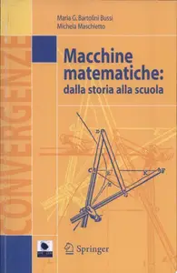

---

**Time:** 19:22:36 (Asia/Tehran)  
**Blog:** AvaxGenius  

**Title:** Giochi e percorsi matematici  

**Details:** Italiano | PDF | 2012 | 188 Pages | ISBN : 8847026156 | 2 MB  

**Link:** http://zavat.pw/ebooks/88457026156.html  

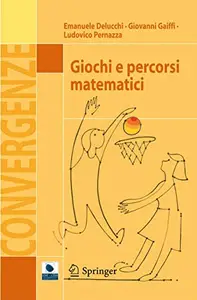

---

**Time:** 19:22:36 (Asia/Tehran)  
**Blog:** AvaxGenius  

**Title:** Applied Scanning Probe Methods XII: Characterization  

**Details:** English | PDF(True) | 2009 | 418 Pages | ISBN : 3540850384 | 28.5 MB  

**Link:** http://zavat.pw/ebooks/35408505384.html  

---

**Time:** 19:22:36 (Asia/Tehran)  
**Blog:** AvaxGenius  

**Title:** Applied Scanning Probe Methods VII: Biomimetics and Industrial Applications  

**Details:** English | PDF(True) | 2007 | 418 Pages | ISBN : 3540373209 | 7.9 MB  

**Link:** http://zavat.pw/ebooks/35450373209.html  

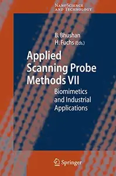

---

**Time:** 19:22:36 (Asia/Tehran)  
**Blog:** AvaxGenius  

**Title:** Applied Scanning Probe Methods VI: Characterization (Repost)  

**Details:** English | PDF | 2007 | 372 Pages | ISBN : 3540373187 | 18.6 MB  

**Link:** http://zavat.pw/ebooks/35403573187.html  

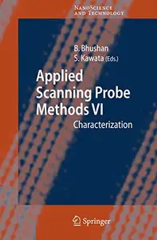

---

**Time:** 19:22:36 (Asia/Tehran)  
**Blog:** AvaxGenius  

**Title:** Applied Scanning Probe Methods V: Scanning Probe Microscopy Techniques  

**Details:** English | PDF(True) | 2007 | 380 Pages | ISBN : 3540373152 | 12.2 MB  

**Link:** http://zavat.pw/ebooks/35405373152.html  

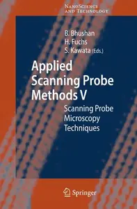

---

**Time:** 19:22:36 (Asia/Tehran)  
**Blog:** AvaxGenius  

**Title:** Applied Scanning Probe Methods IX: Characterization  

**Details:** English | PDF(True) | 2008 | 436 Pages | ISBN : 3540740821 | 9.2 MB  

**Link:** http://zavat.pw/ebooks/35405740821.html  

---

**Time:** 19:22:36 (Asia/Tehran)  
**Blog:** AvaxGenius  

**Title:** Applied Scanning Probe Methods I  

**Details:** English | PDF(True) | 2004 | 485 Pages | ISBN : 3540005277 | 52.5 MB  

**Link:** http://zavat.pw/ebooks/35405005277.html  

---

**Time:** 19:22:36 (Asia/Tehran)  
**Blog:** AvaxGenius  

**Title:** An Introduction to Bayesian Scientific Computing: Ten Lectures on Subjective Computing  

**Details:** English | PDF(True) | 2007 | 212 Pages | ISBN : 0387733930 | 4.1 MB  

**Link:** http://zavat.pw/ebooks/03877533930.html  

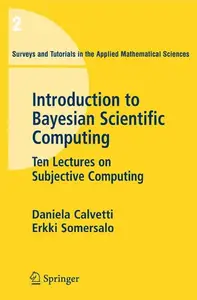

---

**Time:** 19:22:36 (Asia/Tehran)  
**Blog:** hill0  

**Title:** Function Theory on Symplectic Manifolds  

**Details:** English | 2014 | ISBN: 147041693X | 218 Pages | PDF (True) | 2 MB  

**Link:** http://zavat.pw/ebooks/147041693X.html  

---

**Time:** 19:22:36 (Asia/Tehran)  
**Blog:** hill0  

**Title:** My Encyclopedia of Very Important Science  

**Details:** English | 2025 | ISBN: 0593959353 | 226 Pages | PDF (True) | 87 MB  

**Link:** http://zavat.pw/ebooks/0593959353.html  

---

**Time:** 19:22:36 (Asia/Tehran)  
**Blog:** hill0  

**Title:** The Advanced Practitioner in Frailty and End-of-Life Care  

**Details:** English | 2026 | ISBN: 1394415826 | 676 Pages | EPUB (True) | 12 MB  

**Link:** http://zavat.pw/ebooks/1394415826e.html  

---

**Time:** 19:22:36 (Asia/Tehran)  
**Blog:** hill0  

**Title:** Davis's Comprehensive Handbook of Laboratory and Diagnostic Tests with Nursing Implications (6th Edition)  

**Details:** English | 2015 | ISBN: 0803644051 | 1827 Pages | PDF (True) | 19 MB  

**Link:** http://zavat.pw/ebooks/0803644051t.html  

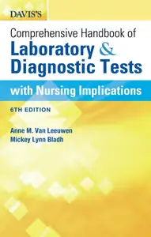

---

**Time:** 19:22:36 (Asia/Tehran)  
**Blog:** hill0  

**Title:** Chemical Recycling of Polyethylene Terephthalate  

**Details:** English | 2026 | ISBN: 3527357246 | 209 Pages | PDF | 8 MB  

**Link:** http://zavat.pw/ebooks/3527357246.html  

---

**Time:** 19:22:36 (Asia/Tehran)  
**Blog:** hill0  

**Title:** Automotive Acoustics Conference 2025  

**Details:** English | 2026 | ISBN: 3658512482 | 421 Pages | PDF (True) | 44 MB  

**Link:** http://zavat.pw/ebooks/3658512482.html  

---

**Time:** 19:22:36 (Asia/Tehran)  
**Blog:** hill0  

**Title:** The History Book: A Visual World History Encyclopedia for Kids  

**Details:** English | 2023 | ISBN: 0744076315 | 194 Pages | PDF (True) | 115 MB  

**Link:** http://zavat.pw/ebooks/0744076315.html  

---

**Time:** 19:22:36 (Asia/Tehran)  
**Blog:** hill0  

**Title:** The Myeloma Survival Guide (2nd Edition)  

**Details:** English | 2018 | ISBN: 0826127053 | 293 Pages | PDF (True) | 2 MB  

**Link:** http://zavat.pw/ebooks/0826127053.html  

---

**Time:** 19:22:36 (Asia/Tehran)  
**Blog:** hill0  

**Title:** Portuguese English Bilingual Visual Dictionary  

**Details:** English | 2024 | ISBN: 0241667771 | 362 Pages | PDF (True) | 98 MB  

**Link:** http://zavat.pw/ebooks/0241667771.html  

---

**Time:** 19:22:36 (Asia/Tehran)  
**Blog:** hill0  

**Title:** Proceedings of the 3rd International Conference on Machine Vision, Image Processing & Imaging Technology: Volume 2  

**Details:** English | 2026 | ISBN: 9819206065 | 367 Pages | PDF (True) | 65 MB  

**Link:** http://zavat.pw/ebooks/9819206065.html  

---

**Time:** 19:22:36 (Asia/Tehran)  
**Blog:** hill0  

**Title:** History of North America Map by Map  

**Details:** English | 2024 | ISBN: 0744092027 | 410 Pages | PDF (True) | 229 MB  

**Link:** http://zavat.pw/ebooks/0744092027p.html  

---

**Time:** 19:22:36 (Asia/Tehran)  
**Blog:** hill0  

**Title:** Husband & Reznek's Imaging in Oncology (4th Edition)  

**Details:** English | 2020 | ISBN: 113830123X | 2200 Pages | EPUB (True) | 82 MB  

**Link:** http://zavat.pw/ebooks/113830123Xe.html  

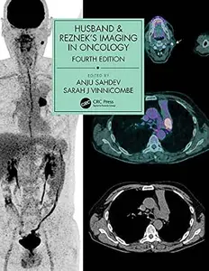

---

**Time:** 19:22:36 (Asia/Tehran)  
**Blog:** hill0  

**Title:** Surface NMR for Hydrogeology: A user’s guide  

**Details:** English | 2022 | ISBN: 0750331534 | 168 Pages | PDF EPUB (True) | 69 MB  

**Link:** http://zavat.pw/ebooks/0750331534.html  

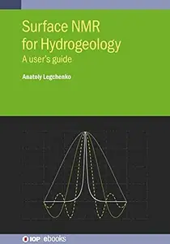

---

**Time:** 19:22:36 (Asia/Tehran)  
**Blog:** hill0  

**Title:** Nucleation, Fabrication, and Competition in Antiferromagnetic Textures Studied with Coherent Resonant Soft X-ray Scattering  

**Details:** English | 2026 | ISBN: 303219198X | 215 Pages | PDF (True) | 26 MB  

**Link:** http://zavat.pw/ebooks/303219198X.html  

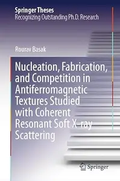

---

**Time:** 19:22:36 (Asia/Tehran)  
**Blog:** hill0  

**Title:** Maptastic!: A Mind-Blowing Map Adventure on Every Page  

**Details:** English | 2025 | ISBN: 0593972090 | 161 Pages | PDF (True) | 87 MB  

**Link:** http://zavat.pw/ebooks/0593972090.html  

---

**Time:** 19:22:36 (Asia/Tehran)  
**Blog:** crazy-slim  

**Title:** Mani di Fata Moda N.2 - Settembre-Ottobre 2026  

**Details:** Italiano | 84 pages | True PDF | 16.9 MB  

**Link:** http://zavat.pw/magazines/ManidiFataModaN2SettembreOttobre2026-70474.html  

---

**Time:** 19:22:36 (Asia/Tehran)  
**Blog:** crazy-slim  

**Title:** Gambero Rosso Italia - Settembre 2026  

**Details:** Italiano | 132 pages | True PDF | 61.1 MB  

**Link:** http://zavat.pw/magazines/GamberoRossoItaliaSettembre2026-84584.html  

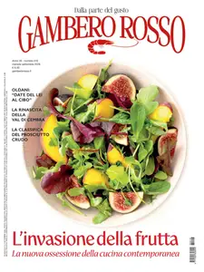

---

**Time:** 19:22:36 (Asia/Tehran)  
**Blog:** crazy-slim  

**Title:** Moto Sprint N.35 - 1 Settembre 2026  

**Details:** Italiano | 84 pages | True PDF | 18.2 MB  

**Link:** http://zavat.pw/magazines/MotoSprintN351Settembre2026-30194.html  

---

**Time:** 19:22:36 (Asia/Tehran)  
**Blog:** crazy-slim  

**Title:** Rotman Management - Fall 2026  

**Details:** English | 68 pages | True PDF | 20.6 MB  

**Link:** http://zavat.pw/magazines/RotmanManagementFall2026-89224.html  

---

**Time:** 19:22:36 (Asia/Tehran)  
**Blog:** crazy-slim  

**Title:** Guia Play Games - 1 Setembro 2026  

**Details:** Portuguese | 52 pages | True PDF | 36.7 MB  

**Link:** http://zavat.pw/magazines/GuiaPlayGames1Setembro2026-83805.html  

---

**Time:** 19:22:36 (Asia/Tehran)  
**Blog:** crazy-slim  

**Title:** Casa e Ambiente Bebê - 1 Setembro 2026  

**Details:** Portuguese | 148 pages | True PDF | 132.0 MB  

**Link:** http://zavat.pw/magazines/CasaeAmbienteBeb%C3%AA1Setembro2026-27384.html  

---

**Time:** 19:22:36 (Asia/Tehran)  
**Blog:** crazy-slim  

**Title:** Revista da Gestante - 1 Setembro 2026  

**Details:** Portuguese | 50 pages | True PDF | 29.1 MB  

**Link:** http://zavat.pw/magazines/RevistadaGestante1Setembro2026-82752.html  

---

**Time:** 19:22:36 (Asia/Tehran)  
**Blog:** crazy-slim  

**Title:** Universo Bebê e Criança - Setembro 2026  

**Details:** Portuguese | 34 pages | True PDF | 23.0 MB  

**Link:** http://zavat.pw/magazines/UniversoBeb%C3%AAeCrian%C3%A7aSetembro2026-53618.html  

---

**Time:** 19:22:36 (Asia/Tehran)  
**Blog:** crazy-slim  

**Title:** Discovery Publicações - 1 Setembro 2026  

**Details:** Portuguese | 82 pages | True PDF | 47.0 MB  

**Link:** http://zavat.pw/magazines/DiscoveryPublica%C3%A7%C3%B5es1Setembro2026-56324.html  

---

**Time:** 19:22:36 (Asia/Tehran)  
**Blog:** crazy-slim  

**Title:** Patrulha Canina - 1 Setembro 2026  

**Details:** Portuguese | 16 pages | True PDF | 9.4 MB  

**Link:** http://zavat.pw/magazines/PatrulhaCanina1Setembro2026-15660.html  

---

**Time:** 19:22:36 (Asia/Tehran)  
**Blog:** crazy-slim  

**Title:** Piadas para Crianças - 1 Setembro 2026  

**Details:** Portuguese | 20 pages | True PDF | 8.3 MB  

**Link:** http://zavat.pw/magazines/PiadasparaCrian%C3%A7as1Setembro2026-66057.html  

---

**Time:** 19:22:36 (Asia/Tehran)  
**Blog:** crazy-slim  

**Title:** Rolling Stone USA - September 2026  

**Details:** English | 84 pages | True PDF | 46.5 MB  

**Link:** http://zavat.pw/magazines/RollingStoneUSASeptember2026-93401.html  

---

**Time:** 19:22:36 (Asia/Tehran)  
**Blog:** crazy-slim  

**Title:** Beckett Hockey - September 2026  

**Details:** English | 180 pages | True PDF | 55.2 MB  

**Link:** http://zavat.pw/magazines/BeckettHockeySeptember2026-25831.html  

---

**Time:** 19:22:36 (Asia/Tehran)  
**Blog:** crazy-slim  

**Title:** Cuidando da Saúde - 1 Setembro 2026  

**Details:** Portuguese | 36 pages | True PDF | 11.2 MB  

**Link:** http://zavat.pw/magazines/CuidandodaSa%C3%BAde1Setembro2026-43554.html  

---

**Time:** 19:22:36 (Asia/Tehran)  
**Blog:** crazy-slim  

**Title:** Beckett Basketball - September 2026  

**Details:** English | 172 pages | True PDF | 51.1 MB  

**Link:** http://zavat.pw/magazines/BeckettBasketballSeptember2026-92275.html  

---

**Time:** 09:55:35 (Asia/Tehran)  
**Blog:** crazy-slim  

**Title:** Rute&Rolle - Oktober 2026  

**Details:** Deutsch | 100 pages | True PDF | 102.6 MB  

**Link:** http://zavat.pw/magazines/RuteRolleOktober2026-16417.html  

---

**Time:** 09:55:35 (Asia/Tehran)  
**Blog:** crazy-slim  

**Title:** von Frau zu Frau - 1 September 2026  

**Details:** Deutsch | 100 pages | PDF | 115.6 MB  

**Link:** http://zavat.pw/magazines/vonFrauzuFrau1September2026-52450.html  

---

**Time:** 09:55:35 (Asia/Tehran)  
**Blog:** crazy-slim  

**Title:** Spaß für mich - 1 September 2026  

**Details:** Deutsch | 84 pages | PDF | 89.7 MB  

**Link:** http://zavat.pw/magazines/Spa%C3%9Ff%C3%BCrmich1September2026-82639.html  

---

**Time:** 09:55:35 (Asia/Tehran)  
**Blog:** crazy-slim  

**Title:** Weidwerk - September 2026  

**Details:** Deutsch | 76 pages | True PDF | 46.2 MB  

**Link:** http://zavat.pw/magazines/WeidwerkSeptember2026-33730.html  

---

**Time:** 09:55:35 (Asia/Tehran)  
**Blog:** crazy-slim  

**Title:** Nur für die Frau - Oktober 2026  

**Details:** Deutsch | 48 pages | PDF | 52.0 MB  

**Link:** http://zavat.pw/magazines/Nurf%C3%BCrdieFrauOktober2026-23870.html  

---

**Time:** 09:55:35 (Asia/Tehran)  
**Blog:** crazy-slim  

**Title:** Spektrum Kompakt - 31 August 2026  

**Details:** Deutsch | 61 pages | True PDF | 6.8 MB  

**Link:** http://zavat.pw/magazines/SpektrumKompakt31August2026-41266.html  

---

**Time:** 09:55:35 (Asia/Tehran)  
**Blog:** crazy-slim  

**Title:** Reisen-Magazin - September-Oktober 2026  

**Details:** Deutsch | 116 pages | True PDF | 99.5 MB  

**Link:** http://zavat.pw/magazines/ReisenMagazinSeptemberOktober2026-40271.html  

---

**Time:** 09:55:35 (Asia/Tehran)  
**Blog:** crazy-slim  

**Title:** Separee - Nr.50 2026  

**Details:** Deutsch | 100 pages | True PDF | 53.5 MB  

**Link:** http://zavat.pw/magazines/SepareeNr502026-21508.html  

---

**Time:** 09:55:35 (Asia/Tehran)  
**Blog:** crazy-slim  

**Title:** Freizeit Vergnügen - 1 September 2026  

**Details:** Deutsch | 86 pages | PDF | 90.8 MB  

**Link:** http://zavat.pw/magazines/FreizeitVergn%C3%BCgen1September2026-84827.html  

---

**Time:** 09:55:35 (Asia/Tehran)  
**Blog:** crazy-slim  

**Title:** Freundin - 2 September 2026  

**Details:** Deutsch | 164 pages | True PDF | 70.9 MB  

**Link:** http://zavat.pw/magazines/Freundin2September2026-31230.html  

---

**Time:** 09:55:35 (Asia/Tehran)  
**Blog:** crazy-slim  

**Title:** Garten+Haus - September-Oktober 2026  

**Details:** Deutsch | 100 pages | True PDF | 71.0 MB  

**Link:** http://zavat.pw/magazines/GartenHausSeptemberOktober2026-93073.html  

---

**Time:** 09:55:35 (Asia/Tehran)  
**Blog:** crazy-slim  

**Title:** Motorsport aktuell - 1 September 2026  

**Details:** Deutsch | 48 pages | True PDF | 24.5 MB  

**Link:** http://zavat.pw/magazines/Motorsportaktuell1September2026-75073.html  

---

**Time:** 09:55:35 (Asia/Tehran)  
**Blog:** crazy-slim  

**Title:** Handballwoche - 1 September 2026  

**Details:** Deutsch | 68 pages | PDF | 62.4 MB  

**Link:** http://zavat.pw/magazines/Handballwoche1September2026-12667.html  

---

**Time:** 09:55:35 (Asia/Tehran)  
**Blog:** crazy-slim  

**Title:** Adel aktuell - 1 September 2026  

**Details:** Deutsch | 64 pages | PDF | 64.0 MB  

**Link:** http://zavat.pw/magazines/Adelaktuell1September2026-77205.html  

---

**Time:** 09:55:35 (Asia/Tehran)  
**Blog:** crazy-slim  

**Title:** epd Film - September 2026  

**Details:** Deutsch | 68 pages | True PDF | 28.8 MB  

**Link:** http://zavat.pw/magazines/epdFilmSeptember2026-18754.html  

---

**Time:** 04:30:42 (Asia/Tehran)  
**Blog:** IrGens  

**Title:** Create a Team of Agents in 10 Minutes  

**Details:** .MP4, AVC, 1280x720, 30 fps | English, AAC, 2 Ch | 9m | 31.2 MB  

**Link:** http://zavat.pw/ebooks/create-a-team-of-agents-in-10-minutes.html  

---

**Time:** 04:30:42 (Asia/Tehran)  
**Blog:** AvaxGenius  

**Title:** Mathematical Models (Repost)  

**Details:** English/Deutsch | PDF (True) | 2017 | 228 Pages | ISBN : 3658188642 | 169.5 MB  

**Link:** http://zavat.pw/ebooks/365818286425.html  

---

**Time:** 04:30:42 (Asia/Tehran)  
**Blog:** AvaxGenius  

**Title:** Solar Thermal Energy: A Volume in the Encyclopedia of Sustainability Science and Technology, Second Edition (Repost)  

**Details:** English | EPUB | 2022 | 514 Pages | ISBN : 1071614215 | 148.5 MB  

**Link:** http://zavat.pw/ebooks/103716145215.html  

---

**Time:** 04:30:42 (Asia/Tehran)  
**Blog:** AvaxGenius  

**Title:** Hydraulic Machines and Energy (Repost)  

**Details:** English | EPUB (True) | 2024 | 418 Pages | ISBN : 3030916006 | 155.9 MB  

**Link:** http://zavat.pw/ebooks/330309160056.html  

---

**Time:** 04:30:42 (Asia/Tehran)  
**Blog:** AvaxGenius  

**Title:** Mesozoic Stratigraphy of India: A Multi-Proxy Approach (Repost)  

**Details:** English | EPUB | 2021 | 733 Pages | ISBN : 3030713695 | 267.2 MB  

**Link:** http://zavat.pw/ebooks/303307135695.html  

---

**Time:** 04:30:42 (Asia/Tehran)  
**Blog:** AvaxGenius  

**Title:** Biogenic—Abiogenic Interactions in Natural and Anthropogenic Systems 2022 (Repost)  

**Details:** English | EPUB (True) | 2023 | 661 Pages | ISBN : 3031404696 | 144.2 MB  

**Link:** http://zavat.pw/ebooks/303140455696.html  

---

**Time:** 04:30:42 (Asia/Tehran)  
**Blog:** AvaxGenius  

**Title:** Modelling of the Interaction of the Different Vehicles and Various Transport Modes (Repost)  

**Details:** English | EPUB | 2020 | 535 Pages | ISBN : 3030115119 | 133.11 MB  

**Link:** http://zavat.pw/ebooks/303014315119.html  

---

**Time:** 04:30:42 (Asia/Tehran)  
**Blog:** AvaxGenius  

**Title:** Advances in Research on Water Resources and Environmental Systems (Repost)  

**Details:** English | EPUB | 2023 | 684 Pages | ISBN : 3031178076 | 205.6 MB  

**Link:** http://zavat.pw/ebooks/303311780756.html  

---

**Time:** 04:30:42 (Asia/Tehran)  
**Blog:** AvaxGenius  

**Title:** Urban and Metropolitan Rivers: Geomorphology, Planning and Perception (Repost)  

**Details:** English | EPUB (True) | 2024 | 310 Pages | ISBN : 3031626400 | 130.7 MB  

**Link:** http://zavat.pw/ebooks/303316526400.html  

---

**Time:** 04:30:42 (Asia/Tehran)  
**Blog:** AvaxGenius  

**Title:** Cutaneous Adnexal Neoplasms (Repost)  

**Details:** English | EPUB | 2017 | 1035 Pages | ISBN : 3319457039 | 308.6MB  

**Link:** http://zavat.pw/ebooks/331394570359.html  

---

**Time:** 04:30:42 (Asia/Tehran)  
**Blog:** AvaxGenius  

**Title:** Best Practices in Physics-based Fault Rupture Models for Seismic Hazard Assessment of Nuclear Installations (Repost)  

**Details:** English | PDF | 2017 (2018 Edition) | 333 Pages | ISBN : 3319727087 | 102.83 MB  

**Link:** http://zavat.pw/ebooks/331937270587.html  

---

**Time:** 04:30:42 (Asia/Tehran)  
**Blog:** AvaxGenius  

**Title:** Compendium of Histology: A Theoretical and Practical Guide (Repost)  

**Details:** English | PDF | 2017 | 670 Pages | ISBN : 3319418718 | 220.6 MB  

**Link:** http://zavat.pw/ebooks/333194187158.html  

---

**Time:** 04:30:42 (Asia/Tehran)  
**Blog:** AvaxGenius  

**Title:** Mechatronics 2017 (Repost)  

**Details:** English | PDF | 2018 | 767 Pages | ISBN : 3319659596 | 168.4 MB  

**Link:** http://zavat.pw/ebooks/333196659596.html  

---

**Time:** 04:30:42 (Asia/Tehran)  
**Blog:** AvaxGenius  

**Title:** Air and Water: Trade Winds, Hurricanes, Gulf Stream, Tsunamis and Other Striking Phenomena (Repost)  

**Details:** English | PDF | 2017 | 264 Pages | ISBN : 3319652133 | 117.7 MB  

**Link:** http://zavat.pw/ebooks/334196521533.html  

---

**Time:** 04:30:42 (Asia/Tehran)  
**Blog:** AvaxGenius  

**Title:** Encyclopedia of Signaling Molecules, Second Edition (Repost)  

**Details:** English | PDF,EPUB | 2018 | 6172 Pages | ISBN : 3319671987 | 375.2 MB  

**Link:** http://zavat.pw/ebooks/331946751987.html  

---

**Time:** 04:30:42 (Asia/Tehran)  
**Blog:** AvaxGenius  

**Title:** Technological Imagination in the Green and Digital Transition (Repost)  

**Details:** English | EPUB (True) | 2023 | 1027 Pages | ISBN : 3031295145 | 308.4 MB  

**Link:** http://zavat.pw/ebooks/303129553145.html  

---

**Time:** 01:28:20 (Asia/Tehran)  
**Blog:** IrGens  

**Title:** Six Sigma Foundations [Released: 8/31/2026]  

**Details:** .MP4, AVC, 1280x720, 30 fps | English, AAC, 2 Ch | 3h 31m | 577 MB  

**Link:** http://zavat.pw/ebooks/six-sigma-foundations-42491057.html  

---

**Time:** 01:28:20 (Asia/Tehran)  
**Blog:** AvaxGenius  

**Title:** Advanced Machine Learning Technologies and Applications: Proceedings of AMLTA 2021 (Reopst)  

**Details:** English | EPUB | 2021 | 1144 Pages | ISBN : 3030697169 | 134.2 MB  

**Link:** http://zavat.pw/ebooks/303046971639.html  

---

**Time:** 01:28:20 (Asia/Tehran)  
**Blog:** hill0  

**Title:** Radiology and Pathology Correlation of Bone Tumors, None  

**Details:** English | 2016 | ISBN: 146989887X | 1846 Pages | PDF | 240 MB  

**Link:** http://zavat.pw/ebooks/146989887XP.html  

---

**Time:** 01:28:20 (Asia/Tehran)  
**Blog:** hill0  

**Title:** Radiation Oncology Management Decisions, 4th Edition  

**Details:** English | 2019 | ISBN: 1496391098 | 1238 Pages | True EPUB | 126 MB  

**Link:** http://zavat.pw/ebooks/1496391098RE.html  

---

**Time:** 01:28:20 (Asia/Tehran)  
**Blog:** hill0  

**Title:** Practical Neurology Visual Review 2nd Edition  

**Details:** English | 2013 | ISBN: 1451182694 | 556 Pages | True EPUB | 15 MB  

**Link:** http://zavat.pw/ebooks/1451182694E.html  

---

**Time:** 01:28:20 (Asia/Tehran)  
**Blog:** hill0  

**Title:** Haematology Nursing  

**Details:** English | 2012 | ISBN: 1405169966 | 389 Pages | EPUB (True) | 7 MB  

**Link:** http://zavat.pw/ebooks/1405169966e.html  

---

**Time:** 01:28:20 (Asia/Tehran)  
**Blog:** hill0  

**Title:** 100 Cities, 5,000 Ideas  

**Details:** English | 2023 | ISBN: 1426221673 | 631 Pages | EPUB (True) | 587 MB  

**Link:** http://zavat.pw/ebooks/1426221673e.html  

---

**Time:** 01:28:20 (Asia/Tehran)  
**Blog:** hill0  

**Title:** The Beginner's Photography Guide  

**Details:** English | 2024 | ISBN: 0241666724 | 194 Pages | PDF (True) | 53 MB  

**Link:** http://zavat.pw/ebooks/0241666724.html  

---

**Time:** 01:28:20 (Asia/Tehran)  
**Blog:** hill0  

**Title:** Earth: The Definitive Visual Guide  

**Details:** English | 2024 | ISBN: ‎‎0744069831 | 530 Pages | PDF | 494 MB  

**Link:** http://zavat.pw/ebooks/Visual-Guide-Encyclopedia.html  

---

**Time:** 01:28:20 (Asia/Tehran)  
**Blog:** hill0  

**Title:** An Introduction to Electrical Circuit Theory: Volume 1  

**Details:** English | 2026 | ISBN: 3032343453 | 152 Pages | PDF EPUB (True) | 24 MB  

**Link:** http://zavat.pw/ebooks/3032343453.html  

---

**Time:** 01:28:20 (Asia/Tehran)  
**Blog:** hill0  

**Title:** React Native for Mobile Development (3rd Edition)  

**Details:** English | 2026 | ASIN: B0H2P48TWM | 363 Pages | PDF EPUB (True) | 6.4 MB  

**Link:** http://zavat.pw/ebooks/B0H2P48TWM.html  

---

**Time:** 01:28:20 (Asia/Tehran)  
**Blog:** hill0  

**Title:** ZX-Calculus for Quantum Circuits  

**Details:** English | 2026 | ASIN: B0GYRFFB3D | 352 Pages | PDF EPUB (True) | 22 MB  

**Link:** http://zavat.pw/ebooks/B0GYRFFB3D.html  

---

**Time:** 01:28:20 (Asia/Tehran)  
**Blog:** hill0  

**Title:** Essentials of Human Anatomy & Physiology (Global 13th Edition)  

**Details:** English | 2022 | ISBN: 129240194X | 659 Pages | PDF (True) | 70 MB  

**Link:** http://zavat.pw/ebooks/129240194Xt.html  

